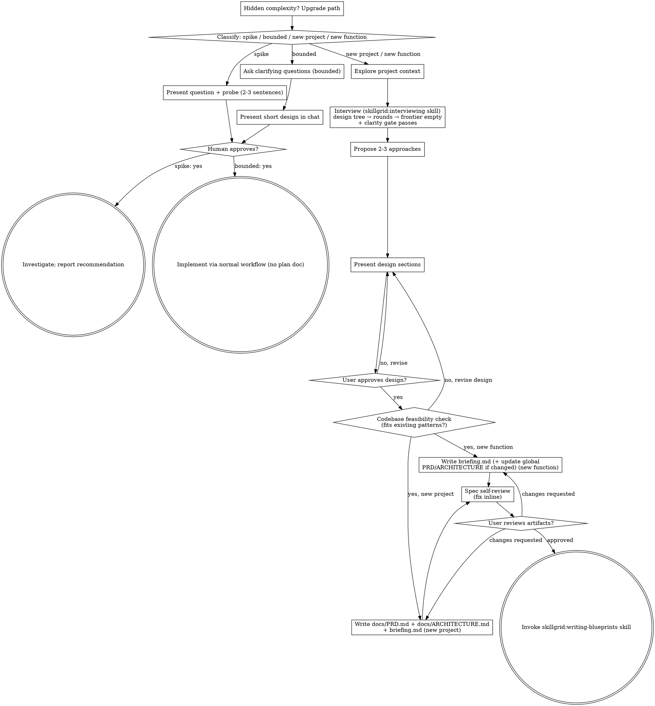

# Brainstorming Ideas Into Designs

**Config:** Read `.skillgrid/config.yaml` before starting. Use `conventions.specs_root` for spec location, `conventions.prd` for PRD path, `conventions.architecture` for ARCHITECTURE path. If the file doesn't exist, use the defaults shown in this skill.

Help turn ideas into fully formed designs and specs through natural collaborative dialogue.

Start by classifying how much process the request needs, then work
through your path: understand the context, refine the idea, present a
design, and get your human partner's approval.

<HARD-GATE>
Do NOT invoke any implementation skill, write any code, scaffold any
project, or take any implementation action until you have told your
human partner what you intend and they have approved it. This applies
to EVERY task on EVERY path below — the ceremony scales with the task;
the approval gate never does.
</HARD-GATE>

## Four Paths

Before your first question, classify the request and say the
classification out loud — "this looks bounded, so I'll present a short
design here rather than write a spec" — so your human partner can
override it:

- **Spike** — a feasibility question ("can we...", "is it possible...",
  "quick and dirty is fine") whose output is an answer, not code you
  keep. Two cases:
  - **Tiny** (one library, one command, one observable fact) — answer
    inline: present the question and what you'll try in 2-3 sentences,
    get a nod, find out as cheaply as correctness allows, report the
    finding in chat. No file.
  - **Real probe** (needs code executed, a comparison, edge cases, or a
    demo the user should feel) — delegate to the `skillgrid:spike`
    skill, which owns the hypothesis, the falsifiable verdict, the
    investigation trail, and the consolidated findings file. The spike
    skill's verdict is the recommendation; anything it built stays
    labeled throwaway.
  The tell for "real probe": you cannot state the answer without
  running something, or the answer depends on comparing two approaches.
- **Bounded** — a well-scoped change to code that already exists in
  this repo: a new flag, a small endpoint, a one-file fix.
  Understanding the kind of app is not enough — bounded means the flow
  you are changing is already here to read. If there is no existing
  flow to change, the task is not bounded. Ask the clarifying
  questions that matter, present a short design IN CHAT (a few
  sentences to a few short paragraphs), and STOP. Implementation
  starts only after your human partner says yes to that design — a
  bounded task's approval is as hard a gate as a new-function one.
  No spec file, no implementation plan document.
- **New Project** — a greenfield project, a new subsystem, or a change
  that restructures how components fit together or alters interfaces
  others depend on. There is no existing flow to read — you are
   creating the architecture. Follow the full process: interview the user
   (`skillgrid:interviewing` skill — design tree, rounds, clarity gate), approaches,
   sectioned design, then write the two global artifacts
  `docs/PRD.md` (product requirements) and `docs/ARCHITECTURE.md`
   (system architecture) and the spec `.skillgrid/specs/YYYY-MM-DD-<topic>/briefing.md`,
   all from the templates in `templates/` (`templates/PRD.md`,
   `templates/ARCHITECTURE.md`, `templates/briefing.md`).
   If the global files already exist (a second project in the repo),
   merge rather than overwrite. Then the skillgrid:writing-blueprints skill.
- **New Function** — a new feature, endpoint, or capability added to an
   existing project whose architecture is already in place. Follow the
   full process: interview the user (`skillgrid:interviewing` skill — design tree,
   rounds, clarity gate), approaches, sectioned design, then write the
   spec `.skillgrid/specs/YYYY-MM-DD-<topic>/briefing.md` from
   `templates/briefing.md`. If
   the feature changes the global `docs/PRD.md` (new feature row, changed
   metrics) or `docs/ARCHITECTURE.md` (new component, data store,
   integration), update those too — only when they exist AND the feature
   actually changes them. Then the skillgrid:writing-blueprints skill.

When in doubt between two paths, take the heavier one. The ratchet is
one-way: hidden complexity discovered mid-task upgrades the path —
stop, say so, and step up. Nothing downgrades mid-task.

## State

The two full paths (New Project, New Function) run long enough to outlive a
session: interview → approaches → design → feasibility → ADR manifest →
briefing. The path state — which checklist item you are on, which approach
was approved — lives in conversation, which rots.

- **Create `state.md`** (from `skillgrid:resume/templates/state.md`) in the
  topic's spec dir — `.skillgrid/specs/YYYY-MM-DD-<topic>/state.md` — at the
  first phase transition (after interview, before approaches).
- **Append at every phase transition** — before doing the next phase: update
  `Phase:`, add the finished phase to `Done:`, refresh `Open:` and
  `Decisions:` (each approved approach, each declined ADR, the feasibility
  verdict). If `mnemonic.enabled: true`, mirror it with
  `mem_save(topic_key: skillgrid/<topic>/state, type: architecture)` (upsert).
- **On resume:** the `skillgrid:resume` check in `skillgrid:using-skillgrid`
  finds the `state.md` and re-enters at the first incomplete checklist item.
- **Skip state.md** for the spike and bounded paths — they are short by
  design and produce no spec dir.

## Anti-Pattern: "Too Simple To Need Approval"

Every path ends with your human partner approving your intent before
implementation. A todo list, a single-function utility, a config
change — the design may be two sentences in chat, but you MUST present
it and get approval. "Simple" tasks are where unexamined assumptions
cause the most wasted work. What scales with simplicity is the
artifact, never the approval.

## Red Flags

| Thought | Reality |
|---------|---------|
| "This is too simple to need a design" | Simple means a short design, not no design. Two sentences in chat, then approval. |
| "I'll call it bounded and skip the spec" | Reaching for a label to skip work IS the doubt — take the heavier path. |
| "It's bounded and the design is obvious — I'll start while they read it" | The gate is the approval, not the design's length. Present, then stop until you hear yes. |
| "I understand this kind of app, so it's bounded" | Bounded measures the repo, not your familiarity. A new project has no existing flow — it is a new project, not bounded. |
| "The spike works, so I'll keep the code" | A spike's output is an answer. Keeping the code is a new request — classify it. |
| "It grew, but I'm almost done — no need to re-classify" | Hidden complexity upgrades the path mid-task. Stop and say so. |
| "They approved the spike, so the follow-up change is approved too" | Each task gets its own classification and its own approval. |

## Checklist

Classify first, announce the path, then create a task for each item on
your path and complete them in order.

**Spike (tiny — inline):**
1. **Explore project context** — enough to frame the probe
2. **Present question + probe plan** — 2-3 sentences
3. **Get approval** — a nod is enough
4. **Investigate** — as cheaply as correctness allows
5. **Report findings in chat** — a recommendation; label anything built as throwaway

**Spike (real probe — delegate):**
1. **Explore project context** — enough to frame the probe
2. **Delegate to `skillgrid:spike`** — it frames the falsifiable hypothesis, gets the nod, builds the experiment, writes the verdict + investigation trail, and appends to the topic's consolidated `findings.md`. Report back the verdict and what's liftable.

**Bounded:**
1. **Explore project context** — check files, docs, recent commits
2. **Ask clarifying questions** — one at a time, the ones that matter
3. **Present short design in chat** — approach, files touched, testing
4. **Get approval** — STOP and wait for an explicit yes; presenting the design and starting in the same breath is skipping the gate
5. **Implement** — proceed with the normal development workflow (TDD applies); no plan document

**New Project:**
 1. **Explore project context** — check existing files, docs, commits (often minimal for greenfield)
  2. **Offer the visual companion just-in-time** — NOT upfront. The first time a question would genuinely be clearer shown than described, offer it then (its own message); on approval its browser tab opens for you. If no visual question ever arises, never offer it. See the Visual Companion section below.
  3. **Offer a sketch just-in-time** — NOT upfront, and only when the design has **2+ meaningfully different layout or interaction options** whose choice depends on *feeling* it, not reading a description. The first time that is true, offer it then (its own message): "This has a few different layout options — I can build throwaway interactive mockups so you can feel which one works. Want me to?" On approval, invoke the `skillgrid:sketch` skill; the marked winner + constraints land in the topic's consolidated `findings.md`, which the blueprint reads. If the design never has 2+ genuinely different visual options, never offer it.
  4. **Research external facts just-in-time** — NOT upfront. The first time the design depends on a fact not in the codebase (a library's current API, a version's behavior, a domain constraint, a competitor's offering), dispatch `skillgrid:research` (one inline pass) or `skillgrid:deep-research` (wide or high-stakes) and let the design read the resulting `.skillgrid/specs/YYYY-MM-DD-<topic>/research.md`. The research answers the question; the interview still owns the decisions. If no external fact ever comes up, never offer it.
  5. **Interview the user** — invoke the `skillgrid:interviewing` skill. Work the design tree in rounds: map the decision tree, ask the whole frontier per round (numbered, with your recommended answer), look up facts yourself, put decisions to the user. Repeat until the frontier is empty AND the clarity gate passes (see the interviewing skill's exit check). This replaces one-at-a-time questioning — the frontier rounds are the structure. As the interview runs, `skillgrid:architectural-decision-records` maintains `.skillgrid/glossary/` (glossary) and offers ADRs in `.skillgrid/adr/` — the paper trail is written during the interview, not after.
   6. **Propose 2-3 approaches** — with trade-offs and your recommendation
   7. **Present design** — in sections scaled to their complexity, get user approval after each section
   8. **Codebase feasibility check** — read the repo's existing structure and `docs/ARCHITECTURE.md`/`docs/PRD.md` (if present); verify the proposed architecture fits existing patterns; record a 2-line verdict in the spec's Context section. If the design doesn't fit and there's no justification, revise before writing the spec.
   9. **Reconcile the domain model + write the ADR manifest** — before writing the spec: (a) confirm `.skillgrid/glossary/` reflects every term the interview resolved; (b) run the per-change ADR Review Manifest from `skillgrid:architectural-decision-records` — read all of `.skillgrid/adr/`, derive the in-force set by walking `supersedes`, create any qualifying repo ADRs (4-digit, monotonic, fixed header), and write `.skillgrid/specs/YYYY-MM-DD-<topic>/adr.md` listing the in-force ADRs reviewed + the new ADRs created (or "none"). Commit the glossary, any new ADRs, and the manifest with the spec.
   10. **Write the acceptance contract** (BDD is always on) — copy `skillgrid:acceptance-test-authoring/templates/acceptance.feature` → `.skillgrid/specs/YYYY-MM-DD-<topic>/acceptance.feature`. One `Rule:` (`### Requirement:`) per briefing requirement, with happy/edge/failure scenarios in domain language (use the glossary). Happy-path scenarios must cover the Definition of Done. Commit the spec before any code.
   11. **Write the global artifacts** — copy `templates/PRD.md` → `docs/PRD.md` and `templates/ARCHITECTURE.md` → `docs/ARCHITECTURE.md`, fill in every section; also copy `templates/briefing.md` → `.skillgrid/specs/YYYY-MM-DD-<topic>/briefing.md` and fill it in (including the Clarity Report from the interview). If the global files already exist, merge rather than overwrite. Commit.
   12. **Spec self-review** — quick inline check for placeholders, contradictions, ambiguity, scope, falsifiability (see below); run it on the PRD, ARCHITECTURE, and briefing
   13. **User reviews the artifacts** — ask user to review `docs/PRD.md`, `docs/ARCHITECTURE.md`, the spec, the acceptance contract, and the updated glossary/ADRs before proceeding
   14. **Transition to implementation** — invoke skillgrid:writing-blueprints skill to create implementation plan

**New Function:**
1. **Explore project context** — check files, docs, recent commits; read `docs/PRD.md` and `docs/ARCHITECTURE.md` if present
 2. **Offer the visual companion just-in-time** — NOT upfront. The first time a question would genuinely be clearer shown than described, offer it then (its own message); on approval its browser tab opens for you. If no visual question ever arises, never offer it. See the Visual Companion section below.
  3. **Offer a sketch just-in-time** — NOT upfront, and only when the design has **2+ meaningfully different layout or interaction options** whose choice depends on *feeling* it, not reading a description. The first time that is true, offer it then (its own message): "This has a few different layout options — I can build throwaway interactive mockups so you can feel which one works. Want me to?" On approval, invoke the `skillgrid:sketch` skill; the marked winner + constraints land in the topic's consolidated `findings.md`, which the blueprint reads. If the design never has 2+ genuinely different visual options, never offer it.
  4. **Interview the user** — invoke the `skillgrid:interviewing` skill. Work the design tree in rounds: map the decision tree, ask the whole frontier per round (numbered, with your recommended answer), look up facts yourself, put decisions to the user. Repeat until the frontier is empty AND the clarity gate passes (see the interviewing skill's exit check). This replaces one-at-a-time questioning — the frontier rounds are the structure. As the interview runs, `skillgrid:architectural-decision-records` maintains `.skillgrid/glossary/` (glossary) and offers ADRs in `.skillgrid/adr/` — the paper trail is written during the interview, not after.
  5. **Propose 2-3 approaches** — with trade-offs and your recommendation
  6. **Present design** — in sections scaled to their complexity, get user approval after each section
  7. **Codebase feasibility check** — read the files and flows the feature touches; verify the design follows existing patterns (naming, layering, data access, error handling, testing); record a 2-line verdict in the spec's Context section. If the design doesn't fit and there's no justification, revise before writing the spec.
   8. **Reconcile the domain model + write the ADR manifest** — before writing the spec: (a) confirm `.skillgrid/glossary/` reflects every term the interview resolved; (b) run the per-change ADR Review Manifest from `skillgrid:architectural-decision-records` — read all of `.skillgrid/adr/`, derive the in-force set by walking `supersedes`, create any qualifying repo ADRs (4-digit, monotonic, fixed header), and write `.skillgrid/specs/YYYY-MM-DD-<topic>/adr.md` listing the in-force ADRs reviewed + the new ADRs created (or "none"). Commit the glossary, any new ADRs, and the manifest with the spec.
   9. **Write the acceptance contract** (BDD is always on) — copy `skillgrid:acceptance-test-authoring/templates/acceptance.feature` → `.skillgrid/specs/YYYY-MM-DD-<topic>/acceptance.feature`. One `Rule:` (`### Requirement:`) per briefing requirement, with happy/edge/failure scenarios in domain language (use the glossary). Happy-path scenarios must cover the Definition of Done. Commit the spec before any code.
   10. **Write the spec** — copy `templates/briefing.md` → `.skillgrid/specs/YYYY-MM-DD-<topic>/briefing.md`, fill it in (including the Clarity Report from the interview), and commit. If the feature changes the global `docs/PRD.md` (new feature row, metrics) or `docs/ARCHITECTURE.md` (new component/store/integration), update those too — only when they exist AND the feature actually changes them.
   11. **Spec self-review** — quick inline check for placeholders, contradictions, ambiguity, scope, falsifiability (see below)
   12. **User reviews the spec** — ask user to review the spec file, the acceptance contract, the updated glossary/ADRs, and any global updates before proceeding
   13. **Transition to implementation** — invoke skillgrid:writing-blueprints skill to create implementation plan

## Process Flow

**Terminal states are path-bound.** New Project / New Function: the
ONLY skill you invoke after brainstorming is skillgrid:writing-blueprints — never
or any other implementation skill.
Bounded: after approval, implementation proceeds directly through the
normal development workflow; no plan document. Spike: the terminal
state is a reported recommendation.

## The Process

The subsections below serve the bounded, new project, and new function
paths (a spike stops at "present the probe, get a nod"). Sections from
**Exploring approaches** onward are new-project / new-function depth —
for bounded work, context plus a few questions plus a short in-chat
design is the whole process.

**Understanding the idea:**

- Check out the current project state first (files, docs, recent commits)
- Before asking detailed questions, assess scope: if the request describes multiple independent subsystems (e.g., "build a platform with chat, file storage, billing, and analytics"), flag this immediately. Don't spend questions refining details of a project that needs to be decomposed first.
- If the project is too large for a single spec, help the user decompose into sub-projects: what are the independent pieces, how do they relate, what order should they be built? Then brainstorm the first sub-project through the normal design flow. Each sub-project gets its own spec → plan → implementation cycle.
- **New Project / New Function:** invoke the `skillgrid:interviewing` skill to reach shared understanding. It structures the conversation as a design tree worked in rounds (frontier per round, facts looked up by you, decisions put to the user) and exits when the frontier is empty AND the clarity gate passes. This replaces one-at-a-time questioning.
- **Bounded:** ask clarifying questions one at a time — the conversation is short and casual, no frontier structure needed.
- Focus on understanding: purpose, constraints, success criteria

**Exploring approaches:**

- Propose 2-3 different approaches with trade-offs
- Present options conversationally with your recommendation and reasoning
- Lead with your recommended option and explain why
- YAGNI ruthlessly - remove unnecessary features from every approach and design

**Presenting the design:**

- Once you believe you understand what you're building, present the design
- Scale each section to its complexity: a few sentences if straightforward, up to 200-300 words if nuanced
- Ask after each section whether it looks right so far
- Cover: architecture, components, data flow, error handling, testing
- Be ready to go back and clarify if something doesn't make sense

**Design for isolation and clarity:**

- Break the system into smaller units that each have one clear purpose, communicate through well-defined interfaces, and can be understood and tested independently
- For each unit, you should be able to answer: what does it do, how do you use it, and what does it depend on?
- Can someone understand what a unit does without reading its internals? Can you change the internals without breaking consumers? If not, the boundaries need work.
- Smaller, well-bounded units are also easier for you to work with - you reason better about code you can hold in context at once, and your edits are more reliable when files are focused. When a file grows large, that's often a signal that it's doing too much.

**Working in existing codebases:**

- Explore the current structure before proposing changes. Follow existing patterns.
- Where existing code has problems that affect the work (e.g., a file that's grown too large, unclear boundaries, tangled responsibilities), include targeted improvements as part of the design - the way a good developer improves code they're working in.
- Don't propose unrelated refactoring. Stay focused on what serves the current goal.

**Codebase feasibility check (new project / new function — MANDATORY before writing the spec):**

Before writing the spec, verify the proposed design fits the codebase it will
live in. This is a gate, not a suggestion:

1. **Read the relevant existing code.** For New Function: the files and flows
   the feature touches. For New Project: the repo's existing structure,
   `docs/ARCHITECTURE.md`, and `docs/PRD.md` (if present).
2. **Check against existing patterns.** Does the proposed architecture follow
   how the codebase is already organized? Naming, layering, data access,
   error handling, testing conventions?
3. **Record a 2-line verdict** in the spec's Context section:
   - "Fits existing patterns: [yes / yes-with-notes / no]"
   - "[If no or with-notes: what diverges and why the divergence is
     justified, or what must change to fit]"
4. **If the design does NOT fit** and there's no justification, revise the
   design before writing the spec. A design that fights the codebase is a
   design that will rot.

This check catches the lazy-agent failure mode: proposing an architecture
that sounds right in the abstract but doesn't match how the code actually
works.

## After the Design (new project / new function path)

**Documentation:**

- **New Project:** copy `templates/PRD.md` → `docs/PRD.md` and
  `templates/ARCHITECTURE.md` → `docs/ARCHITECTURE.md`, fill in every
  section; also copy `templates/briefing.md` →
  `.skillgrid/specs/YYYY-MM-DD-<topic>/briefing.md` and fill it in. If
  the global files already exist (a second project in the repo), merge
  rather than overwrite.
- **New Function:** copy `templates/briefing.md` →
  `.skillgrid/specs/YYYY-MM-DD-<topic>/briefing.md` and fill it in. If
  the feature changes the global `docs/PRD.md` (new feature row, changed
  metrics) or `docs/ARCHITECTURE.md` (new component, data store,
  integration), update those too — only when they exist AND the feature
  actually changes them.
  - (User preferences for spec location override this default)
- If a writing-clarity skill is available, use it for the design document
- Commit the design document (and any updated global docs) to git

**Spec Self-Review:**
After writing the spec (and the global PRD/ARCHITECTURE for a new
project), look at it with fresh eyes:

1. **Placeholder scan:** Any "TBD", "TODO", incomplete sections, or vague requirements? Fix them.
2. **Falsifiability check:** Does every requirement in the briefing have all three fields — Current, Target, Acceptance? If any is missing or vague ("improve X" instead of "X becomes Y"), fix it. A requirement without a pass/fail acceptance check is not a requirement.
3. **Clarity gate passed:** Does the briefing's Clarity Report show clarity ≤ 0.20 with all dimensions at or above their minimums? If any dimension is ⚠, it must be listed in Open Questions & Assumptions. If the Clarity Report is missing or incomplete, go back and run the `skillgrid:interviewing` skill's exit check.
4. **Internal consistency:** Do any sections contradict each other? Does the architecture match the feature descriptions?
5. **Scope check:** Is this focused enough for a single implementation plan, or does it need decomposition?
6. **Ambiguity check:** Could any requirement be interpreted two different ways? If so, pick one and make it explicit.
7. **Feasibility verdict present:** Does the spec's Context section contain the 2-line codebase feasibility verdict? If not, add it.

For a **new project**, also verify `docs/PRD.md` and `docs/ARCHITECTURE.md`
are complete: no template placeholders left, the feature table in the PRD
matches the components in the architecture, and the two documents agree
on scope. For a **new function**, verify any global PRD/ARCHITECTURE
updates are consistent with the briefing.

Fix any issues inline. No need to re-review — just fix and move on.

**User Review Gate:**
After the spec review loop passes, ask the user to review the written
spec (and the global PRD/ARCHITECTURE for a new project) before
proceeding:

> "Spec written and committed to `<path>` (plus `docs/PRD.md` and
> `docs/ARCHITECTURE.md` for a new project). Please review and let me
> know if you want to make any changes before we start writing out the
> implementation plan."

Wait for the user's response. If they request changes, make them and re-run the spec review loop. Only proceed once the user approves.

**Implementation:**

- Invoke the skillgrid:writing-blueprints skill to create a detailed implementation plan
- Do NOT invoke any other skill. skillgrid:writing-blueprints is the next step.

## Visual Companion

A browser-based companion for showing mockups, diagrams, and visual options during brainstorming. Available as a tool — not a mode. Accepting the companion means it's available for questions that benefit from visual treatment; it does NOT mean every question goes through the browser.

**Offering the companion (just-in-time):** Do NOT offer it upfront. Wait until a question would genuinely be clearer shown than told — a real mockup / layout / diagram question, not merely a UI *topic*. The first time that happens, offer it then, as its own message:
> "This next part might be easier if I show you — I can put together mockups, diagrams, and comparisons in a browser tab as we go. It's still new and can be token-intensive. Want me to? I'll open it for you."

**This offer MUST be its own message.** Only the offer — no clarifying question, summary, or other content. Wait for the user's response. If they accept, start the server with `--open` so their browser opens to the first screen automatically. If they decline, continue text-only and don't offer again unless they raise it.

**Per-question decision:** Even after the user accepts, decide FOR EACH QUESTION whether to use the browser or the terminal. The test: **would the user understand this better by seeing it than reading it?**

- **Use the browser** for content that IS visual — mockups, wireframes, layout comparisons, architecture diagrams, side-by-side visual designs
- **Use the terminal** for content that is text — requirements questions, conceptual choices, tradeoff lists, A/B/C/D text options, scope decisions

A question about a UI topic is not automatically a visual question. "What does personality mean in this context?" is a conceptual question — use the terminal. "Which wizard layout works better?" is a visual question — use the browser.

If they agree to the companion, read the detailed guide before proceeding:
`visual-companion.md`
