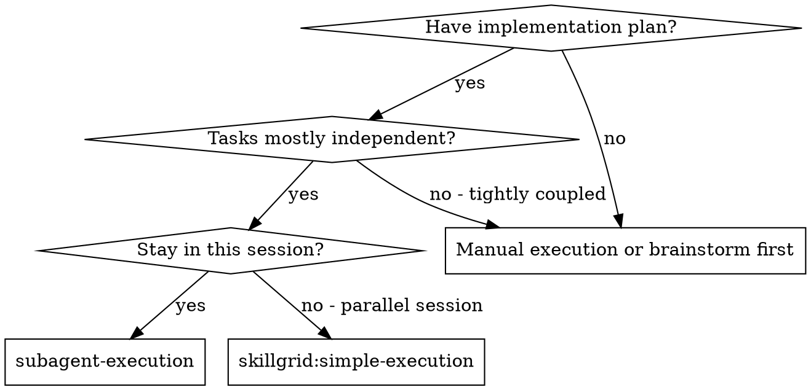
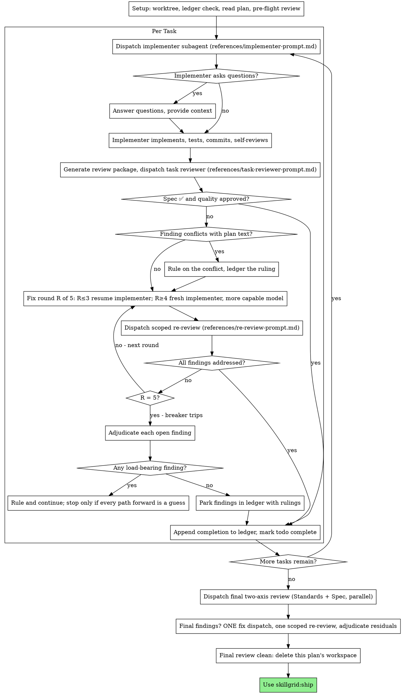

# Subagent Execution

Execute plan by dispatching a fresh implementer subagent per task, a task review (spec compliance + code quality) after each, and a broad whole-branch review at the end.

**Why subagents:** You delegate tasks to specialized agents with isolated context. By precisely crafting their instructions and context, you ensure they stay focused and succeed at their task. They should never inherit your session's context or history — you construct exactly what they need. This also preserves your own context for coordination work.

**Core principle:** Fresh subagent per task + task review (spec + quality) + broad final review = high quality, fast iteration

**Minimal context mandate:** Each subagent receives ONLY the data necessary for its task: the task description, relevant file paths, the specific ADR constraints that apply, and the `SATISFIES` scenario. Do not pass session history, full blueprints, or unrelated task context. The subagent's context is constructed, not inherited.

**Parallel execution proposal:** After reading `tasks.md`, identify independent tasks (no dependency edges between them). Propose parallel execution to the user via the agent's answer-select tool: "Tasks X, Y, Z are independent — run them in parallel? (Recommended)" / "Run sequentially." The user selects because of price burden. Parallel tasks dispatch simultaneously; coupled tasks remain sequential.

**Announce at start:** "I'm using the skillgrid:subagent-execution skill to execute this plan."

**Config:** Read `.skillgrid/config.yaml` before starting. Use `conventions.scratch_dir` for the ledger directory (default `.skillgrid/sdd/`). Use `testing.runner` for test commands in implementer briefs. Use the terms-file vocabulary from `conventions.artifacts` (the `01-business-terms.md` / `02-technical-terms.md` under `.skillgrid/artifacts/`) in briefs and rulings, and carry the in-force ADRs — per the change's ADR Review Manifest at `.skillgrid/specs/YYYY-MM-DD-<topic>/adr.md` — into implementer briefs so a worker doesn't re-litigate a settled decision or name things outside the ubiquitous language. Every implementation task follows `skillgrid:test-driven-development`: basic TDD (a failing test before code) is always on. `testing.tdd: false` means the strict-TDD branch machinery is off (see config `rules.apply.tdd`). The implementer brief carries this; the reviewer checks the TDD evidence. **BDD is always on** — the implementer brief names the task's `SATISFIES` scenario and the reviewer checks the acceptance scenario went RED→GREEN (TDD Evidence references the scenario name); enforce the spec zone rule — commit `.skillgrid/specs/` changes before code changes, never both uncommitted (the `pre-commit` zone guard, skillgrid:work-unit-commits, blocks a mixed commit). If `ticketing.enabled: true` AND a `tasks.md` with tracker IDs exists (produced by `skillgrid:ticketing`), update ticket status at each transition: `ready` (wave start) → `in-progress` (implementer dispatched) → `review` (review started) → `done` (review clean + merged). If the file doesn't exist, use the defaults shown in this skill.

**Narration:** between tool calls, narrate at most one short line — the
ledger and the tool results carry the record.

**Continuous execution:** Do not pause to check in with your human partner between tasks. Execute all tasks from the plan without stopping. The only reasons to stop are the four named below, or all tasks complete. "Should I continue?" prompts and progress summaries waste their time — they asked you to execute the plan, so execute it.

**Rulings, not stalls.** A running plan does not wait on a human. Conflicts,
ambiguities, plan defects, a cap you would have asked to exceed — decide
them. The spec is the binding authority, the plan is its argument, and your
judgment settles what neither answers. Record every decision in the ledger as
`Ruling: <what you decided> — <why> — <what it costs if wrong>`, and keep
going. A wrong ruling costs rework your human partner can see and undo; a
session parked on a question costs their whole day and buys nothing.

Four things stop you, and only these: an irreversible or destructive
operation; a security-sensitive action; a side effect outside this worktree
that norms say you ask about first (a merge, a push to a shared branch, a
publish); and a plan so broken that every path forward is a guess. For those,
stop and ask.

## When to Use



**When NOT to use:** a single tightly-coupled task, or when there is no implementation plan yet (brainstorm/slice first). If the work is one linear piece you can do inline, dispatching a subagent adds coordination overhead without the parallelism benefit — use `skillgrid:simple-execution` instead.

**vs. Executing Plans (parallel session):**
- Same session (no context switch)
- Fresh subagent per task (no context pollution)
- Review after each task (spec compliance + code quality), broad review at the end
- Faster iteration (no human-in-loop between tasks)

**Sequential, even for coupled plans:** this skill handles plans with tasks that
share files/interfaces — it decomposes them, gates dispatch on verified
dependencies, and adds a branch integration gate (see Decompose & Gate). It does
NOT fan out to concurrent leaves. If you need parallel implementers in flight at
once on a coupled build, use
`skillgrid:parallel-execution` → [concurrent-leaves](../parallel-execution/references/concurrent-leaves.md)
(lightweight: disjoint `Owns:`, branch integration gate, parent re-verify). If
that is not enough (4+ leaves in flight, lease/wave state), build the full
orchestrator — it does not exist yet.

## The Process



## Setup

Before dispatching Task 1: create/verify an isolated workspace
(`skillgrid:isolated-workspace` — never start on main/master without consent),
run `scripts/sdd-workspace PLAN_FILE` (from this skill's directory) to get this plan's git-ignored workspace,
establish the progress ledger at `<workspace>/progress.md` (your recovery map
that survives compaction — trust it and `git log` over your recollection after
compaction), read the plan (or `tasks.md` if `skillgrid:slicing` produced one),
and run the pre-flight conflict scan. Conversation memory is the single most
expensive failure: controllers that lost their place have re-dispatched entire
completed task sequences. The ledger is the fix, not todos.

Full workspace, ledger, commit position, and pre-flight-scan procedure:
[setup.md](references/setup.md).

### Status Guard

Before reading implementation files or dispatching any task, confirm readiness:

- If state is **`blocked`** (missing artifacts, unsafe context), STOP and return `blocked` with the missing items named.
- If state is **`all_done`**, do not dispatch. Return `success` with `Next: qa`. You own only up to the `qa` handoff. The rest of the chain is in `_shared/rules/sdd-structure.md`. Determine `all_done` from the live done-signal, in this priority order:
  1. **Backlog tracker** (if `ticketing.enabled: true`): every ticket for this change is `status: done` in the tracker.
  2. **Per-plan ledger**: every `Task N:` line in `.skillgrid/sdd/<plan>/progress.md` reads `Task N: complete`.
  3. **Legacy fallback** (v1-format `tasks.md` only): every ticket is `[x]`.
- If state is **`ready`**, proceed only on the assigned pending tickets.

**Edit roots are bounded.** If the blueprint or `tasks.md` names specific directories/files as the change's affected areas, edit only under them. If a needed edit is outside, STOP and report the unsafe path. Never edit files outside the change's affected areas without a ruling.

### Execution Contract Check (optional ticket fields)

Before dispatching a ticket, read its optional contract fields (see
`skillgrid:slicing` → Ticket Execution Contract). All three are optional —
absent means the ticket runs under the default rules above, unchanged.

- **`Precondition:`** assert it with **read-only** checks only (file exists, env
  var set, health ping) before any code is written. Unmet → **STOP with a
  checkpoint** and name the unmet precondition; do partial work. A precondition
  you can't check read-only was written wrong — ledger it and re-check.
- **`Reversibility: one-way`** is a declared stop signal: it folds into the
  "four things stop you" rule (an irreversible operation). The ticket now *names*
  why it stops — surface the checkpoint explicitly instead of relying on
  judgment. `costly`/`reversible`/absent change nothing.
- **`Fails-when:`** the verify command's failure signature. When a ticket's
  runnable verify has a `Fails-when`, a green pass is only green if the output
  does **not** match it. A verify command that can be neither passed nor failed
  (no `Fails-when`, no falsifiable `Then`) is not verification — flag it.

### Delivery Guard

Before dispatching the first ticket, read `tasks.md` for the four plain-text guard lines from the `## Delivery Strategy` section:

```
Decision needed before apply: {Yes | No}
Chained PRs recommended: {Yes | No}
Chain strategy: {stacked-to-main | feature-branch-chain | size-exception | pending}
400-line budget risk: {Low | Medium | High}
```

If **any** of `400-line budget risk: High`, `Chained PRs recommended: Yes`, or `Decision needed before apply: Yes`:

1. Check that a **resolved delivery path** exists:
   - A chosen chain strategy (`stacked-to-main` or `feature-branch-chain`) — not `pending`.
   - Or an accepted `size:exception` (maintainer explicitly approved a single PR above budget).
2. If **resolved**: implement only the assigned work-unit slice, keep its scope autonomous, and report the PR boundary in the ledger. For `feature-branch-chain`, verify each child diff targets the correct base branch (not main).
3. If **not resolved**: STOP before writing code and return `blocked` with:

   > Delivery decision required before execution: estimated work may exceed 400 changed lines. Ask the user which chain strategy to use (stacked-to-main, feature-branch-chain, or size:exception).

The guard runs **before** any code is written — implementing an above-budget slice only to discover the delivery strategy wasn't resolved wastes a batch of work and complicates rollback.

### Work Unit Evidence (required before marking complete)

Every ticket, regardless of size, MUST produce a **Work Unit Evidence** row in the ledger before its tasks are marked complete:

| Unit | Focused test (cmd + result) | Runtime harness (cmd + result) | Rollback boundary |
|---|---|---|---|
| {ticket name} | {cmd} → {exit/result} | {cmd/scenario} → {result or N/A+reason} | {files/behavior} |

- **Focused test**: the smallest command proving this unit works.
- **Runtime harness**: a real integration/runtime path. Explicit `N/A` + reason only if no runtime boundary exists.
- **Rollback boundary**: the exact files/behavior that can be reverted without removing unrelated work.

A ticket without a complete evidence row is NOT complete. The reviewer checks for this row.

### Decompose & Gate

Before dispatching Task 1, decompose the plan and gate each task on its own
ownership and dependencies. This is the lightweight Depth Tree: a plan is a set
of leaves (tasks) under branches (shared interfaces), and dispatch is gated on
verified dependencies, not file order.

- **Inventory the outcomes.** Reread the plan/spec and list every
  independently-omittable outcome. A plan whose tasks omit an outcome nobody
  owns is a half-done plan — surface it before dispatch, not after.
- **Give each task exact file ownership and its dependencies.** Record two
  ledger lines per task before dispatch: `Task <N>: Owns: <repo-relative
  globs>` and `Task <N>: Needs: <task ids or interfaces it builds on>`. These
  are coordination metadata, not a filesystem sandbox — a task may still read
  outside its `Owns`, but it may not write to another in-flight task's `Owns`.
- **Dependency-gated dispatch.** Dispatch a task only when every task named in
  its `Needs:` has a `Task <M>: complete` ledger line. For a plan of independent
  tasks this is a no-op; for a coupled plan it is the missing safety. Never
  dispatch a task whose declared dependency is still in flight.
- **Branch integration gate.** If two or more tasks share an interface or file,
  name the task that *integrates* them and give it an extra `G<n>` gate: the
  child tasks' outputs compose and the shared interface holds end-to-end. This
  gate is independent of the child leaves — it verifies the branch, not just the
  parts. If it cannot be made runnable, it is a `manual` gate you review at the
  final review, not a silent skip.
- **Parent re-verify.** A leaf's self-pass does not count as verification. Before
  marking a task complete, re-run its `#### Gates` oracles yourself (the runnable
  `CHECK:`+`EXPECT:` lines) — see `skillgrid:test-driven-verification`. The
  implementer's report is a claim; your re-run is the evidence.

This skill is sequential: it never dispatches multiple implementers in parallel.
For a concurrent coupled build, use
`skillgrid:parallel-execution` → [concurrent-leaves](../parallel-execution/references/concurrent-leaves.md)
(disjoint `Owns:`, branch integration gate, parent re-verify — the lightweight
concurrent case). The heavier lease / wave / `dispatch.json` machinery for 4+
leaves in flight is a future orchestrator skill and is out of scope here — the
Depth Tree above is used for decomposition, ownership, dependency gating, and
parent re-verify, not for parallel fan-out.

## Model Selection

Before dispatching any subagent, choose its model: use the least powerful tier
that can handle the role, and **always specify the model explicitly** — an
omitted model silently inherits your session's (most capable, most expensive)
model. Mechanical implementation → cheap tier; integration/judgment → standard;
architecture + the final whole-branch review → most capable; fix-loop rounds
4-5 → at least one tier above the implementer that got stuck. Turn count beats
token price: mid-tier is the floor for reviewers and prose-driven implementers.

Full per-role rules and complexity signals: [model-selection.md](references/model-selection.md).

## The Task Loop

Dispatch, review, and the per-task cycle: [task-loop.md](references/task-loop.md).

Workspace, ledger, and pre-flight: [setup.md](references/setup.md). Model tiers: [model-selection.md](references/model-selection.md). Whole-branch review: [final-review.md](references/final-review.md).

## Final QA Gate

After all tasks are complete and before the final review, run `skillgrid:qa`. It produces the test plan, goal-backward verification, verification-gap audit, traceability matrix, and TDD evidence audit, and renders the four-state gate (PASS / CONCERNS / FAIL / WAIVED).

- **PASS** → proceed to the final review below.
- **CONCERNS** → fix the in-scope open items with tests, re-run QA (re-verification mode), then proceed.
- **FAIL** → fix the CRITICAL findings with a failing test first, re-run QA. Cap per `_shared/planning/rigor-tiers.md` (fix loop cap), then escalate to the human.
- **WAIVED** → record the waiver, proceed to the final review.

The QA gate answers "was the goal achieved and would verification catch a regression?" The final review answers "does the code follow standards and implement the spec?" They are complementary — QA is the quality gate, review is the standards/spec gate.

## Final Review

Once every task is complete and `skillgrid:qa` has passed, run the whole-branch
review: package the branch diff (`scripts/review-package PLAN_FILE MERGE_BASE HEAD` from this skill's directory),
dispatch the two-axis review (Standards + Spec) in parallel on the most capable
model, present the two reports side by side, and escalate to
`skillgrid:parallel-code-review` at the review escalation threshold (per
`_shared/planning/rigor-tiers.md`).
Findings get ONE fix subagent + one scoped re-review, then the breaker
adjudicates — there is no second fix wave.

Full protocol, escalation threshold, and fix-wave rules: [final-review.md](references/final-review.md).

## Finish

Before you delete anything, collect every ledger line containing `Ruling:` —
preflight rulings, parked findings, breaker adjudications, all of them — into
your final message under "Rulings I made", in the order you made them, each
with what it costs if wrong. The list is exhaustive: if the ledger holds a
ruling, the list holds it. That list is the only place the decisions you
took on your human partner's behalf reach them — they read it and rework
whatever you got wrong. A ruling that dies with the workspace was a decision
made in secret.

When the final whole-branch review is clean and its fixes are merged,
delete this plan's workspace (`rm -rf <workspace>`) — the git history is
the record now. Sibling directories belong to other plans; leave them
alone.

**Update `state.yaml`:** set `pipeline.current_phase: executing`.

Use skillgrid:ship.

## Common Rationalizations

| Excuse | Reality |
|--------|---------|
| "Close enough on spec compliance" | Reviewer found spec gaps = not done. Fix or hit the cap and adjudicate — those are the only exits. |
| "I'll fix it myself, dispatching is overhead" | Controller fixes pollute your context and skip review. Resume the implementer. |
| "One more round will converge" | Past the cap, rounds don't converge — the failure is structural. Adjudicate and route. |
| "The reviewer will just find something new anyway" | Scoped re-reviews verify fixes; they cannot wander. New findings on untouched code go to the ledger, not the loop. |
| "This finding is obviously wrong, I'll drop it" | You adjudicate only at the cap, and every ruling is a ledger entry. Silent discards are forbidden. |
| "The fix was small, skip the re-review" | Unreviewed fixes are how regressions land. Every round ends with a scoped re-review. |
| "Reviews slow the loop down" | The loop without reviews is just unverified churn. Reviews are the loop's brakes and steering. |
| "Ledger bookkeeping is overhead" | The ledger is what survives compaction. Controllers without one have re-dispatched entire completed task sequences. |
| "The implementer spawned its own reviewer — free extra assurance" | It's a duplicate seat reviewing the same diff; the task review is the gate. A worker-spawned reviewer is a defect to flag, not rigor. |

## Red Flags

- An implementer was dispatched without a complete task brief (no `task-brief` path, or the brief path is missing from the prompt).
- A subagent's output was trusted without parent re-verification — the `#### Gates` oracles were not re-run before marking the task complete.
- The task loop re-dispatched the same task after round 5 without the breaker adjudicating — the cap was exceeded silently.
- A task reviewer was dispatched without a diff file, or without all three inputs (brief, report, review package).
- The Final QA Gate was skipped or its findings were not triaged before the Final Review ran.

## Verification

- [ ] Every dispatched implementer received a complete task brief (the `task-brief` output path was in the dispatch prompt).
- [ ] The Final QA Gate (`skillgrid:qa`) ran and returned a four-state verdict (PASS / CONCERNS / FAIL / WAIVED), and findings were triaged.
- [ ] The Final whole-branch two-axis review (Standards + Spec) ran on the most capable model and its findings were resolved or parked with a ruling.
- [ ] The task loop reached a terminal state — no task is stuck cycling past round 5 without a recorded breaker adjudication.
- [ ] Every subagent's `#### Gates` oracles were re-run by the parent (not just self-reported by the implementer) before the task was marked complete.

## References

On-demand detail for this skill, in `references/`:

- [setup.md](references/setup.md) — workspace, progress ledger, commit position, and pre-flight conflict scan.
- [task-loop.md](references/task-loop.md) — dispatch, review, and the per-task cycle.
- [model-selection.md](references/model-selection.md) — per-role model-tier rules and complexity signals.
- [final-review.md](references/final-review.md) — whole-branch review protocol, escalation threshold, fix-wave rules.
- [example-workflow.md](references/example-workflow.md) — a worked end-to-end run of Setup → Task Loop → Final QA Gate → Final Review → Finish.
- [implementer-prompt.md](references/implementer-prompt.md) — dispatch template for the implementer subagent.
- [task-reviewer-prompt.md](references/task-reviewer-prompt.md) — dispatch template for the per-task spec+quality reviewer.
- [re-review-prompt.md](references/re-review-prompt.md) — dispatch template for the scoped fix re-review.

