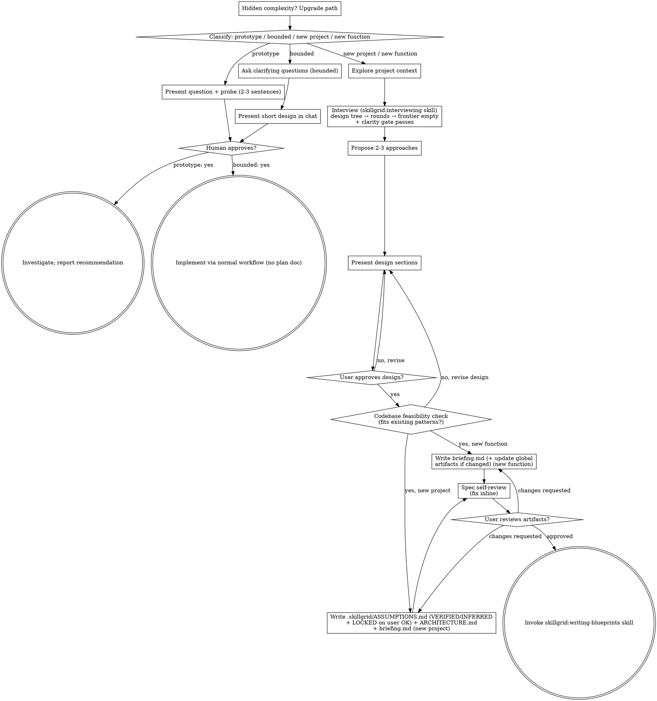

## Checklist

Classify first, announce the path, then create a task for each item on
your path and complete them in order.

**Prototype (tiny — inline):**
1. **Explore project context** — enough to frame the probe
2. **Present question + probe plan** — 2-3 sentences
3. **Get approval** — a nod is enough
4. **Investigate** — as cheaply as correctness allows
5. **Report findings in chat** — a recommendation; label anything built as throwaway

**Prototype (real probe — delegate):**
1. **Explore project context** — enough to frame the probe
2. **Delegate to `skillgrid:prototype`** — it frames the falsifiable hypothesis, gets the nod, builds the experiment, writes the verdict + investigation trail, and appends to the topic's consolidated `findings.md`. Report back the verdict and what's liftable.

**Bounded:**
1. **Explore project context** — check files, docs, recent commits
2. **Ask clarifying questions** — one at a time, the ones that matter
3. **Present short design in chat** — approach, files touched, testing
4. **Get approval** — STOP and wait for an explicit yes; presenting the design and starting in the same breath is skipping the gate
5. **Implement** — proceed with the normal development workflow (TDD applies); no plan document

**New Project:**
 1. **Explore project context** — check existing files, docs, commits (often minimal for greenfield)
  2. **Offer the visual companion just-in-time** — NOT upfront. The first time a question would genuinely be clearer shown than described, offer it then (its own message); on approval its browser tab opens for you. If no visual question ever arises, never offer it. See the Visual Companion section in [after-the-design.md](after-the-design.md).
  3. **Offer a sketch just-in-time** — NOT upfront, and only when the design has **2+ meaningfully different layout or interaction options** whose choice depends on *feeling* it, not reading a description. The first time that is true, offer it then (its own message): "This has a few different layout options — I can build throwaway interactive mockups so you can feel which one works. Want me to?" On approval, invoke the `skillgrid:sketch` skill; the marked winner + constraints land in the topic's consolidated `findings.md`, which the blueprint reads. If the design never has 2+ genuinely different visual options, never offer it.
  4. **Research external facts just-in-time** — NOT upfront. The first time the design depends on a fact not in the codebase (a library's current API, a version's behavior, a domain constraint, a competitor's offering), dispatch `skillgrid:research` (one inline pass) or `skillgrid:code-research` (wide or high-stakes) and let the design read the resulting `## Research:` section in `.skillgrid/specs/YYYY-MM-DD-<topic>/findings.md`. The research answers the question; the interview still owns the decisions. If no external fact ever comes up, never offer it.
    5. **Interview the user** — invoke the `skillgrid:interviewing` skill. Work the design tree in rounds: map the design tree, ask the whole frontier per round (numbered, with your recommended answer), look up facts yourself, put decisions to the user. Repeat until the frontier is empty AND the clarity gate passes (see the interviewing skill's exit check). This replaces one-at-a-time questioning — the frontier rounds are the structure. As the interview runs, write VERIFIED facts to `.skillgrid/ASSUMPTIONS.md` and INFERRED hypotheses as they are confirmed, and `skillgrid:architectural-decision-records` maintains the terms files (`artifacts/01-business-terms.md` / `02-technical-terms.md`) and offers ADRs (`artifacts/04-adr-NNNN-slug.md`, plus a path row in `ASSUMPTIONS.md`) — the paper trail is written during the interview, not after.
    6. **Propose 2-3 approaches** — with trade-offs and your recommendation
    7. **Present design** — in sections scaled to their complexity, get user approval after each section
     8. **Codebase feasibility check** — read the repo's existing structure and `.skillgrid/ARCHITECTURE.md` / `.skillgrid/ASSUMPTIONS.md` (if present); verify the proposed architecture fits existing patterns; record a 2-line verdict in the spec's Context section. If the design doesn't fit and there's no justification, revise before writing the spec.
     9. **Reconcile the domain model + write the ADR manifest** — before writing the spec: (a) confirm the terms files (`artifacts/01-business-terms.md` / `02-technical-terms.md`) reflect every term the interview resolved; (b) run the per-change ADR Review Manifest from `skillgrid:architectural-decision-records` — read the `### In-force set` table in `.skillgrid/ASSUMPTIONS.md` for the in-force set, author any qualifying ADRs as `artifacts/04-adr-NNNN-slug.md` (4-digit, monotonic, frontmatter) plus a path row in the in-force table, and write `.skillgrid/specs/YYYY-MM-DD-<topic>/adr.md` listing the in-force ADRs reviewed + the new ADRs created (or "none"). Commit the terms, any new ADRs, and the manifest with the spec.
     10. **Write the acceptance contract** (BDD is always on) — copy `skillgrid:acceptance-test-authoring/templates/acceptance.feature` → `.skillgrid/specs/YYYY-MM-DD-<topic>/acceptance.feature`. One `Rule:` (`### Requirement:`) per briefing requirement, with happy/edge/failure scenarios in domain language (use the terms files). Happy-path scenarios must cover the Definition of Done. Commit the spec before any code.
     11. **Write the global artifacts** — create `.skillgrid/artifacts/00-prd.md` from `templates/PRD.md`, `.skillgrid/ASSUMPTIONS.md` from `templates/ASSUMPTIONS.md`, and `.skillgrid/ARCHITECTURE.md` from `templates/ARCHITECTURE.md`, filling in every section; also copy `templates/briefing.md` → `.skillgrid/specs/YYYY-MM-DD-<topic>/briefing.md` and fill it in (including the Clarity Report from the interview). If the global files already exist, merge rather than overwrite. Commit.
     12. **Spec self-review** — quick inline check for placeholders, contradictions, ambiguity, scope, falsifiability (see [after-the-design.md](after-the-design.md)); run it on `artifacts/00-prd.md`, ASSUMPTIONS.md, ARCHITECTURE.md, and the briefing
     13. **User reviews the artifacts** — ask user to review `.skillgrid/artifacts/00-prd.md`, `.skillgrid/ASSUMPTIONS.md`, `.skillgrid/ARCHITECTURE.md`, the spec, the acceptance contract, and the updated terms/ADRs before proceeding
    14. **Transition to implementation** — invoke skillgrid:writing-blueprints skill to create implementation plan

**New Function:**
1. **Explore project context** — check files, docs, recent commits; read `.skillgrid/ASSUMPTIONS.md`, `.skillgrid/artifacts/00-prd.md`, and `.skillgrid/ARCHITECTURE.md` if present
  2. **Offer the visual companion just-in-time** — NOT upfront. The first time a question would genuinely be clearer shown than described, offer it then (its own message); on approval its browser tab opens for you. If no visual question ever arises, never offer it. See the Visual Companion section in [after-the-design.md](after-the-design.md).
   3. **Offer a sketch just-in-time** — NOT upfront, and only when the design has **2+ meaningfully different layout or interaction options** whose choice depends on *feeling* it, not reading a description. The first time that is true, offer it then (its own message): "This has a few different layout options — I can build throwaway interactive mockups so you can feel which one works. Want me to?" On approval, invoke the `skillgrid:sketch` skill; the marked winner + constraints land in the topic's consolidated `findings.md`, which the blueprint reads. If the design never has 2+ genuinely different visual options, never offer it.
    4. **Interview the user** — invoke the `skillgrid:interviewing` skill. Work the design tree in rounds: map the decision tree, ask the whole frontier per round (numbered, with your recommended answer), look up facts yourself, put decisions to the user. Repeat until the frontier is empty AND the clarity gate passes (see the interviewing skill's exit check). This replaces one-at-a-time questioning — the frontier rounds are the structure. As the interview runs, write VERIFIED facts to `.skillgrid/ASSUMPTIONS.md` and INFERRED hypotheses as they are confirmed, and `skillgrid:architectural-decision-records` maintains the terms files (`artifacts/01-business-terms.md` / `02-technical-terms.md`) and offers ADRs (`artifacts/04-adr-NNNN-slug.md`, plus a path row in `ASSUMPTIONS.md`) — the paper trail is written during the interview, not after.
   5. **Propose 2-3 approaches** — with trade-offs and your recommendation
   6. **Present design** — in sections scaled to their complexity, get user approval after each section
   7. **Codebase feasibility check** — read the files and flows the feature touches; verify the design follows existing patterns (naming, layering, data access, error handling, testing); record a 2-line verdict in the spec's Context section. If the design doesn't fit and there's no justification, revise before writing the spec.
     8. **Reconcile the domain model + write the ADR manifest** — before writing the spec: (a) confirm the terms files (`artifacts/01-business-terms.md` / `02-technical-terms.md`) reflect every term the interview resolved; (b) run the per-change ADR Review Manifest from `skillgrid:architectural-decision-records` — read the `### In-force set` table in `.skillgrid/ASSUMPTIONS.md` for the in-force set, author any qualifying ADRs as `artifacts/04-adr-NNNN-slug.md` (4-digit, monotonic, frontmatter) plus a path row in the in-force table, and write `.skillgrid/specs/YYYY-MM-DD-<topic>/adr.md` listing the in-force ADRs reviewed + the new ADRs created (or "none"). Commit the terms, any new ADRs, and the manifest with the spec.
     9. **Write the acceptance contract** (BDD is always on) — copy `skillgrid:acceptance-test-authoring/templates/acceptance.feature` → `.skillgrid/specs/YYYY-MM-DD-<topic>/acceptance.feature`. One `Rule:` (`### Requirement:`) per briefing requirement, with happy/edge/failure scenarios in domain language (use the terms files). Happy-path scenarios must cover the Definition of Done. Commit the spec before any code.
     10. **Write the spec** — copy `templates/briefing.md` → `.skillgrid/specs/YYYY-MM-DD-<topic>/briefing.md`, fill it in (including the Clarity Report from the interview), and commit. If the feature changes the global `.skillgrid/ASSUMPTIONS.md` (new VERIFIED fact, metric, a new ADR file under `artifacts/`) or `.skillgrid/ARCHITECTURE.md` (new component/store/integration), update those too — only when they exist AND the feature actually changes them.
     11. **Spec self-review** — quick inline check for placeholders, contradictions, ambiguity, scope, falsifiability (see [after-the-design.md](after-the-design.md))
     12. **User reviews the spec** — ask user to review the spec file, the acceptance contract, the updated terms/ADRs, and any global updates before proceeding
    13. **Transition to implementation** — invoke skillgrid:writing-blueprints skill to create implementation plan

## Process Flow

**Terminal states are path-bound.** New Project / New Function: the
ONLY skill you invoke after brainstorming is skillgrid:writing-blueprints — never
or any other implementation skill.
Bounded: after approval, implementation proceeds directly through the
normal development workflow; no plan document. Prototype: the terminal
state is a reported recommendation.
