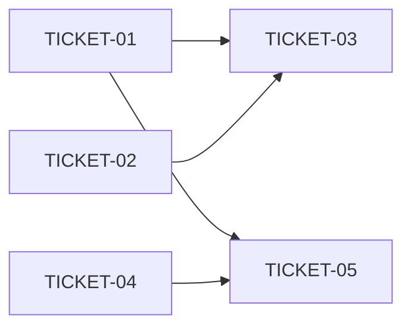

# Tasks — <feature>

> Sliced from `.skillgrid/specs/YYYY-MM-DD-<topic>/blueprint.md`.
> Vertical tracer-bullet tickets, dependency-ordered, sized for one fresh agent context window.

## Epic Summary

<2-3 lines: what this build achieves, from the blueprint.>

## Delivery Strategy

| Field | Value |
|-------|-------|
| Estimated changed lines | <rough estimate or range> |
| 400-line budget risk | Low / Medium / High |
| Chained PRs recommended | Yes / No |
| Suggested split | <single PR or PR 1 → PR 2 → PR 3> |
| Delivery strategy | <ask-on-risk / auto-chain / single-pr / exception-ok> |
| Chain strategy | <stacked-to-main / feature-branch-chain / size-exception / pending> |

Decision needed before apply: {Yes | No}
Chained PRs recommended: {Yes | No}
Chain strategy: {stacked-to-main | feature-branch-chain | size-exception | pending}
400-line budget risk: {Low | Medium | High}

### Suggested Work Units

| Unit | Goal | Likely PR | Focused test command | Runtime harness | Rollback boundary |
|------|------|-----------|----------------------|-----------------|-------------------|
| 1 | <standalone deliverable> | PR 1 | <smallest proving command> | <real scenario or N/A + reason> | <files/behavior removable without unrelated rollback> |

> The four plain-text guard lines above are the **contract** — `skillgrid:subagent-execution` matches them literally. If risk is High, `Chained PRs recommended` MUST be `Yes` and every work unit MUST name a focused test, a runtime harness (or `N/A` + reason), and a rollback boundary.

## Tickets

### TICKET-01 — <title>

- **Scope:** <one line: what this ticket builds>
- **Acceptance:** <falsifiable criteria — can be checked pass/fail>
- **SATISFIES:** <scenario-name> (the acceptance scenario this ticket makes green — BDD is always on)
- **Files:** <estimated files touched>
- **Size:** ~<lines> (S <500 / M 500-1500 / L >1500)
- **Blocks:** TICKET-03, TICKET-05
- **Blocked by:** none
<!-- Optional execution contract (omit for routine, reversible tickets — absent = default behavior):
- **Precondition:** <one line, read-only checkable: file exists / env set / health ping>
- **Reversibility:** <reversible | costly | one-way>   # one-way inserts a human checkpoint before this ticket
- **Fails-when:** <output/exit-code that means the verify command failed>
-->

### TICKET-02 — <title>

- **Scope:** <one line>
- **Acceptance:** <falsifiable criteria>
- **SATISFIES:** <scenario-name>
- **Files:** <estimated files>
- **Size:** ~<lines> (S/M/L)
- **Blocks:** none
- **Blocked by:** TICKET-01

### TICKET-03 — <title>

- **Scope:** <one line>
- **Acceptance:** <falsifiable criteria>
- **SATISFIES:** <scenario-name>
- **Files:** <estimated files>
- **Size:** ~<lines> (S/M/L)
- **Blocks:** none
- **Blocked by:** TICKET-01, TICKET-02

## Dependency Graph

## Execution Order

- **Wave 1 (parallel):** TICKET-01, TICKET-02, TICKET-04
- **Wave 2:** TICKET-03 (after TICKET-01 + TICKET-02), TICKET-05 (after TICKET-01 + TICKET-04)

> **Acceptance-first (BDD is always on):** a ticket's failing acceptance
> scenario (its `SATISFIES` scenario) is written and confirmed RED *before*
> the implementation that makes it green. Order RED-test / scenario tickets
> ahead of their implementation tickets in the dependency graph.

## Slicing Notes

- <Any wide-refactor expand/migrate/contract sequences>
- <Any tickets that were split and why>
- <Any assumptions about file boundaries or interfaces>
