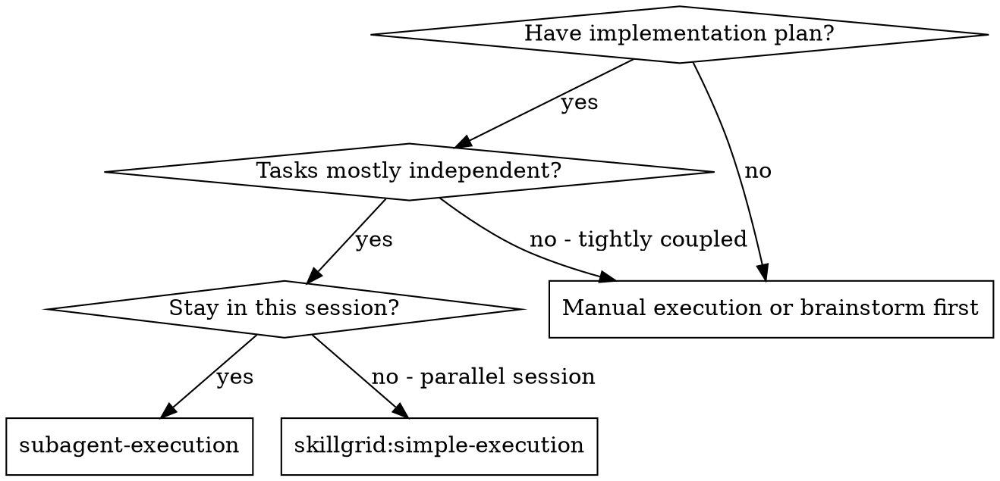
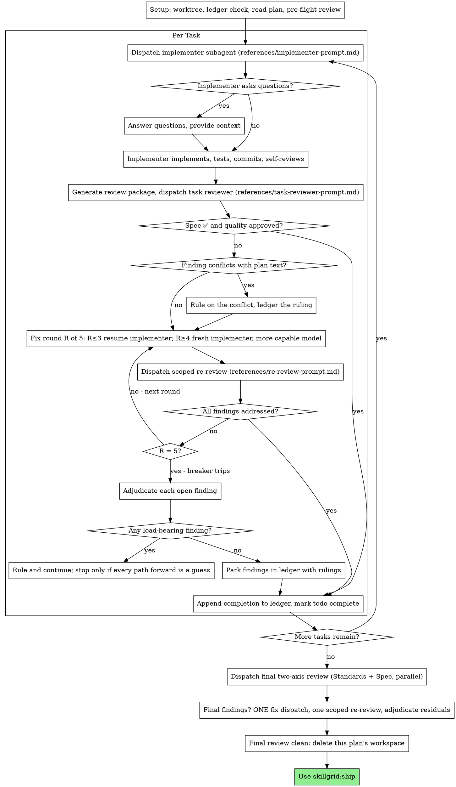

# Subagent Execution

Execute plan by dispatching a fresh implementer subagent per task, a task review (spec compliance + code quality) after each, and a broad whole-branch review at the end.

**Why subagents:** You delegate tasks to specialized agents with isolated context. By precisely crafting their instructions and context, you ensure they stay focused and succeed at their task. They should never inherit your session's context or history — you construct exactly what they need. This also preserves your own context for coordination work.

**Core principle:** Fresh subagent per task + task review (spec + quality) + broad final review = high quality, fast iteration

**Announce at start:** "I'm using the skillgrid:subagent-execution skill to execute this plan."

**Config:** Read `.skillgrid/config.yaml` before starting. Use `conventions.scratch_dir` for the ledger directory (default `.skillgrid/sdd/`). Use `testing.runner` for test commands in implementer briefs. Use the glossary vocabulary from `conventions.glossary` (default `.skillgrid/glossary/`) in briefs and rulings, and carry the in-force ADRs — per the change's ADR Review Manifest at `.skillgrid/specs/YYYY-MM-DD-<topic>/adr.md` — into implementer briefs so a worker doesn't re-litigate a settled decision or name things outside the ubiquitous language. `testing.tdd` is always `true` — every implementation task follows skillgrid:test-driven-development (the implementer brief already carries this; the reviewer checks the TDD evidence). **BDD is always on** — the implementer brief names the task's `SATISFIES` scenario and the reviewer checks the acceptance scenario went RED→GREEN (TDD Evidence references the scenario name); enforce the spec zone rule — commit `.skillgrid/specs/` changes before code changes, never both uncommitted (the `pre-commit` zone guard, skillgrid:work-unit-commits, blocks a mixed commit). If `ticketing.enabled: true` AND a `tasks.md` with tracker IDs exists (produced by `skillgrid:ticketing`), update ticket status at each transition: `ready` (wave start) → `in-progress` (implementer dispatched) → `review` (review started) → `done` (review clean + merged). If the file doesn't exist, use the defaults shown in this skill.

**Narration:** between tool calls, narrate at most one short line — the
ledger and the tool results carry the record.

**Continuous execution:** Do not pause to check in with your human partner between tasks. Execute all tasks from the plan without stopping. The only reasons to stop are the four named below, or all tasks complete. "Should I continue?" prompts and progress summaries waste their time — they asked you to execute the plan, so execute it.

**Rulings, not stalls.** A running plan does not wait on a human. Conflicts,
ambiguities, plan defects, a cap you would have asked to exceed — decide
them. The spec is the binding authority, the plan is its argument, and your
judgment settles what neither answers. Record every decision in the ledger as
`Ruling: <what you decided> — <why> — <what it costs if wrong>`, and keep
going. A wrong ruling costs rework your human partner can see and undo; a
session parked on a question costs their whole day and buys nothing.

Four things stop you, and only these: an irreversible or destructive
operation; a security-sensitive action; a side effect outside this worktree
that norms say you ask about first (a merge, a push to a shared branch, a
publish); and a plan so broken that every path forward is a guess. For those,
stop and ask.

## When to Use



**When NOT to use:** a single tightly-coupled task, or when there is no implementation plan yet (brainstorm/slice first). If the work is one linear piece you can do inline, dispatching a subagent adds coordination overhead without the parallelism benefit — use `skillgrid:simple-execution` instead.

**vs. Executing Plans (parallel session):**
- Same session (no context switch)
- Fresh subagent per task (no context pollution)
- Review after each task (spec compliance + code quality), broad review at the end
- Faster iteration (no human-in-loop between tasks)

**Sequential, even for coupled plans:** this skill handles plans with tasks that
share files/interfaces — it decomposes them, gates dispatch on verified
dependencies, and adds a branch integration gate (see Decompose & Gate). It does
NOT fan out to concurrent leaves. If you need parallel implementers in flight at
once on a coupled build, use
`skillgrid:parallel-execution` → [concurrent-leaves](../parallel-execution/references/concurrent-leaves.md)
(lightweight: disjoint `Owns:`, branch integration gate, parent re-verify). If
that is not enough (4+ leaves in flight, lease/wave state), build the full
orchestrator — it does not exist yet.

## The Process



## Setup

Before dispatching Task 1: create/verify an isolated workspace
(`skillgrid:isolated-workspace` — never start on main/master without consent),
run `scripts/sdd-workspace PLAN_FILE` to get this plan's git-ignored workspace,
establish the progress ledger at `<workspace>/progress.md` (your recovery map
that survives compaction — trust it and `git log` over your recollection after
compaction), read the plan (or `tasks.md` if `skillgrid:slicing` produced one),
and run the pre-flight conflict scan. Conversation memory is the single most
expensive failure: controllers that lost their place have re-dispatched entire
completed task sequences. The ledger is the fix, not todos.

Full workspace, ledger, checkpoint, and pre-flight-scan procedure:
[setup.md](references/setup.md).

### Status Guard

Before reading implementation files or dispatching any task, confirm readiness:

- If state is **`blocked`** (missing artifacts, unsafe context), STOP and return `blocked` with the missing items named.
- If state is **`all_done`** (every ticket in `tasks.md` is `[x]`), do not dispatch. Return `success` with `Next: qa`. The full tail is `qa → review → ship → reflect` — you own only up to the `qa` handoff; `ship` (integration + archive move) and `reflect` (report + session close) run after review.
- If state is **`ready`**, proceed only on the assigned pending tickets.

**Edit roots are bounded.** If the blueprint or `tasks.md` names specific directories/files as the change's affected areas, edit only under them. If a needed edit is outside, STOP and report the unsafe path. Never edit files outside the change's affected areas without a ruling.

### Execution Contract Check (optional ticket fields)

Before dispatching a ticket, read its optional contract fields (see
`skillgrid:slicing` → Ticket Execution Contract). All three are optional —
absent means the ticket runs under the default rules above, unchanged.

- **`Precondition:`** assert it with **read-only** checks only (file exists, env
  var set, health ping) before any code is written. Unmet → **STOP with a
  checkpoint** and name the unmet precondition; do partial work. A precondition
  you can't check read-only was written wrong — ledger it and re-check.
- **`Reversibility: one-way`** is a declared stop signal: it folds into the
  "four things stop you" rule (an irreversible operation). The ticket now *names*
  why it stops — surface the checkpoint explicitly instead of relying on
  judgment. `costly`/`reversible`/absent change nothing.
- **`Fails-when:`** the verify command's failure signature. When a ticket's
  runnable verify has a `Fails-when`, a green pass is only green if the output
  does **not** match it. A verify command that can be neither passed nor failed
  (no `Fails-when`, no falsifiable `Then`) is not verification — flag it.

### Delivery Guard

Before dispatching the first ticket, read `tasks.md` for the four plain-text guard lines from the `## Delivery Strategy` section:

```
Decision needed before apply: {Yes | No}
Chained PRs recommended: {Yes | No}
Chain strategy: {stacked-to-main | feature-branch-chain | size-exception | pending}
400-line budget risk: {Low | Medium | High}
```

If **any** of `400-line budget risk: High`, `Chained PRs recommended: Yes`, or `Decision needed before apply: Yes`:

1. Check that a **resolved delivery path** exists:
   - A chosen chain strategy (`stacked-to-main` or `feature-branch-chain`) — not `pending`.
   - Or an accepted `size:exception` (maintainer explicitly approved a single PR above budget).
2. If **resolved**: implement only the assigned work-unit slice, keep its scope autonomous, and report the PR boundary in the ledger. For `feature-branch-chain`, verify each child diff targets the correct base branch (not main).
3. If **not resolved**: STOP before writing code and return `blocked` with:

   > Delivery decision required before execution: estimated work may exceed 400 changed lines. Ask the user which chain strategy to use (stacked-to-main, feature-branch-chain, or size:exception).

The guard runs **before** any code is written — implementing an above-budget slice only to discover the delivery strategy wasn't resolved wastes a batch of work and complicates rollback.

### Work Unit Evidence (required before marking complete)

Every ticket, regardless of size, MUST produce a **Work Unit Evidence** row in the ledger before its tasks are marked complete:

| Unit | Focused test (cmd + result) | Runtime harness (cmd + result) | Rollback boundary |
|---|---|---|---|
| {ticket name} | {cmd} → {exit/result} | {cmd/scenario} → {result or N/A+reason} | {files/behavior} |

- **Focused test**: the smallest command proving this unit works.
- **Runtime harness**: a real integration/runtime path. Explicit `N/A` + reason only if no runtime boundary exists.
- **Rollback boundary**: the exact files/behavior that can be reverted without removing unrelated work.

A ticket without a complete evidence row is NOT complete. The reviewer checks for this row.

### Decompose & Gate

Before dispatching Task 1, decompose the plan and gate each task on its own
ownership and dependencies. This is the lightweight Depth Tree: a plan is a set
of leaves (tasks) under branches (shared interfaces), and dispatch is gated on
verified dependencies, not file order.

- **Inventory the outcomes.** Reread the plan/spec and list every
  independently-omittable outcome. A plan whose tasks omit an outcome nobody
  owns is a half-done plan — surface it before dispatch, not after.
- **Give each task exact file ownership and its dependencies.** Record two
  ledger lines per task before dispatch: `Task <N>: Owns: <repo-relative
  globs>` and `Task <N>: Needs: <task ids or interfaces it builds on>`. These
  are coordination metadata, not a filesystem sandbox — a task may still read
  outside its `Owns`, but it may not write to another in-flight task's `Owns`.
- **Dependency-gated dispatch.** Dispatch a task only when every task named in
  its `Needs:` has a `Task <M>: complete` ledger line. For a plan of independent
  tasks this is a no-op; for a coupled plan it is the missing safety. Never
  dispatch a task whose declared dependency is still in flight.
- **Branch integration gate.** If two or more tasks share an interface or file,
  name the task that *integrates* them and give it an extra `G<n>` gate: the
  child tasks' outputs compose and the shared interface holds end-to-end. This
  gate is independent of the child leaves — it verifies the branch, not just the
  parts. If it cannot be made runnable, it is a `manual` gate you review at the
  final review, not a silent skip.
- **Parent re-verify.** A leaf's self-pass does not count as verification. Before
  marking a task complete, re-run its `#### Gates` oracles yourself (the runnable
  `CHECK:`+`EXPECT:` lines) — see `skillgrid:test-driven-verification`. The
  implementer's report is a claim; your re-run is the evidence.

This skill is sequential: it never dispatches multiple implementers in parallel.
For a concurrent coupled build, use
`skillgrid:parallel-execution` → [concurrent-leaves](../parallel-execution/references/concurrent-leaves.md)
(disjoint `Owns:`, branch integration gate, parent re-verify — the lightweight
concurrent case). The heavier lease / wave / `dispatch.json` machinery for 4+
leaves in flight is a future orchestrator skill and is out of scope here — the
Depth Tree above is used for decomposition, ownership, dependency gating, and
parent re-verify, not for parallel fan-out.

## Model Selection

Before dispatching any subagent, choose its model: use the least powerful tier
that can handle the role, and **always specify the model explicitly** — an
omitted model silently inherits your session's (most capable, most expensive)
model. Mechanical implementation → cheap tier; integration/judgment → standard;
architecture + the final whole-branch review → most capable; fix-loop rounds
4-5 → at least one tier above the implementer that got stuck. Turn count beats
token price: mid-tier is the floor for reviewers and prose-driven implementers.

Full per-role rules and complexity signals: [model-selection.md](references/model-selection.md).

## The Task Loop

**Batch small same-shape work.** When the plan lists several tasks that are
each a small, independent edit of the same kind — the same one-line fix,
constant change, or field addition repeated across files — do not dispatch
one subagent per task. Compose ONE dispatch brief listing every file and
its change, send the whole batch to a single subagent, and review its diff
as one unit. Reserve one-dispatch-per-task for work that needs its own
judgment, its own tests, or its own review surface.

Everything you paste into a dispatch prompt — and everything a subagent
prints back — stays resident in your context for the rest of the session
and is re-read on every later turn. Hand artifacts over as files.

**Waiting on dispatched subagents:** never poll a wait interface with
short timeouts, and never sit in one silent, open-ended wait either.
While you have local work — ledger updates, packaging the next review,
reading reports — keep working; child results arrive on their own.
When you are genuinely idle, wait in bounded stretches (five to ten
minutes, where your platform allows), and between stretches post one
line of status and reconcile your live children: list them, and chase
any that finished without reporting. A bounded stretch keeps nearly
all of a long wait's efficiency while guaranteeing a stuck or lost
child is noticed within minutes, not at the end of the session.

### 1. Dispatch the implementer

Record BASE (`git rev-parse HEAD`) before dispatching — the review package
and fix-round diffs need it.

- **Task brief:** before dispatching an implementer, run this skill's
  `scripts/task-brief PLAN_FILE N` — it extracts the task's full text to a
  uniquely named file and prints the path. Compose the dispatch so the
  brief stays the single source of
  requirements. Your dispatch should contain: (1) one line on where this
  task fits in the project; (2) the brief path, introduced as "read this
  first — it is your requirements, with the exact values to use verbatim";
  (3) interfaces and decisions from earlier tasks that the brief cannot
  know; (4) your resolution of any ambiguity you noticed in the brief;
  (5) the report-file path and report contract. Exact values (numbers,
  magic strings, signatures, test cases) appear only in the brief. Never
  make a subagent read the whole plan file.
- **Report file:** name the implementer's report file after the brief
  (brief `…/task-N-brief.md` → report `…/task-N-report.md`) and put it in
  the dispatch prompt. The implementer writes the full report there and
  returns only status, commits, a one-line test summary, and concerns.
- **Contract:** the brief carries the task's `#### Gates` oracles and the 4-pass
  refinement loop (implement complete → expert re-read → defect hunt → polish
  until a full pass finds nothing). A scenario is met only when its declared
  `CHECK:` exits 0 + `EXPECT:` matches, freshly run; an `ABANDON` is a handoff,
  not done. The implementer reports its `Refinement:` evidence (see the
  implementer template), and you re-verify the oracles at the parent before
  marking the task complete (see Decompose & Gate → Parent re-verify).
- A dispatch prompt describes one task, not the session's history. Do not
  paste accumulated prior-task summaries ("state after Tasks 1-3") into
  later dispatches — a real session's dispatch hit 42k chars of which 99%
  was pasted history. A fresh subagent needs its task, the interfaces it
  touches, and the global constraints. Nothing else.
- The dispatch carries the no-subagents contract (it is in the
  implementer template): the implementer never dispatches subagents —
  not helpers, and never a reviewer. Review arrives from you, after the
  report. In real sessions, every reviewer a worker spawned duplicated
  the task review the controller dispatched anyway — a full extra
  review seat per task.
- If an earlier task parked a finding in the area this task touches, carry
  a pointer to that ledger entry in the dispatch.
- Record the implementer's agent identity from the dispatch result —
  fix-loop rounds 1-3 resume this agent.
- Never dispatch multiple implementation subagents in parallel (conflicts).

Template: [implementer-prompt.md](references/implementer-prompt.md)

### 2. Handle the report

Implementer subagents report one of four statuses. Handle each appropriately:

**DONE:** Generate the review package (`scripts/review-package PLAN_FILE BASE HEAD`, from this skill's directory — it prints the unique file path it wrote; BASE is the commit you recorded before dispatching the implementer — never `HEAD~1`, which silently drops all but the last commit of a multi-commit task), then dispatch the task reviewer with the printed path.

**DONE_WITH_CONCERNS:** The implementer completed the work but flagged doubts. Read the concerns before proceeding. If the concerns are about correctness or scope, address them before review. If they're observations (e.g., "this file is getting large"), note them and proceed to review.

**NEEDS_CONTEXT:** The implementer needs information that wasn't provided. Provide the missing context and re-dispatch.

**BLOCKED:** The implementer cannot complete the task. Assess the blocker:
1. If it's a context problem, provide more context and re-dispatch with the same model
2. If the task requires more reasoning, re-dispatch with a more capable model
3. If the task is too large, break it into smaller pieces
4. If the plan itself is wrong, rule on the correction, ledger it, and re-dispatch with the ruling carried in the dispatch

**Never** ignore an escalation or force the same model to retry without changes. If the implementer said it's stuck, something needs to change.

If the implementer asks questions — before starting or mid-task — answer
clearly and completely, provide additional context if needed, and don't
rush it into implementation.

### 3. Review the task

Per-task reviews are task-scoped gates. The broad review happens once, at the
final whole-branch review. Never skip the task review, and never accept a
report missing either verdict — spec compliance AND task quality are both
required. Implementer self-review never replaces the task review; both are
needed.

- Hand the reviewer its diff as a file: run this skill's
  `scripts/review-package PLAN_FILE BASE HEAD` and pass the reviewer the file path
  it prints (or, without bash: `git log --oneline`, `git diff --stat`,
  and `git diff -U10` for the range, redirected to one uniquely named
  file). The output never enters your own context, and the reviewer sees
  the commit list, stat summary, and full diff with context in one Read
  call. Use the BASE you recorded before dispatching the implementer —
  never `HEAD~1`, which silently truncates multi-commit tasks. Never
  dispatch a task reviewer without a diff file.
- **Reviewer inputs:** the task reviewer gets three paths — the same brief
  file, the report file, and the review package — plus the global
  constraints that bind the task.
- The global-constraints block you hand the reviewer is its attention
  lens. Copy the binding requirements verbatim from the plan's Global
  Constraints section or the spec: exact values, exact formats, and the
  stated relationships between components ("same layout as X", "matches
  Y"). The reviewer's template already carries the process rules (YAGNI,
  test hygiene, review method) — the constraints block is for what THIS
  project's spec demands.
- Do not add open-ended directives like "check all uses" or "run race tests
  if useful" without a concrete, task-specific reason
- Do not ask a reviewer to re-run tests the implementer already ran on the
  same code — the implementer's report carries the test evidence
- Do not pre-judge findings for the reviewer — never instruct a reviewer to
  ignore or not flag a specific issue. If you believe a finding would be a
  false positive, let the reviewer raise it and adjudicate it in the review
  loop. If the prompt you are writing contains "do not flag," "don't treat X
  as a defect," "at most Minor," or "the plan chose" — stop: you are
  pre-judging, usually to spare yourself a review loop.
The task reviewer may report "⚠️ Cannot verify from diff" items — requirements
that live in unchanged code or span tasks. These do not block the rest of the
review, but you must resolve each one yourself before marking the task
complete: you hold the plan and cross-task context the reviewer
lacks. If you confirm an item is a real gap, treat it as a failed spec
review — it enters the fix loop with the other findings.

Template: [task-reviewer-prompt.md](references/task-reviewer-prompt.md)

### 4. The fix loop

The loop triggers when the review reports spec ❌, any Critical or Important
finding, or a ⚠️ item you confirmed as a real gap.

Before the loop starts, two routes leave it immediately:

- Record Minor findings in the progress ledger as you go
  (`Task <N>: minor (deferred): <one-liner>`), and point the final
  whole-branch review at that list so it can triage which must be fixed
  before merge. A roll-up nobody reads is a silent discard. Minor findings
  never enter the loop.
- A finding labeled plan-mandated — or any finding that conflicts with
  what the plan's text requires — is yours to rule on: weigh the finding
  against the plan text, decide with the spec as the binding authority, and
  ledger the ruling before you act on it. Do not dismiss the finding because
  the plan mandates it, and do not dispatch a fix that contradicts the plan
  without a recorded ruling.
Everything else enters the loop. A fix round is one fix dispatch plus one
scoped re-review. Five rounds maximum per task:

**Rounds 1-3 — resume the original implementer.** Send it the open findings
verbatim. Its context is intact: it knows the task, the code, and its own
choices. If your harness cannot send another message to a live subagent,
dispatch a fresh implementer carrying the brief path, the report-file path,
and the findings — the report file is the persistent memory either way.

**Rounds 4-5 — dispatch a fresh implementer on a more capable model** (per
Model Selection), with the brief path, the report-file path, the open
findings, and this framing: "A prior implementer attempted this task
[N] times; you own it now. Read the report file for what was tried." A loop
that survives three resumes usually means the implementer cannot see its
own problem — fresh eyes and a capability bump in one move.

**Every round, either way:** the implementer fixes, re-runs the tests
covering the amended code, appends its fix report to the same report file,
and returns the short contract. Before re-dispatching the reviewer, confirm
the fix report contains the covering tests, the command run, and the
output; dispatch the re-review once all three are present. Name the
covering test files in the fix message — a one-line fix does not need the
whole suite.

**The re-review is scoped.** Run `scripts/review-package PLAN_FILE FIX_BASE HEAD`
where FIX_BASE is the head the previous review saw, and dispatch
[re-review-prompt.md](references/re-review-prompt.md) with the findings list, the
brief, the report file, and the printed diff path. The re-reviewer verdicts
each finding ADDRESSED or NOT ADDRESSED and flags new breakage in the fix
diff only. New Critical/Important breakage in the fix diff joins the open
findings list. Out-of-scope observations go to the ledger as deferred
minors — they never extend the loop.

**After each round,** append to the ledger:
`Task <N>: fix round <R>/5 (<X> addressed, <Y> open — <finding one-liners>; commits <a7>..<b7>)`

Never fix findings yourself in the controller session — your context stays
clean for coordination, and controller fixes skip review.

**The breaker.** When round 5's re-review still leaves findings open, stop
dispatching. Adjudicate each open finding yourself — you hold the plan and
the cross-task context the reviewer lacks:

- **The reviewer is wrong, or the point is contestable:** park it —
  `Task <N>: parked — <finding> — Ruling: <why the code stands>`. The final
  review sees both sides.
- **Real, but nothing downstream builds on it:** park it the same way, with
  a ruling that says it's real and deferred.
- **Real and load-bearing** — a later task builds on it, or it reveals a
  plan defect: rule on the smallest change that unblocks the dependent work,
  ledger it as `Task <N>: Ruling: <finding> — <what you decided and why>`,
  and carry it into the next task's dispatch. Parking a structural failure
  silently lets every dependent task build on it. Stop only when the defect
  leaves every path forward a guess.

Adjudicate only at the cap. Adjudicating earlier to end a loop is
pre-judging with a different name. Every adjudication is a ledger entry —
a silent discard is forbidden.

### 5. Complete the task

When the review comes back clean — or every open finding is parked with a
ruling at the cap — append the completion line to the ledger in the same
message as your other bookkeeping:

- `Task <N>: complete (commits <base7>..<head7>, review clean)`
- `Task <N>: complete (commits <base7>..<head7>, <K> parked)` after a
  tripped breaker

Then mark the todo complete and move on. Never move to the next task while
the review has open Critical/Important issues that are neither fixed nor
parked-with-ruling at the cap.

## Final QA Gate

After all tasks are complete and before the final review, run `skillgrid:qa`. It produces the test plan, goal-backward verification, verification-gap audit, traceability matrix, and TDD evidence audit, and renders the four-state gate (PASS / CONCERNS / FAIL / WAIVED).

- **PASS** → proceed to the final review below.
- **CONCERNS** → fix the in-scope open items with tests, re-run QA (re-verification mode), then proceed.
- **FAIL** → fix the CRITICAL findings with a failing test first, re-run QA. Cap at 3 rounds, then escalate to the human.
- **WAIVED** → record the waiver, proceed to the final review.

The QA gate answers "was the goal achieved and would verification catch a regression?" The final review answers "does the code follow standards and implement the spec?" They are complementary — QA is the quality gate, review is the standards/spec gate.

## Final Review

Once every task is complete and `skillgrid:qa` has passed, run the whole-branch
review: package the branch diff (`scripts/review-package PLAN_FILE MERGE_BASE HEAD`),
dispatch the two-axis review (Standards + Spec) in parallel on the most capable
model, present the two reports side by side, and escalate to
`skillgrid:parallel-code-review` for large (50+ lines) or high-risk branches.
Findings get ONE fix subagent + one scoped re-review, then the breaker
adjudicates — there is no second fix wave.

Full protocol, escalation threshold, and fix-wave rules: [final-review.md](references/final-review.md).

## Finish

Before you delete anything, collect every ledger line containing `Ruling:` —
preflight rulings, parked findings, breaker adjudications, all of them — into
your final message under "Rulings I made", in the order you made them, each
with what it costs if wrong. The list is exhaustive: if the ledger holds a
ruling, the list holds it. That list is the only place the decisions you
took on your human partner's behalf reach them — they read it and rework
whatever you got wrong. A ruling that dies with the workspace was a decision
made in secret.

When the final whole-branch review is clean and its fixes are merged,
delete this plan's workspace (`rm -rf <workspace>`) — the git history is
the record now. Sibling directories belong to other plans; leave them
alone.

Use skillgrid:ship.

## Common Rationalizations

| Excuse | Reality |
|--------|---------|
| "Close enough on spec compliance" | Reviewer found spec gaps = not done. Fix or hit the cap and adjudicate — those are the only exits. |
| "I'll fix it myself, dispatching is overhead" | Controller fixes pollute your context and skip review. Resume the implementer. |
| "One more round will converge" | Past the cap, rounds don't converge — the failure is structural. Adjudicate and route. |
| "The reviewer will just find something new anyway" | Scoped re-reviews verify fixes; they cannot wander. New findings on untouched code go to the ledger, not the loop. |
| "This finding is obviously wrong, I'll drop it" | You adjudicate only at the cap, and every ruling is a ledger entry. Silent discards are forbidden. |
| "The fix was small, skip the re-review" | Unreviewed fixes are how regressions land. Every round ends with a scoped re-review. |
| "Reviews slow the loop down" | The loop without reviews is just unverified churn. Reviews are the loop's brakes and steering. |
| "Ledger bookkeeping is overhead" | The ledger is what survives compaction. Controllers without one have re-dispatched entire completed task sequences. |
| "The implementer spawned its own reviewer — free extra assurance" | It's a duplicate seat reviewing the same diff; the task review is the gate. A worker-spawned reviewer is a defect to flag, not rigor. |

## Red Flags

- An implementer was dispatched without a complete task brief (no `task-brief` path, or the brief path is missing from the prompt).
- A subagent's output was trusted without parent re-verification — the `#### Gates` oracles were not re-run before marking the task complete.
- The task loop re-dispatched the same task after round 5 without the breaker adjudicating — the cap was exceeded silently.
- A task reviewer was dispatched without a diff file, or without all three inputs (brief, report, review package).
- The Final QA Gate was skipped or its findings were not triaged before the Final Review ran.

## Verification

- [ ] Every dispatched implementer received a complete task brief (the `task-brief` output path was in the dispatch prompt).
- [ ] The Final QA Gate (`skillgrid:qa`) ran and returned a four-state verdict (PASS / CONCERNS / FAIL / WAIVED), and findings were triaged.
- [ ] The Final whole-branch two-axis review (Standards + Spec) ran on the most capable model and its findings were resolved or parked with a ruling.
- [ ] The task loop reached a terminal state — no task is stuck cycling past round 5 without a recorded breaker adjudication.
- [ ] Every subagent's `#### Gates` oracles were re-run by the parent (not just self-reported by the implementer) before the task was marked complete.

## References

On-demand detail for this skill, in `references/`:

- [setup.md](references/setup.md) — workspace, progress ledger, commit checkpoint, and pre-flight conflict scan.
- [model-selection.md](references/model-selection.md) — per-role model-tier rules and complexity signals.
- [final-review.md](references/final-review.md) — whole-branch review protocol, escalation threshold, fix-wave rules.
- [example-workflow.md](references/example-workflow.md) — a worked end-to-end run of Setup → Task Loop → Final QA Gate → Final Review → Finish.
- [implementer-prompt.md](references/implementer-prompt.md) — dispatch template for the implementer subagent.
- [task-reviewer-prompt.md](references/task-reviewer-prompt.md) — dispatch template for the per-task spec+quality reviewer.
- [re-review-prompt.md](references/re-review-prompt.md) — dispatch template for the scoped fix re-review.

