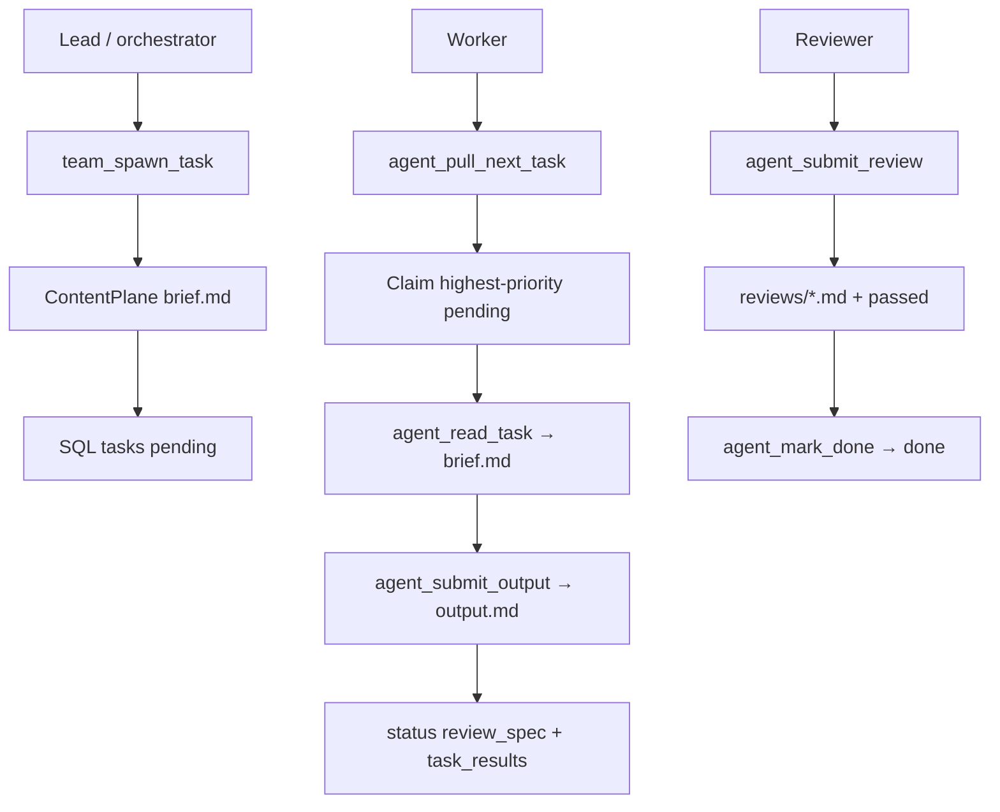

# Change: 001-hybrid-teams-architecture — Hybrid Agent Teams Architecture

> **STATUS:** `draft` (2026-09-04)
>
> **For agentic workers:** REQUIRED: follow `.agents/skills/_shared/conventions/sdd-structure.md`. This file is WHY + HOW (former intent + plan). Spec phase instantiates `tasks.md` + `acceptance.feature` from the Step Blueprint and per-step WHAT below.
>
> **Migration note:** Question round already satisfied by legacy `intent.md` / `plan.md` / `docs/plan/04-teams-sub-agents-memory.md`. This `change.md` folds those answers; do not re-interview.

**Goal:** Give Mnemonic a hybrid control/data plane so agents can spawn, claim, complete, and peer-review team tasks end-to-end.

**Architecture:** SQLite holds teams/tasks/messages/reviews metadata (status, ownership, paths); markdown content lives under `{project}/.skillgrid/files/`. Domain logic lives on `service.Service`; MCP (`tools_teams.go`) and HTTP (`/teams/…`) are adapters. Content writes use FS-first then SQL with file rollback on SQL failure.

**Tech stack:** Go (`skillgrid-cli`), SQLite (`modernc.org/sqlite`), MCP (`mcp-go`), HTTP mux with bearer-token auth on writes (`requireWriteAuth`).

**Research:** none (legacy intent/plan + `docs/plan/04-teams-sub-agents-memory.md`)

**Ticket:** `none`

**Depends on:** none

---

## Goal

Orchestrators and sub-agents can spawn, pull, read, submit, review, and mark done team tasks with SQL metadata and filesystem markdown content, so `subagent-execution` and `dispatching-parallel-agents` have a real teamwork backend.

## Out of scope / Non-Goals

- Embeddings / vector search (covered by `docs/plan/07-nemonic-hybid-search.md`, separate change)
- Python microservice / Hermes memory (`docs/plan/05` — not needed for teams)
- Session relay / Cleave-style handoffs (`docs/plan/06` — separate change)
- `project_name` / issue tracker integration (Backlog.md already wired via sdd-init)
- MCP inbox tools (`agent_send_message` / `agent_read_inbox`) — deferred; `messages` table kept for HTTP readiness
- Tiered L0/L1/L2 storage (change **003**); only a no-op content-write seam here
- Migration `010_*` (owned by change **003**)

## Definition of Done

This change is done only when **all** of the following are true:

- [ ] `team_spawn_task` creates a task with a `brief.md` on disk and a SQL row, returning the task ID
- [ ] `agent_pull_next_task` returns the highest-priority unassigned task for the calling agent
- [ ] `agent_read_task` returns brief markdown from `.skillgrid/files/tasks/{id}/brief.md`
- [ ] `agent_submit_output` writes `output.md` and advances the task to `review_spec`
- [ ] `agent_submit_review` writes review markdown and sets `passed` on the `reviews` table
- [ ] `agent_mark_done` transitions the task to `done` and populates `task_results`
- [ ] All Go tests pass: `go test ./…` under `skillgrid-cli` (vet + package tests)
- [ ] Every Step Blueprint entry has a matching section in `tasks.md` with Verdict `PASS` or `PASS WITH WARNINGS`
- [ ] Every `@step-NN` Feature in `acceptance.feature` has passing `@happy`, `@edge`, and `@failure` scenarios
- [ ] Applicable threat-matrix rows have RED coverage that passed
- [ ] Testing strategy commands below are green
- [ ] Rollback path below is still valid (or N/A documented)
- [ ] Change archived under `docs/skillgrid/archive/001-hybrid-teams-architecture/`

---

## Problem / why

Mnemonic is a single-agent memory engine (observations, code index, web cache). It has no multi-agent teamwork: agents cannot claim tasks, hand off via messages, or be peer-reviewed. Design doc `docs/plan/04-teams-sub-agents-memory.md` describes SQLite control plane + filesystem data plane but was never implemented. The `subagent-execution` and `dispatching-parallel-agents` skills exist but cannot function end-to-end without this backend.

## Target users

- **Agent orchestrator** — spawns tasks, assigns them to sub-agents, tracks progress across the team
- **Agent worker (sub-agent)** — pulls next available task, reads brief, writes output, submits for review
- **Agent reviewer** — reads task output, writes spec-compliance or code-quality review
- **Urgency:** Medium — skills exist but lack the teamwork backend

## Business rules

- SQLite stores metadata only (task status, ownership, paths, relations); content is `.md` under `{project}/.skillgrid/files/`
- Write filesystem content first, then insert the SQL row; if SQL fails, delete the orphaned file (FS-first rollback)
- All new SQL is additive migrations (`009_*` and up) — no existing schema rewrites; do not use `010_*`
- MCP tools follow existing `s.AddTool(toolDef, handlerFunc)` pattern (`tools_memory.go` / `tools_code.go`)
- HTTP routes follow existing `mux.HandleFunc` pattern with bearer-token auth on writes (`requireWriteAuth`)
- Six Intent MCP tools only; no inbox MCP in this change
- Teams HTTP lives under `/teams/…` — must not collide with `/memory/reviews`

## In scope

- SQL migration `009_teams_schema.sql`: `teams`, `team_members`, `tasks`, `messages`, `task_results`, `reviews`
- `ContentPlane` filesystem helpers for tasks/messages/reviews under `.skillgrid/files/`
- Service facade methods: spawn, pull, read, submit output, submit review, mark done
- Six MCP tools in `tools_teams.go` + registration
- HTTP CRUD under `/teams/…` (writes auth-gated)
- Unit + integration tests following existing patterns

## Risks & rollback

- **Risk:** FS+SQL atomicity gap — **Mitigation:** Write FS first, then SQL; delete file on SQL failure; cover with RED/unit tests
- **Risk:** Migration ordering — **Mitigation:** `009_*` sorts after `008_*` via existing `sort.Strings(names)`
- **Risk:** MCP tool surface proliferation — **Mitigation:** Group all team tools in `tools_teams.go`; follow `registerMemoryTools` pattern
- **Risk:** HTTP auth parity — **Mitigation:** Reuse `requireWriteAuth` for all team mutation routes
- **Rollback:** Remove `009_teams_schema.sql` (migration system checks `index_meta`; existing DBs will not re-run removed files). Remove `tools_teams.go`, revert `server.go` registration, revert service/HTTP additions — all additive. Filesystem content under `.skillgrid/files/` is opt-in.

## Error handling

| Failure | Behavior | Notes |
|---------|----------|-------|
| SQL insert fails after FS content write | `abort` + delete orphan file | No corrupt row; no orphan markdown |
| Pull with no pending tasks | `abort` | Clear error; nothing claimed |
| Read / mutate unknown task id | `abort` | Clear tool/HTTP error; no panic |
| Bad / missing MCP spawn args | `abort` | Structured tool error result; no panic; no orphan |
| HTTP write without bearer when `SKILLGRID_HTTP_TOKEN` set | `abort` (401) | Existing write-auth pattern |
| Store open / migration apply | `abort` on hard failure | Additive `009_*` via embed + `index_meta`; observations unchanged |

## Testing strategy

- **Unit:** `Run: go test ./skillgrid-cli/internal/mnemonic/service/ ./skillgrid-cli/internal/mnemonic/files/ ./skillgrid-cli/internal/mnemonic/store/` — Expected: PASS
- **Integration / acceptance:** `Run: go test ./skillgrid-cli/internal/mnemonic/mcp/ ./skillgrid-cli/internal/mnemonic/http/` — Expected: PASS (`@step-03` / `@step-04` / `@step-05` / `@p0`)
- **Full suite:** `Run: go test ./skillgrid-cli/...` — Expected: PASS
- **Green means:** Facade atomicity, six MCP tools registered/dispatched, HTTP write auth, and status transitions all pass under `go test`

---

## Step Blueprint

Contract for `sdd-spec`. Do not renumber after `tasks.md` exists. Per-step Out of scope / DoD live under Per-step WHAT (table is summary only).

| NN | Step slug | Goal (one line) | Primary package / entry | Depends on |
|----|-----------|-----------------|-------------------------|------------|
| 01 | `schema` | Additive teams schema + ContentPlane FS data plane | `skillgrid-cli/internal/mnemonic/store/migrations`, `skillgrid-cli/internal/mnemonic/files` | — |
| 02 | `service-facade` | Service spawn/pull/read/submit/review/done | `skillgrid-cli/internal/mnemonic/service` | 01 |
| 03 | `mcp-tools` | Register six team/agent MCP tools | `skillgrid-cli/internal/mnemonic/mcp` | 02 |
| 04 | `http-routes` | Auth-gated `/teams/…` CRUD | `skillgrid-cli/internal/mnemonic/http` | 02 |
| 05 | `tests` | Unit + integration coverage for facade/MCP/HTTP | `skillgrid-cli/internal/mnemonic/{service,mcp,http}` | 03, 04 |

---

## Technical approach

Implement the hybrid control/data plane from `docs/plan/04-teams-sub-agents-memory.md` on existing Go Mnemonic: `service.Service` → MCP `AddTool` → HTTP `mux` + `requireWriteAuth`. Add migration `009_*` only. Domain methods on `Service`; adapters in `tools_teams.go` and `/teams/…` routes. ContentPlane writes FS first then SQL with rollback; optional no-op post-write seam for later change **003** (no L0/L1/L2 here).

## Architecture decisions

### Decision: Hybrid control + data plane

**Module / Interface / Seam / Adapter / Depth:** Teams facade; spawn/pull/read/submit/review/done; FS-then-SQL; SQLite + FS markdown; deep.
**Choice:** SQL = status/ownership/paths; content under `{project}/.skillgrid/files/{tasks,messages,reviews}/…`.
**Alternatives considered:** SQLite BLOBs; Python `file_store`.
**Rationale:** Matches Intent rules and Go Mnemonic; small DB, Git-friendly markdown.

### Decision: Content-plane writer with optional hook

**Module / Interface / Seam / Adapter / Depth:** `files.ContentPlane`; Write/Read; content-write **Seam**; FS writer (+ later 003 hook); deep.
**Choice:** FS first → SQL insert → delete file on SQL failure; no-op post-write hook for brief/output.
**Alternatives considered:** Inline `os.WriteFile` per method; full tier registry now.
**Rationale:** One atomicity pattern; stays in scope for **003**.

### Decision: Facade + MCP/HTTP adapters

**Module / Interface / Seam / Adapter / Depth:** `service.Service` teams methods; `openProject`; MCP + HTTP **Adapter**s; deep.
**Choice:** Domain on `Service`; `tools_teams.go` + `registerTeamsTools`; HTTP `/teams/…` (not `/memory/reviews`).
**Alternatives considered:** Separate teams store package; MCP-only.
**Rationale:** Matches `tools_memory.go` / `http/server.go`; avoids review-route clash.

## Data flow



## File layout

```
skillgrid-cli/internal/mnemonic/
├── store/migrations/
│   └── 009_teams_schema.sql     # teams/tasks/messages/reviews metadata
├── files/
│   └── content.go               # ContentPlane Write/Read + FS-first rollback
├── service/
│   ├── service.go               # wire via openProject
│   ├── teams.go                 # Spawn/Pull/Read/Submit/Review/Done
│   └── teams_test.go
├── mcp/
│   ├── tools_teams.go           # six AddTool handlers
│   ├── server.go                # registerTeamsTools
│   ├── server_test.go
│   └── tools_teams_test.go
└── http/
    ├── server.go                # /teams/… CRUD + requireWriteAuth
    └── teams_test.go
```

## Impacted files map

| File | Action | Step | Description |
|------|--------|------|-------------|
| `skillgrid-cli/internal/mnemonic/store/migrations/009_teams_schema.sql` | Create | 01 | teams, team_members, tasks, messages, task_results, reviews |
| `skillgrid-cli/internal/mnemonic/files/content.go` | Create | 01 | ContentPlane Write/Read + FS-first rollback |
| `skillgrid-cli/internal/mnemonic/service/teams.go` | Create | 02 | Spawn/Pull/Read/SubmitOutput/SubmitReview/MarkDone |
| `skillgrid-cli/internal/mnemonic/service/service.go` | Modify | 02 | Wire teams via openProject if needed |
| `skillgrid-cli/internal/mnemonic/mcp/tools_teams.go` | Create | 03 | Six tools + handlers |
| `skillgrid-cli/internal/mnemonic/mcp/server.go` | Modify | 03 | `registerTeamsTools` in Start/NewServer |
| `skillgrid-cli/internal/mnemonic/mcp/server_test.go` | Modify | 03 | Expect six new tool names; bad spawn error |
| `skillgrid-cli/internal/mnemonic/http/server.go` | Modify | 04 | `/teams/…` CRUD; writes `requireWriteAuth` |
| `skillgrid-cli/internal/mnemonic/service/teams_test.go` | Create | 05 | Atomicity, pull priority, status transitions |
| `skillgrid-cli/internal/mnemonic/mcp/tools_teams_test.go` | Create | 05 | Tool dispatch + FS/SQL parity |
| `skillgrid-cli/internal/mnemonic/http/teams_test.go` | Create | 05 | Auth-gated write / open read |

## Per-step WHAT

Observable behavior each step must deliver (feeds Gherkin). Not implementation HOW.

### Step 01 — `schema`

**Goal:** Additive teams tables and filesystem content storage without rewriting observations.
**Out of scope:** Service facade, MCP tools, HTTP routes, L0/L1/L2 tiers, migration `010_*`.
**Definition of Done:** Store open applies `009_*`; content writes land markdown on disk with SQL paths/status only; SQL failure after FS write leaves no orphan.

- Store open creates teams/members/tasks/messages/results/reviews tables without changing observations
- Team task content write stores markdown under the project files tree; SQL stores path and status only
- SQL failure after a successful filesystem write removes the content file with no corrupt row
- Migration is idempotent via `index_meta`; no-op post-write seam present (no tiered layers)

### Step 02 — `service-facade`

**Goal:** Orchestrator-facing spawn/pull/read/submit/review/done lifecycle on the service facade.
**Out of scope:** MCP registration, HTTP routes, inbox messaging tools.
**Definition of Done:** Spawn returns pending id; pull claims top priority; status advances through review_spec to done with review `passed` and task_results.

- Spawn a team task with brief content and receive a pending task id
- Pull claims the highest-priority unassigned task; read returns brief markdown
- Submit output advances to `review_spec`; submit review sets `passed`; mark done → `done` with task_results
- Empty pull returns a clear error and claims nothing

### Step 03 — `mcp-tools`

**Goal:** Expose six team/agent MCP tools with consistent SQL/FS round-trips and structured errors.
**Out of scope:** Inbox MCP tools; changes to mem/code/web tool contracts.
**Definition of Done:** Six tools registered; spawn→pull→read→submit keeps SQL/FS consistent; bad args / unknown id / empty queue → structured tool errors without panic.

- Tools listed include `team_spawn_task`, `agent_pull_next_task`, `agent_read_task`, `agent_submit_output`, `agent_submit_review`, `agent_mark_done`; inbox tools absent
- Spawn/pull/read/submit output round-trip keeps SQL metadata and filesystem content consistent
- Invalid spawn arguments yield a structured tool error without panic or orphan state
- Unknown id or empty queue yields a clear tool error without panic
- Existing mem/code/web tool names remain unchanged

### Step 04 — `http-routes`

**Goal:** HTTP CRUD under `/teams/…` with auth-gated writes and no collision with memory reviews.
**Out of scope:** MCP tools; changing `/memory/reviews` behavior.
**Definition of Done:** Authenticated write succeeds; unauthenticated POST → 401 when token set; GETs stay open; paths distinct from memory reviews.

- Authenticated client can post a teams resource successfully when a write token is configured
- GET of a teams resource succeeds without a bearer; teams paths do not collide with memory review routes
- Unauthenticated POST returns 401 when a write token is configured

### Step 05 — `tests`

**Goal:** Automated coverage for facade atomicity, MCP registration/dispatch, and HTTP write auth.
**Out of scope:** New production features beyond closing RED coverage from prior steps.
**Definition of Done:** `go test ./…` covers atomicity, six tool names, bad-spawn structured error, and HTTP write auth; mem/code tools remain.

- Full Go suite covers facade atomicity, MCP registration/dispatch, and HTTP write auth
- Registry asserts six team tool names and keeps memory/code tools
- Fixtures prove FS+SQL rollback and bad spawn structured error without orphan state

## Threat matrix

Mark each row `Applicable` or `N/A: reason`. Applicable rows name an owning step and propagate into RED tasks + acceptance scenarios.

| Boundary / threat | Applicable? | Owning step | Planned RED coverage |
|-------------------|-------------|-------------|----------------------|
| Documentation-like paths | N/A: only `.md` under `.skillgrid/files/`; no exec classification | — | — |
| Git repository selection | N/A: no VCS automation in this change | — | — |
| Commit state | N/A: no commit automation | — | — |
| Push state | N/A: no push automation | — | — |
| PR commands | N/A: no PR automation | — | — |
| **Mnemonic tool surface** | Applicable — six new MCP tools; mem/code/web unchanged | 03 (RED), 05 (parity) | `TestAllToolsRegistered` until six names; bad spawn → tool error not panic; tools_teams_test dispatch/FS parity |
| **Shared-convention drift** | N/A: no `_shared/conventions/*` edits | — | — |

## Migration / rollout

Additive `009_teams_schema.sql` via embed + `index_meta`. No feature flag. Rollback: drop migration file + teams code (all additive). Filesystem content under `.skillgrid/files/` is opt-in.

## Open questions

- Defer `agent_send_message` / `agent_read_inbox` (design doc) to a follow-on — Intent omits them; `messages` table kept for HTTP readiness (accepted for this change).

## Glossary

| Term | Definition | Glossary file |
|------|------------|---------------|
| **Team Task** | Work unit with brief/output paths and status lifecycle (`pending` → `review_spec` → `done`) | technical |
| **Team Member** | Agent role row that can own or review tasks | technical |
| **Agent Review** | Spec/code review row plus markdown comments path; carries `passed` | technical |
| **Inbox** | Unread agent messages (schema ready; MCP tools deferred) | technical |
| **ContentPlane** | FS-first Write/Read seam for team markdown with SQL-path metadata | technical |
| **Tiered Storage** | Out of scope here; content-write seam reserved for change 003 | technical |

## Author self-review

- [x] **Goal**, **Out of scope / Non-Goals**, and **Definition of Done** are filled and testable
- [x] **Error handling** and **Testing strategy** are filled
- [x] Non-goals match Global Constraints that will appear in `tasks.md`
- [x] Rollback plan is present
- [x] Step Blueprint covers a vertical-slice sequence (no horizontal-only layers)
- [x] Every Impacted Files row maps to exactly one step
- [x] Every applicable threat row names an owning step
- [x] Glossary terms reused or defined; no companion reference file
