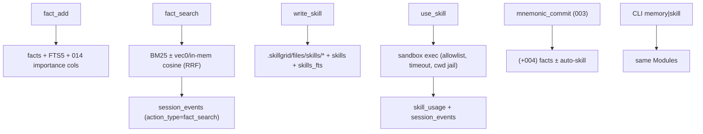

# Change: 004-hermes-memory — Hermes Fact Memory & Agent Skills

> **STATUS:** `revised` (2026-09-29)
>
> **Revision note:** Updated to account for shipped changes 014 (importance, skills framework, hybrid RRF), vector-db (vec0), and session-events-layer (migration 040). Scope reduced from ~1600–2200 to ~800–1200 lines.
>
> **For agentic workers:** REQUIRED: follow `.agents/skills/_shared/conventions/sdd-structure.md`. This file is WHY + HOW (former intent + plan). Spec phase instantiates `tasks.md` + `acceptance.feature` from the Step Blueprint and per-step WHAT below.

**Goal:** Agents get importance-ranked Fact Memory with forgetting (reusing 014 AKL scoring) and a path to write, find, and sandboxed-execute Agent Skills (extending 014's skills observation framework) beside `mem_*` observations.

**Architecture:** Extend **003** (Tiered Storage) + **014** (importance, skills framework, hybrid RRF) + **session-events-layer** (migration 040). New `facts` table reuses 014 importance/decay columns pattern; skills extend the existing `memory_type="skill"` observation framework with FTS + sandboxed execute. Fact/skill vectors reuse **vector-db** vec0 tables (migration 042) or in-memory hot path — no separate sqlite-vec Seam. Retrieval trails target `session_events` (migration 040), not the old `retrieval_trails` table.

**Tech stack:** Go (`skillgrid-cli`), SQLite (`modernc.org/sqlite` + vec0 via vector-db), MCP (`mcp-go`), filesystem under `.skillgrid/files/skills/`.

**Research:** none (legacy intent/plan + `docs/plan/05-hermes-memory.md`)

**Ticket:** `task-001` (plan ticket; backlog CLI Bun SIGILL — emergency fallback)

**Depends on:** `003-tiered-storage` (shipped); `014-mnemonic-performance` (shipped); `session-events-layer` (migration 040 — must ship first); `vector-db` (shipped, migration 042)

---

## Goal

Agents and operators can add/search/forget/decay ranked facts and write/list/search/execute Agent Skills with hybrid retrieval and session-event trails, without re-delivering Change **003** Tiered Storage, **014** importance/skills framework, or the session-events layer.

## Out of scope / Non-Goals

- Reimplementing **003** Tiered Storage, `migrate --tier`, core `semantic_search`, or trail CLI
- Reimplementing **014** importance scoring, decay, `retrieval_usage`, or the skills observation framework
- Rebuilding the **session-events-layer** `session_events` table or `session_changes` tool
- Rebuilding the **vector-db** vec0 tables or `vectorstore/` package
- OpenCode plugin; cloud sync; external vector DB
- Rewriting code-index or web-cache; Changing **002** identity
- Replacing **003** Pure Go document/semantic embedding path
- Hermes L0–L3 labels (keep **003** L0/L1/L2 Tiered Storage terms)
- Confusing Agent Skills with `.agents/skills` packs
- Docker-only sandbox (constrained subprocess only)

## Definition of Done

This change is done only when **all** of the following are true:

- [ ] Add/search/forget facts; soft-deleted facts out of default search
- [ ] Decay lowers importance (reusing 014 AKL) and logs to `session_events`; CLI can trigger decay
- [ ] Write/list/search Agent Skills; lexical and hybrid modes work
- [ ] Sandboxed `use_skill` returns captured output and logs usage
- [ ] `mnemonic_commit` extracts facts and may auto-generate an Agent Skill
- [ ] Fact/skill search events recorded in `session_events` (migration 040)
- [ ] `go test ./...` passes for touched packages
- [ ] Every Step Blueprint entry has a matching section in `tasks.md` with Verdict `PASS` or `PASS WITH WARNINGS`
- [ ] Every `@step-NN` Feature in `acceptance.feature` has passing `@happy`, `@edge`, and `@failure` scenarios
- [ ] Applicable threat-matrix rows have RED coverage that passed
- [ ] Testing strategy commands below are green
- [ ] Rollback path below is still valid (or N/A documented)
- [ ] Change archived under `docs/skillgrid/archive/004-hermes-memory/`

---

## Problem / why

Agents lack a dedicated importance-ranked Fact Memory store with explicit forgetting, and a path to sandboxed-execute Agent Skills. **014** delivered importance scoring + a skills observation framework, but:
- Facts are currently implicit (L1 atoms via distillation, `memory_type` observations) — no explicit add/search/forget/decay API
- Skills are matched by intent (`MatchSkills`) but cannot be **executed** — no sandboxed `use_skill`
- No hybrid (BM25 + vector) search over facts or skills specifically

This change adds the missing **explicit fact store API** + **sandboxed skill execution** on top of existing infrastructure.

## Target users

- **Agent** — recall ranked facts via `fact_*` MCP tools; write/search/execute Agent Skills
- **Operator** — CLI inspect/forget/decay/execute; debug via `session_events`
- **Urgency:** Medium — 014 covers scoring passively; this adds explicit control + execution

## Business rules

- Extends **003** + **014** + **session-events-layer** — no re-delivery of importance, decay, skills framework, or session events
- Fact Memory is a **new store** (table) beside `mem_*` observations (not an overlay)
- Facts **reuse** 014 importance columns (`importance_score`, `recency_decay`, `maturity_tier`, `retrieval_usage`) — no new `forgetting_events` table
- Additive SQL; Go MCP + SQLite + FS; no external vector DB
- Fact/skill vectors reuse **vector-db** vec0 pattern (BLOB source of truth, vec0 derived index) or in-memory cosine — no separate sqlite-vec Seam
- Soft-delete facts; decay via 014 AKL; purge via Dream Executor (014)
- Agent Skills = FS under `.skillgrid/files/skills/` + SQL metadata + extends `memory_type="skill"` observations — ≠ `.agents/skills` packs
- Slice 1: sandboxed `use_skill` + optional auto-skill on `mnemonic_commit`
- Keep **003** L0/L1/L2 Tiered Storage terms; no Hermes L0–L3 labels
- New MCP tools are additive JSON-only; `mem_*` / `code_*` / `web_*` shapes unchanged
- Retrieval events go to `session_events` (migration 040), not the old `retrieval_trails` table

## In scope

- Fact table + MCP `fact_add` | `fact_search` | `fact_forget` | `fact_decay` (FTS5, reuses 014 importance, session_events trails)
- Agent Skill registry: FS + SQL metadata + FTS; write/search/list; extends `memory_type="skill"`
- Sandboxed `use_skill` (allowlisted runners, timeout, no network, cwd jail)
- Hybrid BM25+vector search for facts/skills (reuses `hybrid.Rank` RRF pattern)
- `mnemonic_commit` fact extraction ± optional auto-skill
- CLI `skillgrid memory` / `skillgrid skill` (incl. execute) with MCP parity

## Risks & rollback

- **Risk:** Duplicate **014** work — **Mitigation:** Strict out-of-scope; reuse importance, skills framework, hybrid RRF; DoD forbids re-implementation
- **Risk:** Skill execute sandbox escape — **Mitigation:** Constrained runtime, allowlist, timeout, cwd jail, RED tests, usage logging
- **Risk:** session-events-layer not shipped — **Mitigation:** Hard dependency; migration 040 must exist before 004 `011_*`
- **Risk:** Term clash with `.agents/skills` — **Mitigation:** Glossary term **Agent Skill**; FS under `.skillgrid/files/skills/`
- **Risk:** Large multi-step change (~800–1200 lines) — **Mitigation:** Four vertical steps; delivery strategy `ask-on-risk`
- **Rollback:** Drop migration `011_*`, new fact/skill code, MCP tools, and CLI subcommands; leave **003**/**014**/session-events intact.

## Error handling

| Failure | Behavior | Notes |
|---------|----------|-------|
| Store open / migrate after session-events | `abort` if migration 040 missing | Require session-events-layer before `011_*` |
| vec0 table missing (vector-db not applied) | `warn+continue` for FTS; `degrade` vector leg | In-memory cosine fallback; FTS search still works |
| Soft-deleted fact/skill in default search | N/A (omitted) | Soft-delete must never appear in default list/search |
| Decay / purge below threshold | `warn+continue` | Lower importance via 014 AKL; log to session_events |
| `overwrite=false` name collision on write_skill | `abort` | Clear error; do not overwrite |
| Path escape / unknown language / timeout on `use_skill` | `abort` | No host-wide exec; no network; cwd=skill dir |
| Auto-skill with no reusable pattern | `warn+continue` | Skip write; preserve 003 commit behaviour |
| Invalid CLI memory/skill action | `abort` | Fail cleanly; do not corrupt Fact Memory |

## Testing strategy

- **Unit:** `Run: go test ./skillgrid-cli/internal/mnemonic/facts/ ./skillgrid-cli/internal/mnemonic/skills/ ./skillgrid-cli/internal/mnemonic/store/` — Expected: PASS
- **Integration / acceptance:** `Run: go test ./skillgrid-cli/internal/mnemonic/mcp/ ./skillgrid-cli/cmd/skillgrid/` plus BDD `@step-NN` scenarios in `acceptance.feature` — Expected: PASS (`@step-01`…`@step-04` / `@p0`)
- **Full suite:** `Run: go test ./...` (from repo root / `skillgrid-cli` per module layout) — Expected: PASS
- **Green means:** Fact/skill UAT criteria hold; new MCP tools registered without regressing `mem_*`; sandbox rejects path escape; CLI parity with MCP

---

## Step Blueprint

Contract for `sdd-spec`. Do not renumber after `tasks.md` exists. Per-step Out of scope / DoD live under Per-step WHAT (table is summary only).

| NN | Step slug | Goal (one line) | Primary package / entry | Depends on |
|----|-----------|-----------------|-------------------------|------------|
| 01 | `facts-schema` | Facts table + FTS + 014 importance reuse + session_events trail | `skillgrid-cli/internal/mnemonic/facts` | — |
| 02 | `fact-tools` | MCP fact_* tools + session_events trail logging | `skillgrid-cli/internal/mnemonic/mcp` | 01 |
| 03 | `skills-registry-execute` | Skills FS + SQL + FTS; write/search/list + sandboxed use_skill | `skillgrid-cli/internal/mnemonic/skills` | 01 |
| 04 | `commit-hooks-cli` | Commit fact extract ± auto-skill; hybrid search; memory/skill CLI | `skillgrid-cli/cmd/skillgrid` | 02, 03 |

---

## Technical approach

Extend **003**/**014**/session-events with a Fact Memory table and Agent Skill execution layer. Additive SQL `011_facts_skills.sql` after migration 042; skill scripts under `.skillgrid/files/skills/`. Facts reuse 014 importance columns; skills extend the `memory_type="skill"` observation pattern with FTS + sandboxed execute. Retrieval events target `session_events` (migration 040). Hybrid search reuses `hybrid.Rank` RRF pattern. `mnemonic_commit` gains fact extraction ± optional auto-skill. CLI mirrors MCP for operator use.

## Architecture decisions

### Decision: Fact Memory as new table with 014 importance reuse

**Module / Interface / Seam / Adapter / Depth:** `facts`; Add/Search/Forget/Decay; SQL+FTS Seam; SQLite; deep
**Choice:** `facts` table with columns mirroring 014 importance (`importance_score`, `recency_decay`, `maturity_tier`, `retrieval_usage`) + `facts_fts` FTS5 table
**Alternatives considered:** Overlay on `observations` (rejected — different lifecycle, explicit API); separate `forgetting_events` table (rejected — 014 Dream Executor already handles purge)
**Rationale:** Explicit fact API without re-inventing scoring; no `mem_*` churn; keeps Tiered Storage terms

### Decision: No separate sqlite-vec Seam

**Module / Interface / Seam / Adapter / Depth:** reuse `vectorstore/` + `hybrid/`; KNN; vec0 or in-memory; deep
**Choice:** Fact/skill vectors use existing `vectorstore/` package (vec0 tables, migration 042) when available; degrade to in-memory cosine or FTS-only when vec0 absent
**Alternatives considered:** Separate `vec/` package with its own sqlite-vec loader (rejected — vector-db already solved this); BLOB-only cosine (inadequate for KNN at scale)
**Rationale:** Vector-db shipped a working isolated Seam; reusing it avoids a second extension-loading path

### Decision: Agent Skills extend 014 skills framework

**Module / Interface / Seam / Adapter / Depth:** `skills` (new package); Write/List/Search/Use; FS+SQL Seam; disk+DB; deep
**Choice:** `.skillgrid/files/skills/{name}.{ext}` files + `skills` SQL metadata table + `skills_fts`; extends `memory_type="skill"` observations for intent-matching compatibility
**Alternatives considered:** SQLite BLOBs only (less git-friendly); standalone (duplicates 014 skills matching)
**Rationale:** 014 already matches skills by intent; this adds explicit write/search/execute without breaking that path

### Decision: Constrained subprocess for use_skill

**Module / Interface / Seam / Adapter / Depth:** `skills.Executor`; Run→IO; exec Seam; sandbox (+ deny); deep
**Choice:** Allowlisted runners (sh, python3, node), timeout (default 30s), no network (LD_PRELOAD/env), cwd=skill dir; log usage to `skill_usage` table + `session_events`
**Alternatives considered:** Docker-only (heavy); defer execute (loses Slice 1 value)
**Rationale:** Slice-1 acceptance; sandbox risk accepted with RED tests

### Decision: Retrieval events to session_events

**Module / Interface / Seam / Adapter / Depth:** `session_events` (migration 040); append; SQL Seam; deep
**Choice:** Fact/skill search events written as `session_events` rows (action_type="fact_search"/"skill_search", payload=JSON with ids + mode)
**Alternatives considered:** Old `retrieval_trails` table (deprecated by session-events-layer); separate trail table (redundant)
**Rationale:** Single event stream; `session_changes` already provides the read path

### Decision: Commit hooks extend 003 compaction

**Module / Interface / Seam / Adapter / Depth:** AfterCommit in `MnemonicCommit`; fact-extract + optional skill-gen; deep
**Choice:** Post-commit extract facts from `LessonsLearned`/`Content`; optionally `write_skill` when a reusable pattern detected; no tier/trail redo
**Alternatives considered:** Separate commit tool (duplication); always auto-skill (junk)
**Rationale:** Extends **003**; optional skill avoids junk; `TaskID` field already reserved

## Data flow



## File layout

```
skillgrid-cli/
├── internal/mnemonic/
│   ├── store/migrations/011_facts_skills.sql   # facts/FTS/skills/skills_fts/skill_usage
│   ├── facts/facts.go                          # Fact Memory Module (Add/Search/Forget/Decay)
│   ├── facts/facts_test.go
│   ├── skills/skills.go                        # Registry Write/List/Search (FS + SQL + FTS)
│   ├── skills/execute.go                       # Sandboxed Use (allowlist, timeout, cwd jail)
│   ├── skills/skills_test.go
│   ├── skills/execute_test.go
│   └── mcp/
│       ├── tools_facts.go                      # fact_* MCP tools + session_events trail
│       ├── tools_skills.go                     # write/search/list/use_skill MCP tools
│       ├── tools_compaction.go                 # (+004) fact extract ± auto-skill
│       └── server.go                           # Register* wiring
└── cmd/skillgrid/
    ├── memory.go                               # memory fact|forget|decay
    ├── skill.go                                # skill list|search|execute
    └── main.go                                 # dispatch
```

## Impacted files map

| File | Action | Step | Description |
|------|--------|------|-------------|
| `skillgrid-cli/internal/mnemonic/store/migrations/011_facts_skills.sql` | Create | 01 | facts/FTS/skills/skills_fts/skill_usage; importance cols |
| `skillgrid-cli/internal/mnemonic/store/store.go` | Modify | 01 | Hook migration 011 on Open |
| `skillgrid-cli/internal/mnemonic/facts/facts.go` | Create | 01 | Fact Memory Module (Add/Search/Forget/Decay) |
| `skillgrid-cli/internal/mnemonic/mcp/tools_facts.go` | Create | 02 | fact_* + session_events trail; RegisterFactTools |
| `skillgrid-cli/internal/mnemonic/skills/skills.go` | Create | 03 | Registry write/list/search (FS + SQL + FTS) |
| `skillgrid-cli/internal/mnemonic/skills/execute.go` | Create | 03 | Sandboxed exec (allowlist, timeout, cwd jail) |
| `skillgrid-cli/internal/mnemonic/mcp/tools_skills.go` | Create | 03 | write/search/list/use_skill MCP tools |
| `skillgrid-cli/internal/mnemonic/mcp/server.go` | Modify | 03 | Wire Register* for fact+skill tools |
| `skillgrid-cli/internal/mnemonic/mcp/tools_compaction.go` | Modify | 04 | Fact extract + auto-skill + hybrid search |
| `skillgrid-cli/cmd/skillgrid/memory.go` | Create | 04 | memory fact\|forget\|decay |
| `skillgrid-cli/cmd/skillgrid/skill.go` | Create | 04 | skill list\|search\|execute |
| `skillgrid-cli/cmd/skillgrid/main.go` | Modify | 04 | Dispatch memory/skill |

## Per-step WHAT

Observable behavior each step must deliver (feeds Gherkin). Not implementation HOW.

### Step 01 — `facts-schema`

**Goal:** Operator can open a store and get Fact Memory + Skills tables without rewriting observations
**Out of scope:** MCP tools; skill execute; CLI; hybrid search mode
**Definition of Done:** Store open creates facts + skills schema; re-open idempotent; vec0 absent → FTS still works; 014 importance columns present on facts

- As operator: open creates Fact Memory + Skills tables without rewriting observations
- Given a DB after session-events-layer + vector-db, migrate leaves prior rows intact
- Edge: re-open idempotent; vec0 absent → FTS search works, vector leg degrades

### Step 02 — `fact-tools`

**Goal:** Agent can add/search/forget/decay facts via MCP with session_events trails
**Out of scope:** Agent Skill tools; CLI; hybrid mode (step 04)
**Definition of Done:** fact_* tools registered; soft-deleted absent from default search; decay uses 014 AKL + logs session_events; `mem_*` unchanged

- As agent: `fact_add` / `fact_search` / `fact_forget` / `fact_decay`; soft-deleted facts out of default search
- Given search, a `session_events` row records action_type + fact ids + mode
- Edge: decay lowers importance via 014 AKL, logs session_events; purge via Dream Executor

### Step 03 — `skills-registry-execute`

**Goal:** Agent can write/list/search Agent Skills and execute sandboxed `use_skill`
**Out of scope:** Commit hooks; CLI; hybrid ranking (step 04)
**Definition of Done:** write/list/search registered; soft-deleted omitted; overwrite=false rejects collision; sandboxed execute returns IO + logs usage; path escape/unknown lang/timeout reject

- As agent: write/list/search Agent Skills (lexical FTS); FS + SQL metadata
- As agent: `use_skill` executes in sandbox, returns captured IO, logs `skill_usage` + `session_events`
- Soft-deleted skills omitted from default list/search
- Edge: overwrite=false rejects name collision; path escape / unknown lang / timeout → error, no host-wide exec

### Step 04 — `commit-hooks-cli`

**Goal:** Commit extracts facts ± auto-skill; hybrid BM25+vector search; CLI parity with MCP
**Out of scope:** Redo trail CLI, Tiered Storage, or 014 importance
**Definition of Done:** `mnemonic_commit` preserves 003 behaviour + adds extract ± auto-skill; hybrid search (RRF) works for facts/skills; CLI memory/skill match MCP

- As agent: `mnemonic_commit` keeps **003** behaviour and adds fact extract ± auto-skill
- As agent: `fact_search` / `search_skills` with mode=hybrid uses BM25 + vector (RRF via `hybrid.Rank` pattern)
- As operator: `skillgrid memory` / `skillgrid skill` (incl. execute) match MCP
- Edge: skip auto-skill when no reusable pattern; trail CLI unchanged

## Threat matrix

Mark each row `Applicable` or `N/A: reason`. Applicable rows name an owning step and propagate into RED tasks + acceptance scenarios.

| Boundary / threat | Applicable? | Owning step | Planned RED coverage |
|-------------------|-------------|-------------|----------------------|
| Documentation-like paths | Applicable — executable Agent Skill scripts | 03 | `../evil.sh` / unknown lang → error, no exec; timeout/cwd-jail/allowlist |
| Git repository selection | N/A: no git cwd authority | — | — |
| Commit state | N/A: no git commit automation (mnemonic_commit is MCP compaction, not git) | — | — |
| Push state | N/A: no push | — | — |
| PR commands | N/A: no PR CLI | — | — |
| **Mnemonic tool surface** (`mem_*` / `code_*` / `web_cache_*`) | Applicable — new fact_*/skill_* | 02, 03 | Tools registered; `mem_save` still works; soft-deleted fact absent from search |
| **Shared-convention drift** | N/A: no `_shared/conventions/*` edits | — | — |
| **session_events integrity** | Applicable — fact/skill events must not break existing session_changes | 02, 03 | New action_types don't break `session_changes` read; sequence ordering preserved |

Shell/subprocess sandbox adversarial cases are owned by step 03 RED (timeout, cwd jail, allowlist) under Documentation-like paths.

## Mnemonic Integration

New tools: `fact_add`, `fact_search`, `fact_forget`, `fact_decay`, `write_skill`, `search_skills`, `list_skills`, `use_skill`. Extend **003** `mnemonic_commit` (facts ± auto-skill). Retrieval events to `session_events`. No `mem_save` / `code_*` / `web_*` shape change. Topic keys: `sdd/004-hermes-memory/{change,tasks,spec}`.

## Migration / rollout

- Requires session-events-layer (migration 040) + vector-db (migration 042)
- Additive `011_facts_skills.sql`
- vec0 absent → degrade to FTS + in-memory cosine; never fail
- Rollback: drop `011_*` + new tools/CLI; leave 003/014/session-events/vector-db intact

## Open questions

- [ ] Confirm session-events-layer is shipped (QA → ship → archive) before starting 004
- [ ] Verify 014 skills framework (`MatchSkills`) is compatible with the new explicit `skills` table (dual path: intent-match via observations + explicit registry via FS+SQL)

## Glossary

| Term | Definition | Glossary file |
|------|------------|---------------|
| **Fact Memory** | New ranked-fact store beside `mem_*` observations (soft-delete, 014 AKL decay, FTS + vec) | business |
| **Agent Skill** | Writable/runnable Hermes skill (FS + SQL + extends `memory_type="skill"`) ≠ `.agents/skills` packs | business |
| **Tiered Storage** | **003** L0/L1/L2 storage model — keep those labels; no Hermes L0–L3 | technical |
| **Session Events** | **session-events-layer** per-tool-call event stream (migration 040) — retrieval trails target this | technical |
| **AKL Importance** | **014** importance scoring (`retrieval_count × exp(-decay × age_days)`) + maturity tiers | technical |
| **Module** | Deep package owning a domain Interface (facts, skills) | technical |
| **Seam** | Boundary where Adapter (FS, exec, vec0) plugs in | technical |

## Author self-review

- [x] **Goal**, **Out of scope / Non-Goals**, and **Definition of Done** are filled and testable
- [x] **Error handling** and **Testing strategy** are filled
- [x] Non-goals match Global Constraints that will appear in `tasks.md`
- [x] Rollback plan is present
- [x] Step Blueprint covers a vertical-slice sequence (no horizontal-only layers)
- [x] Every Impacted Files row maps to exactly one step
- [x] Every applicable threat row names an owning step
- [x] Glossary terms reused or defined; no companion reference file
