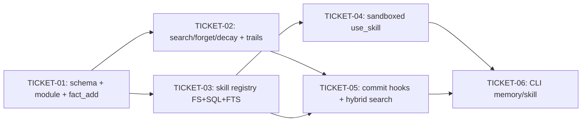

# Tasks — 004-hermes-memory

> Sliced from `.skillgrid/specs/2026-09-04-hermes-memory/briefing.md`.
> Vertical tracer-bullet tickets, dependency-ordered, sized for one fresh agent context window.

## Epic Summary

Agents get importance-ranked Fact Memory (add/search/forget/decay, reusing 014 AKL) and a path to write, find, and sandboxed-execute Agent Skills (extending 014's skills framework) beside `mem_*` observations. Four vertical steps; ~800–1200 lines.

## Build Shape

**Tracer thread** — TICKET-01 is the thin end-to-end path through every layer: migration 011 (SQL) → `FactStore` Add (facts package) → `fact_add` MCP tool (mcp package) → session_events trail (040). Later tickets thicken the path (search/forget/decay, skills, hybrid, CLI).

## Delivery Strategy

| Field | Value |
|-------|-------|
| Estimated changed lines | ~800–1200 |
| 400-line budget risk | High |
| Chained PRs recommended | Yes |
| Suggested split | PR 1: TICKET-01 + TICKET-02 (Fact Memory) → PR 2: TICKET-03 + TICKET-04 (Agent Skills) → PR 3: TICKET-05 + TICKET-06 (Commit hooks + CLI + Hybrid) |
| Delivery strategy | ask-on-risk |
| Chain strategy | stacked-to-main |

Decision needed before apply: Yes
Chained PRs recommended: Yes
Chain strategy: stacked-to-main
400-line budget risk: High

### Suggested Work Units

| Unit | Goal | Likely PR | Focused test command | Runtime harness | Rollback boundary |
|------|------|-----------|----------------------|-----------------|-------------------|
| 1 | Fact Memory: schema + module + MCP fact_* tools + session_events trails | PR 1 | `go test ./skillgrid-cli/internal/mnemonic/facts/ ./skillgrid-cli/internal/mnemonic/store/ ./skillgrid-cli/internal/mnemonic/mcp/ -count=1 -run 'Fact|Migration011'` | `skillgrid memory fact add "test" && skillgrid memory fact search "test"` | Drop `011_facts_skills.sql` facts portion + `facts/` package + `tools_facts.go` — 003/014/session-events/vector-db intact |
| 2 | Agent Skills: registry (FS+SQL+FTS) + sandboxed executor + MCP tools | PR 2 | `go test ./skillgrid-cli/internal/mnemonic/skills/ ./skillgrid-cli/internal/mnemonic/mcp/ -count=1 -run 'Skill|Sandbox|UseSkill'` | `skillgrid skill list && skillgrid skill execute <name>` | Drop `011_facts_skills.sql` skills portion + `skills/` package + `tools_skills.go` + `server.go` skill wiring — `mem_*` intact |
| 3 | Commit hooks (fact extract ± auto-skill) + hybrid BM25+vector search + CLI memory/skill | PR 3 | `go test ./skillgrid-cli/internal/mnemonic/mcp/ ./skillgrid-cli/cmd/skillgrid/ -count=1 -run 'Commit|Memory|Skill|Hybrid'` | `mnemonic_commit` + `skillgrid memory fact search --mode hybrid` + `skillgrid skill execute` | Revert `tools_compaction.go` + delete `memory.go`/`skill.go` + revert `main.go` dispatch — 003/014 intact |

> The four plain-text guard lines above are the **contract** — `skillgrid:subagent-execution` matches them literally. If risk is High, `Chained PRs recommended` MUST be `Yes` and every work unit MUST name a focused test, a runtime harness (or `N/A` + reason), and a rollback boundary.

## Tickets

### TICKET-01 — Fact Memory schema + module + fact_add tracer

- **Scope:** Migration `011_facts_skills.sql` (facts/FTS + skills/FTS/skill_usage tables); `facts` Module (Add only); `fact_add` MCP tool; session_events trail on add
- **Acceptance:** Store open after 040+042 creates facts + facts_fts + skills + skills_fts + skill_usage tables; re-open idempotent; vec0 absent → FTS works, vector leg degrades; 014 importance columns present on facts; `fact_add` MCP tool registered and returns a fact id; session_events row records action_type + fact id; `mem_save` still works; prior observations unchanged
- **SATISFIES:** Store open creates Fact Memory tables (step 01); Fact tools add search and record a session event (step 02, add portion)
- **Files:** `skillgrid-cli/internal/mnemonic/store/migrations/011_facts_skills.sql` (Create), `skillgrid-cli/internal/mnemonic/store/store.go` (Modify), `skillgrid-cli/internal/mnemonic/facts/facts.go` (Create), `skillgrid-cli/internal/mnemonic/facts/facts_test.go` (Create), `skillgrid-cli/internal/mnemonic/mcp/tools_facts.go` (Create — Add only), `skillgrid-cli/internal/mnemonic/mcp/tools_facts_test.go` (Create), `skillgrid-cli/internal/mnemonic/mcp/server.go` (Modify — wire RegisterFactTools)
- **Size:** ~400 (M)
- **Blocks:** TICKET-02, TICKET-03
- **Blocked by:** none
- **Precondition:** Migration 040 (session-events) and 042 (vector-db) applied in test fixtures
- **Reversibility:** one-way — migration 011 creates tables; dropping them is a manual rollback step
- **Fails-when:** `go test ./skillgrid-cli/internal/mnemonic/facts/ ./skillgrid-cli/internal/mnemonic/store/ ./skillgrid-cli/internal/mnemonic/mcp/ -count=1 -run 'Fact|Migration011'` exits non-zero OR any test in the focused run fails

### TICKET-02 — fact_search + fact_forget + fact_decay + session_events trails

- **Scope:** `fact_search` (lexical FTS; soft-delete filter), `fact_forget` (soft-delete), `fact_decay` (014 AKL reuse); session_events trail on search; decay logs to session_events
- **Acceptance:** `fact_search` returns matching facts, excludes soft-deleted; `fact_forget` soft-deletes (fact absent from default search after forget); `fact_decay` lowers importance via 014 AKL and logs session_event; session_events rows record action_type + fact ids + mode for search/decay; `mem_*` shape unchanged; session_changes read path not broken by new action_types
- **SATISFIES:** Soft-deleted fact absent from default search (step 02); Decay lowers importance and logs events (step 02); Fact tools add search and record a session event (step 02, search/forget/decay portion)
- **Files:** `skillgrid-cli/internal/mnemonic/facts/facts.go` (Modify — add Search/Forget/Decay), `skillgrid-cli/internal/mnemonic/facts/facts_test.go` (Modify), `skillgrid-cli/internal/mnemonic/mcp/tools_facts.go` (Modify — add search/forget/decay tools)
- **Size:** ~300 (M)
- **Blocks:** TICKET-05
- **Blocked by:** TICKET-01
- **Fails-when:** `go test ./skillgrid-cli/internal/mnemonic/facts/ ./skillgrid-cli/internal/mnemonic/mcp/ -count=1 -run 'Fact|Decay|SoftDelete|SessionEvent'` exits non-zero

### TICKET-03 — Agent Skill registry (FS + SQL + FTS)

- **Scope:** `skills` Module (Write/List/Search — lexical FTS); FS under `.skillgrid/files/skills/{name}.{ext}` + SQL metadata + `skills_fts`; extends `memory_type="skill"` observations; soft-delete filter; overwrite=false collision reject
- **Acceptance:** `write_skill` creates FS file + SQL row + FTS entry; `list_skills` returns non-deleted skills with metadata; `search_skills` (lexical FTS) returns matches, excludes soft-deleted; overwrite=false rejects name collision with clear error; FS under `.skillgrid/files/skills/`; compatible with 014 `MatchSkills` (dual path: intent-match via observations + explicit registry via FS+SQL); `mem_save` still works
- **SATISFIES:** Write list search and execute Agent Skills (step 03, write/list/search portion); Overwrite false rejects name collision (step 03); Path escape or unknown language rejects without exec (step 03, soft-delete portion)
- **Files:** `skillgrid-cli/internal/mnemonic/skills/skills.go` (Create), `skillgrid-cli/internal/mnemonic/skills/skills_test.go` (Create), `skillgrid-cli/internal/mnemonic/mcp/tools_skills.go` (Create — write/list/search), `skillgrid-cli/internal/mnemonic/mcp/tools_skills_test.go` (Create), `skillgrid-cli/internal/mnemonic/mcp/server.go` (Modify — wire skill tools)
- **Size:** ~350 (M)
- **Blocks:** TICKET-04, TICKET-05
- **Blocked by:** TICKET-01
- **Fails-when:** `go test ./skillgrid-cli/internal/mnemonic/skills/ ./skillgrid-cli/internal/mnemonic/mcp/ -count=1 -run 'Skill|WriteSkill|Overwrite|SoftDelete'` exits non-zero

### TICKET-04 — Sandboxed use_skill executor

- **Scope:** `skills.Executor` (sandboxed exec: allowlist sh/python3/node, timeout 30s, no network, cwd=skill dir); `use_skill` MCP tool; `skill_usage` table + session_events log on exec; path escape / unknown language / timeout reject
- **Acceptance:** `use_skill` executes skill in sandbox, returns captured stdout+stderr; path escape (`../evil.sh`) → error, no exec; unknown language → error, no exec; timeout → error, no hang; cwd=skill dir; no network (env/LD_PRELOAD); `skill_usage` row logged; session_events row logged; soft-deleted skill → error
- **SATISFIES:** Write list search and execute Agent Skills (step 03, execute portion); Path escape or unknown language rejects without exec (step 03); Documentation-like paths threat row (step 03)
- **Files:** `skillgrid-cli/internal/mnemonic/skills/execute.go` (Create), `skillgrid-cli/internal/mnemonic/skills/execute_test.go` (Create), `skillgrid-cli/internal/mnemonic/mcp/tools_skills.go` (Modify — add use_skill tool), `skillgrid-cli/internal/mnemonic/mcp/tools_skills_test.go` (Modify)
- **Size:** ~300 (M)
- **Blocks:** TICKET-06
- **Blocked by:** TICKET-03
- **Fails-when:** `go test ./skillgrid-cli/internal/mnemonic/skills/ ./skillgrid-cli/internal/mnemonic/mcp/ -count=1 -run 'Sandbox|PathEscape|Allowlist|Timeout|UseSkill'` exits non-zero

### TICKET-05 — Commit hooks (fact extract ± auto-skill) + hybrid BM25+vector search

- **Scope:** Extend `tools_compaction.go` `MnemonicCommit` with fact extraction from LessonsLearned/Content + optional auto-skill; hybrid search mode (BM25 + vector RRF) for facts and skills
- **Acceptance:** `mnemonic_commit` preserves 003 compaction behavior AND extracts facts from LessonsLearned/Content; optional `write_skill` called when reusable pattern detected; auto-skill skipped (warn+continue) when no reusable pattern; hybrid `fact_search` mode=hybrid uses FTS + vector (vec0 or in-memory) → RRF fuse via `hybrid.Rank` pattern; hybrid `search_skills` mode=hybrid same; vec0 absent → degrade to FTS-only; trail CLI unchanged
- **SATISFIES:** Commit extracts facts and hybrid search works (step 04); Skip auto-skill when no reusable pattern (step 04)
- **Files:** `skillgrid-cli/internal/mnemonic/mcp/tools_compaction.go` (Modify), `skillgrid-cli/internal/mnemonic/facts/facts.go` (Modify — add hybrid mode), `skillgrid-cli/internal/mnemonic/skills/skills.go` (Modify — add hybrid mode), `skillgrid-cli/internal/mnemonic/facts/facts_test.go` (Modify), `skillgrid-cli/internal/mnemonic/skills/skills_test.go` (Modify), `skillgrid-cli/internal/mnemonic/mcp/tools_compaction_test.go` (Create or Modify)
- **Size:** ~400 (M)
- **Blocks:** TICKET-06
- **Blocked by:** TICKET-02, TICKET-03
- **Fails-when:** `go test ./skillgrid-cli/internal/mnemonic/mcp/ ./skillgrid-cli/internal/mnemonic/facts/ ./skillgrid-cli/internal/mnemonic/skills/ -count=1 -run 'Commit|Hybrid|AutoSkill'` exits non-zero

### TICKET-06 — CLI memory/skill parity with MCP

- **Scope:** `skillgrid memory` subcommand (fact|forget|decay), `skillgrid skill` subcommand (list|search|execute); dispatch in main.go; CLI parity with MCP; invalid actions fail cleanly
- **Acceptance:** `skillgrid memory fact add <text>` → same behavior as `fact_add` MCP; `skillgrid memory fact search <query>` → same as `fact_search`; `skillgrid memory fact forget <id>` → same as `fact_forget`; `skillgrid memory fact decay` → same as `fact_decay`; `skillgrid skill list` → same as `list_skills`; `skillgrid skill search <query>` → same as `search_skills`; `skillgrid skill execute <name>` → same as `use_skill`; invalid action → error, no Fact Memory corruption; `--mode hybrid` flag supported for search commands
- **SATISFIES:** CLI memory and skill match MCP or fail cleanly (step 04)
- **Files:** `skillgrid-cli/cmd/skillgrid/memory.go` (Create), `skillgrid-cli/cmd/skillgrid/skill.go` (Create), `skillgrid-cli/cmd/skillgrid/main.go` (Modify — dispatch memory/skill), `skillgrid-cli/cmd/skillgrid/memory_test.go` (Create), `skillgrid-cli/cmd/skillgrid/skill_test.go` (Create)
- **Size:** ~250 (M)
- **Blocks:** none
- **Blocked by:** TICKET-04, TICKET-05
- **Fails-when:** `go test ./skillgrid-cli/cmd/skillgrid/ -count=1 -run 'Memory|Skill'` exits non-zero

## Dependency Graph

## Execution Order

- **Wave 1:** TICKET-01 (tracer thread — schema + module + fact_add end-to-end)
- **Wave 2 (parallel):** TICKET-02 (fact search/forget/decay), TICKET-03 (skill registry)
- **Wave 3 (parallel):** TICKET-04 (sandboxed execute, after TICKET-03), TICKET-05 (commit hooks + hybrid, after TICKET-02 + TICKET-03)
- **Wave 4:** TICKET-06 (CLI, after TICKET-04 + TICKET-05)

> **Acceptance-first (BDD is always on):** a ticket's failing acceptance scenario (its `SATISFIES` scenario) is written and confirmed RED *before* the implementation that makes it green. Order RED-test / scenario tickets ahead of their implementation tickets in the dependency graph.

> **Parallel execution note:** TICKET-02 and TICKET-03 are independent (different packages: `facts/` vs `skills/`) and can run in parallel worktrees within Wave 2. TICKET-04 and TICKET-05 are independent of each other (different packages: `skills/execute.go` vs `tools_compaction.go` + hybrid) and can run in parallel worktrees within Wave 3. TICKET-06 depends on both TICKET-04 and TICKET-05 completing.

## Slicing Notes

- **Risk-first ordering:** TICKET-01 (migration + new table) is the riskiest piece — if the schema is wrong, everything downstream breaks. It also de-risks the vec0-absent degradation path early.
- **TICKET-02 and TICKET-03 split by concern:** Fact Memory (facts package) and Agent Skills (skills package) are independent subsystems sharing only the migration from TICKET-01. Splitting them allows parallel execution.
- **TICKET-05 split from CLI:** Commit hooks + hybrid search touch `tools_compaction.go` + `facts/` + `skills/` (3 packages). CLI is a thin wrapper (cmd/skillgrid). Keeping them separate means the CLI ticket is small and focused.
- **Hybrid search in TICKET-05, not TICKET-02/03:** The briefing defers hybrid mode to step 04. TICKET-02/03 deliver lexical FTS only. TICKET-05 adds the vector leg + RRF fuse. This matches the step blueprint's "Out of scope: hybrid mode (step 04)" for steps 02-03.
- **014 importance reuse:** TICKET-01 creates the importance columns. TICKET-02's decay reuses the 014 AKL formula (per `briefing.md` Decision "Fact Memory as new table with 014 importance reuse"). No new scoring code — just the column read + decay math.
- **014 skills framework dual path:** TICKET-03 creates the explicit FS+SQL registry alongside the existing `memory_type="skill"` observations (per `briefing.md` Decision "Agent Skills extend 014 skills framework"). Both paths coexist; `MatchSkills` still works via observations, `search_skills` works via FTS.
- **vec0 degradation:** Per `briefing.md` Decision "No separate sqlite-vec Seam" — TICKET-01 tests vec0-absent degradation. TICKET-05's hybrid search reuses `hybrid.Rank` RRF pattern with vec0 or in-memory cosine.
- **session_events trails:** Per `briefing.md` Decision "Retrieval events to session_events" — TICKET-01 logs fact_add, TICKET-02 logs fact_search/fact_decay, TICKET-04 logs use_skill. All target migration 040's `session_events` table, not the old `retrieval_trails` table.
