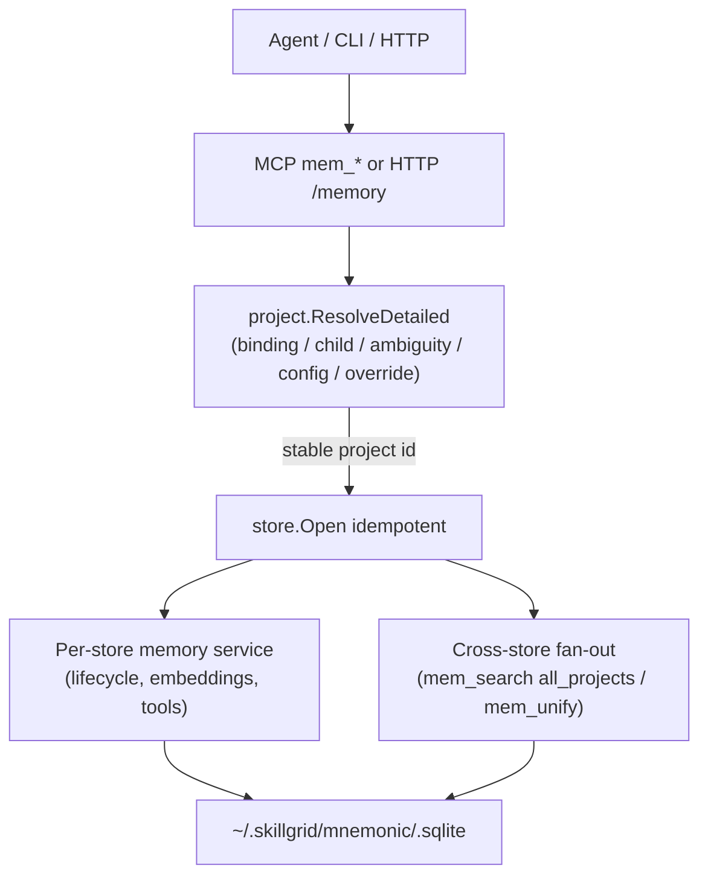

# Change: 002-mnemonic-identity-and-parity — Mnemonic Project Identity & Engram-Parity

> **STATUS:** `draft` (2026-09-04)
>
> **For agentic workers:** REQUIRED: follow `.agents/skills/_shared/conventions/sdd-structure.md`. This file is WHY + HOW (former intent + plan). Spec phase instantiates `tasks.md` + `acceptance.feature` from the Step Blueprint and per-step WHAT below.
>
> **Migration note:** Legacy intent/plan folded earlier. **2026-09-05 revise:** user-gate `questioning` (`interview.md`) reframed this change as **gap-close** — most Blueprint behaviour already lands in tree; apply closes abort semantics + proves acceptance (D1–D6).

**Goal:** Give Mnemonic a stable, clone-private project identity and Engram-parity recall (cross-store, lifecycle, optional embeddings) so memories stop scattering across invisible stores.

**Architecture:** Project resolution in `skillgrid-cli/internal/mnemonic/project` is the sole identity seam. **Gap-close:** harden abort paths (binding write fail; ambiguous parent never opens a directory-hash store) while verifying shipped cross-store / lifecycle / embedding parity. Store open stays idempotent under the canonical id; silent SeedID→canonical `MergeProjects` on bind remains.

**Tech stack:** Go (`skillgrid-cli`), SQLite (`modernc.org/sqlite`), MCP (`mcp-go`), HTTP mux with bearer-token auth on writes; optional embedder behind `MNEMONIC_EMBED`.

**Research:** `docs/plan/02-mnemonic-identity-and-parity.md` (legacy); revise grill: `interview.md`

**Ticket:** `none`

**Depends on:** none

---

## Goal

Agents and any Mnemonic consumer get a stable, repo-bound project identity and Engram-parity recall (cross-store merge, pin/expiry/recency, optional vector fusion) so memories survive move/rename/remote-change and no longer strand across invisible SQLite files.

## Out of scope / Non-Goals

- Cloud sync (Engram `sync_*`) — keep Mnemonic local-first; revisit once identity is stable
- Rewriting the code index or web research cache (both already exceed Engram)
- Changing FTS5 to another search engine
- Expanding surface area beyond the four Step Blueprint capabilities below

## Definition of Done

This change is done only when **all** of the following are true:

- [ ] From a multi-repo parent cwd (e.g. `/data/git/AI`) the resolver surfaces `AvailableProjects` (not a blind `directory-hash` id such as `ai-ba52c523`)
- [ ] Resolving from a repo checkout after `git remote set-url origin X` and after copying the checkout to a sibling path yields the identical store id
- [ ] A linked worktree of the same clone resolves to the same store id as the main checkout
- [ ] Fragmented stores (e.g. `kubedash-skillgrid-test` and a prior dir-hash store) link via `project_aliases` so `mem_search(all_projects=true)` / `mem_unify` can treat them as one logical index
- [ ] `mem_pin` / `mem_unpin`, `mem_review` honouring `expires_at`, and `tool_name` provenance behave per the new lifecycle columns
- [ ] With `MNEMONIC_EMBED=1`, `mem_search` merges FTS5 and cosine-over-embeddings via reciprocal-rank fusion; with the flag off, FTS5-only behaviour is unchanged
- [ ] Every Step Blueprint entry has a matching section in `tasks.md` with Verdict `PASS` or `PASS WITH WARNINGS`
- [ ] Every `@step-NN` Feature in `acceptance.feature` has passing `@happy`, `@edge`, and `@failure` scenarios
- [ ] Applicable threat-matrix rows have RED coverage that passed
- [ ] Testing strategy commands below are green
- [ ] Rollback path below is still valid (or N/A documented)
- [ ] Change archived under `docs/skillgrid/archive/002-mnemonic-identity-and-parity/`

---

## Problem / why

Mnemonic's project identity is path-bound, not repo-bound: memories scatter across mutually invisible SQLite stores keyed by whichever exact cwd the agent used. Move, rename, or remote-change strands prior memories with no alias. Parent directories silently fall through to a directory-hash id with no ambiguity signal. Config can bleed from ancestors. Versus Engram, Mnemonic also lacks pin/expiry/duplicate-recency lifecycle, tool provenance, and optional embedding recall. This is the dominant real failure for every Mnemonic consumer.

## Target users

- **Agent (orchestrator / worker / reviewer)** — needs reliable, stable, cross-checkout project identity and full recall at session start and during `mem_*` work
- **Any consumer of Mnemonic memory (CLI / MCP / HTTP)** — needs corrected, unified, enriched data without guessing which store file holds it
- **Urgency:** High — fragmentation and instability affect every use of the memory system

## Business rules

- Adopt Engram's proven model: clone-private identity binding, child auto-promote, bounded ambiguity, bounded config walk, seed aliases
- All new SQL is additive migrations; no destructive rewrites of existing schema
- MCP tools follow the existing `s.AddTool(toolDef, handlerFunc)` pattern
- HTTP routes follow the existing `mux.HandleFunc` pattern with bearer-token auth on writes
- The project id is the single stable key for all stores and tools; `store.Open` must remain idempotent when two cwds map to one id
- Optional embedding recall is off by default (`MNEMONIC_EMBED`); FTS5 remains the floor

## In scope

- Clone-private identity binding, child auto-promote, ambiguity with `AvailableProjects`, bounded config walk, seed aliases, `MNEMONIC_PROJECT` override
- Cross-store recall and alias unification (`mem_search(all_projects=true)`, `mem_unify`)
- Observation lifecycle parity (`pinned`, `expires_at`, `duplicate_count` / `last_seen_at`, `tool_name`)
- Optional embedding recall behind `MNEMONIC_EMBED` with reciprocal-rank fusion against FTS5

## Risks & rollback

- **Risk:** Writes into `.git/` (permission caveats on identity file) — **Mitigation:** Match Engram's documented caveats; atomic write 0600 into git common-dir; keep `store.Open` idempotent
- **Risk:** Two cwds mapping to one id collide on store open — **Mitigation:** Idempotent open; seed aliases route prior keys
- **Risk:** Large multi-part change drifts or ships incomplete — **Mitigation:** Four vertical steps; each builds on the prior; DoD criteria are UAT-measurable
- **Rollback:** All schema and API changes are additive. Remove new migrations (future DBs skip removed files via `index_meta`), new MCP tools, and new HTTP routes to revert behaviour. Existing databases that already applied migrations keep additive columns (harmless no-ops if callers stop using them). Disable embeddings by leaving `MNEMONIC_EMBED` unset.

## Error handling

| Failure | Behavior | Notes |
|---------|----------|-------|
| Ambiguous parent cwd (>1 child repo) | `abort` (return `ErrAmbiguousProject` + `AvailableProjects`) | **Hard abort for writes / store open** — never create or open a store under the directory-hash fallback ID; recover via `MNEMONIC_PROJECT` or explicit `project=` (interview D4) |
| Identity binding write fails (permissions on common-dir) | `abort` with clear error | Do **not** fall through to seed / path-hash as if binding succeeded (interview D2); remove soft seed-without-binding |
| Store open under remapped id | `warn+continue` if alias seed needed | Idempotent open; seed alias when prior store exists |
| Cross-store search with empty / missing stores | `warn+continue` | Return empty merged result, not hard failure |
| Invalid lifecycle state (bad pin id, malformed `expires_at`) | `abort` | Reject with validation error; do not corrupt row |
| Embedder unavailable while `MNEMONIC_EMBED=1` | `warn+continue` | Degrade to FTS5-only; never require embedder |
| HTTP write without bearer token | `abort` (401/403) | Existing write-auth pattern |

## Testing strategy

- **Unit:** `Run: go test ./skillgrid-cli/internal/mnemonic/project/ ./skillgrid-cli/internal/mnemonic/store/ ./skillgrid-cli/internal/mnemonic/memory/ ./skillgrid-cli/internal/mnemonic/service/` — Expected: PASS
- **Integration / acceptance:** `Run: go test ./skillgrid-cli/internal/mnemonic/mcp/ ./skillgrid-cli/internal/mnemonic/http/ ./skillgrid-cli/internal/mnemonic/integration/` plus BDD `@step-NN` scenarios once `acceptance.feature` exists — Expected: PASS (`@step-01`…`@step-04` / `@p0`)
- **Full suite:** `Run: go test ./...` (from repo root / `skillgrid-cli` per module layout) — Expected: PASS
- **Green means:** Identity UAT criteria above hold under automated tests; MCP tools `mem_pin` / `mem_unpin` / `mem_unify` / `mem_search(all_projects)` and embedding flag paths are covered; no regressions in existing `mem_*` save shape

---

## Step Blueprint

Contract for `sdd-spec`. Do not renumber after `tasks.md` exists. Per-step Out of scope / DoD live under Per-step WHAT (table is summary only).

| NN | Step slug | Goal (one line) | Primary package / entry | Depends on |
|----|-----------|-----------------|-------------------------|------------|
| 01 | `identity-binding` | Stable clone-private project id with ambiguity and bounded config | `skillgrid-cli/internal/mnemonic/project` | — |
| 02 | `cross-store-recall` | Merge recall across stores and unify aliases | `skillgrid-cli/internal/mnemonic/service` | 01 |
| 03 | `lifecycle-parity` | Honour pin, expiry, duplicate/recency, tool provenance | `skillgrid-cli/internal/mnemonic/memory` | 02 |
| 04 | `embedding-recall` | Optional vector recall fused with FTS5 behind flag | `skillgrid-cli/internal/mnemonic/memory` | 03 |

---

## Technical approach

**Gap-close (interview D1):** Most of steps 01–04 already exist under `skillgrid-cli/internal/mnemonic/`. Apply does **not** rebuild greenfield — it closes semantic gaps and records verify-shipped evidence against `acceptance.feature`.

**Step 01 deltas:** Identity binding already writes `$(git common-dir)/skillgrid-mnemonic-identity.json`. Align code to abort on bind write failure (no seed-without-binding). Ambiguous multi-repo parent already returns `AvailableProjects`; ensure write paths (`OpenForCWD`, session start, save) never open/create under the directory-hash fallback — require `MNEMONIC_PROJECT` / explicit `project=`. Keep SeedID + silent `MergeProjects` on bind (D6).

**Steps 02–04:** Verify shipped `all_projects` / `mem_unify`, lifecycle pin/expiry/`tool_name`, and `MNEMONIC_EMBED` RRF; fix only acceptance failures. FTS5 remains the floor; MCP/HTTP patterns unchanged.

## Architecture decisions

### Decision: Clone-private identity binding

**Module / Interface / Seam / Adapter / Depth:** Module = project identity; Interface = `ResolveDetailed` / stable project id; Seam = git common-dir binding file; Adapter = `identityBinding` writer/reader; Depth = one bind, every later call reuses it
**Choice:** Bind the project to its clone on first resolve; every later call reads the binding first and never re-derives from mutable git state
**Alternatives considered:** Deriving the id from mutable git remote / path hash on each call
**Rationale:** A stable, clone-private id eliminates path-bound fragmentation and silent misses across rename, move, remote change, and linked worktrees

### Decision: Child auto-promote and bounded ambiguity

**Module / Interface / Seam / Adapter / Depth:** Module = parent-cwd resolution; Interface = `AvailableProjects` + `ErrAmbiguousProject`; Seam = child-repo scan; Adapter = scan + promote; Depth = replaces opaque directory-hash fallback at parent dirs
**Choice:** Exactly one child repo auto-promotes (soft warning); more than one returns ambiguity with the candidate list; **writes hard-abort** (no store under fallback ID); `MNEMONIC_PROJECT` / explicit `project=` recover (interview D4)
**Alternatives considered:** Blind directory-hash fallback writes; read-ok/write-abort split
**Rationale:** Removes silent stranding under parent-cwd hashes; one rule for all write paths

### Decision: Gap-close posture (not greenfield rebuild)

**Module / Interface / Seam / Adapter / Depth:** Module = change delivery; Seam = `tasks.md` punch-list
**Choice:** Rewrite tasks as gap + verify-shipped evidence; implement only deltas (interview D1/D5)
**Alternatives considered:** Greenfield re-apply of every checkbox; archive-as-done + follow-up only
**Rationale:** Code already covers most Blueprint behaviour; honest apply focuses review on abort semantics and acceptance proof

### Decision: Binding write failure aborts

**Module / Interface / Seam / Adapter / Depth:** Seam = `identityBinding` write into git common-dir
**Choice:** Abort with clear error when the binding cannot be written; never pretend seed-without-binding succeeded (interview D2)
**Alternatives considered:** Soft seed fallback (current code); abort only when writable required
**Rationale:** Soft fallback recreates unstable identity under permission failures — the failure class this change exists to kill

### Decision: Silent SeedID auto-merge on bind

**Module / Interface / Seam / Adapter / Depth:** Seam = service open after identity bind; Interface = `MergeProjects` / `mem_unify`
**Choice:** Keep silent `MergeProjects(SeedID → canonical)` on first bind; keep `mem_unify` for manual repairs (interview D6)
**Alternatives considered:** Remove auto-merge; alias-only without row copy
**Rationale:** Preserves Engram-parity continuity for pre-binding stores without requiring an admin step on every clone

### Decision: Bounded config walk

**Module / Interface / Seam / Adapter / Depth:** Module = config project override; Seam = walk stop at enclosing repo root (or cwd outside git)
**Choice:** Stop walking past the enclosing repo root
**Alternatives considered:** Walking to the filesystem root
**Rationale:** Kills ancestor-bleed from a parent `.skillgrid/config.json`

### Decision: Seed aliases

**Module / Interface / Seam / Adapter / Depth:** Module = alias routing; Interface = `project_aliases`; Seam = binding create + existing store detect; Adapter = auto-`INSERT` alias→canonical
**Choice:** Auto-insert aliases when a binding is created and an existing store is present under the old key
**Alternatives considered:** No alias seeding (leave prior stores stranded)
**Rationale:** Routes prior observations to the new canonical id with zero new dispatch beyond existing `canonicalForAlias`

### Decision: Cross-store recall and alias unification

**Module / Interface / Seam / Adapter / Depth:** Module = multi-store search; Interface = `mem_search(all_projects=true)` + `mem_unify`; Seam = service fan-out over store dir
**Choice:** Search every store, merge and re-rank; admin unify folds aliases via existing migrations/aliases path
**Alternatives considered:** Per-store-only recall forever
**Rationale:** Makes fragmented stores one logical index and rescues orphaned rows

### Decision: Observation lifecycle parity

**Module / Interface / Seam / Adapter / Depth:** Module = observation ranking/lifecycle; Interface = pin/unpin/review + new columns; Seam = additive migration
**Choice:** Honour `pinned`, `expires_at`, `duplicate_count`, `last_seen_at`, and `tool_name` provenance
**Alternatives considered:** No lifecycle columns
**Rationale:** Brings recall quality in line with Engram without new transport surface beyond existing `mem_*` tools

### Decision: Optional embedding recall

**Module / Interface / Seam / Adapter / Depth:** Module = semantic recall; Interface = embedder function + RRF merge; Seam = `MNEMONIC_EMBED` flag
**Choice:** Off by default; when on, fuse FTS5 and cosine-over-embeddings via reciprocal-rank fusion
**Alternatives considered:** FTS5 only forever; always-on embeddings
**Rationale:** Adds semantic recall while keeping FTS5 the floor and embedder a non-required dependency

### Decision: Identity file location

**Module / Interface / Seam / Adapter / Depth:** Seam = persistence location for binding
**Choice:** `$(git common-dir)/skillgrid-mnemonic-identity.json` (Engram parity)
**Alternatives considered:** Store-dir only under `~/.skillgrid/mnemonic/` (no `.git` writes)
**Rationale:** Survives worktrees and checkout copies the same way Engram does; accept `.git` write permission caveat

## Data flow



## File layout

```
skillgrid-cli/internal/mnemonic/
├── project/
│   ├── resolve.go              # ResolveDetailed, binding, ambiguity, bounded config
│   └── resolve_test.go         # identity / worktree / remote-change UAT
├── store/
│   ├── store.go                # Open idempotency under remapped ids
│   └── migrations/
│       └── 008_obs_lifecycle.sql
├── memory/
│   ├── lifecycle.go            # pin, expiry, duplicate/recency
│   ├── embedding.go            # MNEMONIC_EMBED gate
│   └── search_embed.go         # cosine + RRF with FTS5
├── service/
│   └── service.go              # unify, all_projects, pin/unpin facades, alias seed
├── mcp/
│   └── tools_memory.go         # mem_search all_projects, mem_pin/unpin, mem_unify
└── http/
    └── server.go               # matching routes + write auth
```

## Impacted files map

| File | Action | Step | Description |
|------|--------|------|-------------|
| `skillgrid-cli/internal/mnemonic/project/resolve.go` | Modify | 01 | Clone-private binding, child auto-promote, ambiguity, bounded config, override |
| `skillgrid-cli/internal/mnemonic/project/resolve_test.go` | Modify | 01 | UAT for bind stability, worktree, remote-change, ambiguity |
| `skillgrid-cli/internal/mnemonic/store/store.go` | Modify | 01 | Idempotent open when multiple cwds map to one id |
| `skillgrid-cli/internal/mnemonic/service/service.go` | Modify | 01 | Seed aliases on binding / prior-key detect |
| `skillgrid-cli/internal/mnemonic/service/service.go` | Modify | 02 | Cross-store search merge/re-rank; `Unify` admin path |
| `skillgrid-cli/internal/mnemonic/mcp/tools_memory.go` | Modify | 02 | `mem_search(all_projects=true)`, `mem_unify` tool contracts |
| `skillgrid-cli/internal/mnemonic/http/server.go` | Modify | 02 | HTTP surfaces for cross-store recall / unify (write auth) |
| `skillgrid-cli/internal/mnemonic/store/migrations/008_obs_lifecycle.sql` | Create | 03 | Additive lifecycle (+ shared embedding column landing as needed for 04) |
| `skillgrid-cli/internal/mnemonic/memory/lifecycle.go` | Modify | 03 | Pin/unpin, expiry soft-exclude, duplicate/recency updates |
| `skillgrid-cli/internal/mnemonic/service/service.go` | Modify | 03 | Pin/unpin/TTL facades; `tool_name` on save path |
| `skillgrid-cli/internal/mnemonic/mcp/tools_memory.go` | Modify | 03 | `mem_pin` / `mem_unpin`; review/expiry behaviour |
| `skillgrid-cli/internal/mnemonic/http/server.go` | Modify | 03 | Lifecycle-related routes if exposed over HTTP |
| `skillgrid-cli/internal/mnemonic/memory/embedding.go` | Modify | 04 | Embedder gate (`MNEMONIC_EMBED` / endpoint) |
| `skillgrid-cli/internal/mnemonic/memory/search_embed.go` | Modify | 04 | Cosine + reciprocal-rank fusion with FTS5 |
| `skillgrid-cli/internal/mnemonic/mcp/tools_memory.go` | Modify | 04 | `mem_search` fusion when embeddings present |
| `docs/skillgrid/agents/glossary/business.md` | Modify | 01 | Domain terms for identity / recall capabilities |
| `docs/skillgrid/agents/glossary/technical.md` | Modify | 01 | Technical terms for resolution / RRF / aliases |

## Per-step WHAT

Observable behavior each step must deliver (feeds Gherkin). Not implementation HOW.

### Step 01 — `identity-binding`

**Goal:** Establish clone-private identity binding, child auto-promote, ambiguity, bounded config walk, and seed aliases
**Out of scope:** Cross-store merge UX, lifecycle columns, embeddings
**Definition of Done:** Parent cwd ambiguity surfaces candidates; same clone yields one id across remote-change, sibling copy, and worktree; prior keys alias to canonical

- The resolver binds the project to its clone and never re-derives the id from mutable git state after binding
- Exactly one child repo auto-promotes with a soft warning; more than one returns ambiguity with `AvailableProjects`
- Binding write failure aborts (no seed-without-binding); ambiguous parent never opens/creates a store under the directory-hash fallback
- Config walk stops at the enclosing repo root (or cwd outside git)
- Aliases are seeded so prior directory-hash / remote keys route to the new canonical id; silent SeedID merge on bind remains
- `MNEMONIC_PROJECT` can select among ambiguous candidates
- `store.Open` remains idempotent when two cwds map to one id
- **Threat (git repository selection):** worktree vs main checkout share binding via common-dir; adversarial `git -C` / absolute vs relative cwd still resolve under the same authority rules; ambiguous parent does not write a fallback bucket

### Step 02 — `cross-store-recall`

**Goal:** Deliver cross-store recall and alias unification
**Out of scope:** New lifecycle columns, embedding fusion
**Definition of Done:** `mem_search(all_projects=true)` merges stores; `mem_unify` folds aliases idempotently; empty data returns empty result

- Recall spans every store under the Mnemonic store dir, merged and re-ranked
- Fragmented stores become one logical index via aliases / unify
- Missing data yields no result (not an error storm)
- **Threat (Mnemonic tool surface):** `all_projects` param and `mem_unify` contract deltas have RED coverage for shape/error codes

### Step 03 — `lifecycle-parity`

**Goal:** Deliver observation lifecycle parity
**Out of scope:** Embedding generation / RRF (columns may land in shared migration but behaviour is step 04)
**Definition of Done:** Pinning, expiry, duplicate count, recency, and tool provenance are honoured in context/search/review

- Pinning, expiry, duplicate count, and recency are honoured in ordering and exclusion
- Expired entries are soft-excluded / retired and no longer returned as live hits
- Invalid lifecycle state is rejected
- `tool_name` provenance is stored on save when provided
- **Threat (Mnemonic tool surface):** `mem_pin` / `mem_unpin` and review/expiry behaviour have RED coverage

### Step 04 — `embedding-recall`

**Goal:** Deliver optional embedding recall
**Out of scope:** Changing FTS5 engine; requiring a cloud embedder
**Definition of Done:** With flag on, fused results; without vectors or with flag off, FTS5-only

- Vector recall is available behind `MNEMONIC_EMBED`, fused with keyword results via reciprocal-rank fusion
- Keyword-only fallback when vectors are absent even if the flag is on
- Disabled flag yields no vector recall path (FTS5 only)
- **Threat (Mnemonic tool surface):** `mem_search` return ranking under flag on/off has RED coverage

## Threat matrix

Mark each row `Applicable` or `N/A: reason`. Applicable rows name an owning step and propagate into RED tasks + acceptance scenarios.

| Boundary / threat | Applicable? | Owning step | Planned RED coverage |
|-------------------|-------------|-------------|----------------------|
| Documentation-like paths | N/A: change does not classify or execute documentation-like paths | — | — |
| Git repository selection | Applicable | 01 | Worktree vs main share id; remote/sibling stable; multi-repo parent returns `AvailableProjects` and **does not open/create** a directory-hash store; binding write failure aborts (no seed-without-binding) |
| Commit state | N/A: no commit / index automation in this change | — | — |
| Push state | N/A: no push / refspec automation | — | — |
| PR commands | N/A: no PR command composition | — | — |
| Mnemonic tool surface (`mem_*` / `code_*` / `web_cache_*`) | Applicable | 02 | Fixture: `mem_search` with `all_projects=true` merges two seeded stores; `mem_unify` is idempotent and records alias without 500 on already-unified keys |
| Mnemonic tool surface (`mem_*` / `code_*` / `web_cache_*`) | Applicable | 03 | Fixture: `mem_pin` / `mem_unpin` reorder context; expired `expires_at` excluded; invalid pin id returns structured error (not 500) |
| Mnemonic tool surface (`mem_*` / `code_*` / `web_cache_*`) | Applicable | 04 | Fixture: `MNEMONIC_EMBED=1` with embeddings returns fused ranking; flag unset returns FTS5-only shape; missing embedder does not 500 |
| Shared-convention drift | N/A: this change does not edit `_shared/conventions/*`, issue-tracker, or agent-config shared files | — | — |

## Migration / rollout

- **Legacy supersession:** Legacy `intent.md`, `plan.md`, `*-glossary-reference.md`, and `steps/` were folded into this `change.md` plus change-level `tasks.md` + `acceptance.feature` and removed; **`change.md` is the source of truth**.
- Phased rollout by Step Blueprint order (01→04); each step builds on the prior.
- No feature flags except `MNEMONIC_EMBED` (and optional `MNEMONIC_EMBED_ENDPOINT`).
- No data rewrite beyond additive columns and alias rows; existing DBs upgrade via migrations tracked in `index_meta`.
- Identity file: create-on-first-resolve in git common-dir; seed aliases when prior store keys exist.

## Open questions

- None — closed 2026-09-05 via `interview.md` (D1–D6): gap-close; binding write abort; keep 01–04; hard abort ambiguous writes; rewrite tasks as gap+verify; keep silent SeedID auto-merge.

## Glossary

| Term | Definition | Glossary file |
|------|------------|---------------|
| **Change** | A self-contained SDD unit tracked by a 3-digit NNN number, authored as `change.md` through archive. | business |
| **Step** | A sequenced unit of an SDD change that ships one testable behaviour slice. | business |
| **Clone-Private Identity Binding** | One-time project id written into the git common-dir and reused on every later resolve for that clone (including linked worktrees). | business |
| **Child Auto-Promote** | When a cwd is the parent of exactly one git repo, resolution promotes that child as the project (with a soft warning). | business |
| **Ambiguous Project** | Resolution outcome when a cwd parents multiple git repos; callers receive `AvailableProjects` instead of a silent fallback id. | business |
| **Seed Alias** | Auto-inserted `project_aliases` row mapping a prior path/remote key to the new canonical project id. | technical |
| **Cross-Store Recall** | Searching every Mnemonic SQLite under the store dir and merging/re-ranking hits (`all_projects`). | business |
| **Observation Lifecycle** | Pinning, expiry, duplicate count, and recency columns that affect recall ordering and exclusion. | business |
| **Embedding Recall** | Optional cosine search over observation embeddings, fused with FTS5 via reciprocal-rank fusion when enabled. | technical |
| **Reciprocal Rank Fusion** | Rank merge that combines independent result lists (FTS5 + vector) without requiring calibrated scores. | technical |
| **Module** | Anything with an interface and an implementation; scale-agnostic. | technical |
| **Interface** | Everything a caller must know to use a module correctly. | technical |
| **Seam** | The location at which a module's interface lives. | technical |
| **Topic Key** | Stable string used to upsert Mnemonic observations. | technical |
| **Artifact Store Mode** | Persistence contract for SDD artifacts; `hybrid` (filesystem + Mnemonic) only. | technical |

## Author self-review

- [x] **Goal**, **Out of scope / Non-Goals**, and **Definition of Done** are filled and testable
- [x] **Error handling** and **Testing strategy** are filled
- [x] Non-goals match Global Constraints that will appear in `tasks.md`
- [x] Rollback plan is present
- [x] Step Blueprint covers a vertical-slice sequence (no horizontal-only layers)
- [x] Every Impacted Files row maps to exactly one step
- [x] Every applicable threat row names an owning step
- [x] Glossary terms reused or defined; no companion reference file
