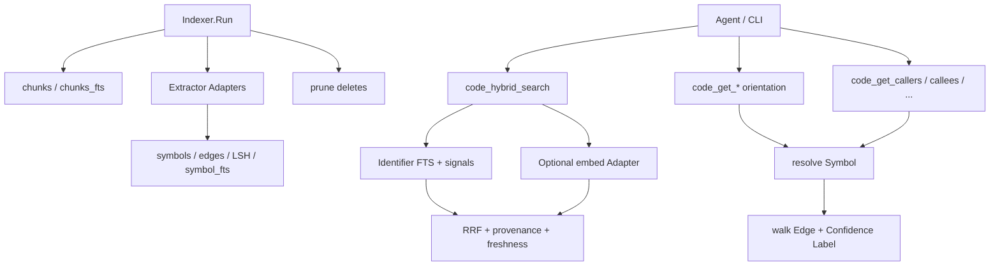

# Change: 005-mnemonic-hybrid-code-intelligence — Mnemonic Hybrid Code Intelligence (Foundation Slice)

> **STATUS:** `draft` (2026-09-04)
>
> **For agentic workers:** REQUIRED: follow `.agents/skills/_shared/conventions/sdd-structure.md`. This file is WHY + HOW (former intent + plan). Spec phase instantiates `tasks.md` + `acceptance.feature` from the Step Blueprint and per-step WHAT below.
>
> **Migration note:** Question round already satisfied by legacy `intent.md` / `plan.md` / `docs/plan/07-nmemonic-hybid-search.md` plus prior SDD approval. This `change.md` folds those answers; do not re-interview. Later plan-07 tiers (communities, git impact, 42 tools, 30+ languages) remain later Changes.

**Goal:** Turn Mnemonic's chunk-FTS code index into a foundation hybrid/graph code-intelligence slice (symbols, edges, identifier FTS, a composite `code_explore` + Tier-1/2 tools, measured coverage, offline RRF) so agents navigate and blast-radius without burning tokens on grep/read loops.

**Architecture:** Additive SQLite schema (`011_hybrid_code_intel`) plus an Extractor Module hooked into `Indexer.Run` in the same transaction as chunks. Identifier-Aware FTS and graph resolve feed a **composite `code_explore`** primary MCP tool (verbatim source + call-flow + blast-radius in one call, with guidance injected at MCP `initialize`) plus demoted Tier-1/2 `code_*` tools. Graph tools return a "where the graph stops" answer (dispatch kind + refused name-matches) when a flow can't connect; `code_status` reports **measured per-language fair coverage**; `code_impact` returns **risk-tiered blast radius** (will-break vs. likely-affected) with **symbol disambiguation** (ranked candidates, never a silent guess) and a `maxTokens` response budget. The MCP server serves the per-project store via a **lazy connection pool** (open-on-first-query, evict on inactivity) with an optional `repo` param; the extractor isolates per-grammar failures (**worker self-healing**: quarantine + fallback + continue). `skillgrid doctor` reports runtime capabilities (grammars, ONNX model, WAL state, CGo-free). Hybrid ranker fuses FTS + deterministic signals (+ optional embeddings behind a Null Adapter default) via RRF with per-signal provenance. Existing `code_status` / `code_index` / `code_search` / `code_read` stay name- and signature-stable.

**Tech stack:** Go (`skillgrid-cli`), SQLite (`modernc.org/sqlite`, CGo-free), FTS5 `unicode61`, MCP (`mcp-go`), `odvcencio/gotreesitter` (pure-Go tree-sitter runtime, 206 grammars, CGo-free); code embedder Adapter with ONNX `nomic-embed-code` default + configurable external provider.

**Research:** none (legacy intent/plan + `docs/plan/07-nmemonic-hybid-search.md`)

**Ticket:** `TASK-005`

**Depends on:** Prefer after `002-mnemonic-identity-and-parity`; orthogonal to `003-mnemonic-self-evolving-context-database` (shared embeddings OK; memory `semantic_search` must stay distinct)

---

## Goal

Coding agents and operators get queryable Symbols and Edges, Identifier-Aware FTS, orientation and call-graph tools, and offline Hybrid Search with provenance — without changing existing chunk `code_*` contracts or requiring embeddings online.

## Out of scope / Non-Goals

- Full plan-07 platform: 42 tools, git-diff analysis, `graph.sqlite.zst`, fsnotify watcher
- **Community detection (Leiden) + god nodes** — deferred to `008-mnemonic-community-knowledge-graph`
- **Docs/PDFs/configs/SQL schemas as graph nodes** — deferred to `008-mnemonic-community-knowledge-graph`
- **`code_affected` (git-diff → affected test files)** — pure edge-traversal on 005's `edges`, no new extraction; owned by `010-mnemonic-framework-routes-affected` (CodeGraph `affected` equivalent), not part of 005
- **Framework-aware routes (`route`/`navigates` edges) + fsnotify watcher + staleness banner** — owned by `010-mnemonic-framework-routes-affected`, not part of 005
- CGo tree-sitter (e.g. `tree-sitter/go-tree-sitter`); extraction uses pure-Go `odvcencio/gotreesitter`
- Replacing `chunks` / `chunks_fts` or renaming existing `code_status` / `code_index` / `code_search` / `code_read`
- Memory rewrite (Changes 002–004); cloud sync; clash with memory `semantic_search` (003) via bare plan-07 tool names
- Requiring the external embedder provider to ship (ONNX default is self-contained; external is opt-in)

## Definition of Done

This change is done only when **all** of the following are true:

- [ ] The 30 supported languages yield queryable Symbols and Edges after incremental `code_index`
- [ ] Identifier-Aware FTS finds camelCase/snake_case symbols that chunk `code_search` misses
- [ ] MCP/CLI: signature, file TOC, callers, callees, dependents (and related Tier-2 views) for a known symbol
- [ ] Hybrid Search ranks with per-signal provenance and works with embeddings off
- [ ] A composite `code_explore` is the documented primary MCP tool (source + call-flow + blast-radius in one call); menu tools demoted to unlisted-by-default with `--tool` re-enable
- [ ] `code_status` reports per-language fair coverage (measured from resolved cross-file dependents, not asserted)
- [ ] `code_path` returns a "where the graph stops" answer (dispatch kind + line + refused name-only matches) when no path exists
- [ ] `code_impact` returns risk-tiered blast radius (will-break / likely-affected by depth), each edge confidence-tagged, honoring `minConfidence`; a target matching several symbols returns a ranked candidate list (never a silent guess), narrowable by `--file`/`--uid`/`--kind`
- [ ] `code_grep <pattern>` matches a by-example structural pattern (metavariables) against the syntax tree of files under the cwd, index-free, per-language, skipping unknown files
- [ ] Indexing is target-state + orphan-prune: a deleted file / removed function prunes its symbols, edges, embeddings, and LSH buckets in one pass; no orphan rows linger
- [ ] Chunk-level embedding uses overlapping windows; the embedder honors separate `indexing_params`/`query_params`; `max_file_size` skips large files
- [ ] `code_explore` / `code_hybrid_search` / `code_semantic_search` accept a `maxTokens` response budget (deterministic estimate, truncated with `…`); the MCP server opens the store lazily and evicts on inactivity
- [ ] `skillgrid doctor` does a functional embed round-trip under both indexing and query params (dimension + non-degenerate) plus runtime capabilities (gotreesitter grammars, ONNX model present?, WAL state, CGo-free)
- [ ] Existing `code_search` name + required `query` schema unchanged; `go test ./...` passes for touched packages
- [ ] One malformed file does not fail the index run (fallback + continue)
- [ ] Every Step Blueprint entry has a matching section in `tasks.md` with Verdict `PASS` or `PASS WITH WARNINGS`
- [ ] Every `@step-NN` Feature in `acceptance.feature` has passing `@happy`, `@edge`, and `@failure` scenarios
- [ ] Applicable threat-matrix rows have RED coverage that passed
- [ ] Testing strategy commands below are green
- [ ] Rollback path below is still valid (or N/A documented)
- [ ] Change archived under `docs/skillgrid/archive/005-mnemonic-hybrid-code-intelligence/`

---

## Problem / why

Mnemonic code index is "better grep": fixed 80-line chunks + trigram FTS miss identifiers, cannot answer callers/callees, and lack hybrid ranking. Agents burn tokens on grep/read loops. Store + sync + MCP already exist; srclight / codegraph / codebase-memory-mcp show the product gap. This Change owns **code** intelligence only (not memory Changes 002–004).

## Target users

- **Coding agent** — navigate / blast-radius before edits; high urgency
- **Operator** — CLI parity for the same orientation and graph/hybrid commands

## Business rules

- First product slice only; later plan-07 tiers = later Changes
- Additive SQL; keep `code_search` / `code_index` / `code_read` / `code_status` name + signature
- CGo-free (`modernc.org/sqlite` + `odvcencio/gotreesitter`); per-project store; content-hash (+ mtime) sync
- Extraction covers the 30 most common languages via the gotreesitter grammar registry; unknown language → regex fallback + continue
- No clash with memory `semantic_search` (003); all new tools use distinct `code_*` names
- Embeddings pluggable: ONNX `nomic-embed-code` default, external provider configurable, `off` = Null Adapter
- Embedding is eager (inside `Indexer.Run`), batched + resumable; `embedding_model` column guards re-embed on model swap
- Embedding is dual-granularity: symbol-level (function/type bodies from `DefinitionSpans`, keyed to Symbol) + chunk-level (80-line windows for non-symbol code)
- Embedder down/missing → degrade to FTS + signals (FTS is the floor); never hard-fail
- Per-file extract failure → fallback + continue (never abort the whole index run)
- Every Edge carries Confidence Label: `EXTRACTED | INFERRED | AMBIGUOUS`
- A composite `code_explore` is the primary MCP tool: one call returns verbatim source grouped by file + call paths between the returned symbols (including `INFERRED` dynamic-dispatch hops) + a blast-radius summary. Narrow `code_*` tools stay available but are unlisted by default on the MCP surface (re-enabled via config, like CodeGraph's `CODEGRAPH_MCP_TOOLS`); MCP `initialize` injects guidance to "answer structural questions directly, don't re-grep"
- Graph traversal returns a "where the graph stops" answer when a flow can't connect: the dispatch kind that ended it (computed member call, interface→impl, message bus, etc.), its line, and the name-only matches refused (with their confidence) — never silent, never fabricated
- `code_status` reports **fair coverage** per language: the share of symbol-bearing files that have ≥1 resolved cross-file dependent (import/call/reference/route), computed from the `edges` table — measured, not asserted; residual is the static-analysis frontier
- `code_impact` is **pre-structured, not raw edges**: blast radius is risk-tiered by depth (`WILL BREAK` at depth 1, `LIKELY AFFECTED` deeper), every edge confidence-tagged, and `minConfidence` filters low-confidence hops. A target name matching ≥2 symbols returns a **ranked ambiguous candidate list** (not a silent pick); callers narrow with `--file` / `--uid` / `--kind`
- MCP `code_explore` / `code_hybrid_search` / `code_semantic_search` accept an optional **`maxTokens`** response budget (deterministic ~4-bytes/token estimate); when exceeded the formatted response is truncated with `…` and stays valid. Bounds the context-resident footprint without semantic pagination
- The MCP server opens the per-project store **lazily** (connection pool: open on first query, evict after inactivity, bounded concurrency) and takes an optional **`repo`** param — omitted when a single project is indexed or an MCP default/cwd resolves it
- The extractor isolates per-grammar failures: a crashing grammar/file is **quarantined** (that file → regex fallback), the pool **respawns** up to a bounded count, and a circuit breaker trips if a grammar dies repeatedly — one bad grammar never takes down the index run
- `code_grep` is a **structural search by example**: a by-example pattern with metavariables (`def \NAME(\(ARGS*)):`, `foo(\(ARGS*))`) is matched against the gotreesitter **syntax tree** (not text), so formatting/whitespace/intervening tokens don't matter. It is **index-free** (no store/embeddings required) — it walks the files under the cwd in real time, per-language AST match, unknown files skipped
- The indexer follows a **target-state model**: each index pass (symbols/edges, embeddings, LSH) *declares the target rows* it wants; the pass upserts moved rows and **deletes orphans** (rows whose source file/symbol no longer exists) — one consistency model for the whole graph, so a deleted file or removed function prunes its symbols, edges, and vectors
- Chunk-level embedding uses **overlapping windows** (an overlap of a few lines between adjacent 80-line windows) so context that falls on a chunk boundary (e.g. a function signature at a window's end) is still captured — recall for the semantic leg
- The embedder is **asymmetric-capable**: separate `indexing_params` and `query_params` (e.g. `input_type: search_document` vs `search_query`, or `prompt_name: passage` vs `query`) for models that need different treatment of corpus vs. query; output dimension is model-wide (identical both sides); a model with no asymmetric knob is left symmetric
- `skillgrid doctor` is a **functional** probe, not just a status probe: it does a real embed round-trip (embed a known string, check dimension + non-degenerate) against **both** the indexing and query params, plus gotreesitter grammars available, ONNX model present + version, WAL/journal state, CGo-free confirmation — "why is my index degraded" *and* "does the embedder actually work"
- `max_file_size` is a first-class indexer skip (default 500KB) for generated bundles / vendored blobs, independent of `exclude` globs
- Migration id `011_hybrid_code_intel.sql` — leave `009`/`010` for 001/003

## In scope

- Schema: symbols, edges, rationale nodes, symbol FTS, embeddings (symbol-level + chunk-level with overlap) / embed_meta, LSH, Index Freshness
- Extractor Interface + gotreesitter adapter (30-language grammar registry, with grammar reuse e.g. `.mts`→TS, `.cu`→C++) + regex fallback + incremental graph index hook (target-state + orphan-prune)
- `code_grep` structural search by example (index-free, gotreesitter AST pattern match with metavariables)
- Rationale extraction: `# NOTE:`/`# WHY:`/ADR-RFC citations → nodes linked to nearest symbol
- Tier-1 orientation + Tier-2 graph tools (callers/callees/dependents/implementors/hierarchy/tests) + `code_path` (shortest path + "where the graph stops") + `code_explain` (node + degree + connections)
- Composite `code_explore` MCP tool (source + call-flow + blast-radius in one call) + `initialize`-injected agent guidance; menu tools demoted to unlisted-by-default
- `code_status` fair coverage (per-language, measured from `edges`); `skillgrid doctor` (functional embed round-trip, both sides + capabilities)
- `code_impact` risk-tiered blast radius + `minConfidence` + symbol disambiguation
- `maxTokens` response budget on `code_explore` / `code_hybrid_search` / `code_semantic_search`
- MCP lazy connection pool + `repo` param; extractor worker self-healing (quarantine + respawn + circuit breaker)
- Embedder `indexing_params`/`query_params` (asymmetric retrieval) + `max_file_size` skip + chunk overlap
- Hybrid core: identifier FTS + signal subset + pluggable embeddings + RRF/v1 + `code_hybrid_search` / `code_semantic_search` / `code_embedding_status`

## Risks & rollback

- **Risk:** Scope expands into full 12-week plan-07 platform — **Mitigation:** Hard Out of Scope; four vertical steps only
- **Risk:** Clash with memory semantic search — **Mitigation:** Distinct `code_*` names; RED locks on tool surface
- **Risk:** False edges / extract quality — **Mitigation:** Confidence Labels; per-file fallback; gotreesitter `ExtractCalls`/`ExtractHeritage`/`ExtractImports` are AST-derived (not regex)
- **Risk:** gotreesitter binary size (+~20MB, 206 grammar blobs embedded) — **Mitigation:** Accepted trade for zero-CGO + 30 languages; prune grammar set to the 30 if size ever matters
- **Risk:** gotreesitter is pre-1.0 (v0.52.0) — **Mitigation:** Pin version; it is pure-Go (no CGo boundary to break); 26 importers + active release cadence
- **Risk:** ONNX `nomic-embed-code` model size (~270MB) + first-run download — **Mitigation:** Auto-download to `~/.skillgrid/models/` + cache; `off`/external providers; FTS+signals floor when model absent
- **Rollback:** Remove new migrations/tools/packages (`extract/`, `graph/`, `hybrid/`, orient/graph/hybrid MCP files); leave `files`/`chunks`/`chunks_fts` and existing `code_*` intact

## Error handling

| Failure | Behavior | Notes |
|---------|----------|-------|
| Primary language extract fails on one file | `warn+continue` | Regex fallback for that file; index run continues |
| Store open with new graph schema on existing DB | `warn+continue` | Additive migration; `files`/`chunks` intact; chunk search still works |
| Unknown / missing symbol for orient or graph query | `warn+continue` | Empty / not-found; no fabricated symbols or edges |
| Ambiguous edge resolution | `warn+continue` | Return edge with `AMBIGUOUS`; never silent drop |
| No static path for `code_path A B` | `warn+continue` | Return "where the graph stops" (dispatch kind + line + refused name-matches); never fabricate a hop |
| `code_impact` target matches several symbols | `warn+continue` | Return a ranked ambiguous candidate list; never a silent pick (narrow with `--file`/`--uid`/`--kind`) |
| `maxTokens` budget exceeded on a response | `warn+continue` | Truncate formatted response with `…`; stays valid, no fabricated truncation |
| A gotreesitter grammar crashes on a file | `warn+continue` | Quarantine the file (regex fallback), respawn the worker up to a bound; circuit breaker trips on repeated deaths of one grammar |
| `code_grep` pattern is invalid for a language | `warn+continue` | Skip files in that language with a clear note; match the rest; never a silent no-match masquerading as success |
| A file exceeds `max_file_size` | `warn+continue` | Skip it (counted in stats); not an error, not a fallback |
| Embedder produces a degenerate/dimension-mismatched vector | `warn+continue` | `skillgrid doctor` reports it; the index degrades to FTS+signals; never a silent bad vector |
| Bad / missing args on new `code_*` tools | `abort` | Clear validation error; do not invent defaults that invent hits |
| Embedder unavailable / down during hybrid or semantic | `warn+continue` | Degrade to FTS + signals; never hard-fail for missing embeddings |
| Existing `code_search` / `code_index` / `code_read` / `code_status` call | unchanged | Name + required params must not regress |

## Testing strategy

- **Unit:** `Run: go test ./skillgrid-cli/internal/mnemonic/extract/... ./skillgrid-cli/internal/mnemonic/codeindex/... ./skillgrid-cli/internal/mnemonic/store/... ./skillgrid-cli/internal/mnemonic/search/... ./skillgrid-cli/internal/mnemonic/graph/... ./skillgrid-cli/internal/mnemonic/hybrid/...` — Expected: PASS
- **Integration / acceptance:** `Run: go test ./skillgrid-cli/internal/mnemonic/mcp/... ./skillgrid-cli/internal/mnemonic/service/...` plus BDD `@step-NN` / `@p0` scenarios — Expected: PASS
- **Full suite:** `Run: go test ./...` (from `skillgrid-cli` / repo root per module layout) — Expected: PASS
- **Green means:** DoD UAT criteria hold under automated tests; new `code_*` tools (incl. composite `code_explore`, `code_impact`) registered and distinct from memory `semantic_search`; menu tools unlisted-by-default + re-enable works; `code_status` fair-coverage field present; `code_path` graph-stops covered; `code_impact` risk-tiering + disambiguation (no silent pick) + `maxTokens` valid truncation covered; MCP lazy pool + `repo` param covered; extractor quarantine/respawn/breaker covered; `skillgrid doctor` reports capabilities; existing four `code_*` tools unchanged; one-malformed-file index path covered

---

## Step Blueprint

Contract for `sdd-spec`. Do not renumber after `tasks.md` exists. Per-step Out of scope / DoD live under Per-step WHAT (table is summary only).

| NN | Step slug | Goal (one line) | Primary package / entry | Depends on |
|----|-----------|-----------------|-------------------------|------------|
| 01 | `schema-extractors` | Additive schema + Extractor Module + Go/TS/TSX + indexer graph hook | `skillgrid-cli/internal/mnemonic/extract` | — |
| 02 | `identifier-fts-orientation` | Identifier-Aware FTS + structural `code_grep` + Tier-1 orientation MCP/CLI; keep existing `code_*` stable | `skillgrid-cli/internal/mnemonic/search` | 01 |
| 03 | `call-graph-traversal` | Edge resolve + Confidence Labels + Tier-2 graph tools + graph-stops + `code_impact` (risk-tier + disambiguation) + fair coverage + composite `code_explore` + `maxTokens` + lazy pool | `skillgrid-cli/internal/mnemonic/graph` | 02 |
| 04 | `hybrid-search-core` | Offline RRF hybrid + pluggable embedders (asymmetric + overlap) + hybrid/semantic/status tools + functional `doctor` | `skillgrid-cli/internal/mnemonic/hybrid` | 03 |

---

## Technical approach

Add foundation Hybrid Search / graph atop the existing SQLite code index: additive `011_*` schema, Go + TS/TSX Extractors with regex fallback, Identifier-Aware FTS, Tier-1/2 `code_*` tools, and offline RRF (FTS + signals) with optional embeddings. Hook extract/prune into `Indexer.Run` in the same transaction so content-hash + mtime guards stay single-path. Preserve `code_status` / `code_index` / `code_search` / `code_read`. Do not contradict 002, 003 `semantic_search`, or 004.

## Architecture decisions

### Decision: Graph write Seam inside Indexer.Run

**Module / Interface / Seam / Adapter / Depth:** Seam at indexer write path
**Choice:** Hook extract/prune into `Indexer.Run` same transaction as chunks
**Alternatives considered:** Separate `graph-index` command
**Rationale:** Same hash+mtime guard; one `code_index` operator path; avoids dual-sync drift

### Decision: Extractor Module with gotreesitter adapter

**Module / Interface / Seam / Adapter / Depth:** Module + Interface + Adapter; Depth — small interfaces hide large impl
**Choice:** `Extract → FileGraph` backed by `odvcencio/gotreesitter` (pure-Go tree-sitter, 206 grammars). One adapter dispatches `grammars.DetectLanguage(path)` → parse → map node-types to Symbol/Edge via `ExtractDefinitionSpans`/`ExtractCalls`/`ExtractHeritage`/`ExtractImports` + per-language node-type tables. Covers the 30 most common languages; unknown language → regex fallback Adapter.
**Alternatives considered:** Hand-written Go (`go/parser`) + TS/TSX parsers + regex (Go/TS/TSX only); CGo `tree-sitter/go-tree-sitter` (30 langs but breaks CGo-free)
**Rationale:** gotreesitter is pure-Go (preserves the CGo-free invariant alongside `modernc.org/sqlite`), ships 206 grammars (30-language scope is config, not new parsers), and already extracts definitions/calls/heritage/imports from the AST — so step 01 is one adapter + a node-type mapping table instead of N hand-written parsers. Cost: +~20MB binary (accepted).

### Decision: Identifier-Aware FTS tokenization

**Module / Interface / Seam / Adapter / Depth:** Adapter over FTS5
**Choice:** Pre-split camelCase/snake_case into FTS5 `unicode61`
**Alternatives considered:** Custom C tokenizer
**Rationale:** Works on modernc; meets UAT without CGo

### Decision: Tool naming for code intelligence

**Module / Interface / Seam / Adapter / Depth:** Interface at MCP/CLI surface
**Choice:** All new MCP tools `code_*` (orient, graph, hybrid, semantic, embedding_status, index_status). CLI uses `skillgrid search` (hybrid default) + `skillgrid embedding-status`.
**Alternatives considered:** Plan-07 bare names (`hybrid_search`, etc.); CLI `skillgrid code search`
**Rationale:** MCP `code_*` avoids clash with 003 memory `semantic_search`. CLI `skillgrid search` is the approved operator surface — hybrid by default, `--fts`/`--semantic` to select a leg, `--json` for scripts, human-readable table (with per-signal provenance column) by default.

### Decision: Hybrid ranking and embeddings

**Module / Interface / Seam / Adapter / Depth:** Seam for embedder; Module for ranker
**Choice:** RRF of FTS + MinHash/LSH + proximity + TF-IDF + type/API + embeddings. Embedder is pluggable behind `embedder.Embedder`: **ONNX `nomic-embed-code` (768-dim) is the default**, an **external OpenAI-compatible endpoint is a configurable provider**, and `off` = Null Adapter. FTS is the floor: a down/missing embedder degrades to FTS + signals. Embedding is **eager** (runs inside `Indexer.Run`), **batched + resumable**, and guarded by an `embedding_model` column so a model swap re-embeds. Embedding is **dual-granularity**: **symbol-level** vectors (each function/type body from gotreesitter `DefinitionSpans`, keyed to its Symbol) for precise named recall, **plus chunk-level** vectors (80-line windows) for non-symbol code (module-level, comments, config). `code_semantic_search` returns symbol-named results when a hit is symbol-level.
**Alternatives considered:** Null Adapter default (embeddings off); `all-MiniLM-L6-v2` (384-dim, general-purpose); lazy embed-at-search-time; chunk-level only
**Rationale:** `nomic-embed-code` is purpose-built for code (better recall than a general model); ONNX keeps it offline and self-contained (no API key, no network at query time); external provider is an escape hatch. Symbol-level embedding fixes the split-function problem (a function spanning two 80-line chunks gets one coherent vector, not two halves) and aligns the vector index with the graph index on the same Symbol keys — so semantic hits are named ("`parseConfig` in config.go:42"), not anonymous line ranges. Chunk-level covers what symbols don't. Eager + batched + resumable bounds first-index cost; the `embedding_model` guard prevents stale-vector corruption on model swap. Provenance always required.

### Decision: Composite `code_explore` as primary MCP tool

**Module / Interface / Seam / Adapter / Depth:** Interface at MCP surface
**Choice:** One composite `code_explore` MCP tool is the documented primary: a single call returns the relevant symbols' verbatim source grouped by file, the call paths between them (including `INFERRED` dynamic-dispatch hops), and a blast-radius summary. The narrow `code_*` tools remain available but are **unlisted by default** on the MCP surface (re-enabled via config). MCP `initialize` injects guidance: "answer structural questions directly with the graph; treat returned source as already read; don't re-verify with grep."
**Alternatives considered:** A menu of equally-listed narrow `code_*` tools (original 005 plan); a CLI-only composite
**Rationale:** CodeGraph (70k★) measured that **one strong tool steers agents better than a menu** — fewer mis-picks and less context burned per session. We keep the menu for operators and for scripted/CLI use, but the agent-facing default is one composite call. This is a config + instructions change, not architecture — the narrow tools already exist from steps 02/03/04, so `code_explore` is a thin composition over them (no new extraction, no new store).

### Decision: "Where the graph stops" on dead-end flows

**Module / Interface / Seam / Adapter / Depth:** Module in graph traversal (`code_path`)
**Choice:** When `code_path A B` finds no static edge path, it returns a structured "where the graph stops" answer: the **dispatch kind** that ended it (computed member call, interface→impl, message-bus emit, reflection, dynamic property), the **line** where it ends, the literal key if the source spells one out, and the **name-only matches it refused to follow** with their confidence. A connected flow never shows it.
**Alternatives considered:** Return empty (original 005 plan: "no path → empty, not fabricated"); return the closest `AMBIGUOUS` hop only
**Rationale:** A bare "no path" is a dead-end the agent then re-derives by grep — exactly the token burn 005 exists to remove. Naming *why* the static edge ends (and what the likely candidates are) turns the dead-end into a *useful* answer and makes blast-radius honest. The data is already there (the refused `AMBIGUOUS`/name-only edges); this only formats and returns it. Cheap, high-yield.

### Decision: Pre-structured, risk-tiered `code_impact` with symbol disambiguation

**Module / Interface / Seam / Adapter / Depth:** Module in graph traversal
**Choice:** `code_impact <symbol>` returns blast radius **grouped by risk tier** — depth 1 = `WILL BREAK` (direct dependents), deeper = `LIKELY AFFECTED` — every edge confidence-tagged (`[CALLS 90%]`), with `minConfidence`, `relationTypes`, and `summaryOnly` options. When the target name matches ≥2 symbols, it returns a **ranked ambiguous candidate list** instead of guessing; the caller narrows with `--file` / `--uid` / `--kind`.
**Alternatives considered:** Return the flat edge set (the "traditional Graph RAG" approach — LLM re-derives the tiering); silently pick the first symbol match
**Rationale:** GitNexus's core thesis is **precompute at index time, not query time** — the tool returns a complete, structured answer in one call so the LLM can't miss context. Risk-tiering is the human/agent-legible form of blast radius (you care most about *what will break*). Disambiguation-first is the honest version of 005's "never fabricate" rule applied to the *hit* side: a name that resolves to several symbols is a question, not an answer. No new extraction — it formats and groups edges 003/005 already produce.

### Decision: `maxTokens` response budget + lazy MCP connection pool

**Module / Interface / Seam / Adapter / Depth:** Interface at the MCP surface
**Choice:** `code_explore` / `code_hybrid_search` / `code_semantic_search` accept an optional `maxTokens` (deterministic ~4-bytes/token estimate); the formatted response is truncated with `…` when exceeded. The MCP server opens the per-project store lazily (open on first query, evict after inactivity, bounded concurrency) and takes an optional `repo` param.
**Alternatives considered:** Unbounded verbatim responses (a dense payload stays resident in the context window — CodeGraph measured ~80% more residual context); open-every-store-at-startup (wastes memory on multi-project sessions)
**Rationale:** The composite `code_explore` is *supposed* to return dense verbatim source — which is why it's fast, and why it can bloat the window. `maxTokens` is the cheap guardrail that keeps the footprint bounded without semantic pagination. The lazy pool is the same pattern GitNexus uses to serve many repos from one MCP process (lazy open, evict-after-idle, max-N concurrent); it's what makes "one server, many projects" cheap. Both are transport-level, no schema change.

### Decision: Extractor worker self-healing + `skillgrid doctor`

**Module / Interface / Seam / Adapter / Depth:** Seam at the extraction pool; CLI probe
**Choice:** The 30-language gotreesitter extraction isolates per-grammar failures: a crashing grammar/file is **quarantined** (that file → regex fallback), the worker **respawns** up to a bounded count per slot, and a **circuit breaker** trips if a grammar dies repeatedly — so one bad grammar degrades its own files, never the index run. `skillgrid doctor` is a read-only capability probe (grammars present, ONNX model + version, WAL/journal state, CGo-free confirm, embedder status).
**Alternatives considered:** Fail the whole run on a grammar crash (the pre-1.0 gotreesitter will hit this on some file); no diagnostic command (operator has no way to know why the index degraded)
**Rationale:** gotreesitter embeds 206 grammar blobs; a pathological file *will* trip some grammar. Pool-level isolation (quarantine + respawn + breaker) is the robustness upgrade to 005's existing per-file fallback — it bounds the blast radius of a bad grammar to that grammar's files. `skillgrid doctor` answers "why is my index degraded" (missing ONNX model? WAL in rollback mode? a grammar unavailable?) in one command — the operational counterpart to `code_status`'s fair coverage.

### Decision: `code_grep` — structural search by example

**Module / Interface / Seam / Adapter / Depth:** Tier-1 tool over the gotreesitter AST
**Choice:** `code_grep <pattern> [path]` matches a by-example pattern with metavariables (`\NAME` = one node, `\(ARGS*)` = a run of siblings, `\_`/`\*` = anonymous) against the **syntax tree** of files under the cwd, per-language. **Index-free** — no store or embeddings; it walks and matches in real time, skipping unknown files.
**Alternatives considered:** Text/regex grep (breaks on formatting/whitespace/intervening tokens); require the index (forces a cold index before a simple "find every `def foo`")
**Rationale:** This is CocoIndex's `ccc grep` — the one *new capability* (not a pipeline detail) from the four repos compared, and it fills a real gap between `code_search` (FTS/semantic, needs the index) and raw `rg` (text). It's cheap because 005 already parses every supported language with gotreesitter — a structural pattern match is a re-read of the same AST. Index-free means it works before/without an index and is perfect for "find the shape of code" (every function def, every `foo(...)` call) without burning the embedding pipeline.

### Decision: Target-state indexing with orphan-prune

**Module / Interface / Seam / Adapter / Depth:** Seam at `Indexer.Run`
**Choice:** Each index pass (symbols/edges, embeddings, LSH) **declares its target rows**; the pass upserts moved rows and **deletes orphans** (rows whose source file/symbol no longer exists). One consistency model for the whole graph.
**Alternatives considered:** Hash+mtime incremental only (leaves orphans — a deleted file's symbols/edges/vectors linger until a full rebuild); per-table ad-hoc cleanup (drift between tables)
**Rationale:** CocoIndex's core is `target_state = transformation(source_state)` — declare what you want, the engine diffs and applies only the delta, deleting orphans. Adopting it makes the symbol/edge/embedding/LSH tables share one consistency model, so removing a file or a function prunes its *entire* footprint (nodes + edges + vectors + buckets) in one pass, not four ad-hoc cleanups. It's the correctness upgrade to 005's existing hash+mtime guard — same single-transaction path, now also *deletes* what should be gone.

### Decision: Asymmetric embedder + functional doctor

**Module / Interface / Seam / Adapter / Depth:** Embedder config + doctor probe
**Choice:** The embedder takes separate `indexing_params` and `query_params` (e.g. `input_type: search_document`/`search_query`, `prompt_name: passage`/`query`); output dimension is model-wide. `skillgrid doctor` does a **functional** round-trip — embed a known string under *both* param sets, check dimension + non-degenerate — plus capability checks.
**Alternatives considered:** A single symmetric param for both sides (quietly wrong for asymmetric models — recall degrades and nobody notices); a status-only doctor (the model file exists but the embed call is misconfigured)
**Rationale:** Many retrieval models (Cohere v3, Voyage, nomic-embed-code via `CodeRankEmbed`, SentenceTransformers with `prompt_name`) want the *corpus* and the *query* embedded differently. A single param silently uses the wrong one on one side, degrading recall with no error. Separate sides make the config explicit, and a *functional* doctor (run the model on both sides) is the difference between "the 270MB ONNX file exists" and "the embedder produces a valid 768-dim vector under the configured params." Pairs with the chunk-overlap + `embedding_model` guard already in 005.

### Decision: Migration number

**Module / Interface / Seam / Adapter / Depth:** Store migration Seam
**Choice:** `011_hybrid_code_intel.sql`
**Alternatives considered:** Take `009`
**Rationale:** Leave `009`/`010` for Changes 001/003

## Data flow



## File layout

```
skillgrid-cli/internal/mnemonic/
├── store/migrations/011_hybrid_code_intel.sql   # symbols, edges, FTS, embed, LSH, freshness
├── extract/                                     # Extractor Interface + gotreesitter adapter + 30-lang node maps + fallback
├── codeindex/indexer.go                         # same-tx graph extract/prune hook
├── extract/pool.go                              # worker self-healing (quarantine + respawn + breaker)
├── search/symbol_fts.go                         # Identifier-Aware FTS
├── search/structural.go                         # code_grep by-example AST pattern match (index-free)
├── graph/resolve.go                             # Edge resolve + Confidence Label + "where the graph stops"
├── graph/coverage.go                            # Fair coverage (per-language, from edges)
├── graph/impact.go                              # Risk-tiered blast radius + disambiguation
├── hybrid/rank.go                               # signals + RRF + provenance
├── embedder/                                    # code-unit Adapter (Null default)
├── mcp/pool.go                                  # Lazy per-project store pool + repo param
├── mcp/tools_code_{orient,graph,hybrid}.go      # Tier-1/2 + hybrid tools (+ maxTokens)
├── mcp/tools_code_explore.go                    # Composite primary MCP tool + initialize guidance + maxTokens
└── cmd/skillgrid/doctor.go                      # skillgrid doctor capability probe
```

## Impacted files map

| File | Action | Step | Description |
|------|--------|------|-------------|
| `skillgrid-cli/internal/mnemonic/store/migrations/011_hybrid_code_intel.sql` | Create | 01 | symbols, edges, rationale, symbol_fts, embeddings, embed_meta, lsh_buckets, index_freshness |
| `skillgrid-cli/internal/mnemonic/extract/extract.go` | Create | 01 | Extractor Interface + registry + language list (30) |
| `skillgrid-cli/internal/mnemonic/extract/treesitter.go` | Create | 01 | gotreesitter adapter: DetectLanguage → parse → Symbol/Edge via Extract* + node maps |
| `skillgrid-cli/internal/mnemonic/extract/languages.go` | Create | 01 | Per-language node-type → Symbol/Edge mapping tables (30 langs) |
| `skillgrid-cli/internal/mnemonic/extract/fallback.go` | Create | 01 | Regex fallback (unknown language) |
| `skillgrid-cli/internal/mnemonic/codeindex/indexer.go` | Modify | 01 | Graph extract/prune hook |
| `skillgrid-cli/internal/mnemonic/search/symbol_fts.go` | Create | 02 | Identifier symbol search |
| `skillgrid-cli/internal/mnemonic/extract/rationale.go` | Create | 02 | Rationale extraction (`# NOTE:`/`# WHY:`/ADR refs → nodes) |
| `skillgrid-cli/internal/mnemonic/mcp/tools_code_orient.go` | Create | 02 | Tier-1 orientation tools |
| `skillgrid-cli/internal/mnemonic/service/service.go` | Modify | 02 | Orient facade (+03–04) |
| `skillgrid-cli/cmd/skillgrid/code_intel.go` | Create | 02 | CLI orient (+03–04) |
| `skillgrid-cli/internal/mnemonic/graph/resolve.go` | Create | 03 | Edge resolve + Confidence Label + shortest-path (BFS) + explain + "where the graph stops" |
| `skillgrid-cli/internal/mnemonic/graph/coverage.go` | Create | 03 | Fair coverage per language (resolved cross-file dependents) for `code_status` |
| `skillgrid-cli/internal/mnemonic/graph/impact.go` | Create | 03 | Risk-tiered blast radius + `minConfidence` + symbol disambiguation |
| `skillgrid-cli/internal/mnemonic/mcp/tools_code_graph.go` | Create | 03 | Tier-2 graph tools incl. `code_path` (with graph-stops) + `code_explain` + `code_impact` |
| `skillgrid-cli/internal/mnemonic/mcp/tools_code_explore.go` | Create | 03 | Composite `code_explore` (source + call-flow + blast-radius) + `initialize` guidance + `maxTokens`; demote menu tools to unlisted-by-default |
| `skillgrid-cli/internal/mnemonic/mcp/pool.go` | Create | 03 | Lazy per-project store connection pool (open-on-query, evict-on-idle, bounded) + `repo` param |
| `skillgrid-cli/internal/mnemonic/extract/pool.go` | Create | 01 | Worker self-healing: quarantine + respawn + circuit breaker around gotreesitter grammars |
| `skillgrid-cli/internal/mnemonic/codeindex/indexer.go` | Modify | 01 | Target-state indexing: declare target rows per pass + upsert moved + **delete orphans** (symbols/edges/embed/LSH); `max_file_size` skip |
| `skillgrid-cli/internal/mnemonic/search/structural.go` | Create | 02 | `code_grep` by-example AST pattern match (metavariables, per-language, index-free) |
| `skillgrid-cli/internal/mnemonic/mcp/tools_code_grep.go` | Create | 02 | `code_grep` MCP tool |
| `skillgrid-cli/internal/mnemonic/hybrid/rank.go` | Create | 04 | Signals + RRF + provenance |
| `skillgrid-cli/internal/mnemonic/embedder/` | Create | 04 | Extend 003 embedder for code units: chunk overlap + `indexing_params`/`query_params` |
| `skillgrid-cli/internal/mnemonic/mcp/tools_code_hybrid.go` | Create | 04 | hybrid/semantic/embedding_status (+ `maxTokens`) |
| `skillgrid-cli/internal/mnemonic/mcp/server.go` | Modify | 04 | Register new tool sets; wire `initialize` guidance + unlisted-by-default tool list + lazy pool |
| `skillgrid-cli/cmd/skillgrid/code_intel.go` | Modify | 04 | `skillgrid search` (hybrid default) + `skillgrid search grep` + `skillgrid embedding-status` + `skillgrid doctor` CLI; coverage shown by `skillgrid index status` |
| `skillgrid-cli/cmd/skillgrid/doctor.go` | Create | 04 | `skillgrid doctor` (functional embed round-trip both sides + capabilities: grammars, ONNX, WAL, CGo-free) |
| `skillgrid-cli/cmd/skillgrid/main.go` | Modify | 04 | CLI dispatch for search / search grep / embedding-status / doctor |

## Per-step WHAT

Observable behavior each step must deliver (feeds Gherkin). Not implementation HOW.

### Step 01 — `schema-extractors`

**Goal:** Additive graph schema and a gotreesitter-backed extractor so index runs produce queryable Symbols and Edges across the 30 supported languages, under a target-state consistency model
**Out of scope:** Identifier FTS tools, `code_grep`, graph traversal tools, hybrid ranking
**Definition of Done:** Store open creates graph/FTS/embed/freshness tables without rewriting `files`/`chunks`; the 30 supported languages yield queryable Symbols/Edges; indexing is target-state + orphan-prune (a deleted file/function prunes its whole footprint); `max_file_size` skips large files; unknown language → regex fallback + continue; malformed file → fallback + continue

- After index, files in the 30 supported languages yield queryable Symbols and Edges
- Graph tables exist without rewriting files or chunks
- **Target-state + orphan-prune:** each pass declares its target rows, upserts moved rows, and **deletes orphans** — deleting a file or a function prunes its symbols, edges, embeddings, and LSH buckets in one pass; no orphan rows linger
- `max_file_size` (default 500KB) skips generated bundles / vendored blobs, counted in stats
- A file in an unsupported language uses the regex fallback and the index continues
- One malformed file uses fallback and the index continues

### Step 02 — `identifier-fts-orientation`

**Goal:** Identifier-Aware FTS, structural `code_grep`, Tier-1 orientation, and rationale extraction so agents find symbols chunk search misses, match code by structure, and see the *why* behind code
**Out of scope:** Call-graph Tier-2 tools; hybrid/semantic ranking
**Definition of Done:** Identifier FTS finds camelCase/snake_case symbols; `code_grep` matches a by-example structural pattern (index-free); orientation (signature, TOC, map, list, metadata) works; `# NOTE:`/`# WHY:`/ADR citations become rationale nodes linked to the code they explain; unknown symbol → empty/not-found; `code_search` unchanged

- Identifier search finds symbols chunk `code_search` misses
- `code_grep <pattern> [path]` matches a by-example structural pattern with metavariables (`def \NAME(\(ARGS*)):`, `foo(\(ARGS*))`) against the gotreesitter **syntax tree** — index-free (no store/embeddings), per-language, skipping unknown files; an invalid pattern for a language skips that language with a clear note
- Orientation returns signature, file TOC, map, list, and symbol metadata
- Rationale comments (`# NOTE:`/`# WHY:`/`// WHY:`/ADR-RFC refs) are extracted as nodes linked to the nearest enclosing symbol
- Unknown symbol returns empty or not-found with no fabricated symbol
- `code_search` name and query schema stay unchanged; bad orient/grep args are rejected clearly

### Step 03 — `call-graph-traversal`

**Goal:** Call-graph traversal with Confidence Labels, shortest-path + "where the graph stops", explain, risk-tiered `code_impact`, fair coverage, and the composite `code_explore` for blast-radius before edits
**Out of scope:** Hybrid RRF; embedding Adapters; community detection; changing orientation contracts from 02
**Definition of Done:** Callers, callees, dependents, implementors, hierarchy, tests-for return edges each carrying a Confidence Label; `code_path A B` returns the shortest edge path **or a "where the graph stops" answer**; `code_explain X` returns the node + all connections ranked by degree; `code_impact` returns risk-tiered blast radius + disambiguation; ambiguity → `AMBIGUOUS` not silent drop; `code_status` reports measured per-language fair coverage; a composite `code_explore` is the documented primary MCP tool with menu tools demoted; `maxTokens` bounds responses; the MCP pool is lazy + `repo`-aware

- Known symbol returns callers, callees, dependents, implementors, hierarchy, and tests-for
- `code_path A B` returns the shortest path of edges between two symbols (each hop confidence-labeled); **no path → a "where the graph stops" answer** (dispatch kind + line + refused name-only matches with confidence), not empty and not fabricated
- `code_explain X` returns the symbol, its degree, and all connections ranked by degree
- `code_impact X` returns blast radius **risk-tiered by depth** (`WILL BREAK` / `LIKELY AFFECTED`), each edge confidence-tagged, honoring `minConfidence`; a target matching ≥2 symbols returns a **ranked candidate list** (narrowable via `--file`/`--uid`/`--kind`), never a silent pick
- Every edge carries a Confidence Label
- Ambiguous resolution returns `AMBIGUOUS` edges, not silent omission
- Unknown symbol graph query invents no edges
- `code_status` reports per-language **fair coverage** (share of symbol-bearing files with ≥1 resolved cross-file dependent), measured from `edges`
- A composite `code_explore` returns verbatim source (grouped by file) + call paths between the returned symbols (including `INFERRED` hops) + a blast-radius summary in one call; MCP `initialize` injects "answer directly, don't re-grep" guidance
- `code_explore` / `code_hybrid_search` / `code_semantic_search` honor a `maxTokens` budget (truncate with `…`, stay valid); the MCP server opens the store lazily and evicts on inactivity, and accepts an optional `repo` param
- Narrow `code_*` tools are unlisted by default on the MCP surface and re-enable via config; CLI still exposes all of them

### Step 04 — `hybrid-search-core`

**Goal:** Offline hybrid code search with pluggable embeddings (asymmetric index/query), overlapping chunk windows, provenance, and a functional doctor
**Out of scope:** Communities, git impact, watcher, requiring ONNX to ship
**Definition of Done:** `code_hybrid_search` ranks with per-signal provenance embeddings-off; chunk-level embeddings use overlapping windows; embedder honors separate `indexing_params`/`query_params`; semantic/status tools available; `skillgrid doctor` does a functional embed round-trip on both sides; embedder down → degrade to FTS+signals; hybrid tool distinct from memory `semantic_search`

- Hybrid search ranks offline with per-signal FTS and signal provenance
- Chunk-level embedding uses **overlapping windows** (boundary context is captured, not lost)
- The embedder honors separate **`indexing_params`** (corpus) and **`query_params`** (query) when a model needs them; symmetric models stay symmetric
- `code_semantic_search` and `code_embedding_status` are available
- `skillgrid doctor` does a **functional embed round-trip** — embed a known string under both indexing and query params, check dimension + non-degenerate — plus capability checks (grammars, ONNX model, WAL, CGo-free)
- Down embedder degrades to FTS and signals without hard-fail
- `code_hybrid_search` is distinct from memory `semantic_search`; `code_search` unchanged; bad args rejected

## Threat matrix

Mark each row `Applicable` or `N/A: reason`. Applicable rows name an owning step and propagate into RED tasks + acceptance scenarios.

| Boundary / threat | Applicable? | Owning step | Planned RED coverage |
|-------------------|-------------|-------------|----------------------|
| Documentation-like paths | N/A: no executable-file classification or doc-path execution | — | — |
| Git repository selection | N/A: no gitRoot / `-C` / worktree authority change | — | — |
| Commit state | N/A: no commit automation | — | — |
| Push state | N/A: no push automation | — | — |
| PR commands | N/A: no PR automation | — | — |
| **Mnemonic tool surface** | Applicable — new `code_*` (incl. `code_grep`, composite `code_explore`, `code_impact`, `maxTokens`, lazy pool, functional `doctor`); four existing unchanged; must ≠ memory `semantic_search`; menu tools unlisted-by-default | 02, 03, 04 | 02: `code_search` schema stable + orient tools registered + `code_grep` registered (index-free, invalid pattern skips language) + bad args rejected; 03: `code_explore` registered as primary + menu tools unlisted-by-default (re-enable works) + `code_status` coverage field present + `code_impact` disambiguation (no silent pick) + `maxTokens` truncation valid; 04: `code_hybrid_search` registered distinct + `code_search` still stable + `skillgrid doctor` does functional embed round-trip (both sides) + bad hybrid/semantic args rejected |
| **Shared-convention drift** | N/A: no `_shared/conventions/*` edits in this Change | — | — |

## Migration / rollout

- Additive `011_hybrid_code_intel.sql`. Embeddings pluggable (ONNX `nomic-embed-code` default; external configurable; `off` = Null Adapter). No watcher / communities / documents / `graph.sqlite.zst`.
- Rollback drops new tools/packages/migration; chunk index stays.
- Default RRF weights tune in step 04; provenance always required. Embedder provider resolved from `config.d/indexing.yaml` (`mnemonic.embedder.provider`); ONNX model auto-downloads to `~/.skillgrid/models/` on first use.

## Open questions

- ~~Local embedder at apply: hash-stub vs ONNX~~ — **Resolved:** ONNX `nomic-embed-code` default; external provider configurable; `off` = Null Adapter
- Default RRF weights — tune in step 04; provenance always required

## Glossary

| Term | Definition | Glossary file |
|------|------------|---------------|
| **Hybrid Search** | Ranked fusion of FTS + deterministic signals + optional embeddings with per-signal provenance | technical |
| **Symbol** | Qualified-name graph unit (function, type, etc.) produced by an Extractor | technical |
| **Edge** | Typed symbol relation carrying a Confidence Label | technical |
| **Extractor** | Producer of a FileGraph (symbols + edges); backed by the gotreesitter adapter + per-language node maps | technical |
| **Supported Languages** | The 30 most common languages covered by the gotreesitter grammar registry (see list below) | technical |
| **Confidence Label** | `EXTRACTED \| INFERRED \| AMBIGUOUS` on every Edge | technical |
| **Index Freshness** | Path/result staleness metadata for code-intelligence results | technical |
| **Identifier-Aware FTS** | camelCase/snake_case token split into FTS5 for symbol lookup | technical |
| **Semantic Search** | Memory tool (`semantic_search`) stays distinct; code uses `code_semantic_search` | technical |
| **Embedder Provider** | Configurable source of code embeddings: `onnx` (default), `external`, or `off` | technical |
| **ONNX Embedder** | Default provider — local `nomic-embed-code` (768-dim) via pure-Go ONNX runtime, model cached in `~/.skillgrid/models/` | technical |
| **External Embedder** | Optional provider — OpenAI-compatible `/embeddings` HTTP endpoint (Ollama, OpenAI, etc.) | technical |
| **code_explore** | Composite primary MCP tool — one call returns verbatim source + call-flow (incl. `INFERRED` hops) + blast-radius summary; menu tools demoted to unlisted-by-default | technical |
| **Fair Coverage** | Per-language share of symbol-bearing files with ≥1 resolved cross-file dependent (import/call/reference/route), measured from `edges` for `code_status` | technical |
| **Where the graph stops** | `code_path` dead-end answer — the dispatch kind that ended a flow, its line, and the name-only matches refused (with confidence) | technical |
| **Risk Tier** | `code_impact` blast-radius grouping — depth 1 = `WILL BREAK`, deeper = `LIKELY AFFECTED` | technical |
| **Symbol Disambiguation** | `code_impact`/graph behavior when a target name matches ≥2 symbols — a ranked candidate list, never a silent pick (narrow via `--file`/`--uid`/`--kind`) | technical |
| **maxTokens** | Optional response budget on `code_explore`/hybrid/semantic — deterministic estimate, truncated with `…` to bound context-resident footprint | technical |
| **Worker Self-Healing** | Extractor isolation of a crashing gotreesitter grammar — quarantine + bounded respawn + circuit breaker; one bad grammar degrades its own files only | technical |
| **Structural Search (code_grep)** | By-example pattern with metavariables (`\NAME`, `\(ARGS*)`) matched against the gotreesitter **syntax tree** (not text) — index-free, per-language; formatting/whitespace/intervening tokens don't matter | technical |
| **Target-State Indexing** | Each index pass declares its target rows; the pass upserts moved rows and **deletes orphans** — one consistency model so a deleted file/function prunes its whole footprint (symbols, edges, embeddings, LSH) | technical |
| **Asymmetric Embedding** | Separate `indexing_params` (corpus) and `query_params` (query) for models that need different treatment of the two sides (e.g. `input_type: search_document`/`search_query`); dimension is model-wide | technical |
| **Chunk Overlap** | Overlapping windows in chunk-level embedding so context on a chunk boundary (e.g. a function signature at a window's end) is still captured | technical |
| **Functional Doctor** | `skillgrid doctor` runs a real embed round-trip under both indexing and query params (dimension + non-degenerate) plus capability checks — not just "the model file exists" | technical |

### Supported Languages (30)

Resolved at runtime via `grammars.DetectLanguage(path)`; the list below is the supported set (all present in the gotreesitter registry). Languages with real function-call semantics get reliable call-edges; markup/scripting languages get symbols + weaker edges.

Go, TypeScript, TSX, JavaScript, Python, Rust, Java, C, C++, C#, PHP, Ruby, Kotlin, Swift, Scala, Dart, Lua, R, MATLAB, Perl, Elixir, Haskell, Clojure, Zig, Nim, Groovy, Objective-C, Bash, SQL, HTML/CSS

<!-- Fold new terms here; also upsert docs/skillgrid/agents/glossary/{business,technical}.md. No companion *-glossary-reference.md. -->

## Author self-review

- [x] **Goal**, **Out of scope / Non-Goals**, and **Definition of Done** are filled and testable
- [x] **Error handling** and **Testing strategy** are filled
- [x] Non-goals match Global Constraints that will appear in `tasks.md`
- [x] Rollback plan is present
- [x] Step Blueprint covers a vertical-slice sequence (no horizontal-only layers)
- [x] Every Impacted Files row maps to exactly one step
- [x] Every applicable threat row names an owning step
- [x] Glossary terms reused or defined; no companion reference file
