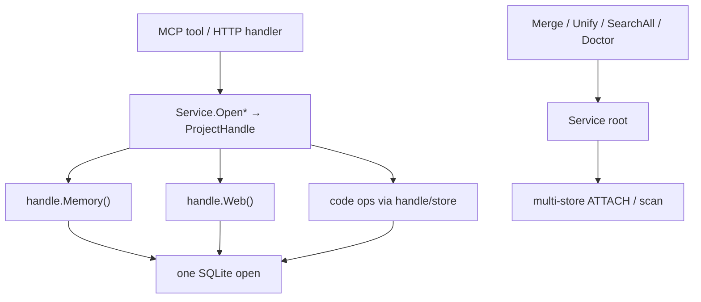

# Change: 007-mnemonic-project-handle-facade — Deepen Mnemonic Project Handle

> **STATUS:** `draft` (2026-09-05)
>
> **For agentic workers:** REQUIRED: follow `.agents/skills/_shared/conventions/sdd-structure.md`. This file is WHY + HOW (former intent + plan). Spec phase instantiates `tasks.md` + `acceptance.feature` from the Step Blueprint and per-step WHAT below.
>
> **Source:** Architecture review of `skillgrid-cli` (`/tmp/architecture-review-20260905122157.html`) — Strong candidates #1 (collapse open-delegate-close facade) and #2 (one open per MCP tool call). User: "write a change for it."

**Goal:** Make Mnemonic callers exercise one deep **Project Handle** seam (one SQLite open per request) instead of a shallow ~60-method open-delegate-close facade.

**Architecture:** Export a deep **Project Handle** module at the seam already sketched by unexported `projectHandle`; shrink `service.Service` to handle factory + cross-store ops; rewire MCP/HTTP adapters to use the handle once per call. Domain modules (`memory`, `webcache`, `codeindex`, `project`) stay behind the handle.

**Tech stack:** Go (`skillgrid-cli`), SQLite (`modernc.org/sqlite`), MCP (`mcp-go`), HTTP mux.

**Research:** none (architecture review in-session; no separate `research.md`)

**Prototype:** none

**Ticket:** none

**Depends on:** none (orthogonal to 002–006 product surfaces; touches shared facade used by all)

---

## Goal

Agents and HTTP clients talk to Mnemonic through a small deep interface: open a **Project Handle** once, then call memory / web / code on that handle — without double-opening SQLite or learning ~60 pass-through methods.

## Out of scope / Non-Goals

- Unexporting `store.Store.DB` / pulling all SQL behind the store seam (architecture review candidate #3 — separate change)
- Renaming or unifying dual `MigrateProjects` semantics (candidate #4 — separate change)
- Splitting `memory.Service` into Session / Observation / Review packages (candidate #6)
- Changing MCP tool names, HTTP route paths, or observation DTO field names
- Reworking `project.Resolve` / identity binding (owned by 002)
- New MCP tools or HTTP routes

## Definition of Done

This change is done only when **all** of the following are true:

- [ ] Exported **Project Handle** is the primary seam for single-project memory/web/code ops (callers do not need the open-delegate wrappers)
- [ ] A single MCP tool invocation performs **one** `store.Open` for its target project (not open-in-MCP then open-again-in-facade)
- [ ] HTTP handlers for single-project ops use the same handle path (one open per request)
- [ ] `service.Service` public surface for single-project ops is either removed or thin deprecated aliases that share the handle path (no second open)
- [ ] Cross-store ops (`MergeProjects`, `Unify`, `MigrateProjects` facade, `SearchObservationsAll`, `MemoryDoctor`, `ListProjects`, `CurrentProject` / resolve) remain on the root Service
- [ ] Existing MCP tool contracts and HTTP routes keep names and response shapes (adapters stay thin)
- [ ] Every Step Blueprint entry has a matching section in `tasks.md` with Verdict `PASS` or `PASS WITH WARNINGS`
- [ ] Every `@step-NN` Feature in `acceptance.feature` has passing `@happy`, `@edge`, and `@failure` scenarios
- [ ] Applicable threat-matrix rows have RED coverage that passed
- [ ] Testing strategy commands below are green
- [ ] Rollback path below is still valid (or N/A documented)
- [ ] Change archived under `docs/skillgrid/archive/007-mnemonic-project-handle-facade/`

---

## Problem / why

`service.Service` (~1230 lines, ~62 methods) is shallow: most methods are `openProject` → `defer cleanup` → one-line delegate into `memory` / `webcache` / search. MCP compounds the cost — almost every tool calls `openService()` → `OpenForCWD()` then a facade method that opens the same project again. Locality for store lifecycle is gone; leverage of the deep domain modules is lost behind a wide interface. AI navigability suffers: understanding one mem_* call means bouncing facade + MCP + domain. A `projectHandle` with `Memory()` / `Web()` / `Store()` already exists but is unexported and unused as the primary seam.

## Target users

- **Agent (MCP `mem_*` / `code_*` / `web_cache_*`)** — every tool call pays double-open today; needs a stable deep seam
- **HTTP dashboard / REST caller** — same facade path; needs matching locality
- **Maintainers / AI agents editing skillgrid-cli** — need one place to learn for single-project ops

## Business rules

- Artifact Store Mode stays **hybrid** (filesystem + Mnemonic SQLite); this change does not alter persistence mode
- MCP tool names and required params stay stable (Mnemonic tool surface contract)
- HTTP route paths and JSON field names stay stable
- Project resolution rules (CWD vs explicit `project` param) stay as today; only the open lifecycle changes
- Cross-store identity ops remain on the root Service (do not force them through a single-project handle)
- Tests must be able to inject a Service / handle without a process-global only path (reduce reliance on `SetService` as the sole seam)

## In scope

- Export **Project Handle** (rename/export `projectHandle`) with a small interface: project id, memory, web, store accessors; optional code helpers that today live as facade methods
- Root `Service` as factory: `OpenForCWD` / `OpenForDirectory` / `Open(projectID)` + cross-store ops only
- Collapse or deprecate open-delegate single-project wrappers so they do not double-open
- Rewire MCP handlers: one open → use handle → close
- Rewire HTTP single-project handlers to the same pattern
- Unit/integration tests proving single-open and handle-based calls

## Risks & rollback

- **Risk:** Call-site churn across MCP/HTTP while keeping contracts — **Mitigation:** Vertical steps; adapters change first behind stable tool/route names; keep temporary aliases if needed
- **Risk:** Accidental behavior drift on project resolution (MCP CWD vs HTTP required `project`) — **Mitigation:** Do not change resolution rules; RED tests for both adapters
- **Risk:** Leaking `*sql.DB` further via handle.Store() — **Mitigation:** Store accessor may remain for this change (SQL hide is out of scope); do not add new SQL outside existing modules
- **Rollback:** Revert the change branch. No schema migrations in this change. Behavior is in-process only; no data migration.

## Error handling

| Failure | Behavior | Notes |
|---------|----------|-------|
| Handle open fails (missing data dir, bad project id) | `abort` | Same errors as today; MCP toolError / HTTP 4xx/5xx unchanged in spirit |
| Nil Service / uninitialized handle | `abort` | Constructor invariants; prefer fail at open over per-method nil parade |
| Cross-store op with missing source store | `warn+continue` or no-op per existing Migrate/Merge semantics | Do not change identity semantics |
| MCP handler without injected Service in tests | `abort` with clear error | Prefer explicit inject over silent DefaultDataDir when tests set service |

## Testing strategy

- **Unit:** `Run: go test ./skillgrid-cli/internal/mnemonic/service/` — Expected: PASS (handle open once; wrappers do not re-open when given handle path; cross-store methods still work)
- **Integration / acceptance:** `Run: go test ./skillgrid-cli/internal/mnemonic/mcp/ ./skillgrid-cli/internal/mnemonic/http/ ./skillgrid-cli/internal/mnemonic/integration/` plus BDD `@step-NN` — Expected: PASS
- **Full suite:** `Run: go test ./...` (from `skillgrid-cli`) — Expected: PASS
- **Green means:** Single-open proven for MCP happy path; HTTP single-project path uses handle; no MCP/HTTP contract regressions; facade method count for single-project ops dropped or aliased without second open

---

## Step Blueprint

Contract for `sdd-spec`. Do not renumber after `tasks.md` exists. Per-step Out of scope / DoD live under Per-step WHAT (table is summary only).

| NN | Step slug | Goal (one line) | Primary package / entry | Depends on |
|----|-----------|-----------------|-------------------------|------------|
| 01 | `export-project-handle` | Export deep Project Handle; root Service is factory + cross-store only | `skillgrid-cli/internal/mnemonic/service` | — |
| 02 | `mcp-single-open` | MCP tools open once and call through the handle | `skillgrid-cli/internal/mnemonic/mcp` | 01 |
| 03 | `http-single-open` | HTTP single-project handlers use the same handle path | `skillgrid-cli/internal/mnemonic/http` | 01 |
| 04 | `collapse-wrappers` | Remove or neutralize double-open single-project wrappers; prove locality | `skillgrid-cli/internal/mnemonic/service` | 02, 03 |

---

## Technical approach

Promote the existing unexported `projectHandle` to the public deep seam. Callers that need single-project behavior open a handle once and use `Memory()` / `Web()` (and existing code helpers moved onto the handle or thin package funcs). MCP stops calling facade methods that re-open after `OpenForCWD`. HTTP does the same per request. After adapters migrate, delete or make wrappers delegate to an already-open path only when needed for compatibility — never open twice. Cross-store ATTACH/merge/unify/doctor stay on `Service`.

## Architecture decisions

### Decision: Project Handle is the deep single-project seam

**Module / Interface / Seam / Adapter / Depth:** Project Handle module; small interface (id + domain accessors); seam at `Service.Open*`; SQLite-backed adapter; deep
**Choice:** Export `ProjectHandle` (from today's `projectHandle`) as the primary interface for single-project ops
**Alternatives considered:** Keep widening `Service` with more methods; introduce a new package that only re-exports the same wrappers
**Rationale:** Deletion test — deleting the open-delegate wrappers concentrates complexity into the handle (desired); the handle already exists and passes Memory/Web/Store accessors

### Decision: Root Service = factory + cross-store only

**Module / Interface / Seam / Adapter / Depth:** Service module; Open*/Merge/Unify/Migrate/SearchAll/Doctor/List; multi-store seam; deep for cross-store, shallow wrappers removed
**Choice:** Shrink the external interface; single-project behavior lives on the handle
**Alternatives considered:** Keep all ~62 methods forever as the public surface; split into multiple root facades (MemoryFacade, WebFacade)
**Rationale:** Interface shrinks; leverage of domain modules returns; one place for multi-project ops

### Decision: One open per MCP/HTTP request

**Module / Interface / Seam / Adapter / Depth:** MCP/HTTP adapters; transport-only; seam at handle; real seam (two adapters)
**Choice:** Each tool/handler opens one handle (or receives an injected open path in tests), uses it, closes once
**Alternatives considered:** Long-lived process-global open for all projects; keep double-open for “simplicity”
**Rationale:** Locality for lifecycle; matches “two adapters ⇒ real seam”; eliminates hidden cost

### Decision: Defer store.DB unexport and MigrateProjects rename

**Module / Interface / Seam / Adapter / Depth:** store / identity consolidation — out of this change
**Choice:** Non-goals; follow-up changes
**Alternatives considered:** Bundle candidate #3 and #4 into this NNN
**Rationale:** YAGNI for this change’s DoD; SQL hide and dual-Migrate are separate deepening opportunities with different blast radius

## Data flow



## File layout

```
skillgrid-cli/internal/mnemonic/
├── service/
│   ├── service.go           # Service factory + cross-store; export ProjectHandle
│   └── handle.go            # optional: ProjectHandle type + accessors (split if clearer)
├── mcp/
│   ├── tools_memory.go      # single-open via handle
│   ├── tools_code.go
│   └── tools_web.go
└── http/
    └── server.go            # single-open per single-project handler
```

## Impacted files map

| File | Action | Step | Description |
|------|--------|------|-------------|
| `skillgrid-cli/internal/mnemonic/service/service.go` | Modify | 01 | Export ProjectHandle; document root vs handle interface |
| `skillgrid-cli/internal/mnemonic/service/handle.go` | Create | 01 | Optional split: handle type + accessors (if service.go stays clearer) |
| `skillgrid-cli/internal/mnemonic/service/*_test.go` | Modify | 01 | Tests for open-once handle and factory |
| `skillgrid-cli/internal/mnemonic/mcp/tools_memory.go` | Modify | 02 | Use handle; drop double-open path |
| `skillgrid-cli/internal/mnemonic/mcp/tools_code.go` | Modify | 02 | Same |
| `skillgrid-cli/internal/mnemonic/mcp/tools_web.go` | Modify | 02 | Same |
| `skillgrid-cli/internal/mnemonic/mcp/server_test.go` | Modify | 02 | Inject Service; assert single-open behavior where feasible |
| `skillgrid-cli/internal/mnemonic/http/server.go` | Modify | 03 | Single-project handlers open handle once |
| `skillgrid-cli/internal/mnemonic/http/server_test.go` | Modify | 03 | Cover handle path |
| `skillgrid-cli/internal/mnemonic/service/service.go` | Modify | 04 | Collapse/remove double-open wrappers; keep aliases only if needed without second open |
| `skillgrid-cli/internal/mnemonic/integration/integration_test.go` | Modify | 04 | Smoke that MCP+HTTP still work through deepened seam |

## Per-step WHAT

Observable behavior each step must deliver (feeds Gherkin). Not implementation HOW.

### Step 01 — `export-project-handle`

**Goal:** Callers outside `service` can open a **Project Handle** and reach memory/web without the wide wrapper surface.
**Out of scope:** MCP/HTTP rewire; deleting all wrappers yet.
**Definition of Done:** Exported handle compiles for external packages; unit tests open one store and call Memory/Web through the handle.

- OpenForCWD / OpenForDirectory / Open(projectID) return an exported handle type
- Handle exposes ProjectID, Memory, Web (and Store if still required)
- Cross-store methods remain on Service and still compile

### Step 02 — `mcp-single-open`

**Goal:** Each MCP tool call opens SQLite at most once for its target project.
**Out of scope:** HTTP; deleting unused Service wrappers.
**Definition of Done:** Memory/code/web tool handlers use the handle; RED test fails if a second open occurs on the happy path (or equivalent probe).

- `mem_*` / `code_*` / `web_cache_*` handlers call domain ops via handle
- Tool names, params, and error strings stay contract-compatible
- `SetService` / inject path still works for tests

### Step 03 — `http-single-open`

**Goal:** HTTP single-project routes match the MCP lifecycle (one open per request).
**Out of scope:** Changing auth, routes, or JSON shapes; cross-store migrate/merge routes may keep root Service calls.
**Definition of Done:** Representative single-project handlers use the handle; existing HTTP tests pass.

- Observation/session/search/code/web single-project handlers use handle
- Migrate/merge remain root Service calls
- Bearer write-auth behavior unchanged

### Step 04 — `collapse-wrappers`

**Goal:** The shallow open-delegate-close surface is gone or cannot double-open; locality restored.
**Out of scope:** store.DB unexport; MigrateProjects rename.
**Definition of Done:** Wrapper count for single-project ops is removed or documented aliases share the handle path; integration smoke green.

- No production path opens the same project twice for one logical op
- Dead aliases (`SearchAllProjects` style) removed or redirected without second open
- Integration tests for MCP + HTTP still pass

## Threat matrix

Mark each row `Applicable` or `N/A: reason`. Applicable rows name an owning step and propagate into RED tasks + acceptance scenarios.

| Boundary / threat | Applicable? | Owning step | Planned RED coverage |
|-------------------|-------------|-------------|----------------------|
| Documentation-like paths | N/A: no executable-file classification | — | — |
| Git repository selection | N/A: does not change project.Resolve / git -C behavior | — | — |
| Commit / push / PR commands | N/A: no VCS automation | — | — |
| **Mnemonic tool surface** (`mem_*` / `code_*` / `web_cache_*`) | Applicable — lifecycle and call path change; names/params must not break | 02 | RED: existing `mem_save` / `mem_search` fixture still succeeds; tool result shape unchanged; probe that store opens once per `mem_save` happy path |
| **Shared-convention drift** | N/A: no `_shared/conventions` edits | — | — |
| Store open failure / bad project id | Applicable | 01 | RED: Open with empty/invalid project id aborts; no partial handle returned |
| HTTP write without bearer token | N/A: auth middleware unchanged; covered by existing http tests | — | — |
| Double-open regression | Applicable | 04 | RED: wrapper or adapter path that previously double-opened now opens once (test hook / open counter) |

## Migration / rollout

- N/A for data: no SQL migrations.
- Rollout: ship in skillgrid-cli binary; restart MCP/HTTP processes to pick up new code.
- Temporary aliases allowed during steps 02–03; removed or neutralized in step 04.

## Open questions

- none locked for propose — follow-ups #3 (store.DB) and #4 (MigrateProjects) explicitly deferred; confirm at user gate if scope should widen before `sdd-spec`

## Glossary

| Term | Definition | Glossary file |
|------|------------|---------------|
| **Project Handle** | Opened single-project Mnemonic seam: one SQLite store plus accessors to memory/web (and related) for that project id; callers open once per request | technical |
| **Module** | Anything with an interface and an implementation (existing) | technical |
| **Seam** | Location of a module's interface; place to alter behaviour without editing there (existing) | technical |
| **Depth** | Leverage at the interface (existing) | technical |
| **Artifact Store Mode** | Persistence contract for SDD artifacts; hybrid only (existing) | technical |

## Author self-review

- [x] **Goal**, **Out of scope / Non-Goals**, and **Definition of Done** are filled and testable
- [x] **Error handling** and **Testing strategy** are filled
- [x] Non-goals match Global Constraints that will appear in `tasks.md`
- [x] Rollback plan is present
- [x] Step Blueprint covers a vertical-slice sequence (no horizontal-only layers)
- [x] Every Impacted Files row maps to exactly one step
- [x] Every applicable threat row names an owning step
- [x] Glossary terms reused or defined; no companion reference file
