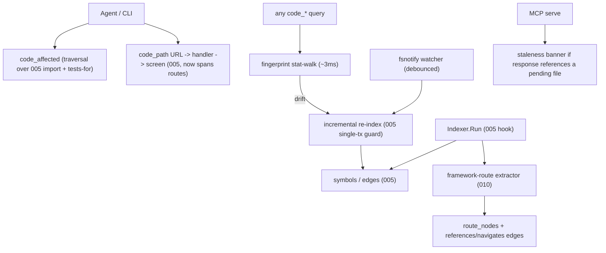

# Change: 010-mnemonic-framework-routes-affected — Mnemonic Framework Routes, `code_affected`, and Auto-Sync Watcher

> **STATUS:** `draft` (2026-09-08)
>
> **For agentic workers:** REQUIRED: follow `.agents/skills/_shared/conventions/sdd-structure.md`. This file is WHY + HOW (former intent + plan). Spec phase instantiates `tasks.md` + `acceptance.feature` from the Step Blueprint and per-step WHAT below.
>
> **Provenance:** All three capabilities are derived from the CodeGraph (`colbymchenry/codegraph`, 70k★) comparison in `docs/skillgrid/changes/005-mnemonic-hybrid-code-intelligence/` (see Mnemonic observation `sdd/005-mnemonic-hybrid-code-intelligence/codegraph-takeaways`). They were deliberately out of scope for 005 (foundation slice) and 008 (community + knowledge graph).

**Goal:** Close the highest-value gaps CodeGraph + GitNexus expose over 005/008: (1) **framework-aware routes** — emit `route` + `navigates` edges so "which URL serves this handler" and "where does tapping this go" are one graph hop; (2) **`code_affected`** — trace import deps transitively from changed files to the test files that must run; (3) **`code_rename`** — a graph-grounded write tool that splits renames into confidence buckets; (4) **auto-sync watcher** — keep the graph fresh as the agent edits via **copy-and-swap** publication + auto-reopen, with a staleness banner so the agent never gets a silent wrong answer or reads a torn index.

**Architecture:** Additive on top of 005's `symbols`/`edges` (and 008's non-code nodes where present). A third extractor layer (framework-route per language/framework) adds `route` nodes + `references`/`navigates` edges into the existing graph. `code_affected` is a pure edge-traversal query (no new extraction) over 005's import/`tests-for` edges. `code_rename` is a **write** tool grounded in the graph: it splits edits into graph-confidence (mechanical) vs. text-search (review) buckets with `dry_run`. A `fsnotify` watcher (native FSEvents/inotify/KQueue) with a debounced incremental re-index runs in the MCP serve path, publishing via **copy-and-swap** (build a sidecar, atomically publish) so readers never see a torn index; running MCP/serve processes **reopen the new index on the next tool call (~5s) with no restart**; MCP tool responses that reference a still-pending file prepend a `⚠️` staleness banner. Existing 005/008 `code_*` tools stay name- and signature-stable.

**Tech stack:** Go (`skillgrid-cli`), SQLite (`modernc.org/sqlite`, CGo-free), existing gotreesitter graph from 005, `github.com/fsnotify/fsnotify` (file watcher, CGo-free), MCP (`mcp-go`), CLI.

**Research:** CodeGraph README (framework-routes table, `codegraph affected`, auto-sync + staleness-banner section) — see 005 codegraph-takeaways observation. Graft (`trailhq/Graft`, 6.7k★) README/wiki — see 005 graft-takeaways observation: drop-rather-than-guess edge policy, pull-at-query fingerprint gate, `blast --base <ref>` PR integration.

**Prototype:** none

**Ticket:** none

**Depends on:** `005-mnemonic-hybrid-code-intelligence` (symbols/edges + import/`tests-for` extraction + indexer hook). Orthogonal to `008-mnemonic-community-knowledge-graph` (does not require it; both additive on 005).

---

## Goal

Coding agents get end-to-end flows across framework boundaries (URL → handler → handler → next screen), a one-command answer to "which tests do I run after this change?", and a graph that is never stale mid-session — without re-running an index by hand or re-grepping during the debounce window.

## Out of scope / Non-Goals

- Re-implementing 005's symbols/edges/extractors/hybrid search or 008's community/knowledge nodes — this change is additive
- Cross-language mobile bridging (Swift↔ObjC, React Native bridge, Expo Modules) — CodeGraph has it, but it's niche + heavy; only if Mnemonic targets mobile/RN
- Browser graph UI (CodeGraph `codegraph ui`) — human-facing, not agent-facing; a later `skillgrid code ui` if ever
- Telemetry / self-updating / signed-release attestation (CodeGraph product concerns) — not part of the graph
- Multi-project / cross-repo graph merge

## Definition of Done

This change is done only when **all** of the following are true:

- [ ] Supported frameworks' routing files produce `route` nodes linked by `references` edges to their handlers (callers of a view/controller surface the URL pattern)
- [ ] Supported routers produce `navigates` edges (the function that sends the user somewhere is linked to the screen it names)
- [ ] `code_affected <files...>` (and `--stdin`, `--base <ref>`) returns the test files affected by changed source, via transitive import + `tests-for` traversal, with `--depth` / `--filter` / `--json`; `--base` derives the changed set from the merge-base diff and reports affected areas with git-history owners
- [ ] `code_rename <symbol> <new_name>` (`--dry-run`) returns edits split into **graph** (high-confidence, mechanical) and **text-search** (review carefully) buckets, with `files_affected`/`total_edits` counts; `dry_run` touches nothing
- [ ] A file watcher with debounced auto-sync keeps the index current on create/modify/delete while the MCP server runs; **publication is copy-and-swap** (sidecar build → atomic publish) so a reader never sees a torn index; running MCP/serve processes **reopen the new index on the next tool call (~5s) without restart**; connect-time catch-up reconciles `(size, mtime)` + content-hash on (re)connect
- [ ] A **pull-at-query fingerprint gate** (structural-only stat-walk, ~3ms) makes every `code_*` query fresh even when the watcher is off; it never invokes the embedder leg and is keyed by the extractor stamp
- [ ] MCP tool responses that reference a still-pending file prepend a `⚠️` staleness banner naming it and saying "Read it directly"; pending files not referenced surface as a footer
- [ ] Every new edge carries a Confidence Label (`EXTRACTED | INFERRED | AMBIGUOUS`); computed/unresolvable route or navigation destinations are left unresolved, not guessed; **ambiguous references are dropped (not guessed) and excluded from blast-radius math**
- [ ] Existing 005/008 `code_*` tools are unchanged (name + required params); `go test ./...` passes for touched packages
- [ ] Every Step Blueprint entry has a matching section in `tasks.md` with Verdict `PASS` or `PASS WITH WARNINGS`
- [ ] Every `@step-NN` Feature in `acceptance.feature` has passing `@happy`, `@edge`, and `@failure` scenarios
- [ ] Applicable threat-matrix rows have RED coverage that passed
- [ ] Testing strategy commands below are green
- [ ] Rollback path below is still valid (or N/A documented)
- [ ] Change archived under `docs/skillgrid/archive/010-mnemonic-framework-routes-affected/`

## Problem / why

005 gives a call graph + hybrid search; 008 gives subsystems + docs/configs/SQL. But three high-value things are still missing, all of which CodeGraph (70k★) does well: (1) **framework routing** — static tree-sitter extraction stops at the framework boundary, so "which URL serves this handler" and "where does tapping this go" are not graph questions today; (2) **`code_affected`** — the single highest-leverage "why does the agent need this graph" demo, and it's pure edge-traversal on edges 005 already produces; (3) **auto-sync + staleness banner** — 005 has the right foundation (content-hash + mtime in the same transaction) but no watcher, so the index goes stale the moment the agent edits a file. This change delivers all three.

## Target users

- **Coding agent** — end-to-end flows across routes/navigation before edits; "which tests do I run?"; never a silent wrong answer mid-session; high urgency
- **Operator** — CLI parity for `code_affected` + a `skillgrid index status` that shows pending-sync files; CI/hook scripting via `git diff --name-only | skillgrid search affected --stdin`

## Business rules

- Additive on top of 005 (and 008 where present) — never rewrite 005/008 symbols/edges/extractors
- CGo-free: fsnotify is pure-Go (no C dependency); matches the codebase's CGo-free stance (modernc + gotreesitter + loom)
- Every new edge carries a Confidence Label: `EXTRACTED | INFERRED | AMBIGUOUS`; route/navigation edges that resolve from explicit syntax are `EXTRACTED`, convention/heuristic ones `INFERRED`, name-only guesses `AMBIGUOUS`
- Route/navigation destinations that are **computed** (not a string literal) or that **no route serves** are left unresolved — never fabricated; a markup-written link is marked `INFERRED`
- **Drop rather than guess** (Graft): an ambiguous reference (no same-file match, no explicit specifier, no unique global/owner-qualified match) is **dropped**, not `AMBIGUOUS`-kept — ambiguous edges are excluded from `code_affected` / blast-radius math so a false-positive can never inflate the radius. `AMBIGUOUS` is reserved for edges that *were* resolved but with a heuristic (e.g. markup-written `navigates`); a drop is reported as a warning, not a silent discard
- `code_affected` is a **query only** — it adds no nodes/edges; it traverses 005's import/`tests-for` edges with a depth cap (default 5) and returns paths, not invented relationships
- **`--base <ref>` PR mode** (Graft `blast --base`): `code_affected --base origin/main` derives the changed file set from the merge-base diff (no `--stdin` needed), reports the areas the change can reach (per-symbol detail collapsed under each area), and names **git-history owners** ("who to tag") for each affected area via `git blame` on the touched lines. `--quiet`/`--json` make the output a ready PR comment / CI gate
- `code_rename` is the **write counterpart** of `code_affected`: it resolves the symbol (reusing 005's disambiguation), then splits edits into **graph edits** (high-confidence: definition + typed references from the edges table) and **text-search edits** (lower-confidence: string matches the graph didn't resolve). `dry_run` (default `true`) returns the plan without writing. Every edit carries a confidence label; a rename that can't resolve the symbol returns a candidate list, never a silent pick
- Watcher is opt-out by default in `serve`/MCP path; debounce window default 2000ms (tunable, clamped [100ms, 60s]); filtered to source files only; a sandboxed env (`SKILLGRID_NO_WATCH=1`) disables it gracefully — the pull-at-query fingerprint gate still makes every query fresh (structural-only), so a disabled watcher degrades to "slightly slower but never stale"
- **The embedder stays warm** while a session is active: the ONNX runtime (005's default embedder) is loaded once and **kept in RAM** across `skillgrid search` / MCP calls rather than re-loading the ~270MB model per invocation. It **evicts on idle** (`idle_timeout`, default 10min, tunable) and is **kept alive by MCP heartbeat** while an MCP client is connected. This is the "the index is never cold" counterpart to the watcher's "never stale" — a warm embedder means the semantic leg of `code_hybrid_search` doesn't pay model-load latency on the agent's hot search loop
- **Publication is copy-and-swap:** the watcher builds the re-index into a sidecar, then atomically publishes it (rename/swap), so a concurrent reader never observes a torn index. On Windows / sidecar-unsupported filesystems it updates in place with a write-failure guard (retry if the failure was pre-write; stop if it may have mutated the live index). Running MCP/serve processes **reopen the newly-published index on their next tool call (~5s), no restart**
- Staleness banner is the specific trick: during the debounce window, any MCP response referencing a pending file names it and tells the agent to `Read` it directly — solves "silent wrong answer between an edit and the next sync"
- **Pull-at-query fingerprint gate** (Graft): every `code_*` MCP/CLI query first runs a ~3ms `(size, mtime)` stat-walk of the working tree against the last index's fingerprint; on drift it triggers a **structural-only** incremental re-index (never the LLM/embedder leg), guarded by the same writer lock as the watcher. The fsnotify watcher stays the *comfort* layer (near-zero-latency, background); the fingerprint gate is the *correctness backstop* — even with the watcher off, a query answers against the tree as it is now (uncommitted edits included). Fingerprint is keyed by the extractor stamp (a binary/version change invalidates it)
- Existing 005/008 `code_*` tools keep name + required params; all new tools use distinct `code_*` names
- Migration id `013_framework_routes.sql` — leave `011` (005) and `012` (008) as-is

## In scope

- Schema: `route_nodes` (+ `references`/`navigates` edge types; additive `013_*`)
- Framework-route extractor layer: per-language/per-framework node maps (web-framework routes → `route` node + `references` → handler; routers → `navigates` → named screen)
- `code_affected` MCP/CLI tool (transitive import + `tests-for` traversal from changed files → test files; `--stdin`, `--base <ref>` merge-base diff + affected-area grouping + git-history owners, `--depth`, `--filter`, `--json`, `--quiet`)
- `code_rename` MCP/CLI tool (graph-confidence vs. text-search edit buckets, `dry_run`, per-edit confidence)
- fsnotify auto-sync watcher (debounced incremental re-index in the serve/MCP path) with **copy-and-swap publication** + **reader auto-reopen** + connect-time `(size, mtime)` + content-hash catch-up
- **Warm embedder daemon**: keep 005's ONNX embedder in RAM while a session is active (load-once, evict-on-idle with `idle_timeout`, MCP-heartbeat keep-alive) so the semantic leg of search doesn't pay model-load latency per call
- Staleness banner on MCP tool responses that reference pending files
- `skillgrid index status` pending-sync section (names files + edit age)

## Risks & rollback

- **Risk:** Framework-route heuristics over-link (false `route`/`navigates` edges) — **Mitigation:** Confidence Labels (`EXTRACTED` only for explicit syntax, `INFERRED` for conventions, `AMBIGUOUS` for name-only); computed/unresolvable destinations left unresolved, never fabricated; per-framework validated on a canonical app each (mirroring CodeGraph's coverage table)
- **Risk:** `code_affected` traverses too deep on huge repos — **Mitigation:** depth cap (default 5, `--depth`); returns paths not a full subgraph; `--quiet` for CI
- **Risk:** `code_rename` misses or over-applies (text-search bucket catches a string that isn't the symbol) — **Mitigation:** two-bucket split (graph = high-confidence mechanical, text-search = flagged "review carefully"); `dry_run` by default; per-edit confidence; ambiguous target → candidate list, never a silent pick; the graph never invents a reference
- **Risk:** Watcher fires on generated/vendored files, re-indexing noise — **Mitigation:** filter to source files via 005's include/exclude + `.gitignore` awareness; debounce collapses edit bursts into one sync
- **Risk:** Fingerprint gate adds per-query cost — **Mitigation:** it is a shallow stat-walk (~3ms, no file reads, no LLM) that runs only when the cheap stat comparison shows drift; `SKILLGRID_NO_REFRESH=1`-style opt-out for the rare case a caller wants the on-disk index as-is (matches Graft's `--no-refresh`)
- **Risk:** Reader observes a torn index mid-reindex — **Mitigation:** copy-and-swap publication (sidecar → atomic publish) means a reader sees either the old or the new index, never a partial one; in-place fallback has a pre-write/post-write failure guard
- **Risk:** Two `serve`/MCP processes on one project fight over the index — **Mitigation:** one live writer per project (shared or single direct-mode); a second exits with a clear writer-lock error; `SKILLGRID_NO_WATCH=1` to run in-process
- **Risk:** Staleness banner noise if debounce is too long — **Mitigation:** 2000ms default (tunable, clamped); banner only names files actually referenced (footer otherwise)
- **Risk:** Warm embedder holds ~270MB RAM indefinitely — **Mitigation:** evict on `idle_timeout` (default 10min) + MCP-heartbeat keep-alive; a down/absent model just falls back to FTS+signals (005's floor); `off`/external providers don't hold RAM at all
- **Rollback:** Drop `013_*` migration + `route/` package + the `code_affected` tool + the watcher/banner in the serve path + the fingerprint gate + the warm-embedder cache; 005/008's symbols/edges/chunks/hybrid/community/knowledge stay intact

## Error handling

| Failure | Behavior | Notes |
|---------|----------|-------|
| Routing file with no recognizable pattern | `warn+continue` | No `route` node; index the rest; a framework with no routes says so, not an empty fabricated list |
| Computed / non-literal route or navigation destination | `warn+continue` | Edge left unresolved (`AMBIGUOUS` or absent), never a guessed target |
| Navigation to a path no route serves | `warn+continue` | `navigates` edge marked unresolved; not dropped silently |
| `code_affected` with no changed files / empty stdin | `warn+continue` | Empty result, clear message; not an error |
| `code_rename` target matches several / no symbols | `warn+continue` | Return a ranked candidate list (or not-found); never a silent pick; `dry_run` shows the plan |
| Watcher reindex fails after it may have mutated the live index | `warn+continue` | Stop the watcher (in-place mode); surface the failure; next `skillgrid index` heals; copy-and-swap mode keeps the old index live |
| Watcher disabled (sandboxed / `SKILLGRID_NO_WATCH=1`) | `warn+continue` | Index stays manual (`skillgrid index`); banner notes "watcher off" |
| Embedder model absent / fails to load warm | `warn+continue` | Fall back to FTS+signals (005's floor); no model-load error surfaces to the agent; next call retries load |
| Warm embedder evicted while idle, then reused | `warn+continue` | Transparent reload on next use (one-time load cost); not an error |
| Second `serve`/MCP writer on one project | `abort` (second process) | Clear writer-lock error pointing at the live writer |
| Bad / missing args on new `code_*` tools | `abort` | Clear validation error; do not invent routes or affected files |
| Existing 005/008 `code_*` tool call | unchanged | Name + required params must not regress |

## Testing strategy

- **Unit:** `Run: go test ./skillgrid-cli/internal/mnemonic/route/... ./skillgrid-cli/internal/mnemonic/codeindex/... ./skillgrid-cli/internal/mnemonic/store/... -count=1` — Expected: PASS
- **Integration / acceptance:** `Run: go test ./skillgrid-cli/internal/mnemonic/mcp/... ./skillgrid-cli/internal/mnemonic/service/...` plus BDD `@step-NN` / `@p0` scenarios — Expected: PASS
- **Full suite:** `Run: go test ./...` (from `skillgrid-cli` / repo root per module layout) — Expected: PASS
- **Green means:** route/navigates edges queryable per framework; `code_affected` returns correct test files on a fixture repo; watcher syncs on save + connect-time catch-up works; staleness banner fires for a pending referenced file; one-malformed-routing-file path covered; existing 005/008 tools unchanged

---

## Step Blueprint

Contract for `sdd-spec`. Do not renumber after `tasks.md` exists. Per-step Out of scope / DoD live under Per-step WHAT (table is summary only).

| NN | Step slug | Goal (one line) | Primary package / entry | Depends on |
|----|-----------|-----------------|-------------------------|------------|
| 01 | `framework-routes` | Additive `013_*` schema + framework-route extractor (route + references + navigates edges) | `skillgrid-cli/internal/mnemonic/route` | — (005 done) |
| 02 | `code-affected` | `code_affected` (read) + `code_rename` (write) MCP/CLI tools | `skillgrid-cli/internal/mnemonic/service` | 01 |
| 03 | `autosync-watcher` | fsnotify watcher + copy-and-swap publication + reader auto-reopen + connect-time catch-up + staleness banner + warm embedder daemon | `skillgrid-cli/internal/mnemonic/codeindex` | 02 |

---

## Technical approach

Three additive layers on top of 005's graph. Layer 1 (step 01) adds a framework-route extractor: per-language/per-framework node maps that emit `route` nodes (web-framework routing files) linked by `references` edges to handlers, and `navigates` edges for routers (the function that sends the user somewhere → the screen it names). Resolved destinations are string literals; computed/unresolvable ones stay unresolved. Layer 2 (step 02) adds `code_affected` — a pure traversal over 005's import + `tests-for` edges from a set of changed files to the test files that must run (depth-capped, `--stdin`/`--base <ref>`/`--filter`/`--json`/`--quiet`; `--base` derives the changed set from a merge-base diff and reports affected areas with git-history owners). Layer 3 (step 03) adds an fsnotify watcher in the serve/MCP path that debounces source-file create/modify/delete into incremental re-indexes, does a `(size, mtime)` + content-hash reconciliation on connect, and prepends a `⚠️` staleness banner to any MCP response that references a still-pending file; a pull-at-query fingerprint gate (stat-walk against the working tree, structural-only re-index on drift) is the correctness backstop that keeps queries fresh even with the watcher off. Preserve all 005/008 `code_*` contracts.

## Architecture decisions

### Decision: Framework routes as first-class `route`/`navigates` edges, not a separate index

**Module / Interface / Seam / Adapter / Depth:** Adapter (per-framework node maps) feeding the existing graph store
**Choice:** Route patterns become `route` nodes in the same `symbols`/`edges` tables, linked by `references` edges to handlers; routers add `navigates` edges to the named screen. Resolving is literal-destination only — computed or unserved destinations are unresolved, never guessed.
**Alternatives considered:** A separate `routes.json` (loses queryability + incrementality); regex-only route detection (misses framework conventions, false positives)
**Rationale:** Putting routes in the graph means `code_path` (005) and 008's `code_explain_community` can trace URL→handler→screen in one query, and `code_affected` (step 02) already covers the handler→tests leg. Literal-only resolution keeps the Confidence Label honest. Per-framework maps mirror CodeGraph's 17-framework table.

### Decision: `code_affected` is a traversal query, not an extractor

**Module / Interface / Seam / Adapter / Depth:** Query over the existing edges table
**Choice:** `code_affected` takes changed files (args or `--stdin`), walks 005's import edges transitively (depth cap, default 5), and emits the test files (via `tests-for` edges) that depend on the changed surface. No new nodes, no new edges — pure read.
**Alternatives considered:** Recompute the dependency graph on each call (slow, duplicates the index); store a precomputed impact matrix (memory + staleness)
**Rationale:** CodeGraph's `codegraph affected` is the single most "why do I need this graph" demo, and it's *free* on top of 005's edges — no new extraction. Depth cap + `--quiet` make it CI-safe (`git diff --name-only | skillgrid search affected --stdin`).

### Decision: `code_affected --base <ref>` — diff-anchored PR impact (Graft `blast`)

**Module / Interface / Seam / Adapter / Depth:** Query extension over the existing edges table + git
**Choice:** `code_affected --base origin/main` derives the changed file set from `git merge-base <base> HEAD` + diff (no `--stdin` plumbing), walks the same import/`tests-for` traversal, groups the result into affected **areas** (per-symbol detail collapsed under each area), and names git-history owners for each touched area via `git blame` on the changed lines. `--quiet`/`--json` shape it as a PR comment or CI-gate input.
**Alternatives considered:** `--stdin` only (forces callers to run `git diff --name-only` themselves — fine for CI, clumsy for the agent-in-PR-review case); a separate `code_blast` tool (dup surface — `blast` is just `code_affected` with a different changed-set source)
**Rationale:** Graft's `blast --base` is the integration surface that puts the graph in front of PR review — "what can this change break, and who owns it" is the question a reviewer actually asks. Reusing `code_affected`'s traversal (one code path, two changed-set sources) keeps the tool surface small; owner attribution is `git blame`, so no new graph data.

### Decision: fsnotify watcher + staleness banner for auto-sync

**Module / Interface / Seam / Adapter / Depth:** Adapter (fsnotify) + seam at the MCP serve response path
**Choice:** A native fsnotify watcher (FSEvents/inotify/KQueue, pure-Go) in the serve/MCP path captures source-file create/modify/delete, debounces (2000ms default, clamped [100ms,60s]) into incremental re-indexes, and does `(size, mtime)` + content-hash catch-up on connect. MCP tool responses that reference a still-pending file prepend a `⚠️ <file> is pending sync — Read it directly` banner; un-referenced pending files surface as a footer. **In parallel, a pull-at-query fingerprint gate** (Graft's `ensureFreshGraph`): every `code_*` query stats the working tree against the last index's fingerprint (~3ms, no file reads); on drift it runs a structural-only incremental re-index (never the embedder leg) under the same writer lock before answering. The watcher is the comfort layer (near-zero-latency background sync); the fingerprint gate is the correctness backstop — with the watcher off (`SKILLGRID_NO_WATCH=1`), queries are still fresh, just slower.
**Alternatives considered:** No watcher (manual `skillgrid index` — index goes stale mid-session); poll-based watcher (CPU + latency); full re-index per change (slow, cost grows with repo not the change)
**Rationale:** The staleness banner is the specific trick that removes the "silent wrong answer between an edit and the next sync" class of bugs — the agent gets an explicit signal and falls back to `Read`. Incremental sync (cost grows with the change, not the repo) matches 005's single-transaction hash+mtime guard. CGo-free via fsnotify. The fingerprint gate makes freshness *structural* rather than *coincidental*: a query can no longer answer from an index the tree has moved past, even in manual/watcher-off mode — Graft's whole "no stale index to babysit" claim comes from exactly this pull-at-query design.

### Decision: Drop rather than guess — ambiguous references leave the graph

**Module / Interface / Seam / Adapter / Depth:** Edge-resolution policy in the route extractor (step 01), inherited by `code_affected` (step 02)
**Choice:** A reference that cannot be resolved — no same-file match, no explicit specifier, no unique global or owner-qualified (receiver-type) match — is **dropped** at extraction, not stored as `AMBIGUOUS`. Dropped edges are reported as a warning (count + sample), never a silent discard. `AMBIGUOUS` is reserved for edges that *were* resolved via a heuristic (e.g. a markup-written `navigates` link). Downstream, `code_affected` / blast-radius math traverses only resolved edges, so a false positive can never inflate the radius.
**Alternatives considered:** Keep ambiguous edges in the graph and let queries filter them (they still pollute fan-out math and need per-query filtering discipline); guess the most-likely target (the exact failure Graft calls out — inflated blast radius)
**Rationale:** Graft's "drop rather than guess" is the single cheapest correctness lever on the whole graph: one policy at extraction time prevents a whole class of false-positive impact results at query time. It also keeps the Confidence Label honest — `EXTRACTED`/`INFERRED` mean *resolved*, `AMBIGUOUS` means *resolved heuristically*, and a missing edge means *we didn't pretend*.

### Decision: Migration number

**Module / Interface / Seam / Adapter / Depth:** Store migration Seam
**Choice:** `013_framework_routes.sql`
**Alternatives considered:** Extend `011`/`012` in place
**Rationale:** Leave `011` (005) and `012` (008) owned by their changes; 010 is additive and independently rollable

## Data flow



## File layout

```
skillgrid-cli/internal/mnemonic/
├── store/migrations/013_framework_routes.sql    # route_nodes + references/navigates edge types
├── route/extract.go                              # framework-route extractor dispatch (per framework)
├── route/frameworks.go                           # per-framework node maps (routes -> handler, routers -> navigates)
├── affected/affected.go                          # code_affected traversal (import + tests-for, depth-capped)
├── affected/rename.go                            # code_rename (graph vs text-search buckets, dry_run)
├── codeindex/watch.go                            # fsnotify watcher + debounce + connect-time catch-up
├── codeindex/fingerprint.go                      # pull-at-query stat-walk fingerprint gate (structural-only re-index on drift)
├── codeindex/publish.go                          # copy-and-swap publication + reader auto-reopen
├── embedder/warm.go                              # warm ONNX embedder cache (load-once, idle-evict, heartbeat)
├── mcp/tools_code_route.go                       # route/navigates query tools
├── mcp/tools_code_affected.go                    # code_affected + code_rename MCP tools
└── mcp/server.go                                 # wire staleness banner + warm-embedder heartbeat into response path
```

## Impacted files map

| File | Action | Step | Description |
|------|--------|------|-------------|
| `skillgrid-cli/internal/mnemonic/store/migrations/013_framework_routes.sql` | Create | 01 | `route_nodes` + `references`/`navigates` edge types |
| `skillgrid-cli/internal/mnemonic/route/extract.go` | Create | 01 | Framework-route extractor dispatch |
| `skillgrid-cli/internal/mnemonic/route/frameworks.go` | Create | 01 | Per-framework node maps (routes→handler `references`, routers→screen `navigates`) |
| `skillgrid-cli/internal/mnemonic/codeindex/indexer.go` | Modify | 01 | Hook route extraction after 005 symbol/edge extraction (same tx) |
| `skillgrid-cli/internal/mnemonic/mcp/tools_code_route.go` | Create | 01 | Route/navigates query tools |
| `skillgrid-cli/internal/mnemonic/affected/affected.go` | Create | 02 | `code_affected` traversal (import + `tests-for`, depth-capped) |
| `skillgrid-cli/internal/mnemonic/affected/rename.go` | Create | 02 | `code_rename` (graph vs text-search edit buckets, `dry_run`, per-edit confidence) |
| `skillgrid-cli/internal/mnemonic/mcp/tools_code_affected.go` | Create | 02 | `code_affected` + `code_rename` MCP tools |
| `skillgrid-cli/cmd/skillgrid/code_intel.go` | Modify | 02 | `skillgrid search affected` CLI (`--stdin`/`--depth`/`--filter`/`--json`/`--quiet`) + `skillgrid search rename` |
| `skillgrid-cli/internal/mnemonic/codeindex/watch.go` | Create | 03 | fsnotify watcher + debounce + `(size,mtime)`+hash connect-time catch-up |
| `skillgrid-cli/internal/mnemonic/codeindex/fingerprint.go` | Create | 03 | Pull-at-query stat-walk fingerprint gate (structural-only re-index on drift, extractor-stamp keyed) |
| `skillgrid-cli/internal/mnemonic/codeindex/publish.go` | Create | 03 | Copy-and-swap publication (sidecar → atomic publish) + reader auto-reopen (~5s) |
| `skillgrid-cli/internal/mnemonic/embedder/warm.go` | Create | 03 | Warm ONNX embedder cache (load-once, `idle_timeout` evict, MCP-heartbeat keep-alive) |
| `skillgrid-cli/internal/mnemonic/mcp/server.go` | Modify | 03 | Wire staleness banner + auto-reopen + warm-embedder heartbeat into response path |
| `skillgrid-cli/cmd/skillgrid/main.go` | Modify | 03 | `serve`/MCP watcher + warm-embedder wiring + `skillgrid index status` pending-sync section |
| `skillgrid-cli/go.mod` | Modify | 03 | Add `github.com/fsnotify/fsnotify` (pure-Go, no CGo) |

## Per-step WHAT

Observable behavior each step must deliver (feeds Gherkin). Not implementation HOW.

### Step 01 — `framework-routes`

**Goal:** Framework-aware routes — `route` + `references` + `navigates` edges so URL→handler and screen→screen are one graph hop
**Out of scope:** `code_affected` (step 02); watcher/banner (step 03); changing 005/008 tools
**Definition of Done:** Supported frameworks' routing files produce `route` nodes linked by `references` to handlers; supported routers produce `navigates` edges to named screens; computed/unserved destinations unresolved (not guessed); every new edge confidence-labeled; a framework with no routes reports none, not a fabricated list; 005/008 tools unchanged

- A web-framework routing file (e.g. Django `urls.py`, FastAPI `@app.get`, Express `app.get`, Gin `r.GET`, NestJS `@Controller`+`@Get`, Rails `get '/x'`, Spring `@GetMapping`) produces a `route` node with a `references` edge to its handler
- Querying callers of a view/controller surfaces the URL pattern that binds it
- A router (e.g. Next.js `router.push`/`<Link href>`, React Router `<Route path>`, Expo Router file-based, SvelteKit `goto`, Vue Router `push({name})`) produces a `navigates` edge from the sending function to the named screen
- A computed (non-literal) destination or a path no route serves is left unresolved, not fabricated; a markup-written link is `INFERRED`
- Every new edge carries a Confidence Label; one malformed routing file uses fallback and the index continues
- Existing 005/008 `code_*` tools are unchanged; bad route args are rejected clearly

### Step 02 — `code-affected`

**Goal:** `code_affected` (read) + `code_rename` (write) — "which tests do I run after this change?" and "what does renaming this symbol touch?" both grounded in the graph
**Out of scope:** Route edges (step 01); watcher/banner (step 03); recomputing the dependency graph
**Definition of Done:** `code_affected <files...>` / `--stdin` returns the test files affected by changed source, depth-capped, with `--filter`/`--json`/`--quiet`; `code_rename <symbol> <new_name>` (`--dry-run`) returns graph vs. text-search edit buckets with per-edit confidence; both reuse 005's symbol disambiguation; empty input → clear empty result; 005/008 tools unchanged

- `code_affected src/utils.ts src/api.ts` returns the test files that (transitively) import the changed symbols, via 005's import + `tests-for` edges
- `git diff --name-only | code_affected --stdin` works for CI/hooks
- `--depth` caps traversal (default 5); `--filter "e2e/*"` restricts which test files are reported; `--json` / `--quiet` for scripting
- `code_rename validateUser verifyUser` returns `files_affected` / `total_edits` split into **graph edits** (high-confidence: definition + typed references) and **text-search edits** (lower-confidence: flagged "review carefully"); `--dry-run` (default) returns the plan without writing
- A `code_rename` target matching several / no symbols returns a ranked candidate list (reuses 005 disambiguation), never a silent pick
- The `code_affected` result is paths/relationships from the existing graph — no invented edges; no changed files → empty result with a clear message, not an error
- Existing 005/008 `code_*` tools are unchanged; bad affected/rename args are rejected clearly

### Step 03 — `autosync-watcher`

**Goal:** Keep the graph fresh *and* the embedder warm as the agent edits — fsnotify auto-sync + **copy-and-swap publication** + **reader auto-reopen** + connect-time catch-up + staleness banner + **warm embedder daemon**
**Out of scope:** Route edges (step 01); `code_affected`/`code_rename` (step 02); manual full re-index (still available)
**Definition of Done:** A debounced fsnotify watcher re-indexes on source-file create/modify/delete while the MCP server runs; **publication is copy-and-swap** (sidecar build → atomic publish) so a reader never sees a torn index; running MCP/serve processes **reopen the new index on the next tool call (~5s) without restart**; connect-time `(size,mtime)` + content-hash reconciliation absorbs edits made while no server was up; MCP responses referencing a pending file prepend a `⚠️` staleness banner (naming it + "Read it directly"), un-referenced pending files as a footer; **a pull-at-query fingerprint gate makes every `code_*` query fresh even with the watcher off** (structural-only re-index on drift, never the embedder leg); **the ONNX embedder is loaded once and kept in RAM** while a session is active, evicted on `idle_timeout`, kept alive by MCP heartbeat; watcher is source-file-filtered and disable-able; a second writer exits with a clear lock error; 005/008 tools unchanged

- Saving a source file fires the watcher, debounces (default 2000ms), and incrementally re-indexes only what changed (cost grows with the change, not the repo)
- **Copy-and-swap:** the re-index is built into a sidecar and published atomically — a concurrent reader sees either the old or the new index, never a partial one. On Windows / sidecar-unsupported filesystems it updates in place with a write-failure guard (retry if pre-write; stop if it may have mutated the live index)
- **Auto-reopen:** running MCP/serve processes reopen the newly-published index on their next tool call (typically within ~5s), no restart — the agent never has to re-launch to see its own edits
- Edits made while no MCP server was running (a `git pull`, another editor) are absorbed by a `(size, mtime)` + content-hash reconciliation on (re)connect
- An MCP tool response that references a still-pending file prepends `⚠️ <file> is pending sync — Read it directly`; pending files not referenced surface as a small footer
- The watcher filters to source files (honors 005 include/exclude + `.gitignore`); bursts of edits collapse into one sync
- `SKILLGRID_NO_WATCH=1` (or a sandboxed env) disables the watcher gracefully; `skillgrid index status` shows a `### Pending sync:` section (files + edit age)
- **Fingerprint gate:** with the watcher off, a `code_*` query made after an edit still answers against the edited tree (stat-walk detects drift, structural-only re-index runs before the answer); the gate never invokes the embedder leg; the fingerprint is invalidated when the extractor stamp (indexer version) changes
- Two `serve`/MCP processes on one project: the second exits with a clear writer-lock error; CGo-free via fsnotify
- **Warm embedder:** the ONNX model is loaded once and kept in RAM across `skillgrid search` / MCP calls; after `idle_timeout` (default 10min) of no use it is evicted; an active MCP client connection keeps it alive via heartbeat. A down/absent model falls back to FTS+signals (005's floor) — no model-load latency on the agent's hot search loop
- Existing 005/008 `code_*` tools are unchanged; bad watcher/status args are rejected clearly

## Threat matrix

Mark each row `Applicable` or `N/A: reason`. Applicable rows name an owning step and propagate into RED tasks + acceptance scenarios.

| Boundary / threat | Applicable? | Owning step | Planned RED coverage |
|-------------------|-------------|-------------|----------------------|
| Documentation-like paths | N/A: routes are data edges, not executed doc paths | — | — |
| Git repository selection | N/A: no gitRoot / worktree authority change | — | — |
| Commit state | N/A: `code_affected` reads a diff, does not commit | — | — |
| Push state | N/A: no push automation | — | — |
| **PR commands** | Applicable — `code_affected` consumes a PR/diff file list (read-only) incl. `--base <ref>` merge-base diff + owner attribution; `code_rename` can write source files | 02 | `code_affected --stdin` on a fixture diff returns correct test files; `code_affected --base <ref>` on a fixture branch returns correct areas + git-history owners; empty diff → empty result; `code_rename --dry-run` touches nothing; a non-dry `code_rename` edits only the listed files (no commit/push) |
| **Mnemonic tool surface** | Applicable — new `code_affected` + `code_rename` + route tools + staleness banner; 005/008 tools unchanged | 01, 02, 03 | 01: route tools registered + 005 `code_search` schema stable + bad args rejected; 02: `code_affected` + `code_rename` registered + rename disambiguation (no silent pick) + dry_run touches nothing + 005/008 tools still stable + bad args rejected; 03: watcher doesn't alter tool schemas + banner present + bad args rejected |
| **Index freshness / concurrency** | Applicable — watcher + copy-and-swap publication + auto-reopen + connect-time catch-up + single-writer lock + pull-at-query fingerprint gate | 03 | debounce collapses bursts; copy-and-swap means a reader never sees a torn index; auto-reopen picks up a new index without restart; connect-time catch-up absorbs offline edits; second writer exits with lock error; banner fires for pending referenced file; fingerprint gate re-indexes structurally on drift with the watcher off (and never touches the embedder leg) |
| **Warm embedder lifecycle** | Applicable — load-once ONNX cache + idle-evict + MCP-heartbeat keep-alive; a down model must degrade to FTS+signals | 03 | embedder loads once and is reused across search calls (no per-call model-load); evicts after `idle_timeout`; MCP heartbeat keeps it alive while a client is connected; an absent/failed model degrades to FTS+signals (no hard-fail, no agent-visible load error) |
| **Shared-convention drift** | N/A: no `_shared/conventions/*` edits in this Change | — | — |

## Migration / rollout

- Additive `013_framework_routes.sql`. Route extraction + `code_affected` + watcher + fingerprint gate are additive on 005's single-transaction guard. No CGo (fsnotify is pure-Go). No LLM.
- Rollback drops `013_*` + `route/` + `affected/` + `codeindex/watch.go` + `codeindex/fingerprint.go` + the new tools + the serve-path banner; 005/008's graph + hybrid + community + knowledge stay.
- Route framework set + `code_affected` depth default + watcher debounce tuned in steps 01/02/03; Confidence Label always required on route/navigates edges.

## Open questions

- Which frameworks to support first in 010 (CodeGraph covers 17) — **recommend** start with the highest-traffic web frameworks (Go: Gin/chi/echo; TS: Express/Next/React Router; Python: Django/FastAPI/Flask; JS: Express) and add the rest incrementally, each validated on a canonical app
- Whether the watcher lives in the `serve`/MCP process or a separate daemon — **recommend** in-process for the common case, `SKILLGRID_NO_WATCH=1` to run manual; a shared-daemon mode is a later optimization. The **warm embedder** rides along on the same decision: it is the in-process counterpart of CocoIndex's warm daemon (load-once ONNX, idle-evict, MCP-heartbeat keep-alive) — no separate process needed while a serve/MCP session is active

## Glossary

| Term | Definition | Glossary file |
|------|------------|---------------|
| **Route Node** | A framework URL-pattern node linked by `references` edges to its handler | technical |
| **References Edge (route)** | Route→handler link from a recognized framework routing pattern | technical |
| **Navigates Edge** | Function→screen link from a recognized router navigation (literal destination only) | technical |
| **code_affected** | Query that returns the test files affected by changed source, via transitive import + `tests-for` traversal | technical |
| **code_rename** | Graph-grounded write tool — splits a rename into high-confidence graph edits + lower-confidence text-search edits, `dry_run` by default | technical |
| **Auto-Sync Watcher** | fsnotify-driven debounced incremental re-index that keeps the graph fresh while the agent edits | technical |
| **Fingerprint Gate** | Pull-at-query stat-walk of the working tree against the last index's fingerprint; on drift, a structural-only incremental re-index runs before the query answers — freshness is structural, not coincidental (Graft `ensureFreshGraph`) | technical |
| **Blast --base** | `code_affected --base <ref>` — changed set from the merge-base diff, affected-area grouping, git-history owner attribution ("who to tag") for PR review (Graft `blast --base`) | technical |
| **Copy-and-Swap Publication** | Re-index is built into a sidecar then published atomically, so a reader sees old-or-new, never a torn index | technical |
| **Reader Auto-Open** | Running MCP/serve processes reopen a newly-published index on the next tool call (~5s) without restart | technical |
| **Staleness Banner** | `⚠️` prefix on an MCP response that references a still-pending file, telling the agent to `Read` it directly | technical |
| **Connect-time Catch-up** | `(size, mtime)` + content-hash reconciliation run on (re)connect to absorb offline edits | technical |
| **Warm Embedder** | 005's ONNX model loaded once and kept in RAM while a session is active — evicted on `idle_timeout`, kept alive by MCP heartbeat — so the semantic leg of search doesn't pay model-load latency per call | technical |

<!-- Fold new terms here; also upsert docs/skillgrid/glossary/{business,technical}.md. No companion *-glossary-reference.md. -->

## Author self-review

- [x] **Goal**, **Out of scope / Non-Goals**, and **Definition of Done** are filled and testable
- [x] **Error handling** and **Testing strategy** are filled
- [x] Non-goals match Global Constraints that will appear in `tasks.md`
- [x] Rollback plan is present
- [x] Step Blueprint covers a vertical-slice sequence (no horizontal-only layers)
- [x] Every Impacted Files row maps to exactly one step
- [x] Every applicable threat row names an owning step
- [x] Glossary terms reused or defined; no companion reference file
