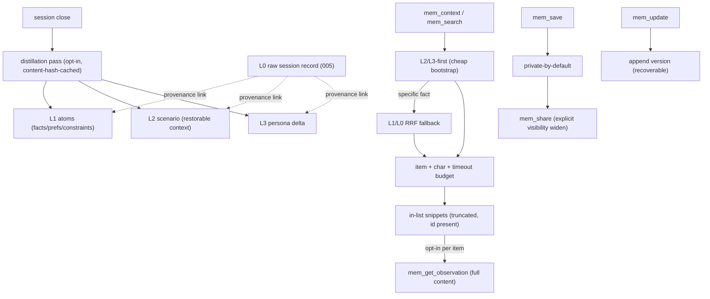

# Change: 013-mnemonic-layered-memory-governance — Mnemonic Layered Memory (L0–L3) + Retrieval Budgets + Asset Governance

> **STATUS:** `draft` (2026-09-09)
>
> **For agentic workers:** REQUIRED: follow `.agents/skills/_shared/conventions/sdd-structure.md`. This file is WHY + HOW (former intent + plan). Spec phase instantiates `tasks.md` + `acceptance.feature` from the Step Blueprint and per-step WHAT below.
>
> **Provenance:** Derived from the TencentDB Agent Memory (`TencentCloud/TencentDB-Agent-Memory`, 26.2k★) comparison — the first of the five surveyed repos (graphify, codegraph, GitNexus, Graft, codebase-index, TencentDB) that is about **memory** rather than code-indexing. See the Mnemonic observation `sdd/013-mnemonic-layered-memory-governance/tencentdb-takeaways` and the web-cache snapshot. Its CodeGraph asset is built on `colbymchenry/codegraph` (already folded into 005) and its Skill asset on Hermes (004) — the distinctive lessons here are the **memory model** (L0–L3 layering, retrieval budgets) and **asset governance** (owner / version / status / usage / visibility / private-by-default).

**Goal:** Upgrade Mnemonic's flat, unowned, unversioned, un-budgeted observation store into a **layered, governed, budgeted memory**: (1) **L0→L3 layering** — distill a session's raw record up to atoms (facts/preferences/constraints), scenarios (restorable working context), and a persona (long-term profile), with retrieval that bootstraps from L2/L3 and falls back to L1/L0; (2) **retrieval budgets** — item-count + character + timeout caps on every `mem_*` read path so memory can never overwhelm the context window; (3) **asset governance** — owner, version history, status, retrieval usage counts, and `private`/`team`/`restricted`(ACL)/`agent` visibility with **private-by-default** (sharing is an explicit action, never a leak). Existing `mem_*` tool names + required params stay stable; the store is additive.

**Architecture:** Additive `015_*` schema (layer links, persona, governance columns, version history, usage counters, visibility/ACL) on top of 005's observation store. A **distillation pass** (opt-in, session-close-triggered) refines a session's L0 record into L1 atoms / L2 scenarios / L3 persona deltas and links them; a **retrieval budget** wraps the `mem_search` / `mem_context` / `mem_timeline` read path (item cap + char budget + timeout, layered L2/L3-first then L1/L0 fallback); a **governance layer** adds owner + version history + status + usage + visibility/ACL to the store and surfaces them in the `mem_*` tools and the 009 dashboard. No change to the code index, the web cache, or the code-graph changes (008/010/011). Existing `mem_*` tools keep name + required params; new fields are additive.

**Tech stack:** Go (`skillgrid-cli`), SQLite (`modernc.org/sqlite`, CGo-free), existing `internal/mnemonic/memory` + `store` from 005, optional LLM for the distillation pass (cached by content-hash; a deterministic regex/section extractor is the no-LLM floor, reusing 005's `CapturePassive` heuristics), MCP (`mcp-go`), CLI.

**Research:** TencentDB Agent Memory README + ROADMAP + MemoryPanel API doc (L0–L3 layering, asset governance, agent loadout, control panel, retrieval budgets) — see 013 tencentdb-takeaways observation.

**Prototype:** none

**Ticket:** none

**Depends on:** `005-mnemonic-hybrid-code-intelligence` (the observation store, `mem_*` tools, `CapturePassive`, the separate L0/L1/L2 file-tiering side system). Orthogonal to 008/010/011 (code-graph) and to 009 (the dashboard **consumes** this change's governance + layer fields but does not depend on them — 009 renders what exists and shows a forward-compat placeholder for fields 013 adds).

---

## Goal

Mnemonic's memory stops being a flat pile of observations. A session's work **distills upward** — raw record → atoms → scenario → persona — so the next session bootstraps from the stable layers (L2/L3) and only falls back to the raw layers (L1/L0) for a specific fact. Every read is **budgeted** (item count + characters + timeout) so a 20-hit search can no longer return 20× full-observation JSON and drown the context window. And every memory becomes a **governed asset**: it has an owner, a version history, a status, a retrieval-usage count, and a visibility the operator controls — **private by default**, shared only by an explicit action.

## Out of scope / Non-Goals

- Code-index / graph work — 005/008/010/011 own the code graph; this change touches the **memory** store and `mem_*` surface only
- Multi-tenant **teams + role layers** (System Admin / Team Admin / Member) and the LLM **proxy** integration — TencentDB's product/scale layer; the *concepts* (visibility, ACL, loadout) are portable and landed here as single-operator-friendly fields, but the multi-tenant machinery and the base-URL LLM proxy are not
- **Agent loadout** as a first-class binding system — modeled here as the `agent` visibility + a per-agent asset view (the 009 dashboard renders it); a full Fixed-Binding + priority/usage-mode engine is a later change
- Replacing the separate L0/L1/L2 **file-tiering** side system (`tiered_contents`) — that is a document tiering for markdown; 013's L0–L3 is the **observation** distillation ladder. They coexist; 013 does not merge them
- New MCP tools beyond the additive `mem_*` fields + the new `mem_layers` / `mem_governance` query tools named below
- Skills-as-governed-assets (versions/ACL/registry) — noted for 004 / the skill registry; not this change

## Definition of Done

This change is done only when **all** of the following are true:

- [ ] A **distillation pass** refines a session's L0 record into L1 atoms + L2 scenario(s) + an L3 persona delta, each **linked** to its source (provenance), LLM-cached by content-hash with a deterministic no-LLM floor
- [ ] Retrieval is **layered**: `mem_context` / `mem_search` bootstrap from L2/L3 (cheap, stable) and fall back to L1/L0 (RRF) only for a specific fact; a `mem_layers` tool inspects the L0→L3 chain for a session/topic
- [ ] **Every `mem_*` read path is budgeted**: an item-count cap, a character budget (snippets truncated, full content only via an explicit `mem_get_observation`), and a context timeout — a 20-hit search never returns 20× untruncated full-observation JSON
- [ ] Every observation carries **owner** (who/what created it), **version history** (a `mem_update` no longer silently overwrites — it appends a version; prior content is recoverable), **status** (`active`/`superseded`/`archived`), and a **retrieval usage count** (times returned in a search, distinct from the existing `duplicate_count` re-save counter)
- [ ] Observations have **visibility** `private`/`team`/`restricted`/`agent` with **private-by-default** (a new observation is `private` until an explicit share); `restricted` grants via a User/Role/Agent ACL; a `private` observation is invisible to other owners even to an admin's read list
- [ ] Sharing is an **explicit action** (`mem_share` / a governance mutation), never a default leak; the `mem_*` tools and the 009 dashboard surface owner/version/status/usage/visibility
- [ ] Existing `mem_*` tool names + required params are unchanged (new fields + tools are additive); `go test ./...` passes for touched packages
- [ ] Every Step Blueprint entry has a matching section in `tasks.md` with Verdict `PASS` or `PASS WITH WARNINGS`
- [ ] Every `@step-NN` Feature in `acceptance.feature` has passing `@happy`, `@edge`, and `@failure` scenarios
- [ ] Applicable threat-matrix rows have RED coverage that passed
- [ ] Testing strategy commands below are green
- [ ] Rollback path below is still valid (or N/A documented)
- [ ] Change archived under `docs/skillgrid/archive/013-mnemonic-layered-memory-governance/`

---

## Problem / why

005 gave the memory layer a durable store + `mem_*` tools, but the model is **flat**: one level of observation, grouped only by a free-form `topic_key` and semantic `memory_relations`. Verified against the code: an observation has `scope` (project/user/global) + soft-delete + TTL + pin + a 30-day review cycle — and **no** owner, **no** version history (a `topic_key` upsert overwrites in place, `revision_count` just increments), **no** lifecycle status, and **no** retrieval-usage count (`duplicate_count` counts *re-saves*, not retrievals). The read path has **only a `limit` param** — `mem_context` returns full, untruncated session summaries and `mem_search` returns full-observation content, so a single search can flood the context window. There is **no L0→L3 layering** — the closest thing is a *separate* L0/L1/L2 file-tiering system for markdown docs that is invisible to the observation store and to the dashboard.

TencentDB Agent Memory (26.2k★) is the direct counterpoint: it treats memory as **layered** (L0 conversation → L1 atom → L2 scenario → L3 persona), **budgeted** ("results are capped by item count, character budget, and timeout to prevent memory from overwhelming the context window"), and **governed** ("when you open an asset, what matters is not just what it says, but where it came from, which version it is, who it's assigned to, and whether it's been used recently"). Its benchmark (PersonaMem 48%→76%) is the claim that a *structured, layered, budgeted* memory measurably improves extended-interaction user understanding. This change ports the three load-bearing ideas — layering, budgets, governance — to Mnemonic's local-first, single-operator store.

## Target users

- **Coding agent** — bootstraps the next session from stable L2/L3 layers instead of re-reading raw L0; a specific fact is a budgeted L1/L0 lookup, not a context flood; high urgency
- **Operator** — sees owner/version/status/usage/visibility on every memory in the 009 dashboard; corrects (not just deletes) a wrong atom; controls who/what can see what — private by default

## Business rules

- Additive on the 005 observation store — never rewrite the existing `observations` columns; new fields + tables are additive (`015_*`)
- **Layering is provenance-linked:** every L1/L2/L3 record links to the L0 source (session/topic) it was distilled from; a distilled record without a resolvable source is not created
- **Distillation is cached + has a no-LLM floor:** the LLM pass is cached by content-hash (re-distill only on change); with no LLM, a deterministic extractor (reusing 005's `CapturePassive` Key-Learnings/Lesson/Discovery heuristics) produces the L1 atoms so the ladder still works offline
- **Retrieval is layered + budgeted:** `mem_context`/`mem_search` return L2/L3 first (cheap bootstrap); a specific-fact query falls back to L1/L0 via the existing RRF; **every read path enforces an item-count cap, a character budget (snippets truncated in-list; full content only via the explicit `mem_get_observation`), and a context timeout**
- **Governance is additive + private-by-default:** a new observation is `private` until explicitly shared; `mem_update` appends a **version** (prior content recoverable) instead of silently overwriting; a `superseded`/`archived` status is set explicitly (not inferred); a **retrieval usage count** (times returned in search) is distinct from the existing `duplicate_count` (re-saves)
- **Visibility semantics:** `private` = only the owner (invisible to other owners, even an admin's read list); `team` = all members read, owner manages; `restricted` = precise User/Role/Agent ACL; `agent` = targeted equipping to a named agent. Sharing is an **explicit mutation** (`mem_share`), never a default
- **Single-operator-friendly:** the multi-tenant team/role machinery is **not** ported; `team`/`restricted`/`agent` map onto the existing single-project scope model (owner = the operating user/agent identity, `team` ≈ the project's visible set). No LLM proxy, no multi-tenant auth
- Existing `mem_*` tools keep name + required params; all new tools use distinct `mem_*` names; new response fields are additive
- Migration id `015_layered_memory_governance.sql` — leave `011` (005), `012` (008), `013` (010), `014` (011) as-is

## In scope

- Schema: `observation_layers` (L0→L1→L2→L3 links + layer type), `personas` (L3), `observation_versions` (version history), governance columns on `observations` (owner, status, visibility, retrieval_usage), `acl_grants` (restricted/agent), usage counters (additive `015_*`)
- **Distillation pass** (opt-in, session-close-triggered): L0 record → L1 atoms + L2 scenario(s) + L3 persona delta, provenance-linked, LLM-cached by content-hash + deterministic no-LLM floor
- **Layered retrieval + budgets**: `mem_context`/`mem_search` L2/L3-first with L1/L0 RRF fallback; item-count + character + timeout caps on every `mem_*` read; `mem_get_observation` stays the only full-content path
- **Governance layer**: owner + version history + status + retrieval usage + visibility/ACL on the store; `mem_share` (explicit visibility change) + a `mem_governance`/`mem_layers` query tool
- MCP + CLI parity for the new `mem_*` tools; additive fields on existing `mem_*` responses
- 009 dashboard: surface owner/version/status/usage/visibility + the L0→L3 layer drill-down + the explicit share action (the panel-side folds are specified in 009; this change provides the data)

## Risks & rollback

- **Risk:** Distillation quality is low (LLM mis-extracts an atom) — **Mitigation:** atoms are **correctable, not just deletable** (the 009 dashboard edits L1–L3 in place, per TencentDB v2.0.1 "the value of memory depends on accuracy"); provenance link lets an operator trace an atom back to its L0 source to verify; the no-LLM floor keeps it working offline even if coarse
- **Risk:** Layering adds write cost / complexity to every session close — **Mitigation:** distillation is opt-in + async + content-hash-cached (re-distill only on change); a session with no new L1-able content is a no-op; the deterministic floor is cheap
- **Risk:** The character budget truncates content an agent actually needed — **Mitigation:** truncation is in-list only; every budgeted result carries a `mem_get_observation` id so the agent pulls full content on demand; the budget is tunable and the truncation is explicit (an ellipsis + "N chars omitted"), never silent
- **Risk:** Private-by-default hides memory the agent expected to find — **Mitigation:** `private` is scoped to *other owners*; the creating owner/agent always sees its own; the default is visible within the owner's own project scope (matching today's `project` scope), `private` only restricts *cross-owner* reads
- **Risk:** Version history bloats the store — **Mitigation:** versions are append-only rows keyed to the observation; a `superseded` status + the latest version are the read path; old versions are cheap (content is already stored) and recoverable, not hot
- **Risk:** Scope expands into multi-tenant teams / LLM proxy / agent-loadout engine — **Mitigation:** Hard Non-Goals; the portable concepts (visibility/ACL/usage/version) land as single-operator fields; the machinery is a later change
- **Rollback:** Drop `015_*` migration + the `memory/layer` + `memory/governance` packages + the new `mem_*` tools + the distillation hook + the retrieval-budget wrapper; 005's flat observation store + `mem_*` tools stay intact (the additive fields are simply unused). The 009 dashboard degrades to its pre-013 view (governance/layer fields absent → forward-compat placeholders)

## Error handling

| Failure | Behavior | Notes |
|---------|----------|-------|
| Distillation LLM unavailable / fails | `warn+continue` | Fall back to the deterministic no-LLM atom extractor (005 `CapturePassive` heuristics); the ladder still works, coarser |
| Distilled record with no resolvable L0 source | `warn+continue` | Not created; a layer is never orphaned from its provenance |
| Distillation of a session with no new L1-able content | `warn+continue` | No-op (no empty atoms/scenarios fabricated); persona delta empty |
| Read path exceeds the character budget | truncate in-list | Snippet truncated with an explicit "N chars omitted"; full content only via `mem_get_observation` (id always present) |
| Read path exceeds the context timeout | `warn+continue` | Return the budgeted partial result with a `truncated: true` + reason flag; never hang the agent |
| `mem_share` to an unknown owner/agent/role | `abort` | Clear validation error; visibility unchanged |
| `mem_update` while a version exists | append version | Prior content preserved (recoverable); `revision_count` + latest version advance; not a silent overwrite |
| `restricted` ACL with no grants | `warn+continue` | Visible to owner only (effectively `private`); not an error, but surfaced |
| Bad / missing args on new `mem_*` tools | `abort` | Clear validation error; do not invent layers or governance |
| Existing `mem_*` tool call | unchanged | Name + required params must not regress; new fields additive |

## Testing strategy

- **Unit:** `Run: go test ./skillgrid-cli/internal/mnemonic/memory/... ./skillgrid-cli/internal/mnemonic/store/... -count=1` — Expected: PASS
- **Integration / acceptance:** `Run: go test ./skillgrid-cli/internal/mnemonic/mcp/... ./skillgrid-cli/internal/mnemonic/service/...` plus BDD `@step-NN` / `@p0` scenarios — Expected: PASS
- **Full suite:** `Run: go test ./...` (from `skillgrid-cli` / repo root per module layout) — Expected: PASS
- **Green means:** a fixture session distills to L1/L2/L3 with provenance links (LLM + no-LLM floor); layered retrieval returns L2/L3 first and falls back to L1/L0 on a specific fact; a 20-hit search is budgeted (truncated in-list, `mem_get_observation` id present, timeout honored); `mem_update` appends a recoverable version; a new observation is `private` and invisible to a second owner until `mem_share`; `restricted` ACL grants are enforced; existing `mem_*` tools unchanged

---

## Step Blueprint

Contract for `sdd-spec`. Do not renumber after `tasks.md` exists. Per-step Out of scope / DoD live under Per-step WHAT (table is summary-only).

| NN | Step slug | Goal (one line) | Primary package / entry | Depends on |
|----|-----------|-----------------|-------------------------|------------|
| 01 | `governance-fields` | Additive `015_*` governance schema (owner, version history, status, retrieval usage, visibility/ACL) + `mem_share`/`mem_governance` tools + private-by-default on save | `skillgrid-cli/internal/mnemonic/memory` + `store` | — (005 done) |
| 02 | `layered-distill` | Additive `015_*` layer schema + session-close distillation pass (L0→L1/L2/L3, provenance-linked, LLM-cached + no-LLM floor) + `mem_layers` tool | `skillgrid-cli/internal/mnemonic/memory/layer` | 01 |
| 03 | `layered-retrieval-budgets` | Layered retrieval (L2/L3-first, L1/L0 RRF fallback) + item/char/timeout budgets on every `mem_*` read + `mem_get_observation` as the only full-content path | `skillgrid-cli/internal/mnemonic/memory` + `mcp` | 02 |

---

## Technical approach

Three additive layers on the 005 observation store. Layer 1 (step 01) is **governance**: additive `015_*` columns/tables give every observation an **owner**, a **version history** (a `mem_update` appends a row instead of overwriting in place), a **status** (`active`/`superseded`/`archived`), a **retrieval usage count** (distinct from the existing `duplicate_count` re-save counter), and a **visibility** (`private`/`team`/`restricted`/`agent`) with a User/Role/Agent ACL for `restricted`/`agent`. A new observation is **`private` by default**; `mem_share` is the only explicit way to widen it. A `mem_governance` tool surfaces owner/version/status/usage/visibility. Layer 2 (step 02) is **layering**: an additive `015_*` layer schema (L0→L1→L2→L3 links + a `personas` table) plus a **distillation pass** that runs at session close (opt-in, async, content-hash-cached) to refine a session's L0 record into L1 atoms, L2 scenario(s), and an L3 persona delta — each linked to its L0 source, with a deterministic no-LLM floor reusing 005's `CapturePassive` heuristics. A `mem_layers` tool inspects the chain. Layer 3 (step 03) is **layered retrieval + budgets**: `mem_context`/`mem_search` return L2/L3 first (cheap, stable bootstrap) and fall back to L1/L0 via the existing RRF only for a specific fact; **every `mem_*` read path enforces an item-count cap, a character budget (in-list snippets truncated, full content only via the explicit `mem_get_observation`), and a context timeout**. Preserve all existing `mem_*` names + required params; new fields and tools are additive.

## Architecture decisions

### Decision: Layer the *observations* (L0–L3), don't merge the file-tiering side system

**Module / Interface / Seam / Adapter / Depth:** Additive schema + a distillation pass over the existing `observations` store
**Choice:** L0 = the raw session record (already stored as session logs/summaries); L1 = atoms (facts/preferences/constraints/events) distilled from it; L2 = scenario knowledge blocks (a restorable working context); L3 = persona (long-term profile, stable patterns). Links are stored (`observation_layers`) with provenance to the L0 source. This is **separate from** the existing L0/L1/L2 `tiered_contents` file-tiering (which tiers *markdown documents*); 013 tiers *observations* and the two coexist.
**Alternatives considered:** (a) reuse the file-tiering system for observations (it is document-oriented — `.abstract`/`.overview`/`.full` sidecar files — and has no atom/persona semantics); (b) a flat `type`-only taxonomy (005's current state — a tag, not a hierarchy; can't bootstrap from stable layers)
**Rationale:** TencentDB's layered model is what makes "the next session bootstraps from L2/L3 and only falls back to L1/L0 for a fact" possible — a flat store forces every retrieval to be a full-content search. Provenance links + a no-LLM floor keep it honest and offline-capable. Keeping it distinct from file-tiering avoids coupling two different artifacts (docs vs. observations).

### Decision: Budget every `mem_*` read (item + character + timeout) — full content only via `mem_get_observation`

**Module / Interface / Seam / Adapter / Depth:** A budget wrapper at the `mem_*` read seam (service layer, applied to `mem_search`/`mem_context`/`mem_timeline`)
**Choice:** Every read path enforces (1) an item-count cap, (2) a **character budget** — in-list results are truncated to a snippet with an explicit "N chars omitted", and (3) a **context timeout** returning a `truncated: true` partial on overrun. Full, untruncated content is available **only** via the explicit `mem_get_observation` (the agent opts in per-item). The budget is tunable.
**Alternatives considered:** (a) `limit` param only (005's current state — a 20-hit search returns 20× full-observation JSON and can drown the context window); (b) per-tool ad-hoc caps (inconsistent, easy to miss a path)
**Rationale:** TencentDB states it as a first principle — "results are further capped by item count, character budget, and timeout limits to prevent memory from overwhelming the context window." A central wrapper makes the guarantee uniform and testable; the explicit full-content path (`mem_get_observation`) keeps precision when the agent needs it, so budgeting never silently loses data.

### Decision: Governance is additive + private-by-default; versioning is append, not overwrite

**Module / Interface / Seam / Adapter / Depth:** Additive columns/tables on `observations` + a `mem_share` mutation + a `mem_governance` query
**Choice:** Add owner, version history (append-only `observation_versions`; `mem_update` appends a row, prior content recoverable, latest version is the read path), status (`active`/`superseded`/`archived`), retrieval usage count (distinct from `duplicate_count`), and visibility (`private`/`team`/`restricted`/`agent` + ACL). A new observation is **`private`**; only `mem_share` widens it. Single-operator mapping: owner = the creating user/agent identity; `team` ≈ the project's visible set; no multi-tenant teams/roles, no LLM proxy.
**Alternatives considered:** (a) keep the in-place upsert + `revision_count` (005's current state — silent overwrite, no recoverable history, no owner/usage/visibility); (b) port TencentDB's full multi-tenant team/role/proxy layer (product-scale; wrong for a local-first single-operator store)
**Rationale:** "When you open an asset, what matters is where it came from, which version, who it's assigned to, and whether it's been used recently" — those four are exactly the missing fields. Private-by-default makes sharing an explicit act (a leak is a choice, not the default). Append-only versioning is what lets the 009 dashboard **correct** a wrong atom in place instead of delete-and-rebuild (TencentDB v2.0.1: "the value of memory depends on accuracy"). Single-operator mapping keeps it local-first without the multi-tenant machinery.

### Decision: Migration number

**Module / Interface / Seam / Adapter / Depth:** Store migration Seam
**Choice:** `015_layered_memory_governance.sql`
**Alternatives considered:** Extend `011` (005) in place
**Rationale:** Leave `011` (005), `012` (008), `013` (010), `014` (011) owned by their changes; 013 is additive, independently rollable, and on the memory store (not the code graph)

## Data flow



## File layout

```
skillgrid-cli/internal/mnemonic/
├── store/migrations/015_layered_memory_governance.sql   # governance cols, observation_versions, acl_grants, observation_layers, personas
├── memory/governance.go                                 # owner/version/status/usage/visibility + mem_share + mem_governance
├── memory/layer/
│   ├── distill.go                                       # session-close L0→L1/L2/L3 distillation (LLM-cached + no-LLM floor)
│   ├── layers.go                                        # observation_layers + personas + mem_layers
├── memory/budget.go                                     # item + char + timeout budget wrapper on mem_* reads
├── memory/retrieve.go                                   # layered retrieval (L2/L3-first, L1/L0 RRF fallback)
├── mcp/tools_memory_layer.go                            # mem_layers + mem_governance + mem_share MCP tools
└── service/service.go                                   # wire governance + layer + budget into the mem_* surface
```

## Impacted files map

| File | Action | Step | Description |
|------|--------|------|-------------|
| `skillgrid-cli/internal/mnemonic/store/migrations/015_layered_memory_governance.sql` | Create | 01 | Governance columns (owner, status, visibility, retrieval_usage) + `observation_versions` + `acl_grants` |
| `skillgrid-cli/internal/mnemonic/memory/governance.go` | Create | 01 | Owner/version-append/status/usage/visibility + `mem_share` + `mem_governance` |
| `skillgrid-cli/internal/mnemonic/service/service.go` | Modify | 01 | `mem_save` private-by-default; `mem_update` appends a version; retrieval-usage counter on search; additive governance fields on responses |
| `skillgrid-cli/internal/mnemonic/mcp/tools_memory_governance.go` | Create | 01 | `mem_share` + `mem_governance` MCP tools |
| `skillgrid-cli/internal/mnemonic/store/migrations/015_layered_memory_governance.sql` | Modify | 02 | + `observation_layers` (L0→L1→L2→L3 links + layer type) + `personas` (L3) |
| `skillgrid-cli/internal/mnemonic/memory/layer/distill.go` | Create | 02 | Session-close distillation (LLM-cached by content-hash + deterministic no-LLM floor reusing `CapturePassive`) |
| `skillgrid-cli/internal/mnemonic/memory/layer/layers.go` | Create | 02 | Layer links + personas + `mem_layers` |
| `skillgrid-cli/internal/mnemonic/mcp/tools_memory_layer.go` | Create | 02 | `mem_layers` MCP tool |
| `skillgrid-cli/internal/mnemonic/service/service.go` | Modify | 02 | Session-close distillation hook (opt-in, async) |
| `skillgrid-cli/internal/mnemonic/memory/budget.go` | Create | 03 | Item + character + timeout budget wrapper on `mem_*` reads |
| `skillgrid-cli/internal/mnemonic/memory/retrieve.go` | Create | 03 | Layered retrieval (L2/L3-first, L1/L0 RRF fallback) |
| `skillgrid-cli/internal/mnemonic/service/service.go` | Modify | 03 | Route `mem_context`/`mem_search`/`mem_timeline` through the layered + budgeted path; `mem_get_observation` stays the only full-content path |
| `skillgrid-cli/cmd/skillgrid/main.go` | Modify | 03 | CLI parity for `mem_layers`/`mem_governance`/`mem_share` |

## Per-step WHAT

Observable behavior each step must deliver (feeds Gherkin). Not implementation HOW.

### Step 01 — `governance-fields`

**Goal:** Every memory is a governed asset — owner, version history, status, retrieval usage, visibility — private by default, shared only by an explicit action
**Out of scope:** Layering (step 02); budgets (step 03); multi-tenant teams/roles/proxy; changing `mem_*` tool names/required params
**Definition of Done:** a new observation is `private` and invisible to a second owner until `mem_share`; `mem_update` appends a recoverable version (not a silent overwrite); a `superseded`/`archived` status is set explicitly; a retrieval usage count increments on search (distinct from `duplicate_count`); `mem_governance` surfaces owner/version/status/usage/visibility; `restricted` ACL grants are enforced; existing `mem_*` tools unchanged

- A `mem_save` creates an observation with `visibility=private` (default) and an `owner` = the creating user/agent identity; a second owner's `mem_search` does not return it until shared
- `mem_share <id> <team|restricted|agent> [acl]` is the only explicit visibility widen; sharing to an unknown owner/agent/role is rejected (visibility unchanged); `restricted` with no grants is owner-only (surfaced, not an error)
- `mem_update <id>` appends a row to `observation_versions` (prior content recoverable via `mem_governance`); the latest version is the read path; `revision_count` advances
- A `superseded`/`archived` status is set explicitly (e.g. a corrected atom supersedes the old version); status is never inferred
- A search hit increments the observation's **retrieval usage count** (times returned), distinct from the existing `duplicate_count` (re-saves)
- `mem_governance <id>` returns owner, version history, status, usage, visibility; a `private` observation is invisible to other owners even in an admin's read list
- Existing `mem_*` tool names + required params are unchanged; new fields are additive; bad governance args are rejected clearly

### Step 02 — `layered-distill`

**Goal:** A session's raw record distills upward (L0→L1 atoms→L2 scenario→L3 persona), provenance-linked, cached, with a no-LLM floor — so the next session bootstraps from stable layers
**Out of scope:** Retrieval budgets (step 03); the file-tiering side system; multi-tenant; changing 005 tools
**Definition of Done:** a fixture session distills to L1/L2/L3 with provenance links to its L0 source (LLM + no-LLM floor both produce a ladder); a distilled record with no resolvable L0 source is not created; a session with no new L1-able content is a no-op (no empty layers fabricated); `mem_layers <session|topic>` inspects the chain; 005 tools unchanged

- `mem_layers <session_id|topic_key>` returns the L0→L1→L2→L3 chain with each layer's provenance link to its L0 source
- The session-close distillation (opt-in, async) refines the L0 record into L1 atoms (facts/preferences/constraints/events), L2 scenario block(s) (a restorable working context), and an L3 persona delta — each linked to its L0 source
- Distillation is **LLM-cached by content-hash** (re-distill only when the source changed); with no LLM, the deterministic floor (005 `CapturePassive` Key-Learnings/Lesson/Discovery heuristics) still produces L1 atoms so the ladder works offline
- A distilled record with no resolvable L0 source is **not created** (a layer is never orphaned from its provenance); a session with no new L1-able content is a no-op (no empty atoms/scenarios/persona-delta fabricated)
- L1 atoms are **correctable, not just deletable** — an update to an atom appends a version (step 01) and the provenance link lets an operator trace it back to the L0 source to verify
- 005 `mem_*` tools are unchanged; bad layer args are rejected clearly

### Step 03 — `layered-retrieval-budgets`

**Goal:** Retrieval bootstraps from L2/L3 and falls back to L1/L0 for a fact — and every `mem_*` read is budgeted (item + char + timeout) so memory can never overwhelm the context window
**Out of scope:** Distillation (step 02); governance (step 01); changing `mem_*` tool names/required params
**Definition of Done:** `mem_context`/`mem_search` return L2/L3 first and fall back to L1/L0 (RRF) only for a specific fact; a 20-hit search is budgeted (in-list snippets truncated with an explicit "N chars omitted", every result carries a `mem_get_observation` id, the context timeout is honored with a `truncated: true` partial); full content is available only via the explicit `mem_get_observation`; the budget is tunable; 005 tools unchanged

- `mem_context` / `mem_search` return **L2/L3 first** (cheap, stable bootstrap); a specific-fact query falls back to **L1/L0 via the existing RRF**
- **Every `mem_*` read path enforces** an item-count cap, a **character budget** (in-list snippets truncated with an explicit "N chars omitted"), and a **context timeout** (returns a `truncated: true` partial result with a reason on overrun, never hangs the agent)
- A 20-hit search returns 20 budgeted snippets (not 20× full-observation JSON); every in-list result carries its `mem_get_observation` id so the agent pulls full content **on demand**
- `mem_get_observation` remains the **only** full-content path (the agent opts in per item); the budget is tunable (config), and truncation is never silent
- 005 `mem_*` tool names + required params are unchanged; bad args are rejected clearly

## Threat matrix

Mark each row `Applicable` or `N/A: reason`. Applicable rows name an owning step and propagate into RED tasks + acceptance scenarios.

| Boundary / threat | Applicable? | Owning step | Planned RED coverage |
|-------------------|-------------|-------------|----------------------|
| Documentation-like paths | N/A: memory store, not executed doc paths | — | — |
| Git repository selection | N/A: no gitRoot / worktree authority change | — | — |
| Commit state | N/A: memory distillation does not commit | — | — |
| Push state | N/A: no push automation | — | — |
| PR commands | N/A: no PR automation (the 009 dashboard is a consumer, not this change) | — | — |
| **Mnemonic tool surface** | Applicable — new `mem_share`/`mem_governance`/`mem_layers` + additive fields on existing `mem_*`; existing names/required params unchanged | 01, 02, 03 | 01: governance tools registered + `mem_save` private-by-default + `mem_update` appends a version + existing `mem_*` schema stable + bad args rejected; 02: `mem_layers` registered + distillation provenance-linked + no-LLM floor + 005 tools still stable + bad args rejected; 03: budgeted reads + layered retrieval + `mem_get_observation` only-full-content + 005 tools still stable + bad args rejected |
| **Data leak / visibility** | Applicable — `private`-by-default + `restricted` ACL must not leak cross-owner | 01 | a new observation is invisible to a second owner until `mem_share`; `restricted` with no grants is owner-only; an ACL grant to a named agent/role is enforced (granted read, non-granted 404/absent); a `private` observation is absent from an admin's cross-owner read list |
| **Context-window flood** | Applicable — a `mem_*` read must not overwhelm the context window | 03 | a 20-hit search returns budgeted truncated snippets (not full JSON) with `mem_get_observation` ids; the char budget truncates with an explicit "N chars omitted"; the context timeout returns a `truncated: true` partial, never hangs; `mem_get_observation` returns full content on demand |
| **Provenance integrity** | Applicable — a distilled layer must trace to its L0 source | 02 | a distilled L1/L2/L3 record carries a resolvable L0 link; a record with no resolvable source is not created; `mem_layers` surfaces the chain; the no-LLM floor produces a provenance-linked ladder offline |
| **Shared-convention drift** | N/A: no `_shared/conventions/*` edits in this Change | — | — |

## Migration / rollout

- Additive `015_layered_memory_governance.sql`. Governance + layering + budgets are additive on 005's observation store; existing `mem_*` tools keep name + required params. No CGo. LLM optional (distillation has a deterministic no-LLM floor).
- Rollback drops `015_*` + `memory/layer` + `memory/governance` + `memory/budget` + `memory/retrieve` + the new `mem_*` tools + the distillation hook; 005's flat observation store + `mem_*` tools stay intact (additive fields unused). The 009 dashboard degrades to its pre-013 view (governance/layer fields absent → forward-compat placeholders).
- Distillation on/off + budget caps (item/char/timeout) tuned in steps 02/03; private-by-default always on; versioning always append.

## Open questions

- Which L1 atom **types** ship in M1 (TencentDB: facts, preferences, constraints, events) — **recommend** start with those four + 005's existing `type` enum mapped onto them; keep the no-LLM floor to Key-Learnings/Lesson/Discovery
- L3 **persona** granularity (per-user vs per-project vs per-agent) — **recommend** per-project persona for a single-operator store (the owner is one user); per-agent only if 004's teams land
- Whether `mem_share` is M1 or deferred to the 009 dashboard-only (data model lands in 013, UI in 009) — **recommend** `mem_share` lands in 013 (the explicit-share *action* is the governance contract); the dashboard renders it in **009 step 04b** (`memory-governance-view`), which consumes 013's API with a forward-compat placeholder when 013 is absent

## Glossary

| Term | Definition | Glossary file |
|------|------------|---------------|
| **L0 Record** | The raw session record (conversation/summaries) — verify exact wording, timestamps, sources | technical |
| **L1 Atom** | A distilled fact/preference/constraint/event — precise recall of actionable information | technical |
| **L2 Scenario** | A knowledge block organized around a project/scenario — quickly restore a working context | technical |
| **L3 Persona** | The long-term profile / stable patterns / high-level cognition — let an agent rapidly enter the user's + team's context | technical |
| **Distillation Pass** | The opt-in, session-close, content-hash-cached refinement of L0 into L1/L2/L3, provenance-linked, with a deterministic no-LLM floor | technical |
| **Retrieval Budget** | The item-count + character + timeout caps enforced on every `mem_*` read so memory can't overwhelm the context window; full content only via `mem_get_observation` | technical |
| **Layered Retrieval** | Retrieval that bootstraps from L2/L3 (cheap, stable) and falls back to L1/L0 (RRF) only for a specific fact | technical |
| **Memory Asset Governance** | Owner + version history + status + retrieval usage + visibility on every observation; private-by-default, shared by an explicit `mem_share` action | technical |
| **Visibility** | `private` (owner only) / `team` (members read) / `restricted` (User/Role/Agent ACL) / `agent` (targeted equipping); private by default | technical |
| **Observation Version** | An append-only prior state of an observation; `mem_update` appends a version (recoverable) instead of silently overwriting | technical |

<!-- Fold new terms here; also upsert docs/skillgrid/glossary/{business,technical}.md. No companion *-glossary-reference.md. -->

## Author self-review

- [x] **Goal**, **Out of scope / Non-Goals**, and **Definition of Done** are filled and testable
- [x] **Error handling** and **Testing strategy** are filled
- [x] Non-goals match Global Constraints that will appear in `tasks.md`
- [x] Rollback plan is present
- [x] Step Blueprint covers a vertical-slice sequence (no horizontal-only layers)
- [x] Every Impacted Files row maps to exactly one step
- [x] Every applicable threat row names an owning step
- [x] Glossary terms reused or defined; no companion reference file
