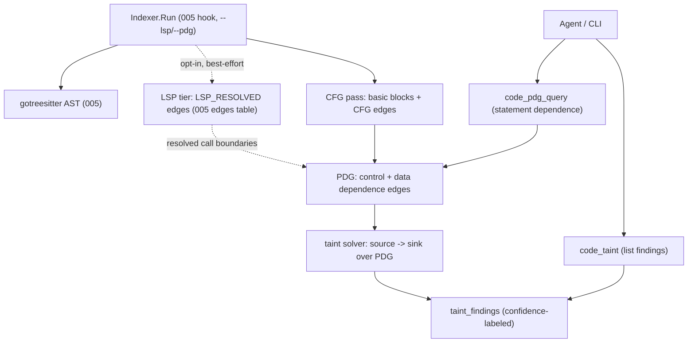

# Change: 011-mnemonic-pdg-taint — Mnemonic Statement-Level PDG + Taint Analysis

> **STATUS:** `draft` (2026-09-08)
>
> **For agentic workers:** REQUIRED: follow `.agents/skills/_shared/conventions/sdd-structure.md`. This file is WHY + HOW (former intent + plan). Spec phase instantiates `tasks.md` + `acceptance.feature` from the Step Blueprint and per-step WHAT below.
>
> **Provenance:** Derived from the GitNexus (`abhigyanpatwari/GitNexus`, 47k★) comparison in `docs/skillgrid/changes/005-mnemonic-hybrid-code-intelligence/` (see Mnemonic observation `sdd/005-mnemonic-hybrid-code-intelligence/gitnexus-takeaways`). GitNexus ships an opt-in `--pdg` index that builds per-function control-flow graphs → program-dependence graphs → taint findings (source→sink). This change is the **deep, opt-in** tier of Mnemonic's code intelligence — the one capability GitNexus does that 005/008/010 deliberately do not.

**Goal:** Add an **opt-in** statement-level analysis tier to Mnemonic's code graph: per-function **control-flow graphs (CFG)** → **program-dependence graphs (PDG)** → **taint findings** (source→sink data-flow). This lets an agent answer the questions the call graph can't: "does untrusted input reach this DB write without sanitization?", "which statements actually depend on this variable?", and "trace this value from where it's read to where it's written" — at statement granularity, not symbol granularity.

**Architecture:** Additive `014_*` schema (CFG basic-block nodes + edges, PDG control/data-dependence edges, taint findings) on top of 005's `symbols`/`edges`. A **PDG pass** (opt-in, `--pdg`) builds a per-function CFG from the gotreesitter AST, derives control- and data-dependence edges into a PDG, and runs a source→sink taint solver over it. Findings are persisted and exposed via `code_taint` (list findings) + `code_pdg_query` (statement-level dependence) MCP/CLI tools. Off by default; a non-`--pdg` index is byte-for-byte the 005/008/010 graph. Existing `code_*` tools stay name- and signature-stable.

**Tech stack:** Go (`skillgrid-cli`), SQLite (`modernc.org/sqlite`, CGo-free), existing gotreesitter AST from 005 (CFG from AST, no new grammar), MCP (`mcp-go`), CLI.

**Research:** GitNexus `--pdg` / `explain` / `pdg_query` tools (TypeScript & JavaScript M1) — see 005 gitnexus-takeaways observation. Graft (`trailhq/Graft`) `--lsp` opt-in compiler-grade edges — see 005 graft-takeaways observation.

**Prototype:** none

**Ticket:** none

**Depends on:** `005-mnemonic-hybrid-code-intelligence` (symbols/edges + gotreesitter AST). Does not require 008 (processes) or 010 (routes), though taint sources/sinks can later be seeded from 010's entry points.

---

## Goal

An agent gets statement-level data-flow answers on demand — "does this user input reach that SQL write?", "what's the control path that enables this branch?", "trace this value source→sink" — without reading files or re-deriving the CFG by hand. It is **opt-in** so the common 005/008/010 path stays lean.

## Out of scope / Non-Goals

- Re-implementing 005's symbols/edges/extractors, 008's communities/processes/knowledge, or 010's routes/affected/rename/watcher
- Whole-program interprocedural taint (M1 is **intraprocedural** per-function; a call-boundary summary is a later pass — the **LSP tier is its feeder**, below)
- A full data-flow engine beyond CFG→PDG→taint (no type inference beyond what 005 already resolves, no alias analysis beyond 005's receiver resolution)
- Default-on indexing (PDG is a separate, opt-in pass — it must not slow the common path)
- New languages beyond what 005's gotreesitter already parses (the PDG pass reuses 005's AST; M1 ships the same language set as 005)

## Definition of Done

This change is done only when **all** of the following are true:

- [ ] `--pdg` builds per-function CFGs (basic-block nodes + `CFG` edges) for 005-supported languages, without changing a non-`--pdg` index
- [ ] `--pdg` derives a PDG: control-dependence + data-dependence edges at statement level
- [ ] `code_taint` returns source→sink taint findings (source kind, sink kind, the path, per-hop Confidence Label); a finding with no path is not fabricated
- [ ] `code_pdg_query <symbol> <statement>` returns the statements that control-depend on, data-depend on, and are depended on by the given statement
- [ ] PDG + taint are **opt-in**: a non-`--pdg` index has no PDG/taint tables populated and every 005/008/010 `code_*` tool is byte-for-byte unchanged
- [ ] Every PDG/taint edge carries a Confidence Label (`EXTRACTED | INFERRED | AMBIGUOUS`); a taint path that crosses an unresolved boundary is marked `AMBIGUOUS`/truncated, not silently dropped
- [ ] Existing 005/008/010 `code_*` tools are unchanged (name + required params); `go test ./...` passes for touched packages
- [ ] Every Step Blueprint entry has a matching section in `tasks.md` with Verdict `PASS` or `PASS WITH WARNINGS`
- [ ] Every `@step-NN` Feature in `acceptance.feature` has passing `@happy`, `@edge`, and `@failure` scenarios
- [ ] Applicable threat-matrix rows have RED coverage that passed
- [ ] Testing strategy commands below are green
- [ ] Rollback path below is still valid (or N/A documented)
- [ ] Change archived under `docs/skillgrid/archive/011-mnemonic-pdg-taint/`

## Problem / why

005 gives a call graph; 008 gives subsystems + flows; 010 gives routes + affected-tests + a fresh index. But all of them stop at **symbol granularity**. The highest-value security and correctness questions live at **statement granularity**: "does `req.Body` reach `db.Exec` without a validator?", "is this `return` reachable?", "what statements does this loop condition dominate?". GitNexus (47k★) answers these with an opt-in `--pdg` index (CFG → PDG → taint). Mnemonic's gotreesitter AST already has the syntax; this change adds the CFG→PDG→taint pass on top, opt-in so it never taxes the common path.

## Target users

- **Coding agent** — data-flow / security reasoning before edits ("will this input be tainted at the sink?"); statement-level "why is this branch taken?"; high value on the security/bug-hunting subset of tasks
- **Operator** — CLI parity (`skillgrid index --pdg`, `skillgrid search taint`, `skillgrid search pdg`); a pre-commit taint gate in CI

## Business rules

- Additive + **opt-in** — `--pdg` is the only trigger; a non-`--pdg` index never populates PDG/taint tables and is byte-for-byte the 005/008/010 graph
- CGo-free: CFG is built from the existing gotreesitter AST (no new grammar, no C); the PDG + taint solver are pure Go
- **LSP tier is opt-in and external-process:** `--lsp` shells out to a language server on `PATH` (`gopls`, `pyright`, `typescript-language-server`, `rust-analyzer`, `clangd` — whichever 005 already parses) for precise member-call resolution. It adds a fourth edge confidence, `LSP_RESOLVED`, to the existing `EXTRACTED | INFERRED | AMBIGUOUS` set. A missing/failing server is best-effort: the index is unchanged (static resolution only), never a hard error. No new in-process CGo boundary
- Intraprocedural (M1): CFG/PDG/taint are per-function; crossing a call boundary without a resolved callee is `AMBIGUOUS`/truncated, not a fabricated intraprocedural hop. Interprocedural summaries are a later pass
- Every PDG/taint edge carries a Confidence Label: `EXTRACTED | INFERRED | AMBIGUOUS`; a taint path is only `EXTRACTED` where every hop is a resolved data-dependence, else `INFERRED`/`AMBIGUOUS`
- Taint **sources** and **sinks** are a configurable, deterministic set (e.g. sources: request params / env / file reads; sinks: SQL exec / shell exec / template render / file write); a finding is source→sink, not a guess
- **LSP-resolved call edges feed taint:** the PDG pass consumes `LSP_RESOLVED` edges (005 + `--lsp`) as resolved call boundaries instead of marking them `AMBIGUOUS`/"stops at boundary" — the primary M1 false-negative reducer for method-heavy code. The LSP layer is a **feeder**, not a dependency: without `--lsp`, taint behaves exactly as specified (intraprocedural, `AMBIGUOUS` at unresolved boundaries)
- A taint finding with no source→sink path is **not reported** (never fabricated); a path that ends at an unresolved boundary is reported with a "stops at <boundary>" note (reuses 005's graph-stops philosophy)
- Existing 005/008/010 `code_*` tools keep name + required params; all new tools use distinct `code_*` names
- Migration id `014_pdg_taint.sql` — leave `011` (005), `012` (008), `013` (010) as-is

## In scope

- Schema: `cfg_blocks`, `cfg_edges`, `pdg_edges` (control + data dependence), `taint_findings` (additive `014_*`)
- **LSP edge tier (opt-in `--lsp`):** external language-server member-call resolution producing `LSP_RESOLVED` edges into 005's edges table (best-effort, missing server = unchanged index)
- PDG pass (opt-in `--pdg`): per-function CFG from the gotreesitter AST → control-dependence + data-dependence edges
- Taint solver: configurable source/sink sets + a source→sink solver over the PDG (intraprocedural)
- `code_taint` (list findings, `--symbol`/`--file`/`--json`) + `code_pdg_query` (statement-level dependence) MCP/CLI tools
- Indexer hook: run the PDG + taint pass after 005's extraction, only when `--pdg` is set (same incremental transaction)

## Risks & rollback

- **Risk:** CFG/PDG construction is slow or memory-heavy on large functions — **Mitigation:** opt-in (off by default); per-function scope (bounded by function size); depth/step caps; a pathological function degrades to a truncated PDG + warning, never aborts the index
- **Risk:** Intraprocedural taint misses cross-function flows (false negatives) — **Mitigation:** documented scope (M1 intraprocedural); unresolved call boundaries marked `AMBIGUOUS`/truncated so the agent knows the flow "leaves here"; the `--lsp` tier resolves the member-call subset of those boundaries (`LSP_RESOLVED`), cutting the biggest false-negative class; full interprocedural summaries are an explicit later pass
- **Risk:** Data-dependence extraction is imprecise (false positives/negatives) — **Mitigation:** Confidence Labels; only resolved data-dependences are `EXTRACTED`; conservative default source/sink sets; findings are advisory, not load-bearing
- **Risk:** Scope expands into a full data-flow engine (alias analysis, type inference, interprocedural) — **Mitigation:** Hard Non-Goals; M1 = CFG + PDG + intraprocedural taint + the opt-in LSP edge tier only
- **Risk:** LSP server absent or slow (first-run server startup) — **Mitigation:** best-effort with a timeout; a missing/failing server is a no-op (static edges only), never a hard error; `warn+continue` in the error table
- **Rollback:** Drop `014_*` migration + `pdg/` package + the `code_taint`/`code_pdg_query` tools + the `--pdg`/`--lsp` hooks; `LSP_RESOLVED` edges roll back with the `pdg/` package (they live in `pdg/lsp.go`); 005/008/010's graph + hybrid + community + process + routes stay intact

## Error handling

| Failure | Behavior | Notes |
|---------|----------|-------|
| Function with a malformed/unparseable CFG | `warn+continue` | Skip that function's PDG; index the rest |
| PDG construction exceeds depth/step cap on a large function | `warn+continue` | Truncate with a "stops at <block>" note; never abort |
| Taint path crosses an unresolved call boundary | `warn+continue` | Path marked `AMBIGUOUS` / "stops at <boundary>"; not fabricated (an `LSP_RESOLVED` edge, when present, resolves the boundary instead) |
| LSP server absent / fails / times out on `--lsp` | `warn+continue` | Index unchanged (static resolution only); no hard error, no partial LSP edge set |
| `code_pdg_query` on a statement with no PDG (non-`--pdg` index) | `warn+continue` | Clear "run `--pdg`" message; empty result, not an error |
| Unknown / missing symbol or statement | `warn+continue` | Not-found; no fabricated blocks or dependences |
| Bad / missing args on new `code_*` tools | `abort` | Clear validation error; do not invent findings |
| Existing 005/008/010 `code_*` tool call | unchanged | Name + required params must not regress; a non-`--pdg` index is byte-for-byte unchanged |

## Testing strategy

- **Unit:** `Run: go test ./skillgrid-cli/internal/mnemonic/pdg/... ./skillgrid-cli/internal/mnemonic/store/... -count=1` — Expected: PASS
- **Integration / acceptance:** `Run: go test ./skillgrid-cli/internal/mnemonic/mcp/... ./skillgrid-cli/internal/mnemonic/service/...` plus BDD `@step-NN` / `@p0` scenarios — Expected: PASS
- **Full suite:** `Run: go test ./...` (from `skillgrid-cli` / repo root per module layout) — Expected: PASS
- **Green means:** CFG/PDG/taint queryable after `--pdg` on a fixture with a known source→sink; every PDG/taint edge confidence-labeled; **a non-`--pdg` index is byte-for-byte unchanged** (all 005/008/010 tools identical); one-malfunction CFG path covered; cross-boundary taint marked `AMBIGUOUS`, not fabricated

---

## Step Blueprint

Contract for `sdd-spec`. Do not renumber after `tasks.md` exists. Per-step Out of scope / DoD live under Per-step WHAT (table is summary only).

| NN | Step slug | Goal (one line) | Primary package / entry | Depends on |
|----|-----------|-----------------|-------------------------|------------|
| 01 | `cfg-pdg` | Additive `014_*` schema + per-function CFG + control/data-dependence PDG (opt-in `--pdg`) + **LSP edge tier (opt-in `--lsp`)** | `skillgrid-cli/internal/mnemonic/pdg` | — (005 done) |
| 02 | `taint-solver` | Configurable source/sink sets + intraprocedural source→sink taint solver (consumes `LSP_RESOLVED` edges as resolved boundaries) + `code_taint` / `code_pdg_query` | `skillgrid-cli/internal/mnemonic/pdg` | 01 |

---

## Technical approach

Two additive, **opt-in** passes on top of 005's graph, gated behind `--pdg` (with an independent `--lsp` edge-resolution tier). Step 01 builds a per-function **CFG** (basic-block nodes + `CFG` edges) directly from 005's gotreesitter AST (no new grammar), then derives a **PDG** — control-dependence edges (which statement dominates/gates which) and data-dependence edges (which statement's value reaches which) — persisted as `cfg_blocks`/`cfg_edges`/`pdg_edges`. Step 02 layers a **taint solver** over the PDG: a configurable, deterministic set of sources (request params, env, file reads) and sinks (SQL/shell/template/file writes), a source→sink reachability solver, and persisted `taint_findings`. An independent **`--lsp` tier** shells out to a language server (best-effort) to add `LSP_RESOLVED` member-call edges into 005's edges table, which the PDG/taint passes then consume as *resolved* call boundaries — the primary M1 false-negative reducer for method-heavy code. Both expose `code_taint` (list findings, `--symbol`/`--file`/`--json`) and `code_pdg_query` (statement-level dependence) MCP/CLI tools. The PDG + taint pass runs after 005's extraction in the same incremental transaction, **only when `--pdg` is set**; without it the index is byte-for-byte the 005/008/010 graph. Preserve all 005/008/010 `code_*` contracts.

## Architecture decisions

### Decision: PDG/taint is opt-in (`--pdg`), not default

**Module / Interface / Seam / Adapter / Depth:** Pass gate at the indexer
**Choice:** CFG/PDG/taint build only when `--pdg` is passed; the tables are additive and a non-`--pdg` index never populates them.
**Alternatives considered:** Default-on (always build PDG — slows every index, memory-bound on large repos); a separate `--pdg` index file (fragmentation, dual-sync drift)
**Rationale:** GitNexus itself ships PDG as an opt-in `--pdg` flag for exactly this reason — it's a deep, memory-bound analysis most queries don't need. Making it a flag (not a separate store) reuses 005's single-transaction incremental guard, so `--pdg` and non-`--pdg` stay consistent and the common path is untouched.

### Decision: CFG from the existing AST, intraprocedural (M1)

**Module / Interface / Seam / Adapter / Depth:** Pass over the gotreesitter AST
**Choice:** Build the per-function CFG from 005's gotreesitter AST (basic blocks from branch/loop/return structure); PDG control/data dependences are per-function. Crossing an unresolved call boundary is `AMBIGUOUS`/truncated.
**Alternatives considered:** A dedicated CFG grammar (new dep, CGo risk); interprocedural taint in M1 (call-boundary summaries — much harder, needs inlining/summaries)
**Rationale:** 005 already parses every supported language with gotreesitter; the CFG is a re-read of the same AST (control flow is in the tree), so no new grammar and no CGo. Intraprocedural-first matches GitNexus's M1 (they're also TS/JS M1) and bounds the correctness surface; interprocedural summaries are an explicit later pass, and the "stops at <boundary>" note tells the agent exactly where the flow leaves.

### Decision: LSP as an opt-in, external-process edge tier (Graft `--lsp`)

**Module / Interface / Seam / Adapter / Depth:** Adapter (language-server JSON-RPC) at the extraction seam; pure-Go in-process, the server is a separate binary
**Choice:** `skillgrid index --lsp` shells out to a language server on `PATH` for languages 005 already parses (`gopls`, `pyright`, `typescript-language-server`, `rust-analyzer`, `clangd`). Resolved member calls become `LSP_RESOLVED` edges in 005's edges table — the precision tier for member calls the static tree-sitter pass can't type (receiver-bound methods, interface→impl). Best-effort: missing/failing server → index unchanged, `warn+continue`. A fourth confidence value, `LSP_RESOLVED`, joins `EXTRACTED | INFERRED | AMBIGUOUS`.
**Alternatives considered:** In-process LSP client via CGo (breaks the CGo-free invariant); LSP only inside the PDG pass (edges stay invisible to 005/010 tools — `code_affected`/`code_impact` can't use them either)
**Rationale:** Graft proves the pattern: the static pass + an opt-in compiler-grade layer that degrades to no-op. For 011 it's a force multiplier — taint's "stops at boundary" truncations are exactly the edges LSP resolves, so `--lsp --pdg` cuts M1's biggest false-negative class without changing the taint solver's contract. Putting the edges in 005's table (not a PDG-private structure) means 010's `code_affected`/`code_rename` inherit the precision for free.

### Decision: Deterministic source/sink sets + confidence-labeled findings

**Module / Interface / Seam / Adapter / Depth:** Solver config + finding schema
**Choice:** Sources and sinks are a configurable, deterministic set (defaults: request params/env/file reads → SQL/shell/template/file writes). A finding is a real source→sink path; every hop is confidence-labeled; an unresolved boundary truncates the path with a "stops at" note.
**Alternatives considered:** LLM-suggested sources/sinks (non-deterministic, cost); report all reachable statement pairs (noise, no source→sink semantics)
**Rationale:** A taint finding is only useful if it's a *real* source→sink flow, not "these statements are connected." Deterministic sets keep it reproducible and testable; confidence labels + "stops at" keep it honest (a path that can't be completed is marked, not fabricated). Findings are advisory — the agent decides, the graph doesn't pretend to be a prover.

### Decision: Migration number

**Module / Interface / Seam / Adapter / Depth:** Store migration Seam
**Choice:** `014_pdg_taint.sql`
**Alternatives considered:** Extend `013` in place
**Rationale:** Leave `011` (005), `012` (008), `013` (010) owned by their changes; 011 is additive, opt-in, and independently rollable

## Data flow



## File layout

```
skillgrid-cli/internal/mnemonic/
├── store/migrations/014_pdg_taint.sql          # cfg_blocks, cfg_edges, pdg_edges, taint_findings
├── pdg/cfg.go                                  # per-function CFG from gotreesitter AST
├── pdg/pdg.go                                  # control + data dependence edges
├── pdg/taint.go                                # source/sink sets + source->sink solver
├── pdg/lsp.go                                  # opt-in LSP edge tier (external server, LSP_RESOLVED edges)
└── mcp/tools_code_pdg.go                       # code_taint + code_pdg_query
```

## Impacted files map

| File | Action | Step | Description |
|------|--------|------|-------------|
| `skillgrid-cli/internal/mnemonic/store/migrations/014_pdg_taint.sql` | Create | 01 | `cfg_blocks`, `cfg_edges`, `pdg_edges`, `taint_findings` |
| `skillgrid-cli/internal/mnemonic/pdg/cfg.go` | Create | 01 | Per-function CFG from gotreesitter AST (basic blocks + `CFG` edges) |
| `skillgrid-cli/internal/mnemonic/pdg/lsp.go` | Create | 01 | Opt-in LSP edge tier (external language server on PATH, `LSP_RESOLVED` edges into 005's table, best-effort no-op on missing server) |
| `skillgrid-cli/internal/mnemonic/pdg/pdg.go` | Create | 01 | Control-dependence + data-dependence edges |
| `skillgrid-cli/internal/mnemonic/codeindex/indexer.go` | Modify | 01 | Hook PDG pass after 005 extraction (same tx), gated on `--pdg` |
| `skillgrid-cli/internal/mnemonic/pdg/taint.go` | Create | 02 | Configurable source/sink sets + intraprocedural source→sink solver |
| `skillgrid-cli/internal/mnemonic/mcp/tools_code_pdg.go` | Create | 02 | `code_taint` + `code_pdg_query` MCP tools |
| `skillgrid-cli/cmd/skillgrid/code_intel.go` | Modify | 02 | `skillgrid search taint` + `skillgrid search pdg` CLI; `skillgrid index --pdg` + `--lsp` flags |
| `skillgrid-cli/internal/mnemonic/mcp/server.go` | Modify | 02 | Register new tool sets |
| `skillgrid-cli/cmd/skillgrid/main.go` | Modify | 02 | CLI dispatch for `--pdg` + taint/pdg search |

## Per-step WHAT

Observable behavior each step must deliver (feeds Gherkin). Not implementation HOW.

### Step 01 — `cfg-pdg`

**Goal:** Opt-in per-function CFG + control/data-dependence PDG so statement-level structure is queryable
**Out of scope:** Taint (step 02); interprocedural flow; changing 005/008/010 tools
**Definition of Done:** `--pdg` builds per-function CFGs (basic blocks + `CFG` edges) and a PDG (control + data dependence) for 005-supported languages; a non-`--pdg` index is byte-for-byte unchanged; malformed function → fallback + continue; a function that exceeds the cap truncates with a note, never aborts; 005/008/010 tools unchanged

- `skillgrid index --pdg` populates `cfg_blocks`/`cfg_edges`/`pdg_edges` for each function (basic blocks from branch/loop/return structure)
- `skillgrid index --lsp` adds `LSP_RESOLVED` edges for member calls the static pass couldn't type (resolved via the language server); a missing/failing server leaves the index unchanged (warn+continue); `--lsp` works standalone (no `--pdg` needed) and composes with `--pdg`
- `code_pdg_query <symbol> <statement>` returns the statements that control-depend on, data-depend on, and are depended on by the given statement
- Every PDG edge carries a Confidence Label; a data-dependence that can't be resolved is `AMBIGUOUS`/`INFERRED`, not fabricated; call boundaries resolved by the LSP tier are `LSP_RESOLVED`, not `AMBIGUOUS`
- A function with a malformed CFG is skipped (index the rest); a function over the depth/step cap truncates with a "stops at <block>" note
- A **non-`--pdg`** index has no PDG/taint tables populated and every 005/008/010 `code_*` tool is byte-for-byte unchanged
- Existing 005/008/010 `code_*` tools are unchanged; bad PDG args are rejected clearly

### Step 02 — `taint-solver`

**Goal:** Configurable source/sink sets + intraprocedural source→sink taint so "does untrusted input reach this sink" is a query
**Out of scope:** Interprocedural flow (later pass); a full data-flow engine; changing 005/008/010 tools
**Definition of Done:** `code_taint` returns source→sink findings (source kind, sink kind, the path, per-hop Confidence Label); a finding with no path is not fabricated; a path crossing an unresolved boundary is `AMBIGUOUS`/truncated with a "stops at" note; sources/sinks are a deterministic configurable set; 005/008/010 tools unchanged

- `code_taint` returns source→sink taint findings: source kind (request param / env / file read), sink kind (SQL exec / shell / template / file write), the hop-by-hop path, each hop confidence-labeled
- A source with no path to a sink produces **no finding** (never fabricated); a path that ends at an unresolved call boundary is reported with "stops at <boundary>", not dropped silently — unless the boundary has an `LSP_RESOLVED` edge, in which case the path continues through it
- `--symbol` / `--file` filter findings; `--json` for CI; a non-`--pdg` index returns a clear "run `--pdg`" message, not an error
- The default source/sink sets are deterministic + configurable; a finding is advisory (the agent decides), not a prover's verdict
- Existing 005/008/010 `code_*` tools are unchanged; bad taint args are rejected clearly

## Threat matrix

Mark each row `Applicable` or `N/A: reason`. Applicable rows name an owning step and propagate into RED tasks + acceptance scenarios.

| Boundary / threat | Applicable? | Owning step | Planned RED coverage |
|-------------------|-------------|-------------|----------------------|
| Documentation-like paths | N/A: PDG/taint run on source files only | — | — |
| Git repository selection | N/A: no gitRoot / worktree authority change | — | — |
| Commit state | N/A: `--pdg` indexes, does not commit | — | — |
| Push state | N/A: no push automation | — | — |
| PR commands | N/A: taint is advisory, no PR automation (a CI gate is a consumer, not this change) | — | — |
| **Mnemonic tool surface** | Applicable — new `code_taint`/`code_pdg_query` + `--lsp` edge tier; 005/008/010 tools unchanged; opt-in gate must not leak | 01, 02 | 01: `code_pdg_query` registered + non-`--pdg` index byte-for-byte unchanged + `--lsp` absent-server no-op (index unchanged) + bad args rejected; 02: `code_taint` registered + no fabricated finding + cross-boundary `AMBIGUOUS` (resolved when `LSP_RESOLVED` present) + 005/008/010 tools still stable + bad args rejected |
| **Opt-in isolation** | Applicable — `--pdg` must not change the common index; `--lsp` must not change it when the server is absent | 01, 02 | a non-`--pdg` index has empty PDG/taint tables + identical tool output to pre-011; `--pdg` index adds findings without altering 005/008/010 results; `--lsp` with no server installed produces a byte-for-byte static index (zero `LSP_RESOLVED` edges) |
| **Shared-convention drift** | N/A: no `_shared/conventions/*` edits in this Change | — | — |

## Migration / rollout

- Additive `014_pdg_taint.sql`. PDG + taint run after 005's extraction **only when `--pdg` is set**; a non-`--pdg` index is byte-for-byte the 005/008/010 graph. No CGo (CFG from the existing AST; the LSP tier is an external process). No LLM.
- Rollback drops `014_*` + `pdg/` + the new tools + the `--pdg`/`--lsp` hooks; 005/008/010's graph + hybrid + community + process + routes stay.
- Source/sink sets + depth caps tuned in steps 01/02; Confidence Label always required on PDG/taint edges; `LSP_RESOLVED` joins the label set as a fourth value.

## Open questions

- Which default source/sink sets ship in M1 — **recommend** start with the high-signal ones (sources: HTTP request params/body, env vars, file reads; sinks: SQL exec, shell exec, template render, file write) and make the rest configurable
- Interprocedural summaries (cross-function taint) — **deferred** to a later pass (M2); M1 is intraprocedural with "stops at <boundary>" notes, and the `--lsp` tier resolves the member-call subset of those boundaries in M1 (Graft pattern: static pass + opt-in compiler-grade layer, best-effort no-op)
- Whether `--pdg` should also seed taint sources from 010's route entry points — **recommend** yes when 010 is present, no-op otherwise

## Glossary

| Term | Definition | Glossary file |
|------|------------|---------------|
| **CFG** | Control-flow graph — per-function basic blocks + `CFG` edges, built from the gotreesitter AST | technical |
| **PDG** | Program-dependence graph — control-dependence + data-dependence edges at statement level, derived from the CFG | technical |
| **Taint Finding** | A source→sink data-flow path (source kind, sink kind, hops, per-hop Confidence Label) over the PDG | technical |
| **Taint Source** | A configurable statement kind where untrusted data enters (request params, env, file reads) | technical |
| **Taint Sink** | A configurable statement kind where data is consumed (SQL/shell/template/file writes) | technical |
| **--pdg** | The opt-in indexer flag that builds CFG/PDG/taint; a non-`--pdg` index is byte-for-byte unchanged | technical |
| **LSP Tier** | Opt-in `--lsp` indexer flag that shells out to a language server (gopls/pyright/tsserver/rust-analyzer/clangd) to add `LSP_RESOLVED` member-call edges; best-effort, a missing server leaves the index unchanged (Graft `--lsp`) | technical |
| **LSP_RESOLVED** | Fourth edge confidence value (joins `EXTRACTED \| INFERRED \| AMBIGUOUS`) marking call edges resolved by a language server; consumed by the PDG/taint passes as resolved call boundaries | technical |

<!-- Fold new terms here; also upsert docs/skillgrid/glossary/{business,technical}.md. No companion *-glossary-reference.md. -->

## Author self-review

- [x] **Goal**, **Out of scope / Non-Goals**, and **Definition of Done** are filled and testable
- [x] **Error handling** and **Testing strategy** are filled
- [x] Non-goals match Global Constraints that will appear in `tasks.md`
- [x] Rollback plan is present
- [x] Step Blueprint covers a vertical-slice sequence (no horizontal-only layers)
- [x] Every Impacted Files row maps to exactly one step
- [x] Every applicable threat row names an owning step
- [x] Glossary terms reused or defined; no companion reference file
