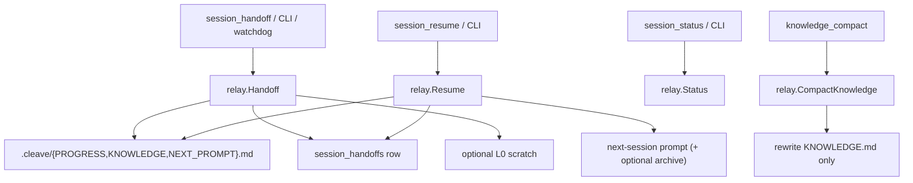

# Change: 006-structured-session-handoff — Structured Session Handoff (Session Relay)

> **STATUS:** `draft` (2026-09-04)
>
> **For agentic workers:** REQUIRED: follow `.agents/skills/_shared/conventions/sdd-structure.md`. This file is WHY + HOW (former intent + plan). Spec phase instantiates `tasks.md` + `acceptance.feature` from the Step Blueprint and per-step WHAT below.
>
> **Migration note:** Question round already satisfied by legacy `intent.md` / `plan.md` / `docs/plan/06-structured-session-handof.md` plus prior approval. This `change.md` folds those answers; do not re-interview.

**Goal:** Ship Cleave-style Session Relay so agents and operators can hand off and resume work across sessions without re-deriving state.

**Architecture:** A deep `relay` module owns SQL writes and `.skillgrid/.cleave/` FS (PROGRESS / KNOWLEDGE / NEXT_PROMPT); MCP and CLI are thin callers of the same Handoff/Resume/Status/Compact interfaces. Soft-after Change 003 L0 paths only — no Tiered Storage, Fact Memory, or Long-term Memory stretch.

**Tech stack:** Go (`skillgrid-cli`), SQLite (`modernc.org/sqlite`), MCP (`mcp-go`), filesystem under `.skillgrid/.cleave/` (gitignored); optional env/flag-gated watchdog.

**Research:** none (legacy intent/plan + `docs/plan/06-structured-session-handof.md`)

**Ticket:** `TASK-002`

**Depends on:** soft-after `003-mnemonic-tiered-storage` (L0 path conventions only; no hard SQL dep on `010_*`)

---

## Goal

Agents and operators get a Session Relay: explicit handoff writes a cleave bundle and SQL row; resume returns a next-session prompt; status and thin knowledge compact keep continuity without Fact Memory; CLI and optional watchdog drive the same path.

## Out of scope / Non-Goals

- Fact Memory / Agent Skills (**004**) — thin `knowledge_compact` must not depend on facts
- **003** Tiered Storage core, `semantic_search`, `mnemonic_commit`, trail CLI
- **002** identity / **005** code intelligence
- OpenCode plugin; full plan-06 rewrite (mega-plan scope)
- Stretching Long-term Memory / Engram `mem_session_*` replacement — Session Relay complements them
- Always-on watchdog (must stay off by default)

## Definition of Done

This change is done only when **all** of the following are true:

- [ ] `session_handoff` writes three `.cleave/` files and records a `session_handoffs` row
- [ ] `session_resume` returns a next-session prompt (optional archive when requested)
- [ ] `session_status` reports session stats (cost/context/handoff count)
- [ ] Thin `knowledge_compact` refreshes `KNOWLEDGE.md` without Fact Memory
- [ ] CLI: `skillgrid session handoff|resume|status` mirrors MCP on the same project store
- [ ] Optional watchdog triggers handoff only when enabled and past threshold
- [ ] `.skillgrid/.cleave/` is gitignored by default
- [ ] Every Step Blueprint entry has a matching section in `tasks.md` with Verdict `PASS` or `PASS WITH WARNINGS`
- [ ] Every `@step-NN` Feature in `acceptance.feature` has passing `@happy`, `@edge`, and `@failure` scenarios
- [ ] Applicable threat-matrix rows have RED coverage that passed
- [ ] Testing strategy commands below are green
- [ ] Rollback path below is still valid (or N/A documented)
- [ ] Change archived under `docs/skillgrid/archive/006-structured-session-handoff/`

---

## Problem / why

Context fill and session end break continuity. Agents re-derive progress, knowledge, and next actions instead of resuming from a structured handoff. Cleave-style Session Handoff (scoped slice of plan 06 — not the mega-plan) closes that gap after **003** L0 paths exist, orthogonal to **004**/**005**.

## Target users

- **Agent** — MCP `session_handoff` / `session_resume` when context is tight or work spans sessions
- **Operator** — CLI handoff/resume/status; local `.cleave/` inspect
- **Urgency:** Medium–High after **003** paths

## Business rules

- Session Relay only — not Fact Memory / Agent Skills (**004**), not **003** Tiered Storage / `semantic_search` / `mnemonic_commit` / trail CLI, not **002**/**005**, not OpenCode plugin
- Additive SQL: `session_handoffs`, `session_archives` via migration slot `012_*` (leave `009_*`/`010_*`/`011_*` for 001/003/004)
- Writes `.skillgrid/.cleave/` (`PROGRESS.md`, `KNOWLEDGE.md`, `NEXT_PROMPT.md`); gitignored by default (like L0)
- Soft-after **003**: reuse L0 paths when present; no full tiered storage or `mnemonic_commit`
- Triggers: explicit MCP + CLI; optional context-limit watchdog in Step 05 (off by default)
- Thin `knowledge_compact`: refresh `.cleave/KNOWLEDGE.md` only — no Fact Memory dependency
- Complements Engram `mem_session_*`; does not replace them or stretch Long-term Memory

## In scope

- Schema: `session_handoffs`, `session_archives` (`012_session_relay.sql`)
- MCP: `session_handoff`, `session_resume`, `session_status`; thin `knowledge_compact`
- FS: `.skillgrid/.cleave/` + soft-optional L0 session workspace
- Optional handoff watchdog; CLI `skillgrid session handoff|resume|status`

## Risks & rollback

- **Risk:** Scope creep into plan-06 mega-plan — **Mitigation:** Hard Out of Scope; Session Relay slice only
- **Risk:** Over-coupling to **003** — **Mitigation:** Soft-after; L0 paths optional; no hard SQL dep on `010_*`
- **Risk:** Watchdog false triggers — **Mitigation:** Flag/env + threshold; last Step; default off
- **Risk:** Thin compact vs full plan-06 expectations — **Mitigation:** Document compounding file only; no facts
- **Rollback:** Drop `012_*` tables/tools/CLI/watchdog/`.cleave/` helpers; leave **003**/**004** intact. Existing DBs that applied `012_*` keep additive tables (harmless if callers stop using them).

## Error handling

| Failure | Behavior | Notes |
|---------|----------|-------|
| Store open / migrate fails | `abort` | Clear migrate error; do not rewrite sessions/observations |
| Handoff cannot write cleave files | `abort` | Fail closed — no orphan `session_handoffs` row without files |
| Resume missing `.cleave/` or unknown handoff id | `abort` | Clear error; do not invent prompt content |
| Status with no handoffs yet | `warn+continue` | Zero counts / empty optional stats; not a crash |
| Compact with empty/missing knowledge inputs | `warn+continue` | Empty or minimal `KNOWLEDGE.md`; not a crash |
| CLI bad flags / missing id / no usable store | `abort` | Non-zero exit; stderr message; no partial cleave bundle |
| Watchdog disabled or below threshold | `warn+continue` (no-op) | Never auto-handoff |
| Invalid watchdog threshold / flag | `abort` | Fail closed — no auto-handoff; clear config error |

## Testing strategy

- **Unit:** `Run: go test ./skillgrid-cli/internal/mnemonic/relay/ ./skillgrid-cli/internal/mnemonic/store/` — Expected: PASS
- **Integration / acceptance:** `Run: go test ./skillgrid-cli/internal/mnemonic/mcp/ ./skillgrid-cli/cmd/skillgrid/` plus BDD `@step-NN` scenarios — Expected: PASS (`@step-01`…`@step-05` / `@p0`)
- **Full suite:** `Run: go test ./...` (from `skillgrid-cli` / repo root per module layout) — Expected: PASS
- **Green means:** Handoff/resume/status/compact/CLI/watchdog UAT criteria hold; new session tools registered without regressing `mem_*`; `.cleave/` gitignored

---

## Step Blueprint

Contract for `sdd-spec`. Do not renumber after `tasks.md` exists. Per-step Out of scope / DoD live under Per-step WHAT (table is summary only).

| NN | Step slug | Goal (one line) | Primary package / entry | Depends on |
|----|-----------|-----------------|-------------------------|------------|
| 01 | `relay-schema` | Migrations create handoff/archive tables without rewriting prior data | `skillgrid-cli/internal/mnemonic/store/migrations` | — |
| 02 | `handoff-resume` | Cleave FS + MCP handoff/resume; soft L0; fail closed | `skillgrid-cli/internal/mnemonic/relay` | 01 |
| 03 | `status-compact` | `session_status` + thin `knowledge_compact` (no facts) | `skillgrid-cli/internal/mnemonic/relay` | 02 |
| 04 | `session-cli` | CLI `session handoff\|resume\|status` mirrors MCP | `skillgrid-cli/cmd/skillgrid` | 02, 03 |
| 05 | `handoff-watchdog` | Optional flag-gated context-limit watchdog → same Handoff | `skillgrid-cli/internal/mnemonic/relay` | 02 |

---

## Technical approach

Ship Cleave-style Session Relay only: additive SQL (`012_session_relay.sql`), `.skillgrid/.cleave/` FS, MCP `session_*` + thin `knowledge_compact`, CLI `skillgrid session …`, optional flag-gated watchdog. Soft-after **003** L0 paths (`.skillgrid/workspace/sessions/{id}/`) without Tiered Storage, `semantic_search`, `mnemonic_commit`, or trail CLI. Orthogonal to **004**/**005**. Migration slot `012_*` avoids colliding with `009_*`/`010_*`/`011_*`. Complements Engram `mem_session_*`. Source: `docs/plan/06-structured-session-handof.md` §2.4 / §3.3.

## Architecture decisions

### Decision: Deep Session Relay Module

**Module / Interface / Seam / Adapter / Depth:** `relay`; Handoff/Resume/Status/Compact; SQL+FS Seam; SQLite + cleave FS (+ optional L0); deep
**Choice:** One `relay` package owns schema writes and `.cleave/` files; MCP/CLI are thin callers
**Alternatives considered:** Logic inside MCP handlers; fold into `memory.Service`
**Rationale:** Deletion test — callers stay shallow; tests hit `relay` without MCP framing

### Decision: Soft L0 paths, hard `.cleave/`

**Module / Interface / Seam / Adapter / Depth:** cleave FS; WriteBundle/ReadBundle; path Seam; `.cleave/` required, L0 optional; deep
**Choice:** Always write `PROGRESS.md` / `KNOWLEDGE.md` / `NEXT_PROMPT.md` under `.skillgrid/.cleave/`; optionally mirror scratch under L0 when present
**Alternatives considered:** L0-only; hard-require **003** tables
**Rationale:** Approved soft-after **003**; relay works before tiered core lands

### Decision: Thin knowledge_compact

**Module / Interface / Seam / Adapter / Depth:** Compact; RefreshKnowledge; compounding Seam; FS-only adapter; deep for callers
**Choice:** Refresh `.cleave/KNOWLEDGE.md` from handoff inputs/session notes only — no Fact Memory
**Alternatives considered:** Full plan-06 compact (facts + log roll-off); stub no-op
**Rationale:** Locked Q2; documents compounding file only

### Decision: Watchdog behind same Handoff Interface

**Module / Interface / Seam / Adapter / Depth:** Watchdog; Check→Handoff; threshold Seam; off-by-default adapter; deep
**Choice:** Optional context-limit watchdog calls the same `Handoff` path; env/flag + threshold
**Alternatives considered:** Always-on; separate MCP tool
**Rationale:** Q1 explicit+watchdog; false-trigger risk → last Step, default off

### Decision: Migration slot `012_*`

**Module / Interface / Seam / Adapter / Depth:** store migrations; open/migrate Seam; SQLite adapter; deep
**Choice:** `012_session_relay.sql` for `session_handoffs` + `session_archives`
**Alternatives considered:** `009` (collides 001); `011` (004)
**Rationale:** Matches 003/004 reservation chain; additive, idempotent open

## Data flow



## File layout

```
skillgrid-cli/
├── internal/mnemonic/
│   ├── store/migrations/
│   │   └── 012_session_relay.sql    # session_handoffs, session_archives
│   ├── relay/
│   │   ├── relay.go                 # Handoff / Resume Module
│   │   ├── cleave.go                # .cleave/ FS; soft L0
│   │   ├── status.go                # Status aggregation
│   │   ├── compact.go               # Thin KNOWLEDGE.md refresh
│   │   └── watchdog.go              # Flag-gated Check → Handoff
│   └── mcp/
│       ├── tools_session_handoff.go # session_handoff, session_resume
│       ├── tools_session_status.go  # session_status, knowledge_compact
│       └── server.go                # registrar hook (step 02)
└── cmd/skillgrid/
    ├── session.go                   # session handoff|resume|status
    └── main.go                      # dispatch session
```

## Impacted files map

| File | Action | Step | Description |
|------|--------|------|-------------|
| `skillgrid-cli/internal/mnemonic/store/migrations/012_session_relay.sql` | Create | 01 | `session_handoffs`, `session_archives` |
| `skillgrid-cli/internal/mnemonic/relay/relay.go` | Create | 02 | Handoff/Resume Module + SQL |
| `skillgrid-cli/internal/mnemonic/relay/cleave.go` | Create | 02 | `.cleave/` FS; soft L0 paths |
| `skillgrid-cli/internal/mnemonic/mcp/tools_session_handoff.go` | Create | 02 | `session_handoff`, `session_resume` + registrar hook |
| `skillgrid-cli/internal/mnemonic/mcp/server.go` | Modify | 02 | Call `registerSessionTools` |
| `.gitignore` | Modify | 02 | Ignore `.skillgrid/.cleave/` |
| `skillgrid-cli/internal/mnemonic/relay/status.go` | Create | 03 | Status aggregation |
| `skillgrid-cli/internal/mnemonic/relay/compact.go` | Create | 03 | Thin `KNOWLEDGE.md` refresh |
| `skillgrid-cli/internal/mnemonic/mcp/tools_session_status.go` | Create | 03 | `session_status`, `knowledge_compact` via registrar hook |
| `skillgrid-cli/internal/mnemonic/mcp/server_test.go` | Modify | 02, 03 | Expect new session_* (+ compact) tools; `mem_save` intact |
| `skillgrid-cli/cmd/skillgrid/session.go` | Create | 04 | `session handoff\|resume\|status` |
| `skillgrid-cli/cmd/skillgrid/main.go` | Modify | 04 | Dispatch `session` |
| `skillgrid-cli/internal/mnemonic/relay/watchdog.go` | Create | 05 | Flag-gated context-limit → Handoff |

## Per-step WHAT

Observable behavior each step must deliver (feeds Gherkin). Not implementation HOW.

### Step 01 — `relay-schema`

**Goal:** Opening a store creates handoff/archive tables without rewriting sessions/observations
**Out of scope:** Relay FS, MCP tools, CLI, watchdog
**Definition of Done:** Store open applies `012_*` idempotently; prior rows intact

- As operator: opening a store creates handoff/archive tables without rewriting sessions/observations
- Given an existing DB through `008_*`, migrate leaves prior rows intact
- Edge: re-open is idempotent; no duplicate tables

### Step 02 — `handoff-resume`

**Goal:** MCP handoff writes cleave + row; resume returns next-session prompt; fail closed
**Out of scope:** Status/compact tools, CLI, watchdog
**Definition of Done:** Handoff/resume WHAT + threat RED (new tools + `mem_save` intact) pass

- As agent: `session_handoff` writes the three `.cleave/` files and records a Session Handoff row
- As agent: `session_resume` returns a next-session prompt from the latest (or named) handoff; optional archive when requested
- Edge: missing `.cleave/` or unknown id → clear error; fail closed (no orphan row without files)
- Threat: `session_handoff` / `session_resume` registered; `mem_save` still succeeds

### Step 03 — `status-compact`

**Goal:** Status reports handoff stats; thin compact refreshes knowledge without Fact Memory
**Out of scope:** CLI, watchdog; Fact Memory integration
**Definition of Done:** Status/compact WHAT + threat RED pass; registrar extends without re-editing `server.go`

- As agent: `session_status` reports handoff count and last known cost/context for the session
- As agent: thin `knowledge_compact` refreshes `KNOWLEDGE.md` without Fact Memory
- Edge: no handoffs yet → zero counts / empty knowledge file, not a crash
- Threat: `session_status` / `knowledge_compact` registered; `mem_save` still succeeds; compact needs no facts

### Step 04 — `session-cli`

**Goal:** CLI mirrors MCP Session Relay on the same project store
**Out of scope:** Watchdog; new MCP tools
**Definition of Done:** CLI handoff/resume/status match MCP outcomes; bad input fails closed

- As operator: `skillgrid session handoff|resume|status` mirrors MCP outcomes on the same project store
- Edge: bad flags / missing id → non-zero exit with stderr message
- Failure: no usable store → clear error; no partial cleave bundle

### Step 05 — `handoff-watchdog`

**Goal:** Optional flag-gated watchdog triggers the same Handoff path past threshold
**Out of scope:** Always-on behavior; new MCP tool; Fact Memory
**Definition of Done:** Enabled+past threshold triggers handoff; default/disabled/below threshold no-op; invalid config fails closed

- As operator: with watchdog enabled and usage past threshold, a Session Handoff is triggered via the same path as explicit handoff
- Edge: disabled/default → never auto-handoff; below threshold → no-op
- Failure: invalid threshold/flag → no auto-handoff; clear configuration error
- Open: pick usage signal (client `%` vs token estimate) in this step; Interface takes a fraction either way

## Threat matrix

Mark each row `Applicable` or `N/A: reason`. Applicable rows name an owning step and propagate into RED tasks + acceptance scenarios.

| Boundary / threat | Applicable? | Owning step | Planned RED coverage |
|-------------------|-------------|-------------|----------------------|
| Documentation-like paths | N/A: writes markdown under `.cleave/` only; no executable classification | — | — |
| Git repository selection | N/A: `.gitignore` edit only; no `git -C` / cwd authority | — | — |
| Commit state | N/A: no commit automation | — | — |
| Push state | N/A: no push | — | — |
| PR commands | N/A: no PR CLI | — | — |
| **Mnemonic tool surface** | Applicable — new `session_*` / `knowledge_compact` tools | 02, 03 | 02: tools present + `mem_save` still works; 03: status/compact present + `mem_save` works + compact needs no facts |
| **Shared-convention drift** | N/A: no `_shared/conventions/*` edits in this change | — | — |

## Migration / rollout

- Additive `012_session_relay.sql`. Soft-after **003** paths; no hard SQL dep on `010_*`.
- Watchdog off by default (`SKILLGRID_HANDOFF_WATCHDOG` + threshold).
- Rollback: drop `012` tables/tools/CLI/watchdog/`.cleave/` helpers.

## Open questions

- [x] Tracker: `TASK-002` created via `backlog task create`
- [ ] Watchdog usage signal (client `%` vs token estimate) — pick in step 05; Interface takes a fraction either way

## Glossary

| Term | Definition | Glossary file |
|------|------------|---------------|
| **Session Handoff** | Continuity unit: `.cleave/` PROGRESS/KNOWLEDGE/NEXT_PROMPT + `session_handoffs` row | business |
| **Session Relay** | Subsystem: schema, MCP, FS, CLI, optional watchdog | business |
| **Long-term Memory** | Persistent cross-session memory — not stretched by this change; distinct from Session Handoff | business |
| **Fact Memory** | Fact store (Change 004) — out of scope; thin compact must not depend on it | business |
| **Tiered Storage** | Soft-after 003 path conventions only; no core re-delivery here | technical |
| **Module** | Deep `relay` package owning Handoff/Resume/Status/Compact | technical |
| **Seam** | SQL+FS, registrar hook, watchdog threshold | technical |

<!-- Fold new terms here; also upsert docs/skillgrid/agents/glossary/{business,technical}.md. No companion *-glossary-reference.md. -->

## Author self-review

- [x] **Goal**, **Out of scope / Non-Goals**, and **Definition of Done** are filled and testable
- [x] **Error handling** and **Testing strategy** are filled
- [x] Non-goals match Global Constraints that will appear in `tasks.md`
- [x] Rollback plan is present
- [x] Step Blueprint covers a vertical-slice sequence (no horizontal-only layers)
- [x] Every Impacted Files row maps to exactly one step (server_test.go split 02/03)
- [x] Every applicable threat row names an owning step
- [x] Glossary terms reused or defined; no companion reference file
