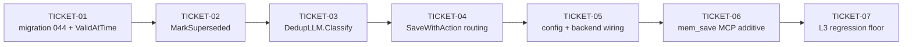

# Tasks — Bi-temporal Observations + AUDN Save Classification

> **STATUS:** `sliced` (2026-10-01)

> Sliced from `.skillgrid/specs/2026-09-24-bitemporal-audn/blueprint.md`.
> Vertical tracer-bullet tickets, dependency-ordered, sized for one fresh agent context window.

## Epic Summary

Give observations a bi-temporal validity window (`valid_at`/`invalid_at`/`superseded_by`
via additive migration 044) and make the save path classify each write
add/update/delete/noop via `SaveWithAction` + the extended `DedupLLM.Classify` seam, so
the store auto-supersedes stale facts and can answer "what was true at time T?"
(ADR-0011; per ASSUMPTIONS.md § ### ADR-0011).

## Delivery Strategy

| Field | Value |
|-------|-------|
| Estimated changed lines | ~1600 (impl ~650 + tests ~950; M-heavy single concern) |
| 400-line budget risk | High |
| Chained PRs recommended | Yes |
| Suggested split | Single change folder, 4 work-unit commits (one per ticket group) on release/2 — no feature branches per locked serial-development constraint |
| Delivery strategy | ask-on-risk |
| Chain strategy | size-exception (chained commits on release/2; each commit is its own rollback boundary) |

Decision needed before apply: Yes
Chained PRs recommended: Yes
Chain strategy: size-exception
400-line budget risk: High

### Suggested Work Units

| Unit | Goal | Likely PR | Focused test command | Runtime harness | Rollback boundary |
|------|------|-----------|----------------------|-----------------|-------------------|
| 1 | Temporal foundation: migration 044 + columns + search filter + ValidAtTime | commit on release/2 | `go test ./internal/mnemonic/store/ ./internal/mnemonic/memory/ -count=1` | real: fresh `t.TempDir()` store through 044; `TestSquashShimUpgrade` | `store/migrations/044_bitemporal.sql` + `service.go`/`governance.go` hunks; columns are additive-nullable |
| 2 | Supersede primitive + 4-way classifier seam | commit on release/2 | `go test ./internal/mnemonic/memory/ -run 'TestMarkSuperseded\|TestRunDedupCheck' -count=1` | real: fake `Classify` seam returning all 4 verdicts + error case | `lifecycle.go` MarkSuperseded + `types.go` DedupDecision/Classify hunks |
| 3 | SaveWithAction 4-way routing + Save delegate + config wiring + MCP additive response | commit on release/2 | `go test ./internal/mnemonic/... -count=1` | real: routing table with fake seams; hash-hit/hash-miss floor; MCP handler | `service.go` Save/SaveWithAction + `config/load.go` + `service/service.go` + `mcp/tools_memory.go` hunks |
| 4 | L3 verification floor (build + full suite + vet + coverage) | commit on release/2 (test files only) | `go test ./... -count=1` | real: full suite; known `http/tracker` flake passes in isolation | test files only — no behavior |

> The four plain-text guard lines above are the **contract** — `skillgrid:subagent-execution` matches them literally. If risk is High, `Chained PRs recommended` MUST be `Yes` and every work unit MUST name a focused test, a runtime harness (or `N/A` + reason), and a rollback boundary.

## Tickets

### TICKET-01 — Migration 044 + struct/scan/select/insert wiring + bi-temporal filter + ValidAtTime

- **Tracker ID:** task-022
- **Scope:** additive migration 044 (3 nullable columns + partial index); `Observation` +3 fields; `obsSelectCols`/`scanObservations`/4 inline SELECTs/7 read sites; Save INSERT stamps `valid_at`; new `ValidAtTime` time-travel query. The tracer thread: proves the temporal window is queryable before the classifier thickens the save path.
- **Acceptance:** `PRAGMA table_info(observations)` shows `valid_at`/`invalid_at`/`superseded_by`; migration re-run is a no-op; a saved observation reads back with `ValidAt == CreatedAt`, `InvalidAt == ""`, `SupersededBy` invalid; a row with `invalid_at` set is absent from `SearchWithScope`/`SearchOwnerScoped`/`SearchOwner`/`AdminCrossOwnerList`; `ValidAtTime(q, T1)` returns A-not-B and at T3 returns B-not-A for adjacent windows; `TestSquashShimUpgrade` still passes (fixture already carries `observations`).
- **SATISFIES:** New observations are valid from creation; Superseded observations are excluded from search; Time-travel query returns the fact valid at time T
- **Files:** `store/migrations/044_bitemporal.sql` (new), `memory/service.go`, `memory/governance.go`, `store/migrations_044_test.go` (new), `memory/bitemporal_test.go` (new)
- **Size:** ~650 (M)
- **Blocks:** TICKET-02, TICKET-03
- **Blocked by:** none
- **Precondition:** `TestSquashShimUpgrade` passes before the change (baseline) — `cd skillgrid-cli && go test ./internal/mnemonic/store/ -run TestSquashShim -count=1`
- **Reversibility:** one-way (migration 044 — additive nullable columns, but a released schema change; human checkpoint before applying)
- **Fails-when:** `go test ./internal/mnemonic/store/ ./internal/mnemonic/memory/ -count=1` exits non-zero, or `TestSquashShim` regresses

### TICKET-02 — MarkSuperseded + the supersede chain (invalid_at + superseded_by + status + edge)

- **Tracker ID:** task-023
- **Scope:** new `Service.MarkSuperseded` (lifecycle.go, mirrors `BumpDuplicate`) stamping `invalid_at=now, superseded_by=?, status='superseded'`; test asserts the full chain including the `supersedes` edge in `memory_relations`.
- **Acceptance:** after `MarkSuperseded(a, b)` + the edge, `Get(a)` shows `InvalidAt` set, `SupersededBy == b`, `Status == "superseded"`, and a `memory_relations` row (src=a, dst=b, relation="supersedes") exists.
- **SATISFIES:** Delete arm produces the supersede chain
- **Files:** `memory/lifecycle.go`, `memory/bitemporal_test.go`
- **Size:** ~120 (S)
- **Blocks:** TICKET-03
- **Blocked by:** TICKET-01

### TICKET-03 — DedupLLM.Classify (4-way) + runDedupCheck switch

- **Tracker ID:** task-024
- **Scope:** `DedupVerdict`/`DedupDecision` types; `Classify` added to `DedupLLM` (legacy `Dedup` kept deprecated); `runDedupCheck` switches to `Classify` returning `(DedupDecision, string)`; `Save` adapted to the new shape until Task 4 rewrites it; `isExtractedDuplicate` stays binary.
- **Acceptance:** fake `Classify` seam returning each of the 4 verdicts → `runDedupCheck` returns the decision unchanged (reason "llm"); seam error → zero decision (reason "hash"), no panic; no seam → zero decision (reason "hash"); `isExtractedDuplicate` unchanged and still binary.
- **SATISFIES:** Save returns an action label (classifier half); LLM error degrades to deterministic floor (seam half)
- **Files:** `memory/types.go`, `memory/service.go` (Save adaptation only), `memory/types_test.go`
- **Size:** ~300 (M)
- **Blocks:** TICKET-04
- **Blocked by:** TICKET-02

### TICKET-04 — SaveWithAction 4-way routing + Save delegates

- **Tracker ID:** task-025
- **Scope:** `SaveResult` + `SaveWithAction` with the 4-way routing table (noop→BumpDuplicate, add→INSERT, update→topic-key upsert, delete→INSERT then MarkSuperseded + supersedes edge); INSERT extracted into `insertObservation` helper; `Save` becomes a delegate preserving `(int64, error)`.
- **Acceptance:** routing table holds for all 4 verdicts via fake seams; deterministic floor (no seam): hash-hit → `noop` + `BumpDuplicate` (duplicate_count +1, last_seen_at refreshed), hash-miss → `add`; LLM error → non-fatal, degrades to floor; `TestSaveDelegatesToSaveWithAction`: `Save` returns the same ID, row shape unchanged; full `memory` package green.
- **SATISFIES:** Save returns an action label; Delete arm produces the supersede chain (save-path half); Deterministic floor without LLM; LLM error degrades to deterministic floor; Existing Save callers are unaffected
- **Files:** `memory/service.go`, `memory/service_test.go`
- **Size:** ~550 (M)
- **Blocks:** TICKET-05
- **Blocked by:** TICKET-03

### TICKET-05 — Config mnemonic.dedup.llm + newDedupLLMBackend wiring

- **Tracker ID:** task-026
- **Scope:** `Dedup` config section (`mnemonic.dedup.llm`, default false) in `config/load.go` mirroring `Extraction`; `newDedupLLMBackend()` in `service/service.go` (wraps the extraction LLM client, AUDN prompt) + `if cfg.Dedup.LLM { ... }` wiring next to `EnableExtractionLLM`.
- **Acceptance:** `Load` with no dedup section → `Dedup.LLM == false`; with `mnemonic.dedup.llm: true` → `true`; with the seam armed the `Classify` path is reachable end-to-end; `config` + `service` packages green.
- **SATISFIES:** LLM error degrades to deterministic floor (wiring that arms the seam); Save returns an action label (LLM path reachable)
- **Files:** `config/load.go`, `service/service.go`, `config/load_test.go`
- **Size:** ~200 (S)
- **Blocks:** TICKET-06
- **Blocked by:** TICKET-04

### TICKET-06 — mem_save MCP → SaveWithAction + additive response

- **Tracker ID:** task-027
- **Scope:** `handleMemSave` calls `SaveWithAction`; response map gains `action` (when non-empty) + `superseded_id` (when > 0) alongside existing `id` + `project`.
- **Acceptance:** `TestMemSaveMCPAdditive`: new observation → response has `id`, `project`, `action == "add"`; hash-dup → `action == "noop"`, no `superseded_id`; existing `id`/`project` fields intact (old consumers unaffected).
- **SATISFIES:** mem_save MCP response is additive
- **Files:** `mcp/tools_memory.go`, `mcp/tools_memory_test.go`
- **Size:** ~150 (S)
- **Blocks:** TICKET-07
- **Blocked by:** TICKET-05

### TICKET-07 — Full-suite regression + verification floor (L3)

- **Tracker ID:** task-028
- **Scope:** verification only — build, full `go test ./...`, `go vet`, package coverage on `./internal/mnemonic/...`. No production code changes (test files only if a regression surfaces).
- **Acceptance:** `go build ./...` clean; `go test ./... -count=1` all ok (known pre-existing `http/tracker` flake passes in isolation — not a regression); `go vet ./...` clean except the known pre-existing `budget.go:114` context-cancel leak (out of scope, do not fix here); `memory` package coverage not below its prior level.
- **SATISFIES:** All existing tests pass (no regression) — the success-criteria backstop
- **Files:** none (test files only if needed)
- **Size:** ~50 (S)
- **Blocks:** none
- **Blocked by:** TICKET-06
- **Fails-when:** any `go test` package fails outside the known `http/tracker` flake, or `go vet` reports a NEW finding in `./internal/mnemonic/...`

## Dependency Graph

## Execution Order

- **Wave 1:** TICKET-01
- **Wave 2:** TICKET-02 (after TICKET-01)
- **Wave 3:** TICKET-03 (after TICKET-02)
- **Wave 4:** TICKET-04 (after TICKET-03)
- **Wave 5:** TICKET-05 (after TICKET-04)
- **Wave 6:** TICKET-06 (after TICKET-05)
- **Wave 7:** TICKET-07 (after TICKET-06)

> **Acceptance-first (BDD is always on):** a ticket's failing acceptance
> scenario (its `SATISFIES` scenario) is written and confirmed RED *before*
> the implementation that makes it green. The dependency chain is strictly
> serial because the save path (TICKET-03/04) consumes the classifier seam
> and `MarkSuperseded` produced by earlier tickets — there is no independent
> parallel seam in this change (per ASSUMPTIONS.md § Locked constraints:
> serial development).

## Slicing Notes

- Tracer-thread shape (blueprint header): TICKET-01 is the thin end-to-end
  path through every layer (migration → columns → insert stamps → search
  filters → time-travel query). It proves the temporal window is queryable
  before the AUDN classifier thickens the save path.
- Strictly serial: the classifier seam (TICKET-03) is consumed by the routing
  (TICKET-04); `MarkSuperseded` (TICKET-02) is consumed by the delete arm
  (TICKET-04); config wiring (TICKET-05) arms the seam TICKET-03 introduced.
  No two tickets can run in parallel worktrees without interface drift.
- One-way door checkpoint: TICKET-01 carries the human checkpoint
  (migration 044) — confirm the baseline `TestSquashShimUpgrade` precondition
  before applying.
- Work units map to delivery commits: Unit 1 = TICKET-01, Unit 2 =
  TICKET-02+03, Unit 3 = TICKET-04+05+06, Unit 4 = TICKET-07.
- Per blueprint: the 4 inline FTS/admin SELECTs do NOT use `obsSelectCols` —
  TICKET-01 must add the 3 columns to all 5 SELECT sites (obsSelectCols + 4
  inline) so `scanObservations` gets the 3 extra values.
- `isExtractedDuplicate` (types.go) stays binary on `Dedup` — do not change it
  (briefing C2: the extraction path only needs "is this a dup?").
