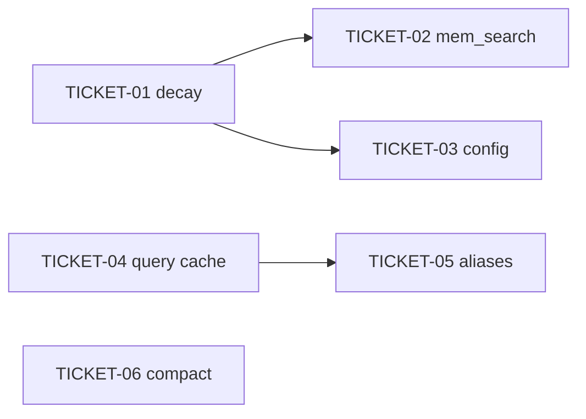

# Tasks — Mnemonic memory improvements

> **STATUS:** `sliced` (2026-10-02)

> Sliced from `.skillgrid/specs/2026-09-24-mnemonic-memory-improvements/blueprint.md`.
> Vertical tracer-bullet tickets, dependency-ordered, sized for one fresh agent context window.

## Epic Summary

Owner-scoped `mem_search` gains RRF fusion and additive search signals, reinforcement decay re-ranks hot observations, query embeddings are cached, code search resolves entity aliases, and a compact hook writes a continuity observation. Per ADR-0018. C6 stays out.

## Delivery Strategy

| Field | Value |
|-------|-------|
| Estimated changed lines | 700–1100 |
| 400-line budget risk | High |
| Chained PRs recommended | Yes |
| Suggested split | one branch, six commits (serial development) |
| Delivery strategy | exception-ok |
| Chain strategy | size-exception |

Decision needed before apply: No
Chained PRs recommended: Yes
Chain strategy: size-exception
400-line budget risk: High

Ruling: `ASSUMPTIONS.md` § Locked constraints forbids parallel branches. The 2026-10-02 execute request accepts one branch over a PR chain. Rollback is `git revert` of the work-unit commits.

### Suggested Work Units

| Unit | Goal | Likely PR | Focused test command | Runtime harness | Rollback boundary |
|------|------|-----------|----------------------|-----------------|-------------------|
| 1 | Decay ranker | this branch, commit 1 | `cd skillgrid-cli && go test ./internal/mnemonic/memory/ -count=1 -run 'TestReinforcement|TestDecay|TestEqualDecay'` | N/A — pure function, no process | `decay.go` + its test |
| 2 | mem_search signals | this branch, commit 2 | `cd skillgrid-cli && go test ./internal/mnemonic/memory/ ./internal/mnemonic/mcp/ -count=1 -run 'TestOwnerScopedBlend|TestMemSearchSignals'` | N/A — `go test` drives the MCP handler in-process | blend + DTO; revert restores BM25 `mem_search` |
| 3 | decay config | this branch, commit 3 | `cd skillgrid-cli && go test ./internal/mnemonic/config/ ./internal/mnemonic/memory/ -count=1 -run 'TestDecay|TestLoadDecay'` | N/A — config parse test | config keys + `SetDecay` call |
| 4 | query cache | this branch, commit 4 | `cd skillgrid-cli && go test ./internal/mnemonic/memory/ ./internal/mnemonic/store/ -count=1 -run 'TestQueryCache|TestMigration045'` | N/A — sqlite temp store | migration table + cache file |
| 5 | entity aliases | this branch, commit 5 | `cd skillgrid-cli && go test ./internal/mnemonic/codeindex/ -count=1 -run 'TestEntityAlias'` | N/A — sqlite temp store | alias table + lookup |
| 6 | compact hook | this branch, commit 6 | `cd skillgrid-cli && go test ./internal/mnemonic/memory/ -count=1 -run 'TestCompactHook'` | N/A — `RunHook` in-process | `HookCompact` arm |

## Tickets

### TICKET-01 — Reinforcement decay ranker

- **Tracker ID:** TASK-030.01
- **Scope:** Pure `Reinforcement` and `rankByDecay` with pinned-first stable sort. Per ADR-0018.
- **Acceptance:** Hot row (usage 20, seen 40 days ago) ranks above a cold twin; importance ≥ 4 freezes the half-life term; equal factors keep input order.
- **SATISFIES:** high retrieval_usage outranks a cold twin
- **Files:** `memory/decay.go`, `memory/decay_test.go`
- **Size:** ~250 (S)
- **Blocks:** TICKET-02, TICKET-03
- **Blocked by:** none
- **Fails-when:** `go test` exit non-zero

### TICKET-02 — Owner-scoped blend and mem_search signals

- **Tracker ID:** TASK-030.04
- **Scope:** `SearchOwnerScopedBlend` plus additive `signals` / `matched_via` / `score` on `mem_search`. Does not call `BlendedSearch`. Per ADR-0018.
- **Acceptance:** No embedder → `matched_via=keyword` and BM25 order when decay factors match; embedder on → hybrid or vector; other owner's private row absent; embedder error stays keyword; missing query still errors.
- **SATISFIES:** mem_search without an embedder is keyword only
- **Files:** `memory/search_blend.go`, `memory/search_blend_test.go`, `mcp/tools_memory.go`, `mcp/tools_memory_signals_test.go`
- **Size:** ~700 (M)
- **Blocks:** none
- **Blocked by:** TICKET-01
- **Reversibility:** costly
- **Fails-when:** `go test` exit non-zero or a private id appears in reader B's hits

### TICKET-03 — Decay config

- **Tracker ID:** TASK-030.05
- **Scope:** `mnemonic.decay` YAML, default enabled, explicit false opts out, wired through `SetDecay`.
- **Acceptance:** Absent section → enabled and half-life 30; `enabled: false` leaves BM25 order on the blend.
- **SATISFIES:** decay disabled keeps BM25 order
- **Files:** `config/load.go`, `config/load_test.go`, `service/service.go`, `memory/service.go`
- **Size:** ~200 (S)
- **Blocks:** none
- **Blocked by:** TICKET-01
- **Fails-when:** `go test` exit non-zero

### TICKET-04 — Query embedding cache

- **Tracker ID:** TASK-030.02
- **Scope:** `query_cache` table and `CachedEmbedQuery`. Hash is SHA-256 of model + newline + query. TTL 7 days.
- **Acceptance:** Second identical call does not invoke the embedder; 8-day-old row and a different model do.
- **SATISFIES:** second identical query is a cache hit
- **Files:** `store/migrations/045_search_aids.sql`, `store/migrations_045_test.go`, `memory/query_cache.go`, `memory/query_cache_test.go`, mem_search embed call site
- **Size:** ~350 (S)
- **Blocks:** TICKET-05
- **Blocked by:** none
- **Fails-when:** `go test` exit non-zero or the query string is stored in the table

### TICKET-05 — Entity aliases

- **Tracker ID:** TASK-030.06
- **Scope:** Append `entity_aliases` to migration 045. Case-insensitive lookup before code FTS. Index-time rows for symbol name and qualified name only.
- **Acceptance:** `The Renderer` resolves to `comp_renderer.cpp`; an unknown alias returns no rows and FTS still runs.
- **SATISFIES:** alias lookup finds the symbol
- **Files:** `045_search_aids.sql`, `codeindex/aliases.go`, `codeindex/aliases_test.go`, the existing symbol-search call site, symbol upsert
- **Size:** ~400 (S)
- **Blocks:** none
- **Blocked by:** TICKET-04
- **Reversibility:** costly
- **Fails-when:** `go test` exit non-zero

### TICKET-06 — Compact hook

- **Tracker ID:** TASK-030.03
- **Scope:** `RunHook` accepts `compact`, writes one upserted continuity observation, 3s budget, fail-open.
- **Acceptance:** A session with observations gains `topic_key` `compaction/<session>`. A hook that waits on `ctx.Done()` returns nil error and `Distilled=false`. Disabled hooks still error.
- **SATISFIES:** compact hook saves continuity
- **Files:** `memory/skills.go`, `memory/compact_hook_test.go`, `cmd/skillgrid/mem.go` if the allow-list rejects the type
- **Size:** ~250 (S)
- **Blocks:** none
- **Blocked by:** none
- **Fails-when:** `go test` exit non-zero or the timeout returns `hookTimeoutError`

## Dependency Graph

## Execution Order

- Wave 1: TICKET-01 (door), TICKET-04, TICKET-06 — no blockers. Execute serially on this branch, 01 first.
- Wave 2: TICKET-02, TICKET-03 after 01; TICKET-05 after 04.
- Smallest usable whole is done when TICKET-02 is green.
