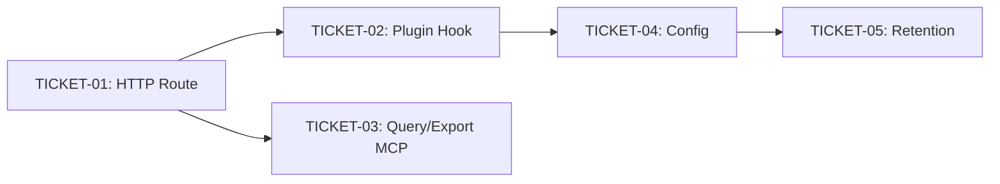

# Tasks — Monitoring: Track Every Tool Call

> Sliced from `.skillgrid/specs/2026-09-24-mnemonic-monitoring/blueprint.md`.
> Vertical tracer-bullet tickets, dependency-ordered, sized for one fresh agent context window.

## Epic Summary

Wires the per-tool-call capture trigger (plugin `tool.execute.after` → `POST /sessions/{id}/tool-calls` → existing `hookPostToolUse` → `session_events` row), adds a Gryph-style audit query surface (`mem_query_events` + `mem_export_events`), enforces 90-day retention, and extends `<private>` tag stripping to every tool call + an always-private tool allowlist. Build shape: tracer thread — the capture path works end-to-end first, then thickens.

## Delivery Strategy

| Field | Value |
|-------|-------|
| Estimated changed lines | ~600 (500-700) |
| 400-line budget risk | Medium |
| Chained PRs recommended | No |
| Suggested split | Single PR |
| Delivery strategy | ask-on-risk |
| Chain strategy | pending |

Decision needed before apply: Yes
Chained PRs recommended: No
Chain strategy: pending
400-line budget risk: Medium

### Suggested Work Units

| Unit | Goal | Likely PR | Focused test command | Runtime harness | Rollback boundary |
|------|------|-----------|----------------------|-----------------|-------------------|
| 1 | Capture path (route + plugin hook) | PR 1 | `go test ./skillgrid-cli/internal/mnemonic/http/ -run TestToolCallRoute -v && node --test plugins/opencode/mnemonic.test.mjs` | Live opencode session with ≥ 2 tool calls (backstop) | `http/toolcalls.go` + plugin hook extension (revert removes capture, query surface unaffected) |
| 2 | Query + retention + config | PR 1 (same) | `go test ./skillgrid-cli/internal/mnemonic/memory/ -run 'TestQueryEvents|TestExportEvents|TestPruneOldEvents' -v && go test ./skillgrid-cli/internal/mnemonic/mcp/ -run TestMemQueryEvents -v && go test ./skillgrid-cli/internal/mnemonic/config/ -run 'TestLoad_HooksDefaultOn|TestLoad_RetentionDaysDefault|TestLoad_PrivateTools' -v` | N/A — in-process SQL, no runtime harness needed | `memory/query_events.go` + `memory/retention.go` + `mcp/tools_query_events.go` + config keys (revert removes read/retention surface, capture path unaffected) |

> The four plain-text guard lines above are the **contract** — `skillgrid:subagent-execution` matches them literally. If risk is High, `Chained PRs recommended` MUST be `Yes` and every work unit MUST name a focused test, a runtime harness (or `N/A` + reason), and a rollback boundary.

## Tickets

### TICKET-01 — `POST /sessions/{id}/tool-calls` HTTP Route

- **Scope:** Create the HTTP route that the plugin POSTs per tool call. Thin adapter over `memory.RunHook(HookPostToolUse)` — parses canonical event body, maps to `HookPayload`, calls `RunHook`, returns 200/404/400.
- **Acceptance:** `go test ./skillgrid-cli/internal/mnemonic/http/ -run TestToolCallRoute -v` passes (3 tests: writes-row, unknown-session 404, sensitive-flag).
- **SATISFIES:** `tool-calls-route-writes-a-session-events-row`, `tool-calls-route-returns-404-for-unknown-session`, `tool-calls-route-flags-sensitive-paths`
- **Files:** `http/toolcalls.go` (new), `http/toolcalls_test.go` (new), `http/server.go` (modify: register route)
- **Size:** ~150 (S)
- **Blocks:** TICKET-02
- **Blocked by:** none
- **Fails-when:** `go test ./skillgrid-cli/internal/mnemonic/http/ -run TestToolCallRoute` exits non-zero

### TICKET-02 — Plugin `tool.execute.after` Extension (Capture Trigger)

- **Scope:** Extend the opencode/kilo plugin's `tool.execute.after` hook (previously Task-only) to POST a canonical event for every non-Task tool call. Extract the inline body into a testable `MnemonicHookAfter` export. Add `<private>` stripping + always-private tool allowlist (env var `SKILLGRID_MNEMONIC_PRIVATE_TOOLS`). Observe-mode, fail-open.
- **Acceptance:** `node --test plugins/opencode/mnemonic.test.mjs` passes (4 tests: fires-non-task, not-task, private-strip, always-private).
- **SATISFIES:** `plugin-hook-fires-for-non-task-tools`, `plugin-hook-does-not-fire-the-tool-call-post-for-task`, `plugin-hook-strips-private-spans`, `plugin-hook-strips-always-private-tool-output`
- **Files:** `plugins/opencode/mnemonic.ts` (modify), `plugins/opencode/mnemonic.test.mjs` (modify), `plugins/kilo/mnemonic.ts` (modify), `plugins/kilo/mnemonic.test.mjs` (modify)
- **Size:** ~200 (S)
- **Blocks:** none
- **Blocked by:** TICKET-01
- **Fails-when:** `node --test plugins/opencode/mnemonic.test.mjs` exits non-zero

### TICKET-03 — `mem_query_events` + `mem_export_events` MCP Tools

- **Scope:** Create `QueryEvents` + `ExportEvents` over `session_events` (filtered read: action, file glob, since/until, session, sensitive, count-only). Register `mem_query_events` and `mem_export_events` MCP tools. Sensitive events excluded by default.
- **Acceptance:** `go test ./skillgrid-cli/internal/mnemonic/memory/ -run 'TestQueryEvents|TestExportEvents' -v && go test ./skillgrid-cli/internal/mnemonic/mcp/ -run TestMemQueryEvents -v` passes.
- **SATISFIES:** `mem-query-events-filters-by-action`, `mem-query-events-excludes-sensitive-by-default`, `mem-query-events-includes-sensitive-with-flag`, `mem-query-events-count-only`, `mem-export-events-returns-jsonl`
- **Files:** `memory/query_events.go` (new), `memory/query_events_test.go` (new), `mcp/tools_query_events.go` (new), `mcp/tools_query_events_test.go` (new), `mcp/server.go` (modify: register tools)
- **Size:** ~250 (S)
- **Blocks:** none
- **Blocked by:** TICKET-01
- **Fails-when:** `go test ./skillgrid-cli/internal/mnemonic/memory/ -run 'TestQueryEvents|TestExportEvents'` exits non-zero

### TICKET-04 — Config: `retention_days`, `private_tools`, `hooks.enabled` default flip

- **Scope:** Add `mnemonic.retention_days` (default 90) and `mnemonic.private_tools` config keys. Flip `mnemonic.hooks.enabled` default from `false` to `true`. Installer writes `SKILLGRID_MNEMONIC_PRIVATE_TOOLS` env var from config.
- **Acceptance:** `go test ./skillgrid-cli/internal/mnemonic/config/ -run 'TestLoad_HooksDefaultOn|TestLoad_RetentionDaysDefault|TestLoad_PrivateTools' -v` passes.
- **SATISFIES:** `hooks-default-to-enabled`, `retention-days-default-to-90`
- **Files:** `config/load.go` (modify), `config/load_test.go` (modify), `setup/opencode.go` (modify)
- **Size:** ~100 (S)
- **Blocks:** TICKET-05
- **Blocked by:** TICKET-02
- **Reversibility:** one-way
- **Fails-when:** `go test ./skillgrid-cli/internal/mnemonic/config/ -run 'TestLoad_HooksDefaultOn|TestLoad_RetentionDaysDefault|TestLoad_PrivateTools'` exits non-zero

### TICKET-05 — 90-Day Retention Pass

- **Scope:** Create `PruneOldEvents(ctx, days)` — DELETEs `session_events` rows older than N days, returns count. Wire into serve startup (best-effort, logged, never fatal).
- **Acceptance:** `go test ./skillgrid-cli/internal/mnemonic/memory/ -run TestPruneOldEvents -v` passes (2 tests: prunes-old, keeps-recent).
- **SATISFIES:** `retention-prunes-old-events`, `retention-keeps-recent-events`
- **Files:** `memory/retention.go` (new), `memory/retention_test.go` (new), serve startup file (modify: call `PruneOldEvents` once)
- **Size:** ~80 (S)
- **Blocks:** none
- **Blocked by:** TICKET-04
- **Reversibility:** one-way
- **Fails-when:** `go test ./skillgrid-cli/internal/mnemonic/memory/ -run TestPruneOldEvents` exits non-zero

## Dependency Graph

## Execution Order

- **Wave 1:** TICKET-01 (HTTP route — the tracer thread's first layer)
- **Wave 2 (parallel):** TICKET-02 (plugin hook), TICKET-03 (query/export MCP tools)
- **Wave 3:** TICKET-04 (config + one-way-door default flip)
- **Wave 4:** TICKET-05 (retention + one-way-door auto-deletion)

> **Acceptance-first (BDD is always on):** each ticket's failing acceptance scenario (its `SATISFIES` scenario) is written and confirmed RED *before* the implementation that makes it green. The blueprint's per-task steps follow the TDD cycle (Step 1: write failing test → Step 2: confirm RED → Step 3: implement → Step 4: confirm GREEN → Step 5: commit).

## Slicing Notes

- **Tracer thread:** TICKET-01 is the thin end-to-end path (route → `RunHook` → `session_events` row). TICKET-02 thickens it with the plugin trigger. Together they prove "every tool call is recorded" before the query surface (TICKET-03) or retention (TICKET-05) exist.
- **TICKET-02 blocks TICKET-04** (not TICKET-01→TICKET-04) because the always-private allowlist env var is read by the plugin (TICKET-02) and the installer writes it from config (TICKET-04) — the config key must exist before the installer can write it, and the plugin must exist before the env var has a consumer.
- **Two one-way doors:** TICKET-04 (hooks.enabled default flip — changes fresh-install behavior) and TICKET-05 (90-day auto-deletion — irreversible data loss). Both insert a human checkpoint before commit.
- **No migration in this spec:** `session_events` table (migration 040) is pre-existing from the session-events-layer spec.
- **Kilo plugin:** TICKET-02 modifies both `plugins/opencode/mnemonic.ts` and `plugins/kilo/mnemonic.ts` (sibling copy, same change, same commit).
