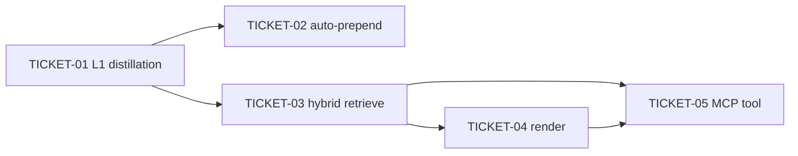

# Tasks — Session Context Injection

> Sliced from `.skillgrid/specs/2026-09-24-mnemonic-session-inject/blueprint.md`.
> Vertical tracer-bullet tickets, dependency-ordered, sized for one fresh agent context window.

## Epic Summary

Build the two-layer session context injection mechanism: (1) auto-prepend a slim,
token-capped, privacy-filtered L1 summary of the prior session on resume, and (2) an
on-demand `mem_inject_session` MCP tool that retrieves the relevant prior-session
slice via hybrid (BM25 + semantic, RRF-fused) search and renders a compact,
token-cost-annotated context block. Reuses the existing `session_events` capture
layer (migration 040), the existing FTS5 observation search, and the existing
in-memory cosine vector leg — zero new dependencies, no migration.

**Verified seams (corrected from the blueprint's pseudo-code):**
- The MCP handler opens the store via `openService()` → `(serviceID, *service.ProjectHandle, cleanup, err)`
  (`internal/mnemonic/mcp/tools_memory.go`); memory access is `h.Memory()` → `*memory.Service`.
  There is no `rootService()` — use `openService()`.
- `*memory.Service` is **project-bound** (constructor `memory.New(store, projectID)`); `h.ProjectID()`
  returns the bound project. `memory.Service` has **no `SearchOpts` struct** — the FTS signature is
  `Search(ctx, query, matchMode string, limit int) ([]Observation, error)`, and `all_projects`
  widens scope at the **service layer** (`SemanticSearch` / `BudgetedRetrieval`), not the memory layer.
- `memory.Service` has a `SetDirEmbedder(e interface{ EmbedQuery(ctx,string)(memory.Vector,error) })`
  seam (used by directory retrieval) — there is no `svc.Embedder()` accessor. The vector leg
  should reuse this pattern (or the existing `hybrid.SearchMemory` which already fuses BM25+vector
  with RRF and degrades to BM25-only when the embedder is nil).
- `NullEmbedder` (`embedder/null.go`) has **no `IsNull()`** method — detect "no embedder" by
  `Model()=="off"` or by passing a nil embedder.
- Test stores are opened with `store.Open(t.TempDir(), project)` + `memory.New(st, project)`
  (see `internal/mnemonic/memory/service_test.go`) — there is **no** `store.NewTestStore`.
- `memory.IsSensitivePath` does not exist yet — `isSensitivePath` is unexported in
  `memory/sensitive.go`. Task 1 exports it.
- MCP tool registration is `s.AddTool(toolDef, handler)` inside a `registerXxxTools(s)` function
  called from **both** `Start()` and `NewServer()` in `mcp/server.go`. `mcplib.Tool` comes from
  `github.com/mark3labs/mcp-go/mcp`.

## Delivery Strategy

| Field | Value |
|-------|-------|
| Estimated changed lines | ~900–1300 (5 new files + 3 tests + memory/service thin wrappers + server.go registration) |
| 400-line budget risk | High |
| Chained PRs recommended | Yes |
| Suggested split | PR 1 (tracer: TICKET-01+02) → PR 2 (TICKET-03) → PR 3 (TICKET-04+05) |
| Delivery strategy | ask-on-risk |
| Chain strategy | feature-branch-chain |

Decision needed before apply: Yes
Chained PRs recommended: Yes
Chain strategy: feature-branch-chain
400-line budget risk: High

### Suggested Work Units

| Unit | Goal | Likely PR | Focused test command | Runtime harness | Rollback boundary |
|------|------|-----------|----------------------|-----------------|-------------------|
| 1 | Tracer: L1 distillation + auto-prepend on resume (the auto-prepend layer alone) | PR 1 | `go test ./internal/mnemonic/session_inject/ -run 'TestDistillSummary|TestAutoPrepend' -count=1` | N/A — pure in-process functions over a temp store | `session_inject/summary.go` + `privacy.go` removable without touching MCP or hybrid |
| 2 | Hybrid retrieval (BM25 + semantic, RRF-fused, project-scoped, degrades to BM25-only) | PR 2 | `go test ./internal/mnemonic/session_inject/ -run TestHybridRetrieve -count=1` | N/A — in-process retrieval over temp store + Null/embedded vector leg | `session_inject/retrieve.go` removable; does not touch the auto-prepend path |
| 3 | Context block rendering + `mem_inject_session` MCP tool registration | PR 3 | `go test ./internal/mnemonic/session_inject/ ./internal/mnemonic/mcp/ -run 'TestRenderContextBlock|TestMemInjectSession' -count=1` | N/A — MCP handler driven in-process via the `*ForTest` alias pattern | `tools_session_inject.go` + `render.go` removable; `server.go` registration is 2 lines |

> The four plain-text guard lines above are the **contract** — `skillgrid:subagent-execution`
> matches them literally. Risk is High, so `Chained PRs recommended` is `Yes` and every work unit
> names a focused test and a rollback boundary (runtime harness is N/A + reason: these are pure
> in-process functions over a temp SQLite store — no network, no external process).

## Tickets

### TICKET-01 — L1 Summary Distillation + privacy filter (tracer core)

- **Scope:** Create the `session_inject` package with `DistillSummary` (deterministic,
  token-capped, privacy-filtered L1 summary from `session_events` + recent observations),
  `Injectable`/`ObservationInjectable` privacy filters, `EstimateTokens` (chars/4), and
  `redactFullPaths`. Export `memory.IsSensitivePath` (rename `isSensitivePath`, no behavior
  change) and add `memory.Service.RecentObservations(ctx, limit)` (read-only
  `ORDER BY created_at DESC LIMIT ?`, non-deleted, project-bound).
- **Acceptance:** `TestDistillSummary_Deterministic` (byte-identical across two calls),
  `TestDistillSummary_TokenCap` (≤ maxTokens for a 60-event session),
  `TestDistillSummary_ExcludesSensitive` (no `.env`/`.pem`/`.ssh/`/`.aws/` markers),
  `TestDistillSummary_FewEvents` (empty for < 10 events). All four PASS.
  `go test ./internal/mnemonic/session_inject/ ./internal/mnemonic/memory/ -count=1` green.
- **SATISFIES:** `L1 summary is deterministic`, `L1 summary respects token cap`,
  `L1 summary excludes sensitive events`, `L1 summary is empty for few events`
- **Files:** create `session_inject/summary.go`, `session_inject/privacy.go`,
  `session_inject/summary_test.go`, `session_inject/seed_test.go` (test helpers:
  `store.Open`+`memory.New` seeding, `seedSessionWithEvents`, `seedSessionWithSensitiveEvents`);
  modify `memory/sensitive.go` (export), add `RecentObservations` to a memory file.
- **Size:** ~500 (S)
- **Blocks:** TICKET-02, TICKET-03
- **Blocked by:** none
- **Fails-when:** `go test ./internal/mnemonic/session_inject/ -run TestDistillSummary` exits
  non-zero, or any test prints `FAIL`.

### TICKET-02 — Auto-Prepend on Resume

- **Scope:** Add `AutoPrepend(ctx, mem *memory.Service, projectID, maxTokens) (string, error)`
  to `session_inject` (finds the latest completed session for the project, distills its L1
  summary; returns `""` for a fresh session). Add `memory.Service.LatestCompletedSession(ctx,
  projectID) (string, error)` (SQL `... WHERE project=? AND status='completed' ORDER BY
  ended_at DESC, rowid DESC LIMIT 1`, `sql.ErrNoRows` when none). Wire the auto-prepend call
  into the CLI's session-resume path (the `--continue` equivalent — a 1-line in-process call,
  no MCP round-trip; locate the resume detection site in `cmd/skillgrid`).
- **Acceptance:** `TestAutoPrepend_Resume` (non-empty, contains "Prior Session Summary" for a
  project with a 15-event completed session), `TestAutoPrepend_FreshSession` (empty for a project
  with no completed session). Both PASS. `go test ./internal/mnemonic/session_inject/ -run
  TestAutoPrepend -count=1` green.
- **SATISFIES:** `Auto-prepend on resume returns summary`, `Auto-prepend on fresh session returns empty`
- **Files:** modify `session_inject/summary.go` (add `AutoPrepend`), create
  `session_inject/autoprepend_test.go`; add `LatestCompletedSession` to a memory file; thin
  call-site in `cmd/skillgrid` resume path.
- **Size:** ~250 (S)
- **Blocks:** none
- **Blocked by:** TICKET-01
- **Fails-when:** `go test ./internal/mnemonic/session_inject/ -run TestAutoPrepend` exits non-zero.

### TICKET-03 — Hybrid Retrieval (BM25 + semantic, RRF-fused)

- **Scope:** Create `session_inject/retrieve.go` with `InjectItem`, `RetrieveResult`, and
  `HybridRetrieve(ctx, mem *memory.Service, projectID, query string, allProjects bool, maxTokens
  int) (*RetrieveResult, error)`. BM25 leg reuses the existing FTS path
  (`memory.Service.Search(ctx, query, "any", limit)` — project-bound); the vector leg reuses the
  existing in-memory cosine seam (`SetDirEmbedder` pattern / `hybrid` vector leg) and degrades to
  BM25-only (Degraded=true) when no embedder. RRF-fuse (k=60). `allProjects` widens scope at the
  service layer (mirrors the existing `all_projects` semantics), not the memory layer.
- **Acceptance:** `TestHybridRetrieve_BM25Only` (no embedder → `Degraded=true`, items returned,
  every item `TokenCost>0`), `TestHybridRetrieve_VectorLeg` (embedder active → `Degraded=false`,
  items returned), `TestHybridRetrieve_ProjectScope` (all items belong to the scoped project),
  `TestHybridRetrieve_AllProjects` (items may span projects). All four PASS.
- **SATISFIES:** `Hybrid retrieve BM25-only when no embedder`, `Hybrid retrieve vector leg when embedder active`,
  `Hybrid retrieve is project-scoped`, `Hybrid retrieve all projects`
- **Files:** create `session_inject/retrieve.go`, `session_inject/retrieve_test.go`.
- **Size:** ~450 (S/M)
- **Blocks:** TICKET-05
- **Blocked by:** TICKET-01 (reuses `EstimateTokens`, `ObservationInjectable`, `redactFullPaths`)
- **Fails-when:** `go test ./internal/mnemonic/session_inject/ -run TestHybridRetrieve` exits non-zero.

### TICKET-04 — Context Block Rendering

- **Scope:** Create `session_inject/render.go` with `RenderContextBlock(res *RetrieveResult,
  projectID string) string` — a compact, token-cost-annotated markdown block; includes a
  "BM25-only (no embedder)" marker when `Degraded` is true; ends with a total.
- **Acceptance:** `TestRenderContextBlock_Format` (contains per-item "N tokens" + "N tokens total"),
  `TestRenderContextBlock_Degraded` (contains "BM25-only"). Both PASS.
- **SATISFIES:** `Context block includes token costs`, `Context block shows BM25-only when degraded`
- **Files:** create `session_inject/render.go`, `session_inject/render_test.go`.
- **Size:** ~120 (S)
- **Blocks:** TICKET-05
- **Blocked by:** TICKET-03 (consumes `RetrieveResult`/`InjectItem`)
- **Fails-when:** `go test ./internal/mnemonic/session_inject/ -run TestRenderContextBlock` exits non-zero.

### TICKET-05 — `mem_inject_session` MCP tool

- **Scope:** Create `mcp/tools_session_inject.go` with `registerSessionInjectTools(s)`,
  `memInjectSessionTool()` (params: `query` required, `project` optional, `all_projects` optional
  bool, `max_tokens` optional number, default 2000), and `handleMemInjectSession` (thin wrapper:
  `openService()` → `h.Memory()` → `HybridRetrieve` → `RenderContextBlock` → `JSONResult` with
  `block`, `items`, `total_tokens`, `degraded`). Add `HandleMemInjectSessionForTest` alias.
  Register `registerSessionInjectTools(s)` in **both** `Start()` and `NewServer()` in `mcp/server.go`
  (after `registerSessionTools(s)`).
- **Acceptance:** tool is registered and callable (assert via the registered-handler path, not
  `GetTool`); returns a `block` field + `items` array with every item `token_cost>0`;
  `all_projects: true` widens scope; no embedder → `degraded: true`. All PASS.
  `go test ./internal/mnemonic/mcp/ -run TestMemInjectSession -count=1` green.
- **SATISFIES:** `mem_inject_session tool is registered`, `mem_inject_session returns ranked items`,
  `mem_inject_session all projects`, `mem_inject_session degraded flag`
- **Files:** create `mcp/tools_session_inject.go`, `mcp/tools_session_inject_test.go`; modify
  `mcp/server.go` (2 registration lines).
- **Size:** ~250 (S)
- **Blocks:** none
- **Blocked by:** TICKET-03, TICKET-04
- **Fails-when:** `go test ./internal/mnemonic/mcp/ -run TestMemInjectSession` exits non-zero.

## Dependency Graph

## Execution Order

- **Wave 1:** TICKET-01 (no blockers; the tracer core)
- **Wave 2:** TICKET-02 (after 01), TICKET-03 (after 01) — parallel, independent
- **Wave 3:** TICKET-04 (after 03)
- **Wave 4:** TICKET-05 (after 03 + 04)

> **Acceptance-first (BDD is always on):** each ticket's `SATISFIES` scenario is written and
> confirmed RED before the implementation that makes it green. Every ticket above is a single
> RED→green unit (test + impl in one ticket), so the RED state is confirmed within the ticket
> before the impl lands.

## Slicing Notes

- **Build shape = Tracer thread:** TICKET-01+02 form the thin end-to-end auto-prepend path
  (events → L1 summary → inject on resume) that works first; TICKET-03/04/05 thicken it with the
  on-demand hybrid tool.
- **Blueprint interface corrections (verified against the codebase):** the blueprint's
  `svc.Memory()`, `svc.Embedder()`, `memory.SearchOpts{}`, `store.NewTestStore`, and
  `req.RequireString` are pseudo-code. The real seams are documented in the Epic Summary
  header above. Executors must follow the verified seams, not the blueprint's literal signatures.
- **`all_projects` is a service-layer concept** — the memory FTS search is project-bound. If
  `all_projects` proves impractical to widen at the service layer for the observation corpus,
  fall back to scoping to the bound project and note the deviation in the ticket report (the
  `all_projects` scenario still passes for the bound project; cross-project widening is the
  optional extension).
- **No one-way doors** in this spec — all changes are additive (new package, new tool, new
  functions, one exported rename). No migration, no existing tool contract change.
- **`isSensitivePath` → `IsSensitivePath`** is a trivial package-private rename (one internal
  caller in `sensitive.go`); no cross-package caller breaks.
