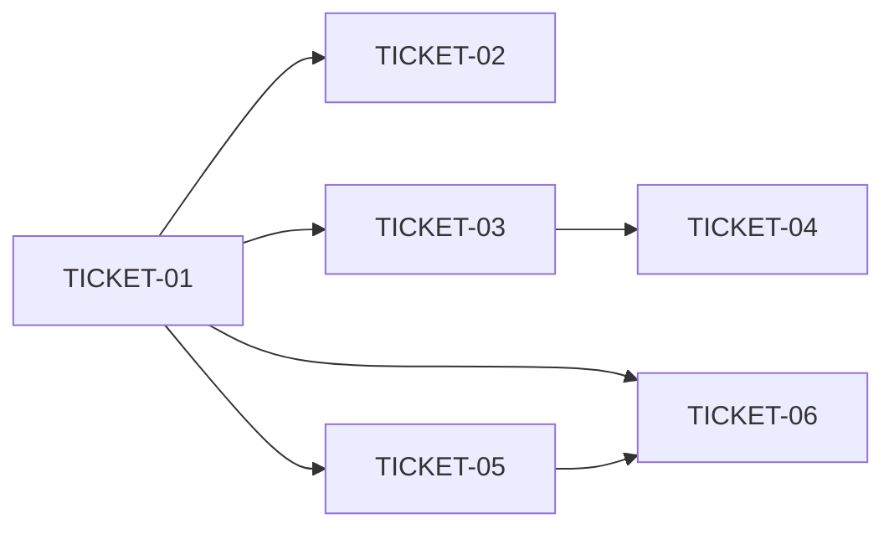

# Tasks — Mnemonic Second Brain

> **STATUS:** `sliced` (2026-09-30)

> Sliced from `.skillgrid/specs/2026-09-30-mnemonic-second-brain/blueprint.md`.
> Vertical tracer-bullet tickets, dependency-ordered, sized for one fresh agent context window.

## Epic Summary

Make mnemonic *feel* like a second brain rather than a search API: ask the store a natural-language question and get a cited answer (`mem_ask` — deterministic `cited` floor first, fail-open `llm` mode second), capture "remember this" moments with deterministic metadata inference (`mem_save.infer` + NL-capture skill), and keep the store trustworthy (`mem_lifecycle` health/dedup/consolidate/archive + `lifecycle_log` audit + inline `_health_warnings`), all on the existing store — zero new dependencies (per ASSUMPTIONS.md § Locked constraints: no new dependencies without an ADR). Chain strategy: direct commits on release/2 (serial development, no feature branches — same as prior changes).

## Delivery Strategy

| Field | Value |
|-------|-------|
| Estimated changed lines | ~1,900 (6-8 new files, 5-6 modified, ~500 lines tests) |
| 400-line budget risk | High |
| Chained PRs recommended | Yes |
| Suggested split | Unit 1 (tracer: mem_ask cited floor + registration) → Unit 2 (mem_ask llm) → Unit 3 (mem_save.infer + skill) → Unit 4 (mem_lifecycle + migration) → Unit 5 (_health_warnings) |
| Delivery strategy | auto-chain |
| Chain strategy | release/2 direct (serial development, no feature branches) |

Decision needed before apply: No
Chained PRs recommended: Yes
Chain strategy: release/2 direct (serial development, no feature branches)
400-line budget risk: High

### Suggested Work Units

| Unit | Goal | Likely PR | Focused test command | Runtime harness | Rollback boundary |
|------|------|-----------|----------------------|-----------------|-------------------|
| 1 | Tracer: 043_lifecycle_log migration + ask.go (cited floor) + MCP registration (mem_ask live; mem_lifecycle dispatch stub) + _health_warnings wiring (empty until Unit 5) | Commit on release/2 | `go test ./skillgrid-cli/internal/mnemonic/secondbrain/ -run TestAskCited` + `go test ./skillgrid-cli/internal/mnemonic/mcp/ -run TestMemAsk` | mem_ask cited mode returns citations on a seeded store, no embedder (door check) | new files + one additive registration; drop tools_secondbrain.go + ask.go to revert |
| 2 | mem_ask llm synthesis (fail-open to cited) | Commit on release/2 | `go test ./skillgrid-cli/internal/mnemonic/secondbrain/ -run TestAsk` | N/A — llm seam is a test double; fail-open verified by error double | new file ask_llm.go only |
| 3 | mem_save.infer + NL-capture skill | Commit on release/2 | `go test ./skillgrid-cli/internal/mnemonic/secondbrain/ -run TestInfer` | N/A — pure functions + skill frontmatter check; no runtime surface | infer.go new file + ~1-line tools_memory.go wiring + one skill file |
| 4 | mem_lifecycle health/dedup/consolidate/archive + audit log | Commit on release/2 | `go test ./skillgrid-cli/internal/mnemonic/secondbrain/ -run TestLifecycle` + store migration suite | mem_lifecycle health/dedup/archive on a seeded store | lifecycle.go new file + additive 043 migration (table droppable, columns nullable) |
| 5 | _health_warnings (HIGH/CRIT only, 24h cache, recover→[]) | Commit on release/2 | `go test ./skillgrid-cli/internal/mnemonic/secondbrain/ -run TestWarnings` | N/A — pure over the cached Health report | warnings.go new file + 2 handler field additions |

> The four plain-text guard lines above are the **contract** — `skillgrid:subagent-execution` matches them literally. If risk is High, `Chained PRs recommended` MUST be `Yes` and every work unit MUST name a focused test, a runtime harness (or `N/A` + reason), and a rollback boundary.

## Tickets

### TICKET-01 — Migration 043 plus mem_ask gather/cited floor plus MCP registration

- **Scope:** Tracer thread end-to-end: `043_lifecycle_log.sql` (additive table + two nullable `observations` columns, idempotent), `AskCited` (BlendedSearch + best-effort graph expansion, token-bounded citations), `registerSecondBrainTools` (mem_ask live; mem_lifecycle registered with a "not yet implemented" errors-as-values dispatch stub), and the `_health_warnings` field wired into `mem_search` + `mem_ask` responses (empty slice until TICKET-05). The `BlendedSearch` `degraded` flag (blueprint Important finding) and the `SuggestTopicKey` export land here as the shared seams.
- **Acceptance:** 043 applies on a fresh store and a 042 store idempotently, `lifecycle_log` + `archive_reason`/`archived_at` exist, no existing row mutated. `TestAskCited_NoEmbedder` (door check: query "auth" matched by FTS yields ≥1 citation), `_TokenBounded`, `_HybridWhenEmbedder`, `_ProjectScoped`, `_AllProjects` pass; `TestMemAsk_Registered`, `TestMemLifecycle_Registered`, `TestMemAsk_ErrorAsValue` pass. `mem_ask` works with **no LLM and no embedder** (degraded=true, matched_via=keyword).
- **SATISFIES:** mem-ask-cited-no-embedder, mem-ask-cited-token-bounded, mem-ask-hybrid-when-embedder, mem-ask-project-scoped, mem-ask-all-projects, mem-ask-registered, lifecycle-registered, failed-reads-return-empty-list (stub dispatch), errors-are-returned-as-values-not-thrown, meta-fields-are-underscore-prefixed
- **Files:** `skillgrid-cli/internal/mnemonic/store/migrations/043_lifecycle_log.sql` (+ migration test), `secondbrain/ask.go`, `secondbrain/ask_test.go`, `mcp/tools_secondbrain.go` (+test), `mcp/server.go`, `mcp/tools_memory.go` (mem_search `_health_warnings` field + `SuggestTopicKey` export seam), `memory/search_embed.go` (degraded flag) (~9 files)
- **Size:** ~L (1100)
- **Blocks:** TICKET-02, TICKET-04, TICKET-06
- **Blocked by:** none
- **Precondition:** `go build ./...` passes on a clean release/2 tree; `store.NewTestStore(t)` exists (used by all unit tests)
- **Reversibility:** costly (additive SQLite table + two nullable columns — droppable/nullable, but a fresh DB sidesteps the downgrade)
- **Fails-when:** `go test` exits non-zero or `FAIL` appears in output; door check failed = `TestAskCited_NoEmbedder` returns zero citations for a query the existing FTS5 path matches

### TICKET-02 — mem_ask llm synthesis (fail-open to cited)

- **Scope:** `Ask` top-level entry: `mode="cited"` → `AskCited`; `mode="llm"` → cited floor + LLM prose with `[obs:<id>]` citations + `sources`, failing open to the cited result on LLM error/timeout (3s) with no error. Reuses the existing LLM seam (the monitoring spec's `CapturePassive`/`ExtractWithLLM` client — add a thin `svc.LLM()` accessor if not yet on the service).
- **Acceptance:** `TestAsk_LLMCitedProse` passes (non-empty prose, contains `[obs:`, non-empty `sources`); `TestAsk_LLMFailsOpen` passes (LLM error → no error returned, non-empty citations).
- **SATISFIES:** mem-ask-llm-cited-prose, mem-ask-llm-fails-open
- **Files:** `secondbrain/ask_llm.go`, `secondbrain/ask_test.go` (append llm tests) (~2 files)
- **Size:** ~S (350)
- **Blocks:** none
- **Blocked by:** TICKET-01
- **Fails-when:** `go test` exits non-zero or `FAIL` appears in output

### TICKET-03 — mem_save.infer metadata inference

- **Scope:** `InferType` (deterministic taxonomy from the existing type-heuristic/`ClassifyIntent` signal), `InferTopicKey` (wraps the existing `SuggestTopicKey` logic exported in TICKET-01), `ApplyInfer` (fills `Type`/`TopicKey` **only when empty**; agent-provided values never overwritten); wire the opt-in `infer` param (default `false`) into the `mem_save` handler.
- **Acceptance:** `TestInferType` fixture cases pass (decision/bugfix/discovery/config); `TestApplyInfer_FillsEmpty` and `_PreservesProvided` pass; `mem_save` with `infer` unset does not run the heuristic (default type, no inference); full `mcp` package suite green (no regression to existing `mem_save` callers).
- **SATISFIES:** mem-save-infer-fills-type, mem-save-infer-fills-topic-key, mem-save-infer-preserves-provided, mem-save-infer-off-by-default
- **Files:** `secondbrain/infer.go`, `secondbrain/infer_test.go`, `mcp/tools_memory.go` (infer param wiring) (~3 files)
- **Size:** ~S (400)
- **Blocks:** TICKET-04
- **Blocked by:** TICKET-01 (needs the `SuggestTopicKey` export)
- **Fails-when:** `go test` exits non-zero or `FAIL` appears in output

### TICKET-04 — NL-capture skill ("remember this")

- **Scope:** `.agents/skills/mnemonic-second-brain/SKILL.md`: frontmatter `description` with trigger phrases ("remember this", "don't forget that", "we decided to…", "note for next time", "important:") + capture contract (extract → infer type from the existing taxonomy → stable `topic_key` so rephrasings upsert → call `mem_save` with `infer=true` only when unsure of the type; `<private>` wrapping; no narration). Pure prompt-engineering, zero infra.
- **Acceptance:** Skill appears in the available-skills list with valid frontmatter (`name` + `description`); body directs `mem_save` with an inferred `type` and a stable `topic_key`; "we decided to…" maps to `decision`; rephrased capture upserts via the same `topic_key` (no duplicate).
- **SATISFIES:** skill-trigger-maps-to-mem-save, rephrased-capture-upserts-via-topic-key
- **Files:** `.agents/skills/mnemonic-second-brain/SKILL.md` (1 file)
- **Size:** ~S (150)
- **Blocks:** none
- **Blocked by:** TICKET-03 (the skill's deterministic `infer=true` floor must exist first)
- **Fails-when:** skill does not appear in the available-skills list, or frontmatter `name`/`description` is invalid

### TICKET-05 — mem_lifecycle health/dedup/consolidate/archive plus audit log

- **Scope:** `lifecycle.go` implementing the four actions over the TICKET-01 `lifecycle_log` table + the existing governance soft-archive: `Health` (counts-by-type, embedding coverage, age distribution, duplicate density via union-find over vec0 cosine, rule-based recommendations; 24h file cache; `defer recover()` → never throws), `DedupScan`/`DedupMerge` (degrade to hash-dedup with no embedder; merge soft-archives near-dupes keeping the canonical with `consolidated_from` provenance), `Consolidate` (LLM summarize fail-open to a deterministic provenance note), `Archive` (archive/restore/list/stale with `reason` + `archived_at`); every mutating op writes a `lifecycle_log` row (pending → completed/failed with `completed_at`); complete the `handleMemLifecycle` dispatch in `tools_secondbrain.go` (replaces the TICKET-01 stub).
- **Acceptance:** `TestLifecycle_HealthReport`, `_HealthNeverThrows`, `_DedupScan`, `_DedupMergeProvenance`, `_ArchiveRestore`, `_AuditRow` pass; dedup degrades to hash-based clusters marked `degraded` with no embedder; restore reverses archive; a `lifecycle_log` row with `status=completed`, non-empty `input_ids`, and `completed_at` exists after archive; mem_lifecycle list on an empty project returns `[]` with no error field.
- **SATISFIES:** lifecycle-health-report, lifecycle-health-cached-never-throws, lifecycle-dedup-scan-clusters, lifecycle-dedup-merge-provenance, lifecycle-dedup-degrades-hash, lifecycle-archive-restore, lifecycle-archive-stale, lifecycle-audit-row, failed-reads-return-empty-list
- **Files:** `secondbrain/lifecycle.go`, `secondbrain/lifecycle_test.go`, `mcp/tools_secondbrain.go` (complete dispatch) (~3 files)
- **Size:** ~M (800)
- **Blocks:** TICKET-06
- **Blocked by:** TICKET-01 (043 table + dispatch stub)
- **Precondition:** 043 migration committed (TICKET-01) and `lifecycle_log` present on a freshly migrated test store
- **Reversibility:** reversible (soft-only ops; table droppable, columns nullable — no data migration)
- **Fails-when:** `go test` exits non-zero or `FAIL` appears in output

### TICKET-06 — _health_warnings (inline, non-breaking)

- **Scope:** `warnings.go`: `HealthWarning` struct + `ForProject(svc, projectID) []HealthWarning` — HIGH/CRIT-only warnings from the 24h-cached `Health` report (TICKET-05), wrapped in a recover so any error/panic returns `[]`. Activates the `_health_warnings` field already wired into `mem_search`/`mem_ask` handlers in TICKET-01 (replaces the empty-slice placeholder with `secondbrain.ForProject`).
- **Acceptance:** `TestWarnings_HighOnly` passes (near-dupe seeding yields ≥1 warning, all HIGH/CRIT); `TestWarnings_EmptyOnError` passes (broken health → `[]`); `mem_search` results are returned normally with unchanged result ordering, `_health_warnings` carries the HIGH warning; on health error the field is `[]` and results are still returned.
- **SATISFIES:** health-warnings-non-breaking, health-warnings-empty-on-error
- **Files:** `secondbrain/warnings.go`, `secondbrain/warnings_test.go`, `mcp/tools_secondbrain.go` + `mcp/tools_memory.go` (swap placeholder for ForProject) (~4 files)
- **Size:** ~S (350)
- **Blocks:** none
- **Blocked by:** TICKET-05 (consumes `Health`), TICKET-01 (field already wired)
- **Fails-when:** `go test` exits non-zero or `FAIL` appears in output

## Dependency Graph

## Execution Order

- **Wave 1:** TICKET-01 (tracer — migration + cited floor + registration)
- **Wave 2 (parallel):** TICKET-02 (llm synthesis), TICKET-03 (infer)
- **Wave 3 (parallel):** TICKET-04 (skill, after TICKET-03), TICKET-05 (lifecycle, after TICKET-01)
- **Wave 4:** TICKET-06 (warnings, after TICKET-05)

> **Acceptance-first (BDD is always on):** a ticket's failing acceptance
> scenario (its `SATISFIES` scenario) is written and confirmed RED *before*
> the implementation that makes it green. Order RED-test / scenario tickets
> ahead of their implementation tickets in the dependency graph.

## Slicing Notes

- **Build shape is Tracer thread** (blueprint header): TICKET-01 is the thin end-to-end path — migration → `AskCited` → MCP registration — so `mem_ask` cited mode works first with no LLM, no embedder, no lifecycle. It also carries the door check: zero citations for an FTS-matching query invalidates the gather step. Later tickets thicken it (llm, infer, lifecycle, warnings).
- **Migration fused into TICKET-01** (blueprint Task 6's 043): the `lifecycle_log` table alone is not demoable, and fusing it with the tracer means the whole change never ships a state where the audit table is absent while a mutating lifecycle op exists. Additive + idempotent (`CREATE TABLE IF NOT EXISTS`, guarded `ADD COLUMN`), so the tracer stays cheap.
- **`_health_warnings` split across TICKET-01/05/06** (blueprint Task 7 + Task 5): the response *field* is wired in TICKET-01 (empty slice — keeps the response contract frozen from the start, so strict-schema consumers see a stable shape), the *computation* lands in TICKET-06 once `Health` exists. This avoids a placeholder `ForProject` that panics when called before TICKET-05.
- **mem_lifecycle dispatch stub in TICKET-01**: the tool is registered (satisfying `lifecycle-registered` + the response-shape contract) but returns an errors-as-values "not yet implemented" until TICKET-05 completes the dispatch — keeps every commit independently demoable without stranding an invisible registration ticket.
- **`BlendedSearch` signature seam** (blueprint Important finding): the existing `memory.Service.BlendedSearch(ctx, query, matchMode, scope, queryVec, limit)` returns `([]Observation, error)` — TICKET-01 adds the `degraded bool` (true when the vec0 leg is dropped) the cited floor needs. If observation-keyed graph expansion does not exist on the code index, the graph step is best-effort and skipped (blueprint flag) — note it at review, do not invent a new index.
- **`SuggestTopicKey` export seam**: the `mem_suggest_topic_key` logic currently lives in the `mcp` handler; TICKET-01 exports/moves it to the `memory` package so both `infer.go` (TICKET-03) and the handler consume one implementation.
- **LLM seam** (TICKET-02/05): the monitoring spec's extraction LLM client is the reuse target; if `svc.LLM()` is not yet an accessor, add a thin one — zero new dependencies (per ASSUMPTIONS.md § Locked constraints).
- **Serial chain, no feature branches**: chain strategy is release/2 direct (per the team's serial-development rule); work units are rollback boundaries for `git revert` ranges, not PR branches. Wave commits carry the `[skillgrid-context]` block so a resumed session knows the wave state.
- **Size-estimation drift guard**: if TICKET-01 lands >~1300 lines at execution, split the `_health_warnings` wiring into its own pre-TICKET-06 commit — the tracer's value is the door check, not the field.
- No `Note: assumed decision` debt — blueprint status is PROPOSED, not ASSUMED.
