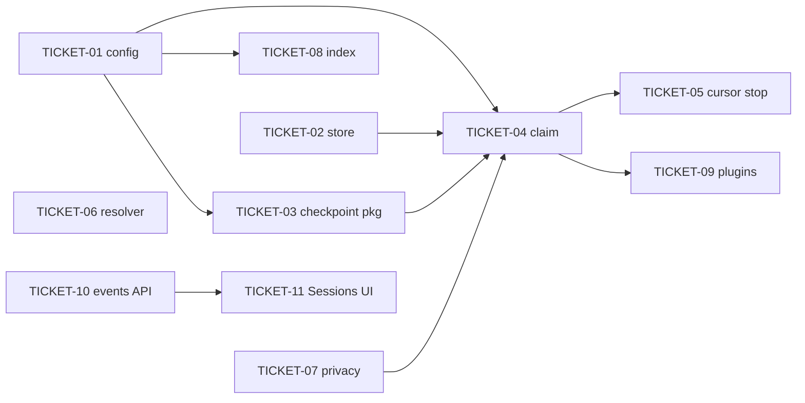

# Tasks — mnemonic memory checkpoint

> **STATUS:** `sliced` (2026-10-02)

> Sliced from `.skillgrid/specs/2026-10-02-mnemonic-memory-checkpoint/blueprint.md`.
> Vertical tracer-bullet tickets, dependency-ordered, sized for one fresh agent context window.

## Epic Summary

The host agent becomes the memory observer (ADR-0022): a server-gated Memory Checkpoint asks it to write typed observations and a summary; `skillgrid prime` injects a lean Memory Index at every session start; Private Spans never reach the store; the Sessions timeline shows observations live. No second LLM. Prompt-capture hooks and the Memories page upgrade are later serial slices, not this change.

## Delivery Strategy

| Field | Value |
|-------|-------|
| Estimated changed lines | 1800–2800 (11 tickets: Go store/HTTP/config, hooks, plugin, UI) |
| 400-line budget risk | High |
| Chained PRs recommended | Yes |
| Suggested split | PR 1 (T01–T04 server core) → PR 2 (T05–T07 door check + privacy + resolver) → PR 3 (T08–T09 index + plugins) → PR 4 (T10–T11 feed + UI) |
| Delivery strategy | exception-ok |
| Chain strategy | size-exception |

Decision needed before apply: No
Chained PRs recommended: Yes
Chain strategy: size-exception
400-line budget risk: High

### Suggested Work Units

| Unit | Goal | Likely PR | Focused test command | Runtime harness | Rollback boundary |
|------|------|-----------|----------------------|-----------------|-------------------|
| 1 | Config, session columns, decide/digest/prompt, claim route | PR 1 | `go test ./internal/mnemonic/config ./internal/mnemonic/checkpoint ./internal/mnemonic/memory ./internal/mnemonic/http -run 'TestCheckpoint\|TestStripPrivate' -count=1` | N/A — HTTP tests use `newToolCallsServer`; no live harness until T05 | Revert PR 1; columns are nullable and ignored by older binaries |
| 2 | Cursor stop follow-up (door check), one project resolver, private-span strip | PR 2 | `node scripts/test-hooks.mjs checkpoint private` + `go test ./internal/mnemonic/setup ./internal/mnemonic/http ./cmd/skillgrid -run 'TestUpsertCursorHooks\|TestToolCalls_Resolves\|TestPrime_Project' -count=1` | Cursor session in this repo with `skillgrid serve`: five tool calls, stop, follow-up appears (G4/G5) | Revert PR 2; hooks fail open if the claim route is gone |
| 3 | Memory Index in `prime`; OpenCode/Kilo checkpoint plugin | PR 3 | `go test ./internal/mnemonic/session_inject ./internal/mnemonic/setup ./cmd/skillgrid -run 'TestRenderIndex\|TestSetupOpenCode_Checkpoint\|TestSetupKilo' -count=1` | `skillgrid prime` prints `## Memory`; G7 manual OpenCode idle | Revert PR 3; session start degrades to today's prime |
| 4 | Observations on the session event feed and live Sessions timeline | PR 4 | `go test ./internal/mnemonic/http -run TestSessionEvents -count=1` + `npx vitest run src/features/mnemonic/SessionsPage.test.tsx src/features/sessions/ToolTimeline.test.tsx` | Sessions view + `mem_save` while SSE is open | Revert PR 4; older UI treats missing `observations` as empty |

## Tickets

### TICKET-01 — Checkpoint and inject config sections

- **Tracker ID:** TASK-038.01
- **Scope:** Load `mnemonic.checkpoint` and `mnemonic.inject` with the defaults and validation named in the briefing.
- **Acceptance:** No keys → defaults `enabled, 5, 10m, 5` and `5, 20, 800`. `min_events: 0` errors naming `mnemonic.checkpoint.min_events`. Documented in `docs/user-guide/05-memory.md`.
- **SATISFIES:** defaults-apply-without-keys, invalid-value
- **Files:** `skillgrid-cli/internal/mnemonic/config/load.go`, `load_test.go`; `docs/user-guide/05-memory.md`
- **Size:** ~120 (S)
- **Blocks:** TICKET-03, TICKET-04, TICKET-08
- **Blocked by:** none
- **Reversibility:** reversible
- **Fails-when:** `go test ./internal/mnemonic/config -run TestCheckpointConfig` is not `ok`

### TICKET-02 — Session checkpoint state in the store

- **Tracker ID:** TASK-038.02
- **Scope:** Migration 049 adds `checkpoint_claimed_at` and `last_memory_write_at`; `CheckpointState` / `ClaimCheckpoint` / `touchMemoryWrite` on `memory.Service`.
- **Acceptance:** Six events → `EventsSinceWrite == 6`; after `SessionSummary` → `0`; `ClaimCheckpoint` sets `LastClaimedAt`; unknown id → `Exists == false`, no error.
- **SATISFIES:** claim-resets-after-summary, claim-for-unknown-session
- **Files:** `skillgrid-cli/internal/mnemonic/store/migrations/049_session_checkpoint.sql`; `memory/service.go`; `memory/service_checkpoint_test.go`
- **Size:** ~180 (S)
- **Blocks:** TICKET-04
- **Blocked by:** none
- **Precondition:** Latest applied migration in-tree is `048_session_usage.sql` (or later additive).
- **Reversibility:** one-way
- **Fails-when:** `go test ./internal/mnemonic/memory ./internal/mnemonic/store -run TestCheckpointState` is not `ok`

### TICKET-03 — Pure checkpoint package: decide, digest, prompt

- **Tracker ID:** TASK-038.03
- **Scope:** `internal/mnemonic/checkpoint` — `Decide`, `BuildDigest`, `RenderPrompt`. No I/O. Digest is structured fields only (per ASSUMPTIONS.md § Locked constraints — no new dependency; prompt-injection boundary in the blueprint).
- **Acceptance:** Decide table covers disabled / unknown / below min / cooldown / due. Digest ≤ 1500 chars with `(+N more)`. Digest never contains preview text. Prompt lists session id, digest, existing titles, `mem_save`, `mem_session_summary`.
- **SATISFIES:** prompt-lists-new-events-and-existing-titles, prompt-digest-is-bounded, prompt-excludes-tool-output-text
- **Files:** `skillgrid-cli/internal/mnemonic/checkpoint/{checkpoint,digest,prompt}.go` + tests
- **Size:** ~250 (S)
- **Blocks:** TICKET-04
- **Blocked by:** TICKET-01
- **Reversibility:** reversible
- **Fails-when:** `go test ./internal/mnemonic/checkpoint` is not `ok`

### TICKET-04 — Claim route

- **Tracker ID:** TASK-038.04
- **Scope:** `POST /sessions/{id}/checkpoint/claim` returns `{due, reason, prompt}`; claims on due; 200 for unknown session; OpenAPI.
- **Acceptance:** Five tool calls → due + prompt; immediate re-claim → cooldown; disabled → not due; unknown → `reason: unknown_session`, no 404; prompt omits `content_preview`.
- **SATISFIES:** claim-due-after-enough-events, claim-not-due-below-threshold, claim-for-unknown-session, disabled-checkpoint
- **Files:** `skillgrid-cli/internal/mnemonic/http/checkpoint.go`, `checkpoint_test.go`, `server.go`, `ui/openapi.yaml`
- **Size:** ~280 (S)
- **Blocks:** TICKET-05, TICKET-09
- **Blocked by:** TICKET-01, TICKET-02, TICKET-03, TICKET-07
- **Reversibility:** reversible
- **Fails-when:** `go test ./internal/mnemonic/http -run 'TestCheckpointClaim|TestCheckpointPrompt'` is not `ok`

### TICKET-05 — Cursor stop follow-up (door check)

- **Tracker ID:** TASK-038.05
- **Scope:** `tool-call-capture.js checkpoint` mode; `cursor-session-end.sh` emits `followup_message` on `stop` only; `loop_limit: 2` on the Cursor stop entry (plugin + `setup cursor`).
- **Acceptance:** Fake server due + `loop_count: 0` → `{followup_message}`. `loop_count: 2` or cooldown or dead port → `{}` within 2s, exit 0. `TestUpsertCursorHooks` asserts `loop_limit: 2`.
- **SATISFIES:** stop-returns-followup-when-due, stop-stays-silent-at-loop-limit, stop-fails-open-without-server
- **Files:** `hooks/tool-call-capture.js`, `hooks/cursor-session-end.sh`, `plugins/cursor/hooks-cursor.json`, `setup/cursor.go`, `cursor_test.go`, `scripts/test-hooks.mjs`, `docs/user-guide/04-hooks.md`
- **Size:** ~220 (S)
- **Blocks:** none
- **Blocked by:** TICKET-04
- **Reversibility:** reversible
- **Fails-when:** `node scripts/test-hooks.mjs checkpoint` does not report `0 failed`

### TICKET-06 — One project resolver

- **Tracker ID:** TASK-038.06
- **Scope:** Hooks send `directory` only; `projectFromRequest` resolves via `project.Resolve`; delete `resolveProject` / active-project pin read from the capture script.
- **Acceptance:** POST with only `directory` stores under `project.Resolve(dir)`. `prime` and HTTP agree on the id. `rg resolveProject hooks/tool-call-capture.js` is empty.
- **SATISFIES:** prime-and-hooks-share-one-project, directory-without-project-param, prime-in-another-repository
- **Files:** `http/server.go`, `http/toolcalls.go`, `toolcalls_test.go`, `hooks/tool-call-capture.js`, `cmd/skillgrid/prime*.go`
- **Size:** ~150 (S)
- **Blocks:** none
- **Blocked by:** none
- **Reversibility:** reversible
- **Fails-when:** `go test ./internal/mnemonic/http ./cmd/skillgrid -run 'TestToolCalls_ResolvesProjectFromDirectory|TestPrime_ProjectMatchesHTTPStore'` is not `ok`

### TICKET-07 — Private spans never stored

- **Tracker ID:** TASK-038.07
- **Scope:** `memory.StripPrivate` on every write seam (save, summary, prompt, tool-call preview) and in the capture hook before POST. Reuse/move any existing inject-time stripper so there is one implementation.
- **Acceptance:** Stored preview/summary/content never contains span inner text; unterminated tag strips to end; hook request body is clean.
- **SATISFIES:** tool-call-with-private-span, unterminated-private-tag, private-span-in-summary, prompt-omits-private-spans
- **Files:** `memory/privacy.go`, `privacy_test.go`, `memory/service.go`, `http/toolcalls.go`, `http/checkpoint.go` (digest input), `hooks/tool-call-capture.js`, `scripts/test-hooks.mjs`
- **Size:** ~180 (S)
- **Blocks:** TICKET-04
- **Blocked by:** none
- **Reversibility:** reversible
- **Fails-when:** `go test ./internal/mnemonic/memory ./internal/mnemonic/http -run 'TestStripPrivate|TestToolCalls_PrivateSpan|TestSessionSummary_PrivateSpan'` is not `ok`, or `node scripts/test-hooks.mjs private` is not `0 failed`

### TICKET-08 — Memory index at session start

- **Tracker ID:** TASK-038.08
- **Scope:** `session_inject.RenderIndex` + `skillgrid prime` appends `## Memory` (5 summaries, 20 observations, pinned first, 800-token cap, progressive-disclosure footer). Index only — AutoPrepend stays resume-only (per ASSUMPTIONS.md § Locked constraints).
- **Acceptance:** Pinned first; empty store → no section; over cap drops oldest and states omitted count; footer names `mem_get_observation`, `mem_timeline`, `mem_search`.
- **SATISFIES:** prime-lists-summaries-and-observation-index, index-respects-token-cap, index-absent-for-empty-project
- **Files:** `session_inject/index.go`, `index_test.go`; `loop/render.go`; `cmd/skillgrid/prime.go`; `docs/user-guide/05-memory.md`
- **Size:** ~200 (S)
- **Blocks:** none
- **Blocked by:** TICKET-01
- **Reversibility:** reversible
- **Fails-when:** `go test ./internal/mnemonic/session_inject ./internal/mnemonic/loop ./cmd/skillgrid -run 'TestRenderIndex|TestRenderPrime'` is not `ok`

### TICKET-09 — OpenCode and Kilo checkpoint plugin

- **Tracker ID:** TASK-038.09
- **Scope:** `skillgrid-checkpoint.ts` claims on `session.idle` and prompts when due; `setup opencode|kilo` copies it once.
- **Acceptance:** After setup the plugin file exists; dry-run writes nothing; not-due and no-server send no prompt (fail-open). G7 is manual.
- **SATISFIES:** setup-installs-checkpoint-plugin, plugin-does-not-prompt-when-not-due, plugin-fails-open-without-server
- **Files:** `plugins/opencode/skillgrid-checkpoint.ts`, `plugins/kilo/skillgrid-checkpoint.ts`; `setup/opencode.go`, `kilocode.go` + tests; `docs/user-guide/04-hooks.md`
- **Size:** ~200 (S)
- **Blocks:** none
- **Blocked by:** TICKET-04
- **Reversibility:** reversible
- **Fails-when:** `go test ./internal/mnemonic/setup -run 'TestSetupOpenCode_CheckpointPlugin|TestSetupKilo_CheckpointPlugin'` is not `ok`

### TICKET-10 — Observations in the session event feed

- **Tracker ID:** TASK-038.10
- **Scope:** `GET /sessions/{id}/events` gains `observations[]`; sessions list gains `observations` count. Additive.
- **Acceptance:** A saved observation appears with id/type/title; list count is 1; OpenAPI updated.
- **SATISFIES:** observation-row-links-to-full-text
- **Files:** `http/toolevents.go`, `mnemonic_files.go`, `openapi.yaml` + tests
- **Size:** ~140 (S)
- **Blocks:** TICKET-11
- **Blocked by:** none
- **Reversibility:** reversible
- **Fails-when:** `go test ./internal/mnemonic/http -run TestSessionEvents` is not `ok`

### TICKET-11 — Live observation rows in the Sessions view

- **Tracker ID:** TASK-038.11
- **Scope:** `ToolTimeline` interleaves observation rows; `SessionsPage` appends from `activity` SSE and bumps the card count.
- **Acceptance:** Observation row appears between tool rows by timestamp and links to detail; mocked `activity` frame increments count; disconnect shows existing "live paused".
- **SATISFIES:** observation-appears-live, observation-row-links-to-full-text, stream-disconnected
- **Files:** `skillgrid-ui/src/features/sessions/{api.ts,ToolTimeline.tsx,ToolTimeline.test.tsx}`; `mnemonic/SessionsPage.tsx`, `SessionsPage.test.tsx`
- **Size:** ~220 (S)
- **Blocks:** none
- **Blocked by:** TICKET-10
- **Reversibility:** reversible
- **Fails-when:** `npx vitest run src/features/mnemonic/SessionsPage.test.tsx src/features/sessions/ToolTimeline.test.tsx` is not all passed

## Dependency Graph

## Execution Order

- **Wave 1 (parallel):** TICKET-01, TICKET-02, TICKET-06, TICKET-07, TICKET-10
- **Wave 2:** TICKET-03 (after TICKET-01)
- **Wave 3:** TICKET-04 (after TICKET-01 + TICKET-02 + TICKET-03 + TICKET-07)
- **Wave 4:** TICKET-05 (after TICKET-04), TICKET-08 (after TICKET-01), TICKET-09 (after TICKET-04)
- **Wave 5:** TICKET-11 (after TICKET-10)

> **Acceptance-first (BDD is always on):** a ticket's failing acceptance scenario (its `SATISFIES` scenario) is written and confirmed RED *before* the implementation that makes it green.

## Slicing Notes

- Fast-track: **standard** (new capability, migration, hook + HTTP + UI). Full `tasks.md`.
- TICKET-05 is the tracer-thread door check (blueprint Task 5). Hand-verify G4/G5 before treating Waves 4–5 as done.
- TICKET-02 is the one-way door (migration 049). Confirm with the user before first apply against a real store; the briefing already named the columns.
- TICKET-06 and TICKET-10 have no blockers so they ride Wave 1 even though they are not on the claim path.
- Parked (not in this epic): prompt-capture hooks; Memories page upgrade; AutoPrepend on fresh sessions; external LLM observer.
- Serial-development: webui-rewrite is shipped; this is the active change.
