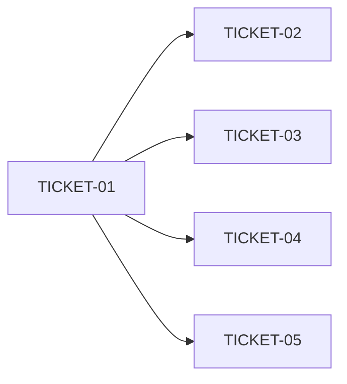

# Tasks — Project Init

> **STATUS:** `sliced` (2026-10-02)

> Sliced from `.skillgrid/specs/2026-10-02-mnemonic-project-init/blueprint.md`.
> Vertical tracer-bullet tickets, dependency-ordered, sized for one fresh agent context window.

**Execution choice (locked):** Subagent-Driven — `skillgrid:subagent-execution` when this change is current.
**Queued behind:** `2026-10-02-mnemonic-memory-checkpoint`. Do not dispatch implementers or take `state.yaml` `current_change` until that change ships or parks. per ASSUMPTIONS.md § Locked constraints (serial development)

## Epic Summary

`skillgrid init` writes a lean AGENTS preamble + Skillgrid sentinel, runs the existing code index, and upserts local docs into the one SQLite store. The onboarding skill finishes by calling that CLI. No KBs. per `.skillgrid/artifacts/04-adr-0012-sqlite-as-second-brain.md`

## Delivery Strategy

| Field | Value |
|-------|-------|
| Estimated changed lines | 450–650 |
| 400-line budget risk | Medium |
| Chained PRs recommended | No |
| Suggested split | single PR on release/2 |
| Delivery strategy | auto-chain |
| Chain strategy | pending |

Decision needed before apply: No
Chained PRs recommended: No
Chain strategy: pending
400-line budget risk: Medium

### Suggested Work Units

| Unit | Goal | Likely PR | Focused test command | Runtime harness | Rollback boundary |
|------|------|-----------|----------------------|-----------------|-------------------|
| 1 | `skillgrid init` + onboarding handoff | single PR | `go test ./skillgrid-cli/cmd/skillgrid -count=1 -run TestInit\|TestOnboardingSkill` | N/A — CLI + store, no HTTP | revert the five feat commits / this PR |

## Tickets

### TICKET-01 — Init command writes a boot file

- **Scope:** Dispatch `skillgrid init`, parse `--force` / `--docs`, write a boot file path on success, fatal only when the boot file cannot be written.
- **Acceptance:** `TestInitHelpListsFlags`, `TestInitWritesBootFileAndReportsCounts`, `TestInitBootFileWriteFailureIsFatal` PASS. `skillgrid init -h` names both flags. Non-directory target returns error.
- **SATISFIES:** happy path init writes boot file and reports counts; init help lists force and docs flags; boot file write failure is the only fatal error
- **Files:** `skillgrid-cli/cmd/skillgrid/init_cmd.go`, `init_cmd_test.go`, `main.go`
- **Size:** ~180 (S)
- **Blocks:** TICKET-02, TICKET-03, TICKET-04
- **Blocked by:** none
- **Reversibility:** reversible
- **Fails-when:** `go test ... -run TestInitHelpListsFlags|TestInitWritesBootFileAndReportsCounts|TestInitBootFileWriteFailureIsFatal` is non-zero

### TICKET-02 — Preamble and sentinel upsert

- **Scope:** `writeBootFile` inserts/keeps/forces the preamble region and upserts exactly one Skillgrid sentinel pair.
- **Acceptance:** `TestInitUpsertsPreambleAndSentinel` and `TestInitForceRewritesPreamble` PASS. Second run does not duplicate the sentinel; `--force` replaces preamble only.
- **SATISFIES:** happy path init upserts preamble and sentinel; second init merges without duplicating the sentinel; force rewrites the preamble only
- **Files:** `init_boot.go`, `init_cmd.go`, `init_cmd_test.go`
- **Size:** ~220 (S)
- **Blocks:** none
- **Blocked by:** TICKET-01
- **Reversibility:** reversible
- **Fails-when:** `go test ... -run TestInitUpsertsPreambleAndSentinel|TestInitForceRewritesPreamble` is non-zero

### TICKET-03 — Forced code index

- **Scope:** After the boot file, `projectInit` calls `ResolveProject` + `RunCodeIndex` on the same `svc`; index errors go in `Errors`, exit still 0.
- **Acceptance:** `TestInitIndexesTheProject` (`Indexed >= 1` on a `.go` fixture) and `TestInitIndexFailureIsNonFatal` PASS.
- **SATISFIES:** happy path init indexes the project; init reuses the existing indexer; index failure after boot file still exits 0
- **Files:** `init_cmd.go`, `init_cmd_test.go`
- **Size:** ~80 (S)
- **Blocks:** none
- **Blocked by:** TICKET-01
- **Reversibility:** reversible
- **Fails-when:** `go test ... -run TestInitIndexesTheProject|TestInitIndexFailureIsNonFatal` is non-zero

### TICKET-04 — Default and extra ingest

- **Scope:** Walk default paths + jailed `--docs` into `memory.Save` with `init/docs/<relpath>`; skip missing defaults; list bad extras in `Errors`.
- **Acceptance:** `TestInitIngestsDefaultPaths`, `TestInitSkipsMissingDocs`, `TestInitIngestsExtraDocs`, `TestInitMissingExtraDocsIsNonFatal`, `TestInitRejectsDocsOutsideProject` PASS. Second init does not duplicate topic keys.
- **SATISFIES:** happy path init ingests default paths; missing docs directory is skipped; second init upserts the same topic keys; happy path init ingests extra --docs path; missing extra docs path is listed and non-fatal
- **Files:** `init_ingest.go`, `init_cmd.go`, `init_cmd_test.go`
- **Size:** ~200 (S)
- **Blocks:** none
- **Blocked by:** TICKET-01
- **Reversibility:** reversible
- **Fails-when:** `go test ... -run 'TestInitIngests|TestInitSkips|TestInitMissing|TestInitRejects'` is non-zero

### TICKET-05 — Onboarding skill calls skillgrid init

- **Scope:** Onboarding skill runs `skillgrid init` (optional `--force` / `--docs`); no second ingest procedure.
- **Acceptance:** `TestOnboardingSkillCallsSkillgridInit` and `TestOnboardingSkillHasNoSecondIngest` PASS.
- **SATISFIES:** happy path onboarding skill calls skillgrid init; skill passes extra docs through; skill does not contain a second ingest procedure
- **Files:** `.agents/skills/lifecycle/onboarding/SKILL.md`, `init_cmd_test.go`
- **Size:** ~40 (S)
- **Blocks:** none
- **Blocked by:** TICKET-01
- **Reversibility:** reversible
- **Fails-when:** `go test ... -run TestOnboardingSkill` is non-zero

## Dependency Graph

TICKET-02/03/04 all edit `init_cmd.go`. Run them **serially after T01** (02 then 03 then 04) even though the graph only requires T01. TICKET-05 can follow T01 but should wait until T04 so the skill documents a complete CLI.

## Execution Order

- **Wave 1:** TICKET-01
- **Wave 2:** TICKET-02 (after T01)
- **Wave 3:** TICKET-03 (after T02 — shared `init_cmd.go`)
- **Wave 4:** TICKET-04 (after T03 — shared `init_cmd.go`)
- **Wave 5:** TICKET-05 (after T04 — skill describes the finished command)

> **Acceptance-first (BDD is always on):** each ticket writes its `SATISFIES` tests RED before implementation.

## Slicing Notes

- Blueprint tasks 1–5 map 1:1 to TICKET-01–05.
- Not parallelizable: shared `projectInit` / `init_cmd.go`. Subagent-execution is sequential waves, one implementer at a time.
- Ticketing (Backlog.md) deferred until this change is current so tickets do not mix with memory-checkpoint.
- Fast-track: standard (threat-matrix rows Applicable) — full `tasks.md`.
