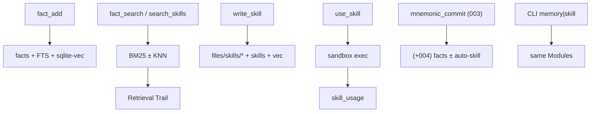

# Change: 004-hermes-memory — Hermes Fact Memory & Agent Skills

> **STATUS:** `draft` (2026-09-04)
>
> **For agentic workers:** REQUIRED: follow `.agents/skills/_shared/conventions/sdd-structure.md`. This file is WHY + HOW (former intent + plan). Spec phase instantiates `tasks.md` + `acceptance.feature` from the Step Blueprint and per-step WHAT below.
>
> **Migration note:** Question round already satisfied by legacy `intent.md` / `plan.md` / `docs/plan/05-hermes-memory.md` (approved 2026-09-04). This `change.md` folds those answers; do not re-interview.

**Goal:** Agents get importance-ranked Fact Memory with forgetting and a path to write, find, and sandboxed-execute Agent Skills beside `mem_*` observations.

**Architecture:** Extend Change **003** (not redo Tiered Storage, core `semantic_search`, or trail CLI). New deep Modules `facts` and `skills` sit beside observations; additive SQL `011_*` after **003** `010_*`; scripts under `.skillgrid/files/skills/`. Fact/skill vectors use **sqlite-vec** on an isolated Seam; **003** Pure Go document embeddings stay. Slice 1 includes sandboxed `use_skill` and optional auto-skill on `mnemonic_commit`. Keep **003** L0/L1/L2 labels — no Hermes L0–L3.

**Tech stack:** Go (`skillgrid-cli`), SQLite (`modernc.org/sqlite` + sqlite-vec for fact/skill KNN), MCP (`mcp-go`), filesystem under `.skillgrid/files/skills/`.

**Research:** none (legacy intent/plan + `docs/plan/05-hermes-memory.md`)

**Ticket:** `task-001` (plan ticket; backlog CLI Bun SIGILL — emergency fallback)

**Depends on:** `003-tiered-storage` (required); `002-mnemonic-identity-and-parity` (preferred)

---

## Goal

Agents and operators can add/search/forget/decay ranked facts and write/list/search/execute Agent Skills with hybrid retrieval and Retrieval Trails, without re-delivering Change **003** Tiered Storage or core semantic/trail surfaces.

## Out of scope / Non-Goals

- Reimplementing **003** Tiered Storage, `migrate --tier`, core `semantic_search`, or trail CLI
- OpenCode plugin; cloud sync; external vector DB
- Rewriting code-index or web-cache; Changing **002** identity
- Replacing **003** Pure Go document/semantic embedding path
- Hermes L0–L3 labels (keep **003** L0/L1/L2 Tiered Storage terms)
- Confusing Agent Skills with `.agents/skills` packs

## Definition of Done

This change is done only when **all** of the following are true:

- [ ] Add/search/forget facts; soft-deleted facts out of default search
- [ ] Decay lowers importance and logs events; CLI can trigger decay
- [ ] Write/list/search Agent Skills; lexical and hybrid modes work
- [ ] Sandboxed `use_skill` returns captured output and logs usage
- [ ] `mnemonic_commit` extracts facts and may auto-generate an Agent Skill
- [ ] Fact/skill search extends **003** Retrieval Trails
- [ ] `go test ./...` passes for touched packages
- [ ] Every Step Blueprint entry has a matching section in `tasks.md` with Verdict `PASS` or `PASS WITH WARNINGS`
- [ ] Every `@step-NN` Feature in `acceptance.feature` has passing `@happy`, `@edge`, and `@failure` scenarios
- [ ] Applicable threat-matrix rows have RED coverage that passed
- [ ] Testing strategy commands below are green
- [ ] Rollback path below is still valid (or N/A documented)
- [ ] Change archived under `docs/skillgrid/archive/004-hermes-memory/`

---

## Problem / why

Agents lack importance-ranked Fact Memory with forgetting, and a path to write/find/execute Agent Skills. Change **003** delivered Tiered Storage and trails; this change extends that foundation with Hermes-style facts and skill management. Urgency is high after **003**.

## Target users

- **Agent** — recall ranked facts; write/search/execute Agent Skills
- **Operator** — CLI inspect/forget/decay/execute; debug Retrieval Trails
- **Urgency:** High after **003**; builds on **002** / **003**

## Business rules

- Extends **003** — no re-delivery of tiered FS, core `semantic_search`, core `mnemonic_commit` behaviour (beyond additive hooks), or trail CLI
- Fact Memory is a **new store** beside `mem_*` observations (not an overlay)
- Additive SQL + FS; Go MCP + SQLite + FS; no external vector DB
- Fact/skill vectors require **sqlite-vec** (beyond **003** Pure Go document path)
- Soft-delete facts; decay then purge only below threshold
- Agent Skills = FS + `skills` table — ≠ `.agents/skills` packs
- Slice 1: sandboxed `use_skill` + auto-skill on `mnemonic_commit` (sandbox risk accepted with RED coverage)
- Keep **003** L0/L1/L2 Tiered Storage terms; no Hermes L0–L3 labels
- New MCP tools are additive JSON-only; `mem_*` / `code_*` / `web_*` shapes unchanged

## In scope

- Fact Memory + MCP `fact_add` | `fact_search` | `fact_forget` | `fact_decay` (FTS5, sqlite-vec, forgetting)
- Agent Skill registry + write/search/list/`use_skill`; hybrid BM25+cosine (sqlite-vec)
- Fact extraction + optional auto-skill on `mnemonic_commit`
- CLI `skillgrid memory` / `skillgrid skill` (incl. execute) with MCP parity

## Risks & rollback

- **Risk:** Duplicate **003** work — **Mitigation:** Strict out-of-scope; depend on **003**; DoD forbids tier/trail redo
- **Risk:** Skill execute sandbox escape — **Mitigation:** Accepted with constrained runtime, allowlist, timeout, cwd jail, RED tests, usage logging
- **Risk:** sqlite-vec vs **003** Pure Go — **Mitigation:** Isolate to fact/skill Seam/Adapter; fail closed on vec ops only
- **Risk:** Term clash with `.agents/skills` — **Mitigation:** Glossary term **Agent Skill**; FS under `.skillgrid/files/skills/`
- **Risk:** Large multi-step change (~1600–2200 lines) exceeds 400-line review budget — **Mitigation:** Five vertical steps; Delivery strategy `ask-on-risk`; chained PRs recommended
- **Rollback:** Drop migration `011_*`, new fact/skill modules, MCP tools, and CLI subcommands; leave **003** intact. Existing DBs that applied `011_*` keep additive tables (harmless if callers stop using them).

## Error handling

| Failure | Behavior | Notes |
|---------|----------|-------|
| Store open / migrate after **003** | `abort` if **003** `010_*` missing | Require **003** before `011_*` |
| sqlite-vec extension missing | `warn+continue` for non-vec; `abort` on vec ops | Fail closed on vector search/upsert only; FTS open/search still works |
| Soft-deleted fact/skill in default search | N/A (omitted) | Soft-delete must never appear in default list/search |
| Decay / purge below threshold | `warn+continue` | Lower importance + log events; purge only below threshold |
| `overwrite=false` name collision on write_skill | `abort` | Clear error; do not overwrite |
| Path escape / unknown language / timeout on `use_skill` | `abort` | No host-wide exec; no network; cwd=skill dir |
| Auto-skill with no reusable pattern | `warn+continue` | Skip write; preserve **003** commit behaviour |
| Invalid CLI memory/skill action | `abort` | Fail cleanly; do not corrupt Fact Memory |

## Testing strategy

- **Unit:** `Run: go test ./skillgrid-cli/internal/mnemonic/facts/ ./skillgrid-cli/internal/mnemonic/skills/ ./skillgrid-cli/internal/mnemonic/vec/ ./skillgrid-cli/internal/mnemonic/store/` — Expected: PASS
- **Integration / acceptance:** `Run: go test ./skillgrid-cli/internal/mnemonic/mcp/ ./skillgrid-cli/cmd/skillgrid/` plus BDD `@step-NN` scenarios in `acceptance.feature` — Expected: PASS (`@step-01`…`@step-05` / `@p0`)
- **Full suite:** `Run: go test ./...` (from repo root / `skillgrid-cli` per module layout) — Expected: PASS
- **Green means:** Fact/skill UAT criteria above hold; new MCP tools registered without regressing `mem_*`; sandbox rejects path escape; CLI parity with MCP

---

## Step Blueprint

Contract for `sdd-spec`. Do not renumber after `tasks.md` exists. Per-step Out of scope / DoD live under Per-step WHAT (table is summary only).

| NN | Step slug | Goal (one line) | Primary package / entry | Depends on |
|----|-----------|-----------------|-------------------------|------------|
| 01 | `facts-schema` | Facts + FTS + forgetting_events + sqlite-vec embeddings | `skillgrid-cli/internal/mnemonic/facts` | — |
| 02 | `fact-tools` | MCP fact_* + Retrieval Trail logging | `skillgrid-cli/internal/mnemonic/mcp` | 01 |
| 03 | `skills-registry` | Skills FS + table + FTS; write/search/list | `skillgrid-cli/internal/mnemonic/skills` | 01 |
| 04 | `skill-execute-hybrid` | Sandboxed `use_skill` + hybrid BM25+cosine | `skillgrid-cli/internal/mnemonic/skills` | 02, 03 |
| 05 | `commit-hooks-cli` | Commit fact extract ± auto-skill; memory/skill CLI | `skillgrid-cli/cmd/skillgrid` | 02, 03, 04 |

---

## Technical approach

Extend **003** with Fact Memory and Agent Skill registry beside `mem_*`. Additive SQL `011_facts_skills.sql` after **003** `010_*`; skill scripts under `.skillgrid/files/skills/`. Fact/skill vectors use sqlite-vec on an isolated Seam; **003** Pure Go `path_embeddings` stay. MCP adds `fact_*` and skill tools (incl. sandboxed `use_skill`); `mnemonic_commit` gains fact extract ± optional auto-skill; CLI mirrors MCP for operator use.

## Architecture decisions

### Decision: Fact Memory as deep Module

**Module / Interface / Seam / Adapter / Depth:** `facts`; Add/Search/Forget/Decay; SQL+FTS+vec Seam; SQLite; deep  
**Choice:** Separate `facts`, `facts_fts`, `fact_embeddings`, `forgetting_events`  
**Alternatives considered:** Overlay on `observations`; Hermes L1 labels  
**Rationale:** Locked intent; no `mem_*` churn; keep Tiered Storage terms

### Decision: sqlite-vec only on fact/skill path

**Module / Interface / Seam / Adapter / Depth:** `vec.Index`; Upsert/SearchKNN; driver Seam; sqlite-vec (+ fake); deep  
**Choice:** sqlite-vec for fact/skill KNN; leave **003** `path_embeddings` Pure Go  
**Alternatives considered:** **002** observation BLOB cosine; external vector DB  
**Rationale:** Isolates modernc↔extension risk in one Adapter; fail closed when missing

### Decision: Agent Skills = FS + table

**Module / Interface / Seam / Adapter / Depth:** `skills`; Write/List/Search/Use; FS+SQL Seam; disk+DB; deep  
**Choice:** `files/skills/{name}.{ext}` + `skills` / `skills_fts` / `skill_embeddings` / `skill_usage`  
**Alternatives considered:** SQLite BLOBs only; reuse `.agents/skills`  
**Rationale:** Glossary **Agent Skill**; git-friendly; searchable metadata

### Decision: Constrained subprocess for use_skill

**Module / Interface / Seam / Adapter / Depth:** `skills.Executor`; Run→IO; exec Seam; sandbox (+ deny); deep  
**Choice:** Allowlisted runners, timeout, no network, cwd=skill dir; log usage  
**Alternatives considered:** Docker-only; defer execute  
**Rationale:** Slice-1 acceptance; sandbox risk accepted with RED tests

### Decision: Commit hooks extend 003 compaction

**Module / Interface / Seam / Adapter / Depth:** AfterCommit on `mnemonic_commit`; fact-extract + optional skill-gen; deep  
**Choice:** Post-commit extract facts; optionally `write_skill`; no tier/trail redo  
**Alternatives considered:** Separate commit tool; always auto-skill  
**Rationale:** Extends **003**; optional skill avoids junk

## Data flow



## File layout

```
skillgrid-cli/
├── internal/mnemonic/
│   ├── store/migrations/011_facts_skills.sql   # facts/skills/forgetting/vec + trail cols
│   ├── vec/vec.go                              # sqlite-vec Interface + fake
│   ├── facts/facts.go                          # Fact Memory Module
│   ├── skills/skills.go                        # registry Write/List/Search
│   ├── skills/execute.go                       # sandboxed Use
│   └── mcp/
│       ├── tools_facts.go
│       ├── tools_skills_registry.go
│       ├── tools_skills_exec.go
│       ├── tools_compaction.go                 # (+004) fact extract ± auto-skill
│       └── server.go                           # Register* wiring
└── cmd/skillgrid/
    ├── memory.go                               # memory fact|forget|decay
    ├── skill.go                                # skill list|search|execute
    └── main.go                                 # dispatch
```

## Impacted files map

| File | Action | Step | Description |
|------|--------|------|-------------|
| `skillgrid-cli/internal/mnemonic/store/migrations/011_facts_skills.sql` | Create | 01 | facts/FTS/forgetting/embeddings/skills; trail cols |
| `skillgrid-cli/internal/mnemonic/vec/vec.go` | Create | 01 | sqlite-vec Interface/loader + fake |
| `skillgrid-cli/internal/mnemonic/store/store.go` | Modify | 01 | Hook vec extension on Open if needed |
| `skillgrid-cli/internal/mnemonic/facts/facts.go` | Create | 01 | Fact Memory Module |
| `skillgrid-cli/internal/mnemonic/mcp/tools_facts.go` | Create | 02 | fact_* + trail; RegisterFactTools |
| `skillgrid-cli/internal/mnemonic/skills/skills.go` | Create | 03 | Registry write/list/search |
| `skillgrid-cli/internal/mnemonic/mcp/tools_skills_registry.go` | Create | 03 | write/search/list_skill tools |
| `skillgrid-cli/internal/mnemonic/skills/execute.go` | Create | 04 | Sandbox exec + hybrid search helpers |
| `skillgrid-cli/internal/mnemonic/mcp/tools_skills_exec.go` | Create | 04 | use_skill + hybrid mode |
| `skillgrid-cli/internal/mnemonic/mcp/server.go` | Modify | 04 | Wire Register* for fact+skill tools |
| `skillgrid-cli/internal/mnemonic/mcp/tools_compaction.go` | Modify | 05 | Fact extract + auto-skill (**003** file) |
| `skillgrid-cli/cmd/skillgrid/memory.go` | Create | 05 | memory fact\|forget\|decay |
| `skillgrid-cli/cmd/skillgrid/skill.go` | Create | 05 | skill list\|search\|execute |
| `skillgrid-cli/cmd/skillgrid/main.go` | Modify | 05 | Dispatch memory/skill |

## Per-step WHAT

Observable behavior each step must deliver (feeds Gherkin). Not implementation HOW.

### Step 01 — `facts-schema`

**Goal:** Operator can open a store and get Fact Memory tables without rewriting observations  
**Out of scope:** MCP tools; skill execute; CLI; hybrid search mode  
**Definition of Done:** Store open creates Fact Memory schema; re-open idempotent; missing sqlite-vec fails closed on vec ops only

- As operator: open creates Fact Memory tables without rewriting observations
- Given a DB after **003**, migrate leaves prior rows and Tiered Storage intact
- Edge: re-open idempotent; missing sqlite-vec fails closed on vec ops only

### Step 02 — `fact-tools`

**Goal:** Agent can add/search/forget/decay facts via MCP with Retrieval Trails  
**Out of scope:** Agent Skill tools; CLI; hybrid mode  
**Definition of Done:** fact_* tools registered; soft-deleted absent from default search; decay logs events; `mem_*` unchanged

- As agent: `fact_add` / `fact_search` / `fact_forget` / `fact_decay`; soft-deleted facts out of default search
- Given search, a Retrieval Trail records mode and fact ids
- Edge: decay lowers importance, logs events; purge only below threshold

### Step 03 — `skills-registry`

**Goal:** Agent can write/list/search Agent Skills (lexical) with FS + SQL metadata  
**Out of scope:** `use_skill`; hybrid ranking; commit hooks; CLI  
**Definition of Done:** write/list/search registered; soft-deleted omitted; overwrite=false rejects collision; `mem_*` unchanged

- As agent: write/list/search Agent Skills (lexical); FS + SQL metadata
- Soft-deleted skills omitted from default list/search
- Edge: overwrite=false rejects name collision

### Step 04 — `skill-execute-hybrid`

**Goal:** Agent gets sandboxed `use_skill` and hybrid BM25+cosine retrieval  
**Out of scope:** Commit hooks; operator CLI  
**Definition of Done:** Sandboxed execute returns IO + logs usage; hybrid search works; path escape/unknown lang/timeout reject without host-wide exec

- As agent: sandboxed `use_skill` returns captured IO and logs usage
- Hybrid BM25 + sqlite-vec cosine for skills (and facts when mode=hybrid)
- Edge: bad language/timeout/path escape → error, no host-wide exec

### Step 05 — `commit-hooks-cli`

**Goal:** Commit extracts facts ± auto-skill; CLI parity with MCP  
**Out of scope:** Redo trail CLI or Tiered Storage migrate  
**Definition of Done:** `mnemonic_commit` preserves **003** behaviour and adds extract ± auto-skill; CLI memory/skill match MCP; skip auto-skill when no pattern

- As agent: `mnemonic_commit` keeps **003** behaviour and adds fact extract ± auto-skill
- As operator: `skillgrid memory` / `skillgrid skill` (incl. execute) match MCP
- Edge: skip auto-skill when no reusable pattern; trail CLI unchanged

## Threat matrix

Mark each row `Applicable` or `N/A: reason`. Applicable rows name an owning step and propagate into RED tasks + acceptance scenarios.

| Boundary / threat | Applicable? | Owning step | Planned RED coverage |
|-------------------|-------------|-------------|----------------------|
| Documentation-like paths | Applicable — executable Agent Skill scripts | 04 | `../evil.sh` / unknown lang → error, no exec; timeout/cwd-jail/allowlist |
| Git repository selection | N/A: no git cwd authority | — | — |
| Commit state | N/A: no git commit automation (mnemonic_commit is MCP compaction, not git) | — | — |
| Push state | N/A: no push | — | — |
| PR commands | N/A: no PR CLI | — | — |
| **Mnemonic tool surface** (`mem_*` / `code_*` / `web_cache_*`) | Applicable — new fact_*/skill_* | 02, 03, 04 | Tools registered; `mem_save` still works; soft-deleted fact absent from search |
| **Shared-convention drift** | N/A: no `_shared/conventions/*` edits | — | — |

Shell/subprocess sandbox adversarial cases are owned by step 04 RED (timeout, cwd jail, allowlist) under Documentation-like paths.

## Mnemonic Integration

New tools: `fact_add`, `fact_search`, `fact_forget`, `fact_decay`, `write_skill`, `search_skills`, `list_skills`, `use_skill`. Extend **003** `mnemonic_commit` (facts ± auto-skill) and Retrieval Trail with fact/skill ids. No `mem_save` / `code_*` / `web_*` shape change. Topic keys: `sdd/004-hermes-memory/{change,tasks,spec}`.

## Migration / rollout

- Requires **003** `010_*`. Additive `011_facts_skills.sql`
- Fail closed if sqlite-vec missing on vec search
- Rollback: drop `011_*` + new tools/CLI; leave **003** intact

## Open questions

- [ ] Tracker: `task-001` (plan ticket; backlog CLI Bun SIGILL — file created via emergency fallback) — confirm when backlog CLI is healthy
- [ ] sqlite-vec on modernc (extension vs CGO) — pick in step 01; Seam isolates

## Glossary

| Term | Definition | Glossary file |
|------|------------|---------------|
| **Fact Memory** | New ranked-fact store beside `mem_*` observations (soft-delete, decay, FTS + vec) | business |
| **Agent Skill** | Writable/runnable Hermes skill (FS + SQL) ≠ `.agents/skills` packs | business |
| **Tiered Storage** | **003** L0/L1/L2 storage model — keep those labels; no Hermes L0–L3 | technical |
| **Retrieval Trail** | **003** search audit trail — extended with fact/skill ids | technical |
| **Module** | Deep package owning a domain Interface (facts, skills, vec) | technical |
| **Seam** | Boundary where Adapter (sqlite-vec, FS, exec) plugs in | technical |

<!-- Fold new terms here; also upsert docs/skillgrid/agents/glossary/{business,technical}.md. No companion *-glossary-reference.md. Do not edit glossary files in this migration. -->

## Author self-review

- [x] **Goal**, **Out of scope / Non-Goals**, and **Definition of Done** are filled and testable
- [x] **Error handling** and **Testing strategy** are filled
- [x] Non-goals match Global Constraints that will appear in `tasks.md`
- [x] Rollback plan is present
- [x] Step Blueprint covers a vertical-slice sequence (no horizontal-only layers)
- [x] Every Impacted Files row maps to exactly one step
- [x] Every applicable threat row names an owning step
- [x] Glossary terms reused or defined; no companion reference file
