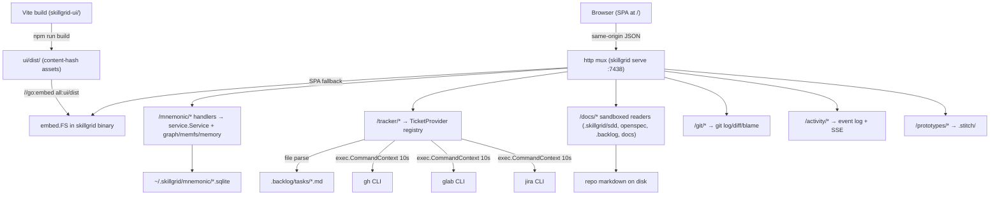

# Change: 009-web-admin-dashboard — SkillGrid Web Dashboard (Vite + React SPA, go:embed)

> **STATUS:** `draft` (2026-09-16; re-planned to the full Vite + React 19 SPA architecture — supersedes the 2026-09-08 vanilla-embedded plan)
>
> **For agentic workers:** REQUIRED: follow the SDD structure convention. This file is WHY + HOW (intent + plan). The spec phase instantiates `tasks.md` + `acceptance.feature` from the Phase Plan and per-phase WHAT below.
>
> **Supersession note (2026-09-16):** the original 009 plan was a *vanilla-embedded, build-less* SPA (P1–P6 menu-first slices). Four of those phases (P1 shell, P2 tracker bridge, P3 docs viewer, P4 memory) were implemented and PASS. This re-plan **replaces** that architecture with a proper **Vite + React 19 TypeScript SPA** built into a `go:embed` `ui/dist/`, a **Sigma.js + graphology** vector graph (GitNexus parity), a **Mermaid** docs viewer, and a **multi-provider Kanban**. The existing vanilla P1–P4 code is a **design reference** (kanban layout, tracker bridge, docs viewer, memory governance) to be re-expressed in the new stack, not extended. The Go **tracker bridge** (`internal/mnemonic/http/tracker`) and the Go **service layer** are preserved and reused — only the frontend and the new route groups change.

**Goal:** Replace the minimal embedded data viewer with a full web dashboard for SkillGrid (Go CLI + Mnemonic AI memory + API + MCP server), embedded directly into the Go binary via `go:embed`. It ships a multi-provider Kanban, a GitNexus-style vector graph of Mnemonic memory, an OpenViking-style file tree, an activity stream, SDD plans, git history, rendered docs with Mermaid, and a prototype viewer — all served by `skillgrid serve` at `/` with no separate frontend process.

**Architecture:** A **Vite + React 19 + TypeScript** SPA lives in `skillgrid-ui/` (sibling to `skillgrid-cli/`). Its build output lands at `skillgrid-cli/internal/mnemonic/http/ui/dist/` and is embedded with `//go:embed all:ui/dist`. The existing `internal/mnemonic/http` Go server (Go 1.22 mux) is extended with new route groups (`/tracker/*`, `/mnemonic/*`, `/activity/*`, `/docs/*`, `/plans/*`, `/git/*`, `/prototypes/*`); `ui.go` is rewritten to serve the SPA with an index.html fallback for non-API, non-asset routes. The existing `/swagger/` and `/openapi.yaml` are preserved. Real-time surfaces use **SSE** (native EventSource). The vector graph uses **Sigma.js + graphology**; docs render **react-markdown + mermaid + DOMPurify**.

**Tech stack:** Go 1.22+ (`skillgrid-cli`); existing SQLite/MCP service layer (reused); React 19 + TypeScript + Vite 6 + Tailwind CSS v4 + shadcn/ui; TanStack Router + TanStack Query + Zustand; Sigma.js + graphology (+ forceatlas2 / louvain / metrics layouts); react-markdown + remark/rehype + mermaid + DOMPurify; @dnd-kit; TanStack Table v8; Recharts; diff2html.

**Research:** `findings.md` (UI pattern survey: GitNexus knowledge graph, Graphify, codegraph telemetry, OpenViking file tree — see "Adopted patterns" below).

**Prototype:** `.stitch/` design prototypes (prototype viewer is itself a first-class dashboard surface).

**Ticket:** none (to be created at spec/apply if `force_ticket_creation` fires).

**Depends on:** none (soft: `005`/`008` code-index edges + communities power the graph's semantic edge set; `013` layered-memory governance fields are rendered when present, with forward-compat placeholders when absent).

---

## Goal

Operators can open `http://127.0.0.1:7438/` from a running `skillgrid serve` and administer all surfaces from one dashboard: a **Tracker** Kanban (Backlog.md / GitHub / GitLab / Jira via a pluggable Go provider registry), a **Mnemonic** suite (GitNexus-style vector graph, OpenViking-style file tree, memory browser + governance, sessions, semantic search), **Docs** (rendered markdown + Mermaid across `.skillgrid/sdd/`, `openspec/`, `.backlog/`, `docs/`), **Plans** (SDD structured progress), **Activity** (live SSE stream), **Git** (commits / diffs / blame), and a **Prototypes** gallery (`.stitch/`) — without leaving the browser and without a separate frontend process. Each phase is independently shippable: after any phase, the menu shows the shipped entries working and the not-yet-built entries as disabled stubs.

## Out of scope / Non-Goals

- **MCP surface is frozen** — tool names, signatures, and return shapes are unchanged; this change adds HTTP routes only.
- **Changes to Mnemonic storage schema, indexing, or retrieval logic** — the graph/memory views render what the service layer already exposes.
- **Authentication beyond the existing `SKILLGRID_HTTP_TOKEN` bearer gate** on write routes; no login UI, no sessions/cookies.
- **CORS, remote hosting, or any non-127.0.0.1 serving story** by default.
- **Multi-tenant teams / role layers / LLM proxy** — the dashboard renders the single-operator governance (owner/visibility/usage) that `013` provides, not the multi-tenant machinery.
- **AI chat panel in the dashboard** — the agent lives in the terminal; the dashboard is operator-facing, not an agent client.
- **Session relay / cleave handoff surfaces** (change 006) — sessions view shows what exists today.
- **In-browser LLM/embedding inference** — embeddings are computed by the Go index, not the browser.
- **D3.js for the main vector graph** — D3 may appear only in secondary capacities (e.g., static exports); the main graph is Sigma.js.

## Definition of Done

This change is done only when **all** of the following are true:

- [ ] `GET /` serves the embedded Vite/React SPA (built into `ui/dist/`, `go:embed`); the sidebar nav (Tracker, Mnemonic▸Graph/Files/Memories/Sessions/Search, Docs, Plans, Activity, Git, Prototypes, Settings) renders; dark theme (`#0a0a0b`) applied
- [ ] **Phase 1 — embed pipeline + app shell:** Vite `build.outDir` → `ui/dist/`; `//go:embed all:ui/dist`; SPA fallback for non-API/non-asset routes; `/swagger/` + `/openapi.yaml` preserved; `ui:build` + `build:all` Taskfile tasks; single binary `./dist/skillgrid ui` works
- [ ] **Tracker (Phase 2):** multi-provider Kanban over the Go provider registry — board + list toggle, `@dnd-kit` dragging, filter bar (provider/assignee/label/milestone/priority/date), task detail drawer (markdown + dependency mini-graph), provider tabs, `/tracker/stream` SSE; Backlog.md adapter parses `.backlog/tasks/*.md`
- [ ] **Mnemonic Graph (Phase 4):** Sigma.js + graphology converter (`mnemonicGraphToGraphology`), ForceAtlas2 / tree / circles layouts, Louvain community coloring, node size by degree, N-hop depth filter, semantic search → node highlight, legend/zoom/hover, lightweight HTML export
- [ ] **Mnemonic Files / Memories / Sessions (Phase 5):** OpenViking-style `memfs` tree with L0/L1/L2 content tiers + `mnemonic://` breadcrumbs; memory card grid + timeline + detail modal + session browser + audit trail
- [ ] **Docs (Phase 3):** tree sidebar grouped by root (sdd/openspec/backlog/docs), rendered markdown (GFM, anchors, highlighting), **Mermaid** SVG diagrams via `mermaid.render()` + DOMPurify, frontmatter chips, on-this-page TOC, full-text search
- [ ] **Activity (Phase 6):** SSE live feed (infinite scroll, newest first), filters (type/source/severity/actor/time), stats bar, agent health panel, alert banners
- [ ] **Plans (Phase 6):** `.skillgrid/sdd/` plan cards (status, progress bar), plan detail (step checklist, acceptance, linked files/tasks/commits), dependency DAG, spec viewer (reuses Docs rendering), "Read in Docs →" cross-link
- [ ] **Git (Phase 6):** commit graph (branch lanes), commit list (SHA/message/author/+/-), commit detail (unified/split diff), file history, blame view, commit↔task linking via message conventions
- [ ] **Prototypes (Phase 7):** `.stitch/` gallery, sandboxed iframe preview, device viewport toggle, code viewer, version history + diffs, standalone-HTML export
- [ ] New endpoints are covered by HTTP integration tests (happy + error per endpoint); tracker provider adapters covered (CLI present/missing/bad-output/auth-failure); existing suite stays green
- [ ] `GET /openapi.yaml` and `/swagger/` still serve and reflect the new routes
- [ ] `go test ./...` + `go vet ./...` green; SPA `tsc --noEmit` + `npm run build` green
- [ ] Every phase has a matching section in `tasks.md` with Verdict `PASS` or `PASS WITH WARNINGS`; every `@phase-NN` Feature in `acceptance.feature` has passing `@happy`, `@edge`, and `@failure` scenarios
- [ ] Rollback path below is still valid (or N/A documented)
- [ ] Change archived under `.skillgrid/archive/2026-09-08-web-admin-dashboard/`

---

## Problem / why

`skillgrid serve` already runs a full HTTP API (:7438) and embeds a minimal data viewer (`internal/mnemonic/http/ui/`, ~250 lines of vanilla JS: mem/code/web tabs, no observation detail, no graph, no sessions, no backlog). The operator pain is real: today you switch between the CLI, MCP tools, the backlog CLI, and a browser to inspect one machine's memory, code index, tasks, and sessions. A vanilla build-less SPA hit its ceiling — a vector graph of thousands of nodes, rendered Mermaid docs, a drag-and-drop multi-provider Kanban, and live SSE streams want a real component framework. The fix is a proper **embedded SPA**: a Vite/React build compiled into the Go binary so the single-binary, no-separate-process property is preserved, with a Go provider registry so the Kanban works on any tracker.

## Target users

- **Operator of a skillgrid-installed machine** — daily driver: "what did the agents remember / index / commit to the backlog, and can I clean it up?" — now with a visual graph of memory, rendered docs, and a live activity stream.
- **Agent (secondary)** — the JSON API + OpenAPI spec stays the machine-facing surface; the dashboard is human-facing.

## Business rules

- The dashboard is read-mostly. Mutations are limited to: tracker **status change** on the active provider, memory **pin/unpin/soft-delete/update**, and the **013 governance mutations** (in-place edit, explicit `mem_share` visibility change, status change) — all gated on 013 landing. Nothing else mutates.
- **013 is a soft dependency:** governance + layer views render 013's fields when present and show a forward-compat placeholder when 013 has not landed — the change must not block on 013.
- **005/008 are soft dependencies for the graph edge set:** the graph renders structural edges (imports/calls/semantic) that the code index already produces; where 005/008 edge/community data is absent, the graph degrades to a node-only / file-list view with a labeled placeholder.
- Tracker mutations go through the Go provider registry, never direct file writes and never invented statuses/labels (repository policy from the issue-tracker doc).
- Tracker provider resolution: issue-tracker doc + `config.yaml:issue_tracker`, overridable with `SKILLGRID_TRACKER` (`backlogmd` | `github` | `gitlab` | `jira`, default `backlogmd`); an unresolvable tracker shows a disabled Tracker view with reason.
- The SPA must **degrade gracefully**: a failed/absent data source kills that widget only (per-widget error isolation), never the whole view.
- Server stays bound to `127.0.0.1` by default; no new env vars for serving (except `SKILLGRID_TRACKER` provider override).
- The SPA build is **deterministic and offline-capable**: no external CDN at runtime; all assets come from the binary.
- `GET /memory/project` keeps its current CWD-based behavior (quirk, not a regression — no change).

## In scope

- **Frontend:** `skillgrid-ui/` Vite + React 19 + TS SPA (sibling to `skillgrid-cli/`); `build.outDir` → `skillgrid-cli/internal/mnemonic/http/ui/dist/`. Feature modules: `kanban`, `mnemonic/{graph,files,memories,sessions,search}`, `docs`, `plans`, `activity`, `git`, `prototype`; shared `components/{ui,layout,shared}`, `hooks`, `lib`, `types`.
- **Go embed:** `//go:embed all:ui/dist` (new `embed.go`); `ui.go` rewritten to serve the SPA with an index.html fallback for non-API/non-asset routes; `/swagger/` + `/openapi.yaml` preserved; `openapi.yaml` extended just-in-time per phase.
- **Go route groups** (extend `server.go` / `server_tracker.go`):
  - **Tracker:** `GET /tracker/providers`, `GET /tracker/tasks?provider=all`, `POST /tracker/tasks`, `PATCH /tracker/tasks/{id}`, `GET /tracker/tasks/{id}`, `GET /tracker/tasks/{id}/deps`, `GET /tracker/stream` (SSE, fsnotify on `.backlog/tasks/`)
  - **Mnemonic:** `GET /mnemonic/graph?node_id=&depth=2`, `GET /mnemonic/graph/nodes?limit=500`, `GET /mnemonic/files/tree?path=/`, `GET /mnemonic/files/content?uri=mnemonic://...`, `GET /mnemonic/memories?limit=&offset=`, `GET /mnemonic/memories/{id}`, `GET /mnemonic/search?q=&mode=hybrid`, `GET /mnemonic/sessions`, `GET /mnemonic/audit`
  - **Activity:** `GET /activity/stream` (SSE), `GET /activity/events?limit=100`, `GET /activity/stats`
  - **Docs:** `GET /docs/tree?root=...`, `GET /docs/content?path=...`, `GET /docs/search?q=...`, `GET /docs/render?path=...`
  - **Plans/Specs:** `GET /plans`, `GET /plans/{id}`, `GET /plans/{id}/steps`, `GET /specs`, `GET /specs/{path}`
  - **Git:** `GET /git/commits?limit=50`, `GET /git/commits/{sha}`, `GET /git/diff/{sha}`, `GET /git/file-history?path=...`, `GET /git/blame?path=&line=`
  - **Prototypes:** `GET /prototypes`, `GET /prototypes/{id}`, `GET /prototypes/{id}/html`
- **Go provider registry:** `TicketProvider` interface (`ID`, `Name`, `ListTasks`, `UpdateTask`, `CreateTask`) with adapters `backlog` / `github` / `gitlab` / `jira`; unified `UnifiedTask` DTO. Extends the existing `server_tracker.go` shell-out adapters (preserved and refactored behind the interface).
- **Docs viewer:** read-only, sandboxed to the repo roots (`.skillgrid/sdd/`, `openspec/`, `.backlog/tasks/`, `docs/`, root `*.md`); rendered client-side (react-markdown + Mermaid); path-traversal-guarded server reads.
- **Taskfile:** `ui:build` (npm ci + build in `skillgrid-ui/`) and `build:all` (deps: `ui:build`, then `go build`).
- **Tests:** HTTP integration tests per new route (happy/edge/failure); tracker provider tests per adapter (CLI present/missing/bad-output/auth-failure); SSE stream tests; docs traversal tests; SPA `tsc --noEmit` + `npm run build` in CI.

## Risks & rollback

- **Risk:** the new SPA introduces an npm toolchain + a build artifact into a pure-Go repo — **Mitigation:** `skillgrid-ui/` is a sibling dir with its own `package.json`; the Go binary embeds a committed/generated `ui/dist/` so `go build` works offline without Node; `build:all` orders `ui:build` before `go build`; `dist/` is gitignored, generated artifact, deterministic via `npm ci` + content-hash filenames.
- **Risk:** a large Vite/React bundle bloats the single binary — **Mitigation:** TanStack Router code-splitting per feature route; content-hash assets; lazy-load heavy features (graph, git); monitor bundle size in Phase 7.
- **Risk:** Sigma.js WebGL rendering of a large mnemonic graph (thousands of nodes) is slow — **Mitigation:** server-side depth filter (`?depth=N`) + node cap (`/graph/nodes?limit=500`); ForceAtlas2 runs for a bounded iteration count; Louvain communities computed server-side; progressive rendering; HTML export uses Sigma.js from CDN *only* in the exported file, not the app.
- **Risk:** Mermaid client rendering of untrusted markdown is an XSS surface — **Mitigation:** `mermaid.initialize({ securityLevel: 'strict' })` + `rehype-sanitize` + DOMPurify on the rendered SVG; rendered SVGs cached by content hash.
- **Risk:** each tracker CLI is a separate external binary with its own auth — version drift, missing binary, or failed auth breaks the Tracker view — **Mitigation:** the provider registry treats every CLI as an external dependency: missing binary → 503 with reason, auth failure → 502 with reason, view renders a disabled state with provider name; Backlog.md output pinned to `--json` `schemaVersion`; the Backlog.md adapter parses `.backlog/tasks/*.md` frontmatter directly (no CLI dependency for the default provider).
- **Risk:** tracker status taxonomies do not match (Backlog.md custom vs GitHub/GitLab open/closed vs Jira workflows) — **Mitigation:** `UnifiedTask` carries provider-native `status` + the canonical `board` column; `UpdateTask` is provider-native and returns 501 with reason where the provider has no equivalent; the UI only offers transitions the provider reports.
- **Risk:** serving repo markdown files (Docs) opens a path-traversal surface — **Mitigation:** reads sandboxed to the declared roots (clean + prefix-check, `..` and absolute paths → 400); read-only, no token for reads; no file execution, rendered as markdown only.
- **Risk:** 005/008 (graph edge/community data) or 013 (governance) land after this change — **Mitigation:** both are **soft** dependencies; the graph degrades to node-only + file-list fallback and the memory governance views render labeled forward-compat placeholders when the data is absent.
- **Rollback:** the change is additive to routes + a new frontend dir + `ui.go` rewrite. Revert the commit(s) up to any phase boundary and `skillgrid serve` returns to the previous state. The old vanilla `ui/` assets are replaced in Phase 1 (kept as a design reference in git history); no schema or config migration, so rollback is a plain git revert.

## Error handling

| Failure | Behavior | Notes |
|---------|----------|-------|
| Active tracker CLI not on PATH (for CLI-backed providers) | `warn+continue` | `GET /tracker/*` → 503 `{error: "<cli> CLI not found", provider}`; Tracker view renders disabled state with provider name. Backlog.md adapter (file-based) is unaffected |
| Tracker CLI exits non-zero, fails auth, or times out (>10s) | `warn+continue` | → 502 with CLI stderr excerpt (truncated 200 chars) + provider name |
| Tracker output not valid / unknown version | `warn+continue` | → 502 with reason; view shows error state, no partial render |
| Tracker provider unresolvable (no issue-tracker doc, unknown `SKILLGRID_TRACKER`) | `warn+continue` | `GET /tracker/providers` → 501 with reason; Tracker view shows "tracker not configured" disabled state |
| Tracker status transition unsupported by provider | `warn+continue` | `PATCH /tracker/tasks/{id}` → 501 listing what the provider supports |
| Path traversal on `GET /docs/content?path=...` (`..`, absolute, symlink escape) | `abort` | 400; only paths under the declared docs roots resolve |
| Unknown doc path / plan id / spec path | `abort` | 404 `{error: ...}` |
| Unknown memory id on `GET /mnemonic/memories/{id}` | `abort` | 404 `{error: ...}` |
| Unknown session id on `GET /mnemonic/sessions/{id}` | `abort` | 404 |
| Graph depth filter exceeds available data | `warn+continue` | 200 with the smaller neighborhood + a `truncated: true` flag; UI shows a "depth capped" hint |
| SSE client disconnect | `warn+continue` | server drops the stream; no error surfaced to other clients |
| Write route called without token when `SKILLGRID_HTTP_TOKEN` is set | `abort` | 401 (existing `requireWriteAuth` behavior, unchanged) |

## Testing strategy

- **Unit (Go):** `Run: go test ./skillgrid-cli/internal/mnemonic/http/...` — Expected: PASS
- **Tracker providers:** `Run: go test ./skillgrid-cli/internal/mnemonic/http/tracker/...` — Expected: PASS (fixture CLI per provider on PATH via temp dir; missing-binary + bad-output + auth-failure + timeout cases; Backlog.md frontmatter parse from real `.backlog/tasks/*.md`)
- **Docs bridge:** `Run: go test ./skillgrid-cli/internal/mnemonic/http/docs/...` — Expected: PASS (traversal-blocked + happy-path)
- **Integration / acceptance:** `Run: go test ./skillgrid-cli/internal/mnemonic/integration/...` — Expected: PASS (per-route tests; `@phase-NN` mapping in `acceptance.feature`)
- **SPA:** `Run: cd skillgrid-ui && npm ci && npx tsc --noEmit && npm run build` — Expected: PASS (type-check + build into `ui/dist/`)
- **Full suite:** `Run: go test ./...` — Expected: PASS
- **Green means:** all new route tests + provider tests + docs tests pass, existing http/integration tests unmodified-and-passing, `go vet ./...` clean, SPA type-checks and builds, and a manual smoke (`npm run build` → `skillgrid serve` → browser) passes the DoD list.

---

## Phase Plan

Contract for `sdd-spec`. Do not renumber after `tasks.md` exists. Per-phase Out of scope / DoD live under Per-phase WHAT (table is summary only).

| NN | Phase slug | Goal (one line) | Primary package / entry | Depends on |
|----|-----------|-----------------|-------------------------|------------|
| 1 | `embed-pipeline-shell` | Vite → `ui/dist`, `go:embed`, SPA fallback, sidebar nav (all routes as stubs), dark theme | `skillgrid-ui/` + `internal/mnemonic/http/{embed.go,ui.go}` | — |
| 2 | `kanban` | Go provider registry + `/tracker/*` (CRUD + SSE) + Kanban board (`@dnd-kit`), detail drawer, dependency graph | `internal/mnemonic/http/tracker` + `skillgrid-ui/src/features/kanban` | 1 |
| 3 | `docs` | `/docs/*` routes + Docs tree, MarkdownView, **MermaidBlock**, TOC, search, frontmatter chips | `internal/mnemonic/http/docs` + `skillgrid-ui/src/features/docs` | 1 |
| 4 | `mnemonic-graph` | `/mnemonic/graph*` + Sigma.js vector graph (ForceAtlas2/tree/circles, Louvain, depth filter, search highlight) | `internal/mnemonic/http` + `skillgrid-ui/src/features/mnemonic/graph` | 1, (soft 005/008) |
| 5 | `mnemonic-files-memories` | `/mnemonic/files|memories|sessions|audit|search` + OpenViking tree, memory grid, session browser, audit trail | `internal/mnemonic/http` + `skillgrid-ui/src/features/mnemonic/{files,memories,sessions}` | 1, (soft 013) |
| 6 | `activity-plans-git` | `/activity/*` SSE + `/plans/*` + `/git/*` + Activity stream, SDD plans, commit graph/diff/blame | `internal/mnemonic/http` + `skillgrid-ui/src/features/{activity,plans,git}` | 1, 3 |
| 7 | `prototypes-polish` | `/prototypes/*` + `.stitch/` gallery, sandboxed iframe, responsive, performance, bundle-size pass, final DoD smoke | `internal/mnemonic/http` + `skillgrid-ui/src/features/prototype` | 1, 6 |

**Ordering rationale:** Docs is Phase 3 (before graph work) because it is the simplest view to build and immediately useful — it unblocks reading `.skillgrid/sdd/` and `openspec/` content while the graph work is underway. Kanban is Phase 2 because the Go provider registry is the foundation the Tracker view and the commit↔task linking (Phase 6) both build on.

---

## Technical approach

Seven vertical slices, each independently shippable. **Phase 1** lays the embed pipeline: scaffold `skillgrid-ui/` (Vite + React + Tailwind), point `build.outDir` at the Go embed target, add `//go:embed all:ui/dist`, rewrite `ui.go` for the SPA fallback (preserving `/swagger/` + `/openapi.yaml`), add the Taskfile tasks, and ship the app shell with placeholder routes for **every** view (including Docs) in the dark theme. **Phase 2** builds the Kanban: refactor the existing shell-out tracker adapters behind a `TicketProvider` interface + `UnifiedTask` DTO, add the `/tracker/*` CRUD + SSE routes, and the `@dnd-kit` board with detail drawer + dependency graph (Backlog.md adapter parses `.backlog/tasks/*.md` directly). **Phase 3** builds Docs: a sandboxed read-only `/docs/*` bridge over the repo markdown roots and the rendered MarkdownView with **MermaidBlock**, TOC, frontmatter chips, and search — the fastest win and the reading surface for everything else. **Phase 4** builds the vector graph: the `/mnemonic/graph*` routes and the Sigma.js + graphology converter with ForceAtlas2/tree/circles layouts, Louvain coloring, depth filtering, and semantic-search highlighting. **Phase 5** builds the rest of the Mnemonic suite: the OpenViking file tree, memory grid/timeline/detail, session browser, and audit trail. **Phase 6** builds Activity (SSE), Plans (SDD progress + spec viewer reusing Docs), and Git (commit graph/diff/blame). **Phase 7** builds the Prototypes gallery and runs the responsive/performance/bundle-size polish with the final DoD smoke. Every phase documents its routes in `openapi.yaml` as it lands.

## Architecture decisions

### Decision: Vite + React 19 SPA embedded via `go:embed`, not a separate frontend process

**Module / Interface / Seam / Adapter / Depth:** deep seam — `internal/mnemonic/http` exposes one `Handler()`; the SPA is a data adapter to it; `go:embed` is the boundary that keeps the single-binary property.
**Choice:** Build `skillgrid-ui/` (Vite + React + TS) into `internal/mnemonic/http/ui/dist/`; `//go:embed all:ui/dist`; `ui.go` serves the SPA with an index.html fallback for non-API, non-asset routes.
**Alternatives considered:** (a) separate frontend app with dev server + CORS; (b) vanilla build-less SPA (the superseded 009 plan); (c) server-rendered templates.
**Rationale:** (a) adds a second process and a CORS surface the API has no handling for, and breaks "single binary." (b) — the superseded plan — hit its ceiling: a WebGL vector graph, rendered Mermaid, a drag-and-drop Kanban, and SSE streams want components, state, and a real build pipeline. (c) fights the framework ecosystem for graph/table libs. Vite's static output is `go:embed`-compatible, so we get the framework *and* keep the single-binary, no-separate-process property. The existing vanilla UI is a design reference, not a codebase to extend.

### Decision: Sigma.js + graphology for the vector graph, not D3.js

**Choice:** `sigma` + `graphology` (+ `graphology-layout-forceatlas2`, `graphology-communities-louvain`, `graphology-metrics`) + `@react-sigma/core`; `mnemonicGraphToGraphology` converter; `force` / `tree` / `circles` layouts; Louvain community coloring; depth filtering via `filterGraphByDepth`.
**Alternatives considered:** (a) D3.js force simulation + Canvas + Web Worker; (b) vis.js (the old graphify-style single-file embed).
**Rationale:** GitNexus — the reference product for a GitNexus-style knowledge graph — uses Sigma.js + graphology for its main graph. Matching that stack gives WebGL-accelerated rendering of thousands of nodes, first-class layout/community libraries, and a proven converter pattern (`knowledgeGraphToGraphology` mirrored as `mnemonicGraphToGraphology`). D3 is a hand-rolled simulation (slower at scale, no built-in community/layout libs) and vis.js is a single-file embed that does not integrate with the React/TanStack stack. D3 may appear only in secondary capacities (static exports).

### Decision: Client-side Mermaid rendering + DOMPurify, with SVG caching

**Choice:** `mermaid.initialize({ securityLevel: 'strict', theme: 'dark' })`; a custom react-markdown `code` renderer intercepts `language-mermaid` blocks → `mermaid.render()` → DOMPurify-sanitized SVG; rendered SVGs cached by content hash.
**Alternatives considered:** (a) server-side Mermaid rendering (`/docs/render` returning SVG); (b) no Mermaid.
**Rationale:** client rendering matches GitNexus's `ProcessFlowModal` pattern, keeps the Go server light, and lets the dark theme + indigo accent apply. `securityLevel: 'strict'` + `rehype-sanitize` + DOMPurify closes the untrusted-markdown XSS surface. The optional `/docs/render` SSR route stays as a fallback for non-JS consumers.

### Decision: `TicketProvider` registry in Go; one adapter per provider; single `/tracker/tasks` endpoint

**Choice:** `TicketProvider` interface (`ID`, `Name`, `ListTasks`, `UpdateTask`, `CreateTask`) with `backlog` / `github` / `gitlab` / `jira` adapters; `UnifiedTask` DTO; `GET /tracker/tasks?provider=all` merges providers; the frontend consumes one endpoint with a `provider` filter.
**Alternatives considered:** (a) keep the existing per-provider route sets; (b) parse files only (Backlog.md) with no provider abstraction.
**Rationale:** the operator pain is managing items from one board across whatever tracker the repo uses. A single normalized endpoint + registry lets the UI switch providers per request, link commits↔tasks uniformly, and add a provider without touching the frontend. The existing `server_tracker.go` shell-out adapters are preserved and refactored behind the interface (the Backlog.md adapter also gains direct `.backlog/tasks/*.md` frontmatter parsing so the default provider has no CLI dependency).

### Decision: SSE for real-time, not WebSockets

**Choice:** `/tracker/stream` (fsnotify on `.backlog/tasks/`), `/activity/stream` (event log), both SSE over native `EventSource`.
**Alternatives considered:** WebSockets.
**Rationale:** all real-time flows are one-way (server → client); SSE is simpler (no upgrade handshake, no framing, proxy-friendly, auto-reconnect) and matches the "operator watching a machine" use case. Bidirectional transport buys nothing here.

## Data flow



## File layout

```
skillgrid-ui/                          # sibling to skillgrid-cli/ (NEW)
├── src/
│   ├── app/ (App.tsx, router.tsx, providers.tsx)
│   ├── features/
│   │   ├── kanban/ (BoardView, ListView, TaskCard, TaskDetail, FilterBar, DependencyGraph, providers/, hooks/, types.ts)
│   │   ├── mnemonic/
│   │   │   ├── graph/ (VectorGraph.tsx, converters.ts, layouts.ts, communities.ts, filters.ts, controls/, hooks/useMnemonicGraph.ts)
│   │   │   ├── files/ (FileTree, ContentPanel)
│   │   │   ├── memories/ (MemoryGrid, MemoryDetail, MemoryTimeline)
│   │   │   ├── sessions/ (SessionBrowser)
│   │   │   └── search/ (SearchPanel)
│   │   ├── docs/ (components/ DocsTree, MarkdownView, MermaidBlock, FrontmatterChips, OnThisPage, DocSearch; hooks/useDocs.ts; lib/mermaid.ts)
│   │   ├── plans/ (PlanList, PlanDetail, SpecViewer, PlanDependencyGraph)
│   │   ├── activity/ (ActivityStream, EventCard, StatsBar, AgentHealth, AlertBanner)
│   │   ├── git/ (CommitGraph, CommitList, CommitDetail, DiffViewer, BlameView)
│   │   └── prototype/ (PrototypeGallery, SandboxPreview, CodeViewer)
│   ├── components/ (ui/ shadcn, layout/ Sidebar+TopBar+PageShell, shared/)
│   ├── hooks/ (useSSE, useApi, useLocalStorage)
│   ├── lib/ (api.ts, markdown.ts, utils.ts)
│   └── types/ (api.ts, task.ts, memory.ts, activity.ts)
├── index.html, vite.config.ts, tailwind.config.ts, package.json

skillgrid-cli/internal/mnemonic/http/
├── embed.go                   # P1: //go:embed all:ui/dist + openapi.yaml + swagger/
├── ui.go                      # P1: rewritten — SPA fallback, /swagger/, /openapi.yaml
├── server.go                  # P2–P7: mount /tracker, /mnemonic, /activity, /docs, /plans, /git, /prototypes
├── ui/
│   ├── dist/                  # P1: Vite build output (gitignored, generated)
│   ├── index.html (old)       # P1: design reference, then replaced by dist/
│   ├── app.js / app.css (old) # P1: design reference (kanban layout, tracker, docs, memory governance)
│   ├── openapi.yaml           # extended just-in-time per phase
│   └── swagger/               # preserved
├── tracker/                   # P2: TicketProvider interface + backlog/github/gitlab/jira adapters + tests
└── docs/                      # P3: sandboxed doc-tree/content readers + tests
```

## Impacted files map

| File | Action | Phase | Description |
|------|--------|-------|-------------|
| `skillgrid-ui/` (whole dir) | Create | 1 | Vite + React + TS SPA scaffold, feature modules, tailwind, router, providers |
| `skillgrid-cli/internal/mnemonic/http/embed.go` | Create | 1 | `//go:embed all:ui/dist` + `openapi.yaml` + `swagger/` |
| `skillgrid-cli/internal/mnemonic/http/ui.go` | Modify | 1 | SPA fallback handler; preserve `/swagger/` + `/openapi.yaml` |
| `skillgrid-cli/internal/mnemonic/http/ui/openapi.yaml` | Modify | 1–7 | routes + examples as they land |
| `Taskfile.yml` | Modify | 1 | `ui:build` + `build:all` tasks |
| `skillgrid-cli/internal/mnemonic/http/server.go` | Modify | 2 | mount `/tracker/*` CRUD + `/tracker/stream` |
| `skillgrid-cli/internal/mnemonic/http/tracker/tracker.go` | Modify | 2 | `TicketProvider` interface + `UnifiedTask` DTO + registry + handlers |
| `skillgrid-cli/internal/mnemonic/http/tracker/backlog.go` | Modify | 2 | Backlog.md adapter (CLI + direct `.backlog/tasks/*.md` frontmatter parse) |
| `skillgrid-cli/internal/mnemonic/http/tracker/{github,gitlab,jira}.go` | Modify | 2 | refactored shell-out adapters behind the interface |
| `skillgrid-cli/internal/mnemonic/http/tracker/*_test.go` | Create/Modify | 2 | per-provider fixture tests + frontmatter parse + SSE |
| `skillgrid-ui/src/features/kanban/` | Create | 2 | board/list, @dnd-kit, detail drawer, dependency graph, filters |
| `skillgrid-cli/internal/mnemonic/http/server.go` | Modify | 3 | mount `/docs/*` |
| `skillgrid-cli/internal/mnemonic/http/docs/docs.go` | Create | 3 | sandboxed doc-tree/content/search readers + handlers |
| `skillgrid-cli/internal/mnemonic/http/docs/docs_test.go` | Create | 3 | traversal-blocked + happy-path |
| `skillgrid-ui/src/features/docs/` | Create | 3 | DocsTree, MarkdownView, MermaidBlock, TOC, chips, search |
| `skillgrid-cli/internal/mnemonic/http/server.go` | Modify | 4 | mount `/mnemonic/graph*` |
| `skillgrid-cli/internal/mnemonic/http/mnemonic_graph.go` | Create | 4 | graph/nodes handlers (depth filter, node cap, communities) |
| `skillgrid-cli/internal/mnemonic/http/mnemonic_graph_test.go` | Create | 4 | depth/truncate + happy-path |
| `skillgrid-ui/src/features/mnemonic/graph/` | Create | 4 | VectorGraph, converters, layouts, communities, filters, controls |
| `skillgrid-cli/internal/mnemonic/http/server.go` | Modify | 5 | mount `/mnemonic/files|memories|sessions|audit|search` |
| `skillgrid-cli/internal/mnemonic/http/mnemonic_files.go` | Create | 5 | files tree/content (memfs) + memories + sessions + audit + search handlers |
| `skillgrid-ui/src/features/mnemonic/{files,memories,sessions,search}/` | Create | 5 | OpenViking tree, memory grid/timeline/detail, session browser, search |
| `skillgrid-cli/internal/mnemonic/http/server.go` | Modify | 6 | mount `/activity/*`, `/plans/*`, `/git/*` |
| `skillgrid-cli/internal/mnemonic/http/activity.go` | Create | 6 | event log + SSE + stats |
| `skillgrid-cli/internal/mnemonic/http/plans.go` | Create | 6 | plans/specs readers |
| `skillgrid-cli/internal/mnemonic/http/git.go` | Create | 6 | commits/diff/file-history/blame |
| `skillgrid-ui/src/features/{activity,plans,git}/` | Create | 6 | activity stream, plans + spec viewer, commit graph/diff/blame |
| `skillgrid-cli/internal/mnemonic/http/server.go` | Modify | 7 | mount `/prototypes/*` |
| `skillgrid-cli/internal/mnemonic/http/prototypes.go` | Create | 7 | `.stitch/` gallery readers |
| `skillgrid-ui/src/features/prototype/` | Create | 7 | gallery, sandboxed iframe, code viewer, export |
| `docs/user-manual/` (serve page) | Modify | 7 | dashboard documentation (views, tracker-CLI + provider dependency) |

## Per-phase WHAT

### Phase 1 — `embed-pipeline-shell`

**Goal:** the embed pipeline works end-to-end and `GET /` serves the SPA shell with every view as a stub — the foundation every later phase builds on.
**Out of scope:** any view content beyond stubs; any new backend route; OpenAPI changes beyond the SPA + preserved swagger
**Definition of Done:** `npm run build` → `ui/dist/`; `go build` embeds it; `skillgrid serve` serves the SPA at `/` with the SPA fallback; `/swagger/` + `/openapi.yaml` still load; manual smoke — sidebar renders with all routes as stubs

- Vite `build.outDir` → `skillgrid-cli/internal/mnemonic/http/ui/dist/`, content-hash filenames, `emptyOutDir`
- `embed.go`: `//go:embed all:ui/dist`, `//go:embed ui/openapi.yaml`, `//go:embed all:ui/swagger`
- `ui.go` rewritten: `fs.Sub(uiFS, "ui/dist")` file server; SPA fallback serves `index.html` for any non-`/api/`, non-asset route; `/swagger/` + `/openapi.yaml` preserved
- App shell: sidebar nav (Tracker, Mnemonic▸Graph/Files/Memories/Sessions/Search, Docs, Plans, Activity, Git, Prototypes, Settings); TanStack Router with placeholder routes for **every** view; dark theme (`#0a0a0b` bg, `#141416` cards, `#27272a` borders, `#6366f1` accent); Inter + JetBrains Mono
- Future views render as labeled disabled stubs, never dead links
- No external CDN assets (binary works offline) — established here, inherited by all later phases
- Taskfile `ui:build` + `build:all`; `dist/` gitignored

### Phase 2 — `kanban`

**Goal:** the Tracker Kanban is fully functional on the active tracker (and, where configured, other providers).
**Out of scope:** invented statuses/labels; guessed Jira project keys; any other view
**Definition of Done:** provider registry + all adapters covered by tests (incl. all error rows); manual smoke — Backlog.md board round-trip + one more provider where configured

- `TicketProvider` interface + `UnifiedTask` DTO; registry `backlog` / `github` / `gitlab` / `jira`; provider detection (issue-tracker doc + `config.yaml:issue_tracker` + `SKILLGRID_TRACKER`, default `backlogmd`); unresolvable → 501, view disabled with reason
- `/tracker/*` routes: providers, tasks (list w/ `?provider=`), create, patch, get, deps, `/tracker/stream` (SSE, fsnotify on `.backlog/tasks/`); write routes token-gated; provider-native `UpdateTask`, 501 where unsupported
- Backlog.md adapter parses `.backlog/tasks/*.md` YAML frontmatter into `UnifiedTask` (no CLI dependency for the default provider); CLI path kept for status writes
- Kanban UI: provider tabs, board/list toggle, `@dnd-kit` dragging across columns, filter bar (provider/assignee/label/milestone/priority/date), task detail drawer (markdown + dependency mini-graph), dependency graph
- Degraded states: 503/501 → disabled view with provider + reason; per-widget error isolation; SSE live-updates the board
- `openapi.yaml` documents the tracker routes with examples

### Phase 3 — `docs`

**Goal:** the Docs view renders repo markdown with Mermaid diagrams.
**Out of scope:** editing docs from the browser (read-only); docs outside the declared roots; any other view
**Definition of Done:** docs bridge covered by traversal + happy-path tests; manual smoke — tree, rendered view, Mermaid SVG, TOC, search

- `/docs/*` routes: `tree?root=sdd|openspec|backlog|docs|all`, `content?path=...` (returns markdown + frontmatter + relatedPlans), `search?q=...`, `render?path=...` (optional SSR fallback); reads sandboxed to the declared roots (`..`/absolute → 400, unknown → 404); read-only, open
- Docs UI: tree sidebar grouped by root, file icons, updated-at badges, name filter; rendered content (headings with anchor links, GFM tables, task lists, syntax-highlighted code), **MermaidBlock** (mermaid.render + DOMPurify, cached by hash), frontmatter chips (status/author/updated), on-this-page sticky TOC with scroll-spy, cross-links resolving to SPA routes, full-text search, copy/download/print
- "View plan progress →" cross-link to the Plans view (Phase 6)
- `openapi.yaml` documents the docs routes with examples

### Phase 4 — `mnemonic-graph`

**Goal:** the Mnemonic vector graph renders the memory graph with GitNexus parity.
**Out of scope:** files/memories/sessions views (Phase 5); in-browser embedding inference; any other view
**Definition of Done:** graph routes covered by depth/truncate + happy-path tests; manual smoke — force/tree/circles layouts, community coloring, depth filter, search highlight
- `/mnemonic/graph?node_id=&depth=2` + `/mnemonic/graph/nodes?limit=500`: server-side depth filter + node cap; communities (Louvain) computed server-side; `truncated` flag when depth is capped
- `mnemonicGraphToGraphology` converter (node type/path/size-by-degree/x/y/color; edge type/weight/size/color)
- VectorGraph: `SigmaContainer` + `useLoadGraph`; `force` (ForceAtlas2, bounded iterations) / `tree` / `circles` layouts; Louvain community coloring; controls (LayoutSwitcher, SearchPanel, Legend, DepthSlider); zoom/pan, hover tooltips; semantic search → node highlight; lightweight HTML export (Sigma.js from CDN in the exported file only)
- Degrade to node-only + file-list fallback when 005/008 edge/community data is absent (soft dep)
- `openapi.yaml` documents the graph routes with examples

### Phase 5 — `mnemonic-files-memories`

**Goal:** the rest of the Mnemonic suite: OpenViking file tree, memory browser + governance, sessions, audit, search.
**Out of scope:** graph (Phase 4); relay/cleave surfaces (006); any change to 013's data model
**Definition of Done:** routes covered by integration tests; manual smoke — tree + L0/L1/L2 content, memory grid + detail + actions, session browser, audit trail, semantic search
- `/mnemonic/files/tree?path=/` + `/files/content?uri=mnemonic://...` (memfs, L0/L1/L2 tiers), `/memories?limit=&offset=`, `/memories/{id}`, `/sessions`, `/audit`, `/search?q=&mode=hybrid`
- OpenViking tree: mirror `memfs`, node icon + name + memory-count badge + last-indexed; content panel with L0 (abstract) / L1 (overview) / L2 (details) tiers; `mnemonic://` breadcrumbs; scoped search; inline memory annotations
- Memory content view: card grid (title, source, timestamp, tags, relevance, preview), timeline (grouped by day/session), detail modal (full content, source context, vector-similar memories, edit/delete), session browser (group by session id, summary, count, timeline, entities), audit trail (hash-chained verification log)
- Governance (renders 013 data; forward-compat placeholder when absent): owner/version/status/usage/visibility, explicit share, in-place edit (appends a version), review/status — write-gated
- Semantic search (`mode=hybrid`) → results list → jump to graph highlight / memory detail
- `openapi.yaml` documents the mnemonic routes with examples

### Phase 6 — `activity-plans-git`

**Goal:** the Activity stream, SDD Plans view, and Git view are fully functional.
**Out of scope:** feature work beyond these three views (bugs found here are fixed, nothing new); any other view
**Definition of Done:** activity/plans/git routes covered by tests (incl. SSE); manual smoke — live feed, plan cards + spec viewer, commit graph + diff + blame
- `/activity/stream` (SSE) + `/activity/events?limit=100` + `/activity/stats`; event model (type/source/actor/severity/relatedIds)
- Activity UI: infinite-scroll live feed (newest first), compact cards (icon/timestamp/summary/severity border), filters (type/source/severity/actor/time), stats bar, agent health panel, alert banners
- `/plans` + `/plans/{id}` + `/plans/{id}/steps` + `/specs` + `/specs/{path}` (aggregated from `.skillgrid/sdd/*` frontmatter + step files); plan cards (status, progress bar), plan detail (step checklist, acceptance, linked files/tasks/commits), dependency DAG, spec viewer (reuses Docs rendering), "Read in Docs →"
- `/git/commits?limit=50` + `/commits/{sha}` + `/diff/{sha}` + `/file-history?path=...` + `/blame?path=&line=` (git log/diff/blame); commit graph (branch lanes, merge nodes, author avatars), commit list (SHA/message/author/+/-), commit detail (unified/split diff, changed-file tree), file history, blame view, commit↔task linking via message conventions
- `openapi.yaml` documents the activity/plans/git routes with examples

### Phase 7 — `prototypes-polish`

**Goal:** the Prototypes gallery ships; the whole surface is polished, performant, responsive, and the full DoD smoke passes.
**Out of scope:** new feature views (bugs fixed, nothing new)
**Definition of Done:** prototypes routes covered by tests; `tsc --noEmit` + `npm run build` + `go test ./...` + `go vet ./...` green; bundle-size pass; manual DoD smoke over all views
- `/prototypes` + `/prototypes/{id}` + `/prototypes/{id}/html` (`.stitch/` gallery); gallery grid, sandboxed iframe preview (`sandbox` attr), device viewport toggle (desktop/tablet/mobile), code viewer (HTML/CSS/JS), version history + diffs, standalone-HTML export / copy
- Performance: TanStack Router code-splitting per feature; lazy-load graph + git; content-hash assets; bundle-size budget checked
- Responsive (desktop/tablet/mobile); density modes (comfortable/compact); motion (150ms ease; activity stream animates from top)
- `openapi.yaml` final review: every route documented with valid examples; `/swagger/` exercises each; old routes still documented
- User manual serve section documents the views + the per-provider tracker-CLI dependency (install/auth + degraded states)
- Full DoD checklist passes (manual smoke + `npm run build` + `go test ./...` + `go vet ./...` + `tsc --noEmit`)

## Threat matrix

Mark each row `Applicable` or `N/A: reason`. Applicable rows name an owning phase and propagate into RED tasks + acceptance scenarios.

| Boundary / threat | Applicable? | Owning phase | Planned RED coverage |
|-------------------|-------------|-------------|----------------------|
| **Subprocess execution** — shell-out to CLI-backed tracker providers (`gh`/`glab`/`jira`): missing binary, auth failure, non-zero exit, timeout, stdout not JSON/unparsable, huge output | Applicable | 2 | `tracker/*_test.go` per provider: missing-binary → 503 with provider name; fixture CLI exiting 1 → 502 with stderr excerpt; fixture CLI sleeping 11s → 502 timeout; fixture CLI printing garbage → 502; auth-failure fixture → 502 with reason; Backlog.md status write verified by re-reading the file |
| **Go embed / SPA fallback** — `go:embed` of a generated `dist/`; SPA fallback must not shadow API or asset routes; missing/empty `dist/` breaks `GET /` | Applicable | 1 | integration test: `GET /` returns the SPA `index.html`; `GET /assets/index-[hash].js` returns the hashed asset (not `index.html`); `GET /api/...` (or any `/mnemonic/...`) returns 404 JSON, not `index.html`; build produces `dist/index.html` + `dist/assets/` |
| **Mnemonic tool surface** (`mem_*` / `code_*` / `web_cache_*`) | N/A: no MCP tool, param, return shape, or error code changes — this change adds HTTP routes + a frontend only; MCP tools are frozen (non-goal) | — | inventory verification (grep) that no `tools_*.go` file is touched |
| **Authz / data leak** — new read routes expose full memory content, graph, and git history to same-origin callers; write routes must stay token-gated | Applicable | 2 / 5 | integration test: with `SKILLGRID_HTTP_TOKEN` set, `PATCH /tracker/tasks/{id}` + memory mutations without token → 401, with token → 200; `GET /mnemonic/memories/{id}`, `/mnemonic/graph`, `/git/commits` open (matches read-route policy) |
| **Graph scale / perf** — large mnemonic graph (thousands of nodes) overflows the payload or hangs the client | Applicable | 4 | test: `GET /mnemonic/graph?depth=2` on a graph deeper than 2 hops returns only the 2-hop neighborhood + `truncated: true`; `/graph/nodes?limit=500` caps at 500; the converter drops edges whose endpoints are absent |
| **Mermaid / markdown XSS** — untrusted markdown with `language-mermaid` or HTML injected renders executable content | Applicable | 3 | test: a doc containing a `<script>` in markdown is sanitized (no raw `<script>` in the rendered output / `rehype-sanitize`); a `language-mermaid` block renders to SVG and is DOMPurify-sanitized; `mermaid` `securityLevel` is `strict` (verified in config) |
| **Shared-convention drift** — no `_shared/conventions/*.md` edits in this change | N/A: impacted files map contains no `.agents/skills/_shared` paths | — | — |
| **Tracker taxonomy mismatch** — provider status/label taxonomies differ; provider wrongly resolved; Jira project key guessed | Applicable | 2 | detection test: unknown `SKILLGRID_TRACKER` → 501; Jira without project key → 501 with reason (never guessed); `UpdateTask` to a non-provider status → 400 listing provider statuses; unsupported transition → 501 with what the provider supports; UI only offers provider-reported transitions |
| **Git repository selection / commit / push / PR commands** | N/A: the Git view is read-only (`log`/`diff`/`blame`); no git write, commit, push, or PR automation | — | — |
| **Repo file serving (path traversal)** — Docs + Prototypes read repo files; `..`, absolute paths, or symlink escape could reach outside the declared roots | Applicable | 3 / 7 | `docs_test.go`: `..`, absolute path, and unknown path → 400/404; happy path returns the file; handler cleans + prefix-checks every path against the declared roots; read-only, rendered as markdown/HTML, never executed |
| **SSE stream lifecycle** — client disconnect or a slow consumer blocks the server or leaks a goroutine | Applicable | 2 / 6 | test: an SSE client that disconnects is cleaned up (no leaked goroutine — verified by goroutine count before/after); a slow consumer does not block other clients; the stream closes on context cancel |
| **Documentation-like paths / executable-file classification** | N/A: Docs serves `.md` and Prototypes serves `.html`/`.css`/`.js` as static content — no file is classified or executed by the Go server; the only executables are the tracker CLIs on PATH | — | — |

## Migration / rollout

- No migration: additive routes + a new frontend dir + `ui.go` rewrite, shipped in seven phases; single binary version
- Rollout per phase: `npm run build` (or `task build:all`) → restart `skillgrid serve` → open `:7438/` → the new view works, future entries show disabled stubs
- If a CLI-backed tracker provider is absent or unauthenticated, the dashboard works with that provider disabled showing provider + reason — acceptable degraded state, documented in the view itself. The Backlog.md provider (file-based) always works.
- The old vanilla `ui/` assets are replaced in Phase 1; they remain a design reference in git history (kanban layout, tracker bridge, docs viewer, memory governance).

## Open questions

- none — the architecture (Vite + React SPA + Sigma.js + Mermaid + 7 phases), the sibling `skillgrid-ui/` location, the mandatory `go:embed`, the provider registry, and the Docs-before-graph ordering are locked in the plan.

## Glossary

| Term | Definition | Glossary file |
|------|------------|---------------|
| **Dashboard** | The embedded Vite/React SPA served at `GET /` by `skillgrid serve`, with a sidebar nav (Tracker, Mnemonic, Docs, Plans, Activity, Git, Prototypes, Settings) | technical |
| **View** | One route-scoped dashboard surface (e.g. `/tracker`, `/docs`, `/mnemonic/graph`); lands live in its phase, renders as a disabled stub before that | technical |
| **Embedded SPA** | The Vite/React build output (`ui/dist/`) compiled into the Go binary via `//go:embed all:ui/dist` and served with an index.html fallback — the single-binary, no-separate-process property | technical |
| **Vector graph** | The Mnemonic memory graph rendered with Sigma.js + graphology (WebGL), `force`/`tree`/`circles` layouts, Louvain community coloring, depth filtering — GitNexus parity | technical |
| **mnemonicGraphToGraphology** | The converter that maps the Go `/mnemonic/graph` payload (nodes + edges) into a graphology `Graph` with node/edge attributes | technical |
| **Docs viewer** | The Docs view + read-only sandboxed `/docs/*` bridge over the repo markdown roots, rendered client-side (react-markdown + Mermaid + DOMPurify) | technical |
| **MermaidBlock** | The custom react-markdown `code` renderer that intercepts `language-mermaid` blocks and renders them to a DOMPurify-sanitized SVG via `mermaid.render()` (cached by content hash) | technical |
| **Provider registry** | The `TicketProvider` interface (`ID`/`Name`/`ListTasks`/`UpdateTask`/`CreateTask`) with `backlog`/`github`/`gitlab`/`jira` adapters behind a single `/tracker/tasks` endpoint | technical |
| **Tracker provider** | One of `backlogmd` \| `github` \| `gitlab` \| `jira` — resolved from the issue-tracker doc + `config.yaml:issue_tracker` with `SKILLGRID_TRACKER` override; never guessed | technical |
| **UnifiedTask DTO** | The provider-independent item shape (`id/provider/title/description/status/priority/assignee/labels/created/updated/dueDate/dependencies/milestone/parent/metadata`) with a canonical `board` column so every provider renders one consistent Kanban | technical |
| **Write-gated route** | An HTTP route protected by the existing `SKILLGRID_HTTP_TOKEN` bearer check (`requireWriteAuth`) | technical |
| **Per-widget error isolation** | Each dashboard widget owns its own fetch + error render; a failed endpoint kills that widget only, never the view or page | technical |
| **Forward-compat placeholder** | A UI panel that renders a fallback today and is the designated mount point for a capability that depends on a future change (graph edge set awaits 005/008; memory governance awaits 013) | technical |
| **OpenViking-style file tree** | The Mnemonic file view mirroring `memfs` with L0/L1/L2 content tiers, `mnemonic://` breadcrumbs, and scoped search | technical |
| **Activity stream** | The SSE-backed live event feed (`/activity/stream`) with filters, stats bar, agent health, and alert banners | technical |

## Author self-review

- [x] **Goal**, **Out of scope / Non-Goals**, and **Definition of Done** are filled and testable
- [x] **Error handling** and **Testing strategy** are filled
- [x] Non-goals match Global Constraints that will appear in `tasks.md`
- [x] Rollback plan is present
- [x] Phase Plan covers a vertical-slice sequence (no horizontal-only layers)
- [x] Every Impacted Files row maps to exactly one phase
- [x] Every applicable threat row names an owning phase
- [x] Glossary terms reused or defined; no companion reference file
