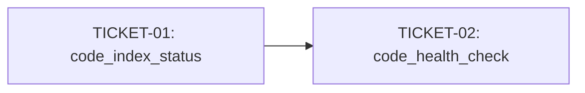

# Tasks — MCP health_check + index_status tools

> Sliced from research findings (`.skillgrid/specs/2026-09-17-sqlite-ai-code-indexing/findings.md`) and ory/lumen comparison.
> Vertical tracer-bullet tickets, dependency-ordered, sized for one fresh agent context window.

## Epic Summary

Add two MCP tools — `code_health_check` and `code_index_status` — that give the
agent a fast signal on index freshness and state before it relies on
`code_explore` / `code_hybrid_search` results. Modeled on ory/lumen's
`health_check` + `index_status` tools. Low effort, high value: the agent needs
to know "is my index fresh enough to trust?" without running the full
`skillgrid doctor` round-trip.

## Delivery Strategy

| Field | Value |
|-------|-------|
| Estimated changed lines | ~400-600 |
| 400-line budget risk | Medium |
| Chained PRs recommended | No |
| Suggested split | Single PR |
| Delivery strategy | single-pr |
| Chain strategy | n/a |

Decision needed before apply: No
Chained PRs recommended: No
Chain strategy: n/a
400-line budget risk: Medium

### Suggested Work Units

| Unit | Goal | Likely PR | Focused test command | Runtime harness | Rollback boundary |
|------|------|-----------|----------------------|-----------------|-------------------|
| 1 | code_index_status + code_health_check MCP tools | PR 1 | `go test ./internal/mnemonic/mcp/ -run TestIndexStatus -run TestHealthCheck` | MCP server with seeded store | Remove tools_code_index_status.go + tools_code_health_check.go + their test files; revert server.go registration |

## Tickets

### TICKET-01 — code_index_status MCP tool

- **Scope:** Add an MCP tool `code_index_status` that returns index state: file count, symbol count, chunk count, embedding count, last-indexed timestamp, stale file count (from fingerprint drift), and extractor stamp.
- **Acceptance:**
  - `code_index_status` appears in the MCP tool list
  - Calling it on a seeded store returns JSON with: `files_indexed`, `symbols`, `chunks`, `embeddings`, `last_indexed`, `stale_files`, `extractor_stamp`
  - Calling it on an unindexed repo returns a clear "not indexed" message, not an error
  - Tool is hidden by default (behind the code-tool filter, same as other code_* tools)
  - `go test ./internal/mnemonic/mcp/ -run TestIndexStatus` passes
- **SATISFIES:** index-status-returns-state, index-status-not-indexed, index-status-hidden-by-default
- **Files:** `mcp/tools_code_index_status.go` (new), `mcp/tools_code_index_status_test.go` (new), `mcp/server.go` (register), `mcp/filter.go` (or equivalent, add to hidden-by-default list)
- **Size:** ~250 (S)
- **Blocks:** TICKET-02
- **Blocked by:** none

### TICKET-02 — code_health_check MCP tool

- **Scope:** Add an MCP tool `code_health_check` that returns a fast health signal: store open (bool), fingerprint fresh (bool, from stat-walk), embedder alive (bool, from model() != "" + a lightweight probe), and a one-line summary ("healthy" / "stale" / "embedder down" / "not indexed").
- **Acceptance:**
  - `code_health_check` appears in the MCP tool list
  - Calling it on a fresh store returns `{"status": "healthy", "store_open": true, "fingerprint_fresh": true, "embedder_alive": true}`
  - Calling it after a file change (fingerprint stale) returns `"status": "stale"` with `"fingerprint_fresh": false`
  - Calling it with no embedder configured returns `"embedder_alive": false`
  - Calling it on an unindexed repo returns `"status": "not indexed"`
  - Response is <50ms (no embed round-trip, no full doctor)
  - `go test ./internal/mnemonic/mcp/ -run TestHealthCheck` passes
- **SATISFIES:** health-check-healthy, health-check-stale, health-check-embedder-down, health-check-not-indexed, health-check-fast
- **Files:** `mcp/tools_code_health_check.go` (new), `mcp/tools_code_health_check_test.go` (new), `mcp/server.go` (register), `mcp/filter.go` (add to hidden-by-default list)
- **Size:** ~300 (S)
- **Blocks:** none
- **Blocked by:** TICKET-01 (shares the store-open + fingerprint-drift plumbing)

## Dependency Graph

## Execution Order

- **Wave 1:** TICKET-01 (index_status — establishes the store-open + count-query plumbing)
- **Wave 2:** TICKET-02 (health_check — reuses TICKET-01's store-open + fingerprint-drift helpers, adds embedder probe + fast-path)

> **Acceptance-first (BDD is always on):** a ticket's failing acceptance
> scenario (its `SATISFIES` scenario) is written and confirmed RED *before*
> the implementation that makes it green.

## Slicing Notes

- **Why TICKET-01 blocks TICKET-02:** both tools need the same plumbing — open
  the store for a repo, run fingerprint drift, query counts. TICKET-01 builds
  this plumbing (it's the heavier consumer of counts). TICKET-02 reuses it and
  adds the embedder probe + the fast-path status classification. If they were
  independent, they'd duplicate the store-open + drift logic.

- **Why not a single ticket:** the two tools have different response shapes
  (index_status is a data report, health_check is a status classification) and
  different test scenarios. Splitting keeps each ticket's acceptance criteria
  focused and each test file independent.

- **`code_embedding_status` already exists** (tools_code_hybrid.go:79) and
  returns embedder provider/model/dim/count. `code_health_check` is different:
  it's a fast liveness probe (model() != "" + store open + fingerprint fresh),
  not a detailed embedding report. The two are complementary — health_check is
  the "is it alive?" signal, embedding_status is the "what's configured?"
  report.

- **Fingerprint drift** is already implemented in `codeindex/fingerprint.go`
  (`FingerprintDriftDB`). Both tools call it. No new drift logic needed.

- **Fast-path constraint** for health_check: no embed round-trip, no full
  doctor. The embedder probe is `emb.Model() != ""` (the model name is set
  when the embedder is constructed; a down/nil embedder has Model() == "").
  This is a <1ms check, not a <50ms inference.
