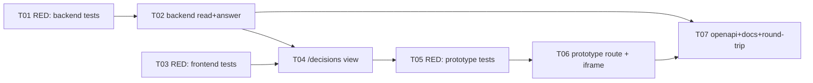

# Tasks — Visual Companion (Mnemonic Decision Bridge)

> Sliced from `.skillgrid/specs/2026-09-19-embed-visual-companion/blueprint.md`.
> Vertical tracer-bullet tickets, dependency-ordered, sized for one fresh agent context window.

## Epic Summary

Close the interview loop: the agent posts interview questions as governed Mnemonic
`decision` observations (durable, versioned); the user answers them in the existing
`skillgrid serve` dashboard; the agent reads the decision back via the existing
`mem_search`. No new table, migration, transport, or process. A second visual function
— throwaway interactive HTML prototypes at `.skillgrid/prototype/<topic>/<variant>.html`
— is served by a new `GET /prototype` route and rendered in the existing sandboxed
iframe inside the decision card.

## Delivery Strategy

| Field | Value |
|-------|-------|
| Estimated changed lines | 900–1400 (2 packages + UI + 5 routes + 4 docs) |
| 400-line budget risk | High |
| Chained PRs recommended | Yes |
| Suggested split | PR 1 (backend read + answer) → PR 2 (frontend + prototype) → PR 3 (openapi/docs) |
| Delivery strategy | ask-on-risk |
| Chain strategy | stacked-to-main (recommended) or feature-branch-chain |

Decision needed before apply: Yes
Chained PRs recommended: Yes
Chain strategy: stacked-to-main
400-line budget risk: High

### Suggested Work Units

| Unit | Goal | Likely PR | Focused test command | Runtime harness | Rollback boundary |
|------|------|-----------|----------------------|-----------------|-------------------|
| 1 | Backend decision bridge: `GET /mnemonic/decisions` + `POST .../answer` (filter + state flip + version append) | PR 1 | `go test -count=1 ./internal/mnemonic/http/...` | live `skillgrid serve` + curl (real store) | `decisions.go`, `decisions_test.go`, `memory/governance.go` (UpdateContent), the 2 server.go route lines |
| 2 | Frontend `/decisions` view + prototype serve route + sandboxed iframe in card | PR 2 | `go test ./internal/mnemonic/http/...` + `pnpm --filter skillgrid-ui test` | dashboard UI + real store + a seeded `.skillgrid/prototype` file | `features/decisions/*`, `app.tsx`, `AppLayout.tsx`, `prototype.go`, `prototype_test.go` |
| 3 | openapi + docs + MCP round-trip guard | PR 3 | `go test ./internal/mnemonic/http/...` (round-trip test) + docs lint | openapi.yaml + `docs/user-guide/10-decision-companion.md` | `ui/openapi.yaml`, `docs/user-guide/10-decision-companion.md` |

> The four plain-text guard lines above are the **contract** — `skillgrid:subagent-execution` matches them literally. Risk is High, so every work unit names a focused test, a runtime harness (or `N/A` + reason), and a rollback boundary.

## Tickets

> **Acceptance-first (BDD is always on):** each implementation ticket is preceded by a
> RED-scenario ticket that writes the failing acceptance test first. The RED ticket is
> small (test-only) and blocks the implementation ticket. Scenario names below are the
> `SATISFIES` traceability oracle for `skillgrid:qa`.

### TICKET-01 — RED: decision list + answer acceptance tests

- **Scope:** Write the failing acceptance tests (no implementation yet) for the two backend routes: a `GET /mnemonic/decisions` list test (filters `type=decision` + `content.state=pending`, orders ascending by `created_at`) and a `POST /mnemonic/decisions/{id}/answer` test (state flip `pending`→`answered`, appends `observation_versions`, bumps `revision_count`, `actor=user:<name>`, idempotent no-op on re-answer, `404` on bad id, `409` when `content.state` is missing/invalid).
- **Acceptance:** `go test -count=1 ./internal/mnemonic/http/... -run 'TestDecision'` fails (routes not yet registered / `UpdateContent` undefined) with the exact expected assertions; test file compiles against the proposed `memory.UpdateContent` signature (add a forward declaration or interface stub if needed so it compiles RED, not a build error).
- **SATISFIES:** Scenario "agent posts a pending decision, dashboard lists it" + Scenario "user answers, agent reads it back, decision is versioned" (RED state).
- **Files:** `internal/mnemonic/http/decisions_test.go` (new).
- **Size:** ~150 (S)
- **Blocks:** TICKET-02
- **Blocked by:** none
- **Fails-when:** `go test` exits non-zero on the decision tests (expected RED) but the package still compiles.

### TICKET-02 — `GET /mnemonic/decisions` + `POST /mnemonic/decisions/{id}/answer`

- **Scope:** Implement the read route (filter `type=decision` + `content.state=pending` from `GET /mnemonic/memories` output, ascending by `created_at`, return `{decisions, total}`) and the write route (parse `{answer, rationale?, answerer?}`, require `content.state` present + valid, set `state="answered"` + `answer` + `rationale`, `actor=user:<name>` via `UpdateContent`, `404` bad id, `409` missing/invalid `content.state`, idempotent no-op when already answered). Add `UpdateContent` to `memory` with version append. Register both routes in `server.go` before `registerUIRoutes()`.
- **Acceptance:** TICKET-01 tests now pass; a live `skillgrid serve` + curl round-trip: seed a `type=decision`/`state=pending` observation via `mem_save`, `GET /mnemonic/decisions` lists it, `POST .../answer` flips it, re-`GET` shows `state=answered` with the answer, `observation_versions` gained a row, re-`POST` is a no-op, bad id → `404`, memory without `content.state` → `409`.
- **SATISFIES:** Scenario "agent posts a pending decision, dashboard lists it" + Scenario "user answers, agent reads it back, decision is versioned" (GREEN).
- **Files:** `internal/mnemonic/http/decisions.go` (new), `internal/mnemonic/http/decisions_test.go` (fill in), `internal/mnemonic/memory/governance.go` (add `UpdateContent` + tests), `internal/mnemonic/http/server.go` (register routes).
- **Size:** ~450 (M)
- **Blocks:** TICKET-04
- **Blocked by:** TICKET-01
- **Fails-when:** `go test -count=1 ./internal/mnemonic/http/...` exits non-zero.

### TICKET-03 — RED: frontend `/decisions` view acceptance tests

- **Scope:** Write the failing React acceptance tests (no components yet) for `/decisions`: a list renders the pending decision inbox (title + body + created), clicking a card opens the detail with a textarea + submit, submitting POSTs to `POST /mnemonic/decisions/{id}/answer` and on success shows `state=answered` + the stored answer, a decision without `visual` renders no iframe, a decision with `visual` renders the sandboxed iframe at `/prototype/{visual}`.
- **Acceptance:** `pnpm --filter skillgrid-ui test` (or the project's vitest runner) fails on the decision view tests (route/component not yet present) with the expected assertions; tests compile.
- **SATISFIES:** Scenario "dashboard shows the pending decision inbox" + Scenario "user answers in the dashboard, it round-trips" + Scenario "visual companion renders a throwaway prototype" (RED state).
- **Files:** `skillgrid-ui/src/features/decisions/DecisionsPage.test.tsx`, `DecisionCard.test.tsx` (new).
- **Size:** ~200 (S)
- **Blocks:** TICKET-04, TICKET-05
- **Blocked by:** none
- **Fails-when:** the UI test runner exits non-zero on the decision view tests (expected RED) but the UI package compiles.

### TICKET-04 — `/decisions` dashboard view (inbox + answer round-trip)

- **Scope:** Build the `/decisions` route + `DecisionsPage` (left inbox list of pending decisions, right detail), `DecisionCard` (title/body/created + answer textarea + submit → `POST .../answer`, on success show `state=answered` + stored answer, idempotent re-answer is a no-op), `api.ts` (fetch `GET /mnemonic/decisions`, POST answer). Add the `/decisions` route to `app.tsx` and a nav entry to `AppLayout.tsx`.
- **Acceptance:** TICKET-03 tests now pass; in the live dashboard, the pending decision appears in the inbox, the user types an answer and submits, the card flips to `state=answered` and shows the stored answer, a second submit is a no-op, and the decision no longer appears in the pending list on reload.
- **SATISFIES:** Scenario "dashboard shows the pending decision inbox" + Scenario "user answers in the dashboard, it round-trips" (GREEN).
- **Files:** `skillgrid-ui/src/features/decisions/DecisionsPage.tsx`, `DecisionCard.tsx`, `api.ts` (new), `skillgrid-ui/src/app.tsx` (route), `skillgrid-ui/src/components/layout/AppLayout.tsx` (nav).
- **Size:** ~350 (M)
- **Blocks:** TICKET-05
- **Blocked by:** TICKET-02, TICKET-03
- **Fails-when:** the UI test runner exits non-zero on the decision view tests.

### TICKET-05 — RED: prototype serve route + iframe acceptance tests

- **Scope:** Write the failing acceptance tests (no implementation yet) for the prototype function: `GET /prototype/{id...}` serves `.skillgrid/prototype/<topic>/<variant>.html` with `Content-Type: text/html`, returns `404` for a missing file, returns `400`/`404` for a path-traversal escape (e.g. `/prototype/../../.stitch/foo.html`), and `DecisionCard` renders the sandboxed iframe only when `content.visual` is set (attr `sandbox="allow-scripts"` and **not** `allow-same-origin`).
- **Acceptance:** `go test -count=1 ./internal/mnemonic/http/... -run 'TestPrototype'` and the UI iframe test fail (route/component not yet wired) with the expected assertions; tests compile.
- **SATISFIES:** Scenario "visual companion renders a throwaway prototype" (RED state) + Scenario "path traversal is rejected" (RED state).
- **Files:** `internal/mnemonic/http/prototype_test.go` (new), `skillgrid-ui/src/features/decisions/DecisionCard.test.tsx` (add iframe cases).
- **Size:** ~150 (S)
- **Blocks:** TICKET-06
- **Blocked by:** TICKET-04 (iframe lives in DecisionCard)
- **Fails-when:** the prototype go test and the UI iframe test exit non-zero (expected RED) but packages compile.

### TICKET-06 — prototype serve route + sandboxed iframe in the card

- **Scope:** Implement `GET /prototype/{id...}` in `internal/mnemonic/http/prototype.go` — root = `.skillgrid/prototype/` (via `sddRoot()`), reuse the `stitchFile` traversal-guard shape (reject absolute ids, `..`, and anything escaping the root after `filepath.Clean`), serve `text/html`. Register the route in `server.go` (distinct subtree from the plural `/prototypes`). Wire `DecisionCard` to render the existing `SandboxPreview` iframe (src=`/prototype/{content.visual}`) only when `visual` is set.
- **Acceptance:** TICKET-05 tests now pass; with a seeded `.skillgrid/prototype/<topic>/a.html`, `GET /prototype/<topic>/a.html` returns the HTML, traversal `GET /prototype/../../etc/passwd` is rejected, and the dashboard decision card shows the prototype in a sandboxed iframe.
- **SATISFIES:** Scenario "visual companion renders a throwaway prototype" (GREEN) + Scenario "path traversal is rejected" (GREEN).
- **Files:** `internal/mnemonic/http/prototype.go` (new), `internal/mnemonic/http/prototype_test.go` (fill in), `internal/mnemonic/http/server.go` (register route), `skillgrid-ui/src/features/decisions/DecisionCard.tsx` (iframe).
- **Size:** ~300 (M)
- **Blocks:** none
- **Blocked by:** TICKET-04, TICKET-05
- **Fails-when:** `go test -count=1 ./internal/mnemonic/http/...` or the UI iframe test exits non-zero.

### TICKET-07 — openapi + docs + MCP round-trip guard

- **Scope:** Add `/mnemonic/decisions`, `/mnemonic/decisions/{id}/answer`, `/prototype/{id...}` to `ui/openapi.yaml`. Add `docs/user-guide/10-decision-companion.md` (content schema + poll loop + `.skillgrid/prototype/` convention). Add the round-trip guard test: `GET /mnemonic/decisions` lists exactly the seeded decision; `mem_search("state pending")` is consistent with the list; the answer round-trip is visible to a fresh MCP `mem_search`.
- **Acceptance:** openapi.yaml validates (or the existing openapi test passes); the docs file exists and is referenced; `go test -count=1 ./internal/mnemonic/http/... -run 'TestDecisionRoundTrip'` passes (list ↔ `mem_search` consistency + answer visible to fresh MCP `mem_search`).
- **SATISFIES:** Scenario "the MCP round-trip is guard-tested" (GREEN).
- **Files:** `internal/mnemonic/http/ui/openapi.yaml`, `docs/user-guide/10-decision-companion.md` (new), `internal/mnemonic/http/decisions_test.go` (add round-trip test).
- **Size:** ~200 (S)
- **Blocks:** none
- **Blocked by:** TICKET-06 (openapi documents all 3 routes incl. `/prototype` from T06; round-trip test needs the answer route T02 + the stable route set). Run after T06 so the openapi reflects the final route set.
- **Fails-when:** `go test -count=1 ./internal/mnemonic/http/...` exits non-zero or the openapi test fails.

## Dependency Graph

## Execution Order

- **Wave 1 (parallel):** TICKET-01 (RED backend), TICKET-03 (RED frontend)
- **Wave 2:** TICKET-02 (backend read+answer, after T01)
- **Wave 3:** TICKET-04 (/decisions view, after T02 + T03)
- **Wave 4:** TICKET-05 (RED prototype, after T04)
- **Wave 5:** TICKET-06 (prototype route + iframe, after T04 + T05)
- **Wave 6:** TICKET-07 (openapi+docs+round-trip, after T06)

> **Acceptance-first:** the RED-scenario tickets (T01, T03, T05) are written and
> confirmed RED before their implementation tickets (T02, T04, T06) make them green.

## Slicing Notes

- **Acceptance-first slicing:** 3 RED-scenario tickets (T01, T03, T05) precede their
  implementation tickets. RED tickets are test-only and small (~150–200 lines each).
- **T04 is the integration seam** — it needs the backend (T02) to POST to and the
  frontend (T03) tests to pass; it is the first ticket where the full read→answer loop is
  demoable in the browser.
- **T05 depends on T04** because the iframe is rendered inside `DecisionCard` (a T04 file);
  the prototype go test itself is independent of the UI but the RED ticket is grouped with
  T04 so the iframe assertion lives with the card.
- **T07 is independent of the UI** (openapi + docs + a backend round-trip test) and only
  needs T02's answer route; it runs in Wave 4 in parallel with T05.
- **Prototype path is `.skillgrid/prototype/`** (distinct from `.stitch/` and from
  `sketch.dir` = `{specs_root}/{topic}/sketches/`). The route reuses `stitchFile`'s guard
  shape; only the root differs.
- **`sketch.dir` config** (pointing the `sketch` skill at `.skillgrid/prototype/<topic>/`
  for the companion flow) is a config/skill note, not a code change in this blueprint —
  captured in `docs/user-guide/10-decision-companion.md` (T07).
- **Assumption:** `mem_search` over the live `aiskillgrid` store returns `type=decision`
  observations (T01/T02 verify in the door-check before committing to the filter).
- **Work-unit PR boundaries:** PR 1 = T01+T02 (backend), PR 2 = T03+T04+T05+T06
  (frontend + prototype), PR 3 = T07 (openapi/docs). Each unit is independently
  revertable per the rollback boundary table.
