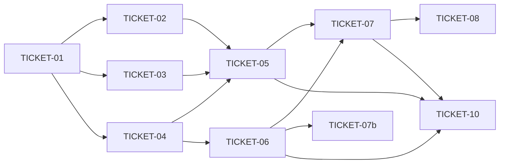

# Tasks — Session events layer

> Sliced from `.skillgrid/specs/2026-09-21-session-events-layer/blueprint.md`.
> Vertical tracer-bullet tickets, dependency-ordered, sized for one fresh agent context window.

## Epic Summary

Replace `checkpoint.json` + the Handoff Hub with a session→events layer: one ordered event stream per session (migration → capture → read), then delete the old layer, repoint skills, add per-plan workspaces, and drop the old tables. Task 0 (acceptance.feature) is already committed (`a05099f`); the hook-layout/mirror-install groundwork is already done and is not re-sliced here.

## Delivery Strategy

| Field | Value |
|-------|-------|
| Estimated changed lines | ~5,500 (mostly deletions: hub pkg, relay, HTTP, UI, MCP tools) |
| 400-line budget risk | High |
| Chained PRs recommended | Yes |
| Suggested split | Unit 1 (tracer) → Unit 2 (capture) → Unit 3 (removals + skills + sdd) → Unit 4 (schema close) |
| Delivery strategy | ask-on-risk |
| Chain strategy | feature-branch-chain (suggested; team decides) |

Decision needed before apply: Yes
Chained PRs recommended: Yes
Chain strategy: pending
400-line budget risk: High

### Suggested Work Units

| Unit | Goal | Likely PR | Focused test command | Runtime harness | Rollback boundary |
|------|------|-----------|----------------------|-----------------|-------------------|
| 1 | Tracer: 040 migration + session start/end events + SessionChanges | PR 1 (base: release/2) | `go test ./internal/mnemonic/memory/ -run TestSessionStartEndEvents` | session show on a real repo session | new files + additive columns only |
| 2 | Capture: tool events + sensitive redaction + commit events + read CLI/MCP | PR 2 (base: PR 1) | `go test ./internal/mnemonic/memory/ -run 'TestPostToolUse\|TestSensitiveWrite\|TestCommitEvent'` | post_tool_use hook + commit in a scratch repo | new files + additive hook branch |
| 3 | Removals + skills + sdd scripts (one-way steps inside) | PR 3 (base: PR 2) | `bash scripts/test-hooks.sh` + `go build ./...` | removed surfaces error cleanly | deletions — restore via revert of PR 3 |
| 4 | Schema close: 041 drops old tables | PR 4 (base: PR 3) | `go test ./internal/mnemonic/store/` | migrate a Hub-era DB, old tables gone | tables restorable from git log replay |

> The four plain-text guard lines above are the **contract** — `skillgrid:subagent-execution` matches them literally. If risk is High, `Chained PRs recommended` MUST be `Yes` and every work unit MUST name a focused test, a runtime harness (or `N/A` + reason), and a rollback boundary.

## Tickets

### TICKET-01 — Migration 040 plus session start/end events plus SessionChanges

- **Scope:** Tracer thread end-to-end: 040 schema, start/end event writes with commit range, ordered read.
- **Acceptance:** `TestMigration040SessionEvents` and `TestSessionStartEndEvents` pass; `SessionChanges(sid)` returns start/end in order with from/to commits.
- **SATISFIES:** session-lifecycle, resume-from-events
- **Files:** `store/migrations/040_session_events.sql`, `store/migrations_040_test.go`, `memory/service.go`, `memory/changes.go`, `memory/changes_test.go` (~5 files)
- **Size:** ~M (450)
- **Blocks:** TICKET-02, TICKET-03, TICKET-04
- **Blocked by:** none
- **Precondition:** `go build ./...` passes on a clean tree
- **Reversibility:** costly (SQLite ADD COLUMN has no clean downgrade; a fresh DB sidesteps it)
- **Fails-when:** `go test` exits non-zero or `FAIL` appears in output

### TICKET-02 — Tool-call events plus counters plus sensitive redaction

- **Scope:** `post_tool_use` hook branch: ordered event rows, counter bumps in-transaction, sensitive matcher with hash/preview-only storage.
- **Acceptance:** Two hook calls yield sequences 1, 2 with counters bumped; `.env` write flags sensitive with no full secret in payload.
- **SATISFIES:** tool-call-stream, sensitive-redaction
- **Files:** `memory/skills.go`, `memory/sensitive.go` (new), `memory/hooks_events_test.go` (~3 files)
- **Size:** ~M (500)
- **Blocks:** TICKET-05
- **Blocked by:** TICKET-01

### TICKET-03 — Commit events with parsed context block

- **Scope:** Post-commit record path writes `commit` events (sha + parsed Task/Decisions/Remaining/Tried); block-less commits still recorded.
- **Acceptance:** `TestCommitEventParsesContextBlock` passes for both block and block-less commits; non-repo path errors cleanly.
- **SATISFIES:** commit-events
- **Files:** record-path file + `memory/commit_events_test.go` (~2 files)
- **Size:** ~S (250)
- **Blocks:** TICKET-05
- **Blocked by:** TICKET-01

### TICKET-04 — Session read: CLI plus MCP tool

- **Scope:** `skillgrid session <id> [--show-diff]` and `session_changes` MCP tool over `SessionChanges`.
- **Acceptance:** CLI prints ordered events; `--show-diff` adds `git diff --stat from..to`; unknown id errors; MCP tool returns events JSON.
- **SATISFIES:** resume-from-events
- **Files:** `cmd/skillgrid/session.go`, `mcp/tools_session_events.go` (new), CLI + MCP tests (~4 files)
- **Size:** ~M (500)
- **Blocks:** TICKET-05, TICKET-06
- **Blocked by:** TICKET-01

### TICKET-05 — Delete Handoff Hub package plus CLI command

- **Scope:** Delete `internal/mnemonic/handoff/`, `cmd/skillgrid/handoff.go` (+tests), strip `main.go` dispatch; `skillgrid handoff` becomes unknown-subcommand.
- **Acceptance:** `TestHandoffCommandGone` passes; `rg "mnemonic/handoff"` over Go sources is empty; full build green.
- **SATISFIES:** old-surfaces-removed
- **Files:** ~10 files removed, `main.go`, 1 test (~12 files)
- **Size:** ~M (800, mostly deletions)
- **Blocks:** TICKET-07, TICKET-10
- **Blocked by:** TICKET-02, TICKET-03, TICKET-04

### TICKET-06 — Delete hub and relay MCP tools

- **Scope:** Delete `tools_handoff.go`, `tools_session_handoff.go`, `tools_session_status.go`; deregister in `server.go`.
- **Acceptance:** Registry test: 9 tool names absent, `session_changes` present; `mcp` package suite green.
- **SATISFIES:** old-surfaces-removed
- **Files:** ~5 files
- **Size:** ~S (400, deletions)
- **Blocks:** TICKET-07, TICKET-10
- **Blocked by:** TICKET-04
- **Precondition:** `session_changes` MCP tool is registered and passing (TICKET-04 committed)
- **Reversibility:** one-way (published tool removal breaks UI, skills, external clients — human checkpoint before this ticket)
- **Fails-when:** registry test fails or any remaining reference to the 9 names exists in non-test sources

### TICKET-07 — Delete relay, hub HTTP, envelope field, bash snapshot/restore

- **Scope:** Delete `internal/mnemonic/relay/`, `http/handoff.go` (+test, strip `activity.go`), `memory/envelope.go` HandoffRefs, `session.go` handoff/resume/status; strip `snapshot`/`restore` + hub mirror from `checkpoint-state.sh` (keep guards).
- **Acceptance:** `checkpoint-state.sh snapshot` errors unknown-subcommand; `rg` for the five table names + `cleave` in Go sources is empty; `test-hooks.sh` green at its adjusted count.
- **SATISFIES:** old-surfaces-removed
- **Files:** ~15 files (Go, bash)
- **Size:** ~M (900, mostly deletions)
- **Blocks:** TICKET-08, TICKET-10
- **Blocked by:** TICKET-05, TICKET-06

### TICKET-07b — Remove hub UI panes

- **Scope:** Delete `HandoffsPane.tsx` + `ChangesPane.tsx`, strip handoff calls from `api.ts`, fix remaining UI references.
- **Acceptance:** UI builds with no handoff-pane imports; no `handoff`/`Handoff` references remain under `skillgrid-ui/src/features/sessions/`.
- **SATISFIES:** old-surfaces-removed
- **Files:** ~4 files (UI)
- **Size:** ~S (200, deletions)
- **Blocks:** none
- **Blocked by:** TICKET-06 (tool contracts it rendered must be gone first)

### TICKET-08 — Repoint skills to the events model

- **Scope:** Rewrite the 14 skill files + `sdd-structure.md` to the events model; regenerate the site partial.
- **Acceptance:** Grep check: zero `checkpoint.json`, `snapshot|restore`, `handoff verify|record|archive|checkpoint`, `.cleave` refs; site partial regenerated.
- **SATISFIES:** resume-from-events, old-surfaces-removed
- **Files:** 14 skill files + site partial (~15 files)
- **Size:** ~M (600, docs)
- **Blocks:** none
- **Blocked by:** TICKET-07

### TICKET-09 — Per-plan sdd workspace scripts

- **Scope:** Port `sdd-workspace`/`task-brief`/`review-package` (repathed to `.skillgrid/sdd`) plus `test-sdd-workspace.sh`.
- **Acceptance:** Distinct plans resolve distinct dirs; artifacts land per-plan; parent `.gitignore` keeps `git status` clean; missing plan exits 2.
- **SATISFIES:** per-plan-workspace
- **Files:** 3 scripts + 1 test (~4 files)
- **Size:** ~S (400)
- **Blocks:** none
- **Blocked by:** none

### TICKET-10 — Migration 041 drops old tables

- **Scope:** Drop `change_snapshots`, `checkpoints`, `handoff_refs`, `session_handoffs`, `session_archives` + six indexes.
- **Acceptance:** Hub-era DB migrates with the five tables absent and `sessions`/`session_events` intact; full store suite green.
- **SATISFIES:** old-surfaces-removed
- **Files:** `store/migrations/041_drop_handoff_tables.sql` + schema test (~2 files)
- **Size:** ~S (100)
- **Blocks:** none
- **Blocked by:** TICKET-05, TICKET-06, TICKET-07
- **Precondition:** `rg` for the five table names across Go sources returns nothing (zero readers — checkable, read-only)
- **Reversibility:** one-way (Hub UI history gone; reconstructable from git log only — human checkpoint before this ticket)
- **Fails-when:** store suite fails or any dropped table still exists post-migrate

## Dependency Graph

## Execution Order

- **Wave 1 (parallel):** TICKET-01, TICKET-09
- **Wave 2 (parallel):** TICKET-02, TICKET-03, TICKET-04 (after TICKET-01)
- **Wave 3 (parallel):** TICKET-05 (after TICKET-02 + TICKET-03 + TICKET-04), TICKET-06 (after TICKET-04; human checkpoint: one-way MCP removal)
- **Wave 4 (parallel):** TICKET-07 (after TICKET-05 + TICKET-06), TICKET-07b (after TICKET-06)
- **Wave 5 (parallel):** TICKET-08, TICKET-10 (after TICKET-07; human checkpoint before TICKET-10: one-way table drops)

> **Acceptance-first (BDD is always on):** a ticket's failing acceptance
> scenario (its `SATISFIES` scenario) is written and confirmed RED *before*
> the implementation that makes it green. Order RED-test / scenario tickets
> ahead of their implementation tickets in the dependency graph.

## Slicing Notes

- Blueprint Tasks 1+2 fused into TICKET-01: the migration alone is not demoable, and the tracer thread (schema → write → read) is the door check — splitting them would strand an invisible schema ticket.
- Blueprint Tasks 6–8 (all deletions) split into four tickets by seam (Go pkg/CLI, MCP registry, relay/HTTP/bash, UI panes) so a reviewer can reject one surface's removal without blocking the others; the UI split also keeps every ticket within one context window.
- TICKET-09 is wave 1: the sdd scripts touch no Go code and depend on nothing.
- TICKET-08 and TICKET-10 share Wave 5: docs don't read tables, so the drop migration doesn't wait on prose.
- Task 0 (acceptance.feature) is done and committed; hook-layout/mirror-install groundwork is done and excluded from slicing.
- No `Note: assumed decision` debt — blueprint status is PROPOSED, not ASSUMED.
