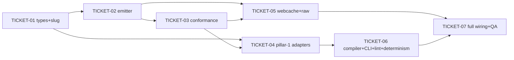

# Tasks — llmwiki-okf-wiki (OKF v0.2 `.wiki/` Compiler, Pillar 1)

> Sliced from `.skillgrid/specs/2026-09-29-llmwiki-okf-wiki/spec.md` + `design.md`.
> Vertical tracer-bullet tickets, dependency-ordered, sized for one fresh agent context window.
> Build shape: **Thinnest usable whole** — ticket 1 lands the end-to-end compiler over ADRs + State (the design door-check slice); later tickets add the remaining adapters and the lint/expand/QA tail.

## Epic Summary

A pure-Go `wiki` capability: `skillgrid wiki compile` + `wiki lint` that projects `.skillgrid/` (ADRs, constraints, terms, state, specs, spikes, architecture) + `web_cache` SQLite + user-dropped `raw/` into a single `.wiki/` that is simultaneously an OKF v0.2 bundle, an Obsidian vault, and a microsoft/llmwiki workspace. Deterministic (no-churn), no new Go deps, EXTRACTED edges only.

## Delivery Strategy

| Field | Value |
|-------|-------|
| Estimated changed lines | ~1100 (new `internal/mnemonic/wiki/` package + `cmd/skillgrid/wiki.go` + tests) |
| 400-line budget risk | High |
| Chained PRs recommended | No (serial single-branch; commit per work-unit) |
| Suggested split | Single PR; multiple atomic work-unit commits (spec zone → code zone) |
| Delivery strategy | single-pr (multiple atomic work-unit commits) |
| Chain strategy | n/a |

Decision needed before apply: Yes
Chained PRs recommended: No
Chain strategy: n/a
400-line budget risk: High

> **single-pr + High risk requires a `size:exception`.** This is a self-contained new capability in one new package (`internal/mnemonic/wiki/`) + one cobra command file; no existing file is touched except the `root.go` command registration. The reviewer can validate the whole capability as one unit. Maintainer approval for `size:exception` is requested before apply.

### Suggested Work Units

| Unit | Goal | Likely PR | Focused test command | Runtime harness | Rollback boundary |
|------|------|-----------|----------------------|-----------------|-------------------|
| 1 | Emitter + conformance + adapters (Steps 1–5, 9–12) | PR 1 (same PR) | `go test ./internal/mnemonic/wiki/...` | N/A — pure functions, table-driven unit tests over fixtures | `internal/mnemonic/wiki/` files `concept.go slug.go emitter.go conform.go skillgrid.go webcache.go raw.go` (+ their `_test.go`) — remove the package, no behavior change |
| 2 | Compiler + CLI thinnest slice (Steps 6–8) | PR 1 (same PR) | `go test ./internal/mnemonic/wiki/...` + `skillgrid wiki compile` on real repo | Real repo: `skillgrid wiki compile` then open `.wiki/` in Obsidian; `git diff --exit-code .wiki` on no-op recompile | `internal/mnemonic/wiki/compile.go index.go` + `cmd/skillgrid/wiki.go` — remove command registration + package files |
| 3 | Full wiring + index/log/AGENTS + QA (Steps 13–15) | PR 1 (same PR) | `go test ./...` + `skillgrid wiki compile` + `skillgrid wiki lint` on real repo | Real repo: full `.wiki/` tree, `wiki lint` exit 0, Obsidian link resolution, llmwiki layout match | `cmd/skillgrid/wiki.go` (full wiring) + `compile.go` (adapter wiring) + `index.go` finalization |

## Tickets

### TICKET-01 — Concept + Edge types + Slugify/TypeDir (pure)

- **Scope:** `internal/mnemonic/wiki/concept.go` — `Concept{ID, Type, Title, Description, Resource, Tags, Sources, Generated, Verified, Status, StaleAfter, SourcePath, Body}`, `SourceRef{ID, Resource, Title, Author, UsageCount, LastModified}`, `Verifier{By, At}`, `Edge{From, To, Kind, Confidence}`. `slug.go` — `Slugify(title) string`, `TypeDir(type) string` (map: `ADR→adr`, `Term|Constraint→concepts`, `Spec|Spike|State|Architecture|Finding→entities`; unknown→`entities`).
- **Acceptance:** `go test ./internal/mnemonic/wiki/... -run TestSlugify` passes: unicode, punctuation, empty, reserved `index`/`log` all slug correctly. `go test ./internal/mnemonic/wiki/... -run TestTypeDir` passes: every known type maps correctly, unknown→`entities`.
- **SATISFIES:** R1 (types), R3 (source_path target — `source_path` field exists on `Concept`)
- **Files:** `internal/mnemonic/wiki/concept.go`, `internal/mnemonic/wiki/slug.go`, `internal/mnemonic/wiki/concept_test.go`, `internal/mnemonic/wiki/slug_test.go`
- **Size:** ~150 (S)
- **Blocks:** TICKET-02, TICKET-03, TICKET-04, TICKET-05
- **Blocked by:** none

### TICKET-02 — OKF v0.2 emitter (pure, stdlib-only YAML frontmatter writer)

- **Scope:** `internal/mnemonic/wiki/emitter.go` — `Emit(c Concept) (string, error)`. Hand-rolled deterministic frontmatter writer: fixed key order (`type`, `title`, `description`, `resource`, `tags`, `sources`, `generated`, `verified`, `status`, `stale_after`, `source_path`), no `null` keys, absolute-UTC ISO 8601 timestamps, `sources` as a YAML list of maps, `verified` as a list of `{by,at}` (bare map if single). `stale_after` = absolute instant (caller-computed; emitter just formats).
- **Acceptance:** `go test ./internal/mnemonic/wiki/... -run TestEmit` passes: minimal page (R1.1) — output begins `---\n`, contains `type: ADR`, body verbatim after closing `---`; no-null omission (R1.3) — no `tags: null`, `verified: null`, `resource: null`; timestamp format is `…T…Z`; `sources`/`verified` list rendering correct; `source_path` extension key present (R3.1/R3.2).
- **SATISFIES:** R1.1–1.3, R3.1–3.2
- **Files:** `internal/mnemonic/wiki/emitter.go`, `internal/mnemonic/wiki/emitter_test.go`
- **Size:** ~200 (S)
- **Blocks:** TICKET-03, TICKET-04
- **Blocked by:** TICKET-01

### TICKET-03 — Conformance gate

- **Scope:** `internal/mnemonic/wiki/conform.go` — `Conform(page string) []error`: `type` present + non-empty; every `sources[]` has non-empty `resource`; every timestamp parses as absolute UTC ISO 8601; `status` (if present) ∈ {draft, stable, deprecated}. A small frontmatter parser (the `---` block) feeds it.
- **Acceptance:** `go test ./internal/mnemonic/wiki/... -run TestConform` passes: missing `type` (R2.1) → ≥1 error naming it; missing `sources[].resource` (R2.2) → error identifying the entry; bad timestamp → error; bad status → error; clean page → no errors (R2.3).
- **SATISFIES:** R2.1–2.3
- **Files:** `internal/mnemonic/wiki/conform.go`, `internal/mnemonic/wiki/conform_test.go`
- **Size:** ~150 (S)
- **Blocks:** TICKET-04
- **Blocked by:** TICKET-02

### TICKET-04 — Pillar-1 adapters: ASSUMPTIONS.md + State + Terms + Specs/Spikes/Architecture

- **Scope:** `internal/mnemonic/wiki/skillgrid.go`:
  - `ParseAssumptions(path string) ([]Concept, []Edge, error)` — parse `### ADR-NNNN` entries (id, title, status from the in-force table, Supersedes/Amends → edges), the `### In-force set` table (in-force + superseded), and `### Locked constraints` bullets → `Constraint` concepts (status stable, no `stale_after`). Tolerant: missing section → no concepts, no error.
  - `ParseState(path string) (*Concept, []Warning, error)` — parse `pipeline.current_phase`/`current_change`/`status` + `progress` → one `State` concept (status: draft). Unknown top-level keys → warnings (not errors) (R4.5).
  - `ParseTerms(paths ...string) []Concept` — parse `01-business-terms.md` + `02-technical-terms.md` → `Term` concepts (one per defined term); explicit `see [[…]]` cross-refs → edges.
  - `ParseSpecs(dir string) []Concept` — one per `specs/<change>/`; title/goal from `briefing.md`; status from briefing `STATUS` line.
  - `ParseSpikes(dir string) []Concept` — one per `spikes/<NNN-name>/`; verdict from findings/report.
  - `ParseArchitecture(path string) *Concept` — existence-gated (R4.4): file absent → nil, no error.
- **Acceptance:** `go test ./internal/mnemonic/wiki/... -run TestParse` passes over fixtures: 12 ADRs, superseded→deprecated (R4.1/4.2), Supersedes edges (R4.1); 3 constraints (R4.3); State happy path + extra-key warning (R4.5); term extraction + cross-ref edges + missing file→none; per-dir spec/spike extraction + missing Architecture→nil (R4.4) + empty specs/→none.
- **SATISFIES:** R4.1–4.5 (all scenarios)
- **Files:** `internal/mnemonic/wiki/skillgrid.go`, `internal/mnemonic/wiki/skillgrid_test.go`, test fixtures (fixture `ASSUMPTIONS.md`, `state.yaml`, `01-business-terms.md`, `02-technical-terms.md`, fixture `specs/` + `spikes/` dirs)
- **Size:** ~400 (S/M)
- **Blocks:** TICKET-05
- **Blocked by:** TICKET-01, TICKET-02, TICKET-03

### TICKET-05 — web_cache indexer (hybrid, option C) + raw/ indexer

- **Scope:**
  - `internal/mnemonic/wiki/webcache.go` — `ParseWebCache(rows []WebRow) []Concept` (+ cited/uncited split). `WebRow{Source, URL, Title, Query, LibraryID, VersionTag, FetchedAt, ExpiresAt, ContentHash}`. Cited (url appears in an emitted page's `sources`) → `Finding` in `entities/`; uncited fresh → `Finding` in `research/` (status draft). `stale_after = fetched_at + 90d`. No `raw/` write.
  - `internal/mnemonic/wiki/raw.go` — `ParseRaw(root string) ([]Concept, error)`: walk `raw/**/*.md` recursively; frontmatter present → `Finding`/declared type, `source_path: raw/<path>`; absent → bare `Source` (filename→title, no `verified`). `source_path` validated bundle-relative (reject absolute/`..`). Never writes `raw/`.
- **Acceptance:** `go test ./internal/mnemonic/wiki/... -run TestWebCache|TestRaw` passes: cited→Finding (R5.1); uncited→research draft (R5.2); expired skipped (R5.3); empty-url degradation (R5.4); OKF note→Finding with `source_path` (R6.1); non-OKF→Source (R6.2); raw/ bytes unchanged (R6.3); empty/absent raw/ (R6.4); path-traversal rejection (T2).
- **SATISFIES:** R5.1–5.4, R6.1–6.4
- **Files:** `internal/mnemonic/wiki/webcache.go`, `internal/mnemonic/wiki/raw.go`, `internal/mnemonic/wiki/webcache_test.go`, `internal/mnemonic/wiki/raw_test.go`, test fixtures (seeded `WebRow` slice, `raw/` tree)
- **Size:** ~300 (S/M)
- **Blocks:** TICKET-07
- **Blocked by:** TICKET-02, TICKET-03

### TICKET-06 — Thinnest slice: compiler + CLI `wiki compile` (ADRs + State only) + determinism + `wiki lint`

- **Scope:**
  - `internal/mnemonic/wiki/compile.go` — `Compile(in CompileInput) (CompileResult, error)`: assemble concepts (ADRs + State only for this ticket), stable sort by `(TypeDir, Slug)`, render `AGENTS.md`/`index.md`/`log.md` (from `index.go`), write `wiki/adr/` + `wiki/entities/`, content-hash gate + `.wiki/.wiki-manifest.json`, injected `Now`.
  - `internal/mnemonic/wiki/index.go` — `RenderIndex(concepts)` (initial version, grouped by type), `AppendLog`, `RenderAgents()` (type taxonomy + slug rule + lint rule).
  - `cmd/skillgrid/wiki.go` — cobra `wiki` group, `compile` subcommand (flags `--project`, `--dir`, `--out`, `--no-llm` [no-op in Pillar 1], `--json`), reuses `openMemService` pattern. `wiki` with no subcommand → usage (R9.3).
  - `cmd/skillgrid/wiki.go` — `lint` subcommand: walk `.wiki/wiki/**/*.md`, run `Conform`, print errors, non-zero exit on any failure.
  - Determinism: prior-manifest load/save, `generated.at` preservation for unchanged content-hashes, byte-compare before write, append `log.md` only on change.
- **Acceptance:** `go test ./internal/mnemonic/wiki/... -run TestCompile` passes: compile a fixture `.skillgrid/` (ASSUMPTIONS + state) into a temp dir; assert tree + frontmatter + links. No-op recompile byte-identical (R8.1); unchanged concept keeps `generated.at` (R8.2); stable ordering (R8.3). `wiki lint` clean bundle exit 0 (R2.3); bad page (missing `type`) exit non-zero (R9.2). `wiki` with no subcommand prints usage (R9.3).
- **SATISFIES:** R8.1–8.3, R2.3, R9.1–9.3
- **Files:** `internal/mnemonic/wiki/compile.go`, `internal/mnemonic/wiki/index.go`, `internal/mnemonic/wiki/compile_test.go`, `internal/mnemonic/wiki/index_test.go`, `cmd/skillgrid/wiki.go`, `cmd/skillgrid/wiki_test.go`, `cmd/skillgrid/root.go` (command registration)
- **Size:** ~500 (M)
- **Blocks:** TICKET-07
- **Blocked by:** TICKET-04
- **Fails-when:** `git diff --exit-code .wiki` returns non-zero after a no-op recompile on the real repo; `skillgrid wiki lint` exits non-zero on the emitted `.wiki/`; Obsidian cannot resolve `[[ADR-0006]]` links.
- **DOOR CHECK (human checkpoint):** after this ticket, run `skillgrid wiki compile` against the real repo. Open `.wiki/` in Obsidian. Confirm ADRs + State render with resolvable `[[ADR-0006]]` links. **If the emitter fights the YAML frontmatter or links don't resolve, stop and fix the emitter before adding sources (TICKET-07).** If it works, continue.

### TICKET-07 — Full compiler wiring (all adapters) + index/log/AGENTS finalization + QA gate

- **Scope:**
  - `internal/mnemonic/wiki/compile.go` — wire all adapters (ASSUMPTIONS, State, Terms, Specs, Spikes, Architecture, WebCache, Raw) into `Compile`.
  - `cmd/skillgrid/wiki.go` — read `.skillgrid/` + `raw/` from the project root, populate `[]WebRow` from `service.Web()`, call `Compile`.
  - `internal/mnemonic/wiki/index.go` — `RenderIndex(concepts)` final: grouped by type with a "Research (uncited)" grouping.
  - QA gate: `go test ./...` green; `go mod tidy` no-op (no new deps); `skillgrid wiki compile` + `wiki lint` on the real repo; verify `.wiki/` opens in Obsidian (links resolve) and matches llmwiki layout (`.wiki/{raw,wiki,index.md,log.md,AGENTS.md}`). Update `ARCHITECTURE.md` §2.1/§3–7 if the package shape settled differently.
- **Acceptance:** e2e test: fixture `.skillgrid/` + seeded `web_cache` + `raw/` → full `.wiki/` tree, all types present, `index.md` lists all (R7.1), `AGENTS.md` schema (R7.2). GATE: `skillgrid wiki compile` on the real repo → `.wiki/` passes `wiki lint` (R2.3). `go test ./...` green. `go mod tidy` is a no-op.
- **SATISFIES:** R7.1–7.2, R2.3, R9.3, All (QA success criteria from design.md)
- **Files:** `internal/mnemonic/wiki/compile.go` (adapter wiring), `cmd/skillgrid/wiki.go` (full I/O), `internal/mnemonic/wiki/index.go` (final grouping), `internal/mnemonic/wiki/compile_e2e_test.go`, `.skillgrid/ARCHITECTURE.md` (if package shape settled differently)
- **Size:** ~350 (S/M)
- **Blocks:** none
- **Blocked by:** TICKET-05, TICKET-06
- **Fails-when:** `go test ./...` exits non-zero; `go mod tidy` produces a diff; `skillgrid wiki lint` exits non-zero on the real-repo `.wiki/`; `.wiki/` does not match llmwiki layout (`.wiki/{raw,wiki,index.md,log.md,AGENTS.md}`).

## Dependency Graph

## Execution Order

- **Wave 1 (parallel):** TICKET-01
- **Wave 2:** TICKET-02 (after TICKET-01), TICKET-05 (after TICKET-01 + TICKET-02 + TICKET-03 — but TICKET-03 is in Wave 3; see note)
- **Wave 3:** TICKET-03 (after TICKET-02), TICKET-04 (after TICKET-01 + TICKET-02 + TICKET-03)
- **Wave 4:** TICKET-06 (after TICKET-04) — **DOOR CHECK here**
- **Wave 5:** TICKET-07 (after TICKET-05 + TICKET-06)

> **Note on Wave 2:** TICKET-05 depends on TICKET-03 (conformance), which is in Wave 3. In practice TICKET-05's `webcache.go` and `raw.go` are pure functions that do not call `Conform` — they only need `Concept`/`SourceRef`/`Edge` types (TICKET-01) and the emitter for formatting tests (TICKET-02). The `Conform` dependency is logical (R5 scenarios reference conformance) but the implementation does not call it. TICKET-05 can run in **Wave 3** alongside TICKET-04, after TICKET-03 completes. Adjusted order:

- **Wave 1:** TICKET-01
- **Wave 2:** TICKET-02
- **Wave 3 (parallel):** TICKET-03, TICKET-04, TICKET-05
- **Wave 4:** TICKET-06 — **DOOR CHECK**
- **Wave 5:** TICKET-07

> **Acceptance-first (BDD is always on):** a ticket's failing acceptance scenario (its `SATISFIES` scenario) is written and confirmed RED *before* the implementation that makes it green. Each ticket's `_test.go` file is written first (RED), then the implementation (GREEN).

## Slicing Notes

- **Split of the draft Step 4–10:** the original Step Blueprint had 15 steps. Steps 1–3 (types, emitter, conformance) map 1:1 to TICKET-01–03. Steps 4, 5, 9, 10 (all pillar-1 adapters) are merged into TICKET-04 — they are independent parse functions in the same file (`skillgrid.go`), share the same fixture pattern, and fit one context window (~400 lines). Steps 11–12 (webcache + raw) are merged into TICKET-05 — same rationale (independent parse functions, same fixture pattern). Steps 6–8 (compiler + CLI + lint + determinism) are merged into TICKET-06 — they form the thinnest usable whole (the door-check slice). Steps 13–15 (full wiring + index finalization + QA) are merged into TICKET-07.
- **TICKET-06 is the door check.** Per `design.md` §"Thinnest MVP + door check": after the thinnest slice (emitter + conformance + ADR + State adapters + compiler + CLI + determinism), run it against the real repo. If ADRs + State render in Obsidian with resolvable `[[ADR-0006]]` links, continue. If not, stop and fix the emitter before adding sources. This is a **human checkpoint** — the executor halts and reports before proceeding to TICKET-07.
- **TICKET-05 is Wave 3, not Wave 2.** Although the draft Step Blueprint listed webcache/raw as "Depends on: Step 2–3" (no dependency on the pillar-1 adapters), the `Conform` dependency (R5 scenarios) places it after TICKET-03. In practice the implementation does not call `Conform`, but the test fixtures reference conformance — so it runs in Wave 3 alongside TICKET-04.
- **No horizontal layer tickets.** Every ticket is vertical: types → emitter → conformance → adapters → compiler → CLI → full wiring. Each ticket produces working behavior (a testable function or a runnable command).
- **No new Go deps.** All files are stdlib-only (`os`, `path/filepath`, `strings`, `time`, `bytes`, `crypto/sha256`). The hand-rolled YAML frontmatter writer avoids a YAML dep. `go mod tidy` must be a no-op (verified in TICKET-07).
- **`raw/` is never written.** The compiler only reads `raw/` and writes `.wiki/wiki/` + `.wiki/AGENTS.md` + `.wiki/.wiki-manifest.json` (gitignored). Verified in TICKET-05 (R6.3) and TICKET-07.
- **EXTRACTED edges only.** Pillar 1 emits explicit edges (Supersedes/Amends, State→Spec, Finding→Spec citations, Term→Term cross-refs). No LLM pass. `--no-llm` is a no-op. INFERRED edges are a follow-up change.
