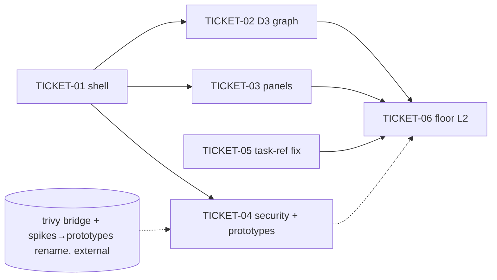

# Tasks — Mnemonic Web UI rewrite from prototype 001

> **STATUS:** `sliced` (2026-10-02)

> Sliced from `.skillgrid/specs/2026-10-02-mnemonic-webui-rewrite/blueprint.md`.
> Vertical tracer-bullet tickets, dependency-ordered, sized for one fresh agent context window.
> As-built: TICKET-01..03 verify code already on `release/2` (`aa0aa791`); TICKET-05 lands a regression fix; TICKET-04 is blocked on work outside this change.

## Epic Summary

Bring the embedded `skillgrid-ui` SPA to prototype 001's IA (six nav groups), dark indigo tokens, and D3 force code graph (ADR-0017), with Observe/System panels on live Go endpoints. Verify the committed rewrite ticket by ticket in a clean worktree, fix the briefing task-link regression it introduced, and record the open gap (Security + Prototypes endpoints).

## Delivery Strategy

| Field | Value |
|-------|-------|
| Estimated changed lines | ~2,000 already landed in `aa0aa791` (1,998 +, 2,364 −); this pass adds ~25 lines (TICKET-05) |
| 400-line budget risk | High (historic diff) / Low (this pass) |
| Chained PRs recommended | Yes |
| Suggested split | PR 1 = `aa0aa791` (landed) → PR 2 = TICKET-05 fix → PR 3 = TICKET-04 after the rename lands |
| Delivery strategy | exception-ok |
| Chain strategy | stacked-to-main |

Decision needed before apply: No
Chained PRs recommended: Yes
Chain strategy: stacked-to-main
400-line budget risk: High

### Suggested Work Units

| Unit | Goal | Likely PR | Focused test command | Runtime harness | Rollback boundary |
|------|------|-----------|----------------------|-----------------|-------------------|
| 1 | Shell + graph + panels (as-built) | `aa0aa791` on release/2 | `cd skillgrid-ui && npm test && npm run build:check` | `skillgrid serve` + browser on `/mnemonic/graph` | `git revert aa0aa791` |
| 2 | Briefing task-ref regression fix | TICKET-05 commit | `cd skillgrid-ui && npx vitest run src/features/plans` | PlansPage with a briefing containing `#NNN` | revert the single fix commit |
| 3 | Security + Prototypes panels on registered endpoints | after the trivy bridge + spikes→prototypes rename land | `cd skillgrid-ui && npx vitest run` + G7 | `/system/security` and `/project/prototypes` against `skillgrid serve` | revert the bridge/rename panel commits |

> The four plain-text guard lines above are the **contract** — `skillgrid:subagent-execution` matches them literally. Risk is High for the historic diff; the units above name the focused test, harness, and rollback boundary.

## Tickets

### TICKET-01 — Theme tokens, nav IA, relative API base (as-built verification)

- **Scope:** Confirm the shell matches the mockup: indigo/surface tokens, six nav groups in order, demoted routes reachable, `apiOrigin()` relative in production.
- **Acceptance:** G1 `AppLayout.test.tsx` PASS; G2 route grep = 5; G3 tokens present (accent not green); G8 no `fetch()` site hardcodes `127.0.0.1:7438` outside `apiBase.ts`.
- **SATISFIES:** `nav-matches-mockup`, `theme-tokens`, `relative-api-urls`
- **Files:** `skillgrid-ui/src/styles/index.css`, `src/components/layout/AppLayout.tsx`, `src/app.tsx`, `src/lib/api.ts`, `src/lib/apiBase.ts`, `vite.config.ts`
- **Size:** S (verification only)
- **Blocks:** TICKET-02, TICKET-03, TICKET-04
- **Blocked by:** none
- **Fails-when:** vitest reports any failed test in `AppLayout.test.tsx`; G2 prints a number other than 5; G8 lists a file containing `fetch(` with the hardcoded origin.
- **Tracker:** TASK-032 (epic TASK-031)

### TICKET-02 — D3 force code graph with inspector (ADR-0017) — door check

- **Scope:** Confirm GraphPage is the mockup's D3 force layout (`limit=500`, Node Inspector) and the Sigma stack is gone; bundle stays under budget with d3 split out.
- **Acceptance:** G4 three matching lines; G5 = 0 Sigma / 1 d3; `npm run build:check` prints "Bundle-size budget OK." with a `vendor-d3` chunk.
- **SATISFIES:** `d3-code-graph`
- **Files:** `skillgrid-ui/src/features/mnemonic/GraphPage.tsx`, `src/features/mnemonic/graph/api.ts`, `package.json`, `vite.config.ts`
- **Size:** S (verification only)
- **Blocks:** TICKET-06
- **Blocked by:** TICKET-01
- **Fails-when:** G4 < 3 lines; G5 Sigma count > 0 or d3 count = 0; build:check exit ≠ 0 or "exceeds budget".
- **Tracker:** TASK-034 (epic TASK-031)

### TICKET-03 — Observe + System panels fetch live endpoints (as-built verification)

- **Scope:** Confirm Compaction, Web Cache, Telemetry, Settings, Swagger pages exist and their fetch paths are registered on the Go mux.
- **Acceptance:** G6 = 4 registered routes; `npx vitest run src/features/settings src/features/swagger` PASS; `SwaggerPage` iframe src is `apiUrl('/swagger/')`.
- **SATISFIES:** `panels-fetch-live-endpoints` (Observe scenario)
- **Files:** `skillgrid-ui/src/features/observe/*.tsx`, `src/features/settings/SettingsPage.tsx`, `src/features/swagger/SwaggerPage.tsx`, `skillgrid-cli/internal/mnemonic/http/server.go`
- **Size:** S (verification only)
- **Blocks:** TICKET-06
- **Blocked by:** TICKET-01
- **Fails-when:** G6 ≠ 4; any settings/swagger test fails.
- **Tracker:** TASK-035 (epic TASK-031)

### TICKET-04 — Security + Prototypes panels on registered endpoints

- **Scope:** System → Security must fetch `GET /security/trivy` and Project → Prototypes must fetch a path the Go mux registers as JSON (listing `.skillgrid/prototypes/NNN-name/`). At HEAD both pages exist (`SecurityPage.tsx`, `SpikesPage.tsx`) but neither endpoint is registered — the panels render ErrorState.
- **Acceptance:** G7 = 1 then 1 (both paths registered in `server.go`); full `npm test` PASS; nav label is "Prototypes" at `/project/prototypes`.
- **SATISFIES:** `panels-fetch-live-endpoints` (Security and Prototypes scenario)
- **Files:** `skillgrid-cli/internal/mnemonic/http/docs/security.go` (+test), `docs/docs_prototypes.go` (+test), `server.go` route lines; `skillgrid-ui/src/features/prototypes/PrototypesPage.tsx` (HEAD: `features/spikes/SpikesPage.tsx`), `src/app.tsx`, `src/components/layout/AppLayout.tsx`
- **Size:** M
- **Blocks:** TICKET-06
- **Blocked by:** TICKET-01; **external:** both halves already exist uncommitted in the main working tree — `docs.NewTrivy` (shells out to the trivy CLI: a subprocess boundary that needs its own review) and `docs.NewPrototypes` as part of the repo-wide spikes→prototypes rename, registered in a `server.go` that also carries unrelated policy/events/usage routes. Not committable from this change without sweeping that work.
- **Precondition:** `git status --short | rg -c '^R  .skillgrid/spikes/'` prints 0 and `git diff --quiet -- skillgrid-cli/internal/mnemonic/http/server.go` exits 0 (the rename and the route registrations have been committed).
- **Reversibility:** reversible
- **Fails-when:** either G7 count prints 0 (HEAD state: neither `/security/trivy` nor `/spikes` is registered).
- **Tracker:** TASK-036 (epic TASK-031)

### TICKET-05 — Briefing task-ref links survive MarkdownView (regression fix)

- **Scope:** `aa0aa791` moved plan briefings into `MarkdownView`, whose sanitiser strips the raw `<a>` from `linkifyTaskRefs`; emit markdown links instead.
- **Acceptance:** RED at HEAD (`PlansPage.linkedTasks.test.tsx` misses `/tracker?task=012`); after the fix `npx vitest run src/features/plans` → 11 passed; `taskLinks.test.ts` covers `linkifyTaskRefsMarkdown('See #012 for the design.')`.
- **SATISFIES:** `briefing-task-refs-linkified`
- **Files:** `skillgrid-ui/src/features/plans/taskLinks.ts`, `taskLinks.test.ts`, `PlanDetail.tsx`
- **Size:** S (~25 lines)
- **Blocks:** TICKET-06
- **Blocked by:** none
- **Fails-when:** vitest reports a failure in `src/features/plans`.
- **Tracker:** TASK-033 (epic TASK-031)

### TICKET-06 — Verification floor L2

- **Scope:** Whole-change gate on the integrated tree.
- **Acceptance:** G10 `npm test && npm run build:check` exit 0 with "Bundle-size budget OK."; G11 `go build ./... && go build -tags ui ./...` exit 0.
- **SATISFIES:** `verification-floor`
- **Files:** none
- **Size:** S
- **Blocks:** none
- **Blocked by:** TICKET-02, TICKET-03, TICKET-05 (TICKET-04 when its precondition holds)
- **Fails-when:** any command exits non-zero; "exceeds budget" in build:check output.
- **Tracker:** TASK-037 (epic TASK-031)

## Dependency Graph

## Execution Order

- **Wave 1 (parallel):** TICKET-01, TICKET-05
- **Wave 2 (parallel):** TICKET-02, TICKET-03, TICKET-04 (TICKET-04 halts at its precondition)
- **Wave 3:** TICKET-06

> **Acceptance-first (BDD is always on):** TICKET-05's scenario is confirmed RED at HEAD before the fix is applied. TICKET-01..03 scenarios are already green at HEAD (as-built) — their "RED" is the pre-`aa0aa791` state, recorded in the ledger as not re-run.

## Slicing Notes

- Fast-track: not applicable — the historic diff is >400 lines and multi-domain (UI + Go embed + dependency swap); full tasks.md.
- TICKET-04 carries the only in-flight dependency. Its precondition is machine-checkable so a resumed session can tell whether to proceed.
- No ticket in this pass edits files that the main working tree has dirty from other sessions except TICKET-05's three files — whose dirty content is exactly the fix (diff inspected), so committing those three paths commits only this ticket.
