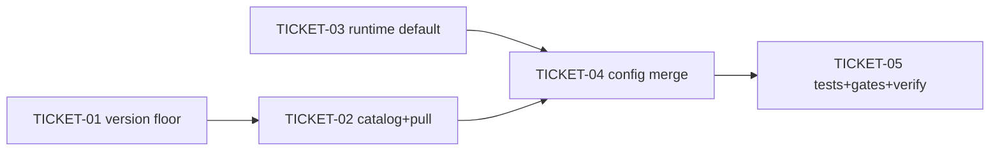

# Tasks — Local Ollama Model Catalog

> **STATUS:** `sliced` (2026-10-06)

> Sliced from `.skillgrid/specs/2026-10-03-local-ollama-models/blueprint.md`.
> Vertical tracer-bullet tickets, dependency-ordered, sized for one fresh agent context window.

## Epic Summary

Make the local Ollama install path pull a six-model local catalog (live chat `llama3.2:1b`, system-one `qwen2.5:1.5b`, embed `embeddinggemma:300m`, research `tev1:0.8b`/`gemma2:2b`/`clef-flash`) instead of the single `llama3.2:3b`/`nomic-embed-text` pair, gate the two heavy research models behind an Ollama ≥ 0.35.1 version floor, and move the runtime Ollama embedder default to `embeddinggemma:300m`. No new LLM SDK (ADR-0023); fail-open floors stay (ADR-0016).

## Delivery Strategy

| Field | Value |
|-------|-------|
| Estimated changed lines | ~500 (provider.go + provider_test.go + ollama.go + ollama_test.go) |
| 400-line budget risk | Medium |
| Chained PRs recommended | No |
| Suggested split | single PR |
| Delivery strategy | single-pr |
| Chain strategy | size-exception |

Decision needed before apply: No
Chained PRs recommended: No
Chain strategy: size-exception
400-line budget risk: Medium

### Suggested Work Units

| Unit | Goal | Likely PR | Focused test command | Runtime harness | Rollback boundary |
|------|------|-----------|----------------------|-----------------|-------------------|
| 1 | Six-model catalog + version floor + runtime default, single PR | PR 1 | `go test ./skillgrid-cli/internal/install/... ./skillgrid-cli/internal/mnemonic/embedder/... -count=1` | N/A (pure Go; install provider step runs on a stubbed Ollama via `ollamaBaseURL`/`runCmd` seams — no live Ollama required in CI) | Revert the 4 touched files (`provider.go`, `provider_test.go`, `ollama.go`, `ollama_test.go`); catalog is additive, constants are a 2-line change |

> The four plain-text guard lines above are the **contract** — `skillgrid:subagent-execution` matches them literally. Risk is Medium (not High), so the guard lines are informational; a single PR with a clear review path is fine.

## Tickets

### TICKET-01 — Ollama version floor comparison

- **Scope:** Add `ollamaRequiredVersion` (`0.35.1`), `ollamaVersionAtLeast`, `parseOllamaVersion`, `versionLessThan` to `provider.go`, with a pure-function test table.
- **Acceptance:** `go test ./skillgrid-cli/internal/install -count=1 -run TestOllamaVersionAtLeast` PASS. `ollamaVersionAtLeast("0.35.1")`==true, `("0.35.0")`==false, `("")`==false, `("not-a-version")`==false, `("0.35.10")`==true.
- **SATISFIES:** happy path version floor gates heavy models (parsing half)
- **Files:** `skillgrid-cli/internal/install/provider.go`, `skillgrid-cli/internal/install/provider_test.go`
- **Size:** ~120 (S)
- **Blocks:** TICKET-02
- **Blocked by:** none

### TICKET-02 — Six-model catalog + role smoke + floor-gated pull

- **Scope:** Add `modelRole`/`modelEntry`/`localModels` (six tags, `glm:vision-tools` excluded), `heavyModels`, the `ollamaVersion` HTTP seam, `smokeProbe` (non-fatal), and rewrite `pullMissingModels` to iterate the catalog and skip heavy models below the floor with a version-named warning. Update `localLLMModel`→`llama3.2:1b`, `localEmbedModel`→`embeddinggemma:300m`.
- **Acceptance:** `go test ./skillgrid-cli/internal/install -count=1 -run 'TestCatalogPullList|TestSmokeProbeNonFatal|TestFloorGatesHeavyModels|TestAtFloorPullsAll'` PASS. Below floor: tev1/clef-flash not pulled, warning emitted, install succeeds. At/above floor: all six pulled. `glm:vision-tools` never appears.
- **SATISFIES:** happy path catalog pull list; happy path version floor gates heavy models; happy path version at or above floor pulls all
- **Files:** `skillgrid-cli/internal/install/provider.go`, `skillgrid-cli/internal/install/provider_test.go`
- **Size:** ~320 (M)
- **Blocks:** TICKET-04, TICKET-05
- **Blocked by:** TICKET-01

### TICKET-03 — Runtime default embedder model

- **Scope:** Change `embedder.DefaultOllamaModel` from `nomic-embed-code` to `embeddinggemma:300m` in `ollama.go`, with a default-model test.
- **Acceptance:** `go test ./skillgrid-cli/internal/mnemonic/embedder -count=1 -run TestDefaultOllamaModelIsEmbeddinggemma` PASS; `DefaultOllamaModel == "embeddinggemma:300m"`.
- **SATISFIES:** happy path ollama default model
- **Files:** `skillgrid-cli/internal/mnemonic/embedder/ollama.go`, `skillgrid-cli/internal/mnemonic/embedder/ollama_test.go`
- **Size:** ~30 (S)
- **Blocks:** TICKET-04
- **Blocked by:** none
- **Reversibility:** one-way   # forwards the runtime default for existing local installs (requirement 2, user-confirmed; the one-way-door gate)

### TICKET-04 — Config merge writes new live-chat + embed models

- **Scope:** Verify `mergeHomeProviderConfig` writes `localLLMModel`/`localEmbedModel` (from TICKET-02) and the runtime default (TICKET-03) so the merged home config carries `llm.model=llama3.2:1b` + `embedder.provider=ollama`/`embedder.model=embeddinggemma:300m`, preserving unrelated keys.
- **Acceptance:** `go test ./skillgrid-cli/internal/install -count=1 -run TestConfigMergeWritesNewModels` PASS. Merged config has the two new models, `base_url` = `ollamaBaseURL/v1`, and `dimension`/`profile` preserved.
- **SATISFIES:** happy path config merge writes new live-chat + embed models
- **Files:** `skillgrid-cli/internal/install/provider.go`, `skillgrid-cli/internal/install/provider_test.go`
- **Size:** ~80 (S)
- **Blocks:** TICKET-05
- **Blocked by:** TICKET-02, TICKET-03

### TICKET-05 — Update existing install tests + acceptance gates + full verify

- **Scope:** Update the pre-existing `TestSetupProviderLocal` and `TestSetupProviderEnsureSkipsPullWhenPresent` to the six-model catalog (add `ollamaVersion` stub); run all G1–G6 acceptance gates; run `go build ./...` + the full install + embedder suite green.
- **Acceptance:** `go build ./...` ok; `go test ./skillgrid-cli/internal/install/... ./skillgrid-cli/internal/mnemonic/embedder/... -count=1` PASS; every G1–G6 CHECK in `acceptance.feature` returns its EXPECT.
- **SATISFIES:** happy path glm vision tools excluded; (regression) G10 happy path install yes ensures local ollama and wires config; (regression) ensure skips pull when models already present
- **Files:** `skillgrid-cli/internal/install/provider_test.go`, `.skillgrid/specs/2026-10-03-local-ollama-models/acceptance.feature`
- **Size:** ~150 (S)
- **Blocks:** none
- **Blocked by:** TICKET-04

## Dependency Graph

## Execution Order

- **Wave 1 (parallel):** TICKET-01, TICKET-03 (independent seams — install version parse vs. embedder constant)
- **Wave 2:** TICKET-02 (after TICKET-01)
- **Wave 3:** TICKET-04 (after TICKET-02 + TICKET-03)
- **Wave 4:** TICKET-05 (after TICKET-04)

> **Acceptance-first (BDD is always on):** each ticket's `SATISFIES` scenario is written/confirmed RED before the implementation that makes it green. The scenarios already exist in `acceptance.feature`; the executor confirms RED by running the gate CHECK against the un-implemented code, then GREEN after.

## Slicing Notes

- TICKET-01 and TICKET-03 are genuinely independent (different packages/seams) and run in Wave 1 in parallel worktrees.
- The one-way-door (TICKET-03, `DefaultOllamaModel` forward) carries a `Reversibility: one-way` marker; the executor stops for a human checkpoint before that ticket (it is the user-confirmed requirement-2 lock).
- No threat-matrix row is Applicable beyond the existing Ollama network trust boundary (already handled by the shipped provider step); no migration, no new dependency, no new trust boundary → not blocked from the standard pipeline, but not fast-track (new capability + ~500 lines).
- Cite-don't-restate: ADR-0023 (stdlib-only LLM client, no new SDK) and ADR-0016 (fail-open floors) are in-force per `ASSUMPTIONS.md`; the catalog change inherits both.
