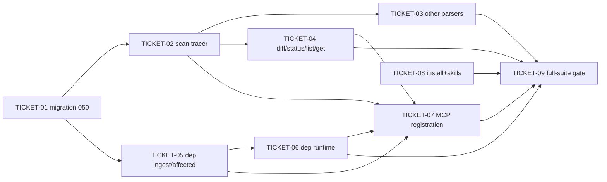

# Tasks — Mnemonic Scan Findings + Dependency Graph

> **STATUS:** `ticketed` (2026-10-07)

> Sliced from `.skillgrid/specs/2026-10-05-mnemonic-scan-findings/blueprint.md`.
> Vertical tracer-bullet tickets, dependency-ordered, sized for one fresh agent context window.

## Epic Summary

Give scanner output (trivy vuln+sbom, wapiti, nuclei, semgrep) a durable, queryable home in the per-project SQLite store: additive migration 050 adds `scans`, `findings` (+FTS5), `dependencies` (PK `purl`), `dep_edges`; a `scan` package shells out to scanner CLIs and upserts normalized findings with a stable `dedup_hash`; a `dep` package ingests SBOMs (soft-retire) and answers `affected` (reverse walk) + `runtime` (declared-vs-imported via the code index `edges` table); new `scan_*`/`dep_*` MCP tools; semgrep joins `SecurityTools()` and gets a skill.

**Path drift (repo restructure 2026-10-06):** the mnemonic Go code moved to the standalone `mnemonic/` module — blueprint paths `skillgrid-cli/internal/mnemonic/...` map to `mnemonic/internal/mnemonic/...`. Migration numbers still align (embedded migrations end at `049_session_checkpoint.sql`). `SecurityTools()` still lives at `skillgrid-cli/internal/install/config.go`. Per scanner ADR-0030.

## Delivery Strategy

| Field | Value |
|-------|-------|
| Estimated changed lines | ~1500 (9 tasks, ~20 new files, 3 modified) |
| 400-line budget risk | High |
| Chained PRs recommended | Yes |
| Suggested split | WU1 (schema+scan tracer) → WU2 (parsers+diff+dep) → WU3 (runtime+MCP+install+skills) → WU4 (full-suite gate) |
| Delivery strategy | ask-on-risk |
| Chain strategy | pending (ask-on-risk) |

Decision needed before apply: Yes
Chained PRs recommended: Yes
Chain strategy: pending
400-line budget risk: High

### Suggested Work Units

| Unit | Goal | Likely PR | Focused test command | Runtime harness | Rollback boundary |
|------|------|-----------|----------------------|-----------------|-------------------|
| 1 | Migration 050 + scan tracer thread (Start/StoreFindings, trivy, fail-open) | PR 1 | `cd mnemonic && go test ./internal/mnemonic/scan/... ./internal/mnemonic/store/ -count=1` | trivy MCP server or trivy CLI on a fixture repo (N/A for unit: fixture JSON only) | `050_scan_findings.sql` + `scan/` package (revert both) |
| 2 | Remaining parsers + diff/status/list/get + dep ingest/affected/graph | PR 2 | `cd mnemonic && go test ./internal/mnemonic/scan/... ./internal/mnemonic/dep/ -count=1` | N/A (fixture-driven; no live scanners in unit tests) | `scan/parse.go` arms + `dep/` package (revert both) |
| 3 | dep runtime + MCP registration + semgrep install + skills | PR 3 | `cd mnemonic && go test ./internal/mnemonic/... -count=1 && cd ../skillgrid-cli && go test ./internal/install/ -count=1` | MCP server boot listing scan_/dep_ tools; `uv tool install semgrep` (manual) | `mcp/tools_scan.go`, `mcp/tools_dep.go`, `install/config.go` entry, skill files |
| 4 | Full-suite green + held-out backstop | PR 4 (or squash) | `cd mnemonic && go test ./... -count=1 && go build ./...` | N/A (verification-only) | no new files |

> The four plain-text guard lines above are the **contract** — `skillgrid:subagent-execution` matches them literally.

## Tickets

### TICKET-01 (TASK-050) — Migration 050: additive scan + dep tables

- **Scope:** Additive SQL migration creating `scans`, `findings` (+ `findings_fts` FTS5 + AI/AD/AU triggers), `dependencies` (PK `purl`), `dep_edges` (UNIQUE(from,to)). No changes to existing tables; `edges` untouched.
- **Acceptance:** `go test ./internal/mnemonic/store/ -run TestScanTablesMigrateIdempotent` passes: all five table/view names present in `sqlite_master` after `store.Open`; re-opening the same file re-runs the runner without error. Migration is `CREATE ... IF NOT EXISTS` only.
- **SATISFIES:** `happy path scan migration applies idempotently`
- **Files:** `mnemonic/internal/mnemonic/store/migrations/050_scan_findings.sql` (create), `mnemonic/internal/mnemonic/store/scan_tables_test.go` (create)
- **Size:** ~150 (S)
- **Blocks:** TICKET-02
- **Blocked by:** none
- **Precondition:** `mnemonic/internal/mnemonic/store/migrations/` exists and highest embedded migration is `049_session_checkpoint.sql`
- **Reversibility:** one-way (table creation on every store at next open — per ADR-0012 additive-migration discipline; user sign-off recorded in blueprint one-way-door #1)
- **Fails-when:** test exits non-zero or logs `no such table: scans` / `table/view ... missing`

### TICKET-02 (TASK-051) — Scan package: Start + StoreFindings (trivy tracer, fail-open)

- **Scope:** `scan` package: `New(s *store.Store, dataDir string) *Service`; `Start` (mints UUIDv7, shells out to scanner CLI via a stubbable runner, writes raw JSON to `<dataDir>/.skillgrid/cache/scans/<scanID>.json` 0644, inserts `scans` row; scanner error → `status=error` + `error` text, no error returned — fail-open per ADR-0016 floors); `StoreFindings` (read raw → `Parse("trivy", bytes)` → `NormalizeSeverity` → `DedupHash` → upsert `findings` UNIQUE(scan_id, dedup_hash) → update `scans.finding_count`/`status`); `severity.go` map (trivy identity with `UNKNOWN`→`INFO`; wapiti/nuclei capitalize; semgrep `ERROR`→`HIGH`, `WARNING`→`MEDIUM`, `NOTE`→`INFO`); `raw.go` WriteRaw/ReadRaw; trivy arm of `parse.go`; fixture `trivy.json` with one known CVE.
- **Acceptance:** `go test ./internal/mnemonic/scan/` passes: severity map table (8 cases), raw roundtrip path contains `.skillgrid/cache/scans/<id>.json`, trivy ingest yields `finding_count=1` and `dedup_hash == DedupHash("trivy","CVE-2024-1234","","flask","2.0.1","requirements.txt",0)`, failing-stub Start returns no error and a `scans` row with `status='error'` and non-empty `error`.
- **SATISFIES:** `happy path trivy scan ingests findings with stable hash`, `error path scanner failure records status=error and is fail-open`
- **Files:** `mnemonic/internal/mnemonic/scan/{service.go,raw.go,parse.go,severity.go}` + tests + `fixtures/trivy.json` (create)
- **Size:** ~400 (M)
- **Blocks:** TICKET-03, TICKET-05
- **Blocked by:** TICKET-01
- **Reversibility:** reversible
- **Fails-when:** `go test` non-zero exit; specifically `finding_count = N, want 1`, `hash = ... want ...`, or `Start must be fail-open, got ...`

### TICKET-03 (TASK-052) — Remaining scanner parsers (wapiti, nuclei, semgrep)

- **Scope:** Add `ParseWapiti` (report `[]` with type/info/url), `ParseNuclei` (JSONL: `template-id`, `info.severity`, `matcher-name`, `host`), `ParseSemgrep` (`results[]`: `check_id`→RuleID, `extra.severity`, `path`, `start.line`, `extra.message`) to `parse.go`; `Parse(tool, data)` dispatch over all four; fixtures `wapiti.json` (2), `nuclei.jsonl` (3), `semgrep.json` (4); `Start` routes to the right scanner command/args per tool.
- **Acceptance:** `go test ./internal/mnemonic/scan/ -run TestParseDispatchAllTools` passes: all four fixtures parse to the expected finding counts (1/2/3/4) with correct field mapping; `go build ./...` clean.
- **SATISFIES:** `happy path trivy scan ingests findings with stable hash` (extended to all four tools)
- **Files:** `mnemonic/internal/mnemonic/scan/{parse.go,parse_test.go,service.go}` + `fixtures/{wapiti.json,nuclei.jsonl,semgrep.json}` (modify/create)
- **Size:** ~250 (S/M)
- **Blocks:** none
- **Blocked by:** TICKET-02
- **Reversibility:** reversible
- **Fails-when:** `Parse(<tool>) = N findings, want M` or non-zero build

### TICKET-04 (TASK-053) — Scan Diff + Status + List + Get

- **Scope:** `(*Service).Diff(ctx, oldID, newID)` (set difference of `dedup_hash` per scan → `DiffResult{Added, Removed, Unchanged}`; removed findings NOT deleted — audit), `LatestDiff` (two most recent `scans` by `started_at`), `Status` (counts by tool + severity + latest scan time per tool), `List` (filter tool/status + limit), `Get`.
- **Acceptance:** `go test ./internal/mnemonic/scan/` passes: unchanged re-scan diffs to `added=0 removed=0`; fixed-CVE fixture diffs with the CVE's `dedup_hash` in `Removed` and the original `findings` row count unchanged (audit survival).
- **SATISFIES:** `happy path unchanged re-scan diffs to zero added`, `happy path fixed cve appears as removed in diff`
- **Files:** `mnemonic/internal/mnemonic/scan/{service.go,service_test.go}` (modify)
- **Size:** ~200 (S)
- **Blocks:** none
- **Blocked by:** TICKET-02
- **Reversibility:** reversible
- **Fails-when:** `unchanged rescan: added=N removed=M, want 0/0`, `fixed CVE not in removed`, or `audit: original findings should survive`

### TICKET-05 (TASK-054) — Dep package: Ingest + Affected + Graph + List + Get (soft-retire)

- **Scope:** `dep` package: `sbom.go` `ParseSBOM` (CycloneDX `components[]` + `dependency` edges; SPDX fallback) → `[]Pkg` + `[]Edge`; `(*Service).Ingest` in one transaction (upsert `dependencies` by `purl` clearing `retired`, set `last_seen`; delete+reinsert `dep_edges` for the ingested set; `UPDATE dependencies SET retired=1 WHERE purl NOT IN (<ingested>)` — soft-retire, never delete); `Affected` (reverse `depends_on` BFS over `dep_edges WHERE to_purl=?`, depth-capped at 10); `Graph`, `List(retired bool)`, `Get`. Fixtures `sbom.cyclonedx.json` (+ `sbom-noflask.json`, `sbom.graph.json`).
- **Acceptance:** `go test ./internal/mnemonic/dep/` passes: ingest upserts by purl; second ingest without flask leaves the row with `retired=1` (no delete); `Affected(werkzeug)` returns flask + app (transitive reverse set, app→flask→werkzeug).
- **SATISFIES:** `happy path dep ingest upserts by purl and soft-retires absent`, `happy path dep_affected returns reverse dependency set`
- **Files:** `mnemonic/internal/mnemonic/dep/{service.go,sbom.go}` + tests + `fixtures/` (create)
- **Size:** ~350 (M)
- **Blocks:** TICKET-06
- **Blocked by:** TICKET-01
- **Reversibility:** reversible
- **Fails-when:** `flask should be soft-retired, retired=N`, `Affected(werkzeug) = ...`, or non-zero exit

### TICKET-06 (TASK-055) — Dep.Runtime: declared-vs-imported via code index edges

- **Scope:** `(*Service).Runtime(ctx, sourceFile)` — resolve `file_id` from `files`, `SELECT to_name, target_path FROM edges WHERE kind IN ('imports','dynamic_import') AND file_id=?` for the imported set; declared set from `dependencies` (`retired=0`) provenance; three-way diff → `RuntimeResult{DeclaredOnly, ImportOnly, Shared}`. Read-only on the code index — no reindex, no new extractor (blueprint WS7 scope).
- **Acceptance:** `go test ./internal/mnemonic/dep/ -run TestRuntimeFlagsDeclaredAndImportOnly` passes with seeded `files` + `edges` rows: flask in `Shared`, werkzeug in `DeclaredOnly`, os in `ImportOnly`.
- **SATISFIES:** `happy path dep_runtime flags declared-only and import-only`
- **Files:** `mnemonic/internal/mnemonic/dep/{service.go,service_test.go}` (modify)
- **Size:** ~150 (S)
- **Blocks:** none
- **Blocked by:** TICKET-05
- **Reversibility:** reversible
- **Fails-when:** `... should be shared|declared-only|import-only, got ...` or non-zero exit

### TICKET-07 (TASK-056) — MCP registration: registerScanTools + registerDepTools

- **Scope:** `mcp/tools_scan.go` (`scan_start`, `scan_store_findings`, `scan_list`, `scan_get`, `scan_status`, `scan_diff` with `old`/`new`/`latest` params) + `mcp/tools_dep.go` (`dep_ingest`, `dep_list`, `dep_get`, `dep_affected`, `dep_graph`, `dep_runtime`); wire both `register*` calls in `mcp/server.go` alongside the existing registrations (server.go:42-72 pattern); construct `scan.Service` (dataDir from `webcache.DefaultDataDir()`) and `dep.Service` at server boot. Thin adapters: decode params → service → encode result.
- **Acceptance:** `go test ./internal/mnemonic/mcp/` passes: both registration tests find all 12 tool names; all pre-existing `register*`/Registered tests still pass (additive, not replacing).
- **SATISFIES:** `happy path scan and dep tools are registered`
- **Files:** `mnemonic/internal/mnemonic/mcp/{tools_scan.go,tools_dep.go,server.go}` + `tools_scan_test.go`, `tools_dep_test.go` (create/modify)
- **Size:** ~350 (M)
- **Blocks:** none
- **Blocked by:** TICKET-02, TICKET-04, TICKET-05, TICKET-06
- **Reversibility:** reversible
- **Fails-when:** `tool <name> not registered` or a pre-existing Registered test failing

### TICKET-08 (TASK-057) — Install (semgrep) + skills + BDD feature

- **Scope:** `SecurityTools()` += `{Name:"semgrep", Manager:"uv", InstallArgs:["tool","install","semgrep"], Bin:"semgrep", Hint:"curl -LsSf https://astral.sh/uv/install.sh | sh"}` (no new manager — uv already used by wapiti3); `install_test.go` asserts the entry; create `~/.agents/skills/verification/semgrep/SKILL.md` (mirror wapiti/nuclei) with a "Store results in mnemonic" step; add that section to trivy/wapiti/nuclei skills; `acceptance-tests/features/scan-findings.feature` mirroring the spec `acceptance.feature`.
- **Acceptance:** `go test ./internal/install/ -run TestSecurityToolsIncludeSemgrep` passes (semgrep present, manager=uv, bin=semgrep); semgrep SKILL.md exists and names `scan_store_findings`/`dep_ingest`; the three scanner skills each carry the mnemonic-store section.
- **SATISFIES:** `happy path semgrep installs via uv`, `happy path semgrep skill exists and documents mnemonic store step`
- **Files:** `skillgrid-cli/internal/install/{config.go,install_test.go}` (modify), `~/.agents/skills/verification/semgrep/SKILL.md` (create), `~/.agents/skills/verification/{trivy,wapiti,nuclei}/SKILL.md` (modify), `skillgrid-cli/acceptance-tests/features/scan-findings.feature` (create)
- **Size:** ~200 (S)
- **Blocks:** none
- **Blocked by:** none (independent of the mnemonic module; `SecurityTools()` is in skillgrid-cli)
- **Reversibility:** reversible
- **Fails-when:** `semgrep missing from SecurityTools()` / `semgrep config wrong` or missing skill sections

### TICKET-09 (TASK-058) — Full-suite green + held-out backstop

- **Scope:** Verification-only: full `go test ./...` + `go build ./...` in the mnemonic module with **no scanner binaries present** (fixture-driven); BDD `scan-findings.feature` run; pre-existing tool-surface tests unchanged.
- **Acceptance:** `cd mnemonic && go test ./... -count=1 && go build ./...` exits 0; acceptance feature passes; no pre-existing test fails.
- **SATISFIES:** `happy path existing tool surface is unchanged`
- **Files:** none (verification; fixups only if a regression surfaces)
- **Size:** ~0 (S)
- **Blocks:** none
- **Blocked by:** TICKET-03, TICKET-04, TICKET-06, TICKET-07, TICKET-08
- **Reversibility:** reversible
- **Fails-when:** any `go test`/`go build` non-zero exit or a failing acceptance scenario

## Dependency Graph

## Execution Order

- **Wave 1:** TICKET-01 (one-way checkpoint — user already signed off via "execute"), TICKET-08 (independent)
- **Wave 2:** TICKET-02 (after 01), TICKET-05 (after 01) — parallel
- **Wave 3:** TICKET-03, TICKET-04 (after 02), TICKET-06 (after 05) — parallel
- **Wave 4:** TICKET-07 (after 02+04+05+06)
- **Wave 5:** TICKET-09 (after everything)

> **Acceptance-first (BDD is always on):** each ticket's TDD step writes the failing test first (per the blueprint's Step 1 of every task); the `SATISFIES` scenario is confirmed RED before the implementation turns it green.

## Slicing Notes

- The blueprint's 9 tasks map 1:1 to the 9 tickets (tracer-thread build shape preserved: the trivy end-to-end path lands in Wave 2 before the other parsers thicken it in Wave 3).
- TICKET-08 is independent of the mnemonic module (`SecurityTools()` lives in `skillgrid-cli`), so it runs in Wave 1 in parallel with the migration.
- All mnemonic-module tickets run in the standalone `mnemonic/` module (`go.mod` at `mnemonic/go.mod`); the module path is `github.com/devopstales/skillgrid/mnemonic` — adjust the blueprint's `cd skillgrid-cli` to `cd mnemonic`.
- `~/.agents/skills/...` files are outside the repo; commit only the in-repo files (install + feature) for TICKET-08.
- Per scanner ADR-0030: structured `scan_*`/`dep_*` tables + FTS with dedicated MCP tools (not blobs, not per-tool tables).
