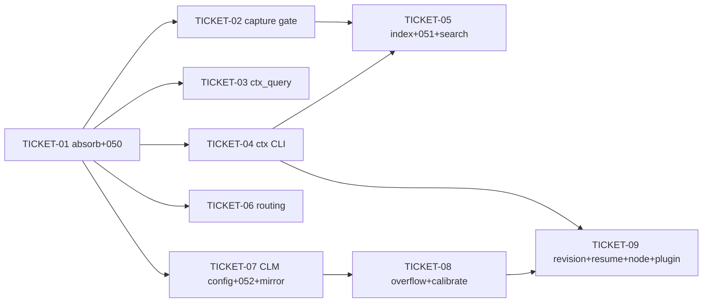

# Tasks — Context Harness (with CLM)

> **STATUS:** `sliced` (2026-10-06)

> Sliced from `.skillgrid/specs/2026-10-06-context-harness-clm/blueprint.md`.
> Vertical tracer-bullet tickets, dependency-ordered, sized for one fresh agent context window.

## Epic Summary

Build the `context_harness` package (absorbs `session_inject`, import-path-only) that adds intercept-and-abstract capture (PostToolUse gate → session FTS5 `tool_outputs` sandbox), a deterministic `ctx_query`, a `ctx` CLI (stats/index/search/purge) with a proactive `indexed_files` index and RRF-fused `ctx_search`, a Context Routing block in `prime`, and the opt-in CLM layer (mirror + overflow guard + calibration + revision, Go owns state / Node owns the request path). Three new migrations (050/051/052), one Node hook change, one new OpenCode `context` plugin.

## Delivery Strategy

| Field | Value |
|-------|-------|
| Estimated changed lines | ~2,200–2,800 (Go ~1,600 + Node ~300 + migrations ~120 + tests ~400–700) |
| 400-line budget risk | High |
| Chained PRs recommended | Yes |
| Suggested split | PR 1 (tracer: absorb + 050 + capture gate + ctx search) → PR 2 (ctx CLI + 051 + ctx_search fusion) → PR 3 (CLM: 052 + config + mirror/revision/overflow/calibrate + Node hook + OpenCode plugin) |
| Delivery strategy | ask-on-risk |
| Chain strategy | pending (user decision at execution) |

Decision needed before apply: Yes
Chained PRs recommended: Yes
Chain strategy: pending
400-line budget risk: High

### Suggested Work Units

| Unit | Goal | Likely PR | Focused test command | Runtime harness | Rollback boundary |
|------|------|-----------|----------------------|-----------------|-------------------|
| 1 | Tracer: absorb `session_inject`→`context_harness`, migration 050, capture gate stores a large tool output, `ctx search` returns that row (thin end-to-end through Node↔Go↔SQLite↔FTS) | PR 1 | `cd mnemonic && go test ./internal/context_harness/ -run 'TestMigration050\|TestDecideGate\|TestGateStores' -v` | Real scenario: run `hooks/tool-call-capture.js` against a live `mnemonic` HTTP server, feed a >4KB output, then `ctx search`. Rollback = `git revert` PR 1 (new package + 1 migration; `mem_inject_session` contract unchanged so no caller churn). | `mnemonic/internal/context_harness/` + `050_tool_outputs.sql` + `http/toolcalls.go` `content` field + hook gate |
| 2 | `ctx` CLI group + `ctx index`/`indexed_files` (051) + `ctx_search` two-leg RRF fusion + Context Routing block + `ctx purge` | PR 2 | `cd mnemonic && go test ./internal/context_harness/ -run 'TestSearch\|TestIndex\|TestRenderRouting\|TestRunCtx' -v` | Real scenario: `ctx index <file>` then `ctx search <query>` returns RRF-fused rows with per-leg provenance; `prime` renders the routing block. Rollback = `git revert` PR 2 (new CLI subcommand + 1 migration; no behavior change to the capture path). | `mnemonic/cmd/mnemonic/ctx_cmd.go` + `051_indexed_files.sql` + `context_harness/{index,search,routing,purge}.go` + `loop/render.go` |
| 3 | CLM: `clm:` config block, migration 052, mirror render, revision capture/validate/persist, overflow guard, calibration, Go owns state (SetCLM + resume), Node checkpoint capture, OpenCode `context` plugin | PR 3 | `cd mnemonic && go test ./internal/context_harness/clm/ -v && go test ./internal/config/ -run 'TestCLM' -v && node -e "require('./plugins/opencode/context/index.js')"` | Real scenario: enable `clm.enabled`, run a turn, the OpenCode `context` hook renders a `0600` mirror (no system prompt), the checkpoint captures a validated edit into `context_revisions`, overflow withholds, calibration corrects the factor. Rollback = `git revert` PR 3 (new sub-package + 1 migration + opt-in config; default-off so no behavior change when disabled). | `mnemonic/internal/context_harness/clm/` + `052_context_revisions.sql` + `config` `clm` block + `memory/clm.go` + hook checkpoint + `plugins/opencode/context/` |

> The four plain-text guard lines above are the **contract** — `skillgrid:subagent-execution` matches them literally. If risk is High, `Chained PRs recommended` MUST be `Yes` and every work unit MUST name a focused test, a runtime harness (or `N/A` + reason), and a rollback boundary.

## Tickets

### TICKET-01 — Absorb `session_inject` → `context_harness` + migration 050 (tracer start)

- **Scope:** Move `mnemonic/internal/session_inject/` into `mnemonic/internal/context_harness/` (import path change only — all 4 importers update), and add the `tool_outputs` FTS5 sandbox via migration `050_tool_outputs.sql`. This is the door check: if absorption breaks `mem_inject_session` or the migration is non-idempotent, stop.
- **Acceptance:** (1) `mem_inject_session` MCP tool keeps its exact contract (params `query`, `all_projects`, `max_tokens` default 2000) — verified by a held-out call, not a diff read. (2) Migration `050` applies idempotently (re-run is a no-op) and creates `tool_outputs` + `tool_outputs_fts`. (3) `go build ./...` clean, all existing `session_inject` tests pass under the new path.
- **SATISFIES:** `absorption preserves the mem_inject_session contract` + `migration 050 creates the sandbox` (acceptance.feature)
- **Files:** `mnemonic/internal/context_harness/` (10 moved files: autoprepend, summary, retrieve, render, privacy, index_render + their tests), `mnemonic/internal/mcp/tools_session_inject.go`, `mnemonic/cmd/mnemonic/loop_cmd.go`, `mnemonic/internal/secondbrain/ask.go`, `mnemonic/internal/http/toolevents.go`, `mnemonic/internal/store/migrations/050_tool_outputs.sql` + `store/store.go` (migration registration is automatic by filename), `mnemonic/internal/store/migrations/050_tool_outputs_test.go`
- **Size:** ~700 (M) — mostly file moves + 4 import-path edits + 1 migration + 2 tests
- **Blocks:** TICKET-02, TICKET-03, TICKET-05
- **Blocked by:** none
- **Precondition:** `mnemonic/internal/session_inject/` exists with 7 source + 5 test files (the absorb source).
- **Reversibility:** one-way — migration `050_tool_outputs` is a new table; a `git revert` drops the file but an already-migrated DB keeps the table (idempotent, harmless). The import-path rename is the real one-way step — callers must not be left pointing at the old path.
- **Fails-when:** `go test ./internal/mcp/ -run 'TestInjectSession' -v` FAILs (contract churn), OR `go test ./internal/store/ -run 'TestMigration050' -v` FAILs (non-idempotent), OR `go build ./...` reports a dangling `session_inject` import.

### TICKET-02 — Output Sandbox Gate (capture route carries `content` + gate stores)

- **Scope:** The thinnest end-to-end path. `http/toolcalls.go` `toolCallBody` gains a `Content string` field; `hooks/tool-call-capture.js` sends the full `content` when > threshold (honoring `SKILLGRID_CTX_BYPASS`); new `context_harness/capture.go` decides gate-vs-pass and stores gated output into `tool_outputs` and returns a ≤200-char summary + `ctx_search <query>` pointer. This is the tracer's first visible behavior.
- **Acceptance:** (1) A tool call whose actual output > 4096 chars and no `SKILLGRID_CTX_BYPASS` is stored in `tool_outputs` and the agent gets a ≤200-char summary + `ctx_search` pointer. (2) Small output (≤ 4096) and bypass (`SKILLGRID_CTX_BYPASS=1`) pass through unchanged. (3) The hook always exits 0 (fail-open); a missing/failing route degrades to raw output. (4) `content` is the new field on the route — `content_preview` still carries the 500-char truncated preview (no churn to existing consumers).
- **SATISFIES:** `gate stores large output to sandbox` + `gate passes small/bypass output` + `gate is fail-open` (acceptance.feature)
- **Files:** `mnemonic/internal/context_harness/capture.go` (+ `capture_test.go`), `mnemonic/internal/http/toolcalls.go` (add `Content` to `toolCallBody` + `EnsureSession` + store call), `hooks/tool-call-capture.js` (send full `content` on > threshold)
- **Size:** ~450 (M)
- **Blocks:** TICKET-03 (ctx search over the sandbox)
- **Blocked by:** TICKET-01 (needs `tool_outputs` table + the package home)
- **Reversibility:** one-way — the `content` field is a published contract on the capture route (the hook now sends it). Reversible in practice (drop the field + the gate) but tag it.
- **Fails-when:** `go test ./internal/context_harness/ -run 'TestDecideGate\|TestGateStores' -v` FAILs, OR the hook sends no `content` for a >4KB output (integration check: capture the POST body).

### TICKET-03 — `ctx_query` (deterministic counts/lists/existence)

- **Scope:** `context_harness/query.go` — a deterministic query over the code index returning counts, lists, and existence checks (no line ranges in v1). Wired as a `ctx query` subcommand (scaffolded here; the CLI dispatcher is TICKET-05).
- **Acceptance:** (1) `ctx_query` returns a count for a symbol/file pattern. (2) Returns a list for a "files matching" query. (3) Returns an existence boolean for a "does X exist" query. (4) All results are deterministic (no LLM, no ranking) — same query + same index = same output.
- **SATISFIES:** `ctx_query returns deterministic counts/lists/existence` (acceptance.feature)
- **Files:** `mnemonic/internal/context_harness/query.go` (+ `query_test.go`), `mnemonic/cmd/mnemonic/ctx_cmd.go` (stub `ctx query` case)
- **Size:** ~300 (S)
- **Blocks:** TICKET-05 (CLI dispatch)
- **Blocked by:** TICKET-01 (package home)
- **Fails-when:** `go test ./internal/context_harness/ -run 'TestRunQuery' -v` FAILs, OR the same query returns different output across two runs (determinism).

### TICKET-04 — `ctx` CLI group (stats/index/search/purge dispatcher)

- **Scope:** `mnemonic/cmd/mnemonic/ctx_cmd.go` — the `ctx` subcommand dispatcher (`stats`, `index`, `search`, `query`, `purge`) added to the existing hand-rolled `flag` switch in `main.go`. `stats` and `purge` are implemented here; `index`/`search`/`query` route to the implementations in TICKET-03/05/06. This de-risks the CLI dispatch (threat row: new CLI command).
- **Acceptance:** (1) `mnemonic ctx` with no args prints usage. (2) `mnemonic ctx stats` reports sandbox + index counts. (3) `mnemonic ctx purge` clears `tool_outputs` + `context_revisions` for the session and prints the row count. (4) Unknown `ctx` subcommand exits non-zero with a clear error. (5) No new CLI dependency (still hand-rolled `flag`).
- **SATISFIES:** `ctx CLI dispatches stats/index/search/purge` + `ctx stats reports counts` + `ctx purge clears session rows` (acceptance.feature)
- **Files:** `mnemonic/cmd/mnemonic/ctx_cmd.go` (+ `ctx_cmd_test.go`), `mnemonic/cmd/mnemonic/main.go` (add `case "ctx": runCtx(...)`), `mnemonic/internal/context_harness/purge.go`
- **Size:** ~350 (S)
- **Blocks:** TICKET-06, TICKET-07 (the `ctx index`/`search` subcommands)
- **Blocked by:** TICKET-01 (package home)
- **Fails-when:** `go test ./cmd/mnemonic/ -run 'TestRunCtx' -v` FAILs, OR `mnemonic ctx` with no args exits 0 instead of printing usage.

### TICKET-05 — `ctx index` + `indexed_files` (051) + `ctx_search` RRF fusion

- **Scope:** `context_harness/index.go` (read+chunk ~2KB+upsert into `indexed_files`, 7-day TTL, observations schema shape per ADR-0026) + `context_harness/search.go` (two-leg RRF fusion via `hybrid.Rank` RRFK=60 across `tool_outputs_fts` and `indexed_files_fts`, per-leg provenance) + migration `051_indexed_files.sql`. The `ctx index`/`ctx search` subcommands (from TICKET-04) now do real work. This is the tracer's fusion payoff.
- **Acceptance:** (1) `ctx index <file>` reads, chunks, and upserts rows into `indexed_files`. (2) `ctx search <query>` returns RRF-fused results across both FTS legs. (3) Each result carries per-leg provenance (which leg + path/line). (4) `indexed_files` rows expire after 7 days (TTL). (5) `hybrid.Rank` is the fusion engine (RRFK=60), not a new ranking impl.
- **SATISFIES:** `ctx index writes chunks to indexed_files` + `ctx_search fuses sandbox and index via RRF` + `ctx_search results carry per-leg provenance` + `indexed_files has a 7-day TTL` (acceptance.feature)
- **Files:** `mnemonic/internal/store/migrations/051_indexed_files.sql` (+ test), `mnemonic/internal/context_harness/index.go` (+ `index_test.go`), `mnemonic/internal/context_harness/search.go` (+ `search_test.go`), `mnemonic/cmd/mnemonic/ctx_cmd.go` (implement `ctxIndex`/`ctxSearch`)
- **Size:** ~550 (M)
- **Blocks:** none
- **Blocked by:** TICKET-02 (the sandbox leg to fuse), TICKET-04 (the CLI subcommands)
- **Reversibility:** one-way — migration `051_indexed_files` is a new table.
- **Fails-when:** `go test ./internal/context_harness/ -run 'TestIndex\|TestSearch' -v` FAILs, OR a `ctx search` result lacks per-leg provenance, OR `go test ./internal/store/ -run 'TestMigration051' -v` FAILs.

### TICKET-06 — Context Routing block in `prime`

- **Scope:** `context_harness/routing.go` `RenderRouting()` (a ~80-word tool map: counts/lists → `ctx_query`, retrieve → `ctx_search`, index → `ctx index`, memory → `mem_*`) + wire into `loop/render.go` `PrimeInput.Routing` + `loop_cmd.go`. Advisory, not blocking.
- **Acceptance:** (1) `prime` output contains a `## Context Routing` block. (2) The block names `ctx_query`, `ctx_search`, `ctx index`, and `mem_*`. (3) The block is ≤ 600 chars. (4) The block does not change the existing Memory block.
- **SATISFIES:** `prime renders the Context Routing block` (acceptance.feature)
- **Files:** `mnemonic/internal/context_harness/routing.go` (+ `routing_test.go`), `mnemonic/internal/loop/render.go` (add `Routing` to `PrimeInput` + render), `mnemonic/cmd/mnemonic/loop_cmd.go` (set `Routing`)
- **Size:** ~200 (S)
- **Blocks:** none
- **Blocked by:** TICKET-01 (package home)
- **Fails-when:** `go test ./internal/context_harness/ -run 'TestRenderRouting' -v` FAILs, OR `prime` output lacks the `## Context Routing` header.

### TICKET-07 — CLM config block + migration 052 + mirror render

- **Scope:** `config/load.go` gains the `clm:` block (struct + section + `DefaultCLM()` off-by-default + `mergeCLM()`), routed to `memory.Service` via `SetCLM`. Migration `052_context_revisions.sql`. `context_harness/clm/mirror.go` — `RenderMirror` (`[[LIVE_CONTEXT ...]]` header + `[[CTX_TURN ...]]` blocks, system prompt EXCLUDED) + `WriteMirror` (0600 file).
- **Acceptance:** (1) CLM is off by default (`clm.enabled` absent = off). (2) `clm.enabled: true` + `budget` are honored from config. (3) The reserve default (2048) survives an explicit budget. (4) `RenderMirror` produces the header + CTX_TURN blocks and does NOT include the system prompt. (5) `WriteMirror` writes a 0600 file. (6) Migration 052 applies idempotently.
- **SATISFIES:** `CLM is off by default` + `clm config block is honored` + `mirror excludes the system prompt` + `mirror is written 0600` + `migration 052 creates context_revisions` (acceptance.feature)
- **Files:** `mnemonic/internal/store/migrations/052_context_revisions.sql` (+ test), `mnemonic/internal/config/load.go` (+ `load_clm_test.go`), `mnemonic/internal/context_harness/clm/mirror.go` (+ `mirror_test.go`)
- **Size:** ~450 (M)
- **Blocks:** TICKET-08, TICKET-09
- **Blocked by:** TICKET-01 (package home)
- **Reversibility:** one-way — migration `052_context_revisions` is a new table.
- **Fails-when:** `go test ./internal/config/ -run 'TestCLM' -v` FAILs, OR `go test ./internal/context_harness/clm/ -run 'TestRenderMirror' -v` FAILs, OR `go test ./internal/store/ -run 'TestMigration052' -v` FAILs, OR the rendered mirror contains the system prompt.

### TICKET-08 — CLM overflow guard + calibration

- **Scope:** `context_harness/clm/overflow.go` `ComputeOverflow` (withhold oldest tool results when calibrated estimate > `budget − reserve`; guard off = never withhold) + `calibrate.go` `Calibrate` (EMA-correct the chars/token factor against the provider's token count).
- **Acceptance:** (1) Within budget → no withhold. (2) Over budget → withhold oldest tool blocks. (3) Guard off → never withhold. (4) `Calibrate` moves the factor toward the observed ratio; an exact match stays. (5) The factor starts ~4 chars/token.
- **SATISFIES:** `overflow guard withholds oldest tool results` + `overflow guard off means no withhold` + `calibration corrects the token estimate` (acceptance.feature)
- **Files:** `mnemonic/internal/context_harness/clm/overflow.go` (+ `overflow_test.go`), `mnemonic/internal/context_harness/clm/calibrate.go` (+ `calibrate_test.go`)
- **Size:** ~250 (S)
- **Blocks:** TICKET-09 (the revision persists the withhold + factor)
- **Blocked by:** TICKET-07 (the `clm` config block + the mirror type)
- **Fails-when:** `go test ./internal/context_harness/clm/ -run 'TestComputeOverflow\|TestCalibrate' -v` FAILs.

### TICKET-09 — CLM revision capture/validate/persist + Go owns state + Node checkpoint + OpenCode hook

- **Scope:** The CLM loop close. `context_harness/clm/revision.go` (`ValidateRevision` nonce+sequence, `PersistRevision`), `resume.go` (reconstruct highest revision + anchor re-validation). `memory/clm.go` (`SetCLM` seam on `memory.Service` + `CLMConfig()` accessor + the `clm` field). `http/clm.go` `handleCLMRevision` route. `hooks/tool-call-capture.js` checkpoint reads the mirror edit + POSTs it. `plugins/opencode/context/index.js` — the OpenCode v2 `context` plugin hook (render mirror, apply withhold, read edit; no-op when CLM off). This is the riskiest ticket (Node↔Go↔SQLite↔OpenCode integration + new trust boundary).
- **Acceptance:** (1) The checkpoint reads the mirror edit, Go validates it (nonce match, legal sequence), and a passing edit persists one row in `context_revisions` (revision, anchor_count, anchor_digest, messages, size_estimate, calibration_factor, withhold_ids, edit_trace). (2) On resume, the highest revision is reconstructed and its anchor re-validated; a mismatch falls back to raw context. (3) `context_revisions` is purged at session end (via `ctx purge` from TICKET-04). (4) The OpenCode `context` hook is a no-op when CLM is off. (5) Every CLM seam is fail-open — a failure degrades to raw context, never blocks the agent.
- **SATISFIES:** `CLM edit is captured, validated, and persisted` + `resume reconstructs the highest revision` + `context_revisions is purged at session end` + `CLM is fail-open` + `OpenCode context hook is a no-op when off` (acceptance.feature)
- **Files:** `mnemonic/internal/context_harness/clm/revision.go` (+ `revision_test.go`), `mnemonic/internal/context_harness/clm/resume.go` (+ `resume_test.go`), `mnemonic/internal/memory/clm.go` (+ `clm_test.go`), `mnemonic/internal/http/clm.go` (+ `clm_test.go`), `mnemonic/internal/http/server.go` (route), `hooks/tool-call-capture.js` (checkpoint CLM read), `plugins/opencode/context/index.js` (new)
- **Size:** ~550 (M)
- **Blocks:** none
- **Blocked by:** TICKET-08 (the overflow + calibration the revision persists), TICKET-04 (`ctx purge` clears `context_revisions`)
- **Reversibility:** costly — the OpenCode plugin + hook checkpoint are new trust boundaries; a bad edit could corrupt the outgoing call, so the hook is fail-open and the plugin no-ops when off. Reversible by reverting the plugin + the hook change + the Go files, but test it before trusting.
- **Precondition:** CLM is enabled in the config under test (`clm.enabled: true`); the OpenCode plugin loader can discover `plugins/opencode/context/index.js`.
- **Fails-when:** `go test ./internal/context_harness/clm/ -run 'TestResume\|TestPersistRevision' -v` FAILs, OR `node -e "require('./plugins/opencode/context/index.js')"` throws, OR a CLM failure blocks the agent (integration: kill the Go route mid-turn, the agent must still proceed with raw context).

## Dependency Graph

## Execution Order

- **Wave 1 (parallel):** TICKET-01 (door check — must land first; if it breaks `mem_inject_session` or migration 050, STOP)
- **Wave 2 (parallel, after TICKET-01):** TICKET-02 (capture gate), TICKET-03 (ctx_query), TICKET-04 (ctx CLI), TICKET-06 (routing block), TICKET-07 (CLM config+052+mirror)
- **Wave 3 (parallel, after their blockers):** TICKET-05 (index+051+search; after 02+04), TICKET-08 (overflow+calibrate; after 07)
- **Wave 4:** TICKET-09 (revision+resume+node+plugin; after 08+04) — the riskiest, last

> **Acceptance-first (BDD is always on):** a ticket's failing acceptance scenario (its `SATISFIES` scenario) is written and confirmed RED *before* the implementation that makes it green. Within each ticket, the test step (Step 1-2 in the blueprint) is the RED confirmation.

> **Tracer thread:** TICKET-01 (absorb + 050) is the door check and Wave 1. TICKET-02 (capture gate) is the first visible end-to-end behavior — a large tool output stored and retrievable. Later tickets thicken the path (query, CLI, index+search, routing, CLM).

## Slicing Notes

- **9 blueprint tasks → 9 tickets** (1:1, no merges/splits). Each blueprint task is already a vertical, demoable, context-sized unit — the tracer thread maps cleanly. The only cross-cutting dependency is that the CLM tickets (07→08→09) form a serial chain, and the search fusion (05) needs both the sandbox leg (02) and the CLI subcommand (04).
- **Risk ordering within Wave 2:** TICKET-02 (capture gate) is the highest-risk of the parallel set (Node↔Go↔SQLite contract) and lands in the same wave as the door check's dependents — if it surfaces a contract problem, it's caught before Wave 3 invests in the index/search.
- **One-way doors (4):** migration 050 (TICKET-01), the `content` route field (TICKET-02), migration 051 (TICKET-05), migration 052 (TICKET-07). Each carries a human checkpoint.
- **File-boundary assumption:** the `memory.Service` `clm config.CLM` field reuses the existing `mu` mutex (confirmed: `budgetOverrides` uses the same pattern in `service.go`). The OpenCode plugin loader path is assumed to be `.opencode/plugin.json` or the project's plugin registry — TICKET-09's executor should confirm the exact registration mechanism.
- **Cite, don't restate:** per `ASSUMPTIONS.md § Locked constraints` (no new deps, fail-open floors per ADR-0016, pre-tool policy posture per ADR-0021), `ADR-0025/0026/0027/0028` (the in-force set from the change's `adr.md`), and the `mem_inject_session` contract-preservation requirement (briefing requirement 13).
