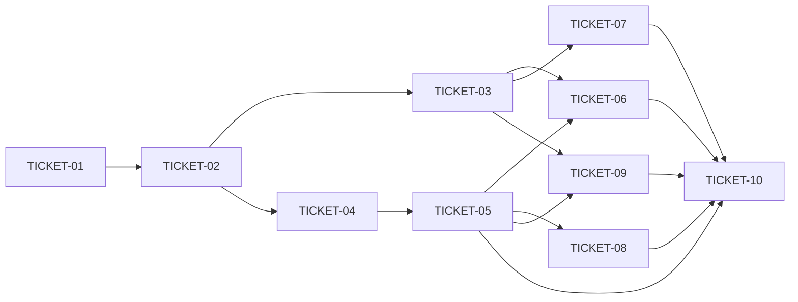

# Tasks — Mnemonic Standalone Module

> **STATUS:** `ticketed` (2026-10-07)

> Sliced from `.skillgrid/specs/2026-10-06-mnemonic-standalone/blueprint.md`.
> Vertical tracer-bullet tickets, dependency-ordered, sized for one fresh agent context window.

## Ticketing (Backlog.md)

Published 2026-10-07 to `.backlog` (milestone `m-8` mnemonic-standalone-module). All tickets `ready-for-agent`, milestone m-8, ref to `briefing.md`.

| Ticket | Backlog ID | Status note |
|--------|-----------|-------------|
| TICKET-01 | TASK-059 | verify-only (committed) |
| TICKET-02 | TASK-060 | verify-only (committed) |
| TICKET-03 | TASK-061 | verify-only (committed) |
| TICKET-04 | TASK-062 | finish (facade completeness) |
| TICKET-05 | TASK-063 | verify/finish (trim CLI) |
| TICKET-06 | TASK-064 | finish (all Taskfile tasks) |
| TICKET-07 | TASK-065 | verify/finish (sync-script) |
| TICKET-08 | TASK-066 | implement (install copies mnemonic binary) |
| TICKET-09 | TASK-067 | verify-only (committed) |
| TICKET-10 | TASK-068 | final gate |

## Epic Summary

Extract `mnemonic` from `skillgrid-cli` into an independently buildable Go module (`mnemonic/`) with its own `go.mod`, `cmd/mnemonic` binary, and a top-level public facade. `skillgrid-cli` shrinks to `install` + `sync-repo` (clean break, no passthrough). A `go.work` links both modules for local dev; all external configs (mcp.yaml, cursor, hooks, git-hooks, vite, Taskfile, CI) are repointed at the `mnemonic` binary.

## Delivery Strategy

| Field | Value |
|-------|-------|
| Estimated changed lines | ~1200 (150 config/install + 1050 mechanical file moves/renames across 37 packages + ~45 cmd files) |
| 400-line budget risk | High |
| Chained PRs recommended | Yes |
| Suggested split | single PR (size:exception) — the module extraction is atomic; the bulk of the diff is `git mv` + import rewrites, not new logic |
| Delivery strategy | exception-ok |
| Chain strategy | size-exception |

Decision needed before apply: No
Chained PRs recommended: Yes
Chain strategy: size-exception
400-line budget risk: High

> Note: the 400-line budget is exceeded almost entirely by mechanical moves (37 packages + ~45 cmd files) and import-path rewrites, not new behavior. Splitting into stacked PRs mid-move would break the module boundary (half the imports dangling). A single `size:exception` PR keeps the extraction atomic and reviewable (reviewer audits the diff hunks, not the moves).

### Suggested Work Units

| Unit | Goal | Likely PR | Focused test command | Runtime harness | Rollback boundary |
|------|------|-----------|----------------------|-----------------|-------------------|
| 1 | Standalone `mnemonic` module (go.mod, moved 37 packages, cmd tree, binary builds + mcp/serve) | PR 1 | `cd mnemonic && go build ./cmd/mnemonic && go test ./...` | N/A — pure Go refactor; `go test` is the harness | `git mv`-back the package tree; module path is one-way |
| 2 | Clean break + install wiring (facade, trimmed CLI, Taskfile, external configs, CI) | PR 2 | `cd skillgrid-cli && go build ./... && go test ./...` + `skillgrid install --dry-run` | `skillgrid install --dry-run --yes` (real install flow) | Trimmed `main.go` + go.mod revert |

> The four plain-text guard lines above are the **contract** — `skillgrid:subagent-execution` matches them literally. If risk is High, `Chained PRs recommended` MUST be `Yes` and every work unit MUST name a focused test, a runtime harness (or `N/A` + reason), and a rollback boundary.

## Tickets

### TICKET-01 — Delete stray nested git repo + inline logging

- **Scope:** Remove the stray nested `.git`/`.skillgrid` under `skillgrid-cli/internal/mnemonic/mcp/` and inline `logging` into `mnemonic/setup` (self-contained, no import of `skillgrid-cli/internal/logging`).
- **Acceptance:** `skillgrid-cli/internal/mnemonic/mcp/.git` is gone; `mnemonic/setup` compiles with `skillgrid-cli/internal/logging` deleted; `cd skillgrid-cli && go build ./... && go test ./...` PASS.
- **SATISFIES:** nested-git-deleted, logging-inlined
- **Files:** `skillgrid-cli/internal/mnemonic/setup/{logging,setup,kilocode,opencode,cursor}.go`, delete `skillgrid-cli/internal/mnemonic/mcp/.git`
- **Size:** ~80 (S)
- **Blocks:** TICKET-02
- **Blocked by:** none
- **Reversibility:** one-way
- **Fails-when:** `go build ./...` in skillgrid-cli exits non-zero, or any `skillgrid-cli/internal/logging` import remains in `mnemonic/setup`.
- **Note:** already committed (inlined `setup/logging.go` present, 4 setup files use local `log*`). Executor: verify only.

### TICKET-02 — Create mnemonic/go.mod + move packages + go.work

- **Scope:** Create `mnemonic/go.mod` (module `github.com/devopstales/skillgrid/mnemonic`, go 1.26), `git mv` all 37 packages from `skillgrid-cli/internal/mnemonic/` → `mnemonic/internal/`, rewrite their imports, add repo-root `go.work`, `go mod tidy`.
- **Acceptance:** `skillgrid-cli/internal/mnemonic/` no longer exists; `cd mnemonic && go build ./internal/...` PASS; `go.work` at root builds both modules.
- **SATISFIES:** module-created, packages-moved
- **Files:** `mnemonic/go.mod`, `mnemonic/go.sum`, `mnemonic/internal/**` (moved), `go.work`
- **Size:** ~1050 moved (L, mechanical)
- **Blocks:** TICKET-03
- **Blocked by:** TICKET-01
- **Reversibility:** one-way
- **Fails-when:** `cd mnemonic && go build ./internal/...` exits non-zero, or any `skillgrid-cli/internal/mnemonic` import remains under `mnemonic/`.
- **Note:** already committed (module path correct, 37 packages present, go.work present). Executor: verify only.

### TICKET-03 — Move cmd files + create mnemonic binary

- **Scope:** Move ~45 mnemonic cmd `.go` files (mcp, mem, search, code_intel, index, init_*, doctor, migrate, policy, session, skill, trail, logs, memory, eval, search_*, handoff_gone, reorder, memhelpers + tests) from `skillgrid-cli/cmd/skillgrid/` → `mnemonic/cmd/mnemonic/`, rewrite imports, trim `install`/`sync-repo` cases from the moved `main.go`.
- **Acceptance:** `cd mnemonic && go build -o /tmp/mnemonic-test ./cmd/mnemonic` PASS; `/tmp/mnemonic-test --help` lists all mnemonic subcommands; `echo '{"jsonrpc":"2.0","id":1,"method":"initialize",...}' | timeout 5 /tmp/mnemonic-test mcp` returns JSON with `serverInfo`.
- **SATISFIES:** mnemonic-binary-builds, mnemonic-mcp-works, mnemonic-serve-works
- **Files:** `mnemonic/cmd/mnemonic/**` (moved + `main.go` edited)
- **Size:** ~45 files moved (L, mechanical)
- **Blocks:** none
- **Blocked by:** TICKET-02
- **Fails-when:** `go build ./cmd/mnemonic` exits non-zero, or `mnemonic-test mcp` does not return a JSON `initialize` response.
- **Note:** already committed (full subcommand tree in `mnemonic/cmd/mnemonic/`, binary builds + vet clean). Executor: verify only.

### TICKET-04 — Create facade files for skillgrid-cli

- **Scope:** Create top-level facade `.go` files in `mnemonic/` (package `mnemonic`) re-exporting exactly the symbols `skillgrid-cli/internal/install` needs (setup, config, store). Point `skillgrid-cli` imports at the facade, add `replace`/`require` in `skillgrid-cli/go.mod`.
- **Acceptance:** `skillgrid-cli/internal/install` imports `github.com/devopstales/skillgrid/mnemonic` (facade), not any `mnemonic/internal/...` path; `cd skillgrid-cli && go build ./...` PASS.
- **SATISFIES:** facade-exposed, cli-compiles-with-facade
- **Files:** `mnemonic/*.go` (facade, ~2-3 real files driven by Step 1 grep), `skillgrid-cli/internal/install/{install,agents}.go`, `skillgrid-cli/go.mod`
- **Size:** ~120 (S-M)
- **Blocks:** TICKET-05
- **Blocked by:** TICKET-02
- **Fails-when:** `go build ./...` in skillgrid-cli exits non-zero, or `internal/install` still imports a `mnemonic/internal/...` path.
- **Note:** partially committed — facade files `mnemonic/setup.go` + `mnemonic/ui.go` exist. Executor: confirm `internal/install` resolves through the facade and `go build` is clean; add any missing re-export.

### TICKET-05 — Trim skillgrid-cli (clean break)

- **Scope:** Trim `skillgrid-cli/cmd/skillgrid/main.go` to `install`/`in`/`sync-repo`/`help` only (remove all mnemonic cases + run* refs + imports), delete `skillgrid-cli/internal/logging/`, delete the 61 MB `skillgrid-cli/skillgrid` binary, drop mnemonic-only deps from `go.mod` + `go mod tidy`.
- **Acceptance:** `cd skillgrid-cli && go build ./... && go test ./...` PASS; `skillgrid --help` shows only install + sync-repo; `skillgrid mcp` prints "unknown command"; `skillgrid-cli/skillgrid` and `skillgrid-cli/internal/logging/` are gone.
- **SATISFIES:** clean-break, cli-trimmed, binary-deleted
- **Files:** `skillgrid-cli/cmd/skillgrid/main.go`, delete `skillgrid-cli/internal/logging/`, delete `skillgrid-cli/skillgrid`, `skillgrid-cli/go.mod`
- **Size:** ~200 (S-M)
- **Blocks:** TICKET-08, TICKET-10
- **Blocked by:** TICKET-04
- **Reversibility:** one-way
- **Fails-when:** `go build ./...` in skillgrid-cli exits non-zero, `skillgrid mcp` does NOT error, or `skillgrid-cli/skillgrid` still exists.
- **Note:** mostly committed (only `internal/install` remains in `skillgrid-cli/internal/`, mnemonic cmd files removed). Executor: verify `internal/logging` + binary deleted and go.mod trimmed; finish if not.

### TICKET-06 — Update Taskfile.yml (dual build + test)

- **Scope:** Update `Taskfile.yml` to build both binaries (`mnemonic` + `skillgrid`), cross-build both, test both (`go vet` + `go test` in each module), and point `seed-test`/`fmt`/`install` at both modules.
- **Acceptance:** `task build` produces `dist/mnemonic` + `dist/skillgrid`; `task test` runs `go vet`+`go test` in both module dirs; `task install` copies both binaries.
- **SATISFIES:** taskfile-dual-build, taskfile-dual-test
- **Files:** `Taskfile.yml`
- **Size:** ~120 (S)
- **Blocks:** none
- **Blocked by:** TICKET-03, TICKET-05
- **Fails-when:** `task build` fails to produce both `dist/mnemonic` and `dist/skillgrid`, or `task test` does not touch both module dirs.
- **Note:** partially committed — `Taskfile.yml` already builds both (`{{.MEM_BIN}}` + `{{.CLI_BIN}}`). Executor: verify all tasks (build, cross-build, test, seed-test, fmt, install) cover both modules; patch any that still assume a single module.

### TICKET-07 — Update external configs + hooks + git-hooks + vite

- **Scope:** Repoint all external config to the `mnemonic` binary: `config.d/mcp.yaml` (`[mnemonic, mcp]`), `plugins/cursor/mcp.json`, `hooks/{cursor,opencode}-session-start.sh` (`serve`/`prime`), `git-hooks/{post-commit,post-checkout}` (`index`/`pages`), `skillgrid-ui/vite.config.ts` (`outDir: ../mnemonic/internal/http/ui/dist`), `scripts/sync-mnemonic-rule.sh` (fix stale `plugins/_shared/` path).
- **Acceptance:** `grep "mnemonic" config.d/mcp.yaml plugins/cursor/mcp.json hooks/cursor-session-start.sh hooks/opencode-session-start.sh git-hooks/post-commit git-hooks/post-checkout skillgrid-ui/vite.config.ts` all reference `mnemonic` for mnemonic commands; no `skillgrid mcp|serve|index|prime|pages` remains in those files; `cd skillgrid-ui && npm run build` outputs to `mnemonic/internal/http/ui/dist` and `cd mnemonic && go build -tags ui ./cmd/mnemonic` PASS.
- **SATISFIES:** mcp-config-updated, cursor-mcp-updated, hooks-updated, githooks-updated, vite-path-updated, sync-script-fixed
- **Files:** `config.d/mcp.yaml`, `plugins/cursor/mcp.json`, `hooks/{cursor,opencode}-session-start.sh`, `git-hooks/{post-commit,post-checkout}`, `skillgrid-ui/vite.config.ts`, `scripts/sync-mnemonic-rule.sh`
- **Size:** ~80 (S)
- **Blocks:** TICKET-10
- **Blocked by:** TICKET-03
- **Fails-when:** any of the 7 files still invokes a `skillgrid <mnemonic-subcommand>`, or the vite build lands in `skillgrid-cli/` instead of `mnemonic/`.
- **Note:** mostly committed (mcp.yaml, cursor mcp.json, hooks verified updated). Executor: verify all 7; patch `scripts/sync-mnemonic-rule.sh` if the stale path remains.

### TICKET-08 — Update skillgrid install to install mnemonic binary

- **Scope:** Make `skillgrid install` copy/install the `mnemonic` binary alongside `skillgrid` (from `dist/` or built from source), so an install yields `~/.skillgrid/bin/mnemonic` (or `~/.local/bin/mnemonic`).
- **Acceptance:** `cd skillgrid-cli && go run ./cmd/skillgrid install --dry-run --yes` output mentions copying/installing the `mnemonic` binary; after a real install, the mnemonic binary exists in the bin dir.
- **SATISFIES:** install-copies-mnemonic
- **Files:** `skillgrid-cli/internal/install/install.go` (binary copy step)
- **Size:** ~60 (S)
- **Blocks:** TICKET-10
- **Blocked by:** TICKET-05
- **Fails-when:** `install --dry-run` output does not mention the mnemonic binary, or the installed bin dir lacks `mnemonic`.

### TICKET-09 — Add CI Go jobs

- **Scope:** Add a `go-build-test` job to `.github/workflows/hub-sync-check.yml` running `go mod tidy` + `go vet` + `go build` + `go test` in both `mnemonic/` and `skillgrid-cli/` (two `working-directory` steps).
- **Acceptance:** the workflow has a `go-build-test` job with two steps (one per module); `python3 -c "import yaml; yaml.safe_load(open('.github/workflows/hub-sync-check.yml'))"` PASS.
- **SATISFIES:** ci-dual-build
- **Files:** `.github/workflows/hub-sync-check.yml`
- **Size:** ~40 (S)
- **Blocks:** none
- **Blocked by:** TICKET-03, TICKET-05
- **Fails-when:** the workflow lacks a per-module build+test step, or YAML parse fails.
- **Note:** committed — dual `working-directory: mnemonic` + `skillgrid-cli` build/test steps present. Executor: verify only.

### TICKET-10 — Final verification + cleanup

- **Scope:** End-to-end gate: full build from repo root via `go.work`, `go vet`+`go test` in each module, `mnemonic` binary subcommand help (mcp/serve/index/orient/search/mem), `skillgrid` binary trimmed (only install + sync-repo; `skillgrid mcp` errors), zero stale `skillgrid-cli/internal/mnemonic` / `skillgrid-cli/internal/logging` refs outside `mnemonic/`, all external configs reference `mnemonic`.
- **Acceptance:** all briefing.md must-haves hold — both modules `go vet`+`go test` PASS, `go build ./...` from root PASS, `mnemonic mcp --help`/`serve --help`/`index --help` all work, `skillgrid --help` shows only install + sync-repo, `skillgrid mcp` errors, `grep -r "skillgrid-cli/internal/mnemonic" --include=*.go . | grep -v ^mnemonic/` is empty.
- **SATISFIES:** all-remaining-scenarios
- **Files:** none (verification only)
- **Size:** ~0 (S)
- **Blocks:** none
- **Blocked by:** TICKET-05, TICKET-06, TICKET-07, TICKET-08, TICKET-09
- **Fails-when:** any must-have from briefing.md § Truths is unmet, or any stale import path / config reference remains.

## Dependency Graph

## Execution Order

- **Wave 1:** TICKET-01 (already committed — verify)
- **Wave 2:** TICKET-02 (already committed — verify), then in parallel TICKET-03 (verify) + TICKET-04 (finish facade)
- **Wave 3:** TICKET-05 (after TICKET-04), in parallel TICKET-07 (after TICKET-03)
- **Wave 4:** TICKET-06, TICKET-08, TICKET-09 (after TICKET-05 + TICKET-03)
- **Wave 5:** TICKET-10 (after TICKET-05/06/07/08/09)

> **Acceptance-first (BDD is always on):** a ticket's failing acceptance scenario (its `SATISFIES` scenario) is written and confirmed RED *before* the implementation that makes it green. Order RED-test / scenario tickets ahead of their implementation tickets in the dependency graph.

## Slicing Notes

- **Most work is already committed** (commits `8cdb5380`, `a78dab58`, `b81dfab8`, `55e15331` + follow-ups): TICKET-01/02/03 are done and committed; TICKET-05/09 are done; TICKET-04/06/07 are partially done. This slicing is the durable ticket record for the whole change; the executor should **verify the done tickets** (re-run their acceptance checks) and **finish the partially-done ones** (TICKET-04 facade completeness, TICKET-06 all Taskfile tasks, TICKET-07 sync-script), then do TICKET-08 and the TICKET-10 gate.
- **Wide-refactor exception:** TICKET-02/03 are not tracer bullets — they are the "migrate batches" of the module-extraction wide refactor (37 packages + ~45 cmd files moved, imports rewritten). They are sequenced expand(mv) → contract(trim) per the slicing rules, not split further, because splitting a `git mv` mid-flight leaves dangling imports.
- **Delivery = single size:exception PR** (see Delivery Strategy). The 400-line budget is exceeded by mechanical moves, not behavior; stacking would break the module boundary mid-move.
- **One-way doors** (flagged, not re-litigated): module path `github.com/devopstales/skillgrid/mnemonic` (TICKET-02) and clean break removing ~20 `skillgrid` subcommands (TICKET-05). Both are already committed.
- **Build shape = Smallest usable whole:** TICKET-03 makes `mnemonic mcp` the thinnest usable standalone binary first; everything else thickens around it.
