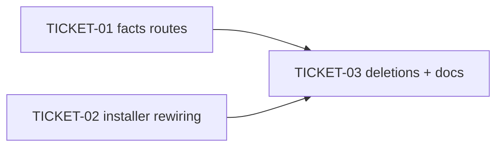

# Tasks — Replace opencode + Kilo shell hooks with native TS plugins

> **STATUS:** `sliced` (2026-10-08)

> Sliced from `.skillgrid/specs/2026-10-07-replace-opencode-hooks-with-plugins/blueprint.md`.
> Vertical tracer-bullet tickets, dependency-ordered, sized for one fresh agent context window.

## Epic Summary

Retire the shell-era hook system for opencode and Kilo. The Go installer copies the 5 already-written TS plugins from `plugins/opencode/` into both harness config dirs, registers them in the harness JSONC, and stops wiring the retired `hooks.yaml` / 4 shell scripts / `skillgrid-checkpoint.ts`. A new `/facts*` HTTP route set wraps the existing `facts.Store`. The 8 retired files are deleted from the repo. Per ADR-0032 (single-source `plugins/opencode/`, Kilo copy-at-install).

## Delivery Strategy

| Field | Value |
|-------|-------|
| Estimated changed lines | ~700-900 |
| 400-line budget risk | Medium |
| Chained PRs recommended | No |
| Suggested split | single PR |
| Delivery strategy | single-pr |
| Chain strategy | size-exception |

Decision needed before apply: Yes
Chained PRs recommended: No
Chain strategy: size-exception
400-line budget risk: Medium

> Medium risk, single wiring path — one PR with a clear review path. The 400-line budget is
> exceeded only by the installer + test rewrites, which are one mechanical concern. If the
> maintainer prefers chained PRs: Unit 1 = facts HTTP routes (self-contained), Unit 2 =
> installer rewiring + deletions + docs.

## Tickets

### TICKET-01 — Facts HTTP routes

- **Scope:** Add `registerFactsRoutes` to `mnemonic/internal/http/facts.go` (5 routes over `facts.Store`), wire into `server.go`, cover with `facts_test.go`.
- **Acceptance:** `POST /facts` → 200 `{id}` (400 on empty content); `POST /facts/search` → 200 `{facts}` (empty array on no match); `POST /facts/{id}/forget` → 204 (404 unknown id); `POST /facts/{id}/decay` → 200 `{score}`; `POST /facts/decay-all` → 200 `{decayed, purged}`. `go test ./mnemonic/internal/http/...` passes.
- **SATISFIES:** happy path POST /facts adds a fact; happy path POST /facts/search finds a fact; happy path POST /facts/{id}/forget soft-deletes a fact; happy path POST /facts/{id}/decay applies decay; happy path POST /facts/decay-all decays and purges all facts; error path POST /facts with empty content returns 400; error path POST /facts/999/forget with unknown id returns 404
- **Files:** `mnemonic/internal/http/facts.go` (new ~150), `mnemonic/internal/http/facts_test.go` (new ~200), `mnemonic/internal/http/server.go` (+2)
- **Size:** ~350 (S)
- **Blocks:** TICKET-03
- **Blocked by:** none
- **Fails-when:** `go test ./mnemonic/internal/http/...` exits non-zero or any route test fails.

### TICKET-02 — Installer rewires 5 plugins (opencode + kilocode + setup.go)

- **Scope:** Add 5 plugin rel constants to `setup.go`; trim `openCodeHookScripts` to the 3 shared workers; update `FindRepoRoot` to the new rels; extend `retiredPluginEntry` with `opencode-yaml-hooks` and `skillgrid-checkpoint.ts`; rewrite `opencode.go` + `kilocode.go` to copy the 5 TS plugins and upsert 5 config keys; rewrite `opencode_test.go` + `kilocode_test.go` assertions.
- **Acceptance:** `go test ./mnemonic/internal/setup/...` passes with: 5 `.ts` files present under `~/.config/{opencode,kilo}/plugin/` after setup; config lists all 5 `./plugin/<name>.ts`; `hook/hooks.yaml`, `skillgrid-checkpoint.ts`, `opencode-yaml-hooks` absent; 4 `opencode-*.sh` absent from `~/.skillgrid/hooks/`; 3 shared workers present; `FindRepoRoot` finds the root via the 5 new rels and errors without them; existing config containing `opencode-yaml-hooks` + `skillgrid-checkpoint.ts` gets both dropped on next setup.
- **SATISFIES:** happy path SetupOpenCode installs all 5 plugins; happy path SetupOpenCode no longer installs hooks.yaml; happy path SetupOpenCode no longer installs skillgrid-checkpoint; happy path SetupKiloCode installs all 5 plugins from opencode source; happy path SetupKiloCode no longer installs hooks.yaml; happy path SetupKiloCode no longer installs skillgrid-checkpoint; happy path shared worker tool-call-capture.js is kept; happy path git-hook Stop gates are kept; happy path FindRepoRoot finds repo root via new plugin files; error path FindRepoRoot fails when no new plugin files exist; happy path dropRetiredPlugins removes opencode-yaml-hooks and checkpoint
- **Files:** `mnemonic/internal/setup/setup.go` (~40), `mnemonic/internal/setup/opencode.go` (~25), `mnemonic/internal/setup/kilocode.go` (~25), `mnemonic/internal/setup/opencode_test.go` (~120), `mnemonic/internal/setup/kilocode_test.go` (~120)
- **Size:** ~330 (S)
- **Blocks:** TICKET-03
- **Blocked by:** none
- **Fails-when:** `go test ./mnemonic/internal/setup/...` exits non-zero.

### TICKET-03 — Delete retired files + update docs/scripts

- **Scope:** Delete the 8 retired files from the repo; drop `opencode-*.sh` sections from `scripts/test-hooks.mjs`; update `docs/user-guide/04-hooks.md` to the 5-plugin era.
- **Acceptance:** `git status` shows exactly the 8 deletions; `scripts/test-hooks.mjs` runs clean; `04-hooks.md` references the 5 plugins, not the 4 shell scripts; `pnpm test`, `pnpm lint`, `pnpm typecheck` exit 0.
- **SATISFIES:** happy path retired opencode shell scripts are removed; happy path retired hooks.yaml files are removed; happy path retired checkpoint plugins are removed; happy path Go tests for setup and http packages pass; happy path plugin tests pass; happy path lint and typecheck pass
- **Files:** 8 deletions (`plugins/opencode/{skillgrid-checkpoint.ts,hooks.yaml}`, `plugins/kilo/{skillgrid-checkpoint.ts,hooks.yaml}`, `hooks/opencode-{session-start,session-end,policy,tool-capture}.sh`), `scripts/test-hooks.mjs` (~30), `docs/user-guide/04-hooks.md` (~40)
- **Size:** ~150 (S)
- **Blocks:** none
- **Blocked by:** TICKET-01, TICKET-02 (deletions must not land while the installer still copies them)
- **Reversibility:** reversible
- **Fails-when:** `pnpm test` / `pnpm lint` / `pnpm typecheck` exits non-zero, or `git status` lists fewer than 8 deletions.

## Dependency Graph

## Execution Order

- **Wave 1 (parallel):** TICKET-01, TICKET-02 (independent — different packages, no shared edits)
- **Wave 2:** TICKET-03 (after TICKET-01 + TICKET-02)

> **Acceptance-first (BDD is always on):** each ticket's RED state is confirmed before its
> implementation turns it green — for TICKET-01 that is the new route tests failing against a
> server without the routes; for TICKET-02 the rewritten installer tests failing against the
> old wiring.

## Slicing Notes

- The 5 TS plugins themselves are out of scope — already written and tested; this change only
  rewires the installer (per ADR-0032).
- `mnemonic/internal/facts` Store signatures take `ctx` + `sessionID` params (verified in code);
  the briefing's abbreviated `Add(content)` / `SearchWith(query, limit)` map to the real
  signatures — the handler resolves session from the request (empty = project scope).
- Deletions are their own ticket (TICKET-03) so the installer rewiring can be reviewed and
  landed green before the repo loses the files it was still copying.
