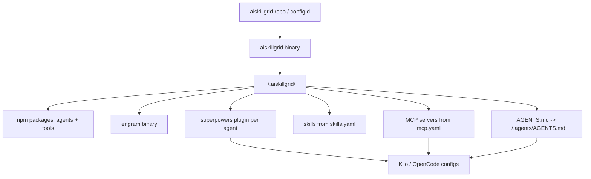

# Installation

Installation has two parts: building the `aiskillgrid` binary, and running it. The binary does not need to be built on every machine you target — build it once locally or on CI, then run it wherever the environment should be reproduced.

This is one of the main advantages of aiskillgrid: the same config that a teammate, a CI box, or a new laptop reads produces the same agent environment. No per-machine ritual.

## What The Installer Does

At a high level, `aiskillgrid install` reads `config.d/`, installs tools, and merges shared configuration into each agent's config file.



## Requirements

- `git`
- `node` + `npm` on PATH (or installed automatically from `scripts/install_node.sh` if the repo sync/clone provides it)
- `go` 1.23+ only if you are building the binary, not using a prebuilt one

## Build The Binary

From the repo root:

```bash
task build
```

This produces `bin/aiskillgrid`. For cross-platform builds:

```bash
task build-all        # darwin-amd64, darwin-arm64, linux-amd64, linux-arm64
task test-cli         # run the test suite
```

## Run The Installer

Two common modes:

```bash
# 1) clone mode: pulls the release repo and uses its config.d
./bin/aiskillgrid install

# 2) sync mode: develops against a local checkout (repo + config.d are copied)
./bin/aiskillgrid install --sync-repo /path/to/local/aiskillgrid
```

Every step runs in this order (see `docs/00-aiskillgrid-cli.md` for the source-of-truth list):

| Step | What happens | Source of truth |
|------|--------------|-----------------|
| 0 | Interactive agent selector | prompt (skipped with `--yes`) |
| 1 | Clone or sync repo, copy `config.d` | `repos/aiskillgrid` |
| 2 | Check Node.js, install via `scripts/install_node.sh` if missing | repo script |
| 3 | Install `engram` prebuilt binary into `~/.aiskillgrid/bin` | GitHub Releases |
| 4 | `npm install` of `agents` + `tools` | `config.d/tools.yaml` |
| 5 | Install superpowers plugin per selected agent, run `engram setup opencode` | hardcoded ref in code |
| 6 | Install skills via local `skills` CLI | `config.d/skills.yaml` |
| 7 | Merge MCP servers into each agent config | `config.d/mcp.yaml` |
| 8 | Copy rules to `~/.agents/AGENTS.md`, register in each agent config | `config.d/AGENTS.md` |
| 9 | Print PATH exports | — |

## Base Directory Layout

After a successful install, `~/.aiskillgrid/` holds everything the CLI owns:

```
~/.aiskillgrid/
├── bin/                     # engram binary
├── node_modules/.bin/       # agent CLIs and tools (npm --prefix install)
├── repos/aiskillgrid/       # cloned/synced aiskillgrid source
├── config.d/                # tools.yaml, mcp.yaml, skills.yaml, AGENTS.md
├── backups/                 # timestamped backup of every agent config edit
├── logs/install.log         # full run log (errors, warnings, info)
└── tmp/                     # transient download artifacts
```

## Step Reference (what each step does, verbatim)

This is the canonical step list the CLI implements:

```bash
# 0) interactive agent selector (prompt; skipped with --yes)

# 1) clone repo
mkdir ~/.aiskillgrid/repos
git clone -b release/2 https://github.com/devopstales/aiskillgrid.git repos/
cp -r repos/aiskillgrid/config.d ~/.aiskillgrid/

# 2) check and install node (scripts/install_node.sh)

# 3) install engram binary into ~/.aiskillgrid/bin
ENGRAM_VERSION=$(curl -s https://api.github.com/repos/Gentleman-Programming/engram/releases/latest | grep '"tag_name"' | sed -E 's/.*"v([^"]+)".*/\1/')
# platform: darwin_arm64 | darwin_amd64 | linux_arm64 | linux_amd64
curl -L "https://github.com/Gentleman-Programming/engram/releases/download/v${ENGRAM_VERSION}/engram_${ENGRAM_VERSION}_${PLATFORM}.tar.gz" -o /tmp/engram.tar.gz
tar -xzf /tmp/engram.tar.gz -C ~/.aiskillgrid/bin
chmod +x ~/.aiskillgrid/bin/engram

# 4) install selected agents and tools based on config.d/tools.yaml
npm install @kilocode/cli --prefix "$HOME/.aiskillgrid"
npm install opencode-ai --prefix "$HOME/.aiskillgrid"
npm install vercel-labs/skills --prefix "$HOME/.aiskillgrid"
npm install @playwright/cli@latest --prefix "$HOME/.aiskillgrid"
npm install @playwright/mcp@latest --prefix "$HOME/.aiskillgrid"
npm install agent-browser --prefix "$HOME/.aiskillgrid"

# 5) install plugins
npm install superpowers@git+https://github.com/obra/superpowers.git --prefix "$HOME/.config/kilo"
npm install superpowers@git+https://github.com/obra/superpowers.git --prefix "$HOME/.config/opencode"
# register: "plugin": ["~/.config/<agent>/node_modules/superpowers"]
engram setup opencode
cp ~/.config/opencode/plugins/engram.ts ~/.config/kilo/plugins/engram.ts

# 6) install skills based on config.d/skills.yaml
~/.aiskillgrid/node_modules/.bin/skills add obra/superpowers --agent amp -g -s '*' -y

# 7) install mcp based on config.d/mcp.yaml (merge into agent configs)

# 8) install rules
cp ~/.aiskillgrid/config.d/AGENTS.md ~/.agents/AGENTS.md
# register in ~/.config/kilo/kilo.jsonc and ~/.config/opencode/opencode.jsonc (instructions)

# 9) print PATH exports
export PATH="$HOME/.aiskillgrid/bin:$PATH"
export PATH="$HOME/.aiskillgrid/node_modules/.bin:$PATH"
```

The next PATH step (doc 02) explains the two lines the installer prints.
