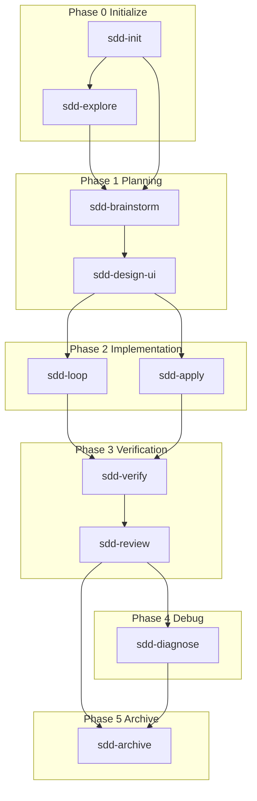

# Skillgrid templates and planning logic

This document is the **human-oriented** reference for how **PRDs** (product requirements documents), the **INDEX** (the `.skillgrid/prd/INDEX.md` file: dependency-ordered PRD list plus optional **execution snapshot** — current phase, active change or slice, discovered work, and session notes), **OpenSpec** (the repo’s spec-driven change layout under `openspec/`: one folder per initiative with proposal, design, tasks, and slice specs), **vertical slices** (thin, shippable units of work), **ADRs** (architecture decision records), usually stored as **MADR** (Markdown Any Decision Record) files under `.skillgrid/adr/`, and project docs fit together. **Blank file shapes** live under **`.skillgrid/templates/`** as **`template-<kebab-case>.md`** files (plus `README.md` for the index; synced by the hub `install.sh`); skills point there so templates stay editable without hunting through long skill markdown.

## How work flows through the artifacts

The diagram below is the Skillgrid mental model: product intent lives in **PRD** and **INDEX** files, execution intent is refined in an **OpenSpec** change, engineering work runs against **slice specs** and **tasks**, and feedback updates the catalog and snapshot. (Other tools—for example a local issue DAG or “beads”-style trackers—can mirror the same graph; they are optional and not required by this hub.)



**Planning detail:** `/sdd-brainstorm` orchestrates clarify → propose → spec → design → PRD → tasks (and optional UI design). `/sdd-explore` and the brainstorm explore step run **`deep-research`** (web search before codebase reads). Persona dispatch is per phase skill — see `docs/09-subagent-personas.md`.

## Execution model: linear, single clone

Skillgrid’s default SDD path is a **linear, non-parallel, single-agent workflow**:

- One **session coordinator** advances phases in order (init → plan → apply → verify → archive).
- Implementation runs **one vertical slice at a time** on the **current branch** in the **same working tree** (`/sdd-loop` enforces one `[AFK]` task per invocation; `/sdd-apply` may run more tasks in one session, but still serially).
- Skillgrid **does not use `git worktree`** (or other isolated clone layouts) as part of the core workflow. There is no built-in “one worktree per parallel lane” model.

**What still uses subagents:** Norse personas and skills such as `parallel-delegate` may dispatch **read-only or report-only** subagents (research, review, recon). Those return artifacts under `.skillgrid/tasks/research/`; the coordinator merges them and continues on the **same** tree. They are not a substitute for parallel implementation branches.

**If you need parallel coding:** use normal git branches and your own merge process outside this harness, or tools documented in `docs/17-external-tools.md` (for example `ralph-tui --parallel` with its own worktree story). That is optional and **not** the Skillgrid default.

## Operational checkpoints (Tier 1)

Safe resume points on the **same branch** (no worktrees): each run of `checkpoint-record.sh` updates `checkpoints.log`, **Last checkpoint** in the handoff, and a JSONL timeline row. SDD triggers include **`before-apply`** (after apply gate, before code), **`after-loop`**, **`verify-pass`**, **`pre-archive`**, and **`handoff-create`**.

Full reference: **[docs/18-checkpoints.md](18-checkpoints.md)**.

## Where templates live

| Path | Purpose |
|------|---------|
| [`.skillgrid/templates/README.md`](../.skillgrid/templates/README.md) | Naming convention + index of all `template-*.md` files |
| [`.skillgrid/templates/template-adr.md`](../.skillgrid/templates/template-adr.md) | **ADR** (Architecture Decision Record) template for new **ADRs** (architecture decision records) in `.skillgrid/adr/` |
| [`.skillgrid/templates/template-prd.md`](../.skillgrid/templates/template-prd.md) | New **PRD** (product requirements document) body |
| [`.skillgrid/templates/template-index.md`](../.skillgrid/templates/template-index.md) | `.skillgrid/prd/INDEX.md` |
| [`.skillgrid/templates/template-openspec-tasks.md`](../.skillgrid/templates/template-openspec-tasks.md) | `openspec/changes/<change-id>/tasks.md` |
| [`.skillgrid/templates/template-openspec-slice-spec.md`](../.skillgrid/templates/template-openspec-slice-spec.md) | `openspec/changes/<change-id>/specs/<slice>/spec.md` |
| [`.skillgrid/templates/template-handoff-context.md`](../.skillgrid/templates/template-handoff-context.md) | `.skillgrid/tasks/context_<id>.md` |
| [`.skillgrid/templates/template-project.md`](../.skillgrid/templates/template-project.md) | `.skillgrid/project/PROJECT.md` |
| [`.skillgrid/templates/template-architecture.md`](../.skillgrid/templates/template-architecture.md) | `.skillgrid/project/ARCHITECTURE.md` |
| [`.skillgrid/templates/template-structure.md`](../.skillgrid/templates/template-structure.md) | `.skillgrid/project/STRUCTURE.md` |
| [`.skillgrid/templates/template-design.md`](../.skillgrid/templates/template-design.md) | Repo root `DESIGN.md` |

Skills (`sdd-prd`, `sdd-spec`, `sdd-tasks`, `sdd-archive`, and related `sdd-*` phases) **describe behavior** and link these files; they should not drift into a second full copy of the template without updating `.skillgrid/templates/`.

## Planning logic: hierarchy

| Level | Jira-style | GitHub-style | Artifact |
|-------|------------|--------------|----------|
| Milestone / program | Epic | Milestone | `.skillgrid/prd/INDEX.md` — dependency-ordered **PRDs** (product requirements documents) + **execution snapshot** (phase, active change/slice, discovered work, session notes) |
| Feature | Task | Issue | `.skillgrid/prd/PRD<NN>_<slug>.md` + one `openspec/changes/<change-id>/` |
| Shippable unit | Sub-task | Checklist item | Vertical slice — `tasks.md` + `specs/<slice>/spec.md` |

There is **no** `.skillgrid/project/TASK.md`. “Where we are” lives in the **INDEX** snapshot and **OpenSpec** task artifacts.

## OpenSpec layout (per change)

```text
openspec/changes/<change-id>/
  proposal.md
  design.md
  tasks.md
  specs/<vertical-slice-slug>/
    spec.md
```

- **`tasks.md`** — cross-slice ordering and integration checklist.
- **`specs/<slice>/spec.md`** — bounded requirements and checklist for one vertical slice (preferred context for a single apply session).
- **`openspec/specs/<change-id>/spec.md`** — optional cross-cutting spec for the initiative.

## ADRs (MADR)

Repo-wide architectural decisions use **MADR** (Markdown Any Decision Record) files under **`.skillgrid/adr/`** (named `NNNN-kebab-title.md`). That directory holds **only** those **ADR** (architecture decision record) files — no README or other metadata there. Copy **`.skillgrid/templates/template-adr.md`**. Summaries and links belong in **`.skillgrid/project/ARCHITECTURE.md`** under **Durable decisions** so others can discover decisions. Draft or review ADRs with skill **`architectural-decision-records`**: during **`/sdd-brainstorm`** inside the **`sdd-design`** phase when triggers apply, or standalone via **`/sdd-explore <decision-topic>`**.

## Session bootstrap

For session bootstrap, see **`.agents/rules/`** (coordinator rules). **Project glossary and `CONTEXT.md` policy** live in **`.skillgrid/project/CONTEXT.md`**. Configuration lives in **`.skillgrid/config.json`** (artifact store mode, PRD workflow, phase order, beads toggle). See also **`docs/02-workflow-usage.md`**.

## Related docs

- [Workflow usage](02-workflow-usage.md) — commands, slices, handoff, smart zone
- [Skills](05-skills.md) — how skills load and when to use registry
- [Commands reference](04-commands-reference.md) — slash commands and phase skills
- [Checkpoints](18-checkpoints.md) — Tier 1 operational checkpoints
