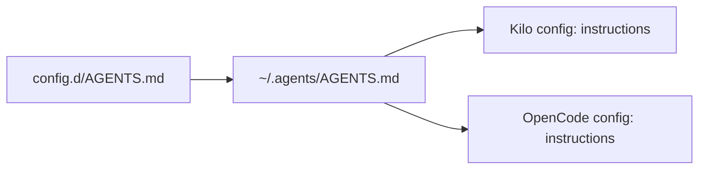

# Rules

Rules are the shared `AGENTS.md` that every agent in your environment should follow. aiskillgrid keeps one canonical copy in `config.d/AGENTS.md` and materializes it to both places where agents read it:

1. `~/.agents/AGENTS.md` — the portable location, referenced by Kilo and OpenCode
2. Each selected agent config's `instructions` array — the per-agent registration

This is the same pattern Kilo's and OpenCode's own documentation prescribes (both read an `instructions` array pointing at `AGENTS.md`-style files).

## Pipeline

`install` (step 8) does this for every selected agent:



Concretely:

1. Copy `~/.aiskillgrid/config.d/AGENTS.md` → `~/.agents/AGENTS.md` (overwriting on each install).
2. For each selected agent, append `~/.agents/AGENTS.md` to the `instructions` array of that agent's config.
3. The append is idempotent — re-running does not produce duplicate entries.

## The Two `instructions` Arrays

Both Kilo (`kilo.jsonc`) and OpenCode (`opencode.jsonc`) read from a top-level `instructions` field:

```json
{
  "instructions": ["~/.agents/AGENTS.md"]
}
```

The installer uses `tidwall/sjson` to append to `instructions` without touching any other key, and to read the current list first so it won't duplicate.

## Where to Change Rules

- **Shared rules** (all agents, all projects): edit `config.d/AGENTS.md`, then re-run `install`.
- **Project-specific rules**: keep a project's `AGENTS.md` in that project's repo. It does not interact with aiskillgrid.
- **Per-agent rules**: edit `~/.config/<agent>/`'s config directly — aiskillgrid's `plugin` and `instructions` merges preserve unrelated keys, so a hand-added `instructions` entry survives reinstalls.

## The Default AGENTS.md

The default `config.d/AGENTS.md` covers:

- AI agent behavior rules (concise responses, prefer edits, no secrets)
- aiskillgrid environment (`~/.aiskillgrid/` layout)
- Verification discipline (tests/build/lint before claiming done)
- Commit + config-source-of-truth conventions

The file is plain Markdown. Extend it or replace it; the installer does not interpret its content.
