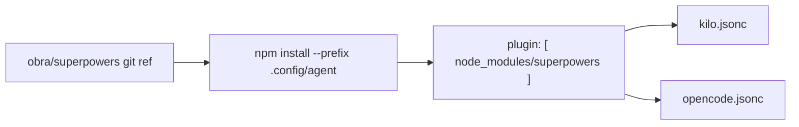
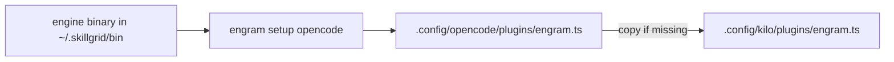
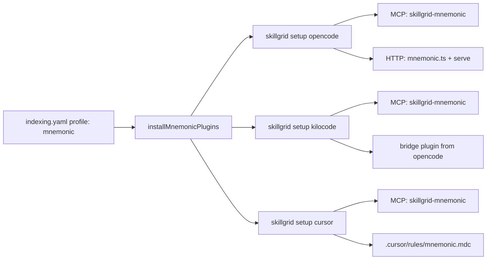

# Plugins

skillgrid installs **plugins** per agent in step 5 of the install flow. Plugins are richer than single MCP endpoints or skills — they bundle agent behaviors, hooks, and (for engram) a persistent memory backend.

Two plugins are installed by default:

| Plugin | Source | How it lands |
|--------|--------|--------------|
| superpowers | `obra/superpowers` (git) | npm `--prefix` install per agent + `plugin` key registration |
| engram | `Gentleman-Programming/engram` (binary) | `engram setup opencode` + `engram.ts` copied to kilo |

When `config.d/indexing.yaml` sets `profile: mnemonic`, **Mnemonic** replaces engram as the persistent-memory backend. The installer runs `skillgrid setup` per selected agent immediately after the superpowers step (see [Mnemonic](#mnemonic) below).

This doc focuses on the plugin mechanics. For skills (behavior definitions) see [05-skills](05-skills.md); for MCP servers see [04-mcp-servers](04-mcp-servers.md).

## What a plugin is here

- **superpowers** — a zero-dependency plugin from `obra/superpowers` that auto-loads a skill bootstrap at session start so skills trigger at the right moments. It is installed from the git ref `superpowers@git+https://github.com/obra/superpowers.git` (pinned in code as `superpowersRef`), not from the npm registry.
- **engram** — a prebuilt binary (installed in step 3) that provides the persistent-memory MCP server and a per-agent plugin file (`engram.ts`).

## superpowers

For each selected agent (kilo, opencode) the CLI does:

1. Installs the git ref into the agent's config dir:

```bash
npm install superpowers@git+https://github.com/obra/superpowers.git --prefix "$HOME/.config/kilo"

ln -sf ~/.config/kilo/node_modules/superpowers/.kilo/plugins/superpowers.js \
  ~/.config/kilo/plugins/superpowers.js
```

2. Registers the resolved path under the top-level `plugin` key of that agent's config (idempotent append):

```json
{
  "skills": {
    "paths": ["~/.config/kilo/node_modules/superpowers/skills"]
  }
}
```



Notes:

- The `plugin` array append is idempotent — re-running does not duplicate the entry.
- The path is stored with `~` in place of the home directory, so the config stays portable across machines.
- A backup of the agent config is taken before the `plugin` key is written (`~/.skillgrid/backups/`).
- Plugin install failure **warns and continues** (per the error-handling contract) — the MCP and rules steps still run.

## engram

engram spans two install steps:

- **Step 3** installs the prebuilt binary to `~/.skillgrid/bin/engram`.
- **Step 5 (plugin)** wires it into the agents that need it:



Concretely (`installPlugins`, `cmd/steps.go`):

1. If `opencode` is among the selected agents, run `engram setup opencode` (using the installed binary at `~/.skillgrid/bin/engram`, falling back to `engram` on PATH).
2. If kilo is selected and `~/.config/kilo/plugins/engram.ts` is missing, copy it from `~/.config/opencode/plugins/engram.ts`. This gives kilo the same engram plugin without running a second `engram setup`.

The engram memory backend is also exposed to agents as an MCP server (see [04-mcp-servers](04-mcp-servers.md) — the `engram` local entry `engram mcp`).

```bash
~/.aiskillgrid/bin/engram setup opencode
~/.aiskillgrid/bin/engram setup codex
~/.aiskillgrid/bin/engram setup cursor

cp ~/.config/opencode/plugins/engram.ts ~/.config/kilo/plugin/
cp ~/.config/opencode/tui.json ~/.config/kilo/tui.json

```

## Mnemonic

When `config.d/indexing.yaml` sets `profile: mnemonic`, the installer runs Mnemonic setup after superpowers (`installMnemonicPlugins` in `cmd/steps.go`). Setup is gated on that profile — other profiles skip this step entirely.

For each selected agent, the CLI invokes the same commands as manual setup:

```bash
skillgrid setup opencode
skillgrid setup kilocode    # when kilo is selected
skillgrid setup cursor      # when cursor is selected
```

With `--dry-run`, the installer logs planned setup steps, e.g. `[dry-run] skillgrid setup opencode`.

### Three-agent transport

Mnemonic uses two transport layers per agent: MCP tools (`skillgrid mcp`) and, where supported, an HTTP plugin that talks to `skillgrid serve`.

| Agent | MCP | HTTP plugin |
|-------|-----|-------------|
| OpenCode | `skillgrid mcp` in `opencode.json` (`skillgrid-mnemonic`) | `mnemonic.ts` → `skillgrid serve` |
| Kilo Code | same MCP entry in `kilo.jsonc` | copied plugin + `AGENTS.md` protocol marker |
| Cursor | `skillgrid mcp` in `~/.cursor/mcp.json` | rule only (no HTTP plugin) |

The MCP server id `skillgrid-mnemonic` matches the commented entry in `config.d/mcp.yaml`. Uncomment it (and disable `engram`) when cutting over to the mnemonic profile. Setup also writes the same id directly into agent configs during `skillgrid setup`.



Notes:

- Repo root for plugin files is `~/.skillgrid/repos/skillgrid` (synced during install).
- Setup failure **warns and continues** — MCP merge and rules steps still run.
- Re-running `install` is idempotent: setup upserts MCP entries and copies plugins only when missing.

## Context Mode

After Superpowers, `install` wires [context-mode](https://github.com/mksglu/context-mode) for the selected agents. It is a **plugin**, not an MCP server.

```bash
git clone https://github.com/mksglu/context-mode.git ~/.cursor/plugins/local/context-mode

npm install context-mode --prefix "$HOME/.config/opencode"
# then
"plugin": ["context-mode"]
cp ~/.config/opencode/node_modules/context-mode/configs/opencode/AGENTS.md ~/.config/opencode/AGENTS.md

npm install context-mode --prefix "$HOME/.config/kilo"
# then
"plugin": ["context-mode"]
cp ~/.config/kilo/node_modules/context-mode/configs/opencode/AGENTS.md ~/.config/kilo/AGENTS.md

codex plugin marketplace add mksglu/context-mode
# then in ~/.codex/config.toml
[features]
plugin_hooks = true
hooks = true
```

## Why two mechanisms

- **superpowers** is source-first (skills bootstrap), so it ships as an npm/git plugin and is *registered* in the config.
- **engram** is binary-first (a runtime service + plugin file), so it is *installed* as a binary and its plugin file is *materialized* into each agent's `plugins/` dir.

Both end up as "the agent knows about this capability at session start", but the delivery path differs by what the tool actually is.

## Reconcile / re-run

`install` is idempotent for plugins:

- superpowers npm install is re-run (npm dedupes), and the `plugin` registration is an append-no-dup.
- engram `setup opencode` is re-run only when opencode is selected; the `engram.ts` copy is skipped if the target already exists.

To force a fresh superpowers build, remove the prefix first:

```bash
rm -rf ~/.config/kilo/node_modules/superpowers ~/.config/opencode/node_modules/superpowers
./bin/skillgrid install
```

## Reference

- superpowers: https://github.com/obra/superpowers
- engram: https://github.com/Gentleman-Programming/engram
