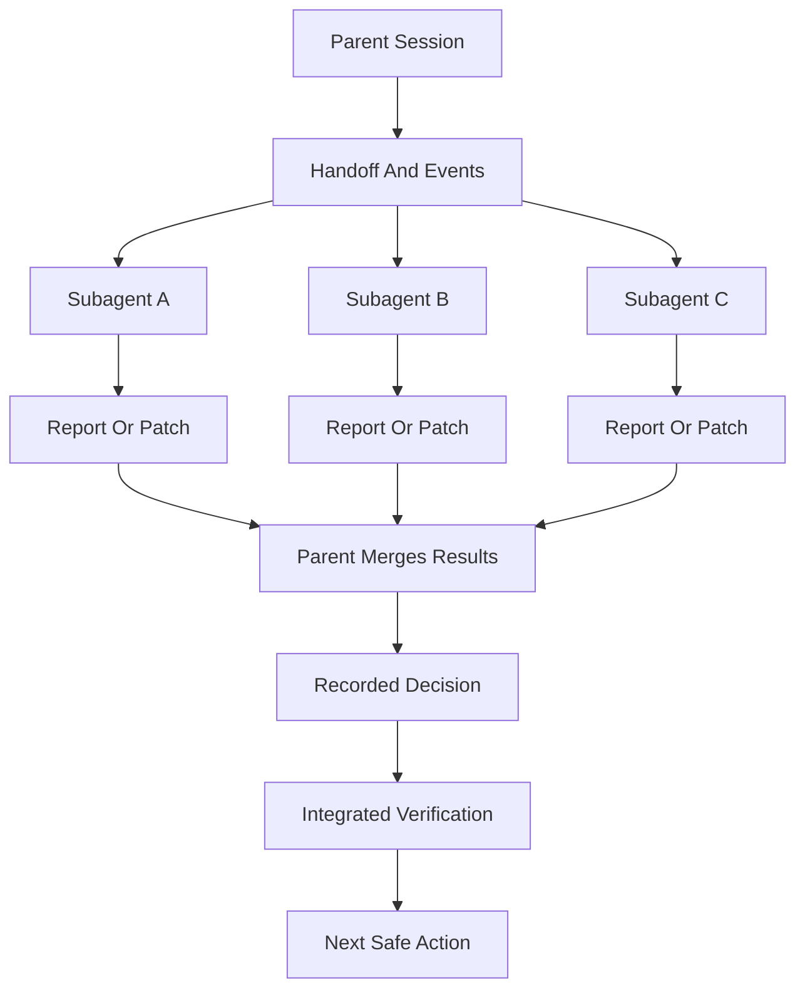
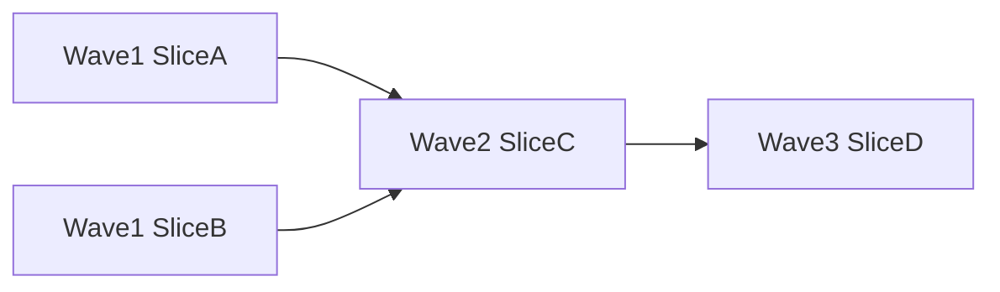

# Multi-Agent Work

This guide explains how Skillgrid should coordinate multiple agents without losing control of scope, context, evidence, or decisions.

The main rule is simple: **delegate work, not responsibility**. The parent session owns workflow state, decisions, handoff updates, and final verification. Subagents provide fresh-context work products.



## Core Model

Use multiple agents when the work benefits from either:

- a fresh context window;
- a specialist viewpoint;
- safe parallelism;
- a separate report, audit, or implementation lane.

Do not use multiple agents to hide uncertainty. If scope is unclear, route back to questioning, planning, or HITL decision-making before dispatch.

## Personas

Personas are specialist roles. They are not workflows by themselves. A skill is the procedure; a persona is the viewpoint and report style.

Norse personas are **stateless capability packs**. Bindings live in each **`sdd-<phase>/SKILL.md`** (section *Norse persona invocations*). Protocol: **`sdd-persona-delegation.md`**.

- Session **coordinator** — orchestration and merge (OpenCode may use agent name `odin`; not a persona slot).
- `kvasir`, `mimir`, `thor`, `tyr`, `heimdall`, `frigg`, `loki`, `bragi`, `vidar` — dispatched per phase skill.

Full catalog and hard gates: **`09-subagent-personas.md`**.

## Handoff And Event Logs

Multi-agent work must be visible outside chat. Skillgrid uses three durable paths:

```text
.skillgrid/tasks/context_<change-id>.md
.skillgrid/tasks/events/<change-id>.jsonl
.skillgrid/tasks/research/<change-id>/
```

- The handoff is the current state: phase, blockers, AFK-ready work, decisions, evidence, and next action.
- The event log is the append-only timeline: starts, completions, blockers, subagent dispatches, returns, and decisions.
- The research directory holds long outputs: reports, audits, browser evidence, comparisons, design critiques, and subagent findings.

Use a compact dispatch index for recent state:

```text
.skillgrid/tasks/registry_<change-id>.md
```

The registry is a short, recent index (decisions/progress/blockers/next candidates). It exists to avoid repeatedly scanning long reports during subagent dispatch.

Every delegated subagent should either append an event or return a suggested event object for the parent to append. The parent should not advance the workflow until the handoff and event log reflect the subagent result.

Useful event fields:

```json
{
  "time": "<iso8601>",
  "changeId": "<change-id>",
  "phase": "<phase>",
  "node": "subagent",
  "status": "dispatched|completed|blocked|failed",
  "subagent": "<persona-or-role>",
  "role": "<role>",
  "task": "<short task>",
  "output": ".skillgrid/tasks/research/<change-id>/<file>.md",
  "summary": "<one-line result>",
  "artifacts": ["<path>"]
}
```

## Subagent Orchestration Skill

The canonical operating rules live in the `sdd-*` workflow skills under `.agents/skills/` (especially `sdd-explore`, `sdd-apply`, `sdd-verify`, and `sdd-archive`). Load the relevant skill whenever an `sdd-*` workflow dispatches subagents for exploration, research, design critique, implementation, testing, security, validation, or phase-bound persona review.

That skill defines:

- fresh-context prompt construction from durable artifacts;
- prompt contracts and return formats;
- model selection guidance;
- parallelization rules;
- apply dispatch loop;
- two-stage review;
- red flags and reassessment rules.

Subagent prompts should include:

- goal and phase;
- PRD path;
- OpenSpec change path when present;
- `.skillgrid/tasks/context_<change-id>.md`;
- `.skillgrid/tasks/events/<change-id>.jsonl`;
- expected output path under `.skillgrid/tasks/research/<change-id>/`;
- selected project standards from `.skillgrid/project/SKILL_REGISTRY.md` when relevant;
- exact return format.

Required context injection packet fields:

- objective (one sentence);
- constraints and non-goals;
- exact task or slice id;
- file ownership/edit boundaries;
- ordered artifact read list (handoff, events, registry, PRD/OpenSpec as needed);
- expected output path and format;
- verification command with expected pass condition.

Do not paste session history into subagent prompts. Build the prompt from durable artifacts and a short task-specific context packet.

## Phase-bound persona dispatch

When a phase needs independent judgment, the coordinator runs required invocations from the active **`sdd-<phase>/SKILL.md`**. Reports go under `.skillgrid/tasks/research/<change-id>/`; the coordinator merges and records decisions.

**Hard gates (summary):** **`tyr`** / **`heimdall`** critical blocks progression; unresolved critical conflict → HITL; user owns release/destructive choices. See **`sdd-persona-delegation.md`**.

Every persona dispatch must produce:

- one focused report per persona under `.skillgrid/tasks/research/<change-id>/`;
- a decision entry in `.skillgrid/tasks/context_<change-id>.md`;
- JSONL events in `.skillgrid/tasks/events/<change-id>.jsonl`;
- a parent summary that records accepted decision, rejected options, conflicts, HITL status, and next safe action.

Suggested handoff record (see also `skillgrid-handoff.md`):

```markdown
## Persona merge: <phase> — <change-id>

Personas invoked (persona → capability):
Report paths:
Accepted findings / decision:
Rejected options:
Conflicts:
HITL required: yes/no
Artifacts updated:
Next safe action:
```

Suggested persona event fields: `node: "persona"`, `status: "dispatched" | "completed" | "blocked"`, `persona`, `capability`, `findings_severity`, `hitlRequired`.

## Dependency Waves

Dependency waves are how Skillgrid should parallelize safely. A wave is a group of independent tasks that can run at the same time because they have no unresolved blockers and do not edit overlapping files.



Use waves when `tasks.md` or the handoff records:

- `blockedBy`: task ids that must finish first;
- `unblocks`: task ids that become eligible afterward;
- file ownership or edit boundaries;
- verification requirements for the wave.

Rules:

- independent tasks can share a wave;
- dependent tasks move to a later wave;
- tasks touching the same files should be sequential unless ownership is explicit and non-overlapping;
- failed verification in one wave blocks dependent waves;
- the parent merges evidence after each wave before dispatching the next.

Dispatch decision test:

- **Will agent B need to read agent A output?**
  - yes -> sequential
  - no -> parallel allowed (only with non-overlapping ownership and planned merge verification)

Dependency waves pair naturally with vertical slices. Horizontal layer plans usually parallelize badly because later tasks cannot be verified until the stack is assembled.

## Parallel implementation lanes

Skillgrid works safely in a single clone using handoff files, event logs, small scopes, and non-overlapping outputs. For parallel implementation, use **separate branches** (one lane per branch), explicit file ownership, and `parallel-delegate` for merge discipline.

Parallel lane model:

- parent assigns one branch per implementation lane when lanes are truly independent;
- each lane gets the same PRD/OpenSpec/handoff context plus its assigned slice;
- each lane writes its own report and event suggestions;
- parent reviews diffs, runs verification, and merges lanes in dependency order;
- conflicts or failed verification route back to a fix task, not silent merge.

## Parallelism Rules

Parallelism is useful only when it reduces wall-clock time without multiplying risk.

Good parallel work:

- repo mapping and external research;
- design critique and API constraint review;
- independent persona capability reports (parallel when phase skill allows);
- test strategy and security review;
- implementation lanes on separate branches with explicit non-overlapping file ownership.

Bad parallel work:

- multiple agents editing the same files;
- multiple guesses at the same bug root cause;
- dependent tasks launched together;
- implementation before HITL blockers are resolved;
- broad “fix everything” prompts.

Before launching parallel subagents, the parent should verify:

- each agent has a distinct goal;
- each agent has a distinct output path;
- each agent has a bounded context packet;
- file ownership is clear for any writer;
- the parent has time to read and merge all results;
- verification can cover the integrated result.

## Retry Ladder (Artifact Mismatch)

If a subagent claims completion but expected artifacts are missing, empty, or inconsistent, use a bounded retry ladder:

1. Clarify missing artifacts and resend with exact output paths.
2. Tighten scope to one artifact and restate boundaries plus verification command.
3. Route to alternate persona/model tier for the same bounded deliverable.
4. If still failing, mark `blocked`, append failure event, and require HITL.

Per-attempt checks:

- output file exists;
- output is non-empty;
- output is logged in handoff/event artifacts;
- summary claims match produced files.

Do not run unbounded retries. Maximum automated retries per mismatch set: **3**.

## Implementation Delegation

For implementation, prefer one `[AFK]` vertical slice at a time unless separate branches and explicit file ownership make parallel lanes safe.

The standard implementation delegation loop is:

1. Parent reads PRD, OpenSpec artifacts, `tasks.md`, handoff, and relevant research.
2. Parent selects one `[AFK]` task or one wave of independent `[AFK]` tasks.
3. Each implementer receives only the assigned task, required artifacts, relevant files, and verification command.
4. Behavioral code uses TDD: RED, GREEN, then refactor.
5. Fresh-context review checks spec compliance first, then code quality.
6. Parent updates tasks, handoff, events, evidence, and next action only after review and verification.

Do not let implementers infer scope from the entire plan. The parent should pass the exact task text and constraints.

## Double Review Gate

Delegated implementation is not complete until it passes two ordered reviews:

1. **Spec compliance:** the result matches the PRD, OpenSpec artifacts, task text, acceptance criteria, and assigned slice boundaries.
2. **Code quality:** the implementation is correct, maintainable, secure, performant enough, tested, and consistent with local conventions.

Run spec compliance first. If it fails, fix or record the finding before code quality review. If code quality fails, fix, rerun focused verification, and repeat code quality review. Record report paths, accepted fixes, rejected findings with rationale, and verification evidence in the handoff and event log.

## Parent Session Responsibilities

The parent session should:

- define scope;
- provide handoff and event log paths;
- prevent duplicate exploration;
- assign non-overlapping outputs;
- read returned reports and cited files;
- verify claims against code and artifacts;
- reconcile conflicting reports;
- decide which findings are accepted;
- update handoff and event logs;
- sequence dependency waves;
- run integrated verification after parallel work;
- stop on critical blockers.

The parent is the only place where multiple reports become a decision.

## Multi-Agent Checklist

Before dispatch:

- [ ] Active PRD and change id are known.
- [ ] Handoff and event log paths exist or are planned.
- [ ] The delegated task is small enough for fresh context.
- [ ] HITL blockers are resolved or the task is read-only.
- [ ] Output path and return format are explicit.
- [ ] Parallel tasks are independent or isolated.
- [ ] File ownership is clear for writer agents.
- [ ] Verification can cover the integrated result.

After return:

- [ ] Read the subagent summary.
- [ ] Read linked report, audit, evidence, or diff.
- [ ] Check conflicts with PRD, OpenSpec, handoff, and other agents.
- [ ] Append or verify event log entries.
- [ ] Update the handoff with decisions, evidence, blockers, and next action.
- [ ] Run relevant integrated verification before marking work complete.

Good multi-agent work should feel boring and auditable: clear prompts, fresh context, separate outputs, recorded events, and parent-owned decisions.
