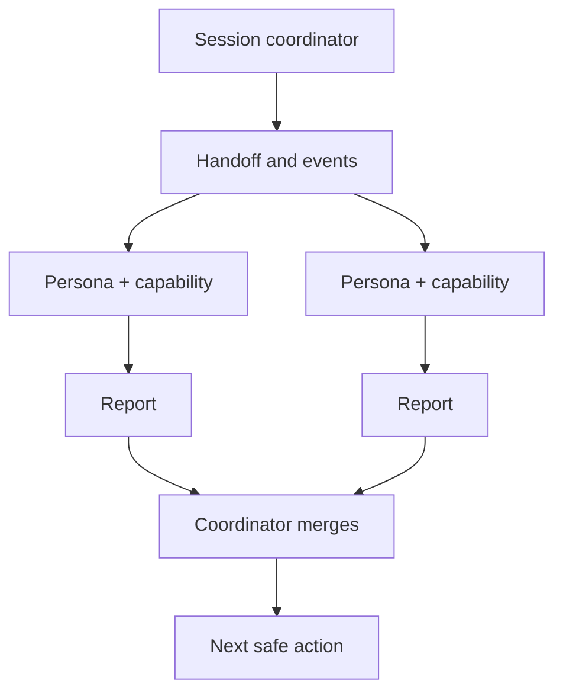

# Subagents And Personas

Subagent personas are **stateless capability packs** for delegated work. A skill is a procedure; a persona is a viewpoint, constraint set, and reporting style bound to a **named capability**.

The session **coordinator** (parent running `/sdd-*`) delegates personas; phase **executor** skills do the phase work. Bindings are defined **per phase** in each `sdd-<phase>/SKILL.md` and matching workflow/command — not in a central JSON registry.

**Delegate work, not responsibility.**

## Source of truth

| Artifact | Purpose |
| --- | --- |
| `.agents/skills/_shared/sdd-persona-delegation.md` | Protocol: dispatch rules, hard gates, return fields, capability catalog |
| `.agents/skills/sdd-<phase>/SKILL.md` | **Phase bindings** — required/optional invocations for that phase |
| `.agents/workflows/sdd-<phase>.md` | Command/workflow mirror of the same bindings |

There is **no** persona-board command family and **no** central persona registry file.

## Persona catalog

| ID | Hard gate? | Capabilities (keys) |
| --- | --- | --- |
| `kvasir` | No | `codebase-recon`, `external-evidence-gap` |
| `mimir` | No | `bootstrap-readiness`, `architecture-coherence` |
| `thor` | No | `execution-feasibility`, `implementation-enforcement` |
| `tyr` | **Yes** | `spec-compliance`, `tasks-readiness` |
| `heimdall` | **Yes** | `security-review`, `release-gate` |
| `frigg` | No | `ux-clarity`, `content-quality` |
| `loki` | No | `assumption-stress-test`, `risk-acceptance` |
| `bragi` | No | `structured-artifacts`, `spec-quality` |
| `vidar` | No | `root-cause-analysis`, `regression-prevention` |

Descriptions: `sdd-persona-delegation.md`.

## Phase bindings (where to look)

| Phase | Skill / workflow |
| --- | --- |
| `init` | `sdd-init` |
| `explore` | `sdd-explore` |
| `propose` | `sdd-propose` |
| `spec` | `sdd-spec` |
| `design` | `sdd-design` |
| `tasks` | `sdd-tasks` |
| `apply` / loop apply | `sdd-apply` |
| `verify` | `sdd-verify` |
| `archive` | `sdd-archive` |
| `diagnose` | `sdd-diagnose` |
| Full pipeline | `sdd-brainstorm` (orchestrator; defers to step skills) |

Each file has a **Norse persona invocations (coordinator)** section with required/optional rows.

## Agent prompts

`.cursor/agents/<persona>.md` (and mirrors: `.opencode/agents/`, `.github/agents/`, …). Coordinator default on some surfaces: `odin.md` (name only — not owner of every phase).

## How to delegate

1. Read `sdd-persona-delegation.md`.
2. Open the active phase skill/workflow; run required invocations (and applicable optional/`when` rows).
3. One subagent = one persona + one capability; output `.skillgrid/tasks/research/<change-id>/<persona>-<capability>.md`.
4. Merge in coordinator; update handoff/events per `skillgrid-handoff.md`.

## Hard gates and return contract

- **Tyr** / **Heimdall** critical → block until resolved, risk-accepted, or HITL.
- Unresolved critical conflict → HITL.
- User owns release/destructive decisions.

Persona subagents add to the SDD envelope: `persona`, `capability`, `findings_severity`, `hitl_required`.

## Related reading

- `05-commands-reference.md` — SDD commands
- `02-workflow-usage.md` — main workflow
- `09-multi-agent-work.md` — delegation model
