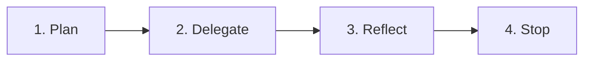

# SDD Ralph Loop

The **SDD Ralph loop** is Skillgrid’s native implementation of the [Ralph pattern](https://ghuntley.com/ralph/): run the same bounded workflow repeatedly with **fresh agent context** each time, persisting memory only through **files and git**, not chat history.

It is **not** a dependency on [PortableRalph](https://github.com/aaron777collins/portableralph), [snarktank/ralph](https://github.com/snarktank/ralph), or [ralph-tui](https://ralph-tui.com) — those are related tools you may use alongside Skillgrid (see [External tools](19-external-tools.md)). This document describes Skillgrid’s `/sdd-loop` command and `.skillgrid/scripts/sdd-ralph-loop.sh` driver only.

**Canonical workflow (for agents):** `.agents/workflows/sdd-loop.md`  
**Command reference (summary):** [Commands reference — `/sdd-loop`](05-commands-reference.md#sdd-loop-change-name)

---

## Why a loop at all

Long autonomous chats suffer **context rot**: the model forgets constraints, repeats mistakes, and blurs scope. Ralph fixes that by treating each iteration as a **new instance** that re-reads:

- What tasks remain (`tasks.md`)
- What happened last time (`ralph-loop-state.md`, `progress.txt`, git log)
- What the specs require (`openspec/changes/<name>/…`)

Skillgrid adds SDD gates, `[Label: AFK]` / `[Label: HITL]` discipline, and a dedicated **implementation worker** (`/sdd-apply`) so the loop controller never writes product code.

---

## `/sdd-loop` vs `/sdd-apply`

| | `/sdd-loop` | `/sdd-apply` |
|---|---|---|
| **Role** | Ralph loop orchestrator | Implementation worker |
| **Writes application code** | No | Yes |
| **Tasks per invocation** | Exactly **one** `[Label: AFK]` task | All remaining tasks (default), or **one** task when called from the loop |
| **Agent context** | Fresh each `/sdd-loop` | One session until done or blocked |
| **Typical use** | AFK continuation, one slice at a time | Bulk implementation in a single session |
| **AFK bash driver** | `.skillgrid/scripts/sdd-ralph-loop.sh` | — |

**Rule:** If you are editing product code inside `/sdd-loop`, you are in the wrong command.

---

## One iteration (four phases)

Each `/sdd-loop` call runs **one** iteration only. It does **not** chain multiple `/sdd-apply` calls in the same turn.



| Phase | What happens |
|--------|----------------|
| **Plan** | Run `sdd-gate.sh apply`; read `tasks.md` and loop state; pick **one** highest-priority incomplete `[Label: AFK]` task (respect dependencies). |
| **Delegate** | Invoke `/sdd-apply <change>` with an explicit prompt: implement **only** that task line; run checks; commit; return envelope. |
| **Reflect** | Append iteration to `ralph-loop-state.md` and `progress.txt`; update handoff + event log. |
| **Stop** | If all AFK work is done → `<promise>COMPLETE</promise>` and suggest `/sdd-verify`. Else end and let the **next** `/sdd-loop` (or the bash driver) continue. |

---

## Prerequisites

Before starting a loop on a change:

1. **Planning done** — `openspec/changes/<name>/` has at least `tasks.md`, specs, and `design.md` (normally via `/sdd-brainstorm`).
2. **Tasks are loop-sized** — each AFK item should fit one context window ([snarktank/ralph](https://github.com/snarktank/ralph) “right-sized stories”: column + migration, not “build entire dashboard”).
3. **Labels** — implementable items use `[Label: AFK]`; human decisions use `[Label: HITL]` (never picked by the loop).
4. **Git repo** — commits are part of cross-iteration memory.
5. **Gates installed** (optional but recommended) — `install.sh` or `skillgrid install` can install `sdd-gate` pre-commit/pre-push hooks; see [Hooks and automation](08-hooks-and-automation.md).

---

## Cross-iteration memory

Each new agent instance only sees persisted artifacts:

| Path | Purpose |
|------|---------|
| `openspec/changes/<name>/tasks.md` | Source of truth — checkboxes and task labels |
| `openspec/changes/<name>/proposal.md`, `design.md`, `specs/**` | Scope and acceptance criteria |
| `.skillgrid/tasks/research/<name>/ralph-loop-state.md` | Iteration log: task, result, evidence, learnings, next candidate |
| `.skillgrid/tasks/research/<name>/progress.txt` | Short append-only human log (one line per iteration) |
| `.skillgrid/tasks/context_<name>.md` | Handoff / last slice summary |
| `.skillgrid/tasks/events/<name>.jsonl` | Append-only timeline |
| **Git history** | Commits from each `/sdd-apply` delegation |

Increment the iteration counter in `ralph-loop-state.md` on every `/sdd-loop` call.

### Example `ralph-loop-state.md` entry

```markdown
## Iteration 3
Time: 2026-05-19T14:30:00Z
Task: - [ ] Add JWT middleware [Label: AFK]
Result: completed
Commit: a1b2c3d

### Evidence
- Tests/checks: 12/12 unit tests passed; go test ./...
- Files: 4 files changed

### Learnings
- Auth middleware lives in internal/middleware; register in server.go

### Next candidate
- [ ] Protect /api/v1/* routes [Label: AFK]
```

---

## How to run the loop

### Manual (human-in-the-loop Ralph)

Run one iteration, review the commit and logs, then run again:

```text
/sdd-loop my-feature
```

Repeat until the agent outputs `<promise>COMPLETE</promise>` or you hit a HITL blocker.

This matches the [“ralph-once”](https://www.aihero.dev/getting-started-with-ralph) style: same prompt shape every time, you stay in control between runs.

### AFK (bash driver)

For multiple iterations without typing `/sdd-loop` each time:

```bash
.skillgrid/scripts/sdd-ralph-loop.sh <change-name> [max-iterations]
```

Defaults: `max-iterations=10`, agent CLI `claude`.

| Variable | Meaning |
|----------|---------|
| `SDD_RALPH_AGENT` | `claude` (default), `opencode`, or `cursor` |
| `SDD_RALPH_DRY_RUN` | If set, print what would run without calling the agent |

The script invokes one `/sdd-loop` iteration per loop, checks stdout for `<promise>COMPLETE</promise>` (or legacy `{COMPLETE}`), and exits early when the change is done.

Example:

```bash
export SDD_RALPH_AGENT=opencode
.skillgrid/scripts/sdd-ralph-loop.sh add-auth 20
```

---

## Completion and what happens next

When every implementable `[Label: AFK]` task in `tasks.md` is `[x]` and there are no unresolved blockers, the loop emits:

```text
<promise>COMPLETE</promise>
```

(on its own line — same convention as [snarktank/ralph](https://github.com/snarktank/ralph) and [Getting Started With Ralph](https://www.aihero.dev/getting-started-with-ralph)).

**Then:**

1. Run `/sdd-verify <change-name>` (spec compliance).
2. Run `/sdd-review` if your pipeline uses it.
3. Run `/sdd-archive <change-name>` when gates pass.

---

## Hard stops (loop must not continue)

| Condition | What to do |
|-----------|------------|
| Next task is `[Label: HITL]` | Stop loop; resolve with human; do not auto-apply |
| `sdd-gate.sh` or label validation fails | Fix artifacts; re-run `/sdd-loop` |
| `tyr` / `heimdall` critical finding | Resolve or dispatch personas per `sdd-verify/SKILL.md` + HITL |
| Iteration cap reached (default 10 per session) | Review state; resume later |
| Task too large for one window | Split in `/sdd-tasks`; do not force the loop |

The loop is **bounded autonomy**: small steps, evidence, gates — not an unbounded “dark factory.”

---

## Gates and hooks

Before delegating to `/sdd-apply`, the orchestrator runs:

```bash
.skillgrid/scripts/sdd-gate.sh apply --change <name>
```

Git hooks (when installed via `install.sh` / `skillgrid install`) can also enforce gates on commit/push for OpenSpec changes. See [Hooks and automation](08-hooks-and-automation.md).

---

## Delegation contract (loop → apply)

When `/sdd-loop` calls `/sdd-apply`, it must pass **single-task scope**, for example:

> Ralph loop iteration 3. Implement **only** this task from `tasks.md`:
>
> `- [ ] Add login handler [Label: AFK]`
>
> Run project quality checks, mark only this task `[x]`, commit, return the standard envelope.

`/sdd-apply` must not start other checklist items when invoked this way. See `.agents/workflows/sdd-apply.md`.

---

## Relationship to other “Ralph” tools

| Tool | Relationship to Skillgrid loop |
|------|--------------------------------|
| [PortableRalph](https://github.com/aaron777collins/portableralph) | Same *idea* (plan file + progress + bash loop); different files and prompts. Not bundled. |
| [snarktank/ralph](https://github.com/snarktank/ralph) | `prd.json` + `progress.txt` + `ralph.sh`; Skillgrid uses OpenSpec `tasks.md` + `ralph-loop-state.md`. |
| [ralph-tui](https://ralph-tui.com) | Separate orchestrator with beads/PRD trackers; see [External tools § ralph-tui](19-external-tools.md). Can complement SDD but does not replace `/sdd-loop`. |

---

## Troubleshooting

| Symptom | Likely cause | Action |
|---------|----------------|--------|
| Loop picks same task again | Task not marked `[x]` or apply failed silently | Read last `ralph-loop-state.md`; check git diff |
| Immediate `blocked` from gate | Invalid labels or missing artifacts | Run `sdd-gate.sh apply --change <name>` manually |
| Script exits after N with no COMPLETE | Max iterations or stuck tasks | Increase max; inspect `tasks.md` for HITL/blockers |
| `claude: command not found` | CLI not on PATH | Install Claude Code or set `SDD_RALPH_AGENT=opencode` |
| Loop implements code itself | Wrong command or prompt drift | Re-read `.agents/workflows/sdd-loop.md`; use `/sdd-apply` for code |

**Inspect state:**

```bash
# Remaining work (manual)
grep -E '^\s*- \[ \]' openspec/changes/<name>/tasks.md

# Loop history
cat .skillgrid/tasks/research/<name>/ralph-loop-state.md

# Recent commits
git log --oneline -10
```

---

## Further reading

- [Workflow usage — During implementation](02-workflow-usage.md#during-implementation)
- [Commands reference — `/sdd-loop`](05-commands-reference.md#sdd-loop-change-name)
- [Commands reference — `/sdd-apply`](05-commands-reference.md#sdd-apply-change-name)
- [Multi-agent work](09-multi-agent-work.md) — handoff and event conventions
- [Geoffrey Huntley — Ralph](https://ghuntley.com/ralph/)
- [Getting Started With Ralph](https://www.aihero.dev/getting-started-with-ralph)
