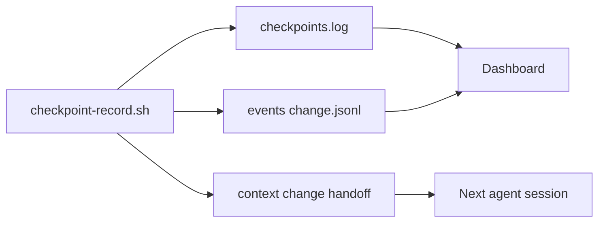

# Operational checkpoints (Tier 1)

Checkpoints record **safe resume points** for an active OpenSpec change on the **current git branch** in a **single working tree**. They are cheap, deterministic, and file-first — not session transcripts and not git worktrees.

Skillgrid uses **Tier 1** checkpoints today: one log line plus handoff and timeline updates. Full markdown milestone snapshots (Tier 2) are not implemented yet.

---

## What problem they solve

After context compaction, agent handoff, or a long `/sdd-loop` run, you need to know:

- Which git commit last matched a known-good workflow step?
- Which change and slice were active?
- Did verify pass before someone ran archive?

Checkpoints answer that without re-reading chat. They complement — but do not replace — handoff files, event logs, and research reports.

---

## Three artifacts per checkpoint

Each successful run writes **three** durable updates:



| Output | Path | Role |
|--------|------|------|
| **Index** | `.skillgrid/tasks/checkpoints.log` | Append-only list; dashboard parses all lines (newest first) |
| **Handoff** | `.skillgrid/tasks/context_<change-id>.md` | Replaces `## Last checkpoint` with name, SHA, time, trigger |
| **Timeline** | `.skillgrid/tasks/events/<change-id>.jsonl` | One JSON object with `node: "checkpoint"` |

If the handoff file does not exist yet, the script still writes the log and event and prints a warning for the missing handoff.

---

## When checkpoints run (SDD triggers)

Workflows and skills call the recorder at fixed gates. Coordinators should not skip these unless the gate itself failed.

| Trigger ID | Typical `--name` | Phase | When |
|------------|------------------|-------|------|
| `before-apply` | `before-apply` | `apply` | After `sdd-gate.sh apply` exits 0, **before any code edits** |
| `after-loop` | `after-loop-<N>` | `loop` | Each `/sdd-loop` reflect phase (after delegate/apply for that iteration) |
| `verify-pass` | `verify-pass` | `verify` | Verify verdict is **PASS** or **PASS WITH WARNINGS** |
| `pre-archive` | `pre-archive` | `archive` | After verification confirmed, **before** moving/merging OpenSpec folders |
| `handoff-create` | `handoff-create` | `handoff` | When `handoff-create.sh` is run with a **change-id** (4th argument) |

Integrated in:

- `.agents/workflows/sdd-apply.md` — `before-apply`
- `.agents/workflows/sdd-loop.md` — `after-loop`
- `.agents/workflows/sdd-verify.md` — `verify-pass`
- `.agents/workflows/sdd-archive.md` — `pre-archive`
- `.skillgrid/scripts/handoff-create.sh` — optional 4th arg `change-id`

Agent skill: [`.agents/skills/skillgrid-checkpoints/SKILL.md`](../.agents/skills/skillgrid-checkpoints/SKILL.md).

---

## How to record a checkpoint

### Shell script (canonical)

From the **repository root** (must be inside a git repo):

```bash
.skillgrid/scripts/checkpoint-record.sh \
  --change <change-id> \
  --name <label> \
  --trigger <trigger-id> \
  --phase <phase> \
  --evidence "<one-line summary>" \
  [--slice "<active task line>"] \
  [--prd <path>] \
  [--context <path>] \
  [--dry-run]
```

| Flag | Required | Description |
|------|----------|-------------|
| `--change` | yes | OpenSpec / Skillgrid change id (folder under `openspec/changes/`) |
| `--name` | yes | Short label stored in log and handoff (e.g. `before-apply`, `after-loop-3`) |
| `--trigger` | no | Trigger id for automation/filtering (defaults to `--name`) |
| `--phase` | no | SDD phase: `apply`, `loop`, `verify`, `archive`, `handoff`, … |
| `--slice` | no | Active task or slice line (quoted in log if it contains spaces) |
| `--evidence` | no | One-line summary; default: `checkpoint <trigger> on <branch>@<sha>` |
| `--prd` | no | PRD path; auto-detected from `.skillgrid/prd/PRD*.md` when omitted |
| `--context` | no | Handoff path (default: `.skillgrid/tasks/context_<change>.md`) |
| `--dry-run` | no | Print actions without writing |

**Exit codes:** `0` success, `1` usage error, `2` not a git repository, `3` script failure.

### Skillgrid CLI

Same behavior, resolved from the current git root:

```bash
skillgrid checkpoint --change my-feature --name before-apply --phase apply --evidence "apply gate passed"
skillgrid checkpoint --help
```

Requires `.skillgrid/scripts/checkpoint-record.sh` in the target repo (installed via hub / `skillgrid install`).

---

## Log line format (`checkpoints.log`)

One checkpoint per line. Fields are space-separated `key=value` tokens after an ISO-8601 timestamp.

**Example:**

```text
2026-05-19T14:30:00Z name=before-apply trigger=before-apply branch=feat/dashboard sha=a1b2c3d dirty=no change=dashboard-change prd=.skillgrid/prd/PRD01_dashboard.md context=.skillgrid/tasks/context_dashboard-change.md phase=apply evidence="apply gate passed"
```

**Common fields:**

| Field | Meaning |
|-------|---------|
| (first token) | UTC timestamp `YYYY-MM-DDTHH:MM:SSZ` |
| `name` | Checkpoint label |
| `trigger` | Trigger id (see table above) |
| `branch` | Current git branch |
| `sha` | Short commit SHA |
| `dirty` | `yes` or `no` (uncommitted changes) |
| `change` | Change id |
| `context` | Handoff file path |
| `prd` | Linked PRD path (when known) |
| `phase` | SDD phase |
| `slice` | Optional task/slice line |
| `evidence` | Human-readable summary — **use double quotes if the value contains spaces** |

**Parser rules** (dashboard and conventions):

- Lines starting with `#` are comments — ignored.
- First token must match `YYYY-MM-DDT…` or the line is skipped.
- At least one `key=value` field is required.
- Malformed lines are not shown in the UI.

---

## Handoff section

When `.skillgrid/tasks/context_<change-id>.md` exists, the script replaces the block under `## Last checkpoint`:

```markdown
## Last checkpoint

- `before-apply` — `a1b2c3d` @ 2026-05-19T14:30:00Z (trigger: `before-apply`)
- Log: `.skillgrid/tasks/checkpoints.log`
```

Template source: [`.skillgrid/templates/template-handoff-context.md`](../.skillgrid/templates/template-handoff-context.md).

---

## JSONL event shape

Appended to `.skillgrid/tasks/events/<change-id>.jsonl`:

```json
{
  "time": "2026-05-19T14:30:00Z",
  "changeId": "dashboard-change",
  "node": "checkpoint",
  "phase": "apply",
  "status": "completed",
  "checkpoint": "before-apply",
  "trigger": "before-apply",
  "sha": "a1b2c3d",
  "branch": "feat/dashboard",
  "dirty": "no",
  "summary": "checkpoint before-apply: apply gate passed",
  "artifacts": [".skillgrid/tasks/checkpoints.log", ".skillgrid/tasks/context_dashboard-change.md"],
  "prd": ".skillgrid/prd/PRD01_dashboard.md"
}
```

See [handoff and events](02-workflow-usage.md) and [`.agents/skills/_shared/skillgrid-handoff.md`](../.agents/skills/_shared/skillgrid-handoff.md) for the full event contract.

---

## Dashboard (Web UI)

The local dashboard reads `checkpoints.log` only (no live git calls).

| UI location | What you see |
|-------------|----------------|
| **Board** header stat | Total checkpoint count for the repo |
| **Issue detail** | Checkpoints filtered by `change`, `prd`, or `context` path |
| **Agents** tab | All checkpoints (with handoff logs and timeline) |

Start the UI: `skillgrid serve` (skillgrid-cli). Details: [Web UI](15-webui.md).

---

## Examples

**Before implementation (mandatory in `/sdd-apply`):**

```bash
.skillgrid/scripts/sdd-gate.sh apply --change auth-refactor
.skillgrid/scripts/checkpoint-record.sh \
  --change auth-refactor \
  --name before-apply \
  --trigger before-apply \
  --phase apply \
  --evidence "apply gate passed"
```

**After one Ralph loop iteration:**

```bash
.skillgrid/scripts/checkpoint-record.sh \
  --change auth-refactor \
  --name after-loop-2 \
  --trigger after-loop \
  --phase loop \
  --slice "2.1 Add JWT middleware [AFK]" \
  --evidence "iteration 2 completed; unit tests green"
```

**Handoff create with checkpoint:**

```bash
.skillgrid/scripts/handoff-create.sh full pause-auth "" auth-refactor
#                                                                      ^ change-id
```

---

## Relationship to other artifacts

| Artifact | Checkpoints vs it |
|----------|-------------------|
| `context_<change>.md` | Checkpoints update **Last checkpoint** only; handoff remains the full current-state doc |
| `events/*.jsonl` | Checkpoints add timeline rows; they do not replace phase/subagent events |
| `research/<change>/` | Long evidence stays in research files; `evidence=` is a one-line pointer |
| Git tags / branches | Checkpoints record SHA at a point in time; they do not create tags |
| Engram | Optional mirror of compact state; handoff + log remain authoritative in-repo |

---

## What is not included (yet)

- **Tier 2** milestone markdown files under `.skillgrid/tasks/checkpoints/<change-id>/`
- Automatic git tags or stashes
- Git worktrees or parallel lane checkpoints
- Full session capture (see external patterns like Orchestra `checkpointing` — Skillgrid stays change-scoped)

---

## Troubleshooting

| Symptom | Likely cause | Action |
|---------|----------------|--------|
| `find_prd_for_change: command not found` | Old script layout | Update `checkpoint-record.sh` from hub |
| Handoff not updated | No `context_<change>.md` | Create handoff first or pass `--context` |
| Dashboard shows no checkpoints | Empty or invalid log | Run recorder; ensure lines have ISO time + `key=value` |
| Evidence truncated in log | Unquoted spaces | Use `evidence="full phrase here"` |
| `Error: run inside a git repository` | Not in git root | `cd` to repo root |

---

## Related docs

- [Skillgrid logic — execution model](03-skillgrid-logic.md) — linear single-clone workflow
- [Workflow usage](02-workflow-usage.md) — handoff, events, journey vs destination
- [Commands reference — utility scripts](04-commands-reference.md#utility-scripts)
- [Skills — skillgrid-checkpoints](05-skills.md)
- [Web UI](15-webui.md)
