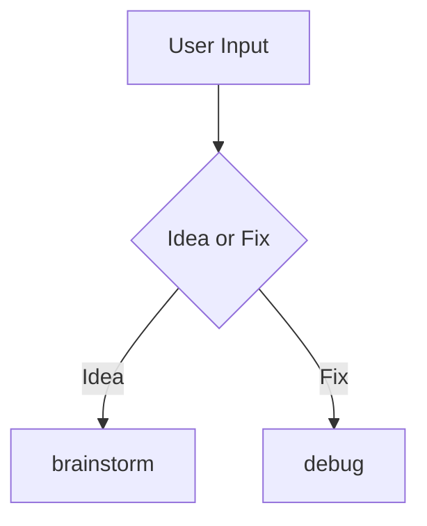

# Workflow

## Phases

* Idea
  * `brainstorm` -> `plan.md`
* Research
* Prototype
* Blueprint
* Breakdown
* Execute
* QA



## Skills

### Workflow Skills

* using-skillgrid
  * trigger workflow
  * make shure proper skill is triggered
  * (`using-superpowers`)

### Main Skills

* onboard
  * check onboard state
  * discowere and vaidate with user
  * generate `.skillgrid/config.yaml`
  * generate `AGENTS.md`

* brainstorm
  * Start a project -> `prd.md`
    * `questioning`
  * Add a new function -> `briefing.md`,`blueprint.md`
    * `questioning`

* specification
  * `deep-research`
  * `questioning`
  * update -> `blueprint.md`

* task
  * slice task to multiple phases
  * verticle slices
  * -> `tasks.md`
  * `create-tickets`

* execute
  * `simple-execution`
  * `subagent-execution`

* review
  * code review
  * security test
  * E2E test

* ship
  * `git-commit`
  * `git-create-pr`

### Helper Skills

* questioning
  * rigorus questionig to understand intent
  * (`grilling-with-docs`,`brainstorm`)

* deep-research
  * check code curreant status
  * reed `prd.md` and `architecture.md`
  * research options
  * propose options with pro/con/threat
  * -> `research.md`

* create-tickets

* simple-execution
  * human in the loop execution

* subagent-execution
  * AFK execution
  * `paralel-execution`

* paralel-execution

* isolated-workspace
  * create gitworkstees
  * if user asked

* git-commit

* create-pr

### Tool Skills

* archify
* memonic
* agent-browser
* playwright
* trivy

## Files

* Idea (Input)
  * Role: Your raw thoughts, voice transcripts, or rough feature lists.
* Product Brief (PB)
  * Role: The AI expands your idea into structured product requirements. It defines the User Value, Feature Scope, Success Metrics, and catches early logical edge cases.BlueprintRole: The AI translates the PB into a comprehensive technical design and structural plan. It maps out Data Models/Schemas, API Endpoints, System Architecture, and the step-by-step implementation strategy.
* User Stories (Output)
  * Role: The AI breaks down the Blueprint into small, atomic, and actionable task blocks formatted for developers or AI coding agents.

### File Structures

```bash
.skillgrid/
  config.yaml
  agents/
    grosery.md
  archive/
    001-function/
  spec/
    002-function/
      briefing.md
      blueprint.md
      research.md
      acceptance.feature
      tasks.md

docs/
  prd.md
  architecture.md
```

### File Formats

```yaml
# .skillgrid/config.yaml
---
schema: skillgrid-sdd/v1
project: <project-name>
issue_tracker:
  name: <backlog.md|github|gitlab|jira>
  workflow: ["todo","inprogress","done"]
technology:
  language: <programing-language>
  framework: <coding-framework>
testing:
  runner: <how-to-run-test>
  layers: [<list>,<of>,<tests>]
  coverage: <min-60-optional-80-100>
  tdd: <true|false>
  bdd: <true|false>
```

```markdown
# Product Brief: [Feature/Project Name]

## 1. Executive Summary
* **Objective:** [A 1-2 sentence description of what this feature is and why it matters.]
* **Problem Statement:** [What specific pain point or user problem does this solve?]
* **Target Audience:** [Who are the primary users of this feature?]

## 2. Core Requirements & Scope
### In-Scope (Must-Haves)
* **[Requirement 1]:** [Description of the user capability.]
* **[Requirement 2]:** [Description of the user capability.]

### Out of Scope (Nice-to-Haves / Deferred)
* **[Deferred Feature 1]:** [What we are explicitly NOT building in this version.]

## 3. User Experience & Core Workflows
### Happy Path Workflow
1. User navigates to...
2. User triggers action by...
3. System responds by displaying...

### Edge Cases to Handle
* [Edge Case 1: e.g., Network timeout / Empty state behavior]
* [Edge Case 2: e.g., Invalid input validation]

## 4. Success Metrics (KPIs)
* [e.g., Feature adoption rate > 40% within month 1]
* [e.g., Reduction in user checkout drop-offs by 15%]
```

```markdown
# Technical Blueprint: [Feature/Project Name]

## 1. System Architecture Overview
* **High-Level Approach:** [Brief explanation of how this integrates into the existing codebase/infrastructure.]
* **Component Diagram:** 

`[ User Client ] ---> [ API Gateway / Backend Route ] ---> [ Database / Cache ]`

## 2. Data Models & Schema Design
### New/Modified Tables or Collections
#### Table: `users_tokens` (Example)

| Field Name | Type | Constraints | Description |
| :--- | :--- | :--- | :--- |
| `id` | UUID | Primary Key, Default: uuid_generate_v4() | Unique identifier |
| `user_id` | UUID | Foreign Key (users.id), NOT NULL | References the user |
| `created_at`| Timestamp| DEFAULT: NOW() | Audit timestamp |

## 3. API & Interface Specifications
### Endpoints
#### `POST /api/v1/feature-action`
* **Description:** Initiates the core action from the user interface.
* **Authentication:** Required (Bearer JWT)
* **Request Body (JSON):**
```json
{
"action_type": "string",
"payload": {}
}
```
* **Response (200 OK):**
```json
{
"success": true,
"data": { "status": "processed" }
}
```

## 4. Implementation Strategy & Technical Constraints
* **Dependencies:** [Third-party packages, external APIs, or libraries required]
* **Security & Performance:** [Rate limiting, encryption needs, or database indexing strategies]
* **Migration Plan:** [Steps needed to deploy or update data structures safely]
```

-----------------------------------------------

## other workflows

* programing lop
  * write est
  * execute
  * `unlazy`
  * validate test
  * validate intent
  * 5 iteration
* secure coding
* Cross-Modell Review
  * `adhd`
* strategic programing 
* secure by design programing
* smar-dum side max 40% of contex
* `prototype`
* `codebase-design`

```yaml
# superpowers
* using-superpowers
* brainstorming
* writing-plan
* execution
  * TDD
  * Subadgent-driven-development
* verification

# GSD

# gstack

# cole medin
* plan-create-prd
* plan-architecture
* piv-slice-epic
* prime-codepase
    * prime-frontend
    * prime-backend
* priv-plan-implementation
* priv-implement
* priv-validate
* priv-review
```