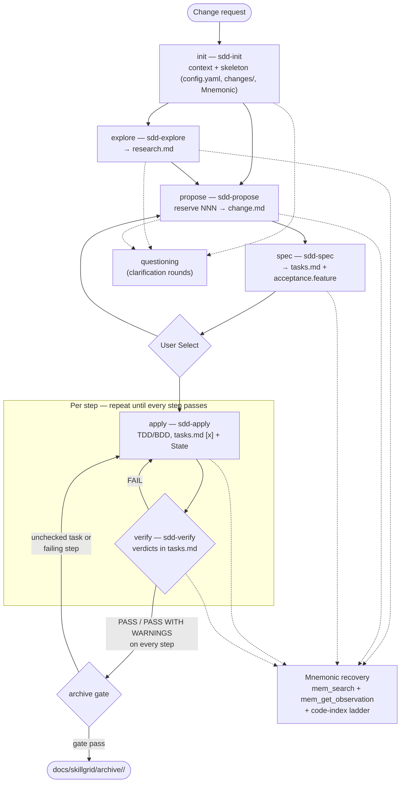

# skillgrid SDD Plan

Spec Driven Development Workflow using `Markdown` structure as spec source and selectable (GitHub, GitLab, Jira, Backlog.md) ticketing system. `Backlog.md` is the default tracker. It uses `Mnemonic` for long-term memory and code indexing.

## skillgrid SDD Workflow (v3)

```
init → explore → propose → spec → apply → verify → archive
```

**Entry skill:** `use-skillgrid` (`.agents/skills/use-skillgrid/SKILL.md`) — no platform hook. Uninitialized (`docs/skillgrid/config.yaml` missing) → `sdd-init`; else → `sdd-explore` then down the pipeline; user gate after `sdd-spec` before apply.

* init:
    * `sdd-init`
        * Check `AGENTS.md` or `CLAUDE.md` exists. Search `project_name`, `tech_stack`, `testing_capabilities`, `issue_tracker`
        * Check `docs/skillgrid/config.yaml` exists. Search `project_name`, `tech_stack`, `testing_capabilities`, `issue_tracker`
        * Check Mnemonic. Read `project_name`, `tech_stack`, `testing_capabilities`, `issue_tracker`
        * Check git repo - determine `project_name`, `issue_tracker`
        * Inspect project files (`package.json`, `go.mod`, `pyproject.toml`, CI, lint/test config) - determine `tech_stack`
        * Detect test runner, test layers, coverage, linter, type checker, and formatter - determine `testing_capabilities`
        * Validate findings with user
        * Initialize persistence:
            * Build skill registry at `docs/skillgrid/agents/skill-registry.md`
            * Agent config `AGENTS.md` or `CLAUDE.md`
            * `docs/skillgrid/` skeleton: `config.yaml`, `agents/`, `changes/`, `archive/`
            * Write Mnemonic observations
            * If `backlogmd` selected, initialize it too
* explore:
    * `sdd-explore` investigate
        * Read `docs/skillgrid/config.yaml` for project context (rules, context)
        * Recover Mnemonic context: `mem_search("sdd-init/{project}")` + `mem_get_observation`, `mem_search("sdd/<NNN-slug>/")`
        * Use code-index ladder: `code_status -> code_index -> code_search -> code_read`
        * Investigate entry points, affected modules, existing tests, patterns, dependencies/coupling
        * Analyze & compare approaches (pros/cons/complexity/effort matrix)
        * Persist artifact: `docs/skillgrid/changes/<NNN-slug>/research.md` + Mnemonic `sdd/<NNN-slug>/research` (`topic_key` upsert)
        * Return structured envelope (status, summary, artifacts, next, risks)
* propose:
    * `sdd-propose` — absorbs former `sdd-design` (one phase: WHY + HOW)
        * **Reserve the NNN change number** (scan `docs/skillgrid/changes/` + `archive/` + Mnemonic `sdd/{project}/changelog`, take `max+1`, zero-pad to 3 digits)
        * Recover context: `mem_search("sdd/<NNN-slug>/research")` + `mem_get_observation`, `sdd-init/{project}`, `docs/skillgrid/config.yaml`
        * Interactive only: intent question round (business/product, not delivery mechanics)
        * Read actual code via code-index ladder: `code_status -> code_index -> code_search -> code_read`
        * Write **`change.md`** by instantiating `.agents/skills/_shared/templates/template-change.md` (fill placeholders; do not invent a parallel outline): Business Problem, Target Users, Business Rules, Success Criteria, Scope, Rollback, **Step Blueprint**, Technical Approach, Architecture Decisions, Data Flow, **Impacted Files Map (Step column)**, Per-step WHAT, Threat Matrix, Migration/Open Questions, Glossary footer
        * Persist: `docs/skillgrid/changes/<NNN-slug>/change.md` + Mnemonic `sdd/<NNN-slug>/change` (`topic_key` upsert)
        * Append NNN reservation to `sdd/{project}/changelog` (Mnemonic)
        * Every change has rollback plan + success criteria; each applicable threat row names its owning step
* spec:
    * `sdd-spec` — absorbs former `sdd-tasks` (one phase: punch-lists + Gherkin)
        * **Own NN numbering**: for every Step Blueprint entry, allocate `NN-<name>`
        * Write **`tasks.md`** by instantiating `.agents/skills/_shared/templates/template-tasks.md`: `## State` + Step map + one `## NN-<name>` section per step (Goal, Files, Interfaces, Tasks, Verification stub)
        * Inherit applicable threat rows as `[RED]` tasks before production tasks; assign every Impacted Files row to exactly one step
        * Write **`acceptance.feature`** by instantiating `.agents/skills/_shared/templates/template-acceptance.feature`: one change-level file; one `Feature` per step tagged `@step-NN`; ≥1 `@happy` + `@edge` + `@failure`; every per-step WHAT bullet and applicable threat row → a scenario
        * Persist: `tasks.md` + `acceptance.feature` + Mnemonic `sdd/<NNN-slug>/tasks` and `sdd/<NNN-slug>/spec` (or single concatenated `…/spec` covering both)
* apply:
    * git-worktree
    * execute-task (per assigned step / task)
    * subagent-driven-development
    * TDD (Strict TDD or Standard per `docs/skillgrid/config.yaml` → `rules.apply.tdd`)
    * BDD (scenarios tagged `@step-NN` in `acceptance.feature`)
    * unlazy
    * Mark each `tasks.md` checkbox `[x]` as it completes; bump `## State`
    * Produce evidence into the step's upcoming verify slot (focused test, acceptance coverage, runtime harness, rollback boundary)
    * Persist cumulative apply-progress to Mnemonic `sdd/<NNN-slug>/apply-progress`
* verify:
    * For **every** `## NN-<name>` in `tasks.md`, fill `### Verification` with verdict `PASS | PASS WITH WARNINGS | FAIL`
    * Gate: every scenario tagged `@step-NN` maps to a passing test run at runtime
    * Strict TDD mode adds TDD Compliance, Assertion Quality, Test Layer, Changed-File Coverage, Quality Metrics under Evidence
    * Persist concatenated per-step reports to Mnemonic `sdd/<NNN-slug>/verification`
* archive:
    * Gate on every step's Verification verdict being `PASS` or `PASS WITH WARNINGS`; gate on no unchecked tasks in `tasks.md`
    * Mechanical shell move `docs/skillgrid/changes/<NNN-slug>/` → `docs/skillgrid/archive/<NNN-slug>/` (`git mv` or `mv`), mandatory `diff -r` readback (empty diff = pass)
    * Persist `archive-report` to Mnemonic `sdd/<NNN-slug>/archive-report` with observation IDs of every artifact read (lineage)

### Workflow Paths



* Happy path: `init → explore → propose → spec → apply → verify → archive`.
* Loop path: `verify` FAIL (or archive gate failure) sends work back to `apply` for the failing step — no renumbering of NN.
* Side paths: `questioning` rounds during init/explore/propose; Mnemonic + code-index recovery at any phase (survives compaction via `tasks.md` `## State` + Mnemonic topic keys).
* Retired phases: standalone `design` (`sdd-design`) and `tasks` (`sdd-tasks`) — folded into `propose` and `spec` respectively.

## File Structure

### Artifact File Structure

```bash
.backlog/
├── archive/
├── assets/
│   └── images/
├── completed/
├── decisions/
├── docs/
├── drafts/
├── milestones/
├── tasks/
├── config.yml
├── readme.md
docs/
└── skillgrid/
    ├── config.yaml                 # stack, context, rules per phase
    ├── agents/                     # Agent registry, tracker, shared vocabulary
    │   ├── skill-registry.md
    │   ├── issue-tracker.md
    │   ├── triage-labels.md
    │   └── glossary/               # SHARED VOCABULARY (glossary skill)
    │       ├── business.md
    │       └── technical.md
    ├── changes/                    # Active development branch/context
    │   └── <NNN-slug>/             # Specific change context (e.g., 001-oauth-login)
    │       ├── research.md         # SPIKE & FINDINGS
    │       ├── change.md           # WHY + HOW (intent+design merged); glossary inline
    │       ├── tasks.md            # State + all steps + verification slots
    │       ├── acceptance.feature  # All Features tagged @step-NN
    │       └── interview.md        # Optional questioning artifact
    └── archive/                    # HISTORICAL RECORD
        └── <NNN-slug>/             # Completed changes moved here after successful gates
```

### Glossary (folded into main files)

No companion `*-glossary-reference.md` files. When authoring `change.md` (or other artifacts), reuse or add terms in `docs/skillgrid/agents/glossary/{business,technical}.md` and define first-use inline or via a short `## Glossary` footer in the main file.

### Notes

* NNN = 3-digit zero-padded change number, reserved by `sdd-propose`. Never reused.
* NN = 2-digit zero-padded step number within a change, allocated by `sdd-spec`. Never renumbered after creation.
* Change-level files: `tasks.md` (spec → apply marks `[x]` → verify fills verdicts), `acceptance.feature` (spec). No `steps/` tree.
* Templates: `.agents/skills/_shared/templates/template-{change,tasks}.md` + `template-acceptance.feature` — mandatory source outline for generation (see `templates/README.md`).
* Archive is a **pure move** of the entire change folder — there is no "merge into main specs" step.
* Pre-v3 changes (`intent.md` + `plan.md` + `steps/<NN>/…`) remain valid history; new work uses v3 only.

### Sub-Agent Scratch Structure

```bash
.skillgrid/sdd/
└── <change-id>/
    ├── context/
    │   └── phase-input.md
    ├── phase-status/
    │   ├── init-status.md
    │   ├── explore-status.md
    │   ├── propose-status.md
    │   ├── spec-status.md
    │   ├── apply-status.md
    │   ├── verify-status.md
    │   └── archive-status.md
    ├── work-unit/
    │   ├── assignments.md
    │   └── results/
    └── progress/
        ├── task-progress.md
        └── evidence/
```

## Memory Topics (Mnemonic)

Always `hybrid` — persist to both Mnemonic and filesystem.

Cross-cutting primitives:
* `questioning` — questioning/clarification skill (classify + design tree, frontier, rounds, recommendations, approval gate) used by sdd-explore, sdd-propose, sdd-init. Persists to `sdd/<NNN-slug>/grill` (Mnemonic) and `docs/skillgrid/changes/<NNN-slug>/interview.md`.

```
sdd-init/{project}
sdd/{project}/issue_tracker
sdd/{project}/testing-capabilities
sdd/{project}/changelog
sdd/<NNN-slug>/research
sdd/<NNN-slug>/change          (replaces intent + plan)
sdd/<NNN-slug>/tasks           (tasks.md contents)
sdd/<NNN-slug>/spec            (acceptance.feature; may also cover tasks)
sdd/<NNN-slug>/issue-creation
sdd/<NNN-slug>/apply-progress
sdd/<NNN-slug>/verification    (verdicts from tasks.md)
sdd/<NNN-slug>/archive-report
```

## Ticketing

* Default tracker: **Backlog.md** (`backlogmd`)
* Selectable: GitHub (`gh` CLI), GitLab (`glab` CLI), Jira (`jira` CLI), Backlog.md (`backlog` CLI)
* Tracker choice persisted to Mnemonic `sdd/{project}/issue_tracker` during `sdd-init`
* Conventions in `_shared/issue-tracker/`; triage labels in `_shared/triage-labels.md`
* Backlog.md storage: `.backlog/tasks/<ID>.md` (set `backlog_directory: .backlog` in `backlog.config.yml`)
* `issue-creation` skill maps tasks → tracker issues; duplicate-search first

## Skill update backlog

v3 skill pass complete. Entry skill **`use-skillgrid`** added (agent-invoked; no hook). Legacy change folders `001`–`006` remain on pre-v3 layout until explicitly migrated.
