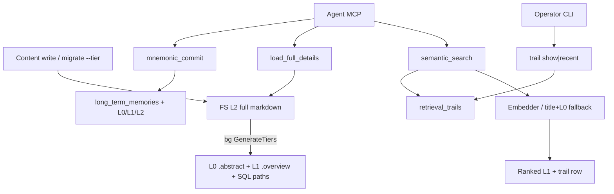

# Change: 003-mnemonic-self-evolving-context-database — Mnemonic Self-Evolving Context Database

> **STATUS:** `draft` (2026-09-04)
>
> **For agentic workers:** REQUIRED: follow `.agents/skills/_shared/conventions/sdd-structure.md`. This file is WHY + HOW (former intent + plan). Spec phase instantiates `tasks.md` + `acceptance.feature` from the Step Blueprint and per-step WHAT below.
>
> **Migration note:** Question round already satisfied by legacy `intent.md` / `plan.md` / `docs/plan/03-mnemonic-self-evolving-context-database.md` plus user approval (2026-09-04). This `change.md` folds those answers; do not re-interview.

**Goal:** Upgrade Mnemonic from flat full-token loads to tiered L0/L1/L2 storage, semantic retrieval, explicit session compaction, and trail observability — without rewriting Go MCP + SQLite+FS.

**Architecture:** Keep Go MCP + SQLite+FS hybrid. Add a deep `tiered` module (Generate/Read/Register + non-blocking content-write seam), a Pure Go `Embedder` behind `MNEMONIC_EMBED`, retrieval tools that default to ranked L1 with trail logging, and explicit `mnemonic_commit` into long-term memories. No `009_*` collision with 001 — this change uses `010_*`. Prefer after **002** (reuse vector helpers); teams completion hook wires later when **001** lands.

**Tech stack:** Go (`skillgrid-cli`), SQLite (`modernc.org/sqlite`), MCP (`mcp-go`), FS sidecars (`.abstract` / `.overview`), optional Pure Go embeddings behind `MNEMONIC_EMBED` (local preferred; remote API optional).

**Research:** none (legacy intent/plan + `docs/plan/03-mnemonic-self-evolving-context-database.md`)

**Ticket:** `none`

**Depends on:** Prefer after `002-mnemonic-identity-and-parity` (embeddings / vector helpers). Teams completion-hook wiring after `001-open-sessions-agent-teams` when present — not a hard start gate for schema/FS/retrieval.

---

## Goal

Agents get overview-first recall with full detail on demand, operators can inspect retrieval trails when recall fails, and durable long-term memory is written only via explicit commit — all on the existing Go MCP + SQLite+FS stack.

## Out of scope / Non-Goals

- OpenCode plugin integration
- Python embedding service (Option B)
- Rewriting FTS5, the code index, or the web research cache
- Cloud sync
- Auto-commit on every session end (only explicit `mnemonic_commit`; auto only as a future 001 completion hook)
- Tiering every `mem_save` (only team-task briefs/outputs + tier-eligible content-write seam)
- Hard UAT token-% targets (behavioral UAT only)

## Definition of Done

This change is done only when **all** of the following are true:

- [ ] Tier-eligible writes create `.abstract` (L0) + `.overview` (L1) and path columns without blocking the L2 write
- [ ] `skillgrid migrate --tier` backfills L0/L1 without corrupting L2
- [ ] `semantic_search` returns ranked L1 (with abstracts) and records a retrieval trail
- [ ] `load_full_details` returns L2 markdown for a search path
- [ ] `mnemonic_commit` writes long-term memory with L0/L1/L2 and optional source link
- [ ] `skillgrid trail show|recent` shows query, directories, files, and result path
- [ ] Existing `mem_*` / `code_*` / `web_*` tools remain registered and unchanged in contract
- [ ] Every Step Blueprint entry has a matching section in `tasks.md` with Verdict `PASS` or `PASS WITH WARNINGS`
- [ ] Every `@step-NN` Feature in `acceptance.feature` has passing `@happy`, `@edge`, and `@failure` scenarios
- [ ] Applicable threat-matrix rows have RED coverage that passed
- [ ] Testing strategy commands below are green
- [ ] Rollback path below is still valid (or N/A documented)
- [ ] Change archived under `docs/skillgrid/archive/003-mnemonic-self-evolving-context-database/`

---

## Problem / why

Mnemonic is flat: full-token loads, fragmented search, no durable compaction, and opaque retrieval. Agents burn context on L2 every time; operators cannot see which directories/files a recall touched. Urgency is high — this builds on **002** (embeddings) and optionally **001** (teams) without waiting on a full rewrite.

## Target users

- **Agent** — overview-first recall; full details on demand
- **Operator** — inspect directories/files when recall fails
- **Urgency:** High — flat loads and opaque trails are daily friction for every Mnemonic consumer

## Business rules

- Modules only; keep Go MCP + SQLite+FS hybrid (no rewrite)
- Pure Go embeddings (Option A); no Python service. Feature-flag provider — offline local preferred, external API optional
- Additive SQL only; content on FS with path columns
- Default search returns L1; L2 only via `load_full_details`
- Compaction: team-task briefs/outputs (001) + tier-eligible seam — not every `mem_save`
- `mnemonic_commit` explicit first; auto only as 001 completion hook — not every session end
- Auto-tiering must not block writes
- SQL numbering: leave `009_*` for 001; this change ships `010_*`
- OpenCode plugin deferred; UAT behavioral (no hard token-%); glossary terms defined in this change

## In scope

- Schema: tier paths, `long_term_memories`, `retrieval_trails`, `path_embeddings` (`010_*`)
- Tiered FS + `migrate --tier` + background content-write hooks
- MCP: `semantic_search`, `load_full_details`, `mnemonic_commit`
- Trail logging + `skillgrid trail` CLI

## Risks & rollback

- **Risk:** Summarization cost/latency — **Mitigation:** Background hooks; `migrate --tier`; test stubs/heuristic Summarizer
- **Risk:** Couples to teams (001) — **Mitigation:** Generic `tiered_contents` + content-write seam; wire teams briefs when 001 lands
- **Risk:** Embedding quality — **Mitigation:** Feature-flag; title+L0 fallback when flag off or empty
- **Risk:** Large multi-step change drifts — **Mitigation:** Five vertical steps; each demoable alone; DoD is UAT-measurable
- **Rollback:** Remove new migrations (`010_*`), MCP tools, CLI (`migrate` / `trail`), and tiered/embedder helpers. L2 content stays; drop `.abstract`/`.overview` sidecars if needed. Existing DBs that already applied migrations keep additive tables (harmless if callers stop using them).

## Error handling

| Failure | Behavior | Notes |
|---------|----------|-------|
| Migration fails mid-way | `abort` | Prior observations, FTS, and code index remain readable |
| Summarizer failure during tier generation | `warn+continue` | L2 intact; failure logged; no partial corrupt sidecars as success |
| Embedder unavailable / `MNEMONIC_EMBED` off | `warn+continue` | Title/L0 fallback ranking; trail still recorded |
| `load_full_details` unknown path | `abort` | Clear not-found; no invented content |
| `mnemonic_commit` missing required sources | `abort` | Clear error; no partial `long_term_memories` row |
| Empty retrieval trails store | `warn+continue` | `trail recent` returns empty list, not error |
| Unknown trail id | `abort` | not-found for `trail show` |
| Content-write hook / background tiering | `warn+continue` | Never block the L2 write path |

## Testing strategy

- **Unit:** `Run: go test ./skillgrid-cli/internal/mnemonic/store/ ./skillgrid-cli/internal/mnemonic/tiered/ ./skillgrid-cli/internal/mnemonic/embedder/ ./skillgrid-cli/internal/mnemonic/memory/ ./skillgrid-cli/internal/mnemonic/service/` — Expected: PASS
- **Integration / acceptance:** `Run: go test ./skillgrid-cli/internal/mnemonic/mcp/ ./skillgrid-cli/cmd/skillgrid/ ./skillgrid-cli/internal/mnemonic/integration/` plus BDD `@step-NN` scenarios in `acceptance.feature` — Expected: PASS (`@step-01`…`@step-05` / `@p0`)
- **Full suite:** `Run: go test ./...` (from repo root / `skillgrid-cli` per module layout) — Expected: PASS
- **Green means:** Tier sidecars + migrate, L1-default search with trails, explicit commit, and trail CLI behave per DoD; existing `mem_*` contracts unchanged

---

## Step Blueprint

Contract for `sdd-spec`. Do not renumber after `tasks.md` exists. Per-step Out of scope / DoD live under Per-step WHAT (table is summary only).

| NN | Step slug | Goal (one line) | Primary package / entry | Depends on |
|----|-----------|-----------------|-------------------------|------------|
| 01 | `schema-extensions` | Additive SQL for tier paths, long-term memories, trails, embeddings | `skillgrid-cli/internal/mnemonic/store/migrations` | — |
| 02 | `tiered-storage` | L0/L1/L2 FS, tiered module, `migrate --tier`, background hooks | `skillgrid-cli/internal/mnemonic/tiered` | 01 |
| 03 | `semantic-retrieval` | Pure Go embeddings + search/load tools + trail logging | `skillgrid-cli/internal/mnemonic/mcp` | 02 |
| 04 | `session-compaction` | Explicit `mnemonic_commit` → long-term memories with tiers | `skillgrid-cli/internal/mnemonic/service` | 03 |
| 05 | `trail-observability` | `skillgrid trail show\|recent` CLI | `skillgrid-cli/cmd/skillgrid` | 04 |

---

## Technical approach

Add **Tiered Storage**, **Semantic Search**, compaction into **Long-term Memory**, and **Retrieval Trail** on Go MCP + SQLite+FS. After **002**, reuse vector helpers / `MNEMONIC_EMBED`. No **001** tables yet: generic `tiered_contents` + content-write **Seam**; wire teams briefs when 001 lands. SQL at `010_*` (001 keeps `009_*`). No OpenCode plugin; Pure Go embeddings; UAT behavioral.

## Architecture decisions

### Decision: Generic tier registry

**Module / Interface / Seam / Adapter / Depth:** Module = `tiered`; Interface = Generate/Read/Register; Seam = content-write; Adapter = FS+SQL; Depth = deep
**Choice:** `tiered_contents` + `{path}.abstract` / `.overview` sidecars
**Alternatives considered:** `ALTER tasks` now; tier every `mem_save`
**Rationale:** 001 absent; intent limits compaction to team-task + tier-eligible seam

### Decision: Pure Go embedder behind flag

**Module / Interface / Seam / Adapter / Depth:** Module = embedder; Interface = `Embedder.Embed`; Seam = real; Adapter = Local + RemoteAPI; Depth = deep
**Choice:** Option A; `path_embeddings`; reuse 002 blob/cosine helpers
**Alternatives considered:** Python service; always-on remote
**Rationale:** Intent; title/L0 floor when flag off

### Decision: Explicit commit + async tiering

**Module / Interface / Seam / Adapter / Depth:** Module = compaction; Interface = commit; Seam = 001 completion-hook (future); Adapter = stub/heuristic Summarizer; Depth = deep
**Choice:** Explicit `mnemonic_commit`; auto only as 001 hook; non-blocking `GenerateTiers`
**Alternatives considered:** Every session end; sync LLM inline
**Rationale:** Locked assumptions; latency via background + `migrate --tier`

### Decision: L1-default search with trail

**Module / Interface / Seam / Adapter / Depth:** Module = retrieval tools; Interface = search/load; Seam = trail logger; Adapter = SQLite; Depth = deep
**Choice:** Ranked L1 (+ L0); L2 only via `load_full_details`; log **Retrieval Trail**
**Alternatives considered:** Return L2; defer trails
**Rationale:** Tokens + operator debug

## Data flow



## File layout

```
skillgrid-cli/
├── cmd/skillgrid/
│   ├── main.go                 # Dispatch migrate + trail
│   ├── migrate.go              # runMigrate --tier
│   └── trail.go                # trail show|recent
└── internal/mnemonic/
    ├── store/migrations/
    │   └── 010_tiered_context.sql
    ├── tiered/
    │   ├── tiered.go           # Generate/read L0/L1/L2 + register
    │   ├── summarizer.go       # Summarizer interface + adapters
    │   └── hook.go             # Non-blocking ContentWriteHook
    ├── embedder/
    │   └── embedder.go         # Embedder + local/remote adapters
    ├── memory/
    │   └── embedding.go        # Shared Vector/blob/cosine with 002
    ├── service/
    │   ├── service.go          # Search/load/trail facade
    │   └── compaction.go       # Commit → long_term_memories
    └── mcp/
        ├── server.go           # Register retrieval + compaction
        ├── tools_retrieval.go  # semantic_search, load_full_details
        └── tools_compaction.go # mnemonic_commit
```

## Impacted files map

| File | Action | Step | Description |
|------|--------|------|-------------|
| `skillgrid-cli/internal/mnemonic/store/migrations/010_tiered_context.sql` | Create | 01 | `tiered_contents`, `long_term_memories`, `retrieval_trails`, `path_embeddings` |
| `docs/skillgrid/agents/glossary/technical.md` | Modify | 01 | Tiered Storage / Semantic Search / Retrieval Trail terms (apply-time; not edited in this migration) |
| `docs/skillgrid/agents/glossary/business.md` | Modify | 01 | Long-term Memory term (apply-time; not edited in this migration) |
| `skillgrid-cli/internal/mnemonic/tiered/tiered.go` | Create | 02 | Generate/read L0/L1/L2 |
| `skillgrid-cli/internal/mnemonic/tiered/summarizer.go` | Create | 02 | Summarizer **Interface** + adapters |
| `skillgrid-cli/internal/mnemonic/tiered/hook.go` | Create | 02 | Non-blocking content-write **Seam** |
| `skillgrid-cli/cmd/skillgrid/migrate.go` | Create | 02 | `runMigrate` (`--tier`) |
| `skillgrid-cli/internal/mnemonic/embedder/embedder.go` | Create | 03 | Embedder + local/remote adapters |
| `skillgrid-cli/internal/mnemonic/memory/embedding.go` | Modify | 03 | Share vector helpers with embedder |
| `skillgrid-cli/internal/mnemonic/service/service.go` | Modify | 03 | Search/load/trail facade |
| `skillgrid-cli/internal/mnemonic/mcp/tools_retrieval.go` | Create | 03 | `semantic_search`, `load_full_details` |
| `skillgrid-cli/internal/mnemonic/mcp/tools_compaction.go` | Create | 04 | `mnemonic_commit` |
| `skillgrid-cli/internal/mnemonic/service/compaction.go` | Create | 04 | Commit → `long_term_memories` |
| `skillgrid-cli/internal/mnemonic/mcp/server.go` | Modify | 04 | Register retrieval + compaction |
| `skillgrid-cli/cmd/skillgrid/trail.go` | Create | 05 | `trail show\|recent` |
| `skillgrid-cli/cmd/skillgrid/main.go` | Modify | 05 | Dispatch migrate + trail |

Verified present today: migrations through `008_*.sql`; `cmd/skillgrid/main.go`; `internal/mnemonic/{store,memory,mcp,service}` including `memory/embedding.go`. Not yet present (expected Create): `tiered/`, `embedder/`, `migrate.go`, `trail.go`, `010_*.sql`, retrieval/compaction tool files.

## Per-step WHAT

Observable behavior each step must deliver (feeds Gherkin). Not implementation HOW.

### Step 01 — `schema-extensions`

**Goal:** Additive SQL for tier paths, long-term memories, trails, embeddings
**Out of scope:** FS sidecars, MCP tools, CLI
**Definition of Done:** Store open creates tier/memory/trail/embedding tables without rewriting existing rows; migrate 008→010 is idempotent

- As operator: store open creates tier/memory/trail/embedding tables without rewriting existing rows
- Given existing DB, when migrate runs, observations/FTS/code index stay intact
- Edge: schema 008 → 010 once; re-open idempotent
- Failure: failed migration leaves prior data intact

### Step 02 — `tiered-storage`

**Goal:** L0/L1/L2 FS, tiered module, `migrate --tier`, background hooks
**Out of scope:** Semantic search tools, compaction, trail CLI
**Definition of Done:** Content-write seam yields sidecars without blocking; migrate backfills; summarizer failure preserves L2

- As writer via content-write seam: L2 save later yields L0/L1 sidecars + path columns without blocking
- Given L2 files, `skillgrid migrate --tier` backfills L0/L1; L2 unchanged
- Edge: summarizer failure leaves L2 intact; error logged

### Step 03 — `semantic-retrieval`

**Goal:** Pure Go embeddings + search/load tools + trail logging
**Out of scope:** `mnemonic_commit`, trail CLI
**Definition of Done:** Search returns ranked L1 only; load returns L2; embeddings-off fallback still records trail

- As agent: `semantic_search` returns ranked L1 (with abstracts), not L2
- Given a result path, `load_full_details` returns L2 markdown
- Edge: embeddings off/empty → title/L0 fallback; trail still recorded
- Failure: unknown path rejects full-detail load
- **Threat (Mnemonic tool surface):** `semantic_search` body is L1-only; L2 only via `load_full_details`

### Step 04 — `session-compaction`

**Goal:** Explicit `mnemonic_commit` → long-term memories with tiers
**Out of scope:** Trail CLI; auto-commit on session end
**Definition of Done:** Explicit commit persists L0/L1/L2; session end alone does not write; missing sources abort cleanly; `mem_save` still registered

- As agent: `mnemonic_commit` persists **Long-term Memory** with L0/L1/L2 and optional source link
- Session end alone does not auto-commit
- Edge: missing sources → clear error; no partial write
- **Threat (Mnemonic tool surface):** after registering new tools, existing `mem_save` remains registered and callable

### Step 05 — `trail-observability`

**Goal:** `skillgrid trail show|recent` CLI
**Out of scope:** New MCP tools; schema changes
**Definition of Done:** recent/show expose query paths; empty store lists nothing; unknown id is not-found

- As operator: `trail recent` / `trail show <id>` show query, directories, files, result path
- Empty store → empty list, not error
- Edge/failure: unknown id → not-found

## Threat matrix

Mark each row `Applicable` or `N/A: reason`. Applicable rows name an owning step and propagate into RED tasks + acceptance scenarios.

| Boundary / threat | Applicable? | Owning step | Planned RED coverage |
|-------------------|-------------|-------------|----------------------|
| Documentation-like paths | N/A: no executable classification | — | — |
| Git repository selection | N/A: no git cwd authority | — | — |
| Commit state | N/A: no git commit automation | — | — |
| Push state | N/A: no push automation | — | — |
| PR commands | N/A: no PR CLI | — | — |
| Mnemonic tool surface (`mem_*` / `code_*` / `web_cache_*`) | Applicable | 03 | `semantic_search` response body is L1-only (overview + abstract; no L2 markdown body); L2 reachable only via `load_full_details{path}` |
| Mnemonic tool surface (`mem_*` / `code_*` / `web_cache_*`) | Applicable | 04 | After registering new tools, existing `mem_save` remains registered and callable (additive-only; no `mem_*` contract break) |
| Shared-convention drift | N/A: no `_shared/conventions/*` edits this phase | — | — |

## Migration / rollout

- **Legacy supersession:** Legacy `intent.md`, `plan.md`, `*-glossary-reference.md`, and `steps/` were folded into this `change.md` plus change-level `tasks.md` + `acceptance.feature` and removed; **`change.md` is the source of truth**.
- Additive `010_*`; leave `009_*` for 001. `MNEMONIC_EMBED` (+ optional remote endpoint); local preferred.
- Backfill via `migrate --tier`; hooks for new writes.
- Prefer after 002; teams hook after 001.
- Source plan retained for history: `docs/plan/03-mnemonic-self-evolving-context-database.md` (not deleted).

## Open questions

- [ ] Local embedder library (onnxruntime-go vs hash-embedder stub) — pick in step 03; does not block schema/FS.

## Glossary

| Term | Definition | Glossary file |
|------|------------|---------------|
| **Change** | A self-contained SDD unit tracked by a 3-digit NNN number, authored as `change.md` through archive. | business |
| **Step** | A sequenced unit of an SDD change that ships one testable behaviour slice. | business |
| **Tiered Storage** | L0/L1/L2 filesystem layout plus SQL path columns for progressive recall. | technical |
| **Semantic Search** | Ranked L1 retrieval via embeddings with title/L0 fallback when embeddings are off or empty. | technical |
| **Retrieval Trail** | Logged directories, files, query, and result path for each semantic search. | technical |
| **Long-term Memory** | Durable compacted memory persisted by explicit `mnemonic_commit` with L0/L1/L2 paths. | business |
| **Module** | Anything with an interface and an implementation; scale-agnostic. | technical |
| **Interface** | Everything a caller must know to use a module correctly (e.g. Summarizer / Embedder / ContentWriteHook). | technical |
| **Seam** | The location at which a module's interface lives (content-write and embedder seams). | technical |
| **Adapter** | A concrete implementation behind an interface (local/remote embedder; heuristic/stub summarizer). | technical |
| **Depth** | How much a module hides behind its interface; deep modules preferred for tiered + retrieval. | technical |
| **Topic Key** | Stable string used to upsert Mnemonic observations (`sdd/003-…/{change,tasks,spec}`). | technical |
| **Artifact Store Mode** | Persistence contract for SDD artifacts; `hybrid` (filesystem + Mnemonic) only. | technical |

<!-- Fold new terms here; also upsert docs/skillgrid/agents/glossary/{business,technical}.md at apply-time. No companion *-glossary-reference.md. -->

## Author self-review

- [x] **Goal**, **Out of scope / Non-Goals**, and **Definition of Done** are filled and testable
- [x] **Error handling** and **Testing strategy** are filled
- [x] Non-goals match Global Constraints that will appear in `tasks.md`
- [x] Rollback plan is present
- [x] Step Blueprint covers a vertical-slice sequence (no horizontal-only layers)
- [x] Every Impacted Files row maps to exactly one step
- [x] Every applicable threat row names an owning step
- [x] Glossary terms reused or defined; no companion reference file
