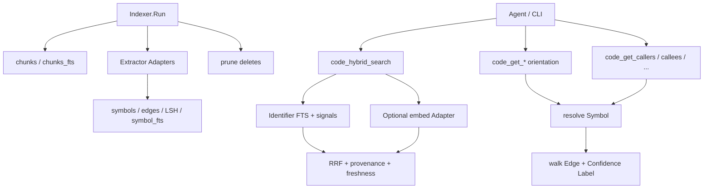

# Change: 005-mnemonic-hybrid-code-intelligence — Mnemonic Hybrid Code Intelligence (Foundation Slice)

> **STATUS:** `draft` (2026-09-04)
>
> **For agentic workers:** REQUIRED: follow `.agents/skills/_shared/conventions/sdd-structure.md`. This file is WHY + HOW (former intent + plan). Spec phase instantiates `tasks.md` + `acceptance.feature` from the Step Blueprint and per-step WHAT below.
>
> **Migration note:** Question round already satisfied by legacy `intent.md` / `plan.md` / `docs/plan/07-nmemonic-hybid-search.md` plus prior SDD approval. This `change.md` folds those answers; do not re-interview. Later plan-07 tiers (communities, git impact, 42 tools, 30+ languages) remain later Changes.

**Goal:** Turn Mnemonic's chunk-FTS code index into a foundation hybrid/graph code-intelligence slice (symbols, edges, identifier FTS, Tier-1/2 tools, offline RRF) so agents navigate and blast-radius without burning tokens on grep/read loops.

**Architecture:** Additive SQLite schema (`011_hybrid_code_intel`) plus an Extractor Module hooked into `Indexer.Run` in the same transaction as chunks. Identifier-Aware FTS and graph resolve feed Tier-1/2 `code_*` MCP/CLI tools. Hybrid ranker fuses FTS + deterministic signals (+ optional embeddings behind a Null Adapter default) via RRF with per-signal provenance. Existing `code_status` / `code_index` / `code_search` / `code_read` stay name- and signature-stable.

**Tech stack:** Go (`skillgrid-cli`), SQLite (`modernc.org/sqlite`, CGo-free), FTS5 `unicode61`, MCP (`mcp-go`); optional code embedder Adapter (off by default).

**Research:** none (legacy intent/plan + `docs/plan/07-nmemonic-hybid-search.md`)

**Ticket:** `TASK-005`

**Depends on:** Prefer after `002-mnemonic-identity-and-parity`; orthogonal to `003-mnemonic-self-evolving-context-database` (shared embeddings OK; memory `semantic_search` must stay distinct)

---

## Goal

Coding agents and operators get queryable Symbols and Edges, Identifier-Aware FTS, orientation and call-graph tools, and offline Hybrid Search with provenance — without changing existing chunk `code_*` contracts or requiring embeddings online.

## Out of scope / Non-Goals

- Full plan-07 platform: 42 tools, communities/impact, git-diff analysis, documents, `graph.sqlite.zst`, fsnotify watcher
- Languages beyond Go / TypeScript / TSX; CGo tree-sitter extractors in this Change
- Replacing `chunks` / `chunks_fts` or renaming existing `code_status` / `code_index` / `code_search` / `code_read`
- Memory rewrite (Changes 002–004); cloud sync; clash with memory `semantic_search` (003) via bare plan-07 tool names
- Requiring ONNX / bundled nomic-embed-code to ship the foundation slice

## Definition of Done

This change is done only when **all** of the following are true:

- [ ] Go/TS/TSX sources yield queryable Symbols and Edges after incremental `code_index`
- [ ] Identifier-Aware FTS finds camelCase/snake_case symbols that chunk `code_search` misses
- [ ] MCP/CLI: signature, file TOC, callers, callees, dependents (and related Tier-2 views) for a known symbol
- [ ] Hybrid Search ranks with per-signal provenance and works with embeddings off
- [ ] Existing `code_search` name + required `query` schema unchanged; `go test ./...` passes for touched packages
- [ ] One malformed file does not fail the index run (fallback + continue)
- [ ] Every Step Blueprint entry has a matching section in `tasks.md` with Verdict `PASS` or `PASS WITH WARNINGS`
- [ ] Every `@step-NN` Feature in `acceptance.feature` has passing `@happy`, `@edge`, and `@failure` scenarios
- [ ] Applicable threat-matrix rows have RED coverage that passed
- [ ] Testing strategy commands below are green
- [ ] Rollback path below is still valid (or N/A documented)
- [ ] Change archived under `docs/skillgrid/archive/005-mnemonic-hybrid-code-intelligence/`

---

## Problem / why

Mnemonic code index is "better grep": fixed 80-line chunks + trigram FTS miss identifiers, cannot answer callers/callees, and lack hybrid ranking. Agents burn tokens on grep/read loops. Store + sync + MCP already exist; srclight / codegraph / codebase-memory-mcp show the product gap. This Change owns **code** intelligence only (not memory Changes 002–004).

## Target users

- **Coding agent** — navigate / blast-radius before edits; high urgency
- **Operator** — CLI parity for the same orientation and graph/hybrid commands

## Business rules

- First product slice only; later plan-07 tiers = later Changes
- Additive SQL; keep `code_search` / `code_index` / `code_read` / `code_status` name + signature
- CGo-free (`modernc.org/sqlite`); per-project store; content-hash (+ mtime) sync
- No clash with memory `semantic_search` (003); all new tools use distinct `code_*` names
- Graph + FTS offline without embeddings; embeddings pluggable (Null Adapter default)
- Per-file extract failure → fallback + continue (never abort the whole index run)
- Every Edge carries Confidence Label: `EXTRACTED | INFERRED | AMBIGUOUS`
- Migration id `011_hybrid_code_intel.sql` — leave `009`/`010` for 001/003

## In scope

- Schema: symbols, edges, symbol FTS, embeddings/embed_meta, LSH, Index Freshness
- Extractor Interface + Tier-1 Go/TS/TSX + regex fallback + incremental graph index hook
- Tier-1 orientation + Tier-2 graph tools (callers/callees/dependents/implementors/hierarchy/tests)
- Hybrid core: identifier FTS + signal subset + pluggable embeddings + RRF/v1 + `code_hybrid_search` / `code_semantic_search` / `code_embedding_status`

## Risks & rollback

- **Risk:** Scope expands into full 12-week plan-07 platform — **Mitigation:** Hard Out of Scope; four vertical steps only
- **Risk:** Clash with memory semantic search — **Mitigation:** Distinct `code_*` names; RED locks on tool surface
- **Risk:** False edges / extract quality — **Mitigation:** Confidence Labels; per-file fallback
- **Risk:** Embedding/ONNX binary size — **Mitigation:** Flag off; Null Adapter; offline FTS+signals ship criterion
- **Rollback:** Remove new migrations/tools/packages (`extract/`, `graph/`, `hybrid/`, orient/graph/hybrid MCP files); leave `files`/`chunks`/`chunks_fts` and existing `code_*` intact

## Error handling

| Failure | Behavior | Notes |
|---------|----------|-------|
| Primary language extract fails on one file | `warn+continue` | Regex fallback for that file; index run continues |
| Store open with new graph schema on existing DB | `warn+continue` | Additive migration; `files`/`chunks` intact; chunk search still works |
| Unknown / missing symbol for orient or graph query | `warn+continue` | Empty / not-found; no fabricated symbols or edges |
| Ambiguous edge resolution | `warn+continue` | Return edge with `AMBIGUOUS`; never silent drop |
| Bad / missing args on new `code_*` tools | `abort` | Clear validation error; do not invent defaults that invent hits |
| Embedder unavailable / down during hybrid or semantic | `warn+continue` | Degrade to FTS + signals; never hard-fail for missing embeddings |
| Existing `code_search` / `code_index` / `code_read` / `code_status` call | unchanged | Name + required params must not regress |

## Testing strategy

- **Unit:** `Run: go test ./skillgrid-cli/internal/mnemonic/extract/... ./skillgrid-cli/internal/mnemonic/codeindex/... ./skillgrid-cli/internal/mnemonic/store/... ./skillgrid-cli/internal/mnemonic/search/... ./skillgrid-cli/internal/mnemonic/graph/... ./skillgrid-cli/internal/mnemonic/hybrid/...` — Expected: PASS
- **Integration / acceptance:** `Run: go test ./skillgrid-cli/internal/mnemonic/mcp/... ./skillgrid-cli/internal/mnemonic/service/...` plus BDD `@step-NN` / `@p0` scenarios — Expected: PASS
- **Full suite:** `Run: go test ./...` (from `skillgrid-cli` / repo root per module layout) — Expected: PASS
- **Green means:** DoD UAT criteria hold under automated tests; new `code_*` tools registered and distinct from memory `semantic_search`; existing four `code_*` tools unchanged; one-malformed-file index path covered

---

## Step Blueprint

Contract for `sdd-spec`. Do not renumber after `tasks.md` exists. Per-step Out of scope / DoD live under Per-step WHAT (table is summary only).

| NN | Step slug | Goal (one line) | Primary package / entry | Depends on |
|----|-----------|-----------------|-------------------------|------------|
| 01 | `schema-extractors` | Additive schema + Extractor Module + Go/TS/TSX + indexer graph hook | `skillgrid-cli/internal/mnemonic/extract` | — |
| 02 | `identifier-fts-orientation` | Identifier-Aware FTS + Tier-1 orientation MCP/CLI; keep existing `code_*` stable | `skillgrid-cli/internal/mnemonic/search` | 01 |
| 03 | `call-graph-traversal` | Edge resolve + Confidence Labels + Tier-2 graph tools | `skillgrid-cli/internal/mnemonic/graph` | 02 |
| 04 | `hybrid-search-core` | Offline RRF hybrid + pluggable embedders + hybrid/semantic/status tools | `skillgrid-cli/internal/mnemonic/hybrid` | 03 |

---

## Technical approach

Add foundation Hybrid Search / graph atop the existing SQLite code index: additive `011_*` schema, Go + TS/TSX Extractors with regex fallback, Identifier-Aware FTS, Tier-1/2 `code_*` tools, and offline RRF (FTS + signals) with optional embeddings. Hook extract/prune into `Indexer.Run` in the same transaction so content-hash + mtime guards stay single-path. Preserve `code_status` / `code_index` / `code_search` / `code_read`. Do not contradict 002, 003 `semantic_search`, or 004.

## Architecture decisions

### Decision: Graph write Seam inside Indexer.Run

**Module / Interface / Seam / Adapter / Depth:** Seam at indexer write path
**Choice:** Hook extract/prune into `Indexer.Run` same transaction as chunks
**Alternatives considered:** Separate `graph-index` command
**Rationale:** Same hash+mtime guard; one `code_index` operator path; avoids dual-sync drift

### Decision: Extractor Module with language Adapters

**Module / Interface / Seam / Adapter / Depth:** Module + Interface + Adapter; Depth — small interfaces hide large impl
**Choice:** `Extract → FileGraph`; Go = `go/parser`; TS/TSX = pure-Go; regex fallback Adapter
**Alternatives considered:** CGo tree-sitter now
**Rationale:** CGo-free (modernc); richer Adapters can land in later Changes

### Decision: Identifier-Aware FTS tokenization

**Module / Interface / Seam / Adapter / Depth:** Adapter over FTS5
**Choice:** Pre-split camelCase/snake_case into FTS5 `unicode61`
**Alternatives considered:** Custom C tokenizer
**Rationale:** Works on modernc; meets UAT without CGo

### Decision: Tool naming for code intelligence

**Module / Interface / Seam / Adapter / Depth:** Interface at MCP/CLI surface
**Choice:** All new tools `code_*` (orient, graph, hybrid, semantic, embedding_status, index_status)
**Alternatives considered:** Plan-07 bare names (`hybrid_search`, etc.)
**Rationale:** No clash with 003 memory `semantic_search`

### Decision: Hybrid ranking and embeddings

**Module / Interface / Seam / Adapter / Depth:** Seam for embedder; Module for ranker
**Choice:** RRF of FTS + MinHash/LSH + proximity + TF-IDF + type/API; embed off by default (Null Adapter)
**Alternatives considered:** Require ONNX to ship
**Rationale:** Approved offline ship criterion; provenance always required

### Decision: Migration number

**Module / Interface / Seam / Adapter / Depth:** Store migration Seam
**Choice:** `011_hybrid_code_intel.sql`
**Alternatives considered:** Take `009`
**Rationale:** Leave `009`/`010` for Changes 001/003

## Data flow



## File layout

```
skillgrid-cli/internal/mnemonic/
├── store/migrations/011_hybrid_code_intel.sql   # symbols, edges, FTS, embed, LSH, freshness
├── extract/                                     # Extractor Interface + Go/TS/fallback
├── codeindex/indexer.go                         # same-tx graph extract/prune hook
├── search/symbol_fts.go                         # Identifier-Aware FTS
├── graph/resolve.go                             # Edge resolve + Confidence Label
├── hybrid/rank.go                               # signals + RRF + provenance
├── embedder/                                    # code-unit Adapter (Null default)
└── mcp/tools_code_{orient,graph,hybrid}.go      # Tier-1/2 + hybrid tools
```

## Impacted files map

| File | Action | Step | Description |
|------|--------|------|-------------|
| `skillgrid-cli/internal/mnemonic/store/migrations/011_hybrid_code_intel.sql` | Create | 01 | symbols, edges, symbol_fts, embeddings, embed_meta, lsh_buckets, index_freshness |
| `skillgrid-cli/internal/mnemonic/extract/extract.go` | Create | 01 | Extractor Interface + registry |
| `skillgrid-cli/internal/mnemonic/extract/go.go` | Create | 01 | Go Adapter |
| `skillgrid-cli/internal/mnemonic/extract/tsx.go` | Create | 01 | TS/TSX Adapter |
| `skillgrid-cli/internal/mnemonic/extract/fallback.go` | Create | 01 | Regex fallback |
| `skillgrid-cli/internal/mnemonic/codeindex/indexer.go` | Modify | 01 | Graph extract/prune hook |
| `skillgrid-cli/internal/mnemonic/search/symbol_fts.go` | Create | 02 | Identifier symbol search |
| `skillgrid-cli/internal/mnemonic/mcp/tools_code_orient.go` | Create | 02 | Tier-1 orientation tools |
| `skillgrid-cli/internal/mnemonic/service/service.go` | Modify | 02 | Orient facade (+03–04) |
| `skillgrid-cli/cmd/skillgrid/code_intel.go` | Create | 02 | CLI orient (+03–04) |
| `skillgrid-cli/internal/mnemonic/graph/resolve.go` | Create | 03 | Edge resolve + Confidence Label |
| `skillgrid-cli/internal/mnemonic/mcp/tools_code_graph.go` | Create | 03 | Tier-2 graph tools |
| `skillgrid-cli/internal/mnemonic/hybrid/rank.go` | Create | 04 | Signals + RRF + provenance |
| `skillgrid-cli/internal/mnemonic/embedder/` | Create | 04 | Extend 003 embedder for code units |
| `skillgrid-cli/internal/mnemonic/mcp/tools_code_hybrid.go` | Create | 04 | hybrid/semantic/embedding_status |
| `skillgrid-cli/internal/mnemonic/mcp/server.go` | Modify | 04 | Register new tool sets |
| `skillgrid-cli/cmd/skillgrid/main.go` | Modify | 04 | CLI dispatch |

## Per-step WHAT

Observable behavior each step must deliver (feeds Gherkin). Not implementation HOW.

### Step 01 — `schema-extractors`

**Goal:** Additive graph schema and language extractors so index runs produce queryable Symbols and Edges
**Out of scope:** Identifier FTS tools, graph traversal tools, hybrid ranking
**Definition of Done:** Store open creates graph/FTS/embed/freshness tables without rewriting `files`/`chunks`; Go/TS/TSX yield queryable Symbols/Edges; malformed file → fallback + continue

- After index, Go/TS/TSX files yield queryable Symbols and Edges
- Graph tables exist without rewriting files or chunks
- One malformed file uses fallback and the index continues

### Step 02 — `identifier-fts-orientation`

**Goal:** Identifier-Aware FTS and Tier-1 orientation so agents find symbols chunk search misses
**Out of scope:** Call-graph Tier-2 tools; hybrid/semantic ranking
**Definition of Done:** Identifier FTS finds camelCase/snake_case symbols; orientation (signature, TOC, map, list, metadata) works; unknown symbol → empty/not-found; `code_search` unchanged

- Identifier search finds symbols chunk `code_search` misses
- Orientation returns signature, file TOC, map, list, and symbol metadata
- Unknown symbol returns empty or not-found with no fabricated symbol
- `code_search` name and query schema stay unchanged; bad orient args are rejected clearly

### Step 03 — `call-graph-traversal`

**Goal:** Call-graph traversal with Confidence Labels for blast-radius before edits
**Out of scope:** Hybrid RRF; embedding Adapters; changing orientation contracts from 02
**Definition of Done:** Callers, callees, dependents, implementors, hierarchy, tests-for return edges each carrying a Confidence Label; ambiguity → `AMBIGUOUS` not silent drop

- Known symbol returns callers, callees, dependents, implementors, hierarchy, and tests-for
- Every edge carries a Confidence Label
- Ambiguous resolution returns `AMBIGUOUS` edges, not silent omission
- Unknown symbol graph query invents no edges

### Step 04 — `hybrid-search-core`

**Goal:** Offline hybrid code search with pluggable embeddings and provenance
**Out of scope:** Communities, git impact, watcher, requiring ONNX to ship
**Definition of Done:** `code_hybrid_search` ranks with per-signal provenance embeddings-off; semantic/status tools available; embedder down → degrade to FTS+signals; hybrid tool distinct from memory `semantic_search`

- Hybrid search ranks offline with per-signal FTS and signal provenance
- `code_semantic_search` and `code_embedding_status` are available
- Down embedder degrades to FTS and signals without hard-fail
- `code_hybrid_search` is distinct from memory `semantic_search`; `code_search` unchanged; bad args rejected

## Threat matrix

Mark each row `Applicable` or `N/A: reason`. Applicable rows name an owning step and propagate into RED tasks + acceptance scenarios.

| Boundary / threat | Applicable? | Owning step | Planned RED coverage |
|-------------------|-------------|-------------|----------------------|
| Documentation-like paths | N/A: no executable-file classification or doc-path execution | — | — |
| Git repository selection | N/A: no gitRoot / `-C` / worktree authority change | — | — |
| Commit state | N/A: no commit automation | — | — |
| Push state | N/A: no push automation | — | — |
| PR commands | N/A: no PR automation | — | — |
| **Mnemonic tool surface** | Applicable — new `code_*`; four existing unchanged; must ≠ memory `semantic_search` | 02, 04 | 02: `code_search` schema stable + orient tools registered + bad args rejected; 04: `code_hybrid_search` registered distinct + `code_search` still stable + bad hybrid/semantic args rejected |
| **Shared-convention drift** | N/A: no `_shared/conventions/*` edits in this Change | — | — |

## Migration / rollout

- Additive `011_hybrid_code_intel.sql`. Embeddings optional (Null Adapter default). No watcher / communities / documents / `graph.sqlite.zst`.
- Rollback drops new tools/packages/migration; chunk index stays.
- Default RRF weights tune in step 04; provenance always required. Local embedder choice (hash-stub vs ONNX) deferred to apply; Null Adapter unblocks UAT.

## Open questions

- Local embedder at apply: hash-stub vs ONNX — Null Adapter unblocks UAT either way
- Default RRF weights — tune in step 04; provenance always required

## Glossary

| Term | Definition | Glossary file |
|------|------------|---------------|
| **Hybrid Search** | Ranked fusion of FTS + deterministic signals + optional embeddings with per-signal provenance | technical |
| **Symbol** | Qualified-name graph unit (function, type, etc.) produced by an Extractor | technical |
| **Edge** | Typed symbol relation carrying a Confidence Label | technical |
| **Extractor** | Per-language producer of a FileGraph (symbols + edges) | technical |
| **Confidence Label** | `EXTRACTED \| INFERRED \| AMBIGUOUS` on every Edge | technical |
| **Index Freshness** | Path/result staleness metadata for code-intelligence results | technical |
| **Identifier-Aware FTS** | camelCase/snake_case token split into FTS5 for symbol lookup | technical |
| **Semantic Search** | Memory tool (`semantic_search`) stays distinct; code uses `code_semantic_search` | technical |

<!-- Fold new terms here; also upsert docs/skillgrid/agents/glossary/{business,technical}.md. No companion *-glossary-reference.md. -->

## Author self-review

- [x] **Goal**, **Out of scope / Non-Goals**, and **Definition of Done** are filled and testable
- [x] **Error handling** and **Testing strategy** are filled
- [x] Non-goals match Global Constraints that will appear in `tasks.md`
- [x] Rollback plan is present
- [x] Step Blueprint covers a vertical-slice sequence (no horizontal-only layers)
- [x] Every Impacted Files row maps to exactly one step
- [x] Every applicable threat row names an owning step
- [x] Glossary terms reused or defined; no companion reference file
