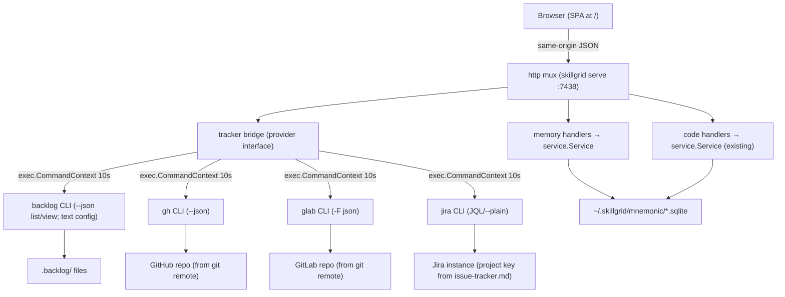

# Change: 009-web-admin-dashboard — Replan the Skillgrid Web Admin Dashboard

> **STATUS:** `draft` (2026-09-08; restructured to P1–P6 phased execution 2026-09-11)
>
> **For agentic workers:** REQUIRED: follow `.agents/skills/_shared/conventions/sdd-structure.md`. This file is WHY + HOW (former intent + plan). Spec phase instantiates `tasks.md` + `acceptance.feature` from the Step Blueprint and per-step WHAT below.
>
> **Migration note:** Question round already satisfied in-session (2026-09-08) — scope, delivery shape, frontend stack, existing-UI relationship, tracker bridge, and sessions-scope decisions are locked below; do not re-interview. Phased-execution restructure agreed 2026-09-11: six vertical slices P1–P6 (shell → tracker → docs-viewer → memory+governance → code → sessions+polish), each shipping its backend just-in-time; nothing is implemented yet (0 steps PASS), so the renumber from the old 01/02/03/04/04b/05 blueprint is safe.

**Goal:** Replace the minimal embedded data viewer with a full admin dashboard served by `skillgrid serve` at `/` — menu bar (Welcome, Tracker, Docs, Memory, Code, Sessions), tracker browser (Backlog.md / GitHub / GitLab / Jira via a pluggable bridge), docs viewer (change.md/tasks.md linked to tracker items), memory browser + governance views, code-index status, and sessions view — backed by new HTTP endpoints built just-in-time per phase.

**Architecture:** The existing `internal/mnemonic/http` server (Go 1.22 mux, `embed.FS` static serving at `/`) is extended: new read endpoints expose service methods that are today MCP-only (single observation, session list, session summary, pin/unpin), a new `tracker` bridge package shells out to the active tracker CLI (`backlog` / `gh` / `glab` / `jira` — resolved from `docs/skillgrid/agents/issue-tracker.md` + `config.yaml:issue_tracker` with `SKILLGRID_TRACKER` override, default `backlogmd`) behind normalized `/tracker/*` routes (`/backlog/*` kept as an alias when the active tracker is Backlog.md), and the embedded SPA under `internal/mnemonic/http/ui/` is rewritten in place (vanilla JS, no build step). All routes same-origin; write routes keep the existing bearer-token gate.

**Tech stack:** Go 1.22+ (`skillgrid-cli`), existing SQLite/MCP service layer (untouched), embedded static SPA (vanilla HTML/JS/CSS, `embed.FS`), tracker CLIs (shell-out: `backlog` / `gh` / `glab` / `jira` — JSON output where the CLI offers it, text parsed where it does not).

**Research:** `docs/skillgrid/changes/009-web-admin-dashboard/research.md` (UI pattern survey: Graphify-Labs/graphify, colbymchenry/codegraph, abhigyanpatwari/GitNexus — see "Adopted UI patterns" below) | `TencentCloud/TencentDB-Agent-Memory` (26.2k★) — control-panel model: asset library, agent loadout, layer drill-down, review workflow, RPC envelope (see 013 tencentdb-takeaways observation); the memory-governance/layer data these views render is provided by `013-mnemonic-layered-memory-governance`

**Prototype:** none

**Ticket:** none (to be created at spec/apply if `force_ticket_creation` fires)

**Depends on:** none (soft: 006-structured-session-handoff adds relay surfaces later — this change must not block on it)

---

## Goal

Operators can open `http://127.0.0.1:7438/` from a running `skillgrid serve` and administer all surfaces from one dashboard menu: a Welcome page, Tracker items on the repo's active tracker (Backlog.md, GitHub, GitLab, or Jira — auto-detected), SDD docs (change.md/tasks.md) linked to tracker items, Mnemonic memory (browse + governance), code-index health + search, and sessions + summaries — without leaving the browser and without a separate frontend process. Each phase P1–P6 is independently shippable: after any phase, the menu shows the shipped entries working and the not-yet-built entries as disabled stubs.

## Out of scope / Non-Goals

- Session relay / cleave handoff surfaces (change 006) — sessions tab shows what exists today; relay view lands when 006 ships
- New MCP tools — MCP tool names, signatures, and return shapes are frozen for this change
- Mutations other than what is listed in In scope — e.g. no tracker item *creation* (read + status change only)
- Authentication beyond the existing `SKILLGRID_HTTP_TOKEN` bearer gate on write routes; no login UI, no sessions/cookies
- CORS, remote hosting, or any non-127.0.0.1 serving story
- React/Next.js or any npm build pipeline in `skillgrid-cli` — the SPA stays build-less
- Changes to Mnemonic storage schema, indexing, or retrieval logic
- Redoing Swagger UI — `/swagger-ui` stays as-is
- Graph canvas visualization (vis.js/Sigma.js) — deferred to a follow-up change that depends on 005/008 edges; 009 ships a forward-compat placeholder in the Code tab only
- AI chat panel in the dashboard — the agent lives in the terminal; the dashboard is operator-facing, not an agent client
- **Multi-tenant teams / role layers / LLM proxy** — TencentDB's product-scale layer; 009 renders the single-operator governance (owner/visibility/usage) that 013 provides, not the multi-tenant machinery
- **Memory layering + governance data model** (L0–L3, owner, version, status, usage, visibility) — owned by `013-mnemonic-layered-memory-governance`; 009 **renders** those fields (asset library + layer drill-down + review + explicit share) and shows forward-compat placeholders where 013 has not landed yet

## Definition of Done

This change is done only when **all** of the following are true:

- [ ] `GET /` serves the new dashboard; menu bar (Welcome, Tracker, Docs, Memory, Code, Sessions) renders; Welcome page is static with links to `/swagger-ui` and `/openapi.yaml`
- [ ] Tracker menu entry: board grouped by the active provider's statuses, item detail view, and status-change action via the active tracker CLI; provider badge + banner; `/backlog/*` alias when tracker is Backlog.md
- [ ] Docs menu entry: change list, change.md + tasks.md viewer, tracker-ticket link both ways (tracker item → SDD docs, docs → tracker ticket id from `Ticket:`)
- [ ] Memory menu entry: search, observation detail view (full content via new endpoint), pin/unpin, soft-delete all work in-browser
- [ ] **Asset governance view** (renders 013 data; forward-compat placeholder if 013 not landed): owner / version history / status / retrieval usage / visibility on the observation detail; an **explicit share** action (`private`/`team`/`restricted`/`agent`); **editable in place** (correct an atom, not just delete-and-rebuild)
- [ ] **Layer drill-down** (renders 013 data; placeholder if not landed): the observation/session detail shows the L0→L1→L2→L3 chain with provenance links, lazy-loaded per layer
- [ ] **Review/approve affordance**: a memory's status (`active`/`superseded`/`archived`) is visible and changeable — the personal→shared gate is a UI action, not just a store field
- [ ] Tracker tab (labeled Backlog on Backlog.md repos): board grouped by the active provider's statuses, item detail view, and status-change action via the active tracker CLI (Backlog.md: `backlog task edit -s`; GitHub/GitLab: close/reopen; Jira: `issue move` where the workflow allows it, else 501 with reason); provider badge + banner names the active tracker; `/backlog/*` stays as an alias when the tracker is Backlog.md
- [ ] Code menu entry: index status (file/chunk counts, last indexed, stale flag), re-index action, BM25 search with expandable source view
- [ ] Sessions menu entry: session list with titles/started-at, recent context, session summaries
- [ ] Menu entries land one per phase (P1 Welcome → P2 Tracker → P3 Docs → P4 Memory → P5 Code → P6 Sessions); not-yet-built entries render as disabled stubs, never dead links
- [ ] `GET /openapi.yaml` and `/swagger-ui` still serve and reflect the new routes
- [ ] Adopted UI patterns implemented: "show numbers" table twin on every data widget, per-widget error isolation, freshness/completeness banners, query-first with suggested prompts, relation drill-down on observation detail
- [ ] New endpoints are covered by HTTP integration tests (happy + error per endpoint)
- [ ] Backlog bridge is covered by tests including CLI-missing and bad-JSON paths
- [ ] Every Step Blueprint entry has a matching section in `tasks.md` with Verdict `PASS` or `PASS WITH WARNINGS`
- [ ] Every `@step-NN` Feature in `acceptance.feature` has passing `@happy`, `@edge`, and `@failure` scenarios
- [ ] Applicable threat-matrix rows have RED coverage that passed
- [ ] Testing strategy commands below are green
- [ ] Rollback path below is still valid (or N/A documented)
- [ ] Change archived under `docs/skillgrid/archive/009-web-admin-dashboard/`

---

## Problem / why

`skillgrid serve` already runs a full HTTP API (:7438) and embeds a minimal data viewer (`internal/mnemonic/http/ui/index.html` + `app.js`, ~250 lines: mem/code/web tabs, no observation detail, no sessions, no backlog). The `docs/plan/02-future.md:42` webui wishlist (mnemonic memory visualization, include backlog browser, include opencode web) has never been planned as a change. In the meantime the API is missing the read surfaces a dashboard needs (single observation, session list, session summary, pin/unpin — all exist as service methods but only over MCP), and Backlog has zero HTTP exposure even though the `backlog` CLI already emits versioned JSON. Operators today switch between the CLI, MCP tools, and the backlog CLI to inspect one machine's state.

## Target users

- **Operator of a skillgrid-installed machine** — daily driver: "what did the agents remember / index / commit to the backlog, and can I clean it up?"
- **Agent (secondary)** — the JSON API + OpenAPI spec stays the machine-facing surface; the dashboard is human-facing

## Business rules

- The dashboard is read-mostly: mutations are limited to memory edits already available via API (pin/unpin/soft-delete/update) plus the **013 governance mutations** (in-place edit of an atom, explicit `mem_share` visibility change, status change) — gated on 013 landing; plus tracker **status change on the active provider** — nothing else mutates
- **013 is a soft dependency:** the governance + layer views render 013's fields when present and show a forward-compat placeholder (a labeled collapsed panel + the flat pre-013 view) when 013 has not landed — 009 must not block on 013, exactly like the graph-canvas placeholder blocks on 005/008
- Tracker mutations go through the active tracker's CLI (`backlog` / `gh` / `glab` / `jira`), never direct file writes and never invented statuses/labels (repository policy from `docs/skillgrid/agents/issue-tracker.md`)
- Tracker provider resolution: `docs/skillgrid/agents/issue-tracker.md` + `config.yaml:issue_tracker`, overridable at runtime with `SKILLGRID_TRACKER` (`backlogmd` | `github` | `gitlab` | `jira`, default `backlogmd`); the dashboard never guesses — an unresolvable tracker shows a disabled Tracker tab with reason
- The dashboard must degrade gracefully when the active tracker CLI is absent or unauthenticated (Tracker entry shows a disabled state with reason; other entries unaffected)
- Server stays bound to `127.0.0.1` by default; no new env vars for serving
- `GET /memory/project` keeps its current CWD-based behavior (quirk, not a regression — no change)

## In scope

- **New HTTP read endpoints** (service methods already exist, except the session-summary read which is a new store query — see step 01): `GET /observations/{id}`, `GET /sessions`, `GET /sessions/{id}/summary`, `POST /memory/observations/{id}/pin`, `POST /memory/observations/{id}/unpin`
- **New tracker bridge**: `internal/mnemonic/http/tracker` package — provider interface (`Config`, `List`, `Get`, `SetStatus`) with four shell-out adapters: `backlog` (`task list --json` / `task view <id> --json` / `task edit <id> -s <status>`; `config list` is text-only and parsed, never `--json`), `gh` (`issue list --json` / `issue view` / close+reopen), `glab` (`issue list -F json` / `issue view` / close+reopen), `jira` (`issue list -q JQL` / `issue view` / `issue move`): `GET /tracker/config`, `GET /tracker/tasks`, `GET /tracker/tasks/{id}`, `POST /tracker/tasks/{id}/status` (write-gated; provider-native semantics, 501 where the provider has no equivalent) + `/backlog/*` alias when tracker is Backlog.md
- **Dashboard SPA rewrite** at `internal/mnemonic/http/ui/` in six menu-first slices: P1 shell (menu bar, static Welcome, swagger passthrough) → P2 Tracker tab → P3 Docs tab → P4 Memory tab (+ governance views) → P5 Code tab → P6 Sessions tab; each phase adds its menu entry and leaves future entries as disabled stubs; project selector persists to localStorage (kept from current UI)
- **Docs viewer** (P3): read-only `docs` bridge serving `docs/skillgrid/changes/` + `archive/` (change list, change.md + tasks.md text, `Ticket:` link) sandboxed to those roots; Docs tab renders the files and links both ways to the Tracker tab
- **Control-panel views** (TencentDB model, rendering 013 data with forward-compat placeholders): a Memory **asset library** (browse/search with owner/version/status/usage/visibility metadata), an observation **layer drill-down** (L0→L3 chain, lazy-loaded), an **explicit share** action, **in-place edit** (correct, not delete+rebuild), and a **review/status** affordance. A read-only **agent loadout** view (which assets a named agent is equipped with) — the binding engine is a later change; 009 shows the equipping
- **OpenAPI spec** (`ui/openapi.yaml`) updated just-in-time per phase for that phase's routes; P6 verifies the whole spec + swagger-ui + user manual
- **Tests**: HTTP integration tests per new route (happy/edge/failure), tracker bridge tests per provider (CLI present/missing/bad-output/auth-failure paths), existing suite stays green

## Risks & rollback

- **Risk:** each tracker CLI is a separate external binary with its own auth (Backlog.md: Bun binary; `gh`/`glab`: host auth; `jira`: instance config + project key) — version drift, missing binary, or failed auth breaks the Tracker tab — **Mitigation:** bridge treats every CLI as an external dependency: missing binary → 503 with JSON reason, auth failure → 502 with reason, tab renders disabled state with provider name; Backlog.md output pinned to `--json` `schemaVersion` where JSON exists (`task list`/`task view`); `backlog config list` is text-only (no `--json`) and parsed defensively; `gh`/`glab` JSON filtered via `--json` field selection; Jira project key comes from `issue-tracker.md`, never guessed
- **Risk:** tracker status taxonomies do not match (Backlog.md custom statuses vs GitHub/GitLab open/closed vs Jira instance workflows) — **Mitigation:** normalized DTO carries provider-native `status` + `statusDetail`; `SetStatus` is provider-native (Backlog.md: `task edit -s` validated against config statuses; GitHub/GitLab: close/reopen; Jira: `issue move` with transition discovery) and returns 501 with reason where the provider has no equivalent; the UI only offers transitions the provider reports
- **Risk:** SPA rewrite regresses the current viewer (mem/code/web tabs) — **Mitigation:** P1 ships the shell with the old viewer untouched behind its routes; each phase replaces one surface at a time (vertical slices, each phase independently shippable; menu stubs mark what is not built yet)
- **Risk:** shell-out from a long-running HTTP server accumulates subprocess state — **Mitigation:** each call is a fresh `exec.CommandContext` with a 10s timeout; no shared CLI session
- **Risk:** 013 (memory governance/layer data) lands after 009 — the control-panel views would have nothing to render — **Mitigation:** 013 is a **soft** dependency; every 013-backed view (asset library metadata, layer drill-down, share, in-place edit, status) renders a forward-compat placeholder (labeled collapsed panel + the flat pre-013 view) when 013 is absent, exactly like the graph-canvas placeholder blocks on 005/008. 009 ships and is fully usable without 013
- **Risk:** the in-place edit / share mutations (step 04) write memory — a mis-click could corrupt a governed asset — **Mitigation:** write-gated (existing bearer token); the edit appends a 013 version (recoverable), not an overwrite; share is idempotent; a confirmation dialog on visibility change
- **Risk:** serving repo markdown files (P3 docs viewer) opens a path-traversal surface — **Mitigation:** reads sandboxed to `docs/skillgrid/changes/` + `docs/skillgrid/archive/` (clean + prefix-check, `..` and absolute paths → 400); read-only, no token needed for reads (same open-read policy); no file execution, render as text/markdown only
- **Rollback:** the change is additive to routes + progressive UI rewrite; revert the commit(s) up to any phase boundary and `skillgrid serve` returns to the previous state. No schema or config migration, so rollback is a plain git revert. (P4's governance views are pure UI over 013's API — reverting them leaves the flat Memory tab intact.)

## Error handling

| Failure | Behavior | Notes |
|---------|----------|-------|
| Active tracker CLI not on PATH (`backlog` / `gh` / `glab` / `jira`) | `warn+continue` | `GET /tracker/*` (and `/backlog/*` alias) → 503 `{error: "<cli> CLI not found", provider: "<tracker>"}`; dashboard renders disabled Tracker tab with provider name |
| Active tracker CLI exits non-zero, fails auth, or times out (>10s) | `warn+continue` | → 502 with CLI stderr excerpt (truncated 200 chars) + provider name |
| Tracker output not valid / unknown version (`backlog --json` bad JSON or unknown `schemaVersion`; `gh`/`glab` bad JSON; `jira` unparsable) | `warn+continue` | → 502 with reason; tab shows error state, no partial render |
| Tracker provider unresolvable (no `issue-tracker.md`, unknown `SKILLGRID_TRACKER`) | `warn+continue` | `GET /tracker/config` → 501 with reason; Tracker tab shows "tracker not configured" disabled state |
| Tracker status transition unsupported by provider | `warn+continue` | `POST /tracker/tasks/{id}/status` → 501 listing what the provider supports (e.g. close/reopen only) |
| Path traversal on `GET /docs/changes/{name}` (`..`, absolute path, symlink escape) | `abort` | 400 `{error: ...}`; only names under `docs/skillgrid/changes/` + `archive/` resolve |
| Unknown change name on `GET /docs/changes/{name}` | `abort` | 404 `{error: ...}` |
| Unknown observation id on `GET /observations/{id}` | `abort` | 404 `{error: ...}` |
| Unknown session id on `GET /sessions/{id}/summary` | `abort` | 404 |
| Invalid status on `POST /tracker/tasks/{id}/status` (not in the provider's statuses) | `abort` | 400 listing valid statuses (validated client-side too; Backlog.md: from `config list` text parse; Jira: from transition discovery) |
| Pin on already-pinned / unpin on non-pinned observation | `warn+continue` | idempotent 200 (service-level behavior preserved) |
| Write route called without token when `SKILLGRID_HTTP_TOKEN` is set | `abort` | 401 (existing `requireWriteAuth` behavior, unchanged) |

## Testing strategy

- **Unit:** `Run: go test ./skillgrid-cli/internal/mnemonic/http/...` — Expected: PASS
- **Integration / acceptance:** `Run: go test ./skillgrid-cli/internal/mnemonic/integration/...` — Expected: PASS (new per-route tests; `@step-NN` mapping in `acceptance.feature`)
- **Backlog bridge:** `Run: go test ./skillgrid-cli/internal/mnemonic/http/tracker/...` — Expected: PASS (fixture CLI per provider on PATH via temp dir; missing-binary + bad-output + auth-failure + timeout cases)
- **Full suite:** `Run: go test ./...` — Expected: PASS
- **Green means:** all new route tests + backlog bridge tests pass, existing http/integration tests unmodified-and-passing, `go vet ./...` clean, and a manual smoke (`skillgrid serve` + browser) passes the DoD list

---

## Step Blueprint

Contract for `sdd-spec`. Do not renumber after `tasks.md` exists. Per-step Out of scope / DoD live under Per-step WHAT (table is summary only).

| NN | Step slug | Goal (one line) | Primary package / entry | Depends on |
|----|-----------|-----------------|-------------------------|------------|
| 01 | `dashboard-shell` | Menu bar shell: static Welcome page, disabled stubs for future entries, swagger passthrough | `skillgrid-cli/internal/mnemonic/http/ui` | — |
| 02 | `tracker-tab` | Tracker bridge (4 CLI adapters) + Tracker menu entry (board, detail, status change) | `skillgrid-cli/internal/mnemonic/http/tracker` + `ui` | 01 |
| 03 | `docs-viewer` | Read-only docs bridge + Docs menu entry (change list, change.md/tasks.md, tracker-ticket link) | `skillgrid-cli/internal/mnemonic/http/docs` + `ui` | 01, 02 |
| 04 | `memory-tab` | Observation/pin/unpin endpoints + Memory menu entry (search, detail, actions, governance views) | `skillgrid-cli/internal/mnemonic/http` + `ui` | 01 |
| 05 | `code-tab` | Code menu entry on existing code routes (status, search, source view, graph placeholder) | `skillgrid-cli/internal/mnemonic/http/ui` | 01 |
| 06 | `sessions-tab` | Session list/summary reads + Sessions menu entry + OpenAPI/user-manual catch-up + full DoD smoke | `skillgrid-cli/internal/mnemonic/http` + `ui` | 01 |

---

## Technical approach

Six menu-first vertical slices, each independently shippable. First, the shell: menu bar with path-routed entries (Welcome live, the rest disabled stubs), a static Welcome page, and the existing `/swagger-ui` linked from the menu — no backend change, the old viewer stays reachable until its tab phase lands. Second, the Tracker slice builds the `tracker` bridge package (provider detection + four CLI adapters + normalized DTO) and the Tracker menu entry on top of it. Third, the Docs slice adds a tiny read-only `docs` bridge over `docs/skillgrid/changes/` + `archive/` and the Docs menu entry with two-way tracker links. Fourth, the Memory slice adds observation detail + pin/unpin endpoints and the Memory menu entry (search, detail, actions) plus the governance views (asset library, layer drill-down, share, in-place edit, status — 013-backed with forward-compat placeholders). Fifth, the Code slice needs no new backend (code routes already exist) and lands the Code menu entry. Sixth, the Sessions slice adds the session list/summary reads, the Sessions menu entry, and the OpenAPI/user-manual catch-up with the full DoD smoke. Every slice documents its own routes in `openapi.yaml` as it lands. The SPA adopts six UI patterns from a cross-tool survey (`research.md`): show-numbers table twin (codegraph), per-widget error isolation (codegraph), freshness/completeness banners (graphify + codegraph), query-first with suggested prompts (graphify), relation drill-down with confidence badges (graphify), and a forward-compat graph placeholder (GitNexus/graphify).

## Architecture decisions

### Decision: SPA stays embedded in the Go binary, vanilla JS, no build step

**Module / Interface / Seam / Adapter / Depth:** deep seam — `internal/mnemonic/http` exposes one `Handler()`; UI is a data adapter to it
**Choice:** Rewrite `internal/mnemonic/http/ui/` in place (vanilla HTML/CSS/JS, `embed.FS`, path routing with server fallback), served at `GET /`
**Alternatives considered:** (a) separate frontend app with dev server + CORS; (b) React/Next.js compiled to static and embedded
**Rationale:** (a) adds a second process and a CORS surface the API has no handling for; (b) adds an npm toolchain to a pure-Go repo with `go test ./...` as its only gate. The current UI already proves the embedded pattern works; the wishlist is about surfaces, not frameworks. The SPA is ~2–3k LOC of straightforward fetch-and-render — no framework needed.

### Decision: Tracker bridge shells out to the active tracker CLI behind a provider interface instead of parsing files

**Module / Interface / Seam / Adapter / Depth:** adapter — each CLI is the port adapter; the bridge is the boundary
**Choice:** `TrackerProvider` interface (`Config`, `List`, `Get`, `SetStatus`) with four shell-out adapters — `backlog` (`task list --json` / `task view <id> --json` / `task edit <id> -s <status>`; `config list` is text-only, parsed defensively), `gh` (`issue list --json` / `issue view` / close+reopen via labels), `glab` (`issue list -F json` / `issue view` / close+reopen), `jira` (`issue list -q JQL --plain` / `issue view` / `issue move`) — each `exec.CommandContext` with a 10s timeout; normalized DTO (`id/title/status/statusDetail/type/priority/assignees/labels/acProgress/isReady/updatedAt` + `provider`); provider resolved from `docs/skillgrid/agents/issue-tracker.md` + `config.yaml:issue_tracker` with `SKILLGRID_TRACKER` override (default `backlogmd`); never guessed
**Alternatives considered:** (a) parse `.backlog/tasks/*.md` + `config.yml` directly in Go; (b) native Go API clients per tracker; (c) backlog-only bridge with a follow-up change
**Rationale:** every tracker CLI is the documented single source of truth for its own semantics (Backlog.md statuses/labels/AC counts/`isReady`; GitHub/GitLab open/closed + labels; Jira workflows + project key) — parsing files or reimplementing APIs duplicates their rules and drifts, and duplicates auth the user already configured. (a) was already rejected for Backlog.md for the same reason; (b) adds credential plumbing for zero operator benefit; (c) contradicts the 4-tracker policy in `issue-creation` — the Tracker tab would be dead on arrival on any non-Backlog repo. Missing-CLI / auth-failure degradation is designed in (503/502 with provider name), so the dashboard never hard-depends on any binary.

### Decision: New routes extend the existing http package; one new session-summary read query

**Module / Interface / Seam / Adapter / Depth:** shallow extension on a deep seam
**Choice:** Add handlers in `internal/mnemonic/http` calling `memory.Get` (observation detail) and `memory.Pin`/`Unpin` (idempotent patch routes); add one new read query for the session list and one for the session summary (the existing `SessionSummary` method is the write path — it stores a summary — not the read; the read selects the `sessions` row); session listing reuses the `RecentContext` shape where possible
**Alternatives considered:** (a) new `web` package with its own DTO layer; (b) move UI + routes into a separate `skillgrid web` command
**Rationale:** the service already has observation detail + pin/unpin (confirmed: `memory/service.go:Get`, `memory/lifecycle.go:Pin/Unpin`); only the session-summary read is genuinely new. A second command would split the single-port serving story. If 007 (project handle facade) lands later, these handlers move with the rest of the package for free.

### Decision: Tracker status change is the only tracker mutation, with provider-native semantics

**Module / Interface / Seam / Adapter / Depth:** boundary rule on the adapter
**Choice:** `POST /tracker/tasks/{id}/status` (write-gated) dispatches to the provider: Backlog.md `task edit <id> -s <status>` validated against config statuses; GitHub/GitLab close/reopen (+ labels where offered); Jira `issue move` after transition discovery; 501 with reason where the provider has no equivalent; no create/update/delete
**Alternatives considered:** full CRUD via CLI
**Rationale:** the operator pain is unblocking/retriaging from the browser, not authoring items (which belong to the agent workflow via `issue-creation`). Smaller CLI-surface = smaller drift surface. Create/update stay CLI-only.

## Data flow



## File layout

```
skillgrid-cli/internal/mnemonic/http/
├── server.go                  # P2: mount /tracker/* (+ /backlog/* alias); P3: mount /docs/*; P4: observation/pin/unpin; P6: session list/summary
├── ui.go                      # unchanged (embed + GET / mount)
├── ui/
│   ├── index.html             # P1: shell + menu + Welcome; P2–P6: one menu entry each
│   ├── app.js                 # P1: path router + stubs; P2–P6: one tab module each
│   ├── app.css                # new in P1 (extracted from inline)
│   ├── favicon.png            # kept
│   ├── openapi.yaml           # extended just-in-time per phase (P2–P4, P6)
│   └── swagger/               # unchanged
├── tracker/
│   ├── tracker.go             # P2: provider interface + detection + DTO + handlers
│   ├── backlog.go             # P2: backlog adapter
│   ├── github.go              # P2: gh adapter
│   ├── gitlab.go              # P2: glab adapter
│   ├── jira.go                # P2: jira adapter
│   └── tracker_test.go        # P2: per-provider fixture-CLI tests
└── docs/
    ├── docs.go                # P3: sandboxed change-list/file readers + handlers
    └── docs_test.go           # P3: traversal-blocked + happy-path tests
```

## Impacted files map

| File | Action | Step | Description |
|------|--------|------|-------------|
| `skillgrid-cli/internal/mnemonic/http/ui/index.html` | Modify | 01 | shell + menu bar + static Welcome + disabled stubs |
| `skillgrid-cli/internal/mnemonic/http/ui/app.js` | Modify | 01 | path router, menu wiring, stub renderer |
| `skillgrid-cli/internal/mnemonic/http/ui/app.css` | Create | 01 | extracted styles |
| `skillgrid-cli/internal/mnemonic/http/tracker/tracker.go` | Create | 02 | Provider interface + detection + DTO + route handlers |
| `skillgrid-cli/internal/mnemonic/http/tracker/backlog.go` | Create | 02 | Backlog.md adapter |
| `skillgrid-cli/internal/mnemonic/http/tracker/github.go` | Create | 02 | GitHub adapter |
| `skillgrid-cli/internal/mnemonic/http/tracker/gitlab.go` | Create | 02 | GitLab adapter |
| `skillgrid-cli/internal/mnemonic/http/tracker/jira.go` | Create | 02 | Jira adapter |
| `skillgrid-cli/internal/mnemonic/http/tracker/tracker_test.go` | Create | 02 | Per-provider fixture-CLI tests + detection tests |
| `skillgrid-cli/internal/mnemonic/http/server.go` | Modify | 02 | mount `/tracker/*` routes + `/backlog/*` alias (read open, status write-gated) |
| `skillgrid-cli/internal/mnemonic/http/ui/openapi.yaml` | Modify | 02 | tracker routes + examples |
| `skillgrid-cli/internal/mnemonic/http/ui/index.html` | Modify | 02 | Tracker menu entry markup |
| `skillgrid-cli/internal/mnemonic/http/ui/app.js` | Modify | 02 | Tracker board/detail/status-change + provider badge/banner |
| `skillgrid-cli/internal/mnemonic/http/docs/docs.go` | Create | 03 | Sandboxed change-list/file readers + route handlers |
| `skillgrid-cli/internal/mnemonic/http/docs/docs_test.go` | Create | 03 | traversal-blocked + happy-path tests |
| `skillgrid-cli/internal/mnemonic/http/server.go` | Modify | 03 | mount `/docs/*` read routes (open) |
| `skillgrid-cli/internal/mnemonic/http/ui/openapi.yaml` | Modify | 03 | docs routes + examples |
| `skillgrid-cli/internal/mnemonic/http/ui/index.html` | Modify | 03 | Docs menu entry markup |
| `skillgrid-cli/internal/mnemonic/http/ui/app.js` | Modify | 03 | Docs change list/viewer + two-way tracker links |
| `skillgrid-cli/internal/mnemonic/http/server.go` | Modify | 04 | observation detail + pin/unpin routes |
| `skillgrid-cli/internal/mnemonic/integration/integration_test.go` | Modify | 04 | per-route happy/edge/failure tests for observation + pin/unpin |
| `skillgrid-cli/internal/mnemonic/http/ui/openapi.yaml` | Modify | 04 | memory routes + examples |
| `skillgrid-cli/internal/mnemonic/http/ui/index.html` | Modify | 04 | Memory menu entry + governance markup (asset library, drill-down, share/edit/status, loadout) |
| `skillgrid-cli/internal/mnemonic/http/ui/app.js` | Modify | 04 | Memory search/detail/actions + governance views (013-backed, placeholders when absent) |
| `skillgrid-cli/internal/mnemonic/http/ui/index.html` | Modify | 05 | Code menu entry markup |
| `skillgrid-cli/internal/mnemonic/http/ui/app.js` | Modify | 05 | Code status/search/source + freshness banner + graph placeholder |
| `skillgrid-cli/internal/mnemonic/http/server.go` | Modify | 06 | session list + session summary read routes |
| `skillgrid-cli/internal/mnemonic/integration/integration_test.go` | Modify | 06 | per-route happy/edge/failure tests for session reads |
| `skillgrid-cli/internal/mnemonic/http/ui/openapi.yaml` | Modify | 06 | session routes + final spec review |
| `skillgrid-cli/internal/mnemonic/http/ui/index.html` | Modify | 06 | Sessions menu entry markup |
| `skillgrid-cli/internal/mnemonic/http/ui/app.js` | Modify | 06 | Sessions list/context/summaries |
| `docs/skillgrid/user-manual/` (serve page) | Modify | 06 | dashboard documentation (menu, tabs, tracker-CLI dependency) |

## Per-step WHAT

### Step 01 — `dashboard-shell`

**Goal:** `GET /` serves the menu shell with a static Welcome page — the foundation every later phase builds on.
**Out of scope:** any tab content beyond stubs; any backend change; OpenAPI changes
**Definition of Done:** manual smoke — menu renders with Welcome live and five disabled stubs; swagger-ui linked and loading

- Menu bar with path routing (`/welcome`, `/tracker`, `/docs`, `/memory`, `/code`, `/sessions`, each serving the same shell); project selector persists to localStorage (kept from current UI)
- Static Welcome page: what the dashboard is, per-entry status (live vs coming), links to `/swagger-ui` and `/openapi.yaml`; zero fetches (works with the server barely up)
- Future entries render as labeled disabled stubs ("Tracker — coming in P2"), never dead links or 404s
- `/swagger-ui` loads from the menu link; old viewer routes untouched (its tabs are replaced one phase at a time, not in a big bang)
- No external CDN assets (binary must work offline) — established here, inherited by all later phases

### Step 02 — `tracker-tab`

**Goal:** The Tracker menu entry is fully functional on the active tracker.
**Out of scope:** tracker item create/update/delete; invented statuses/labels; guessed Jira project keys; any other tab
**Definition of Done:** tracker bridge + Tracker UI covered by tests including all error-handling rows; manual smoke on at least Backlog.md + one more provider where configured

- Provider detection resolves `backlogmd` | `github` | `gitlab` | `jira` (tracker doc + `config.yaml:issue_tracker` + `SKILLGRID_TRACKER` override); unresolvable → 501, Tracker entry disabled with reason
- `/tracker/*` routes (+ `/backlog/*` alias on Backlog.md repos): config, tasks, task detail, status change (write-gated, provider-native; 501 where the provider has no equivalent); every route accepts an optional `?provider=` override (validated, 501 when unknown) so the UI can switch providers per request
- Tracker entry (vanilla port of the demo BacklogView): provider switcher with connected states, search filter (title/id/label) + priority segmented control, fixed 4-column board (To Do / In Progress / Blocked / Done via the DTO `board` column), rich cards (priority badge, label chips, assignee initials, doc-ref count, relative time), slide-over detail (status/priority/assignee/labels grid, description, linked docs, created/updated footer, Escape + backdrop close) with the provider-native "Move to…" action kept, deep-link via `?provider=&task=`
- Tracker degraded states: 503/501 → disabled entry with provider + reason; per-widget error isolation (a 500 on `/tracker/tasks` leaves the rest of the page interactive)
- `openapi.yaml` documents the tracker routes with examples as they land

### Step 03 — `docs-viewer`

**Goal:** The Docs menu entry renders SDD docs with two-way tracker links.
**Out of scope:** editing docs from the browser (read-only); docs outside `docs/skillgrid/changes/` + `archive/`; any other tab
**Definition of Done:** docs bridge covered by traversal + happy-path tests; manual smoke — change list, file view, both link directions work

- `GET /docs/changes` returns the change list (name, status, ticket id parsed from `Ticket:`); `GET /docs/changes/{name}` returns change.md + tasks.md text; reads sandboxed to the two roots (`..`/absolute → 400, unknown name → 404); read-only, open (same read policy)
- Docs entry: change list → click → rendered change.md + tasks.md; "Open tracker item" link jumps to the Tracker entry when `Ticket:` is set; Tracker detail shows "View SDD docs" when the item references a change path
- `openapi.yaml` documents the docs routes with examples as they land

### Step 04 — `memory-tab`

**Goal:** The Memory menu entry is a control panel (browser + governance), backed by just-in-time observation endpoints.
**Out of scope:** session reads (P6); backlog/code/sessions tab behavior; any change to 013's data model
**Definition of Done:** observation endpoints covered by integration tests; governance views render 013 data (or placeholders when 013 absent); manual smoke — search/detail/actions + asset library + drill-down + share/edit/status round-trip

- `GET /observations/{id}` returns full untruncated content (via `memory.Get`); 404 for unknown id; `POST /memory/observations/{id}/pin` and `.../unpin` (write-gated, idempotent, reflected in ordering)
- Memory entry: search box (debounced), results list, click → detail pane; pin/unpin + soft-delete with confirmation; **relation drill-down** with confidence badges; **query-first suggested prompts** empty state; web-cache view preserved as a sub-section
- **Asset library** (renders 013 data; placeholder if absent): owner / version count / status / usage / visibility badge per row
- **Layer drill-down** (renders 013 data; placeholder if absent): L0→L3 chain, lazy-loaded per layer, provenance links, distilled atoms link back to L0
- **Explicit share + in-place edit + review/status** (write-gated; edit appends a 013 version; share idempotent + 400 on unknown target) + **read-only agent loadout**; every 013-backed view degrades to a labeled collapsed placeholder + flat view when 013 is absent
- **Show-numbers table twin** established here as the baseline interaction for data widgets
- `openapi.yaml` documents the memory routes with examples as they land

### Step 05 — `code-tab`

**Goal:** The Code menu entry is fully functional on the existing code routes — no new backend.
**Out of scope:** any backend change; graph canvas (deferred); OpenAPI changes beyond review
**Definition of Done:** manual smoke — freshness banner, status, search, source view, placeholder all render against a real `skillgrid serve`

- Code entry: **freshness banner** (last-indexed + stale + Re-index action) on top; status card (file/chunk counts); search with result list; click → source view via `GET /code/read`
- **Forward-compat graph placeholder**: collapsed "Code graph (coming in 010)" panel with file-list fallback — mount point for the graph canvas when 005/008 land
- Show-numbers table twin + per-widget error isolation apply, same as other entries

### Step 06 — `sessions-tab`

**Goal:** The Sessions menu entry is fully functional; machine-facing docs and polish match the whole shipped surface.
**Out of scope:** feature work beyond the Sessions entry (bugs found here are fixed, nothing new); relay/cleave surfaces (006)
**Definition of Done:** session reads covered by integration tests; swagger-ui verified for all new routes; user manual updated; full DoD smoke passes

- `GET /sessions` returns the session list (new store read query); `GET /sessions/{id}/summary` returns the summary read (new store read query — `SessionSummary` is the write path); 404 for unknown session
- Sessions entry: session list (title, started_at, status), recent context via `GET /context`, click → summary pane; 404 renders an in-pane error, never a blank pane
- `openapi.yaml` final review: every P2–P4/P6 route documented with valid examples; `/swagger-ui` loads and exercises each new route; old routes still documented
- User-manual serve section documents the menu entries and the per-provider tracker-CLI dependency (install/auth + degraded states)
- Full DoD checklist from this file passes (manual smoke + `go test ./...` + `go vet ./...`)

## Threat matrix

Mark each row `Applicable` or `N/A: reason`. Applicable rows name an owning step and propagate into RED tasks + acceptance scenarios.

| Boundary / threat | Applicable? | Owning step | Planned RED coverage |
|-------------------|-------------|-------------|----------------------|
| **Subprocess execution** — shell-out to the active tracker CLI (`backlog` / `gh` / `glab` / `jira`): missing binary, auth failure, non-zero exit, timeout, stdout not JSON/unparsable, huge output | Applicable | 02 | `tracker_test.go` per provider: missing-binary → 503 with provider name; fixture CLI exiting 1 → 502 with stderr excerpt; fixture CLI sleeping 11s → 502 timeout; fixture CLI printing garbage → 502; auth-failure fixture → 502 with reason; Backlog.md status-change writes verified by re-reading via fixture (`task edit -s`) |
| **Mnemonic tool surface** (`mem_*` / `code_*` / `web_cache_*`) | N/A: no MCP tool, param, return shape, or error code changes — this change adds HTTP routes only; MCP tools are frozen (non-goal) | — | inventory verification (grep) that no `tools_*.go` file is touched |
| **Authz / data leak** — new read routes expose full observation content and session summaries to same-origin callers; write routes must stay token-gated | Applicable | 02 / 04 | integration test: with `SKILLGRID_HTTP_TOKEN` set, `POST .../pin` without token → 401, with token → 200; `GET /observations/{id}` open (matches read-route policy); `POST /tracker/tasks/{id}/status` without token → 401 |
| **Governance mutation / soft-dep** — step 04 writes memory (edit/share/status) and renders 013 data that may be absent | Applicable | 04 | the edit/share/status calls are write-gated (401 without token); an in-place edit appends a 013 version (re-readable, not overwritten); share is idempotent + 400 on unknown target; **with 013 absent**, every governance/layer view renders a forward-compat placeholder and the Memory tab stays fully interactive (per-widget isolation — a missing 013 field kills that widget only) |
| **Shared-convention drift** — no `_shared/conventions/*.md` edits in this change | N/A: impacted files map contains no `.agents/skills/_shared` paths | — | — |
| **Tracker taxonomy mismatch** — provider status/label taxonomies differ (Backlog.md custom statuses vs GitHub/GitLab open/closed vs Jira instance workflows); provider wrongly resolved; Jira project key guessed | Applicable | 02 | detection test: unknown `SKILLGRID_TRACKER` → 501; Jira without project key in tracker doc → 501 with reason (never guessed); `SetStatus` to a non-provider status → 400 listing provider statuses; unsupported transition (e.g. custom status on GitHub) → 501 with what the provider supports; UI only offers provider-reported transitions |
| **Git repository selection / commit / push / PR commands** | N/A: no git or PR automation — each tracker CLI manages its own git behavior internally; the bridge only invokes task-scoped commands | — | — |
| **Repo file serving (path traversal)** — P3 `GET /docs/changes/{name}` reads repo markdown; `..`, absolute paths, or symlink escape could reach outside the docs roots | Applicable | 03 | `docs_test.go`: `..`, absolute path, and unknown name → 400/404; happy path returns change.md + tasks.md text; handler cleans + prefix-checks every name against the two roots; read-only, rendered as text, never executed |
| **Documentation-like paths / executable-file classification** | N/A: P3 serves `.md` as text only — no file is classified or executed; the only executables are the tracker CLIs on PATH | — | — |

## Migration / rollout

- No migration: additive routes + progressive menu entries in six phases; single binary version; `/backlog/*` alias preserves existing callers when tracker is Backlog.md
- Rollout per phase: `skillgrid install` / rebuild → restart `skillgrid serve` → open `:7438/` → the new menu entry works, future entries show disabled stubs
- If the active tracker CLI is absent or unauthenticated, the dashboard works with Tracker entry disabled showing provider + reason — acceptable degraded state, documented in the entry itself

## Open questions

- none — all six planning questions answered in-session (scope = all four surfaces; SPA served by `skillgrid serve`; stack = no preference → vanilla embedded; existing UI = replace at `/`; backlog = shell out; sessions = relay deferred to 006)

## Glossary

| Term | Definition | Glossary file |
|------|------------|---------------|
| **Dashboard** | The embedded SPA served at `GET /` by `skillgrid serve`, with a menu bar (Welcome, Tracker, Docs, Memory, Code, Sessions) | technical |
| **Menu entry** | One path-routed dashboard surface (`/welcome`, `/tracker`, … — server fallback serves the shell); lands live in its phase, renders as a disabled stub before that | technical |
| **Docs viewer** | The Docs menu entry + read-only `docs` bridge serving `docs/skillgrid/changes/` + `archive/` (change list, change.md/tasks.md text, `Ticket:` link), sandboxed to those roots | technical |
| **Tracker bridge** | The `internal/mnemonic/http/tracker` adapter with a `TrackerProvider` interface (`Config`/`List`/`Get`/`SetStatus`) and four shell-out adapters (`backlog`, `gh`, `glab`, `jira`) that translate provider output to normalized HTTP responses | technical |
| **Tracker provider** | One of `backlogmd` \| `github` \| `gitlab` \| `jira` — resolved from `docs/skillgrid/agents/issue-tracker.md` + `config.yaml:issue_tracker` with `SKILLGRID_TRACKER` override; never guessed | technical |
| **Normalized task DTO** | The provider-independent item shape (`id/title/status/statusDetail/description/type/priority/assignees/labels/docRefs/board/acProgress/isReady/createdAt/updatedAt/provider`) with documented per-provider gaps; `board` is the canonical kanban column (`todo/in_progress/blocked/done`) so every provider renders one consistent board | technical |
| **Write-gated route** | An HTTP route protected by the existing `SKILLGRID_HTTP_TOKEN` bearer check (`requireWriteAuth`) | technical |
| **Show-numbers table twin** | Every dashboard data widget has a toggle that renders the raw JSON/table behind the visual; the table is the source of truth, the visual is a convenience view (pattern from codegraph telemetry) | technical |
| **Per-widget error isolation** | Each dashboard widget owns its own fetch + error render; a failed endpoint kills that widget only, never the tab or page (pattern from codegraph telemetry) | technical |
| **Forward-compat placeholder** | A UI panel that renders a fallback today and is the designated mount point for a capability that depends on a future change (009's graph panel awaits 010; the memory governance/layer views await 013) | technical |
| **Asset library** | The Memory list as an asset registry — each row carries owner, version count, status, retrieval usage, and a visibility badge; browse/search with the show-numbers table twin (TencentDB Memory Hub asset library) | technical |
| **Layer drill-down** | The observation/session detail shows the L0→L1→L2→L3 chain with per-layer provenance, lazy-loaded on expand (TencentDB `chat-memory/layer` lazy load) | technical |
| **Explicit share** | A visibility control that widens a `private` asset to `team`/`restricted`/`agent` by an explicit action (never a default) via the 013 `mem_share` mutation | technical |
| **Agent loadout (view)** | A read-only panel showing which assets a named agent is equipped with (visibility=`agent` bindings); the binding engine is a later change (TencentDB Agent Loadout) | technical |
| **RPC response envelope** | A uniform `{code, message, request_id, data}` envelope on the 013-backed governance endpoints, `code`→HTTP-status mapping, idempotent create (409 on dup) — the API convention step 04 consumes (TencentDB MemoryPanel) | technical |

## Author self-review

- [x] **Goal**, **Out of scope / Non-Goals**, and **Definition of Done** are filled and testable
- [x] **Error handling** and **Testing strategy** are filled
- [x] Non-goals match Global Constraints that will appear in `tasks.md`
- [x] Rollback plan is present
- [x] Step Blueprint covers a vertical-slice sequence (no horizontal-only layers)
- [x] Every Impacted Files row maps to exactly one step
- [x] Every applicable threat row names an owning step
- [x] Glossary terms reused or defined; no companion reference file
