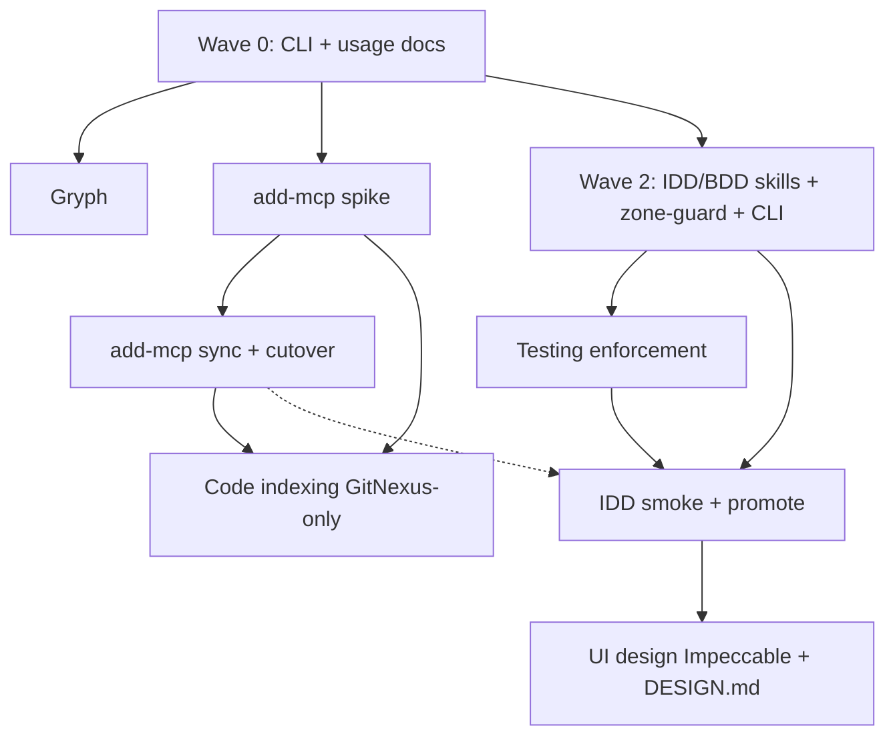

# Superpowers extensions — index & implementation order

Agent-facing design artifacts for skillgrid: IDD, BDD, tooling integrations, and enforcement. All live under `docs/`; application code stays outside.

**Workflow guide:** [02-usage.md](../02-usage.md)  
**Operator scratchpad:** [NOTE.md](../NOTE.md)

---

## Layout

```
docs/superpowers/
├── README.md              ← this file (master implementation order)
├── proposal/              YYYY-MM-DD-<topic>.md
├── specs/                 YYYY-MM-DD-<topic>-design.md
├── adr/                   YYYY-MM-DD-<topic>.md
└── plans/                 YYYY-MM-DD-<topic>.md   (checkbox tasks)
```

**Correlation:** same `YYYY-MM-DD-<topic>` slug links proposal, `-design.md`, plan, and (when BDD) `docs/acceptance-tests/<topic>.feature`.

**STATUS headers**

| Artifact | Lifecycle |
|----------|-----------|
| `specs/*-design.md` | DRAFT → active → **DECIDED** → superseded |
| `plans/*.md` | active → **ARCHIVED** |
| `proposal/*.md` | draft → active → superseded |
| `adr/*.md` | proposed → accepted → superseded |

Promote when done: plan → `ARCHIVED`; design → `DECIDED`.

---

## Implementation order

Execute **top to bottom**. Items marked **∥** can run in parallel within the same wave. Do not start a wave until its **Depends on** column is satisfied.

### Wave 0 — Done

| # | Track | Spec | Plan | Status |
|---|-------|------|------|--------|
| 0.1 | skillgrid CLI | [2026-08-25-skillgrid-cli-design.md](specs/2026-08-25-skillgrid-cli-design.md) | [2026-08-25-skillgrid-cli-design.md](plans/2026-08-25-skillgrid-cli-design.md) | **COMPLETE** |
| 0.2 | Usage workflows (docs) | — | — | **partial** — layer model + command tables in [02-usage.md](../02-usage.md) |

---

### Wave 1 — Infrastructure (parallel)

Independent install-path work. No IDD skills required.

| # | Track | Plan tasks | Depends on | Outcome |
|---|-------|------------|------------|---------|
| 1.1 **∥** | [Gryph audit](specs/2026-08-26-gryph-integration-design.md) | [plan](plans/2026-08-26-gryph-integration.md) Tasks 1–3 | Wave 0 | `@safedep/gryph` in tools.yaml; hooks for Kilo + OpenCode; policy enabled |
| 1.2 **∥** | [add-mcp](specs/2026-08-26-add-mcp-integration-design.md) | [plan](plans/2026-08-26-add-mcp-integration.md) Tasks 1–2 | Wave 0 | Spike JSONC survival; `add-mcp` pinned in tools.yaml |
| 1.3 **∥** | Installers (optional) | [spec only](specs/2026-08-25-installers.md) | Wave 0 | bash / Homebrew / Nix — not blocking other tracks |

**Gate:** add-mcp Task 1 spike documented in spec Risks before Wave 3 MCP cutover.

---

### Wave 2 — IDD + BDD core (critical path)

Central workflow. Everything else that mentions `docs/superpowers/`, zone-guard, or acceptance tests waits on this wave.

| # | Track | Plan tasks | Depends on | Outcome |
|---|-------|------------|------------|---------|
| 2.1 | [IDD + BDD](specs/2026-08-26-idd-bdd-design.md) | [plan](plans/2026-08-26-idd-bdd.md) Tasks 1–4 | Wave 0 | `idd-workflow`, `bdd-workflow`, supporting skills, acceptance-test-authoring pack |
| 2.2 | IDD + BDD | Tasks 5–6 | 2.1 | `zone-guard.sh`; `AGENTS.md` `<!-- BEGIN IDD/BDD -->` block |
| 2.3 | IDD + BDD | Task 7 | 2.2 | CLI `ensureSkillPaths` + `installIDDBDD`; zone-guard copy to `~/.skillgrid/bin/` |

**Verify:** `go build ./... && go test ./...` in `skillgrid-cli/` after Task 7.

**Note:** Partial skill trees may exist in `config.d/skills/` — reconcile against plan file list before claiming Tasks 1–4 done.

---

### Wave 3 — MCP sync + code indexing

Consolidate MCP install and demote duplicate indexers.

| # | Track | Plan tasks | Depends on | Outcome |
|---|-------|------------|------------|---------|
| 3.1 | add-mcp | Tasks 3–4 | Wave 1.2 | `scripts/sync-mcp-from-yaml.mjs`; Go `installMCPViaAddMCP` |
| 3.2 **∥** | [Code indexing](specs/2026-08-26-code-indexing-design.md) | *(write plan, then implement)* | Wave 1.2 | **GitNexus primary**; remove `codegraph` + `ccc` from default `mcp.yaml` / `tools.yaml` |
| 3.3 | add-mcp | Tasks 5–7 | 3.1 | Docs; remove `MergeMCP`; integration smoke |
| 3.4 | add-mcp follow-up | [plan follow-up](plans/2026-08-26-add-mcp-integration.md#follow-up-mcpyaml-stdio-servers-using-npx) | 3.1 + 3.2 | `gitnexus` off `npx`; binary via tools.yaml + PATH |

**Gate:** Do not delete `MergeMCP` (Task 6) until spike accepts JSONC comment handling or team signs off on rewrite.

---

### Wave 3.5 — Mnemonic (alternative to 3.2)

Built-in SQLite memory + code FTS + web cache via `skillgrid mcp` / `skillgrid serve`. Alternative to external Engram + GitNexus-only indexing.

| # | Track | Plan tasks | Depends on | Outcome |
|---|-------|------------|------------|---------|
| 3.5 **∥** | [Mnemonic](specs/2026-08-26-skillgrid-mnemonic-design.md) | [plan](plans/2026-08-26-skillgrid-mnemonic.md) v1 (Tasks 1–18, 10–16, 12) | Wave 1.2 | **v1 COMPLETE** on `feat/skillgrid-mnemonic`; PR → `release/2` pending |

Teams choose **either** Wave 3.2 (GitNexus primary, demote codegraph/ccc) **or** Wave 3.5 (mnemonic profile, optional GitNexus overlay). Do not enable both as primary memory/index backends without explicit hybrid config.

**v1.1/v2 backlog:** plan Tasks 19–26 (tiered code tools, tree-sitter, branch catalog, temporal decay, Hermes hooks).

---

### Wave 4 — Testing enforcement

Manifest-driven L0–L5 gates; wires into skills from Wave 2.

| # | Track | Plan tasks | Depends on | Outcome |
|---|-------|------------|------------|---------|
| 4.1 **∥** | [Testing enforcement](specs/2026-08-26-testing-enforcement-design.md) | [plan](plans/2026-08-26-testing-enforcement.md) Task 1 | Wave 0 | L0–L5 table in [02-usage.md](../02-usage.md) *(extend existing workflows section)* |
| 4.2 | Testing enforcement | Tasks 2–3 | Wave 2.1 | `config.d/templates/testing-capabilities.yaml`; `AGENTS.md` testing block |
| 4.3 | Testing enforcement | Tasks 4–7 | Wave 2.1 + 4.2 | Skills read manifest; CI templates; `strict-tdd.md` rule |
| 4.4 **∥** | Testing enforcement | Task 5 | Wave 2.3 | Repo `docs/testing-capabilities.yaml` for skillgrid-cli (Go stack) |
| 4.5 | Testing enforcement | Tasks 8–9 | 4.3 | Optional pre-commit example; L1 + L3 integration smoke |

---

### Wave 5 — IDD integration smoke + user docs

Close the IDD/BDD track before UI and optional tooling.

| # | Track | Plan tasks | Depends on | Outcome |
|---|-------|------------|------------|---------|
| 5.1 | IDD + BDD | Tasks 8–9 | Wave 2 + 4.2 | Full lifecycle smoke; [05-skills.md](../05-skills.md) + [06-rules.md](../06-rules.md) |
| 5.2 | Manual acceptance | [IDD plan § Manual acceptance](plans/2026-08-26-idd-bdd.md#manual-acceptance-superpowers) | 5.1 | Superpowers session: "add user auth with BDD" triggers workflow before code |

**Promote:** [idd-bdd-design.md](specs/2026-08-26-idd-bdd-design.md) → `STATUS: DECIDED`; plan → `ARCHIVED`.

---

### Wave 6 — UI design integration

After IDD workflow exists so `## UI scope` and `DESIGN.md` link cleanly.

| # | Track | Plan tasks | Depends on | Outcome |
|---|-------|------------|------------|---------|
| 6.1 | [UI design](specs/2026-08-26-ui-design-integration-design.md) | **Write plan** from spec | Wave 5 | `plans/2026-08-26-ui-design-integration.md` |
| 6.2 | UI design | Implement | 6.1 + Wave 5 | **Impeccable** in skills registry; optional **SkillUI** in tools.yaml |
| 6.3 | UI design | Implement | 6.2 | `config.d/templates/DESIGN.md`; `idd-workflow` references visual vs technical `-design.md` split |
| 6.4 | UI design | Docs + smoke | 6.3 | UI row in [02-usage.md](../02-usage.md) command table; zone-guard respected for `docs/design/` |

**Promote:** ui-design spec → DECIDED when Impeccable + template land.

---

## Dependency graph



---

## Track index

| Topic | Design spec | Plan | Plan status | Priority |
|-------|-------------|------|-------------|----------|
| skillgrid CLI | [spec](specs/2026-08-25-skillgrid-cli-design.md) | [plan](plans/2026-08-25-skillgrid-cli-design.md) | ARCHIVED / complete | — |
| **IDD + BDD** | [spec](specs/2026-08-26-idd-bdd-design.md) | [plan](plans/2026-08-26-idd-bdd.md) | active; 0/9 tasks | **P0** |
| add-mcp | [spec](specs/2026-08-26-add-mcp-integration-design.md) | [plan](plans/2026-08-26-add-mcp-integration.md) | active; 0/7 tasks | P1 |
| Code indexing (GitNexus) | [spec](specs/2026-08-26-code-indexing-design.md) | *not written* | — | P1 |
| **Mnemonic** (SQLite memory + code FTS) | [spec](specs/2026-08-26-skillgrid-mnemonic-design.md) | [plan](plans/2026-08-26-skillgrid-mnemonic.md) | **v1 complete** (18/18 v1 tasks); v1.1/v2 pending; branch `feat/skillgrid-mnemonic` | **P1 alt** |
| Testing enforcement | [spec](specs/2026-08-26-testing-enforcement-design.md) | [plan](plans/2026-08-26-testing-enforcement.md) | active; 0/9 tasks | P1 |
| Gryph | [spec](specs/2026-08-26-gryph-integration-design.md) | [plan](plans/2026-08-26-gryph-integration.md) | active; 0/3 tasks | P2 |
| UI design | [spec](specs/2026-08-26-ui-design-integration-design.md) | *not written* | — | P2 |
| Installers | [spec](specs/2026-08-25-installers.md) | *not written* | — | P3 |

---

## How to execute a plan

1. Read the **design spec** (decisions, non-goals, verify bar).
2. Open the matching **plan**; use checkbox syntax for progress.
3. For multi-task plans, use **superpowers:subagent-driven-development** or **executing-plans** — one task per session with review between tasks.
4. **Verification bar (CLI tracks):** `go build ./... && go test ./...` in `skillgrid-cli/` after any Go change.
5. **No runtime `npx`** for skillgrid-managed tools — install via `config.d/tools.yaml` → `npm --prefix ~/.skillgrid/npm`; invoke from `~/.skillgrid/npm/node_modules/.bin/` or `node` + `createRequire`.
6. **Zone guard:** never co-edit `docs/` and application code in one uncommitted unit.
7. On completion: update plan progress table → promote spec/plan STATUS → link PR or transcript for manual acceptance items.

---

## Global constraints (all tracks)

| Rule | Detail |
|------|--------|
| No OpenSpec | No CLI, no `openspec/` tree, no schema bundles |
| Source of truth | `config.d/` for skills, hooks, MCP, tools — not `docs/superpowers/` |
| BDD Gherkin | Canonical in `specs/*-design.md`; `.feature` files extracted, not hand-edited |
| TDD skill | superpowers `test-driven-development` only — do not vend |
| Install failures | `logging.Warn`, never fatal; `--dry-run` logs only |
| PR target | skillgrid repo changes land via normal git flow; superpowers upstream PRs follow [AGENTS.md](../../AGENTS.md) contributor rules |

---

## Suggested first sprint (minimal shippable increment)

If starting now with one focused slice:

1. **Wave 2.1** — IDD/BDD Tasks 1–4 (skills only; no CLI yet).
2. **Wave 2.2–2.3** — zone-guard + CLI wiring.
3. **Wave 5.1** — integration smoke + user docs.
4. Defer Waves 3, 4, 6 until IDD/BDD manual acceptance passes.

Parallel optional: **Wave 1.1 Gryph** (does not block IDD).

---

## Open plans to write

Before Wave 3.2 or Wave 6:

- [ ] `plans/2026-08-26-code-indexing.md` — derive from [code-indexing-design.md](specs/2026-08-26-code-indexing-design.md) *(or adopt MemIndex plan instead)*
- [ ] `plans/2026-08-26-ui-design-integration.md` — derive from [ui-design-integration-design.md](specs/2026-08-26-ui-design-integration-design.md)
- [ ] `plans/2026-08-25-installers.md` — optional; derive from [installers spec](specs/2026-08-25-installers.md)

---

*Last updated: 2026-08-26 — Mnemonic v1 complete on `feat/skillgrid-mnemonic`; reorder when a spec is promoted or a plan is archived.*
