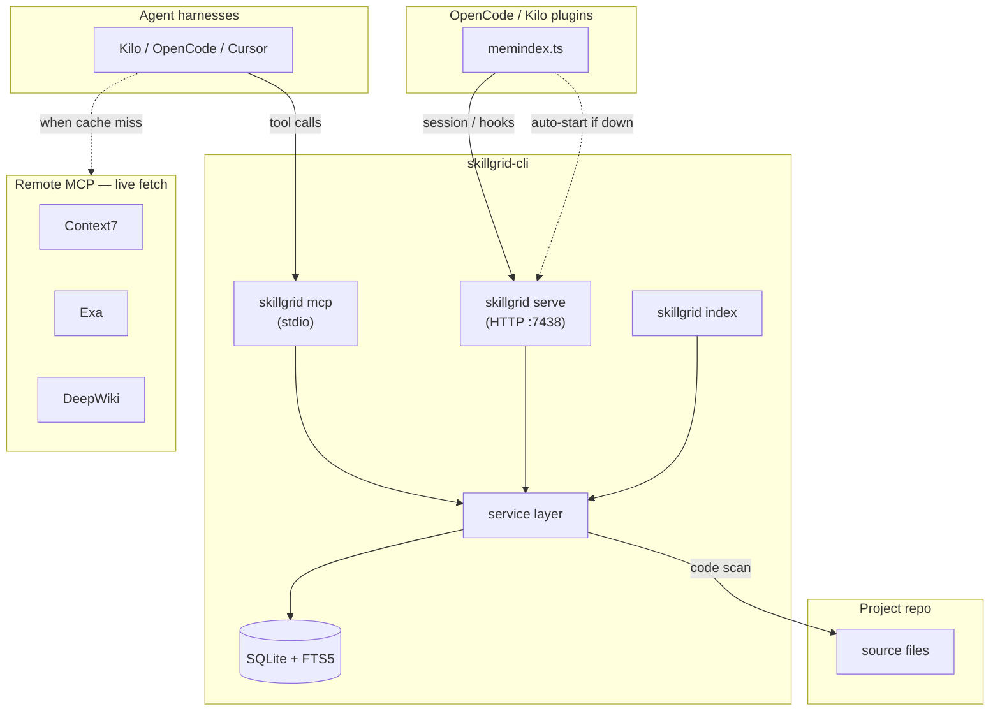

# Skillgrid Mnemonic — unified SQLite memory + code search

> **STATUS: active (2026-08-26)** — v1 implemented on `feat/skillgrid-mnemonic`; promote to **DECIDED** after merge to `release/2`.

**Plan:** [2026-08-26-skillgrid-mnemonic.md](../plans/2026-08-26-skillgrid-mnemonic.md)

**Related:** [2026-08-26-code-indexing-design.md](2026-08-26-code-indexing-design.md), [2026-08-26-add-mcp-integration-design.md](2026-08-26-add-mcp-integration-design.md), [05-skills.md](../../05-skills.md), [NOTE.md](../../NOTE.md)

**Sources:**

- [Engram](https://github.com/Gentleman-Programming/engram) — agent memory protocol, SQLite + FTS5, **MCP stdio + HTTP serve**, curated observations
- [Hermes Memory (OpenCode)](https://github.com/realchendahuang/opencode-hermes-memory) — layered scopes/types, bi-temporal replace+history, proactive plugin injection
- [OpenClaw local-first RAG (PingCAP)](https://www.pingcap.com/blog/local-first-rag-using-sqlite-ai-agent-memory-openclaw/) — `files`/`chunks` tables, incremental hash indexing, hybrid FTS + vector
- [Neuledge local-first docs](https://neuledge.com/blog/2026-02-19/local-first-documentation-for-ai) — version-pinned local `.db`, sub-10ms FTS, MCP, zero cloud dependency
- [Hybrid FTS5 + embeddings (srclight)](https://dev.to/tofutim/how-we-built-a-hybrid-fts5-embedding-search-for-code-and-why-you-need-both-4ec2) — multi-tokenizer FTS, RRF fusion, incremental symbol indexing

## Summary

Build **MemIndex** — a local-first SQLite store inside **skillgrid-cli** that combines:

1. **Memory layer** — Engram-style curated observations (decisions, bugfixes, session summaries) with FTS5 search.
2. **Code layer** — incremental file/chunk indexing with FTS5 search over source (and optionally docs), inspired by OpenClaw and srclight.
3. **Web cache layer** — local snapshots of research MCP results (WebFetch, Exa, Context7, DeepWiki, …) with FTS5 search — inspired by [Neuledge local-first documentation](https://neuledge.com/blog/2026-02-19/local-first-documentation-for-ai) (no rate limits, offline recall, version/query dedup).

Agents reach all three layers through **two transports** to the same SQLite store ([Engram model](https://github.com/Gentleman-Programming/engram)):

| Transport | Consumers |
|-----------|-----------|
| **`skillgrid mcp` (stdio)** | Cursor, Codex, Claude Code, agent tool calls |
| **`skillgrid serve` (HTTP, localhost)** | OpenCode + Kilo Code plugins (session lifecycle, compaction hooks) |

Remote MCP servers remain the **live fetch path**; MemIndex is the **durable cache + search** path.

**Positioning vs existing skillgrid bundle:**

| Today (Wave 3 plan) | MemIndex alternative |
|---------------------|----------------------|
| Engram (`engram mcp`) for memory | Built-in memory tools (`mem_*`) |
| GitNexus for structure/impact | Deferred — v1 is **search**, not call graphs |
| `ccc` for semantic search | v2 optional embeddings + RRF |

MemIndex is an **alternative track** to external Engram + GitNexus. Teams can choose one bundle profile in `config.d/indexing.yaml`.

## Problem

skillgrid today depends on **two external indexers** with overlapping “find things in the repo” surface area:

- **Engram** — excellent cross-session memory, but explicitly **not** a code indexer ([design decision: no raw file firehose](https://github.com/Gentleman-Programming/engram/blob/main/DOCS.md)).
- **GitNexus / CodeGraph / ccc** — code structure or semantic search, but separate install, separate MCP namespace, separate index lifecycle.

Operators must install, configure, and teach agents **which tool for which question**:

- “What did we decide?” → Engram / `mem_*`
- “Where is auth handled?” → GitNexus or `code_*`
- “Find docs for this library version” → Context7 (cloud) — **re-fetch every session, hit rate limits, no offline recall**

The same gap applies to Exa web search, DeepWiki repo Q&A, and ad-hoc URL fetches (WebFetch): agents repeat expensive remote calls because nothing persists locally except ad-hoc session context.

External tools also violate skillgrid’s **single-binary reproducibility** goal: `skillgrid install` should not require fetching Engram releases from GitHub when the CLI itself can host the same primitives in Go ([Engram uses modernc.org/sqlite for this reason](https://github.com/Gentleman-Programming/engram)).

## Goal

After `skillgrid install` + `skillgrid index` in a repo:

1. **`skillgrid mcp`** serves MCP stdio for agent tool calls (all harnesses).
2. **`skillgrid serve`** serves HTTP on `127.0.0.1` for OpenCode/Kilo plugins (session hooks, compaction recovery) — same split as [`engram mcp` + `engram serve`](https://github.com/Gentleman-Programming/engram/blob/main/docs/AGENT-SETUP.md).
3. **`config.d/mcp.yaml`** registers `skillgrid mcp` as the local MemIndex MCP server (replacing `engram` in the default profile).
4. Agents follow a **single rule**: `mem_*` for decisions/history; `code_*` for “find in codebase”; `web_*` for cached research (search before re-fetching remote MCPs).
5. Index is **local, offline, portable** — one `.sqlite` file per project under `~/.skillgrid/memindex/`.
6. Incremental re-index uses **mtime + content hash** (OpenClaw `files` pattern) — no full re-scan on every save.
7. Web research results from Context7 / Exa / DeepWiki / URL fetch are **cacheable** with TTL + dedup — search cache before calling remote MCPs when freshness allows.

## Non-goals (v1)

- Call graphs, blast-radius, coordinated rename (GitNexus territory) — document swap-in later, do not rebuild in v1
- Cloud sync / team replication (Engram Cloud pattern) — local-only first
- **Replacing** Context7 / Exa / DeepWiki MCP servers — they remain live fetchers; MemIndex caches their outputs locally ([Neuledge model](https://neuledge.com/blog/2026-02-19/local-first-documentation-for-ai): remote fetch once, query local `.db` thereafter)
- Transparent MCP proxy that intercepts all exa/context7 calls automatically — **v1.1** optional hook; v1 is agent-initiated `web_cache_save`
- Vector embeddings / Ollama dependency — **v2** (schema reserves embedding columns on web chunks too)
- Indexing `node_modules`, `.git`, build artifacts — exclude via defaults
- Auto-ingest raw tool-call firehose — same anti-pattern as Engram (pollutes FTS)
- Separate Node/Python runtime — pure Go + SQLite (modernc.org/sqlite), matching Engram’s zero-dependency ethos

---

## Approaches considered

### A. Keep Engram + GitNexus (status quo)

| Pros | Cons |
|------|------|
| Battle-tested; Engram memory protocol already in `AGENTS.md` | Two MCP servers; two index lifecycles |
| GitNexus gives impact/rename | External binaries; Engram GitHub download step |
| No skillgrid-cli scope creep | Cannot unify hybrid search across memory + code |

### B. **MemIndex inside skillgrid-cli (recommended)**

| Pros | Cons |
|------|------|
| One binary, one MCP, YAML-driven install | New subsystem to maintain |
| Memory protocol compatible with existing `engram-memory` skill (tool rename only) | v1 lacks graph/impact — agents still grep for callers or add GitNexus opt-in |
| FTS patterns from OpenClaw + srclight without their runtimes | Embedding v2 adds optional Ollama complexity |

**Recommendation:** **B** — aligns with skillgrid’s “config + one binary” thesis and NOTE.md research direction (local-first SQLite, hybrid search). Keep GitNexus as **opt-in overlay** in `config.d/indexing.yaml` for teams that need impact analysis before MemIndex v3 (if ever).

---

## Architecture

```
config.d/
├── mcp.yaml              skillgrid → command: [skillgrid, mcp]
├── indexing.yaml         NEW — paths, excludes, chunk policy, profile
└── AGENTS.md             mem_* + code_* agent rules

~/.skillgrid/
└── memindex/
    └── {project-id}.sqlite    # WAL mode; not committed to git

skillgrid-cli/
├── cmd/mcp.go                 # skillgrid mcp — stdio MCP server
├── cmd/serve.go               # skillgrid serve — HTTP API (plugins)
├── cmd/index.go               # skillgrid index [path]
└── internal/memindex/
    ├── service/               # shared domain logic (MCP + HTTP adapters)
    ├── store/                 # SQLite schema, migrations
    ├── memory/                # observations, sessions, FTS
    ├── codeindex/             # files, chunks, incremental scan
    ├── webcache/              # cached MCP research snapshots
    ├── search/                # FTS queries, v2 RRF
    ├── http/                  # REST handlers → service
    └── mcp/                   # MCP tool handlers → service
```

### Data flow



### Layer responsibilities

| Layer | Question it answers | Write model | Search |
|-------|---------------------|-------------|--------|
| **Memory** | “What did we decide / fix / learn?” | Agent `mem_save` (curated) | FTS5 on observations |
| **Code** | “Where is X mentioned / implemented?” | `skillgrid index` (deterministic scan) | FTS5 on chunks (v2: + embeddings RRF) |
| **Web cache** | “What did we already look up about X?” | Agent `web_cache_save` after remote MCP / fetch | FTS5 on cached snapshots; `web_cache_lookup` before re-fetch |

**Agent rule (replaces Engram/GitNexus split in default profile):**

> `mem_*` for session memory and decisions; `code_*` for repository text search; `web_*` to search cached research **before** calling Context7/Exa/DeepWiki/WebFetch again. Use GitNexus (opt-in) only when you need caller graphs or blast radius.

**Research workflow (cache-first):**

```
1. web_cache_lookup(query or url)     → hit + fresh? use web_cache_get
2. else call remote MCP (context7/exa/deepwiki/fetch)
3. web_cache_save(source, query, content, metadata)
4. continue work; next session starts at step 1
```

---

## Storage schema (v1)

Single database per project: `~/.skillgrid/memindex/{project-id}.sqlite`

`project-id` = normalized git remote URL or `{basename}-{hash}` fallback (same spirit as Engram project normalization).

### Core tables

```sql
-- Memory (Engram-aligned)
sessions(id TEXT PK, project TEXT, directory TEXT, started_at, ended_at, summary, status)
observations(id INTEGER PK, session_id FK, type, title, content, project, scope,
             topic_key, normalized_hash, revision_count, created_at, updated_at, deleted_at)
observations_fts FTS5(title, content, type, project)  -- sync triggers
-- v1.1 (Hermes bi-temporal)
observation_history(id INTEGER PK, observation_id INTEGER, superseded_by INTEGER,
                    title, content, type, scope, topic_key, superseded_at TEXT)

-- Code (OpenClaw-aligned)
files(id INTEGER PK, path TEXT UNIQUE, mtime_ns, size, content_hash, indexed_at)
chunks(id INTEGER PK, file_id FK, start_line, end_line, text, content_hash)
chunks_fts FTS5(text, path UNINDEXED)                 -- trigram tokenizer
symbols_fts FTS5(name, path UNINDEXED, kind UNINDEXED) -- unicode61; v1.1 if tree-sitter lands early

-- Web cache (Neuledge-aligned — local snapshots of remote research)
web_cache(
  id INTEGER PK,
  project TEXT,
  source TEXT NOT NULL,          -- context7 | exa | deepwiki | fetch | manual
  cache_key TEXT NOT NULL,       -- normalized dedup key (see below)
  url TEXT,                      -- canonical URL when applicable
  title TEXT,
  query TEXT,                    -- original search / doc query
  library_id TEXT,               -- context7: resolve-library-id result
  version_tag TEXT,              -- pinned version when known (e.g. v16.0.0)
  content TEXT NOT NULL,         -- full snapshot body (markdown/plain)
  metadata_json TEXT,            -- tool-specific payload (citations, repo, tool args)
  content_hash TEXT NOT NULL,
  fetched_at TEXT NOT NULL,
  expires_at TEXT,               -- NULL = no expiry
  session_id TEXT,
  created_at TEXT,
  UNIQUE(project, source, cache_key)
)
web_cache_fts FTS5(title, content, query, url, source, library_id)  -- porter + url/trigram via aux

-- Meta
schema_version INTEGER
index_meta(key TEXT PK, value TEXT)  -- last_full_scan, chunk_size, profile
```

### Incremental indexing (from OpenClaw)

For each candidate file under configured roots:

1. Skip if path matches exclude globs (`node_modules/**`, `**/.git/**`, `**/dist/**`, …).
2. Compare `(mtime_ns, size, content_hash)` to `files` row.
3. Unchanged → skip.
4. Changed → delete old chunks for `file_id`, re-chunk, update FTS rows.

Chunk policy (default): **line-bounded blocks** ~80 lines with 10-line overlap (simple, no tree-sitter required). v1.1 may add symbol-boundary chunks when tree-sitter is added.

### Memory taxonomy (Hermes-inspired)

Observations use **`type`** + **`scope`** so agents and plugins route facts consistently. SQLite remains canonical; optional markdown export (v1.1) mirrors [Hermes layout](https://github.com/realchendahuang/opencode-hermes-memory#-data-layout) for human edit.

| `type` | `scope` | Purpose | Retrieval |
|--------|---------|---------|-----------|
| `standing` | `user` / `project` | Hard rules — always injected (L0) | Plugin system prompt, not FTS-ranked |
| `preference` | `user` | User workflow preferences | `mem_search` |
| `convention` | `project` | Project norms and style | `mem_search` |
| `decision` | `project` | Architecture choices (Engram default) | `mem_search` |
| `bugfix`, `lesson` | `project` | Failures and fixes | `mem_search`; error prefetch hook |
| `correction` | `project` | User corrections | Plugin instant-save |
| `discovery` | `project` / `global` | Tool/env quirks | `mem_search` |
| `session_log` | `project` | Dated session notes | `mem_search` + temporal decay (v1.1) |

**Bi-temporal evolution (v1.1):** `mem_replace` on `topic_key` moves prior content to `observation_history`; `mem_history` reads the chain. Active `mem_search` excludes history rows ([Hermes `history.md` model](https://github.com/realchendahuang/opencode-hermes-memory)).

### Web cache keys and TTL (v1)

Dedup prevents storing the same research twice. `cache_key` normalization:

| `source` | `cache_key` derivation |
|----------|------------------------|
| `fetch` | `sha256(normalize_url(url))` |
| `exa` | `sha256(query + "|" + sort_params)` |
| `context7` | `sha256(library_id + "|" + version_tag + "|" + query)` |
| `deepwiki` | `sha256(repo_name + "|" + question)` |
| `manual` | `sha256(title + "|" + content_hash)` |

Default TTL (`expires_at = fetched_at + ttl`) from `indexing.yaml`:

| Source | Default TTL | Rationale |
|--------|-------------|-----------|
| `context7` | 30 days | Library docs change slowly; pin `version_tag` when project depends on specific version ([Neuledge](https://neuledge.com/blog/2026-02-19/local-first-documentation-for-ai)) |
| `exa` | 7 days | Web content drifts |
| `deepwiki` | 14 days | Upstream repo docs |
| `fetch` | 7 days | Generic URL snapshot |
| `manual` | none | Agent-curated |

Upsert on same `(project, source, cache_key)`: replace content if `content_hash` differs; bump `fetched_at` / `expires_at`.

Large snapshots: chunk `content` into `web_cache_chunks` **v1.1** if body >64KB; v1 stores full body with 256KB cap per entry (reject larger with structured error — agent should summarize first).

### FTS tokenizer strategy (from srclight, simplified for v1)

| Index | Tokenizer | Purpose |
|-------|-----------|---------|
| `observations_fts` | `porter` | Memory search — stemmed prose |
| `chunks_fts` | `trigram` | Substring / identifier fragments in source |
| `web_cache_fts` | `porter` | Cached research prose + queries |
| `symbols_fts` | `unicode61` with `tokenchars '_-'` | Symbol name splitting (v1.1+) |

v2 adds `chunks.embedding_json BLOB` and optional `sqlite-vec` virtual table; hybrid scoring via **RRF** (`score = Σ 1/(k+rank)`, k=60) per [srclight](https://dev.to/tofutim/how-we-built-a-hybrid-fts5-embedding-search-for-code-and-why-you-need-both-4ec2) and [OpenClaw hybrid retrieval](https://www.pingcap.com/blog/local-first-rag-using-sqlite-ai-agent-memory-openclaw/).

---

## Transports (v1)

MemIndex exposes **two adapters** over one **`internal/memindex/service`** layer — no duplicated business logic.

| Transport | Command | Bind | Primary consumers |
|-----------|---------|------|-------------------|
| **MCP stdio** | `skillgrid mcp` | stdin/stdout | Cursor, Codex, Claude Code; agent-initiated tool calls |
| **HTTP REST** | `skillgrid serve [port]` | `127.0.0.1:7438` (default) | OpenCode + Kilo `memindex.ts` plugins |

Environment variables:

| Variable | Default | Purpose |
|----------|---------|---------|
| `SKILLGRID_MEMINDEX_DATA_DIR` | `~/.skillgrid/memindex` | SQLite directory |
| `SKILLGRID_MEMINDEX_PORT` | `7438` | HTTP listen port (7437 reserved for Engram if co-installed) |
| `SKILLGRID_MEMINDEX_URL` | `http://127.0.0.1:7438` | Plugin base URL override |

**Cursor** uses MCP + rules only (no HTTP plugin). **OpenCode/Kilo** use MCP for agent tools **and** HTTP for plugin hooks — matching [Engram OpenCode plugin](https://github.com/Gentleman-Programming/engram/blob/main/docs/PLUGINS.md).

---

## MCP tools (v1)

Transport: **stdio** — agents spawn `skillgrid mcp` as subprocess (same as Engram).

### Memory tools (Engram-compatible names)

| Tool | Purpose |
|------|---------|
| `mem_save` | Save curated observation (What/Why/Where/Learned); topic_key upsert |
| `mem_search` | FTS5 search; `match_mode: all\|any` |
| `mem_context` | Recent session summaries |
| `mem_get_observation` | Full observation by id |
| `mem_session_start` | Create/resume session (required by OpenCode plugin) |
| `mem_session_end` | End session with optional summary |
| `mem_session_summary` | End-of-session structured summary |
| `mem_suggest_topic_key` | Stable key from type + title |

Deferred to v1.1: `mem_update`, `mem_delete`, `mem_capture_passive`, conflict surfacing (`mem_judge`), **`mem_replace`**, **`mem_history`** (Hermes bi-temporal).

### Code tools

| Tool | Purpose |
|------|---------|
| `code_status` | Index stats: file count, chunk count, last indexed, stale hint |
| `code_index` | Trigger incremental index for cwd project (respect indexing.yaml) |
| `code_search` | FTS5 over chunks; returns path, line range, snippet, score |
| `code_read` | Fetch full chunk or file slice by path (+ optional line range) |

### Web cache tools

| Tool | Purpose |
|------|---------|
| `web_cache_lookup` | Check cache by `url`, `query`, or `(source, library_id, version_tag)` — returns hit/miss/stale + `id` |
| `web_cache_save` | Persist snapshot after remote MCP or fetch (required fields: `source`, `content`; optional: `url`, `query`, `title`, `library_id`, `version_tag`, `metadata`) |
| `web_cache_search` | FTS5 over cached research; filter by `source`, `fresh_only` (default true) |
| `web_cache_get` | Full snapshot by id (untruncated) |
| `web_cache_status` | Counts by source, expired entries, oldest/newest fetch |

**Mandatory agent pattern** after any Context7 / Exa / DeepWiki / WebFetch call:

```
web_cache_save({
  source: "context7",
  library_id: "/vercel/next.js",
  version_tag: "v15.0.0",
  query: "middleware API",
  title: "Next.js middleware docs",
  content: "<paste MCP result>",
  metadata: { tool: "query-docs", ... }
})
```

`web_cache_lookup` before remote call when the same query was answered recently — avoids rate limits ([Neuledge: none vs 60 req/hour on cloud](https://neuledge.com/blog/2026-02-19/local-first-documentation-for-ai)).

### Unified search (optional v1.1)

| Tool | Purpose |
|------|---------|
| `search` | Single query across memory + code + web cache with labeled hits and RRF merge |

---

## HTTP API (v1)

Local runtime: `skillgrid serve` on `127.0.0.1:<port>`. Subset aligned with [Engram HTTP API](https://github.com/Gentleman-Programming/engram/blob/main/DOCS.md) — enough for OpenCode/Kilo plugins; full parity deferred.

### Health

- `GET /health` → `{"status":"ok","service":"skillgrid-memindex","version":"..."}`

### Sessions (plugin lifecycle)

- `POST /sessions` — Body: `{id?, project?, directory}` → create/resume session
- `POST /sessions/{id}/end` — Body: `{summary?}`
- `GET /sessions/recent` — Query: `?project=&limit=`
- `GET /context` — Recent session context for compaction injection (query: `?project=&limit=`)

### Memory

- `POST /observations` — Body: `{session_id, type, title, content, project?, scope?, topic_key?}`
- `GET /observations/{id}`
- `GET /search` — Query: `?q=&type=&project=&scope=&limit=` (observations FTS)
- `GET /observations/recent` — Query: `?project=&limit=`

### Code index

- `GET /code/status` — Index stats + staleness
- `POST /code/index` — Trigger incremental index for `directory` in body
- `GET /code/search` — Query: `?q=&limit=`
- `GET /code/read` — Query: `?path=&start_line=&end_line=`

### Web cache

- `GET /web/lookup` — Query: `?source=&url=&query=&library_id=&version_tag=`
- `POST /web/cache` — Body: web_cache_save fields
- `GET /web/search` — Query: `?q=&source=&fresh_only=&limit=`
- `GET /web/cache/{id}`
- `GET /web/status`

### Plugin usage pattern (OpenCode/Kilo)

```
1. Plugin loads → GET /health
2. If down → spawn `skillgrid serve` detached (same as engram.ts)
3. Session start → POST /sessions { directory: workspace }
4. chat.system.transform → inject memory-protocol.md
5. Compaction hook → GET /context + inject mem_session_summary reminder
6. Agent still uses MCP mem_* / code_* / web_* for tool calls during chat
```

HTTP is **not** exposed on LAN by default (`127.0.0.1` only). Optional `SKILLGRID_HTTP_TOKEN` bearer auth (same zero-config default as Engram: unset = open localhost).

---

## CLI commands

| Command | Purpose |
|---------|---------|
| `skillgrid mcp` | Start MCP stdio server (agent tool calls) |
| `skillgrid serve [port]` | Start HTTP API (OpenCode/Kilo plugins; default `7438`) |
| `skillgrid index [path]` | Incremental index; default path = git root of cwd |
| `skillgrid index --status` | Print index stats (same as `code_status`) |
| `skillgrid mem search <query>` | Operator/debug CLI for memory FTS |
| `skillgrid web search <query>` | Operator/debug CLI for web cache FTS |
| `skillgrid web status` | Web cache stats by source |
| `skillgrid setup <agent>` | Wire MCP + protocol + plugins per agent (Engram-style) |

Install flow adds no new binary — MemIndex ships inside existing `skillgrid` binary.

Supported `setup` targets (v1): **`opencode`**, **`kilocode`**, **`cursor`**.

---

## Agent plugins (OpenCode, Kilo Code, Cursor)

Bare MCP (`skillgrid mcp` in `mcp.yaml`) is necessary but not sufficient. [Engram’s plugin layer](https://github.com/Gentleman-Programming/engram/blob/main/docs/PLUGINS.md) adds session lifecycle, Memory Protocol injection, and compaction survival — agents without it forget to call `mem_save` after long sessions.

MemIndex mirrors Engram’s split: **MCP = agent tools**, **HTTP = plugin hooks**, **rules = Cursor fallback**.

### Design principle (from Engram)

| Layer | Bare MCP | + HTTP plugin (OpenCode/Kilo) | + rule (Cursor) |
|-------|----------|-------------------------------|-----------------|
| Tool availability | ✓ | ✓ | ✓ |
| Memory Protocol in system prompt | ✗ | ✓ (`chat.system.transform`) | ✓ (`.mdc`) |
| **Standing rules (L0)** | ✗ | ✓ v1.1 (`type=standing` inject) | partial (rule can include standing block) |
| Session auto-start | ✗ | ✓ (`POST /sessions` via plugin) | ✗ |
| Compaction recovery | ✗ | ✓ (plugin injects `/context` + summary reminder) | partial (rule only) |
| **Compaction flush (save before inject)** | ✗ | ✓ v1.1 (Hermes-style) | ✗ |
| **Auto-inject relevant memory** | ✗ | ✓ v1.1 (`chat.message` → `/search`) | ✗ |
| **Error prefetch (bash failure)** | ✗ | ✓ v1.1 (`tool.execute.after`) | ✗ |
| **Correction detect** | ✗ | ✓ v1.1 (rule-based on user message) | ✗ |
| Code index freshness hint | ✗ | ✓ (`GET /code/status` on session start) | ✗ |
| Web research cache reminder | ✗ | ✓ (protocol in plugin) | ✓ (protocol in rule) |
| Auto-start HTTP server | ✗ | ✓ (plugin spawns `skillgrid serve` if `/health` fails) | N/A |

OpenCode and Kilo plugins **require HTTP** — same as [Engram’s OpenCode plugin auto-starting `engram serve`](https://github.com/Gentleman-Programming/engram/blob/main/docs/PLUGINS.md#opencode-plugin). Cursor remains **MCP + `.mdc` rule** only.

### Plugin assets (shipped in repo)

```
plugins/memindex/
├── opencode/
│   └── memindex.ts          # OpenCode plugin (TypeScript)
├── cursor/
│   └── memindex.mdc         # Always-applied Cursor rule template
└── shared/
    └── memory-protocol.md   # Single source for protocol text (mem_* + code_* rules)
```

Install copies from synced repo (`~/.skillgrid/repos/skillgrid/plugins/memindex/`) — not embedded in Go binary (keeps plugin editable without recompile).

### `skillgrid setup opencode`

Idempotent. Modeled on [`engram setup opencode`](https://github.com/Gentleman-Programming/engram/blob/main/docs/AGENT-SETUP.md#opencode):

1. Copy `plugins/memindex/opencode/memindex.ts` → `~/.config/opencode/plugins/memindex.ts`
2. Upsert MCP entry in `~/.config/opencode/opencode.json`:

```json
{
  "mcp": {
    "skillgrid-memindex": {
      "type": "local",
      "command": ["skillgrid", "mcp"],
      "enabled": true
    }
  }
}
```

3. Append plugin path to top-level `plugin` array if absent (OpenCode plugin loader)
4. Optionally enable `opencode-subagent-statusline` in `tui.json` / `tui.jsonc` (same optional UX as Engram — off by default in skillgrid)

**OpenCode plugin responsibilities (`memindex.ts`):**

**v1 (Engram parity):**

- **Auto-start** — `GET /health`; if unreachable, spawn `skillgrid serve` in background (Engram-parity)
- **`chat.system.transform`** — concatenate Memory Protocol into existing system message (single block)
- **Session start** — `POST /sessions` with workspace `directory`; stash `session_id`
- **Compaction hook** — `GET /context` + inject `mem_session_summary` reminder before agent continues
- **Index nudge** — `GET /code/status`; warn if stale (do not auto-run full index)
- **Privacy** — strip `<private>...</private>` before POST bodies
- Agent tool calls during chat still use **MCP** (`skillgrid mcp` registered in `opencode.json`)

**v1.1 (Hermes parity — [opencode-hermes-memory](https://github.com/realchendahuang/opencode-hermes-memory)):**

| Hook | Behavior |
|------|----------|
| `chat.system.transform` | Prepend `type=standing` observations (L0) before protocol |
| `chat.message` | Auto-inject top memories: `GET /search?q=<message>&min_score=0.4&limit=2`; dedupe per session |
| `chat.message` | Rule-based correction detect → `POST /observations` with `type=correction` |
| `tool.execute.after` | Bash/shell failure → prefetch `type=bugfix,lesson` via `/search`; inject next turn |
| `experimental.session.compacting` | **Flush:** remind agent to `mem_session_summary` + save lessons **before** `GET /context` |
| `session.idle` | Optional nudge only (`idle_review: false` default) — no Go-core LLM loop |

Plugin flags in `indexing.yaml` → `memindex.plugin.*` (see plan Task 10). Do not run alongside [Hermes Memory plugin](https://github.com/realchendahuang/opencode-hermes-memory) without disabling one system — duplicate memory namespaces.

### `skillgrid setup kilocode`

Idempotent. Modeled on [`engram setup kilocode`](https://github.com/Gentleman-Programming/engram/blob/main/docs/AGENT-SETUP.md#kilo-code):

1. Upsert MCP entry in `~/.config/kilo/opencode.json` (Kilo uses OpenCode-style `mcp` object):

```json
{
  "mcp": {
    "skillgrid-memindex": {
      "type": "local",
      "command": ["skillgrid", "mcp"],
      "enabled": true
    }
  }
}
```

2. Write Memory Protocol marker block to `~/.config/kilo/AGENTS.md`:

```markdown
<!-- BEGIN SKILLGRID MEMINDEX — managed by skillgrid setup kilocode -->
... protocol from shared/memory-protocol.md ...
<!-- END SKILLGRID MEMINDEX -->
```

3. **Plugin file bridge** (same pattern as [07-plugins.md](../../07-plugins.md) engram bridge):

   - Copy `~/.config/opencode/plugins/memindex.ts` → `~/.config/kilo/plugins/memindex.ts` **if missing**
   - Kilo plugin uses **same HTTP + MCP split** as OpenCode (not MCP-only)
   - Copy `~/.config/opencode/tui.json` → `~/.config/kilo/tui.json` **if missing** (optional)
   - Never overwrite existing Kilo plugin files (first-write-wins)

Kilo has no native `skillgrid setup kilocode` adapter upstream — skillgrid owns both MCP registration and the OpenCode-plugin copy bridge ([gryph integration precedent](specs/2026-08-26-gryph-integration-design.md)).

### `skillgrid setup cursor`

Idempotent. Modeled on [`engram setup cursor`](https://github.com/Gentleman-Programming/engram/blob/main/docs/AGENT-SETUP.md#cursor):

1. Upsert `~/.cursor/mcp.json`:

```json
{
  "mcpServers": {
    "skillgrid-memindex": {
      "command": "skillgrid",
      "args": ["mcp"]
    }
  }
}
```

2. Write `~/.cursor/rules/memindex.mdc` with frontmatter:

```yaml
---
description: Skillgrid MemIndex — memory and code search protocol
alwaysApply: true
---
```

Body: contents of `plugins/memindex/shared/memory-protocol.md` plus `code_*` usage rules.

Cursor has **no TypeScript plugin hook surface** in v1 — rule + MCP only (same as Engram Cursor path: MCP + `.mdc`, no session hooks).

### Install flow integration (skillgrid-cli step 5)

After superpowers plugin install, gated by `indexing.profile: memindex`:

```
for agent in selectedAgents:
  if agent == opencode:  skillgrid setup opencode
  if agent == kilo:      skillgrid setup kilocode  # includes opencode→kilo plugin copy
  if agent == cursor:   skillgrid setup cursor
```

Dry-run prints planned file writes and config upserts; no exec. Failures → `logging.Warn`, continue.

**Coexistence with add-mcp:** `setup` writes agent-native MCP entries; add-mcp sync from `mcp.yaml` must not duplicate the same server id — use **`skillgrid-memindex`** consistently everywhere.

### Memory Protocol content (`shared/memory-protocol.md`)

Must include (fork from `config.d/rules/engram-memory-protocol.md`):

- **WHEN TO SAVE** — mandatory `mem_save` triggers
- **WHEN TO SEARCH MEMORY** — `mem_context` then `mem_search`; proactive on session start
- **CODE SEARCH** — `code_search` before grepping large unknown areas; `code_status` when index may be stale
- **WEB RESEARCH CACHE** — `web_cache_lookup` before Context7/Exa/DeepWiki/WebFetch; `web_cache_save` immediately after every remote research call; `web_cache_search` when user asks “what did we find about X online?”
- **SESSION CLOSE** — mandatory `mem_session_summary`
- **AFTER COMPACTION** — `mem_session_summary` + `mem_context` first

---

## config.d integration

### `config.d/mcp.yaml` (memindex profile)

```yaml
servers:
  skillgrid-memindex:
    type: local
    command:
      - skillgrid
      - mcp
    env:
      SKILLGRID_MEMINDEX_DATA_DIR: ~/.skillgrid/memindex
```

Remove `engram`, `gitnexus`, `codegraph`, `ccc` from **default** profile when MemIndex is primary (same consolidation intent as [code-indexing-design](2026-08-26-code-indexing-design.md)).

### `config.d/indexing.yaml` (new)

```yaml
profile: memindex          # memindex | gitnexus | hybrid

memindex:
  include:
    - "**/*.go"
    - "**/*.ts"
    - "**/*.tsx"
    - "**/*.md"
  exclude:
    - "**/node_modules/**"
    - "**/.git/**"
    - "**/dist/**"
    - "**/.skillgrid/**"
  docs:
    enabled: false         # v1: code zone only (matches code-indexing non-goal)
  chunk_lines: 80
  chunk_overlap: 10
  embeddings: false        # v2

  web_cache:
    enabled: true
    max_entry_bytes: 262144   # 256KB
    ttl:
      context7: 720h          # 30d
      exa: 168h               # 7d
      deepwiki: 336h          # 14d
      fetch: 168h             # 7d
      manual: 0               # no expiry
    sources: [context7, exa, deepwiki, fetch, manual]

  http:
    enabled: true
    host: 127.0.0.1
    port: 7438                 # 7437 = Engram default; avoid collision if co-installed
    auto_start: plugin         # OpenCode/Kilo plugin spawns `skillgrid serve` when /health fails

# Remote MCPs stay in mcp.yaml — MemIndex caches their outputs, does not replace them
gitnexus:
  enabled: false
```

### Skills impact

| Skill | Change |
|-------|--------|
| `engram-memory` | Fork → `memindex-memory` (same protocol; tool names unchanged; add `web_*` rules) |
| `engram-memory-protocol` | Update MCP server id references + web cache workflow |
| `exa-search` | Add “cache results via `web_cache_save`” step after search |
| `mcp-deepwiki` | Add cache-first lookup guidance |
| `gitnexus-*` | Opt-in only when `indexing.profile: hybrid` |

---

## Project resolution

Mirror Engram’s cwd-based detection:

1. Nearest `.skillgrid/config.json` with `project` name (optional)
2. Git remote URL normalized
3. Directory basename + hash fallback

MCP and HTTP handlers resolve project from agent subprocess cwd or explicit `directory` / `project` in request body (stdio MCP inherits agent workspace when configured correctly).

SQLite WAL mode supports concurrent **one writer** (HTTP plugin session POSTs + MCP tool calls); busy timeout 5000ms.

---

## Pairing with other skillgrid tools

| Tool | Layer | When |
|------|-------|------|
| **MemIndex** | Memory + code FTS + **web cache** | Default; offline recall |
| **Context7** | Live library docs fetch | Cache miss / stale / new library version |
| **Exa** | Live web search | Cache miss / stale / time-sensitive news |
| **DeepWiki** | Live public repo Q&A | Cache miss / exploring new upstream repo |
| **GitNexus** (opt-in) | Call graph, impact, rename | Refactor / TDD apply with blast radius |
| **Gryph** | Audit trail | Post-tool-call logging; **v1.1** optional auto `web_cache_save` hook |

---

## Phased delivery

| Phase | Scope |
|-------|-------|
| **v1** | Shared `service` layer; MCP + **HTTP (`skillgrid serve`)**; code indexer; web cache; `skillgrid index`; setup + **OpenCode/Kilo HTTP plugins** (Engram hooks); Cursor MCP+rule; memory taxonomy in protocol |
| **v1.1** | Hermes plugin hooks (auto-inject, error prefetch, correction, compaction flush, standing L0); `mem_replace`/`mem_history`; OCBI code layer (peek/context, tree-sitter, branch catalog); temporal decay; `mem_capture_passive`, unified `search`, Gryph auto `web_cache_save` |
| **v2** | Optional Ollama embeddings, RRF hybrid, `indexing.yaml embeddings: true` |
| **v3** | Evaluate graph/impact — either integrate GitNexus as companion or defer indefinitely |

---

## Success criteria

1. `skillgrid mcp` (stdio) and `skillgrid serve` (HTTP) share one SQLite store with identical behavior for equivalent operations.
2. OpenCode/Kilo plugin auto-starts `skillgrid serve` when `GET /health` fails; session created via `POST /sessions`.
3. `mem_save` + `mem_search` round-trip survives agent restart (persistence in SQLite).
4. `skillgrid index` on skillgrid-cli repo indexes ≥90% of `.go` files in <30s cold; <5s warm no-op.
5. `code_search` / `GET /code/search` return relevant hits for known symbol in indexed repo.
6. `web_cache_save` + `web_cache_lookup` round-trip without remote MCP.
7. Default bundle can drop external `engram` binary when `indexing.profile: memindex`.
8. `go test ./...` covers HTTP handlers, MCP tools, migrations, web TTL.
9. `skillgrid setup opencode|kilocode|cursor` idempotent.
10. Compaction hook in OpenCode plugin injects context from `GET /context`.
11. **v1.1:** Plugin auto-injects ≥1 relevant memory on user message when score ≥ 0.4 (Hermes parity).
12. **v1.1:** `mem_replace` + `mem_history` preserve supersession chain without polluting active search.

---

## Risks

| Risk | Mitigation |
|------|------------|
| MCP lib maturity in Go | Use `github.com/mark3labs/mcp-go` (same as Engram) |
| FTS trigram index size | Exclude large/generated paths; cap file size (e.g. 512KB) |
| Agents confuse mem vs code | Explicit tool descriptions + AGENTS.md rule block |
| v1 lacks impact analysis | Document GitNexus opt-in; don’t claim parity with graph indexers |
| Web cache grows unbounded | TTL per source + `skillgrid web prune` (v1.1); 256KB entry cap |
| Stale cached docs mislead agent | `web_cache_lookup` returns `stale: true` when expired; agent re-fetches |
| Agents skip web_cache_save | Protocol + plugin reminder; v1.1 Gryph hook optional |
| Port 7438 conflict with Engram (7437) or other tools | Configurable `SKILLGRID_MEMINDEX_PORT`; document in setup |
| SQLite lock contention (MCP + HTTP) | WAL + busy timeout; single `skillgrid serve` process; plugin must not spawn duplicates |
| Zombie `skillgrid serve` processes | Plugin health-check reuse; document `pkill -f "skillgrid serve"` in troubleshooting |

---

## Open questions

1. **Profile migration:** Default new installs to `memindex` or keep Engram until v1 ships?
2. **Chunk size:** 80-line default vs AST-aware chunks in v1.1 — spike on skillgrid-cli repo?
3. **Docs zone:** Index `docs/superpowers/` in v1.1 for IDD/BDD agent workflows?
4. **Auto-capture:** Gryph policy template to call `web_cache_save` after exa/context7 MCP tools — ship in v1 or v1.1?
5. **Portable `.db` export:** commit team web cache for pinned Context7 versions (Neuledge-style) — v2?

---

## References

- [Engram](https://github.com/Gentleman-Programming/engram)
- [Hermes Memory for OpenCode](https://github.com/realchendahuang/opencode-hermes-memory)
- [OpenClaw SQLite RAG architecture](https://www.pingcap.com/blog/local-first-rag-using-sqlite-ai-agent-memory-openclaw/)
- [Neuledge local-first documentation](https://neuledge.com/blog/2026-02-19/local-first-documentation-for-ai)
- [Hybrid FTS5 + embedding search](https://dev.to/tofutim/how-we-built-a-hybrid-fts5-embedding-search-for-code-and-why-you-need-both-4ec2)
- [skillgrid code indexing design (GitNexus track)](2026-08-26-code-indexing-design.md)
