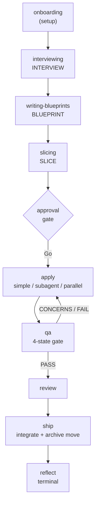

<div align="center">

# 🚀 Your first change

**From an empty idea to an integrated, archived change — in one guided loop.**


</div>

> [!TIP]
> **This is the one guaranteed path.** You will build a tiny change, run
> **every** phase of the pipeline exactly once, and — the part most tutorials
> skip — understand *why* each step exists. This tutorial works in any agent
> host that loads skills from `.agents/skills/` (OpenCode, Kilo, Cursor); the
> skill names and artifacts are identical across runtimes.

---

## 📖 Table of contents

1. [The one idea that makes Skillgrid click](#-the-one-idea-that-makes-skillgrid-click)
2. [What you'll build](#-what-youll-build)
3. [Before you begin](#-before-you-begin)
4. [Step 1 — Install the hub](#step-1--install-the-hub)
5. [Step 2 — Start the agent](#step-2--start-the-agent)
6. [Step 3 — Onboard the project](#step-3--onboard-the-project)
7. [Step 4 — Interview the intent](#step-4--interview-the-intent)
8. [Step 5 — Blueprint](#step-5--blueprint)
9. [Step 6 — Slice](#step-6--slice)
10. [Step 7 — Execute](#step-7--execute)
11. [Step 8 — QA gate](#step-8--qa-gate)
12. [Step 9 — Review](#step-9--review)
13. [Step 10 — Ship](#step-10--ship)
14. [Step 11 — Reflect](#step-11--reflect)
15. [Mini-glossary](#-mini-glossary) · [Troubleshooting](#-troubleshooting) · [What next](#-what-next)

---

## 💡 The one idea that makes Skillgrid click

Skillgrid does **not** "write your whole change in one shot." It runs a
**repeating pipeline**, and it does the heavy work in **fresh, throwaway
subagents** so your main chat window never fills up with clutter — the quality
killer Skillgrid calls *context rot*.

You drive that pipeline **one phase at a time**, and every phase writes what it
learned to disk:



The verb that makes it click: **decisions live in files, not in chat.** The
glossary, the ADRs, the blueprint, the acceptance criteria — all written to
`.skillgrid/` — so the *next* agent (or the next session after a `/clear`)
starts from your project's actual state, not from a blank window. The verbs are
**skills** under `.agents/skills/`, and they run as a repeatable,
evidence-gated pipeline: **interview → blueprint → slice → execute → review →
QA-gate → ship → reflect**.

---

## 📖 What you'll build

A single `GET /health` endpoint on a tiny server. The change is small enough
that it never distracts from the real lesson: how Skillgrid turns "chat with an
agent" into a repeatable, evidence-gated pipeline. You will watch each artifact
appear on disk under `.skillgrid/` as you go.

---

## ⚙️ Before you begin

You need:

- An AI agent host that loads skills from `.agents/skills/` — **OpenCode**,
  **Kilo**, or **Cursor**.
- **Node.js on PATH** — the hub install verifies it.
- **A throwaway project.** Create one now:

```bash
mkdir ~/skillgrid-demo && cd ~/skillgrid-demo
git init
```

You will work inside `~/skillgrid-demo` for the rest of this tutorial.

> [!NOTE]
> **This is greenfield on purpose.** There is no inherited code to learn yet,
> so the pipeline runs clean. To bring Skillgrid to a repo that already has
> code, see [Onboard an existing codebase](onboarding-an-existing-codebase.md).

---

## Step 1 — Install the hub

Install Skillgrid onto this machine:

```bash
skillgrid install
```

When prompted, pick your agent (OpenCode, Kilo, or Cursor). The install
creates `~/.skillgrid/`, mirrors the hub there, installs the selected agent and
shared tools, copies the hub's `.agents/` into `~/.agents/`, and wires git's
global `core.hooksPath` at the staged git-hooks.

Verify the hooks are live:

```bash
git config --global core.hooksPath
# → ~/.skillgrid/git-hooks
```

That one line is the guarantee half of Skillgrid's core rule: **"a rule asks,
a hook guarantees."** Every commit now passes through the staged guards.

---

## Step 2 — Start the agent

From `~/skillgrid-demo`, start your agent (e.g. `opencode`). You do not need
special flags — the Stop hooks and capture-bridge plugin are already wired by
the install.

Tell the agent to use the router:

```text
Use using-skillgrid for the work I want.
```

The router (`using-skillgrid`) does three checks **before routing**: config
(does `.skillgrid/config.yaml` exist?), resume (any in-flight change?), and
domain model (glossary/ADRs). It then announces which skill it will run and
why. You will see:

```text
I'm using the skillgrid:onboarding skill to configure Skillgrid for this project.
```

---

## Step 3 — Onboard the project

Onboarding **detects** the project's facts — stack, test runner, tracker,
security tooling — and **confirms** them with you before writing anything. It
does not guess.

You will be asked to confirm the detected facts. Answer them. When it finishes,
open the two files it wrote:

```text
.skillgrid/config.yaml     # project facts: stack, testing.runner, tracker, trivy
AGENTS.md                  # the skillgrid block the agent reads every session
```

`config.yaml` is the source of truth the pipeline reads at runtime —
`testing.runner` tells `qa` how to run the suite, `ticketing.type` tells
`ticketing` where tickets go, `rules.tiers.default` sets the project's rigor
floor.

---

## Step 4 — Interview the intent

Now ask for the change:

```text
Add a GET /health endpoint that returns 200 with {"status":"ok"}.
```

The router sends this to `interviewing`, which **grills the ambiguity**: it
walks a design tree in rounds until a weighted **clarity gate** passes. Expect
questions like "which final state shape?", "where do routes live?", "JSON or
text?".

As terms resolve, they are recorded into the domain model —
`.skillgrid/artifacts/01-business-terms.md` and `02-technical-terms.md` — so
the next session uses the same vocabulary you just agreed on.

When the clarity gate passes, you are asked to **approve**. Say yes.

> [!IMPORTANT]
> **The approval gate is hard.** Interviewing stops and asks. The agent does not
> auto-advance to blueprint until you approve. This is the first of two hard
> gates in the loop — the second is the QA gate.

---

## Step 5 — Blueprint

`writing-blueprints` turns the approved design into a **falsifiable plan** at:

```text
.skillgrid/specs/YYYY-MM-DD-health-endpoint/blueprint.md
```

Open it. The part that matters is the **Must-Haves** section — observable
outcomes that MUST be true when the plan is complete, derived *goal-backward*
from the requirement. The verifier checks the result against this list, **not
just that the tasks exist.**

Watch for the **Owed-Decision Gate**: if the agent hits a decision nobody made
yet, it must either resolve it or record it as an **`ASSUMED` blueprint** — a
named assumption in a file that survives `/clear`, that teammates read, and
that `qa` flags as decision debt until it is settled. That single move stops the
agent from silently inventing the load-bearing choice and burying it in code.

The blueprint is committed to git as a checkpoint alongside the code.

---

## Step 6 — Slice

`slicing` breaks the blueprint into **vertical tracer-bullet tickets** with
dependency edges and execution waves, written to:

```text
.skillgrid/specs/YYYY-MM-DD-health-endpoint/tasks.md
```

Open it. Each ticket has a scope, acceptance criteria, a **`SATISFIES`**
reference to the BDD scenario it fulfills (the traceability oracle `qa` uses),
and `blocks` / `blocked-by` edges. Tickets in the same **wave** are independent
and can run in parallel.

Before executing, the router runs the **fast-track classification**:

| Class | Criteria | Behavior |
|-------|----------|----------|
| `trivial` | ≤3 files, no behavior change | Light `tasks.md`, waiver in `briefing.md` |
| `small` | Single concern, ≤10 files | Light `tasks.md` |
| `standard` / `risky` | Everything else | Full dependency graph + waves |

A `/health` endpoint is `trivial` — you will see the waiver recorded in
`briefing.md`.

### The approval gate

This is the **second hard gate.** The agent stops and asks:

> Blueprint + slices are ready. **Go** (execute) or **Revise** (back to
> blueprint/slice)?

It never auto-executes. Say **Go**.

---

## Step 7 — Execute

`subagent-execution` (or `simple-execution` for small work) runs each ticket in
a **fresh context window**, one at a time per wave. For each ticket it:

1. Writes a **failing test first** (TDD iron law — no production code without a
   failing test).
2. Implements until the test passes.
3. Commits with the canonical **`[skillgrid-context]`** block via
   `work-unit-commits` — that block is the **durable resume handle**,
   regenerated into `.skillgrid/sdd/checkpoint.json` from `git log -1`.

Watch the test go red, then green. That red→green is the evidence the change is
real, not a claim.

---

## Step 8 — QA gate

`qa` renders the four-state gate. Its core principle:

> **Task completion ≠ goal achievement. Passing tests ≠ verified behavior.**
> Green tests only prove the code the agent *thought to test*.

It does **goal-backward verification** against the Must-Haves, runs the suite
fresh, audits verification gaps / traceability / TDD evidence, and renders:

```text
## Gate Decision: PASS | CONCERNS | FAIL | WAIVED
```

Open `.skillgrid/specs/YYYY-MM-DD-health-endpoint/qa-report.md`. If the verdict
is CONCERNS or FAIL, the findings become new slices and you loop back to
**execute** — that is the `apply ⇄ qa` loop, and it is intentional.

For a trivial change at T0, the gate is a self-check with evidence. Say it
passes.

> [!NOTE]
> **Rigor tiers (T0–T3)** scale the QA floor to the change's risk. T0 is
> self-checks; T3 is the full gauntlet with a fresh-model reviewer. The
> change's *shape* (a migration, a new trust boundary) still sets a floor the
> tier can't lower. A `/health` endpoint is T0.

---

## Step 9 — Review

`requesting-code-review` dispatches **two parallel reviewers** on two separate
axes:

- **Standards** — does the work respect the glossary and in-force ADRs?
- **Spec** — does the work satisfy the BDD scenarios in `acceptance.feature`?

For a trivial change this is light; for a risky one, `parallel-code-review`
fans out **six specialist reviewers** (standards, spec, edge cases,
verification gaps, security, red team). Triage the findings with
`receiving-code-review` — verify, push back, no performative agreement. Clean?
Move on.

---

## Step 10 — Ship

`ship` does two things:

1. **Integrate** the work to its base branch (merge / PR / keep — you decide),
   re-running the suite green on the *integrated* tree. Iron law: *do not
   merge, push, or move the folder until the suite is green on the integrated
   tree.*
2. **Mechanically move** the change folder:

```text
.skillgrid/specs/YYYY-MM-DD-health-endpoint/
  → .skillgrid/archive/YYYY-MM-DD-health-endpoint/
```

with a `git mv` + `diff -r` readback. A folder in `archive/` is **closed** —
never resumed. `specs/` holds only *active* changes.

---

## Step 11 — Reflect

`reflect` is the **terminal** phase. In the archived folder it completes
`report.md` with:

- Final-state facts and gate results
- Sourced **Decisions / Lessons / Patterns / Surprises**
- An advisory acceptance verdict (`accepted` / `accepted-with-open-items` /
  `rejected`)
- Observation-ID lineage

Then it persists the learnings to **Mnemonic** and closes the session with
`mem_session_summary` + `mem_session_end`.

Open `.skillgrid/archive/YYYY-MM-DD-health-endpoint/report.md`. This is the
record a future reader consults to learn what shipped and when.

> [!TIP]
> **You now know the whole loop.** Every future change is a re-run of these
> eleven steps with different content. The artifacts are the memory; the
> pipeline is the discipline.

---

## 🔁 Doing more than one change

Skillgrid is **serial by default** — one change at a time, no parallel
branches. When the current change ships and its folder moves to `archive/`,
start the next one with a fresh dated folder:

```text
.skillgrid/specs/YYYY-MM-DD-<next-topic>/
```

Lost track of where you are? Open `.skillgrid/state.yaml` (`current_change`,
`current_phase`, `status`), or say **resume** — the agent re-orients from
`checkpoint.json` and the spec-zone artifacts.

---

## 📚 Mini-glossary

| Term | Meaning in Skillgrid |
|------|----------------------|
| **Skill** | A verb the agent runs on your codebase, under `.agents/skills/`. |
| **The router** | `using-skillgrid` — checks config/resume/domain-model, then routes. |
| **The loop** | Interview → Blueprint → Slice → Execute → Review → QA → Ship → Reflect. |
| **Change folder** | `.skillgrid/specs/YYYY-MM-DD-<topic>/` — one change's artifacts. |
| **Must-Haves** | Goal-backward observable outcomes the plan must satisfy. |
| **Owed-Decision Gate** | Mechanically catches an unmade decision; resolves it or records `ASSUMED`. |
| **Tracer-bullet ticket** | A vertical slice that fits one fresh context window. |
| **Wave** | A batch of independent tickets executed (possibly) in parallel. |
| **`SATISFIES`** | The traceability link from a ticket to the BDD scenario it fulfills. |
| **Rigor tier (T0–T3)** | The per-change verification dial. |
| **4-state gate** | QA's verdict: PASS / CONCERNS / FAIL / WAIVED. |
| **Subagent** | A fresh, throwaway worker for research or execution — prevents context rot. |
| **`[skillgrid-context]`** | The commit block that is the durable resume handle. |
| **Mnemonic** | Persistent memory + code index outside the chat. |
| **`specs/` vs `archive/`** | Active changes vs closed, immutable changes. |

---

## 🛟 Troubleshooting

| Symptom | Likely cause | Fix |
|---------|--------------|-----|
| Router doesn't route | `.skillgrid/config.yaml` missing | Run `onboarding` first. |
| A skill announces then stalls | In-flight change detected | Say **resume** — it re-orients from `checkpoint.json`. |
| Commit blocked | `pre-commit` zone guard | Spec-zone and code-zone must not mix in one commit. |
| Commit blocked | `commit-msg` guard | Use conventional commits; no `Co-Authored-By` trailers. |
| Agent ends turn but gate red | `gate-stop` Stop hook | Fix the red `G<n>` gate; the hook blocks the stop until green. |
| "Lost track of where I am" | — | Open `.skillgrid/state.yaml` or the latest change folder. |
| Wrong skills dir | Alternate agent config path | Confirm your host loads from `~/.agents/skills/`. |

---

## 🎓 What next

- [Onboard an existing codebase](onboarding-an-existing-codebase.md) — bring
  Skillgrid to a repo that already has code.
- [Build your first skill](build-your-first-skill.md) — author a skill that
  fires at the right moment.
- [Install your first skill](install-your-first-skill.md) — consume a
  third-party skill and drive its lifecycle.
- [User guide — workflow usage](../user-guide/03-workflow-usage.md) — the
  day-to-day pipeline in full.
- [User guide — hooks](../user-guide/04-hooks.md) — how discipline is
  enforced, not just asked.
- [User guide — concepts](../user-guide/08-concepts.md) — rigor tiers, assumed
  blueprints, build shapes, the QA gate, and every other recurring idea.

> [!TIP]
> **You now know the whole loop.** Everything else in Skillgrid is a refinement
> of these steps. Welcome aboard. 🚀
